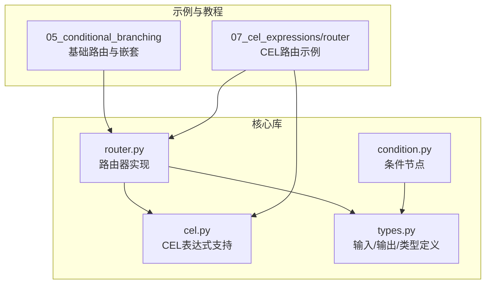
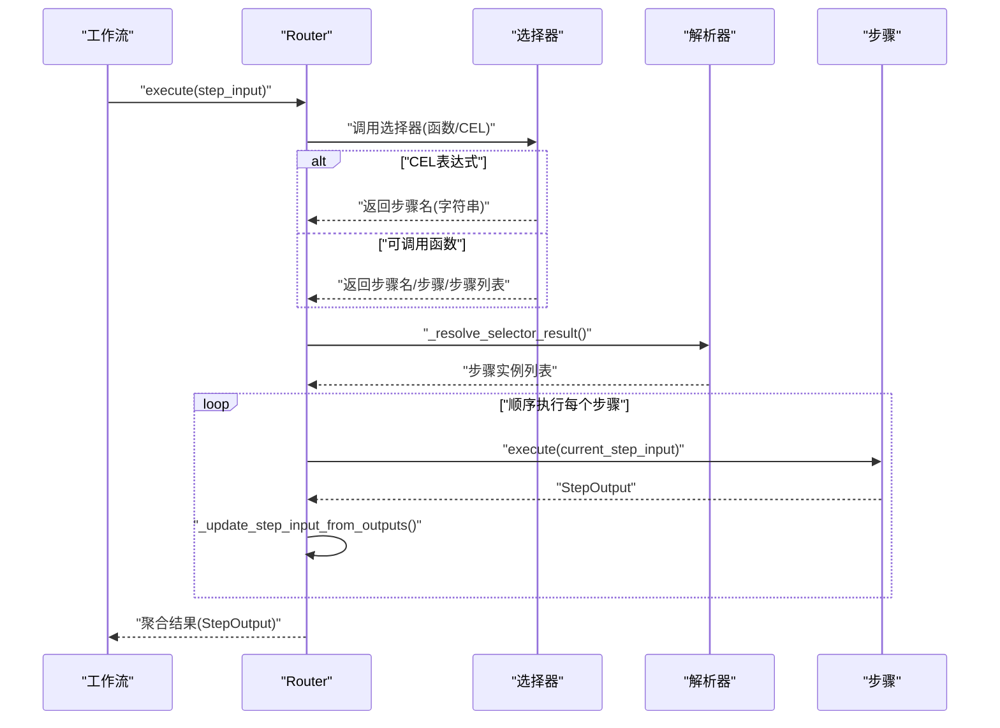
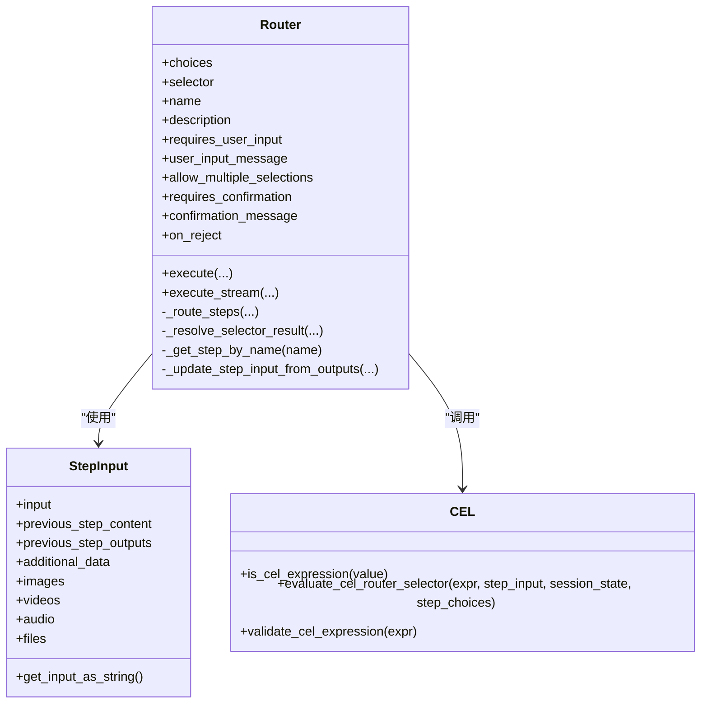
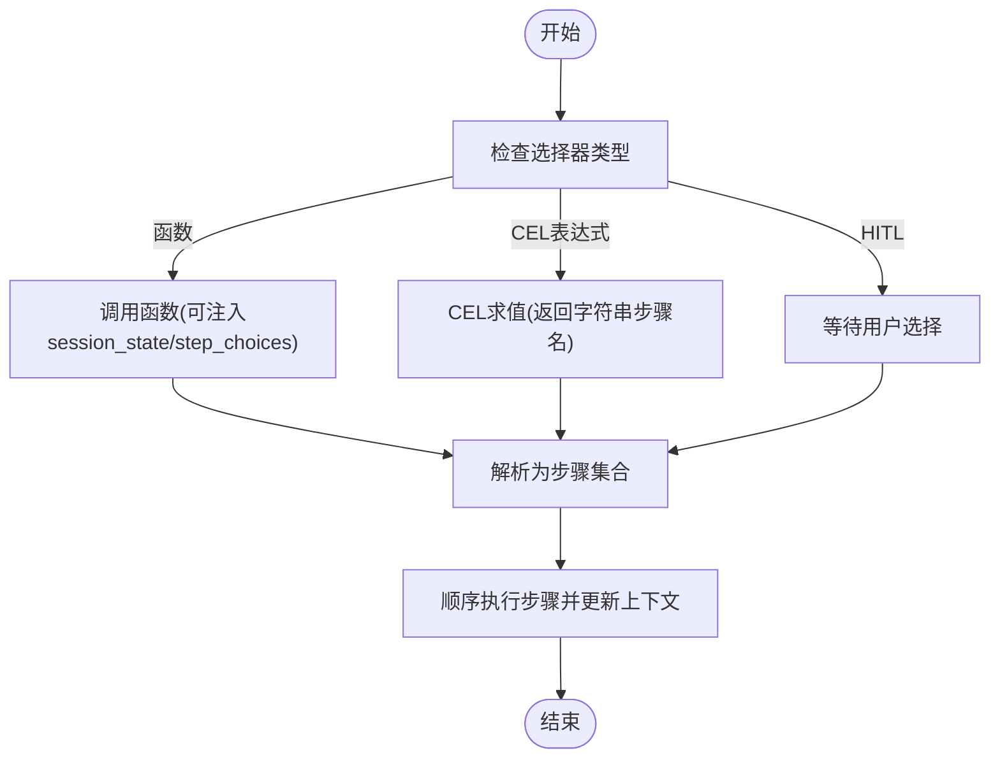
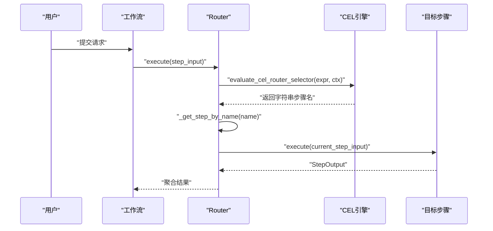
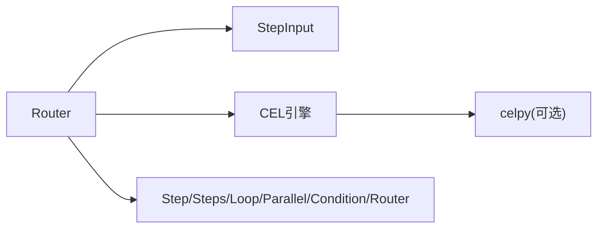

# 条件分支

<cite>
**本文档引用的文件**
- [router.py](file://libs/agno/agno/workflow/router.py)
- [cel.py](file://libs/agno/agno/workflow/cel.py)
- [types.py](file://libs/agno/agno/workflow/types.py)
- [condition.py](file://libs/agno/agno/workflow/condition.py)
- [cel_ternary.py](file://cookbook/04_workflows/07_cel_expressions/router/cel_ternary.py)
- [cel_session_state_route.py](file://cookbook/04_workflows/07_cel_expressions/router/cel_session_state_route.py)
- [cel_using_step_choices.py](file://cookbook/04_workflows/07_cel_expressions/router/cel_using_step_choices.py)
- [router_basic.py](file://cookbook/04_workflows/05_conditional_branching/router_basic.py)
- [string_selector.py](file://cookbook/04_workflows/05_conditional_branching/string_selector.py)
- [nested_choices.py](file://cookbook/04_workflows/05_conditional_branching/nested_choices.py)
- [selector_types.py](file://cookbook/04_workflows/05_conditional_branching/selector_types.py)
- [loop_in_choices.py](file://cookbook/04_workflows/05_conditional_branching/loop_in_choices.py)
- [test_session.py](file://libs/agno/tests/integration/workflows/test_session.py)
</cite>

## 目录
1. [简介](#简介)
2. [项目结构](#项目结构)
3. [核心组件](#核心组件)
4. [架构总览](#架构总览)
5. [详细组件分析](#详细组件分析)
6. [依赖关系分析](#依赖关系分析)
7. [性能考虑](#性能考虑)
8. [故障排查指南](#故障排查指南)
9. [结论](#结论)
10. [附录](#附录)

## 简介
本文件系统化梳理 Agno Learn 的条件分支体系，重点围绕 Router 路由器展开，涵盖其设计理念、实现机制与运行流程。内容包括：
- 路由选择策略：程序化选择器、CEL 表达式选择器、人工介入（HITL）模式
- 分支逻辑与路径管理：字符串选择器、步骤对象选择、列表组合、嵌套容器
- 路由器工作原理：路由规则、匹配算法、决策过程与事件流
- CEL 表达式使用：语法要点、上下文变量、计算逻辑与最佳实践
- 嵌套分支与多级路由：容器化组合、分支合并与路径优化
- 性能优化：路由缓存、预计算与路径索引策略
- 测试与验证：单元测试、集成测试与调试技巧

## 项目结构
条件分支相关的核心代码位于 agno/workflow 包中，配套示例位于 cookbook/04_workflows 下的多个子目录中。整体组织采用“功能域+示例”的方式，便于理解与实操。

**图表来源**
- [router.py:1-120](file://libs/agno/agno/workflow/router.py#L1-L120)
- [cel.py:1-120](file://libs/agno/agno/workflow/cel.py#L1-L120)
- [types.py:98-132](file://libs/agno/agno/workflow/types.py#L98-L132)
- [condition.py:143-174](file://libs/agno/agno/workflow/condition.py#L143-L174)

**章节来源**
- [router.py:1-120](file://libs/agno/agno/workflow/router.py#L1-L120)
- [cel.py:1-120](file://libs/agno/agno/workflow/cel.py#L1-L120)
- [types.py:98-132](file://libs/agno/agno/workflow/types.py#L98-L132)

## 核心组件
- 路由器 Router：动态根据输入选择一个或多个后续步骤执行，支持三种选择模式：程序化选择器、CEL 表达式、人工介入（HITL）。内部维护 choices 列表与名称映射，统一解析字符串、步骤对象与列表结果。
- CEL 表达式引擎：提供表达式校验、上下文构建与求值能力，支持在 Router 选择器中直接使用 CEL 三元、属性访问、集合操作等。
- 步骤输入 StepInput：标准化输入数据结构，包含 input、previous_step_content、previous_step_outputs、additional_data、session_state 等字段，为路由与条件判断提供上下文。
- 条件节点 Condition：与 Router 协同工作，用于分支选择与确认模式，支持会话状态参数。

关键职责与交互：
- Router 将 selector（函数或字符串）转换为具体步骤集合，随后顺序执行并串联上下文。
- CEL 引擎负责将字符串表达式编译并求值，返回字符串步骤名或布尔结果（取决于使用场景）。
- StepInput 提供统一的上下文访问接口，支持递归查询嵌套步骤输出。

**章节来源**
- [router.py:44-108](file://libs/agno/agno/workflow/router.py#L44-L108)
- [cel.py:136-156](file://libs/agno/agno/workflow/cel.py#L136-L156)
- [types.py:98-132](file://libs/agno/agno/workflow/types.py#L98-L132)
- [condition.py:143-174](file://libs/agno/agno/workflow/condition.py#L143-L174)

## 架构总览
下面以序列图展示 Router 的典型执行流程，包括选择器求值、步骤解析与顺序执行。

**图表来源**
- [router.py:544-646](file://libs/agno/agno/workflow/router.py#L544-L646)
- [router.py:393-444](file://libs/agno/agno/workflow/router.py#L393-L444)
- [cel.py:136-156](file://libs/agno/agno/workflow/cel.py#L136-L156)

## 详细组件分析

### 路由器 Router 设计与实现
- 选择器类型
  - 可调用函数：支持 step_input 参数；若函数签名包含 session_state 或 step_choices，则自动注入对应上下文。
  - 字符串表达式：当字符串包含操作符、点号、括号等特征时识别为 CEL 表达式，否则视为函数名。
  - 人工介入（HITL）：requires_user_input 为真时暂停，允许用户从 choices 中选择一个或多个步骤。
- 步骤解析
  - _resolve_selector_result 统一处理字符串名、步骤对象、步骤列表，确保返回步骤实例集合。
  - _get_step_by_name 与 _step_name_map 提供 O(1) 名称到步骤的映射，提升解析效率。
- 执行链路
  - execute 与 execute_stream 两种模式，后者支持事件流输出与中间结果聚合。
  - 每步执行后更新 StepInput，将前一步输出写入 previous_step_outputs，形成链式上下文。
- 事件与日志
  - 支持 RouterExecutionStartedEvent/CompletedEvent，便于可观测性与调试。

**图表来源**
- [router.py:44-108](file://libs/agno/agno/workflow/router.py#L44-L108)
- [router.py:393-444](file://libs/agno/agno/workflow/router.py#L393-L444)
- [router.py:544-646](file://libs/agno/agno/workflow/router.py#L544-L646)
- [types.py:98-132](file://libs/agno/agno/workflow/types.py#L98-L132)
- [cel.py:87-96](file://libs/agno/agno/workflow/cel.py#L87-L96)
- [cel.py:136-156](file://libs/agno/agno/workflow/cel.py#L136-L156)

**章节来源**
- [router.py:44-108](file://libs/agno/agno/workflow/router.py#L44-L108)
- [router.py:393-444](file://libs/agno/agno/workflow/router.py#L393-L444)
- [router.py:544-646](file://libs/agno/agno/workflow/router.py#L544-L646)

### 路由规则、匹配算法与决策过程
- 规则来源
  - 程序化选择器：基于业务逻辑返回步骤名、步骤对象或步骤列表。
  - CEL 表达式：基于上下文变量进行布尔/字符串判定，返回步骤名。
  - HITL：用户手动选择，支持单选或多选。
- 匹配与解析
  - 字符串名：通过 _step_name_map 快速定位步骤。
  - 步骤对象：校验是否在 choices 内，避免越界配置。
  - 列表：递归解析，支持嵌套容器。
- 决策过程
  - 先评估选择器，再解析为步骤集合，最后顺序执行并更新上下文。

**图表来源**
- [router.py:456-491](file://libs/agno/agno/workflow/router.py#L456-L491)
- [router.py:393-444](file://libs/agno/agno/workflow/router.py#L393-L444)

**章节来源**
- [router.py:456-491](file://libs/agno/agno/workflow/router.py#L456-L491)
- [router.py:393-444](file://libs/agno/agno/workflow/router.py#L393-L444)

### 路由器上下文与变量
- 输入上下文
  - input：原始输入字符串化表示
  - previous_step_content：上一步输出内容字符串
  - previous_step_outputs：按步骤名映射的输出字符串字典
  - additional_data：附加数据
  - session_state：会话状态
  - step_choices：当前 Router 的可用步骤名列表（仅 Router 选择器）
- 访问与序列化
  - _build_step_input_context 将 StepInput 映射为 CEL 上下文，支持 BaseModel/Dict/List 的序列化。

**章节来源**
- [cel.py:136-156](file://libs/agno/agno/workflow/cel.py#L136-L156)
- [cel.py:229-266](file://libs/agno/agno/workflow/cel.py#L229-L266)
- [types.py:98-132](file://libs/agno/agno/workflow/types.py#L98-L132)

### 路由器类型与应用场景
- 字符串选择器
  - 返回步骤名字符串，Router 通过名称映射到具体步骤。
  - 适合简单、稳定的路由策略。
- 步骤对象选择
  - 直接返回 Step/Container 对象，便于动态组合与复用。
- 列表与嵌套选择
  - 返回步骤列表，支持多分支并行或顺序组合。
  - 嵌套列表会被包装为 Steps 容器，形成顺序执行的子流程。

**章节来源**
- [string_selector.py:49-56](file://cookbook/04_workflows/05_conditional_branching/string_selector.py#L49-L56)
- [selector_types.py:46-53](file://cookbook/04_workflows/05_conditional_branching/selector_types.py#L46-L53)
- [nested_choices.py:28-36](file://cookbook/04_workflows/05_conditional_branching/nested_choices.py#L28-L36)
- [router.py:290-314](file://libs/agno/agno/workflow/router.py#L290-L314)

### CEL 表达式使用详解
- 语法与变量
  - 支持三元运算符、属性访问、比较与逻辑运算。
  - 可访问 input、previous_step_content、previous_step_outputs、additional_data、session_state、step_choices。
- 求值与类型转换
  - Router 选择器期望返回字符串步骤名，引擎会将非字符串结果转换为字符串。
  - 条件节点期望返回布尔值，引擎会将非布尔结果转换为布尔。
- 示例场景
  - 基于输入关键词的二元路由（三元表达式）
  - 基于会话状态的偏好路由
  - 基于 step_choices 索引的动态路由

**图表来源**
- [cel_ternary.py:46-54](file://cookbook/04_workflows/07_cel_expressions/router/cel_ternary.py#L46-L54)
- [cel_session_state_route.py:46-54](file://cookbook/04_workflows/07_cel_expressions/router/cel_session_state_route.py#L46-L54)
- [cel_using_step_choices.py:55-60](file://cookbook/04_workflows/07_cel_expressions/router/cel_using_step_choices.py#L55-L60)
- [cel.py:136-156](file://libs/agno/agno/workflow/cel.py#L136-L156)

**章节来源**
- [cel.py:136-156](file://libs/agno/agno/workflow/cel.py#L136-L156)
- [cel.py:174-197](file://libs/agno/agno/workflow/cel.py#L174-L197)
- [cel_ternary.py:46-54](file://cookbook/04_workflows/07_cel_expressions/router/cel_ternary.py#L46-L54)
- [cel_session_state_route.py:46-54](file://cookbook/04_workflows/07_cel_expressions/router/cel_session_state_route.py#L46-L54)
- [cel_using_step_choices.py:55-60](file://cookbook/04_workflows/07_cel_expressions/router/cel_using_step_choices.py#L55-L60)

### 嵌套分支与多级路由
- 嵌套容器
  - choices 中的列表会被包装为 Steps 容器，形成顺序子流程。
- 多级路由
  - Router 可作为另一个 Router 的选择结果，实现多级分发。
- 分支合并与路径优化
  - 通过 _update_step_input_from_outputs 将每步输出合并到上下文中，便于后续步骤共享信息。
  - 建议在复杂场景中对 choices 进行分组与命名规范，减少歧义与错误。

**章节来源**
- [router.py:290-314](file://libs/agno/agno/workflow/router.py#L290-L314)
- [loop_in_choices.py:41-45](file://cookbook/04_workflows/05_conditional_branching/loop_in_choices.py#L41-L45)
- [nested_choices.py:28-36](file://cookbook/04_workflows/05_conditional_branching/nested_choices.py#L28-L36)

### 实用示例与工作流构建
- 基础路由（程序化选择器）
  - 根据主题关键字选择不同研究步骤，最终统一发布内容。
- 字符串选择器
  - 返回步骤名字符串，简洁直观。
- 嵌套选择与动态选择
  - 支持 step_choices 参数，动态引用 choices 中的步骤。
- CEL 路由
  - 三元表达式、会话状态路由、基于索引的动态路由。

**章节来源**
- [router_basic.py:64-91](file://cookbook/04_workflows/05_conditional_branching/router_basic.py#L64-L91)
- [string_selector.py:49-56](file://cookbook/04_workflows/05_conditional_branching/string_selector.py#L49-L56)
- [selector_types.py:92-107](file://cookbook/04_workflows/05_conditional_branching/selector_types.py#L92-L107)
- [cel_ternary.py:46-54](file://cookbook/04_workflows/07_cel_expressions/router/cel_ternary.py#L46-L54)
- [cel_session_state_route.py:46-54](file://cookbook/04_workflows/07_cel_expressions/router/cel_session_state_route.py#L46-L54)
- [cel_using_step_choices.py:55-60](file://cookbook/04_workflows/07_cel_expressions/router/cel_using_step_choices.py#L55-L60)

## 依赖关系分析
- 组件耦合
  - Router 依赖 StepInput、CEL 引擎与步骤容器（Step/Steps/Loop/Parallel/Condition/Router）。
  - CEL 引擎依赖 celpy（可选），提供表达式编译与求值。
- 外部依赖
  - 可选依赖 cel-python，用于启用 CEL 表达式功能。
- 接口契约
  - 选择器函数签名灵活：可选 session_state 与 step_choices 参数。
  - Router 通过名称映射与容器包装实现统一解析。

**图表来源**
- [router.py:18-19](file://libs/agno/agno/workflow/router.py#L18-L19)
- [cel.py:12-29](file://libs/agno/agno/workflow/cel.py#L12-L29)

**章节来源**
- [router.py:18-19](file://libs/agno/agno/workflow/router.py#L18-L19)
- [cel.py:12-29](file://libs/agno/agno/workflow/cel.py#L12-L29)

## 性能考虑
- 路由缓存
  - 利用 _step_name_map 建立名称到步骤的哈希映射，O(1) 查找，避免重复遍历。
- 预计算与上下文
  - 将 previous_step_outputs 合并到当前上下文，减少重复计算与跨步骤传输成本。
- 路径索引
  - 在复杂嵌套场景中，建议对 choices 进行分组与命名规范，降低解析歧义与错误概率。
- 表达式优化
  - 在 CEL 表达式中优先使用已存在的上下文变量，避免重复构造大对象。
- 并行与顺序
  - 当分支较多时，可结合 Parallel 组件实现并行加速，但需注意资源竞争与输出合并。

[本节为通用指导，无需特定文件引用]

## 故障排查指南
- CEL 未安装
  - 现象：使用 CEL 表达式时报错或返回空结果。
  - 处理：安装 cel-python，或改用程序化选择器。
- 未知步骤名
  - 现象：选择器返回步骤名不在 choices 中。
  - 处理：检查名称拼写与大小写，确保与 Step.name 一致。
- 会话状态未生效
  - 现象：依赖 session_state 的选择器未读取最新值。
  - 处理：确认选择器函数签名包含 session_state 参数，并在工作流运行时传入 session_state。
- 嵌套容器问题
  - 现象：嵌套列表未按预期顺序执行。
  - 处理：确认嵌套被正确包装为 Steps 容器，必要时显式声明步骤名。
- 测试验证
  - 单元/集成测试覆盖了 Router 与 Condition 的会话状态交互，可参考相应测试用例进行回归验证。

**章节来源**
- [router.py:460-473](file://libs/agno/agno/workflow/router.py#L460-L473)
- [router.py:414-420](file://libs/agno/agno/workflow/router.py#L414-L420)
- [test_session.py:212-289](file://libs/agno/tests/integration/workflows/test_session.py#L212-L289)

## 结论
Agno Learn 的条件分支系统以 Router 为核心，结合程序化选择器、CEL 表达式与人工介入（HITL）三种模式，提供了灵活而强大的路由能力。通过统一的上下文模型与容器化设计，系统能够支持从简单到复杂的多级路由与嵌套组合。配合 CEL 表达式与会话状态，开发者可以快速构建可维护、可观测且高性能的条件分支工作流。

[本节为总结性内容，无需特定文件引用]

## 附录
- 相关示例文件路径
  - 基础路由：[router_basic.py](file://cookbook/04_workflows/05_conditional_branching/router_basic.py)
  - 字符串选择器：[string_selector.py](file://cookbook/04_workflows/05_conditional_branching/string_selector.py)
  - 嵌套选择：[nested_choices.py](file://cookbook/04_workflows/05_conditional_branching/nested_choices.py)
  - 选择器类型：[selector_types.py](file://cookbook/04_workflows/05_conditional_branching/selector_types.py)
  - 循环在选择中：[loop_in_choices.py](file://cookbook/04_workflows/05_conditional_branching/loop_in_choices.py)
  - CEL 三元路由：[cel_ternary.py](file://cookbook/04_workflows/07_cel_expressions/router/cel_ternary.py)
  - CEL 会话状态路由：[cel_session_state_route.py](file://cookbook/04_workflows/07_cel_expressions/router/cel_session_state_route.py)
  - CEL 使用 step_choices：[cel_using_step_choices.py](file://cookbook/04_workflows/07_cel_expressions/router/cel_using_step_choices.py)

[本节为补充材料，无需特定文件引用]