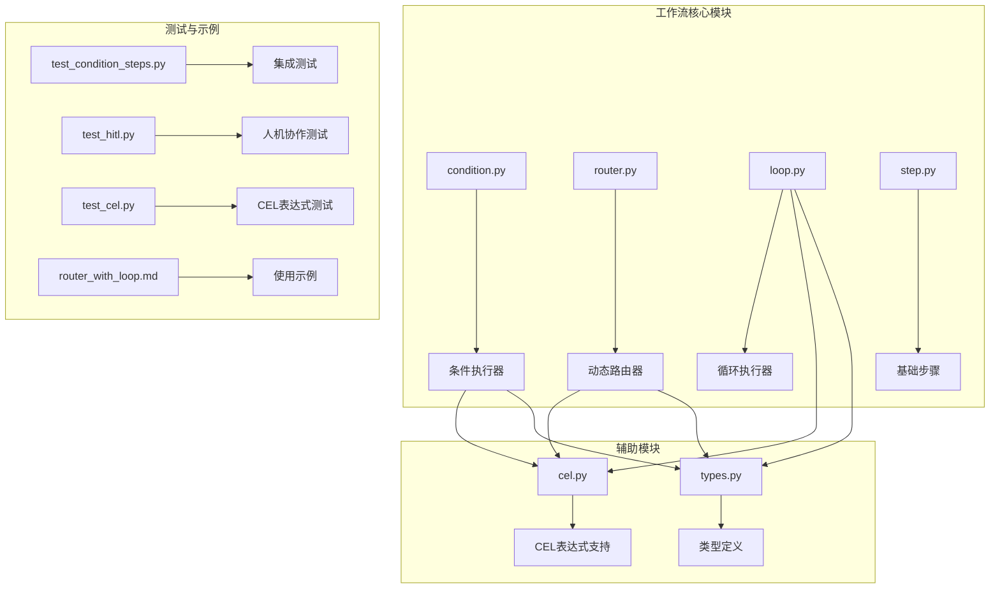
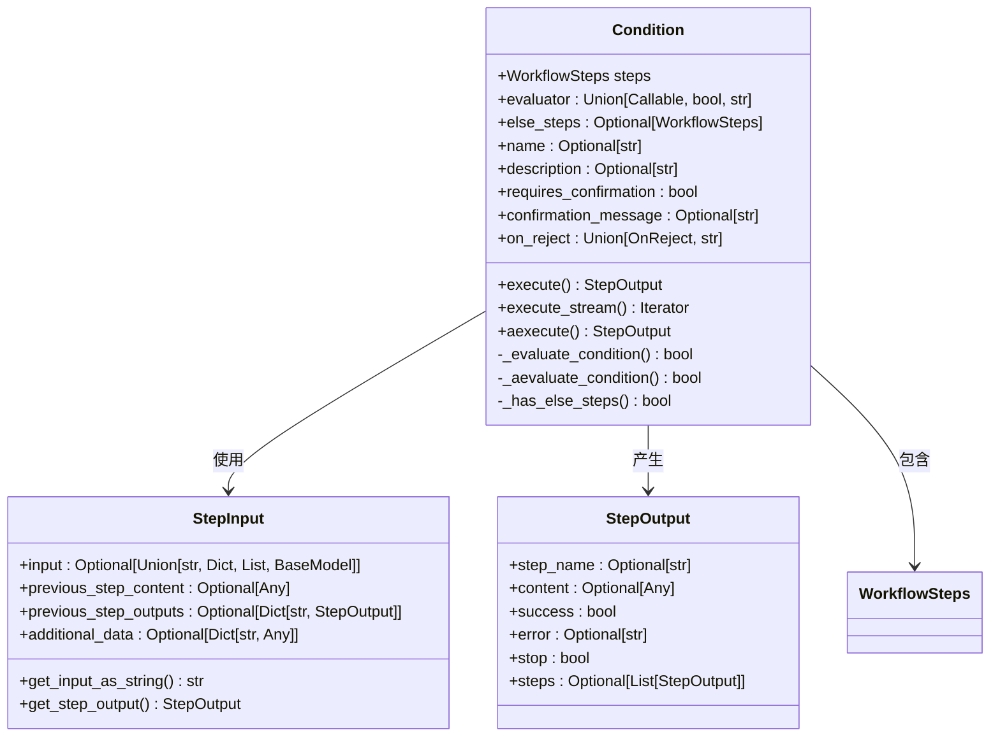
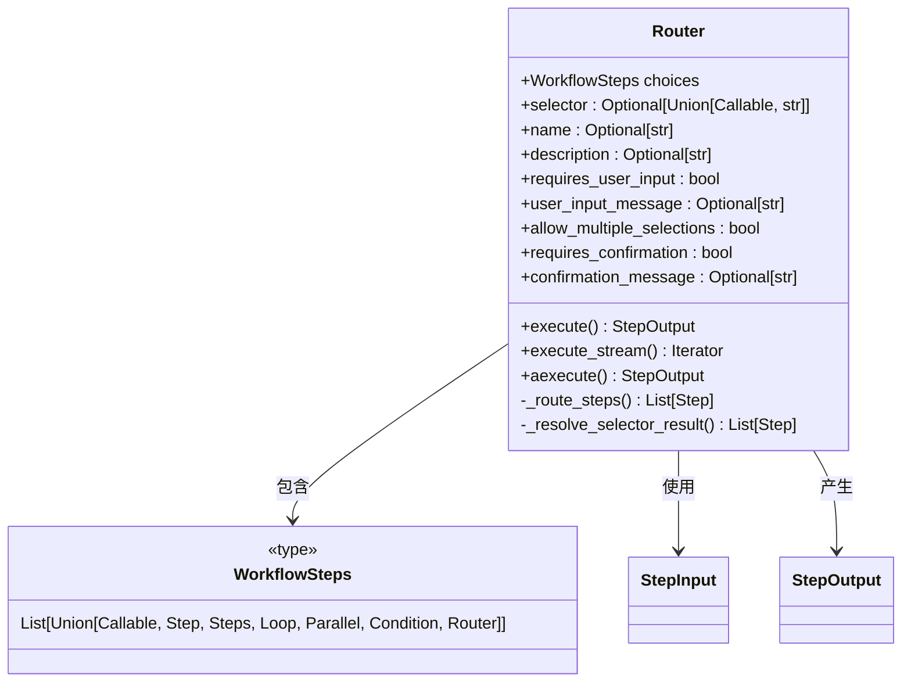
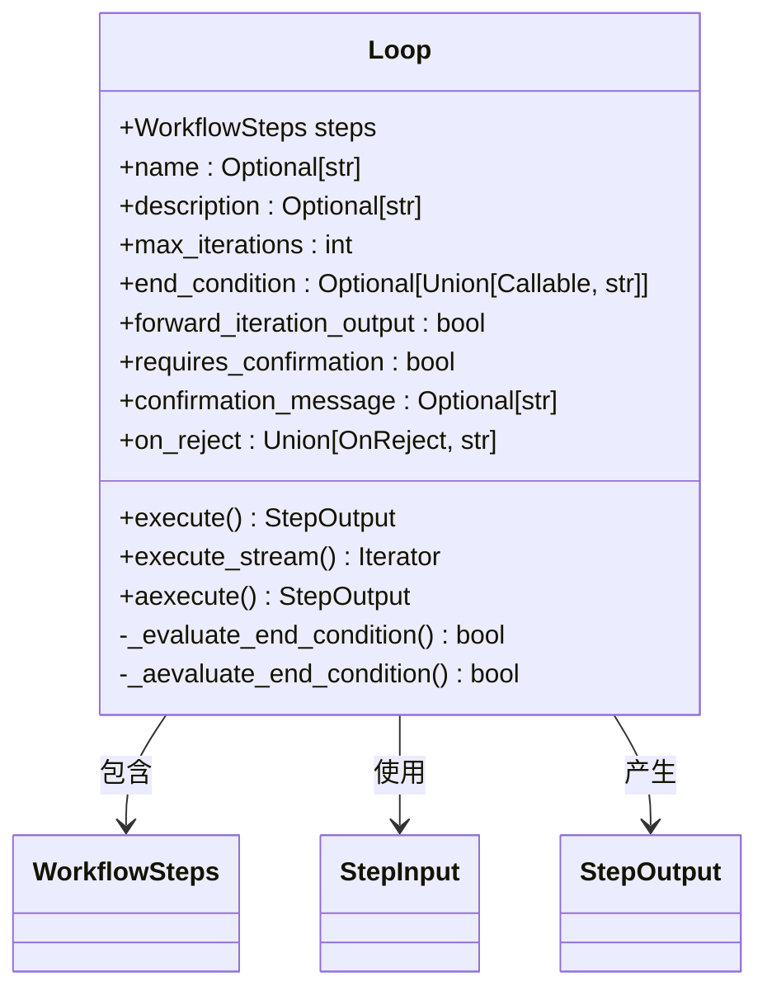
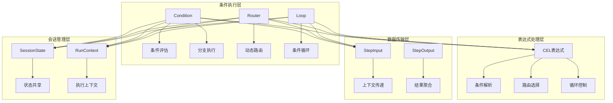
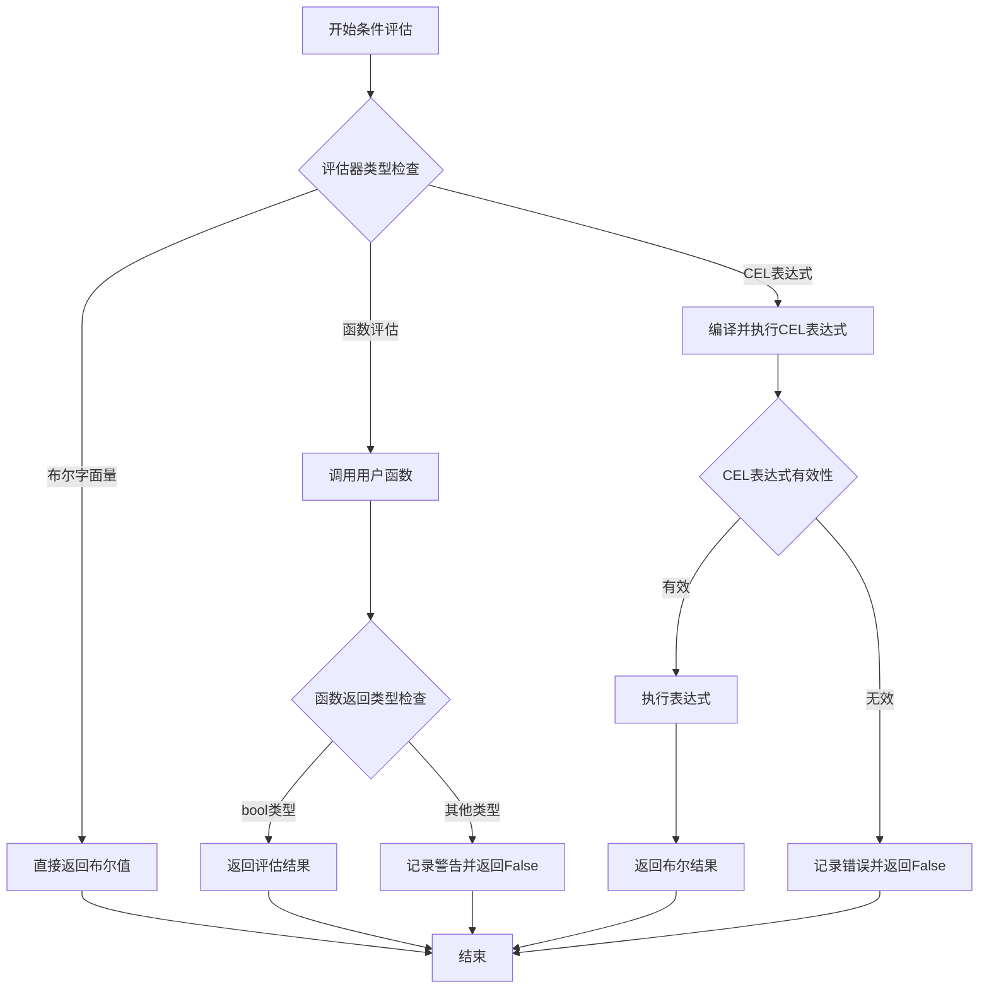
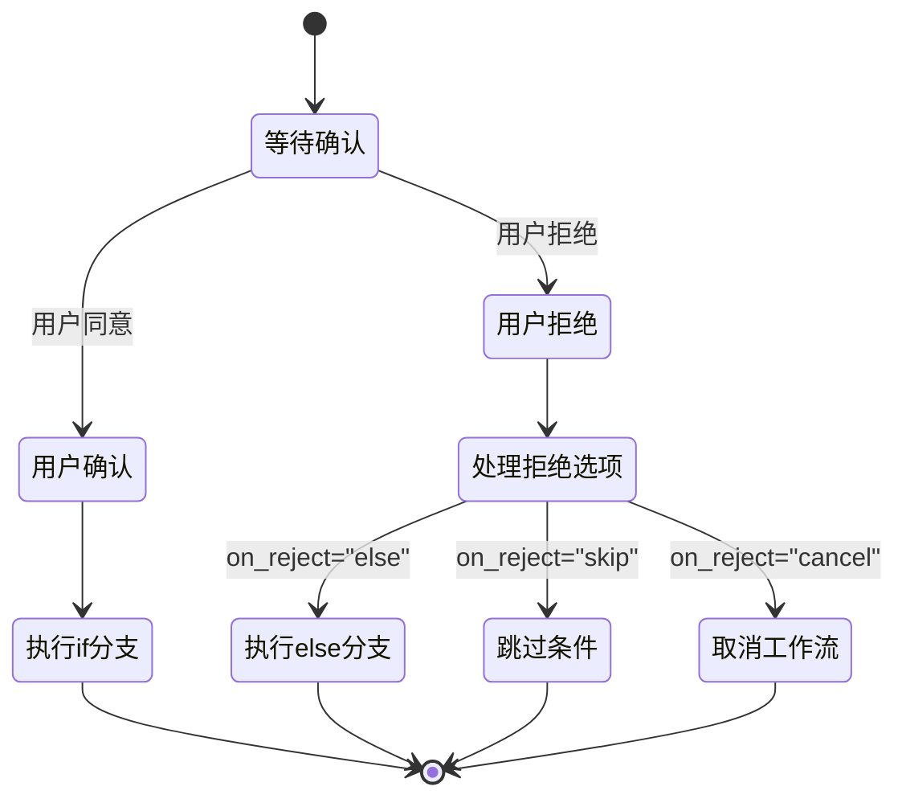
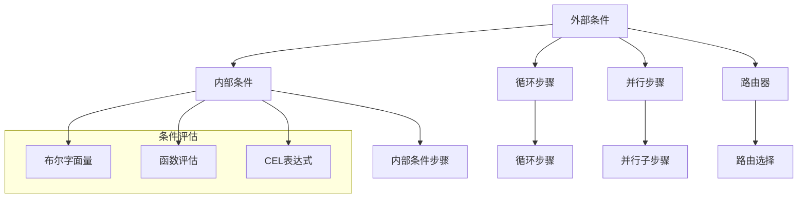
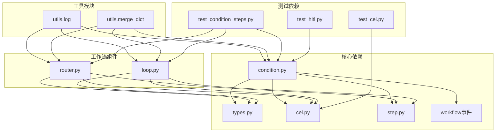
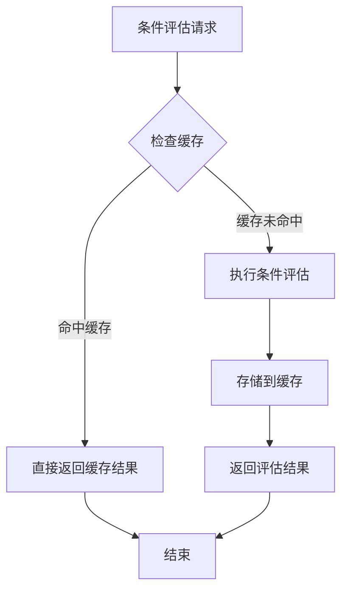

# 条件执行

<cite>
**本文档引用的文件**
- [condition.py](file://libs/agno/agno/workflow/condition.py)
- [router.py](file://libs/agno/agno/workflow/router.py)
- [loop.py](file://libs/agno/agno/workflow/loop.py)
- [cel.py](file://libs/agno/agno/workflow/cel.py)
- [types.py](file://libs/agno/agno/workflow/types.py)
- [step.py](file://libs/agno/agno/workflow/step.py)
- [test_condition_steps.py](file://libs/agno/tests/integration/workflows/test_condition_steps.py)
- [test_hitl.py](file://libs/agno/tests/unit/workflow/test_hitl.py)
- [test_cel.py](file://libs/agno/tests/unit/workflow/test_cel.py)
- [router_with_loop.md](file://cookbook/04_workflows/05_conditional_branching/router_with_loop.md)
</cite>

## 目录
1. [简介](#简介)
2. [项目结构](#项目结构)
3. [核心组件](#核心组件)
4. [架构概览](#架构概览)
5. [详细组件分析](#详细组件分析)
6. [依赖关系分析](#依赖关系分析)
7. [性能考虑](#性能考虑)
8. [故障排除指南](#故障排除指南)
9. [结论](#结论)
10. [附录](#附录)

## 简介

Agno Learn 的条件执行系统是工作流引擎的核心功能之一，它允许开发者根据动态条件来控制工作流的执行路径。该系统提供了灵活的条件判断机制，支持布尔表达式、比较操作、逻辑运算以及复杂的嵌套条件。

条件执行系统的主要特点包括：
- **多样的条件评估方式**：支持布尔字面量、可调用函数、CEL（Common Expression Language）表达式
- **分支逻辑控制**：基于条件结果选择不同的执行路径
- **动态路由能力**：结合路由器实现智能的工作流导航
- **人机协作模式**：支持用户确认和拒绝的交互式决策
- **嵌套执行支持**：条件步骤可以包含其他工作流组件（循环、并行、条件等）

## 项目结构

Agno Learn 的条件执行系统主要位于 `libs/agno/agno/workflow/` 目录下，包含以下核心文件：



**图表来源**
- [condition.py:1-1166](file://libs/agno/agno/workflow/condition.py#L1-1166)
- [router.py:1-1081](file://libs/agno/agno/workflow/router.py#L1-1081)
- [loop.py:1-964](file://libs/agno/agno/workflow/loop.py#L1-964)

**章节来源**
- [condition.py:1-1166](file://libs/agno/agno/workflow/condition.py#L1-1166)
- [router.py:1-1081](file://libs/agno/agno/workflow/router.py#L1-1081)
- [loop.py:1-964](file://libs/agno/agno/workflow/loop.py#L1-964)

## 核心组件

### 条件执行器（Condition）

条件执行器是工作流中最核心的组件，负责根据条件评估结果来决定执行路径。它支持三种类型的条件评估器：

1. **布尔字面量**：直接返回 True 或 False
2. **可调用函数**：接受 StepInput 参数并返回布尔值
3. **CEL 表达式**：使用 Common Expression Language 编写的条件表达式



**图表来源**
- [condition.py:41-135](file://libs/agno/agno/workflow/condition.py#L41-135)
- [types.py:98-132](file://libs/agno/agno/workflow/types.py#L98-132)
- [types.py:334-442](file://libs/agno/agno/workflow/types.py#L334-442)

### 动态路由器（Router）

动态路由器提供了基于输入内容的智能路由功能，可以根据条件选择不同的执行路径。它支持程序化选择、CEL 表达式和人机协作三种模式。



**图表来源**
- [router.py:44-108](file://libs/agno/agno/workflow/router.py#L44-108)
- [router.py:29-41](file://libs/agno/agno/workflow/router.py#L29-41)

### 循环执行器（Loop）

循环执行器实现了条件驱动的重复执行机制，通过结束条件来控制循环的终止。它支持最大迭代次数限制和自定义结束条件。



**图表来源**
- [loop.py:39-106](file://libs/agno/agno/workflow/loop.py#L39-106)
- [loop.py:24-36](file://libs/agno/agno/workflow/loop.py#L24-36)

## 架构概览

Agno Learn 的条件执行系统采用模块化设计，各个组件之间通过清晰的接口进行交互。系统的核心架构如下：



**图表来源**
- [condition.py:298-380](file://libs/agno/agno/workflow/condition.py#L298-380)
- [router.py:456-531](file://libs/agno/agno/workflow/router.py#L456-531)
- [loop.py:224-281](file://libs/agno/agno/workflow/loop.py#L224-281)

## 详细组件分析

### 条件执行器实现详解

条件执行器是整个系统的核心，它实现了完整的条件评估和分支执行逻辑。让我们深入分析其关键实现细节：

#### 条件评估机制

条件执行器支持三种不同的条件评估方式：

1. **布尔字面量评估**：直接返回预定义的布尔值
2. **函数评估**：调用用户提供的函数进行动态评估
3. **CEL 表达式评估**：使用 Common Expression Language 进行复杂条件判断



**图表来源**
- [condition.py:298-334](file://libs/agno/agno/workflow/condition.py#L298-334)
- [cel.py:68-84](file://libs/agno/agno/workflow/cel.py#L68-84)

#### 分支执行逻辑

条件执行器根据评估结果选择相应的执行分支：

```mermaid
sequenceDiagram
participant W as 工作流
participant C as 条件执行器
participant IF as if分支
participant ELSE as else分支
W->>C : 执行条件
C->>C : 评估条件
C->>C : 检查评估结果
alt 条件为真
C->>IF : 执行if分支步骤
IF-->>C : 返回执行结果
C-->>W : 返回if分支结果
else 条件为假
alt 存在else分支
C->>ELSE : 执行else分支步骤
ELSE-->>C : 返回执行结果
C-->>W : 返回else分支结果
else 不存在else分支
C-->>W : 返回跳过消息
end
end
```

**图表来源**
- [condition.py:411-546](file://libs/agno/agno/workflow/condition.py#L411-546)
- [condition.py:548-780](file://libs/agno/agno/workflow/condition.py#L548-780)

#### 人机协作模式

条件执行器支持人机协作模式，允许用户在执行前进行确认或拒绝：



**图表来源**
- [condition.py:67-75](file://libs/agno/agno/workflow/condition.py#L67-75)
- [types.py:19-31](file://libs/agno/agno/workflow/types.py#L19-31)

**章节来源**
- [condition.py:298-380](file://libs/agno/agno/workflow/condition.py#L298-380)
- [condition.py:411-546](file://libs/agno/agno/workflow/condition.py#L411-546)
- [condition.py:548-780](file://libs/agno/agno/workflow/condition.py#L548-780)

### CEL 表达式系统

CEL（Common Expression Language）是条件执行系统的重要组成部分，它提供了强大的表达式计算能力：

#### CEL 表达式支持

CEL 表达式支持多种操作类型：

1. **比较操作**：等于、不等于、大于、小于、大于等于、小于等于
2. **逻辑操作**：与（&&）、或（||）、非（!）
3. **算术操作**：加、减、乘、除、取模
4. **字符串操作**：包含、长度、格式化
5. **条件操作**：三元运算符（? :）

#### 上下文变量

CEL 表达式可以访问以下上下文变量：

- `input`: 工作流输入内容
- `previous_step_content`: 上一步骤的内容
- `previous_step_outputs`: 所有先前步骤的输出映射
- `additional_data`: 传递给工作流的额外数据
- `session_state`: 会话状态值

**章节来源**
- [cel.py:68-97](file://libs/agno/agno/workflow/cel.py#L68-97)
- [cel.py:99-157](file://libs/agno/agno/workflow/cel.py#L99-157)
- [cel.py:229-266](file://libs/agno/agno/workflow/cel.py#L229-266)

### 高级条件组合

条件执行系统支持复杂的条件组合和嵌套结构：

#### 嵌套条件执行

条件执行器可以包含其他工作流组件，形成复杂的执行结构：



**图表来源**
- [condition.py:226-257](file://libs/agno/agno/workflow/condition.py#L226-257)
- [router_with_loop.md:76-98](file://cookbook/04_workflows/05_conditional_branching/router_with_loop.md#L76-L98)

**章节来源**
- [router_with_loop.md:52-106](file://cookbook/04_workflows/05_conditional_branching/router_with_loop.md#L52-L106)

## 依赖关系分析

条件执行系统的依赖关系相对简洁，主要依赖于以下核心模块：



**图表来源**
- [condition.py:1-25](file://libs/agno/agno/workflow/condition.py#L1-25)
- [router.py:1-27](file://libs/agno/agno/workflow/router.py#L1-27)
- [loop.py:1-22](file://libs/agno/agno/workflow/loop.py#L1-22)

### 组件耦合度分析

条件执行系统的组件具有良好的内聚性和较低的耦合度：

1. **条件执行器**：独立处理条件评估和分支逻辑
2. **表达式处理器**：专注于CEL表达式的解析和执行
3. **数据传输层**：提供统一的数据结构和接口
4. **会话管理层**：处理状态共享和上下文传递

这种设计使得每个组件都有明确的职责分工，便于维护和扩展。

**章节来源**
- [condition.py:1-25](file://libs/agno/agno/workflow/condition.py#L1-25)
- [router.py:1-27](file://libs/agno/agno/workflow/router.py#L1-27)
- [loop.py:1-22](file://libs/agno/agno/workflow/loop.py#L1-22)

## 性能考虑

条件执行系统在设计时充分考虑了性能优化，以下是主要的性能优化策略：

### 条件缓存机制

系统实现了条件结果的缓存机制，避免重复计算相同的条件表达式：



### 预计算优化

对于静态条件（布尔字面量），系统会在初始化时进行预计算，避免运行时的重复评估。

### 延迟求值策略

系统采用延迟求值策略，只有在需要时才执行条件评估，减少不必要的计算开销。

### 异步执行支持

条件执行器支持异步执行模式，适用于需要等待外部资源的条件评估场景。

## 故障排除指南

### 常见问题诊断

#### 条件评估失败

当条件评估失败时，系统会记录详细的错误信息：

1. **CEL 表达式语法错误**：检查表达式语法是否正确
2. **函数返回类型错误**：确保条件函数返回布尔值
3. **上下文变量缺失**：验证所需的上下文变量是否存在

#### 分支执行异常

如果分支执行过程中出现异常，系统会：

1. 记录异常详情和堆栈跟踪
2. 尝试执行 else 分支（如果存在）
3. 在 else 分支不存在时返回跳过消息

#### 人机协作问题

当使用人机协作模式时，可能出现以下问题：

1. **用户输入验证失败**：检查用户输入是否符合预期格式
2. **拒绝处理配置错误**：验证 on_reject 配置是否正确
3. **会话状态同步问题**：确保会话状态在各步骤间正确传递

**章节来源**
- [test_condition_steps.py:662-689](file://libs/agno/tests/integration/workflows/test_condition_steps.py#L662-689)
- [test_hitl.py:1265-1302](file://libs/agno/tests/unit/workflow/test_hitl.py#L1265-1302)
- [test_cel.py:67-312](file://libs/agno/tests/unit/workflow/test_cel.py#L67-312)

## 结论

Agno Learn 的条件执行系统是一个功能强大且设计精良的工作流控制机制。它通过灵活的条件评估方式、智能的分支逻辑控制和完善的错误处理机制，为开发者提供了构建复杂业务逻辑的强大工具。

系统的主要优势包括：

1. **高度灵活性**：支持多种条件评估方式和执行模式
2. **强大的表达式支持**：CEL 表达式提供了丰富的条件判断能力
3. **良好的扩展性**：模块化设计便于添加新的执行器类型
4. **完善的错误处理**：提供了全面的错误诊断和恢复机制
5. **人机协作友好**：支持用户参与的决策过程

通过合理使用条件执行系统，开发者可以构建出既灵活又可靠的智能工作流，满足各种复杂的业务需求。

## 附录

### 使用示例

以下是一些常见的条件执行使用场景：

#### 基本条件判断

```python
# 简单的布尔条件
condition = Condition(
    name="简单条件",
    evaluator=True,
    steps=[some_step]
)

# 函数条件
def check_user_role(step_input):
    return step_input.additional_data.get("user_role") == "admin"

condition = Condition(
    name="权限检查",
    evaluator=check_user_role,
    steps=[admin_step],
    else_steps=[regular_step]
)
```

#### 复杂条件表达式

```python
# 使用CEL表达式
condition = Condition(
    name="复杂条件",
    evaluator='input.contains("urgent") && session_state.user_level > 3',
    steps=[priority_step],
    else_steps=[normal_step]
)
```

#### 嵌套条件结构

```python
# 嵌套条件执行
condition = Condition(
    name="嵌套条件",
    evaluator=complex_condition,
    steps=[
        Condition(
            name="内部条件",
            evaluator=inner_condition,
            steps=[inner_step]
        ),
        Loop(
            name="条件循环",
            steps=[loop_step],
            end_condition=end_condition
        )
    ]
)
```

### 最佳实践

1. **条件设计原则**：保持条件表达式的简洁性和可读性
2. **错误处理策略**：为所有条件评估提供适当的错误处理机制
3. **性能优化**：对频繁使用的条件实施缓存策略
4. **测试覆盖**：为所有条件逻辑编写充分的测试用例
5. **文档维护**：及时更新条件逻辑的文档说明