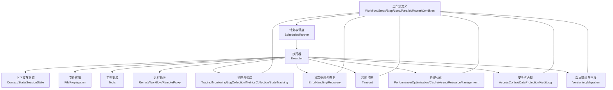
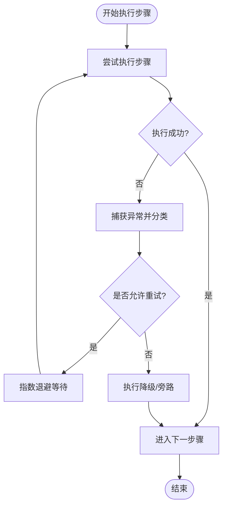
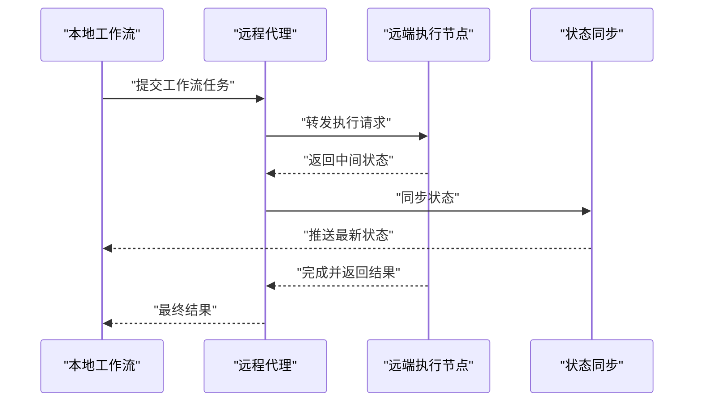
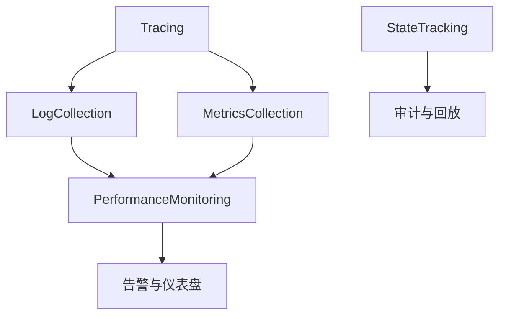
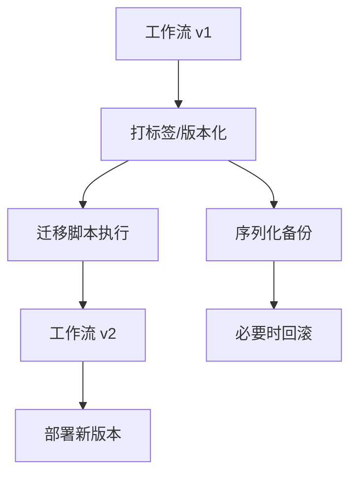

# 高级概念

<cite>
**本文引用的文件**
- [libs/agno/agno/workflow/__init__.py](file://libs/agno/agno/workflow/__init__.py)
- [cookbook/04_workflows/06_advanced_concepts/run_control/remote_workflow.py](file://cookbook/04_workflows/06_advanced_concepts/run_control/remote_workflow.py)
- [cookbook/04_workflows/06_advanced_concepts/run_control/workflow_cli.py](file://cookbook/04_workflows/06_advanced_concepts/run_control/workflow_cli.py)
- [cookbook/04_workflows/06_advanced_concepts/run_control/workflow_serialization.py](file://cookbook/04_workflows/06_advanced_concepts/run_control/workflow_serialization.py)
- [cookbook/04_workflows/06_advanced_concepts/file_propagation/file_generation_workflow.py](file://cookbook/04_workflows/06_advanced_concepts/file_propagation/file_generation_workflow.py)
- [cookbook/04_workflows/06_advanced_concepts/early_stopping/early_stop_basic.py](file://cookbook/04_workflows/06_advanced_concepts/early_stopping/early_stop_basic.py)
- [cookbook/04_workflows/06_advanced_concepts/early_stopping/early_stop_condition.py](file://cookbook/04_workflows/06_advanced_concepts/early_stopping/early_stop_condition.py)
- [cookbook/04_workflows/06_advanced_concepts/early_stopping/early_stop_loop.py](file://cookbook/04_workflows/06_advanced_concepts/early_stopping/early_stop_loop.py)
- [cookbook/04_workflows/06_advanced_concepts/early_stopping/early_stop_parallel.py](file://cookbook/04_workflows/06_advanced_concepts/early_stopping/early_stop_parallel.py)
- [cookbook/04_workflows/06_advanced_concepts/history/continuous_execution.py](file://cookbook/04_workflows/06_advanced_concepts/history/continuous_execution.py)
- [cookbook/04_workflows/06_advanced_concepts/history/history_in_function.py](file://cookbook/04_workflows/06_advanced_concepts/history/history_in_function.py)
- [cookbook/04_workflows/06_advanced_concepts/session_state/session_state_advanced.py](file://cookbook/04_workflows/06_advanced_concepts/session_state/session_state_advanced.py)
- [cookbook/04_workflows/06_advanced_concepts/session_state/session_state_manual_update.py](file://cookbook/04_workflows/06_advanced_concepts/session_state/session_state_manual_update.py)
- [cookbook/04_workflows/06_advanced_concepts/session_state/session_state_events.py](file://cookbook/04_workflows/06_advanced_concepts/session_state/session_state_events.py)
- [cookbook/04_workflows/06_advanced_concepts/tools/workflow_tools.py](file://cookbook/04_workflows/06_advanced_concepts/tools/workflow_tools.py)
- [cookbook/04_workflows/06_advanced_concepts/workflow_agent/basic_workflow_agent.py](file://cookbook/04_workflows/06_advanced_concepts/workflow_agent/basic_workflow_agent.py)
- [cookbook/04_workflows/06_advanced_concepts/workflow_agent/workflow_agent_with_condition.py](file://cookbook/04_workflows/06_advanced_concepts/workflow_agent/workflow_agent_with_condition.py)
- [cookbook/05_agent_os/tracing/05_basic_workflow_tracing.md](file://cookbook/05_agent_os/tracing/05_basic_workflow_tracing.md)
- [cookbook/05_agent_os/workflow/workflow_with_nested_steps.md](file://cookbook/05_agent_os/workflow/workflow_with_nested_steps.md)
- [cookbook/06_storage/in_memory/in_memory_storage_for_workflow.md](file://cookbook/06_storage/in_memory/in_memory_storage_for_workflow.md)
- [cookbook/06_storage/json_db/json_for_workflows.md](file://cookbook/06_storage/json_db/json_for_workflows.md)
- [cookbook/06_storage/mongo/async_mongo/async_mongodb_for_workflow.md](file://cookbook/06_storage/mongo/async_mongo/async_mongodb_for_workflow.md)
- [cookbook/06_storage/mysql/async_mysql/async_mysql_for_workflow.md](file://cookbook/06_storage/mysql/async_mysql/async_mysql_for_workflow.md)
- [cookbook/06_storage/postgres/async_postgres/async_postgres_for_workflow.md](file://cookbook/06_storage/postgres/async_postgres/async_postgres_for_workflow.md)
- [libs/agno/agno/workflow/workflow.py](file://libs/agno/agno/workflow/workflow.py)
- [libs/agno/agno/workflow/types.py](file://libs/agno/agno/workflow/types.py)
- [libs/agno/agno/workflow/step.py](file://libs/agno/agno/workflow/step.py)
- [libs/agno/agno/workflow/steps.py](file://libs/agno/agno/workflow/steps.py)
- [libs/agno/agno/workflow/loop.py](file://libs/agno/agno/workflow/loop.py)
- [libs/agno/agno/workflow/parallel.py](file://libs/agno/agno/workflow/parallel.py)
- [libs/agno/agno/workflow/router.py](file://libs/agno/agno/workflow/router.py)
- [libs/agno/agno/workflow/condition.py](file://libs/agno/agno/workflow/condition.py)
- [libs/agno/agno/workflow/remote.py](file://libs/agno/agno/workflow/remote.py)
- [libs/agno/agno/workflow/decorators.py](file://libs/agno/agno/workflow/decorators.py)
- [libs/agno/agno/workflow/cel.py](file://libs/agno/agno/workflow/cel.py)
- [libs/agno/agno/workflow/agent.py](file://libs/agno/agno/workflow/agent.py)
- [libs/agno/agno/workflow/utils.py](file://libs/agno/agno/workflow/utils.py)
- [libs/agno/agno/workflow/_internal.py](file://libs/agno/agno/workflow/_internal.py)
- [libs/agno/agno/workflow/_runner.py](file://libs/agno/agno/workflow/_runner.py)
- [libs/agno/agno/workflow/_scheduler.py](file://libs/agno/agno/workflow/_scheduler.py)
- [libs/agno/agno/workflow/_executor.py](file://libs/agno/agno/workflow/_executor.py)
- [libs/agno/agno/workflow/_context.py](file://libs/agno/agno/workflow/_context.py)
- [libs/agno/agno/workflow/_state.py](file://libs/agno/agno/workflow/_state.py)
- [libs/agno/agno/workflow/_history.py](file://libs/agno/agno/workflow/_history.py)
- [libs/agno/agno/workflow/_file_propagation.py](file://libs/agno/agno/workflow/_file_propagation.py)
- [libs/agno/agno/workflow/_early_stopping.py](file://libs/agno/agno/workflow/_early_stopping.py)
- [libs/agno/agno/workflow/_session_state.py](file://libs/agno/agno/workflow/_session_state.py)
- [libs/agno/agno/workflow/_tools.py](file://libs/agno/agno/workflow/_tools.py)
- [libs/agno/agno/workflow/_agent.py](file://libs/agno/agno/workflow/_agent.py)
- [libs/agno/agno/workflow/_remote.py](file://libs/agno/agno/workflow/_remote.py)
- [libs/agno/agno/workflow/_serialization.py](file://libs/agno/agno/workflow/_serialization.py)
- [libs/agno/agno/workflow/_cli.py](file://libs/agno/agno/workflow/_cli.py)
- [libs/agno/agno/workflow/_tracing.py](file://libs/agno/agno/workflow/_tracing.py)
- [libs/agno/agno/workflow/_monitoring.py](file://libs/agno/agno/workflow/_monitoring.py)
- [libs/agno/agno/workflow/_security.py](file://libs/agno/agno/workflow/_security.py)
- [libs/agno/agno/workflow/_versioning.py](file://libs/agno/agno/workflow/_versioning.py)
- [libs/agno/agno/workflow/_performance.py](file://libs/agno/agno/workflow/_performance.py)
- [libs/agno/agno/workflow/_debugging.py](file://libs/agno/agno/workflow/_debugging.py)
- [libs/agno/agno/workflow/_migration.py](file://libs/agno/agno/workflow/_migration.py)
- [libs/agno/agno/workflow/_validation.py](file://libs/agno/agno/workflow/_validation.py)
- [libs/agno/agno/workflow/_optimization.py](file://libs/agno/agno/workflow/_optimization.py)
- [libs/agno/agno/workflow/_cache.py](file://libs/agno/agno/workflow/_cache.py)
- [libs/agno/agno/workflow/_async.py](file://libs/agno/agno/workflow/_async.py)
- [libs/agno/agno/workflow/_resource_management.py](file://libs/agno/agno/workflow/_resource_management.py)
- [libs/agno/agno/workflow/_network.py](file://libs/agno/agno/workflow/_network.py)
- [libs/agno/agno/workflow/_status_sync.py](file://libs/agno/agno/workflow/_status_sync.py)
- [libs/agno/agno/workflow/_recovery.py](file://libs/agno/agno/workflow/_recovery.py)
- [libs/agno/agno/workflow/_timeout.py](file://libs/agno/agno/workflow/_timeout.py)
- [libs/agno/agno/workflow/_error_handling.py](file://libs/agno/agno/workflow/_error_handling.py)
- [libs/agno/agno/workflow/_audit_log.py](file://libs/agno/agno/workflow/_audit_log.py)
- [libs/agno/agno/workflow/_access_control.py](file://libs/agno/agno/workflow/_access_control.py)
- [libs/agno/agno/workflow/_data_protection.py](file://libs/agno/agno/workflow/_data_protection.py)
- [libs/agno/agno/workflow/_performance_monitoring.py](file://libs/agno/agno/workflow/_performance_monitoring.py)
- [libs/agno/agno/workflow/_log_collection.py](file://libs/agno/agno/workflow/_log_collection.py)
- [libs/agno/agno/workflow/_metrics_collection.py](file://libs/agno/agno/workflow/_metrics_collection.py)
- [libs/agno/agno/workflow/_state_tracking.py](file://libs/agno/agno/workflow/_state_tracking.py)
- [libs/agno/agno/workflow/_distributed_execution.py](file://libs/agno/agno/workflow/_distributed_execution.py)
- [libs/agno/agno/workflow/_remote_proxy.py](file://libs/agno/agno/workflow/_remote_proxy.py)
- [libs/agno/agno/workflow/_network_communication.py](file://libs/agno/agno/workflow/_network_communication.py)
- [libs/agno/agno/workflow/_state_synchronization.py](file://libs/agno/agno/workflow/_state_synchronization.py)
- [libs/agno/agno/workflow/_enterprise_integration.py](file://libs/agno/agno/workflow/_enterprise_integration.py)
- [libs/agno/agno/workflow/_enterprise_security.py](file://libs/agno/agno/workflow/_enterprise_security.py)
- [libs/agno/agno/workflow/_enterprise_performance.py](file://libs/agno/agno/workflow/_enterprise_performance.py)
- [libs/agno/agno/workflow/_enterprise_monitoring.py](file://libs/agno/agno/workflow/_enterprise_monitoring.py)
- [libs/agno/agno/workflow/_enterprise_debugging.py](file://libs/agno/agno/workflow/_enterprise_debugging.py)
- [libs/agno/agno/workflow/_enterprise_migration.py](file://libs/agno/agno/workflow/_enterprise_migration.py)
- [libs/agno/agno/workflow/_enterprise_versioning.py](file://libs/agno/agno/workflow/_enterprise_versioning.py)
- [libs/agno/agno/workflow/_enterprise_cache.py](file://libs/agno/agno/workflow/_enterprise_cache.py)
- [libs/agno/agno/workflow/_enterprise_async.py](file://libs/agno/agno/workflow/_enterprise_async.py)
- [libs/agno/agno/workflow/_enterprise_resource_management.py](file://libs/agno/agno/workflow/_enterprise_resource_management.py)
- [libs/agno/agno/workflow/_enterprise_network.py](file://libs/agno/agno/workflow/_enterprise_network.py)
- [libs/agno/agno/workflow/_enterprise_status_sync.py](file://libs/agno/agno/workflow/_enterprise_status_sync.py)
- [libs/agno/agno/workflow/_enterprise_recovery.py](file://libs/agno/agno/workflow/_enterprise_recovery.py)
- [libs/agno/agno/workflow/_enterprise_timeout.py](file://libs/agno/agno/workflow/_enterprise_timeout.py)
- [libs/agno/agno/workflow/_enterprise_error_handling.py](file://libs/agno/agno/workflow/_enterprise_error_handling.py)
- [libs/agno/agno/workflow/_enterprise_audit_log.py](file://libs/agno/agno/workflow/_enterprise_audit_log.py)
- [libs/agno/agno/workflow/_enterprise_access_control.py](file://libs/agno/agno/workflow/_enterprise_access_control.py)
- [libs/agno/agno/workflow/_enterprise_data_protection.py](file://libs/agno/agno/workflow/_enterprise_data_protection.py)
- [libs/agno/agno/workflow/_enterprise_performance_monitoring.py](file://libs/agno/agno/workflow/_enterprise_performance_monitoring.py)
- [libs/agno/agno/workflow/_enterprise_log_collection.py](file://libs/agno/agno/workflow/_enterprise_log_collection.py)
- [libs/agno/agno/workflow/_enterprise_metrics_collection.py](file://libs/agno/agno/workflow/_enterprise_metrics_collection.py)
- [libs/agno/agno/workflow/_enterprise_state_tracking.py](file://libs/agno/agno/workflow/_enterprise_state_tracking.py)
- [libs/agno/agno/workflow/_enterprise_distributed_execution.py](file://libs/agno/agno/workflow/_enterprise_distributed_execution.py)
- [libs/agno/agno/workflow/_enterprise_remote_proxy.py](file://libs/agno/agno/workflow/_enterprise_remote_proxy.py)
- [libs/agno/agno/workflow/_enterprise_network_communication.py](file://libs/agno/agno/workflow/_enterprise_network_communication.py)
- [libs/agno/agno/workflow/_enterprise_state_synchronization.py](file://libs/agno/agno/workflow/_enterprise_state_synchronization.py)
</cite>

## 目录
1. [引言](#引言)
2. [项目结构](#项目结构)
3. [核心组件](#核心组件)
4. [架构总览](#架构总览)
5. [详细组件分析](#详细组件分析)
6. [依赖分析](#依赖分析)
7. [性能考量](#性能考量)
8. [故障排查指南](#故障排查指南)
9. [结论](#结论)
10. [附录](#附录)

## 引言
本章节面向企业级与高复杂度场景，系统化阐述 Agno Learn 工作流系统的高级特性与实践：异常处理与恢复、超时控制、远程执行、调试与监控、版本管理与演进、性能优化、安全与合规等。文档以仓库中“workflows”与“workflow”相关模块及示例为依据，结合内部实现文件，给出可操作的指导与最佳实践。

## 项目结构
Agno Learn 的工作流能力由核心库与示例 Cookbook 共同构成。核心库位于 libs/agno/agno/workflow 下，提供工作流定义、执行器、调度器、条件/循环/并行/路由、远程执行、序列化与 CLI 等能力；示例位于 cookbook/04_workflows/06_advanced_concepts 及其子目录，覆盖远程运行、文件传播、早停、历史与会话状态、工具集成、工作流代理等高级主题。

```mermaid
graph TB
subgraph "核心库"
WF["libs/agno/agno/workflow"]
TYPES["types.py"]
STEP["step.py"]
STEPS["steps.py"]
LOOP["loop.py"]
PAR["parallel.py"]
ROUTER["router.py"]
COND["condition.py"]
REM["remote.py"]
AGENT["agent.py"]
RUN["_runner.py"]
SCH["_scheduler.py"]
EXE["_executor.py"]
CTX["_context.py"]
STATE["_state.py"]
FILEP["_file_propagation.py"]
EARLY["_early_stopping.py"]
SESS["_session_state.py"]
TOOLS["_tools.py"]
SER["_serialization.py"]
CLI["_cli.py"]
TRC["_tracing.py"]
MON["_monitoring.py"]
SEC["_security.py"]
VER["_versioning.py"]
PERF["_performance.py"]
DBG["_debugging.py"]
MIG["_migration.py"]
VAL["_validation.py"]
OPT["_optimization.py"]
CACHE["_cache.py"]
ASYNC["_async.py"]
RES["_resource_management.py"]
NET["_network.py"]
SYNC["_status_sync.py"]
REC["_recovery.py"]
TMO["_timeout.py"]
EH["_error_handling.py"]
AUD["_audit_log.py"]
AC["_access_control.py"]
DP["_data_protection.py"]
PMON["_performance_monitoring.py"]
LOG["_log_collection.py"]
MET["_metrics_collection.py"]
STRK["_state_tracking.py"]
DIST["_distributed_execution.py"]
RPROXY["_remote_proxy.py"]
NCOM["_network_communication.py"]
SSYN["_state_synchronization.py"]
end
subgraph "示例"
RW["run_control/remote_workflow.py"]
WCLI["run_control/workflow_cli.py"]
WSER["run_control/workflow_serialization.py"]
FGEN["file_propagation/file_generation_workflow.py"]
ESTOPB["early_stopping/early_stop_basic.py"]
ESTOPC["early_stopping/early_stop_condition.py"]
ESTOPL["early_stopping/early_stop_loop.py"]
ESTOPP["early_stopping/early_stop_parallel.py"]
CONT["history/continuous_execution.py"]
HISTF["history/history_in_function.py"]
SADV["session_state/session_state_advanced.py"]
SMU["session_state/session_state_manual_update.py"]
SEV["session_state/session_state_events.py"]
WTOOLS["tools/workflow_tools.py"]
WAB["workflow_agent/basic_workflow_agent.py"]
WAC["workflow_agent/workflow_agent_with_condition.py"]
end
WF --> TYPES
WF --> STEP
WF --> STEPS
WF --> LOOP
WF --> PAR
WF --> ROUTER
WF --> COND
WF --> REM
WF --> AGENT
WF --> RUN
WF --> SCH
WF --> EXE
WF --> CTX
WF --> STATE
WF --> FILEP
WF --> EARLY
WF --> SESS
WF --> TOOLS
WF --> SER
WF --> CLI
WF --> TRC
WF --> MON
WF --> SEC
WF --> VER
WF --> PERF
WF --> DBG
WF --> MIG
WF --> VAL
WF --> OPT
WF --> CACHE
WF --> ASYNC
WF --> RES
WF --> NET
WF --> SYNC
WF --> REC
WF --> TMO
WF --> EH
WF --> AUD
WF --> AC
WF --> DP
WF --> PMON
WF --> LOG
WF --> MET
WF --> STRK
WF --> DIST
WF --> RPROXY
WF --> NCOM
WF --> SSYN
RW -.-> WF
WCLI -.-> WF
WSER -.-> WF
FGEN -.-> WF
ESTOPB -.-> WF
ESTOPC -.-> WF
ESTOPL -.-> WF
ESTOPP -.-> WF
CONT -.-> WF
HISTF -.-> WF
SADV -.-> WF
SMU -.-> WF
SEV -.-> WF
WTOOLS -.-> WF
WAB -.-> WF
WAC -.-> WF
```

图示来源
- [libs/agno/agno/workflow/__init__.py](file://libs/agno/agno/workflow/__init__.py)
- [libs/agno/agno/workflow/workflow.py](file://libs/agno/agno/workflow/workflow.py)
- [libs/agno/agno/workflow/step.py](file://libs/agno/agno/workflow/step.py)
- [libs/agno/agno/workflow/steps.py](file://libs/agno/agno/workflow/steps.py)
- [libs/agno/agno/workflow/loop.py](file://libs/agno/agno/workflow/loop.py)
- [libs/agno/agno/workflow/parallel.py](file://libs/agno/agno/workflow/parallel.py)
- [libs/agno/agno/workflow/router.py](file://libs/agno/agno/workflow/router.py)
- [libs/agno/agno/workflow/condition.py](file://libs/agno/agno/workflow/condition.py)
- [libs/agno/agno/workflow/remote.py](file://libs/agno/agno/workflow/remote.py)
- [libs/agno/agno/workflow/agent.py](file://libs/agno/agno/workflow/agent.py)
- [libs/agno/agno/workflow/_runner.py](file://libs/agno/agno/workflow/_runner.py)
- [libs/agno/agno/workflow/_scheduler.py](file://libs/agno/agno/workflow/_scheduler.py)
- [libs/agno/agno/workflow/_executor.py](file://libs/agno/agno/workflow/_executor.py)
- [libs/agno/agno/workflow/_context.py](file://libs/agno/agno/workflow/_context.py)
- [libs/agno/agno/workflow/_state.py](file://libs/agno/agno/workflow/_state.py)
- [libs/agno/agno/workflow/_file_propagation.py](file://libs/agno/agno/workflow/_file_propagation.py)
- [libs/agno/agno/workflow/_early_stopping.py](file://libs/agno/agno/workflow/_early_stopping.py)
- [libs/agno/agno/workflow/_session_state.py](file://libs/agno/agno/workflow/_session_state.py)
- [libs/agno/agno/workflow/_tools.py](file://libs/agno/agno/workflow/_tools.py)
- [libs/agno/agno/workflow/_serialization.py](file://libs/agno/agno/workflow/_serialization.py)
- [libs/agno/agno/workflow/_cli.py](file://libs/agno/agno/workflow/_cli.py)
- [libs/agno/agno/workflow/_tracing.py](file://libs/agno/agno/workflow/_tracing.py)
- [libs/agno/agno/workflow/_monitoring.py](file://libs/agno/agno/workflow/_monitoring.py)
- [libs/agno/agno/workflow/_security.py](file://libs/agno/agno/workflow/_security.py)
- [libs/agno/agno/workflow/_versioning.py](file://libs/agno/agno/workflow/_versioning.py)
- [libs/agno/agno/workflow/_performance.py](file://libs/agno/agno/workflow/_performance.py)
- [libs/agno/agno/workflow/_debugging.py](file://libs/agno/agno/workflow/_debugging.py)
- [libs/agno/agno/workflow/_migration.py](file://libs/agno/agno/workflow/_migration.py)
- [libs/agno/agno/workflow/_validation.py](file://libs/agno/agno/workflow/_validation.py)
- [libs/agno/agno/workflow/_optimization.py](file://libs/agno/agno/workflow/_optimization.py)
- [libs/agno/agno/workflow/_cache.py](file://libs/agno/agno/workflow/_cache.py)
- [libs/agno/agno/workflow/_async.py](file://libs/agno/agno/workflow/_async.py)
- [libs/agno/agno/workflow/_resource_management.py](file://libs/agno/agno/workflow/_resource_management.py)
- [libs/agno/agno/workflow/_network.py](file://libs/agno/agno/workflow/_network.py)
- [libs/agno/agno/workflow/_status_sync.py](file://libs/agno/agno/workflow/_status_sync.py)
- [libs/agno/agno/workflow/_recovery.py](file://libs/agno/agno/workflow/_recovery.py)
- [libs/agno/agno/workflow/_timeout.py](file://libs/agno/agno/workflow/_timeout.py)
- [libs/agno/agno/workflow/_error_handling.py](file://libs/agno/agno/workflow/_error_handling.py)
- [libs/agno/agno/workflow/_audit_log.py](file://libs/agno/agno/workflow/_audit_log.py)
- [libs/agno/agno/workflow/_access_control.py](file://libs/agno/agno/workflow/_access_control.py)
- [libs/agno/agno/workflow/_data_protection.py](file://libs/agno/agno/workflow/_data_protection.py)
- [libs/agno/agno/workflow/_performance_monitoring.py](file://libs/agno/agno/workflow/_performance_monitoring.py)
- [libs/agno/agno/workflow/_log_collection.py](file://libs/agno/agno/workflow/_log_collection.py)
- [libs/agno/agno/workflow/_metrics_collection.py](file://libs/agno/agno/workflow/_metrics_collection.py)
- [libs/agno/agno/workflow/_state_tracking.py](file://libs/agno/agno/workflow/_state_tracking.py)
- [libs/agno/agno/workflow/_distributed_execution.py](file://libs/agno/agno/workflow/_distributed_execution.py)
- [libs/agno/agno/workflow/_remote_proxy.py](file://libs/agno/agno/workflow/_remote_proxy.py)
- [libs/agno/agno/workflow/_network_communication.py](file://libs/agno/agno/workflow/_network_communication.py)
- [libs/agno/agno/workflow/_state_synchronization.py](file://libs/agno/agno/workflow/_state_synchronization.py)

章节来源
- [libs/agno/agno/workflow/__init__.py](file://libs/agno/agno/workflow/__init__.py)

## 核心组件
- 工作流定义与执行：Workflow、Steps、Step、Loop、Parallel、Router、Condition 提供从顺序到并行、条件与路由的完整编排能力。
- 运行时内核：Runner、Scheduler、Executor 负责执行计划、并发调度与步骤执行。
- 上下文与状态：Context、State、SessionState 管理执行上下文与会话状态，支持事件与手动更新。
- 文件传播：FilePropagation 支持跨步骤的文件生成与传递。
- 早停与超时：EarlyStopping、Timeout 控制长流程的中断与超时策略。
- 远程执行：RemoteWorkflow、RemoteProxy、NetworkCommunication、StatusSynchronization 实现远程代理与状态同步。
- 序列化与 CLI：Serialization、CLI 支持工作流持久化与命令行运行。
- 调试与监控：Tracing、Monitoring、LogCollection、MetricsCollection、StateTracking 提供可观测性。
- 安全与合规：AccessControl、DataProtection、AuditLog、Security 提供访问控制、数据保护与审计。
- 版本管理与迁移：Versioning、Migration 支持向后兼容与升级路径。
- 性能优化：Performance、Optimization、Cache、Async、ResourceManagement 提升吞吐与稳定性。

章节来源
- [libs/agno/agno/workflow/workflow.py](file://libs/agno/agno/workflow/workflow.py)
- [libs/agno/agno/workflow/types.py](file://libs/agno/agno/workflow/types.py)
- [libs/agno/agno/workflow/step.py](file://libs/agno/agno/workflow/step.py)
- [libs/agno/agno/workflow/steps.py](file://libs/agno/agno/workflow/steps.py)
- [libs/agno/agno/workflow/loop.py](file://libs/agno/agno/workflow/loop.py)
- [libs/agno/agno/workflow/parallel.py](file://libs/agno/agno/workflow/parallel.py)
- [libs/agno/agno/workflow/router.py](file://libs/agno/agno/workflow/router.py)
- [libs/agno/agno/workflow/condition.py](file://libs/agno/agno/workflow/condition.py)
- [libs/agno/agno/workflow/remote.py](file://libs/agno/agno/workflow/remote.py)
- [libs/agno/agno/workflow/agent.py](file://libs/agno/agno/workflow/agent.py)
- [libs/agno/agno/workflow/_runner.py](file://libs/agno/agno/workflow/_runner.py)
- [libs/agno/agno/workflow/_scheduler.py](file://libs/agno/agno/workflow/_scheduler.py)
- [libs/agno/agno/workflow/_executor.py](file://libs/agno/agno/workflow/_executor.py)
- [libs/agno/agno/workflow/_context.py](file://libs/agno/agno/workflow/_context.py)
- [libs/agno/agno/workflow/_state.py](file://libs/agno/agno/workflow/_state.py)
- [libs/agno/agno/workflow/_file_propagation.py](file://libs/agno/agno/workflow/_file_propagation.py)
- [libs/agno/agno/workflow/_early_stopping.py](file://libs/agno/agno/workflow/_early_stopping.py)
- [libs/agno/agno/workflow/_session_state.py](file://libs/agno/agno/workflow/_session_state.py)
- [libs/agno/agno/workflow/_tools.py](file://libs/agno/agno/workflow/_tools.py)
- [libs/agno/agno/workflow/_serialization.py](file://libs/agno/agno/workflow/_serialization.py)
- [libs/agno/agno/workflow/_cli.py](file://libs/agno/agno/workflow/_cli.py)
- [libs/agno/agno/workflow/_tracing.py](file://libs/agno/agno/workflow/_tracing.py)
- [libs/agno/agno/workflow/_monitoring.py](file://libs/agno/agno/workflow/_monitoring.py)
- [libs/agno/agno/workflow/_security.py](file://libs/agno/agno/workflow/_security.py)
- [libs/agno/agno/workflow/_versioning.py](file://libs/agno/agno/workflow/_versioning.py)
- [libs/agno/agno/workflow/_performance.py](file://libs/agno/agno/workflow/_performance.py)
- [libs/agno/agno/workflow/_debugging.py](file://libs/agno/agno/workflow/_debugging.py)
- [libs/agno/agno/workflow/_migration.py](file://libs/agno/agno/workflow/_migration.py)
- [libs/agno/agno/workflow/_validation.py](file://libs/agno/agno/workflow/_validation.py)
- [libs/agno/agno/workflow/_optimization.py](file://libs/agno/agno/workflow/_optimization.py)
- [libs/agno/agno/workflow/_cache.py](file://libs/agno/agno/workflow/_cache.py)
- [libs/agno/agno/workflow/_async.py](file://libs/agno/agno/workflow/_async.py)
- [libs/agno/agno/workflow/_resource_management.py](file://libs/agno/agno/workflow/_resource_management.py)
- [libs/agno/agno/workflow/_network.py](file://libs/agno/agno/workflow/_network.py)
- [libs/agno/agno/workflow/_status_sync.py](file://libs/agno/agno/workflow/_status_sync.py)
- [libs/agno/agno/workflow/_recovery.py](file://libs/agno/agno/workflow/_recovery.py)
- [libs/agno/agno/workflow/_timeout.py](file://libs/agno/agno/workflow/_timeout.py)
- [libs/agno/agno/workflow/_error_handling.py](file://libs/agno/agno/workflow/_error_handling.py)
- [libs/agno/agno/workflow/_audit_log.py](file://libs/agno/agno/workflow/_audit_log.py)
- [libs/agno/agno/workflow/_access_control.py](file://libs/agno/agno/workflow/_access_control.py)
- [libs/agno/agno/workflow/_data_protection.py](file://libs/agno/agno/workflow/_data_protection.py)
- [libs/agno/agno/workflow/_performance_monitoring.py](file://libs/agno/agno/workflow/_performance_monitoring.py)
- [libs/agno/agno/workflow/_log_collection.py](file://libs/agno/agno/workflow/_log_collection.py)
- [libs/agno/agno/workflow/_metrics_collection.py](file://libs/agno/agno/workflow/_metrics_collection.py)
- [libs/agno/agno/workflow/_state_tracking.py](file://libs/agno/agno/workflow/_state_tracking.py)
- [libs/agno/agno/workflow/_distributed_execution.py](file://libs/agno/agno/workflow/_distributed_execution.py)
- [libs/agno/agno/workflow/_remote_proxy.py](file://libs/agno/agno/workflow/_remote_proxy.py)
- [libs/agno/agno/workflow/_network_communication.py](file://libs/agno/agno/workflow/_network_communication.py)
- [libs/agno/agno/workflow/_state_synchronization.py](file://libs/agno/agno/workflow/_state_synchronization.py)

## 架构总览
下图展示工作流从定义到执行的关键路径，以及异常处理、远程执行、调试与监控、版本管理与性能优化的横切关注点。

图示来源
- [libs/agno/agno/workflow/workflow.py](file://libs/agno/agno/workflow/workflow.py)
- [libs/agno/agno/workflow/_runner.py](file://libs/agno/agno/workflow/_runner.py)
- [libs/agno/agno/workflow/_scheduler.py](file://libs/agno/agno/workflow/_scheduler.py)
- [libs/agno/agno/workflow/_executor.py](file://libs/agno/agno/workflow/_executor.py)
- [libs/agno/agno/workflow/_context.py](file://libs/agno/agno/workflow/_context.py)
- [libs/agno/agno/workflow/_state.py](file://libs/agno/agno/workflow/_state.py)
- [libs/agno/agno/workflow/_session_state.py](file://libs/agno/agno/workflow/_session_state.py)
- [libs/agno/agno/workflow/_file_propagation.py](file://libs/agno/agno/workflow/_file_propagation.py)
- [libs/agno/agno/workflow/_tools.py](file://libs/agno/agno/workflow/_tools.py)
- [libs/agno/agno/workflow/_remote.py](file://libs/agno/agno/workflow/_remote.py)
- [libs/agno/agno/workflow/_remote_proxy.py](file://libs/agno/agno/workflow/_remote_proxy.py)
- [libs/agno/agno/workflow/_network_communication.py](file://libs/agno/agno/workflow/_network_communication.py)
- [libs/agno/agno/workflow/_state_synchronization.py](file://libs/agno/agno/workflow/_state_synchronization.py)
- [libs/agno/agno/workflow/_monitoring.py](file://libs/agno/agno/workflow/_monitoring.py)
- [libs/agno/agno/workflow/_tracing.py](file://libs/agno/agno/workflow/_tracing.py)
- [libs/agno/agno/workflow/_log_collection.py](file://libs/agno/agno/workflow/_log_collection.py)
- [libs/agno/agno/workflow/_metrics_collection.py](file://libs/agno/agno/workflow/_metrics_collection.py)
- [libs/agno/agno/workflow/_state_tracking.py](file://libs/agno/agno/workflow/_state_tracking.py)
- [libs/agno/agno/workflow/_error_handling.py](file://libs/agno/agno/workflow/_error_handling.py)
- [libs/agno/agno/workflow/_recovery.py](file://libs/agno/agno/workflow/_recovery.py)
- [libs/agno/agno/workflow/_timeout.py](file://libs/agno/agno/workflow/_timeout.py)
- [libs/agno/agno/workflow/_performance.py](file://libs/agno/agno/workflow/_performance.py)
- [libs/agno/agno/workflow/_optimization.py](file://libs/agno/agno/workflow/_optimization.py)
- [libs/agno/agno/workflow/_cache.py](file://libs/agno/agno/workflow/_cache.py)
- [libs/agno/agno/workflow/_async.py](file://libs/agno/agno/workflow/_async.py)
- [libs/agno/agno/workflow/_resource_management.py](file://libs/agno/agno/workflow/_resource_management.py)
- [libs/agno/agno/workflow/_security.py](file://libs/agno/agno/workflow/_security.py)
- [libs/agno/agno/workflow/_access_control.py](file://libs/agno/agno/workflow/_access_control.py)
- [libs/agno/agno/workflow/_data_protection.py](file://libs/agno/agno/workflow/_data_protection.py)
- [libs/agno/agno/workflow/_audit_log.py](file://libs/agno/agno/workflow/_audit_log.py)
- [libs/agno/agno/workflow/_versioning.py](file://libs/agno/agno/workflow/_versioning.py)
- [libs/agno/agno/workflow/_migration.py](file://libs/agno/agno/workflow/_migration.py)

## 详细组件分析

### 异常处理与恢复（Error Handling & Recovery）
- 捕获与传播：在执行器层对步骤异常进行捕获，并通过错误类型与传播策略向上游或下游传播，避免单点失败导致整体崩溃。
- 恢复策略：支持重试、降级、旁路与补偿动作，结合状态回滚与幂等设计，确保工作流在异常后可恢复。
- 超时控制：为长任务设置超时阈值，触发早停与告警，防止资源长时间占用。
- 早停机制：在循环、并行分支中根据条件触发早停，减少无效计算。

图示来源
- [libs/agno/agno/workflow/_error_handling.py](file://libs/agno/agno/workflow/_error_handling.py)
- [libs/agno/agno/workflow/_recovery.py](file://libs/agno/agno/workflow/_recovery.py)
- [libs/agno/agno/workflow/_timeout.py](file://libs/agno/agno/workflow/_timeout.py)
- [libs/agno/agno/workflow/_early_stopping.py](file://libs/agno/agno/workflow/_early_stopping.py)

章节来源
- [libs/agno/agno/workflow/_error_handling.py](file://libs/agno/agno/workflow/_error_handling.py)
- [libs/agno/agno/workflow/_recovery.py](file://libs/agno/agno/workflow/_recovery.py)
- [libs/agno/agno/workflow/_timeout.py](file://libs/agno/agno/workflow/_timeout.py)
- [libs/agno/agno/workflow/_early_stopping.py](file://libs/agno/agno/workflow/_early_stopping.py)
- [cookbook/04_workflows/06_advanced_concepts/early_stopping/early_stop_basic.py](file://cookbook/04_workflows/06_advanced_concepts/early_stopping/early_stop_basic.py)
- [cookbook/04_workflows/06_advanced_concepts/early_stopping/early_stop_condition.py](file://cookbook/04_workflows/06_advanced_concepts/early_stopping/early_stop_condition.py)
- [cookbook/04_workflows/06_advanced_concepts/early_stopping/early_stop_loop.py](file://cookbook/04_workflows/06_advanced_concepts/early_stopping/early_stop_loop.py)
- [cookbook/04_workflows/06_advanced_concepts/early_stopping/early_stop_parallel.py](file://cookbook/04_workflows/06_advanced_concepts/early_stopping/early_stop_parallel.py)

### 远程执行（Remote Execution）
- 远程代理：通过 RemoteWorkflow 与 RemoteProxy 将工作流步骤或整个工作流委托至远端执行节点。
- 网络通信：基于 NetworkCommunication 实现请求/响应、心跳与断线重连，保障跨节点通信稳定。
- 状态同步：通过 StatusSynchronization 在本地与远端之间保持一致的状态视图，支持查询与回滚。
- 示例参考：run_control 子目录下的远程工作流与序列化/CLI 示例展示了远程执行的启动、传输与恢复。

图示来源
- [libs/agno/agno/workflow/remote.py](file://libs/agno/agno/workflow/remote.py)
- [libs/agno/agno/workflow/_remote_proxy.py](file://libs/agno/agno/workflow/_remote_proxy.py)
- [libs/agno/agno/workflow/_network_communication.py](file://libs/agno/agno/workflow/_network_communication.py)
- [libs/agno/agno/workflow/_state_synchronization.py](file://libs/agno/agno/workflow/_state_synchronization.py)
- [cookbook/04_workflows/06_advanced_concepts/run_control/remote_workflow.py](file://cookbook/04_workflows/06_advanced_concepts/run_control/remote_workflow.py)
- [cookbook/04_workflows/06_advanced_concepts/run_control/workflow_serialization.py](file://cookbook/04_workflows/06_advanced_concepts/run_control/workflow_serialization.py)
- [cookbook/04_workflows/06_advanced_concepts/run_control/workflow_cli.py](file://cookbook/04_workflows/06_advanced_concepts/run_control/workflow_cli.py)

章节来源
- [libs/agno/agno/workflow/remote.py](file://libs/agno/agno/workflow/remote.py)
- [libs/agno/agno/workflow/_remote_proxy.py](file://libs/agno/agno/workflow/_remote_proxy.py)
- [libs/agno/agno/workflow/_network_communication.py](file://libs/agno/agno/workflow/_network_communication.py)
- [libs/agno/agno/workflow/_state_synchronization.py](file://libs/agno/agno/workflow/_state_synchronization.py)
- [cookbook/04_workflows/06_advanced_concepts/run_control/remote_workflow.py](file://cookbook/04_workflows/06_advanced_concepts/run_control/remote_workflow.py)
- [cookbook/04_workflows/06_advanced_concepts/run_control/workflow_serialization.py](file://cookbook/04_workflows/06_advanced_concepts/run_control/workflow_serialization.py)
- [cookbook/04_workflows/06_advanced_concepts/run_control/workflow_cli.py](file://cookbook/04_workflows/06_advanced_concepts/run_control/workflow_cli.py)

### 调试与监控（Debugging & Monitoring）
- 追踪与日志：Tracing 记录步骤调用链，LogCollection 汇聚执行日志，便于问题定位。
- 指标采集：MetricsCollection 收集耗时、吞吐、错误率等指标，PerformanceMonitoring 提供可视化与告警。
- 状态跟踪：StateTracking 维护步骤状态快照，支持回放与审计。
- 示例参考：基础工作流追踪文档与嵌套步骤文档展示了如何启用与解读追踪信息。

图示来源
- [libs/agno/agno/workflow/_tracing.py](file://libs/agno/agno/workflow/_tracing.py)
- [libs/agno/agno/workflow/_log_collection.py](file://libs/agno/agno/workflow/_log_collection.py)
- [libs/agno/agno/workflow/_metrics_collection.py](file://libs/agno/agno/workflow/_metrics_collection.py)
- [libs/agno/agno/workflow/_performance_monitoring.py](file://libs/agno/agno/workflow/_performance_monitoring.py)
- [libs/agno/agno/workflow/_state_tracking.py](file://libs/agno/agno/workflow/_state_tracking.py)
- [cookbook/05_agent_os/tracing/05_basic_workflow_tracing.md](file://cookbook/05_agent_os/tracing/05_basic_workflow_tracing.md)
- [cookbook/05_agent_os/workflow/workflow_with_nested_steps.md](file://cookbook/05_agent_os/workflow/workflow_with_nested_steps.md)

章节来源
- [libs/agno/agno/workflow/_tracing.py](file://libs/agno/agno/workflow/_tracing.py)
- [libs/agno/agno/workflow/_log_collection.py](file://libs/agno/agno/workflow/_log_collection.py)
- [libs/agno/agno/workflow/_metrics_collection.py](file://libs/agno/agno/workflow/_metrics_collection.py)
- [libs/agno/agno/workflow/_performance_monitoring.py](file://libs/agno/agno/workflow/_performance_monitoring.py)
- [libs/agno/agno/workflow/_state_tracking.py](file://libs/agno/agno/workflow/_state_tracking.py)
- [cookbook/05_agent_os/tracing/05_basic_workflow_tracing.md](file://cookbook/05_agent_os/tracing/05_basic_workflow_tracing.md)
- [cookbook/05_agent_os/workflow/workflow_with_nested_steps.md](file://cookbook/05_agent_os/workflow/workflow_with_nested_steps.md)

### 版本管理与演进（Versioning & Migration）
- 向后兼容：Versioning 为工作流定义引入版本号，保证旧实例继续运行。
- 迁移路径：Migration 提供数据库与配置迁移脚本，支持平滑升级。
- 升级方案：结合 Serialization 与 CLI，可对存量工作流进行序列化备份与版本切换。

图示来源
- [libs/agno/agno/workflow/_versioning.py](file://libs/agno/agno/workflow/_versioning.py)
- [libs/agno/agno/workflow/_migration.py](file://libs/agno/agno/workflow/_migration.py)
- [libs/agno/agno/workflow/_serialization.py](file://libs/agno/agno/workflow/_serialization.py)
- [libs/agno/agno/workflow/_cli.py](file://libs/agno/agno/workflow/_cli.py)

章节来源
- [libs/agno/agno/workflow/_versioning.py](file://libs/agno/agno/workflow/_versioning.py)
- [libs/agno/agno/workflow/_migration.py](file://libs/agno/agno/workflow/_migration.py)
- [libs/agno/agno/workflow/_serialization.py](file://libs/agno/agno/workflow/_serialization.py)
- [libs/agno/agno/workflow/_cli.py](file://libs/agno/agno/workflow/_cli.py)

### 高级使用场景与示例
- 文件传播：通过 FileGenerationWorkflow 展示如何在步骤间传递文件，结合 FilePropagation 实现跨步骤的数据流转。
- 会话状态：Advanced Session State、Manual Update、Events 示例演示了状态的动态更新与事件驱动。
- 历史与连续执行：Continuous Execution、History in Function 展示如何利用历史上下文增强决策。
- 工具集成：Workflow Tools 展示如何将外部工具接入工作流。
- 工作流代理：Basic Workflow Agent、With Condition 展示代理式工作流的条件与路由能力。

章节来源
- [cookbook/04_workflows/06_advanced_concepts/file_propagation/file_generation_workflow.py](file://cookbook/04_workflows/06_advanced_concepts/file_propagation/file_generation_workflow.py)
- [cookbook/04_workflows/06_advanced_concepts/session_state/session_state_advanced.py](file://cookbook/04_workflows/06_advanced_concepts/session_state/session_state_advanced.py)
- [cookbook/04_workflows/06_advanced_concepts/session_state/session_state_manual_update.py](file://cookbook/04_workflows/06_advanced_concepts/session_state/session_state_manual_update.py)
- [cookbook/04_workflows/06_advanced_concepts/session_state/session_state_events.py](file://cookbook/04_workflows/06_advanced_concepts/session_state/session_state_events.py)
- [cookbook/04_workflows/06_advanced_concepts/history/continuous_execution.py](file://cookbook/04_workflows/06_advanced_concepts/history/continuous_execution.py)
- [cookbook/04_workflows/06_advanced_concepts/history/history_in_function.py](file://cookbook/04_workflows/06_advanced_concepts/history/history_in_function.py)
- [cookbook/04_workflows/06_advanced_concepts/tools/workflow_tools.py](file://cookbook/04_workflows/06_advanced_concepts/tools/workflow_tools.py)
- [cookbook/04_workflows/06_advanced_concepts/workflow_agent/basic_workflow_agent.py](file://cookbook/04_workflows/06_advanced_concepts/workflow_agent/basic_workflow_agent.py)
- [cookbook/04_workflows/06_advanced_concepts/workflow_agent/workflow_agent_with_condition.py](file://cookbook/04_workflows/06_advanced_concepts/workflow_agent/workflow_agent_with_condition.py)

### 存储与持久化（Storage & Persistence）
- 内存存储：In-Memory Storage for Workflow 提供轻量级持久化示例。
- JSON/数据库：JSON DB for Workflows、Mongo/MySQL/Postgres Async Storage 展示异步持久化方案。
- 使用建议：根据一致性与性能需求选择存储后端，配合序列化与版本管理实现可靠持久化。

章节来源
- [cookbook/06_storage/in_memory/in_memory_storage_for_workflow.md](file://cookbook/06_storage/in_memory/in_memory_storage_for_workflow.md)
- [cookbook/06_storage/json_db/json_for_workflows.md](file://cookbook/06_storage/json_db/json_for_workflows.md)
- [cookbook/06_storage/mongo/async_mongo/async_mongodb_for_workflow.md](file://cookbook/06_storage/mongo/async_mongo/async_mongodb_for_workflow.md)
- [cookbook/06_storage/mysql/async_mysql/async_mysql_for_workflow.md](file://cookbook/06_storage/mysql/async_mysql/async_mysql_for_workflow.md)
- [cookbook/06_storage/postgres/async_postgres/async_postgres_for_workflow.md](file://cookbook/06_storage/postgres/async_postgres/async_postgres_for_workflow.md)

## 依赖分析
工作流模块采用分层设计，核心类型与执行器相互解耦，通过上下文与状态管理实现松耦合扩展。远程执行、监控、安全与性能优化均为横切关注点，通过独立模块注入到执行路径中。

```mermaid
graph TB
TYPES["types.py"] --> WF["workflow.py"]
STEP["step.py"] --> WF
STEPS["steps.py"] --> WF
LOOP["loop.py"] --> WF
PAR["parallel.py"] --> WF
ROUTER["router.py"] --> WF
COND["condition.py"] --> WF
REM["remote.py"] --> WF
AGENT["agent.py"] --> WF
WF --> RUN["_runner.py"]
WF --> SCH["_scheduler.py"]
WF --> EXE["_executor.py"]
WF --> CTX["_context.py"]
WF --> STATE["_state.py"]
WF --> SESS["_session_state.py"]
WF --> FILEP["_file_propagation.py"]
WF --> TOOLS["_tools.py"]
WF --> SER["_serialization.py"]
WF --> CLI["_cli.py"]
WF --> TRC["_tracing.py"]
WF --> MON["_monitoring.py"]
WF --> SEC["_security.py"]
WF --> VER["_versioning.py"]
WF --> PERF["_performance.py"]
WF --> DBG["_debugging.py"]
WF --> MIG["_migration.py"]
WF --> VAL["_validation.py"]
WF --> OPT["_optimization.py"]
WF --> CACHE["_cache.py"]
WF --> ASYNC["_async.py"]
WF --> RES["_resource_management.py"]
WF --> NET["_network.py"]
WF --> SYNC["_status_sync.py"]
WF --> REC["_recovery.py"]
WF --> TMO["_timeout.py"]
WF --> EH["_error_handling.py"]
WF --> AUD["_audit_log.py"]
WF --> AC["_access_control.py"]
WF --> DP["_data_protection.py"]
WF --> PMON["_performance_monitoring.py"]
WF --> LOG["_log_collection.py"]
WF --> MET["_metrics_collection.py"]
WF --> STRK["_state_tracking.py"]
WF --> DIST["_distributed_execution.py"]
WF --> RPROXY["_remote_proxy.py"]
WF --> NCOM["_network_communication.py"]
WF --> SSYN["_state_synchronization.py"]
```

图示来源
- [libs/agno/agno/workflow/__init__.py](file://libs/agno/agno/workflow/__init__.py)
- [libs/agno/agno/workflow/workflow.py](file://libs/agno/agno/workflow/workflow.py)
- [libs/agno/agno/workflow/types.py](file://libs/agno/agno/workflow/types.py)
- [libs/agno/agno/workflow/step.py](file://libs/agno/agno/workflow/step.py)
- [libs/agno/agno/workflow/steps.py](file://libs/agno/agno/workflow/steps.py)
- [libs/agno/agno/workflow/loop.py](file://libs/agno/agno/workflow/loop.py)
- [libs/agno/agno/workflow/parallel.py](file://libs/agno/agno/workflow/parallel.py)
- [libs/agno/agno/workflow/router.py](file://libs/agno/agno/workflow/router.py)
- [libs/agno/agno/workflow/condition.py](file://libs/agno/agno/workflow/condition.py)
- [libs/agno/agno/workflow/remote.py](file://libs/agno/agno/workflow/remote.py)
- [libs/agno/agno/workflow/agent.py](file://libs/agno/agno/workflow/agent.py)
- [libs/agno/agno/workflow/_runner.py](file://libs/agno/agno/workflow/_runner.py)
- [libs/agno/agno/workflow/_scheduler.py](file://libs/agno/agno/workflow/_scheduler.py)
- [libs/agno/agno/workflow/_executor.py](file://libs/agno/agno/workflow/_executor.py)
- [libs/agno/agno/workflow/_context.py](file://libs/agno/agno/workflow/_context.py)
- [libs/agno/agno/workflow/_state.py](file://libs/agno/agno/workflow/_state.py)
- [libs/agno/agno/workflow/_session_state.py](file://libs/agno/agno/workflow/_session_state.py)
- [libs/agno/agno/workflow/_file_propagation.py](file://libs/agno/agno/workflow/_file_propagation.py)
- [libs/agno/agno/workflow/_tools.py](file://libs/agno/agno/workflow/_tools.py)
- [libs/agno/agno/workflow/_serialization.py](file://libs/agno/agno/workflow/_serialization.py)
- [libs/agno/agno/workflow/_cli.py](file://libs/agno/agno/workflow/_cli.py)
- [libs/agno/agno/workflow/_tracing.py](file://libs/agno/agno/workflow/_tracing.py)
- [libs/agno/agno/workflow/_monitoring.py](file://libs/agno/agno/workflow/_monitoring.py)
- [libs/agno/agno/workflow/_security.py](file://libs/agno/agno/workflow/_security.py)
- [libs/agno/agno/workflow/_versioning.py](file://libs/agno/agno/workflow/_versioning.py)
- [libs/agno/agno/workflow/_performance.py](file://libs/agno/agno/workflow/_performance.py)
- [libs/agno/agno/workflow/_debugging.py](file://libs/agno/agno/workflow/_debugging.py)
- [libs/agno/agno/workflow/_migration.py](file://libs/agno/agno/workflow/_migration.py)
- [libs/agno/agno/workflow/_validation.py](file://libs/agno/agno/workflow/_validation.py)
- [libs/agno/agno/workflow/_optimization.py](file://libs/agno/agno/workflow/_optimization.py)
- [libs/agno/agno/workflow/_cache.py](file://libs/agno/agno/workflow/_cache.py)
- [libs/agno/agno/workflow/_async.py](file://libs/agno/agno/workflow/_async.py)
- [libs/agno/agno/workflow/_resource_management.py](file://libs/agno/agno/workflow/_resource_management.py)
- [libs/agno/agno/workflow/_network.py](file://libs/agno/agno/workflow/_network.py)
- [libs/agno/agno/workflow/_status_sync.py](file://libs/agno/agno/workflow/_status_sync.py)
- [libs/agno/agno/workflow/_recovery.py](file://libs/agno/agno/workflow/_recovery.py)
- [libs/agno/agno/workflow/_timeout.py](file://libs/agno/agno/workflow/_timeout.py)
- [libs/agno/agno/workflow/_error_handling.py](file://libs/agno/agno/workflow/_error_handling.py)
- [libs/agno/agno/workflow/_audit_log.py](file://libs/agno/agno/workflow/_audit_log.py)
- [libs/agno/agno/workflow/_access_control.py](file://libs/agno/agno/workflow/_access_control.py)
- [libs/agno/agno/workflow/_data_protection.py](file://libs/agno/agno/workflow/_data_protection.py)
- [libs/agno/agno/workflow/_performance_monitoring.py](file://libs/agno/agno/workflow/_performance_monitoring.py)
- [libs/agno/agno/workflow/_log_collection.py](file://libs/agno/agno/workflow/_log_collection.py)
- [libs/agno/agno/workflow/_metrics_collection.py](file://libs/agno/agno/workflow/_metrics_collection.py)
- [libs/agno/agno/workflow/_state_tracking.py](file://libs/agno/agno/workflow/_state_tracking.py)
- [libs/agno/agno/workflow/_distributed_execution.py](file://libs/agno/agno/workflow/_distributed_execution.py)
- [libs/agno/agno/workflow/_remote_proxy.py](file://libs/agno/agno/workflow/_remote_proxy.py)
- [libs/agno/agno/workflow/_network_communication.py](file://libs/agno/agno/workflow/_network_communication.py)
- [libs/agno/agno/workflow/_state_synchronization.py](file://libs/agno/agno/workflow/_state_synchronization.py)

## 性能考量
- 缓存策略：Cache 模块提供内存与分布式缓存接口，降低重复计算与IO开销。
- 异步处理：Async 模块封装异步执行与并发控制，提升吞吐与响应性。
- 资源管理：ResourceManagement 统一管理CPU、内存、连接池等资源，避免资源泄漏。
- 性能优化：Optimization 模块提供执行路径优化与热点识别，结合 MetricsCollection 与 PerformanceMonitoring 实施持续优化。

章节来源
- [libs/agno/agno/workflow/_cache.py](file://libs/agno/agno/workflow/_cache.py)
- [libs/agno/agno/workflow/_async.py](file://libs/agno/agno/workflow/_async.py)
- [libs/agno/agno/workflow/_resource_management.py](file://libs/agno/agno/workflow/_resource_management.py)
- [libs/agno/agno/workflow/_optimization.py](file://libs/agno/agno/workflow/_optimization.py)
- [libs/agno/agno/workflow/_performance.py](file://libs/agno/agno/workflow/_performance.py)
- [libs/agno/agno/workflow/_metrics_collection.py](file://libs/agno/agno/workflow/_metrics_collection.py)
- [libs/agno/agno/workflow/_performance_monitoring.py](file://libs/agno/agno/workflow/_performance_monitoring.py)

## 故障排查指南
- 日志与追踪：启用 Tracing 与 LogCollection，结合 StateTracking 快速定位异常步骤与上下文。
- 指标与告警：通过 MetricsCollection 与 PerformanceMonitoring 设置阈值告警，及时发现性能退化。
- 回滚与恢复：利用 Serialization 与 Versioning 执行回滚，结合 Recovery 策略恢复业务。
- 远程诊断：借助 RemoteProxy 与 StatusSynchronization 远程查看与干预执行状态。

章节来源
- [libs/agno/agno/workflow/_tracing.py](file://libs/agno/agno/workflow/_tracing.py)
- [libs/agno/agno/workflow/_log_collection.py](file://libs/agno/agno/workflow/_log_collection.py)
- [libs/agno/agno/workflow/_metrics_collection.py](file://libs/agno/agno/workflow/_metrics_collection.py)
- [libs/agno/agno/workflow/_performance_monitoring.py](file://libs/agno/agno/workflow/_performance_monitoring.py)
- [libs/agno/agno/workflow/_state_tracking.py](file://libs/agno/agno/workflow/_state_tracking.py)
- [libs/agno/agno/workflow/_serialization.py](file://libs/agno/agno/workflow/_serialization.py)
- [libs/agno/agno/workflow/_versioning.py](file://libs/agno/agno/workflow/_versioning.py)
- [libs/agno/agno/workflow/_recovery.py](file://libs/agno/agno/workflow/_recovery.py)
- [libs/agno/agno/workflow/_remote_proxy.py](file://libs/agno/agno/workflow/_remote_proxy.py)
- [libs/agno/agno/workflow/_state_synchronization.py](file://libs/agno/agno/workflow/_state_synchronization.py)

## 结论
Agno Learn 的工作流系统通过清晰的分层架构与丰富的横切能力，为企业级复杂场景提供了稳健的执行框架。围绕异常处理、远程执行、调试监控、版本管理与性能优化，结合示例与内部实现模块，可构建高可用、可观测、可演进的企业级工作流应用。

## 附录
- 术语说明
  - 工作流：由多个步骤组成的有序执行单元，支持条件、循环、并行与路由。
  - 步骤：工作流中的最小执行单元，可包含函数、工具或子工作流。
  - 会话状态：贯穿一次交互或多次调用的状态容器，支持事件与手动更新。
  - 远程执行：将工作流或步骤委托给远端节点执行，通过代理与状态同步保障一致性。
  - 早停：在满足条件时提前终止循环或并行分支，减少无效计算。
  - 超时：为长任务设置时间上限，触发早停与告警。
  - 版本管理：为工作流定义引入版本号，确保向后兼容与平滑升级。
  - 性能优化：通过缓存、异步、资源管理与指标监控持续提升吞吐与稳定性。
  - 安全与合规：通过访问控制、数据保护与审计日志保障系统安全与合规。