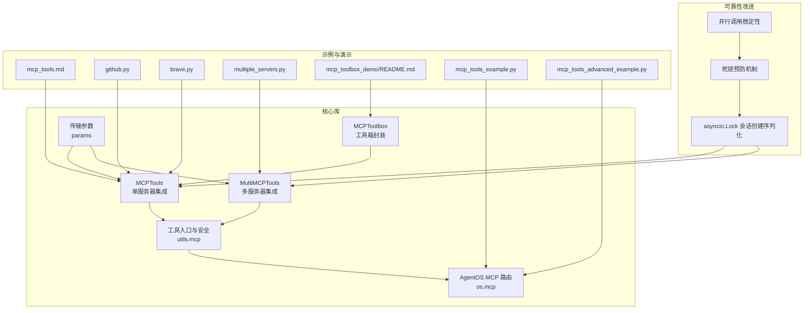
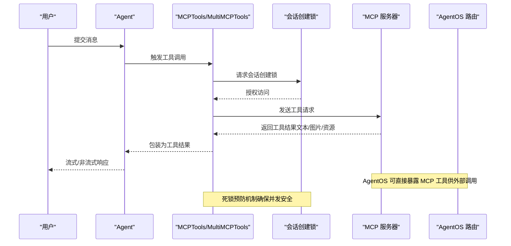
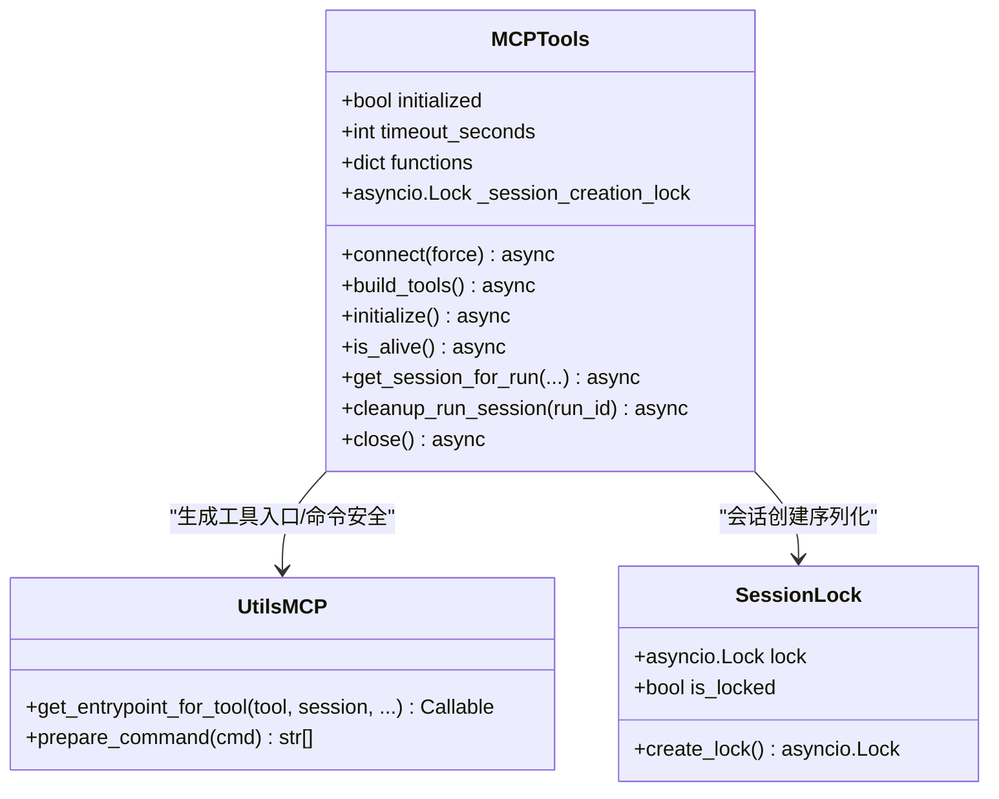
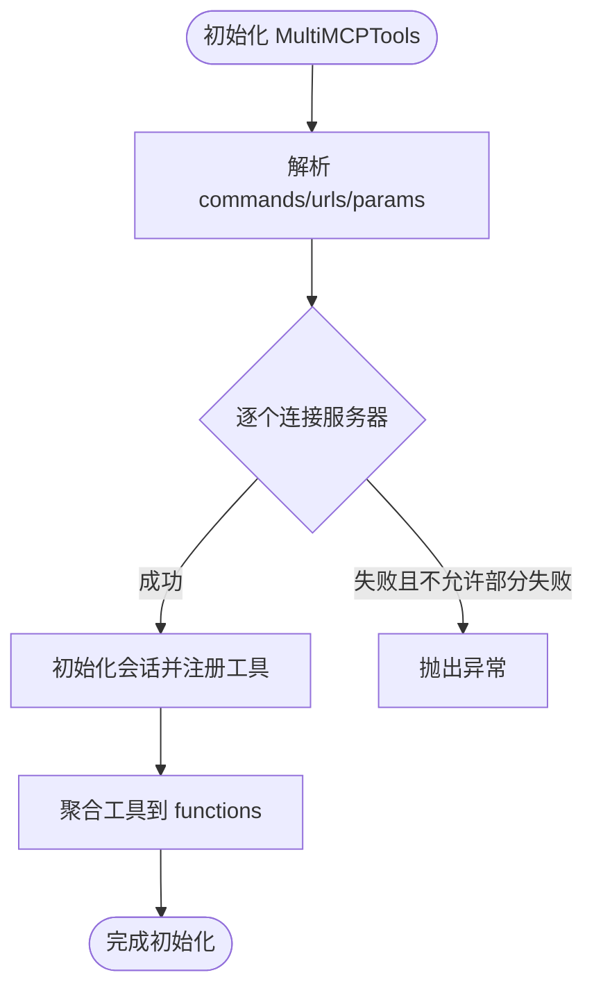
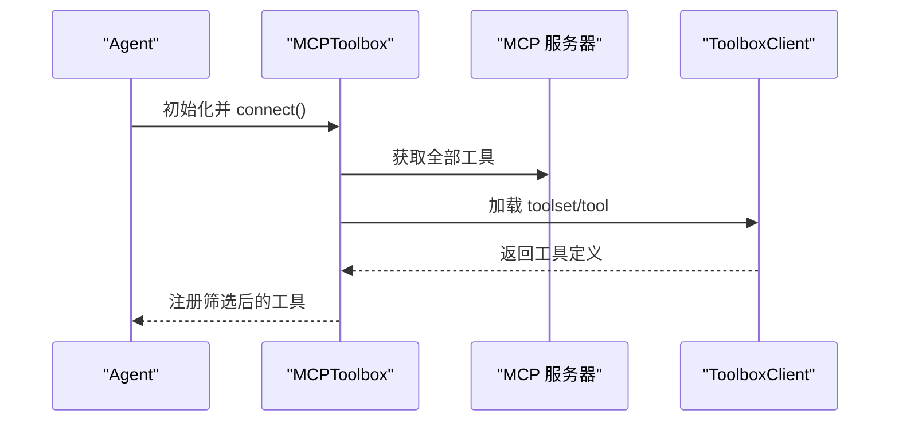
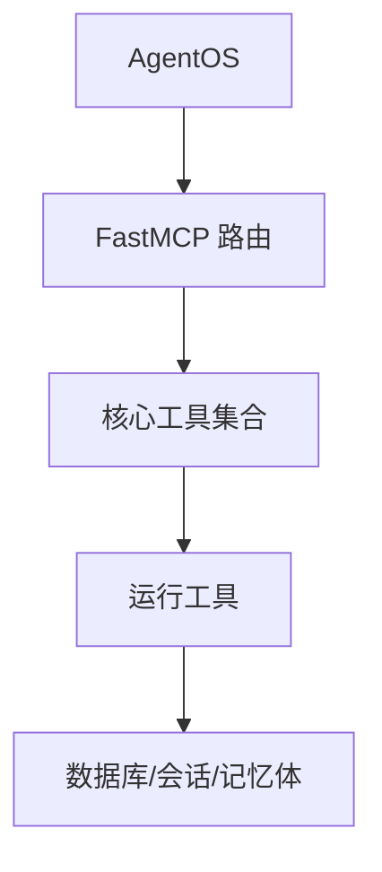
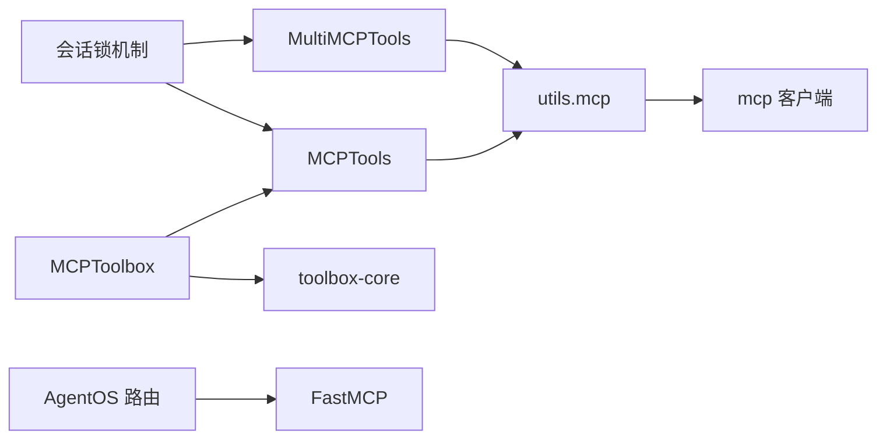

# MCP 工具

<cite>
**本文引用的文件**
- [libs/agno/agno/tools/mcp/mcp.py](file://libs/agno/agno/tools/mcp/mcp.py)
- [libs/agno/agno/tools/mcp/multi_mcp.py](file://libs/agno/agno/tools/mcp/multi_mcp.py)
- [libs/agno/agno/tools/mcp_toolbox.py](file://libs/agno/agno/tools/mcp_toolbox.py)
- [libs/agno/agno/utils/mcp.py](file://libs/agno/agno/utils/mcp.py)
- [libs/agno/agno/os/mcp.py](file://libs/agno/agno/os/mcp.py)
- [libs/agno/agno/tools/mcp/params.py](file://libs/agno/agno/tools/mcp/params.py)
- [cookbook/91_tools/mcp_tools.md](file://cookbook/91_tools/mcp_tools.md)
- [cookbook/91_tools/mcp/github.py](file://cookbook/91_tools/mcp/github.py)
- [cookbook/91_tools/mcp/brave.py](file://cookbook/91_tools/mcp/brave.py)
- [cookbook/91_tools/mcp/multiple_servers.py](file://cookbook/91_tools/mcp/multiple_servers.py)
- [cookbook/91_tools/mcp/mcp_toolbox_demo/README.md](file://cookbook/91_tools/mcp/mcp_toolbox_demo/README.md)
- [cookbook/05_agent_os/mcp_demo/mcp_tools_example.py](file://cookbook/05_agent_os/mcp_demo/mcp_tools_example.py)
- [cookbook/05_agent_os/mcp_demo/mcp_tools_advanced_example.py](file://cookbook/05_agent_os/mcp_demo/mcp_tools_advanced_example.py)
- [libs/agno/tests/unit/tools/test_mcp.py](file://libs/agno/tests/unit/tools/test_mcp.py)
</cite>

## 目录
1. [简介](#简介)
2. [项目结构](#项目结构)
3. [核心组件](#核心组件)
4. [架构总览](#架构总览)
5. [详细组件分析](#详细组件分析)
6. [依赖分析](#依赖分析)
7. [性能考虑](#性能考虑)
8. [故障排查指南](#故障排查指南)
9. [结论](#结论)
10. [附录](#附录)

## 简介
本文件围绕 MCP（Model Context Protocol）工具系统进行系统化文档整理，覆盖协议集成、工具注册、连接管理、多服务器支持、工具箱（MCP Toolbox）能力、安全与认证、AgentOS 集成、调试监控以及扩展开发等主题。文档基于仓库中已实现的 MCP 工具代码与示例，提供可操作的架构视图、流程图与最佳实践建议。

**更新** 本版本重点反映了MCP工具子系统的关键可靠性改进，包括新增的asyncio.Lock-based会话创建序列化机制，有效防止header_provider设置时的死锁问题。

## 项目结构
MCP 工具相关代码主要位于以下位置：
- 核心实现：libs/agno/agno/tools/mcp/*.py（单服务器与多服务器工具封装）
- 工具箱（MCP Toolbox）：libs/agno/agno/tools/mcp_toolbox.py
- 工具入口与命令安全：libs/agno/agno/utils/mcp.py
- AgentOS 内置 MCP 路由：libs/agno/agno/os/mcp.py
- 传输参数定义：libs/agno/agno/tools/mcp/params.py
- 示例与演示：cookbook/91_tools/mcp/* 与 cookbook/05_agent_os/mcp_demo/*
- 单元测试：libs/agno/tests/unit/tools/test_mcp.py（包含可靠性测试）

**图表来源**
- [libs/agno/agno/tools/mcp/mcp.py:28-663](file://libs/agno/agno/tools/mcp/mcp.py#L28-L663)
- [libs/agno/agno/tools/mcp/multi_mcp.py:32-639](file://libs/agno/agno/tools/mcp/multi_mcp.py#L32-L639)
- [libs/agno/agno/tools/mcp_toolbox.py:22-285](file://libs/agno/agno/tools/mcp_toolbox.py#L22-L285)
- [libs/agno/agno/utils/mcp.py:27-256](file://libs/agno/agno/utils/mcp.py#L27-L256)
- [libs/agno/agno/os/mcp.py:49-800](file://libs/agno/agno/os/mcp.py#L49-L800)
- [libs/agno/agno/tools/mcp/params.py:6-25](file://libs/agno/agno/tools/mcp/params.py#L6-L25)
- [libs/agno/tests/unit/tools/test_mcp.py:579-614](file://libs/agno/tests/unit/tools/test_mcp.py#L579-L614)

## 核心组件
- MCPTools：单个 MCP 服务器的工具封装，支持 stdio、SSE、Streamable HTTP 三种传输；支持动态头部、会话复用与按需刷新、工具过滤与前缀、确认与外部执行标记等。
- MultiMCPTools：多服务器工具封装，支持多个服务器并行连接与工具聚合；提供会话 TTL 清理与 per-run 会话管理；当前已标注弃用，推荐使用多个 MCPTools 实例替代。
- MCPToolbox：在 MCP 服务器基础上，结合 MCP Toolbox（toolbox-core）对工具进行筛选与绑定，支持按 toolset 或单个工具加载，并提供认证令牌与绑定参数。
- 工具入口与安全：统一生成工具入口函数，负责将工具调用转发至 MCP 会话，处理返回内容（文本、图片、嵌入资源），并对命令执行进行白名单与安全检查。
- AgentOS 内置 MCP 路由：在 AgentOS 中暴露运行、会话、记忆体等核心工具，便于外部 MCP 客户端或 AgentOS 控制平面调用。
- 传输参数：SSEClientParams、StreamableHTTPClientParams，用于配置连接 URL、超时、读取超时与终止行为等。

**更新** 关键可靠性改进：
- 新增 asyncio.Lock-based 会话创建序列化机制，防止并发调用时的死锁问题
- 实现懒加载的会话创建锁，提高性能并减少不必要的锁竞争
- 通过单元测试验证并行调用的稳定性，确保不会出现无限阻塞

## 架构总览
下图展示了 MCP 工具在 Agent 与 MCP 服务器之间的交互路径，以及与 AgentOS 的集成方式。

**图表来源**
- [libs/agno/agno/tools/mcp/mcp.py:322-324](file://libs/agno/agno/tools/mcp/mcp.py#L322-L324)
- [libs/agno/agno/tools/mcp/multi_mcp.py:316-318](file://libs/agno/agno/tools/mcp/multi_mcp.py#L316-L318)
- [libs/agno/agno/utils/mcp.py:27-170](file://libs/agno/agno/utils/mcp.py#L27-L170)
- [libs/agno/agno/os/mcp.py:49-800](file://libs/agno/agno/os/mcp.py#L49-L800)

## 详细组件分析

### MCPTools 组件分析
- 初始化与连接
  - 支持通过 session、server_params 或 transport+url/command 三种方式初始化。
  - 自动推断传输类型，stdio 不支持动态头部，SSE 已标记弃用，优先使用 Streamable HTTP。
  - 支持环境变量合并与命令安全检查（仅允许白名单命令与路径）。
- 会话管理
  - 支持 per-run 会话（带动态头部），默认 TTL 5 分钟，自动清理过期会话。
  - 提供 is_alive 心跳检测与 ping。
  - **新增** 懒加载的会话创建锁，防止并发调用时的死锁问题。
- 工具注册
  - 通过 session.list_tools 获取可用工具，支持 include/exclude 过滤、工具名前缀、确认与外部执行标记。
  - 将每个工具映射为 Function，设置缓存策略与结果展示控制。
- 生命周期
  - 支持 async 上下文管理器与显式 connect/close，内部维护活跃上下文列表与清理逻辑。

**更新** 会话创建序列化机制：
- 快速路径：直接返回现有会话，无需获取锁
- 慢速路径：使用 `_session_creation_lock` 序列化会话创建
- 懒加载锁：只有在需要时才创建 asyncio.Lock 实例
- 并发安全：确保同一 run_id 的并发调用不会互相覆盖会话

**图表来源**
- [libs/agno/agno/tools/mcp/mcp.py:28-663](file://libs/agno/agno/tools/mcp/mcp.py#L28-L663)
- [libs/agno/agno/utils/mcp.py:27-256](file://libs/agno/agno/utils/mcp.py#L27-L256)

**章节来源**
- [libs/agno/agno/tools/mcp/mcp.py:39-186](file://libs/agno/agno/tools/mcp/mcp.py#L39-L186)
- [libs/agno/agno/tools/mcp/mcp.py:413-533](file://libs/agno/agno/tools/mcp/mcp.py#L413-L533)
- [libs/agno/agno/tools/mcp/mcp.py:534-663](file://libs/agno/agno/tools/mcp/mcp.py#L534-L663)
- [libs/agno/agno/utils/mcp.py:172-256](file://libs/agno/agno/utils/mcp.py#L172-L256)

### MultiMCPTools 组件分析（已弃用）
- 多服务器连接与工具聚合
  - 支持 stdio/SSE/Streamable HTTP 混合配置，按 server_params_list 顺序建立会话。
  - 提供 allow_partial_failure，允许部分失败继续初始化。
  - per-run 会话按 (run_id, server_idx) 缓存，TTL 清理。
  - **新增** 懒加载的会话创建锁，防止并发调用时的死锁问题。
- 重要提示
  - 当前已标注弃用，建议改用多个 MCPTools 实例以获得更清晰的生命周期与错误隔离。

**更新** 会话创建序列化机制：
- 快速路径：直接返回现有会话，无需获取锁
- 慢速路径：使用 `_session_creation_lock` 序列化会话创建
- 懒加载锁：只有在需要时才创建 asyncio.Lock 实例
- 并发安全：确保同一 run_id 和 server_idx 的并发调用不会互相覆盖会话

**图表来源**
- [libs/agno/agno/tools/mcp/multi_mcp.py:408-498](file://libs/agno/agno/tools/mcp/multi_mcp.py#L408-L498)

**章节来源**
- [libs/agno/agno/tools/mcp/multi_mcp.py:42-177](file://libs/agno/agno/tools/mcp/multi_mcp.py#L42-L177)
- [libs/agno/agno/tools/mcp/multi_mcp.py:389-498](file://libs/agno/agno/tools/mcp/multi_mcp.py#L389-L498)

### MCPToolbox 组件分析
- 与 MCPToolbox 服务对接
  - 先连接 MCP 服务器获取全部工具，再通过 toolbox-core 按 toolset 或单工具筛选。
  - 支持认证令牌获取器（auth_token_getters）、绑定参数（bound_params）与严格模式。
- 使用场景
  - 适用于需要"按需加载工具集"的场景，减少 Agent 的工具面，提升安全性与性能。

**图表来源**
- [libs/agno/agno/tools/mcp_toolbox.py:70-102](file://libs/agno/agno/tools/mcp_toolbox.py#L70-L102)
- [libs/agno/agno/tools/mcp_toolbox.py:137-251](file://libs/agno/agno/tools/mcp_toolbox.py#L137-L251)

**章节来源**
- [libs/agno/agno/tools/mcp_toolbox.py:31-102](file://libs/agno/agno/tools/mcp_toolbox.py#L31-L102)
- [libs/agno/agno/tools/mcp_toolbox.py:137-251](file://libs/agno/agno/tools/mcp_toolbox.py#L137-L251)

### AgentOS 内置 MCP 路由分析
- 提供核心工具
  - 配置查询、运行 Agent/Team/Workflow、会话管理（创建/查询/重命名/更新/删除）、记忆体管理（创建/查询/更新）等。
- 与 MCP 工具协作
  - AgentOS 可作为 MCP 服务器，向外部 MCP 客户端暴露这些工具，形成统一的控制平面。

**图表来源**
- [libs/agno/agno/os/mcp.py:49-800](file://libs/agno/agno/os/mcp.py#L49-L800)

**章节来源**
- [libs/agno/agno/os/mcp.py:49-800](file://libs/agno/agno/os/mcp.py#L49-L800)

### 传输参数与安全
- 传输参数
  - SSEClientParams：URL、headers、超时、SSE 读取超时。
  - StreamableHTTPClientParams：URL、headers、超时、SSE 读取超时、关闭终止标志。
- 命令安全
  - prepare_command 对命令进行白名单校验，禁止危险字符，仅允许特定可执行程序与合法路径。

**章节来源**
- [libs/agno/agno/tools/mcp/params.py:6-25](file://libs/agno/agno/tools/mcp/params.py#L6-L25)
- [libs/agno/agno/utils/mcp.py:172-256](file://libs/agno/agno/utils/mcp.py#L172-L256)

## 依赖分析
- 组件耦合
  - MCPTools/MultiMCPTools 依赖 mcp 客户端库与 utils.mcp 的工具入口生成与命令安全。
  - MCPToolbox 在 MCPTools 基础上依赖 toolbox-core。
  - AgentOS 路由依赖 FastMCP 与内部存储模型。
- 外部依赖
  - mcp（客户端会话与传输）、FastMCP（服务端路由）、toolbox-core（工具箱筛选）。

**图表来源**
- [libs/agno/agno/tools/mcp/mcp.py:19-25](file://libs/agno/agno/tools/mcp/mcp.py#L19-L25)
- [libs/agno/agno/tools/mcp/multi_mcp.py:22-28](file://libs/agno/agno/tools/mcp/multi_mcp.py#L22-L28)
- [libs/agno/agno/tools/mcp_toolbox.py:8-11](file://libs/agno/agno/tools/mcp_toolbox.py#L8-L11)
- [libs/agno/agno/os/mcp.py:7-10](file://libs/agno/agno/os/mcp.py#L7-L10)
- [libs/agno/agno/utils/mcp.py:8-13](file://libs/agno/agno/utils/mcp.py#L8-L13)

**章节来源**
- [libs/agno/agno/tools/mcp/mcp.py:19-25](file://libs/agno/agno/tools/mcp/mcp.py#L19-L25)
- [libs/agno/agno/tools/mcp/multi_mcp.py:22-28](file://libs/agno/agno/tools/mcp/multi_mcp.py#L22-L28)
- [libs/agno/agno/tools/mcp_toolbox.py:8-11](file://libs/agno/agno/tools/mcp_toolbox.py#L8-L11)
- [libs/agno/agno/os/mcp.py:7-10](file://libs/agno/agno/os/mcp.py#L7-L10)
- [libs/agno/agno/utils/mcp.py:8-13](file://libs/agno/agno/utils/mcp.py#L8-L13)

## 性能考虑
- 会话复用与 TTL
  - per-run 会话默认 TTL 5 分钟，避免内存泄漏；在高并发场景下建议合理设置 timeout_seconds 与 allow_partial_failure。
  - **新增** 懒加载的会话创建锁，减少不必要的锁竞争开销。
- 工具过滤
  - 使用 include/exclude 与工具名前缀减少工具面，降低模型选择开销。
- 传输选择
  - Streamable HTTP 优于 SSE（已弃用），减少不必要的兼容层开销。
- 并发与清理
  - MultiMCPTools 的会话按 (run_id, server_idx) 缓存，注意在任务结束时及时清理，避免悬挂连接。
  - **新增** 会话创建序列化机制确保并发安全，避免死锁导致的性能问题。

**更新** 性能优化：
- 懒加载锁机制：只有在需要时才创建 asyncio.Lock 实例，减少内存占用
- 快速路径优化：直接返回现有会话，避免不必要的锁获取
- 并发调用稳定性：通过单元测试验证，确保不会出现无限阻塞

## 故障排查指南
- 连接失败
  - 检查 transport 与 URL/command 配置是否匹配；stdio 不支持动态头部。
  - 确认 mcp 与 toolbox-core 已安装，版本兼容。
- 工具不可见
  - 确认 session.initialize 成功；检查 include/exclude 过滤规则与工具名前缀。
- 动态头部无效
  - 仅 SSE/Streamable HTTP 支持动态头部；stdio 会回退到默认会话。
- 命令安全拦截
  - prepare_command 会拒绝包含危险字符或不在白名单的命令；请使用允许的可执行程序或绝对路径。
- AgentOS 工具不可用
  - 确认 AgentOS 路由已正确挂载，且数据库/接口配置有效。
- **新增** 死锁问题
  - 如果遇到并发调用时的阻塞问题，检查是否正确使用了 header_provider。
  - 确保使用最新版本的MCP工具库，其中包含了会话创建序列化机制。
  - 查看单元测试中的并行调用测试，确保代码正确处理并发场景。

**更新** 新增故障排查：
- 死锁预防机制验证：通过 `test_parallel_calls_no_deadlock_with_timeout` 测试确保并发安全
- 会话创建锁检查：确认 `_session_creation_lock` 属性存在且为 asyncio.Lock 实例
- 并发调用稳定性：测试确保同一 run_id 的并发调用不会互相覆盖会话

**章节来源**
- [libs/agno/agno/tools/mcp/mcp.py:86-119](file://libs/agno/agno/tools/mcp/mcp.py#L86-L119)
- [libs/agno/agno/utils/mcp.py:172-256](file://libs/agno/agno/utils/mcp.py#L172-L256)
- [libs/agno/agno/os/mcp.py:49-800](file://libs/agno/agno/os/mcp.py#L49-L800)
- [libs/agno/tests/unit/tools/test_mcp.py:579-614](file://libs/agno/tests/unit/tools/test_mcp.py#L579-L614)

## 结论
MCP 工具系统提供了灵活、可扩展的外部工具接入能力。通过 MCPTools/MultiMCPTools/MCPToolbox，开发者可以快速整合多种 MCP 服务器，实现工具发现、筛选与执行；配合 AgentOS，可进一步构建统一的控制平面与工作流编排。

**更新** 最新可靠性改进显著提升了系统的稳定性和并发安全性：
- 新增的 asyncio.Lock-based 会话创建序列化机制有效防止了死锁问题
- 懒加载的锁机制提高了性能并减少了资源消耗
- 通过严格的单元测试验证了并发调用的稳定性
- 建议优先采用单服务器实例化与工具箱筛选策略，以获得更好的可观测性与可维护性

## 附录

### 实际应用示例
- 单服务器集成（SSE/stdio/Streamable HTTP）
  - 参考：[cookbook/91_tools/mcp/github.py:34-58](file://cookbook/91_tools/mcp/github.py#L34-L58)、[cookbook/91_tools/mcp/brave.py:23-38](file://cookbook/91_tools/mcp/brave.py#L23-L38)
- 多服务器集成（已弃用，建议拆分为多个 MCPTools）
  - 参考：[cookbook/91_tools/mcp/multiple_servers.py:20-44](file://cookbook/91_tools/mcp/multiple_servers.py#L20-L44)
- AgentOS 集成（内置 MCP 工具）
  - 参考：[cookbook/05_agent_os/mcp_demo/mcp_tools_example.py:20-32](file://cookbook/05_agent_os/mcp_demo/mcp_tools_example.py#L20-L32)、[cookbook/05_agent_os/mcp_demo/mcp_tools_advanced_example.py:22-52](file://cookbook/05_agent_os/mcp_demo/mcp_tools_advanced_example.py#L22-L52)
- MCP Toolbox 数据库工具箱演示
  - 参考：[cookbook/91_tools/mcp/mcp_toolbox_demo/README.md:1-175](file://cookbook/91_tools/mcp/mcp_toolbox_demo/README.md#L1-L175)

### 协议与通信机制要点
- 传输类型
  - stdio：本地进程启动 MCP 服务器，适合私有工具。
  - SSE：已弃用，不建议使用。
  - Streamable HTTP：推荐的 HTTP 传输，支持动态头部与超时控制。
- 工具调用流程
  - Agent 选择工具 → MCPTools 生成入口 → 调用 session.call_tool → 解析返回内容（文本/图片/资源）→ 返回给 Agent。

**更新** 可靠性机制：
- 会话创建序列化：通过 asyncio.Lock 确保同一 run_id 的并发调用不会互相覆盖会话
- 死锁预防：懒加载锁机制和快速路径优化避免了死锁风险
- 并发稳定性：单元测试验证确保系统在高并发场景下的稳定性

**章节来源**
- [cookbook/91_tools/mcp_tools.md:18-96](file://cookbook/91_tools/mcp_tools.md#L18-L96)
- [libs/agno/agno/utils/mcp.py:27-170](file://libs/agno/agno/utils/mcp.py#L27-L170)
- [libs/agno/tests/unit/tools/test_mcp.py:579-614](file://libs/agno/tests/unit/tools/test_mcp.py#L579-L614)