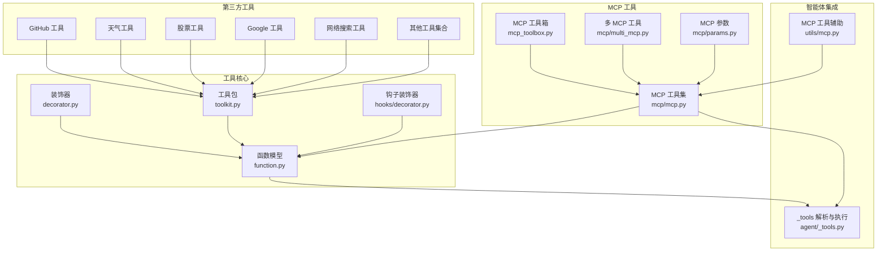
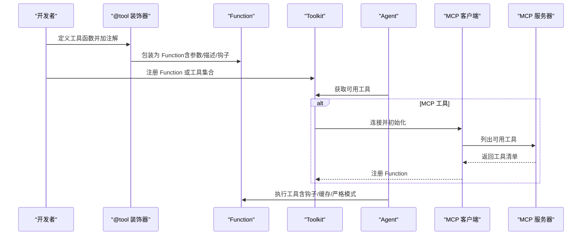
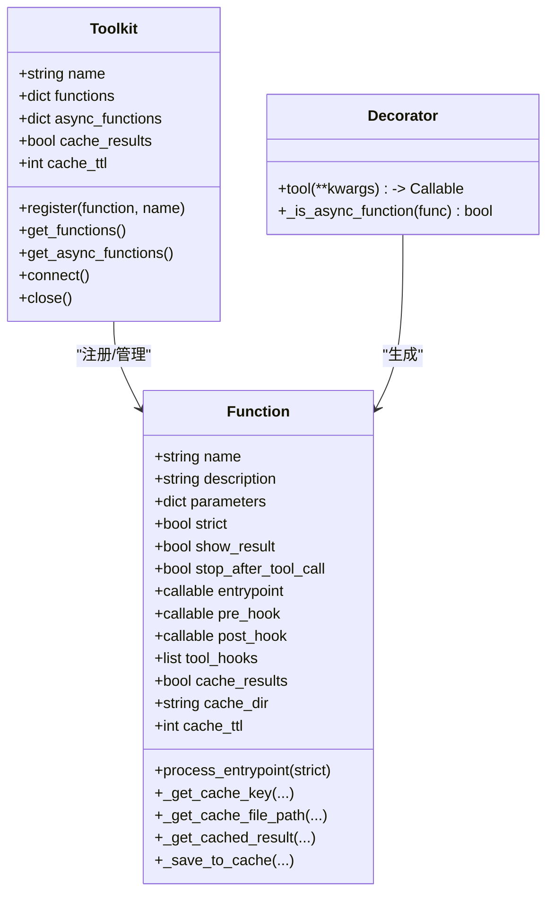
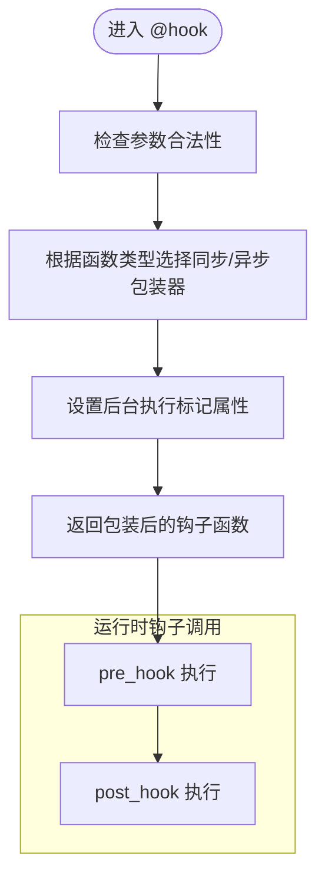
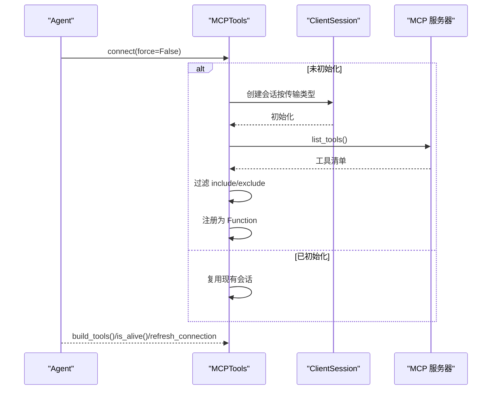
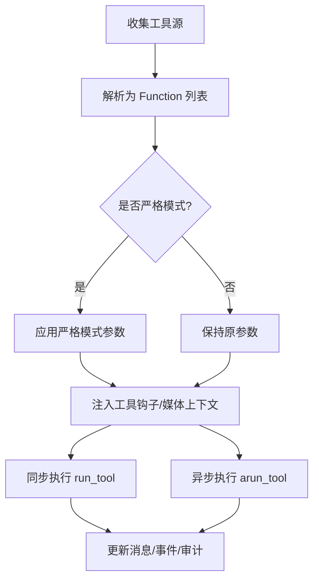
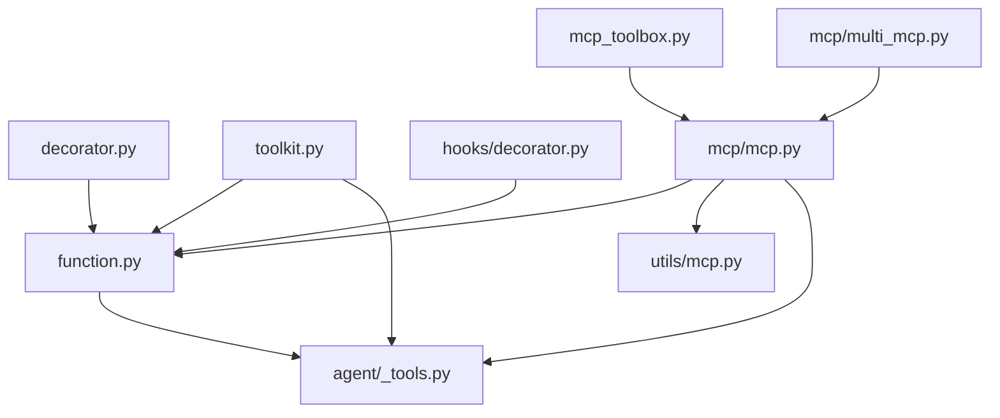

# 工具系统

<cite>
**本文档引用的文件**
- [libs/agno/agno/tools/__init__.py](file://libs/agno/agno/tools/__init__.py)
- [libs/agno/agno/tools/decorator.py](file://libs/agno/agno/tools/decorator.py)
- [libs/agno/agno/tools/function.py](file://libs/agno/agno/tools/function.py)
- [libs/agno/agno/tools/toolkit.py](file://libs/agno/agno/tools/toolkit.py)
- [libs/agno/agno/tools/mcp/mcp.py](file://libs/agno/agno/tools/mcp/mcp.py)
- [libs/agno/agno/tools/mcp_toolbox.py](file://libs/agno/agno/tools/mcp_toolbox.py)
- [libs/agno/agno/hooks/decorator.py](file://libs/agno/agno/hooks/decorator.py)
- [libs/agno/agno/agent/_tools.py](file://libs/agno/agno/agent/_tools.py)
- [libs/agno/agno/utils/mcp.py](file://libs/agno/agno/utils/mcp.py)
- [libs/agno/agno/tools/mcp/params.py](file://libs/agno/agno/tools/mcp/params.py)
- [libs/agno/agno/tools/mcp/multi_mcp.py](file://libs/agno/agno/tools/mcp/multi_mcp.py)
- [libs/agno/agno/tools/github.py](file://libs/agno/agno/tools/github.py)
- [libs/agno/agno/tools/openweather.py](file://libs/agno/agno/tools/openweather.py)
- [libs/agno/agno/tools/yfinance.py](file://libs/agno/agno/tools/yfinance.py)
- [libs/agno/agno/tools/google.py](file://libs/agno/agno/tools/google.py)
- [libs/agno/agno/tools/calculator.py](file://libs/agno/agno/tools/calculator.py)
- [libs/agno/agno/tools/sql.py](file://libs/agno/agno/tools/sql.py)
- [libs/agno/agno/tools/websearch.py](file://libs/agno/agno/tools/websearch.py)
- [libs/agno/agno/tools/email.py](file://libs/agno/agno/tools/email.py)
- [libs/agno/agno/tools/shell.py](file://libs/agno/agno/tools/shell.py)
- [libs/agno/agno/tools/file.py](file://libs/agno/agno/tools/file.py)
- [libs/agno/agno/tools/browser.py](file://libs/agno/agno/tools/browser.py)
- [libs/agno/agno/tools/notion.py](file://libs/agno/agno/tools/notion.py)
- [libs/agno/agno/tools/todoist.py](file://libs/agno/agno/tools/todoist.py)
- [libs/agno/agno/tools/slack.py](file://libs/agno/agno/tools/slack.py)
- [libs/agno/agno/tools/discord.py](file://libs/agno/agno/tools/discord.py)
- [libs/agno/agno/tools/reddit.py](file://libs/agno/agno/tools/reddit.py)
- [libs/agno/agno/tools/wikipedia.py](file://libs/agno/agno/tools/wikipedia.py)
- [libs/agno/agno/tools/hackernews.py](file://libs/agno/agno/tools/hackernews.py)
- [libs/agno/agno/tools/spotify.py](file://libs/agno/agno/tools/spotify.py)
- [libs/agno/agno/tools/youtube.py](file://libs/agno/agno/tools/youtube.py)
- [libs/agno/agno/tools/trello.py](file://libs/agno/agno/tools/trello.py)
- [libs/agno/agno/tools/linkedin.py](file://libs/agno/agno/tools/linkedin.py)
- [libs/agno/agno/tools/zoom.py](file://libs/agno/agno/tools/zoom.py)
- [libs/agno/agno/tools/twitch.py](file://libs/agno/agno/tools/twitch.py)
- [libs/agno/agno/tools/telegram.py](file://libs/agno/agno/tools/telegram.py)
- [libs/agno/agno/tools/unsplash.py](file://libs/agno/agno/tools/unsplash.py)
- [libs/agno/agno/tools/giphy.py](file://libs/agno/agno/tools/giphy.py)
- [libs/agno/agno/tools/cartesia.py](file://libs/agno/agno/tools/cartesia.py)
- [libs/agno/agno/tools/elevenlabs.py](file://libs/agno/agno/tools/elevenlabs.py)
- [libs/agno/agno/tools/replicate.py](file://libs/agno/agno/tools/replicate.py)
- [libs/agno/agno/tools/firecrawl.py](file://libs/agno/agno/tools/firecrawl.py)
- [libs/agno/agno/tools/crawl4ai.py](file://libs/agno/agno/tools/crawl4ai.py)
- [libs/agno/agno/tools/apify.py](file://libs/agno/agno/tools/apify.py)
- [libs/agno/agno/tools/searxng.py](file://libs/agno/agno/tools/searxng.py)
- [libs/agno/agno/tools/serpapi.py](file://libs/agno/agno/tools/serpapi.py)
- [libs/agno/agno/tools/duckduckgo.py](file://libs/agno/agno/tools/duckduckgo.py)
- [libs/agno/agno/tools/baidu.py](file://libs/agno/agno/tools/baidu.py)
- [libs/agno/agno/tools/brave.py](file://libs/agno/agno/tools/brave.py)
- [libs/agno/agno/tools/exa.py](file://libs/agno/agno/tools/exa.py)
- [libs/agno/agno/tools/jina.py](file://libs/agno/agno/tools/jina.py)
- [libs/agno/agno/tools/newspaper.py](file://libs/agno/agno/tools/newspaper.py)
- [libs/agno/agno/tools/trafilatura.py](file://libs/agno/agno/tools/trafilatura.py)
- [libs/agno/agno/tools/pubmed.py](file://libs/agno/agno/tools/pubmed.py)
- [libs/agno/agno/tools/arxiv.py](file://libs/agno/agno/tools/arxiv.py)
- [libs/agno/agno/tools/wolframalpha.py](file://libs/agno/agno/tools/wolframalpha.py)
- [libs/agno/agno/tools/oxylabs.py](file://libs/agno/agno/tools/oxylabs.py)
- [libs/agno/agno/tools/brightdata.py](file://libs/agno/agno/tools/brightdata.py)
- [libs/agno/agno/tools/browserbase.py](file://libs/agno/agno/tools/browserbase.py)
- [libs/agno/agno/tools/e2b.py](file://libs/agno/agno/tools/e2b.py)
- [libs/agno/agno/tools/daytona.py](file://libs/agno/agno/tools/daytona.py)
- [libs/agno/agno/tools/airflow.py](file://libs/agno/agno/tools/airflow.py)
- [libs/agno/agno/tools/docker.py](file://libs/agno/agno/tools/docker.py)
- [libs/agno/agno/tools/gitlab.py](file://libs/agno/agno/tools/gitlab.py)
- [libs/agno/agno/tools/bitbucket.py](file://libs/agno/agno/tools/bitbucket.py)
- [libs/agno/agno/tools/confluence.py](file://libs/agno/agno/tools/confluence.py)
- [libs/agno/agno/tools/jira.py](file://libs/agno/agno/tools/jira.py)
- [libs/agno/agno/tools/linear.py](file://libs/agno/agno/tools/linear.py)
- [libs/agno/agno/tools/twitch.py](file://libs/agno/agno/tools/twitch.py)
- [libs/agno/agno/tools/valyu.py](file://libs/agno/agno/tools/valyu.py)
- [libs/agno/agno/tools/zendesk.py](file://libs/agno/agno/tools/zendesk.py)
- [libs/agno/agno/tools/brandfetch.py](file://libs/agno/agno/tools/brandfetch.py)
- [libs/agno/agno/tools/mem0.py](file://libs/agno/agno/tools/mem0.py)
- [libs/agno/agno/tools/multi_mcp.py](file://libs/agno/agno/tools/multi_mcp.py)
- [libs/agno/agno/tools/mcp_toolbox.py](file://libs/agno/agno/tools/mcp_toolbox.py)
- [libs/agno/agno/tools/mcp/params.py](file://libs/agno/agno/tools/mcp/params.py)
- [libs/agno/agno/tools/mcp/utils.py](file://libs/agno/agno/tools/mcp/utils.py)
- [libs/agno/agno/tools/mcp/__init__.py](file://libs/agno/agno/tools/mcp/__init__.py)
- [libs/agno/agno/tools/mcp/__main__.py](file://libs/agno/agno/tools/mcp/__main__.py)
- [libs/agno/agno/tools/mcp/__about__.py](file://libs/agno/agno/tools/mcp/__about__.py)
- [libs/agno/agno/tools/mcp/__version__.py](file://libs/agno/agno/tools/mcp/__version__.py)
- [libs/agno/agno/tools/mcp/__pkgdata__/README.md](file://libs/agno/agno/tools/mcp/__pkgdata__/README.md)
- [libs/agno/agno/tools/mcp/__pkgdata__/LICENSE](file://libs/agno/agno/tools/mcp/__pkgdata__/LICENSE)
- [libs/agno/agno/tools/mcp/__pkgdata__/NOTICE](file://libs/agno/agno/tools/mcp/__pkgdata__/NOTICE)
- [libs/agno/agno/tools/mcp/__pkgdata__/AUTHORS](file://libs/agno/agno/tools/mcp/__pkgdata__/AUTHORS)
- [libs/agno/agno/tools/mcp/__pkgdata__/CHANGELOG.md](file://libs/agno/agno/tools/mcp/__pkgdata__/CHANGELOG.md)
- [libs/agno/agno/tools/mcp/__pkgdata__/py.typed](file://libs/agno/agno/tools/mcp/__pkgdata__/py.typed)
- [libs/agno/agno/tools/mcp/__pkgdata__/mcp/__init__.py](file://libs/agno/agno/tools/mcp/__pkgdata__/mcp/__init__.py)
- [libs/agno/agno/tools/mcp/__pkgdata__/mcp/__main__.py](file://libs/agno/agno/tools/mcp/__pkgdata__/mcp/__main__.py)
- [libs/agno/agno/tools/mcp/__pkgdata__/mcp/__about__.py](file://libs/agno/agno/tools/mcp/__pkgdata__/mcp/__about__.py)
- [libs/agno/agno/tools/mcp/__pkgdata__/mcp/__version__.py](file://libs/agno/agno/tools/mcp/__pkgdata__/mcp/__version__.py)
- [libs/agno/agno/tools/mcp/__pkgdata__/mcp/__pkgdata__/README.md](file://libs/agno/agno/tools/mcp/__pkgdata__/mcp/__pkgdata__/README.md)
- [libs/agno/agno/tools/mcp/__pkgdata__/mcp/__pkgdata__/LICENSE](file://libs/agno/agno/tools/mcp/__pkgdata__/mcp/__pkgdata__/LICENSE)
- [libs/agno/agno/tools/mcp/__pkgdata__/mcp/__pkgdata__/NOTICE](file://libs/agno/agno/tools/mcp/__pkgdata__/mcp/__pkgdata__/NOTICE)
- [libs/agno/agno/tools/mcp/__pkgdata__/mcp/__pkgdata__/AUTHORS](file://libs/agno/agno/tools/mcp/__pkgdata__/mcp/__pkgdata__/AUTHORS)
- [libs/agno/agno/tools/mcp/__pkgdata__/mcp/__pkgdata__/CHANGELOG.md](file://libs/agno/agno/tools/mcp/__pkgdata__/mcp/__pkgdata__/CHANGELOG.md)
- [libs/agno/agno/tools/mcp/__pkgdata__/mcp/__pkgdata__/py.typed](file://libs/agno/agno/tools/mcp/__pkgdata__/mcp/__pkgdata__/py.typed)
</cite>

## 目录
1. [简介](#简介)
2. [项目结构](#项目结构)
3. [核心组件](#核心组件)
4. [架构总览](#架构总览)
5. [详细组件分析](#详细组件分析)
6. [依赖分析](#依赖分析)
7. [性能考量](#性能考量)
8. [故障排查指南](#故障排查指南)
9. [结论](#结论)
10. [附录](#附录)

## 简介
本文件系统性梳理 Agno Learn 的工具系统，覆盖工具装饰器、工具钩子、MCP 工具与第三方工具的完整框架。重点阐述：
- 工具装饰器如何将函数转换为可被智能体调用的 Function，并支持参数校验、严格模式、缓存、用户输入与外部执行等控制流
- 工具钩子系统如何在工具执行前后注入预处理与后处理逻辑
- MCP（Model Context Protocol）工具的连接、会话管理、动态头信息、工具筛选与安全考虑
- 第三方工具生态的集成方式与最佳实践
- 工具系统的扩展机制：自定义工具开发、工具包管理与工具组合策略

## 项目结构
工具系统主要位于 agno 库的 tools 子模块中，配合 hooks、agent、utils 等模块协同工作。核心目录与文件如下：
- 装饰器与函数模型：decorator.py、function.py
- 工具包管理：toolkit.py
- 钩子系统：hooks/decorator.py
- MCP 工具：mcp/mcp.py、mcp_toolbox.py、mcp/multi_mcp.py 及相关参数与工具适配
- 第三方工具：github.py、openweather.py、yfinance.py、google.py、websearch.py 等众多工具
- 智能体工具解析与执行：agent/_tools.py

**图表来源**
- [libs/agno/agno/tools/decorator.py](file://libs/agno/agno/tools/decorator.py)
- [libs/agno/agno/tools/function.py](file://libs/agno/agno/tools/function.py)
- [libs/agno/agno/tools/toolkit.py](file://libs/agno/agno/tools/toolkit.py)
- [libs/agno/agno/hooks/decorator.py](file://libs/agno/agno/hooks/decorator.py)
- [libs/agno/agno/tools/mcp/mcp.py](file://libs/agno/agno/tools/mcp/mcp.py)
- [libs/agno/agno/tools/mcp_toolbox.py](file://libs/agno/agno/tools/mcp_toolbox.py)
- [libs/agno/agno/tools/mcp/multi_mcp.py](file://libs/agno/agno/tools/mcp/multi_mcp.py)
- [libs/agno/agno/tools/mcp/params.py](file://libs/agno/agno/tools/mcp/params.py)
- [libs/agno/agno/agent/_tools.py](file://libs/agno/agno/agent/_tools.py)
- [libs/agno/agno/utils/mcp.py](file://libs/agno/agno/utils/mcp.py)

**章节来源**
- [libs/agno/agno/tools/__init__.py](file://libs/agno/agno/tools/__init__.py)
- [libs/agno/agno/tools/decorator.py](file://libs/agno/agno/tools/decorator.py)
- [libs/agno/agno/tools/function.py](file://libs/agno/agno/tools/function.py)
- [libs/agno/agno/tools/toolkit.py](file://libs/agno/agno/tools/toolkit.py)
- [libs/agno/agno/hooks/decorator.py](file://libs/agno/agno/hooks/decorator.py)
- [libs/agno/agno/tools/mcp/mcp.py](file://libs/agno/agno/tools/mcp/mcp.py)
- [libs/agno/agno/tools/mcp_toolbox.py](file://libs/agno/agno/tools/mcp_toolbox.py)
- [libs/agno/agno/tools/mcp/multi_mcp.py](file://libs/agno/agno/tools/mcp/multi_mcp.py)
- [libs/agno/agno/agent/_tools.py](file://libs/agno/agno/agent/_tools.py)
- [libs/agno/agno/utils/mcp.py](file://libs/agno/agno/utils/mcp.py)

## 核心组件
- 工具装饰器（@tool）：将任意函数包装为 Function，自动提取签名与文档，支持严格模式、缓存、用户输入、外部执行、确认流程等配置
- 函数模型（Function）：描述工具名称、参数模式、执行入口、钩子、权限控制、缓存策略等
- 工具包（Toolkit）：统一注册与管理一组工具，支持包含/排除过滤、异步工具映射、连接生命周期管理
- 钩子系统（@hook）：在工具执行前后注入同步或异步钩子，支持后台运行与属性透传
- MCP 工具：通过 MCP 协议连接外部服务器，动态拉取工具清单并注册为 Function，支持会话复用、动态头信息、工具筛选与清理
- 第三方工具：围绕常见服务（GitHub、天气、股票、Google、搜索等）封装的标准工具，便于直接复用

**章节来源**
- [libs/agno/agno/tools/decorator.py](file://libs/agno/agno/tools/decorator.py)
- [libs/agno/agno/tools/function.py](file://libs/agno/agno/tools/function.py)
- [libs/agno/agno/tools/toolkit.py](file://libs/agno/agno/tools/toolkit.py)
- [libs/agno/agno/hooks/decorator.py](file://libs/agno/agno/hooks/decorator.py)
- [libs/agno/agno/tools/mcp/mcp.py](file://libs/agno/agno/tools/mcp/mcp.py)

## 架构总览
工具系统以“装饰器 → 函数模型 → 工具包 → 智能体解析”为主线；MCP 工具在此基础上增加“协议连接 → 动态工具注册”的分支；第三方工具作为 Toolkit 的具体实现加入工具集合。

**图表来源**
- [libs/agno/agno/tools/decorator.py](file://libs/agno/agno/tools/decorator.py)
- [libs/agno/agno/tools/function.py](file://libs/agno/agno/tools/function.py)
- [libs/agno/agno/tools/toolkit.py](file://libs/agno/agno/tools/toolkit.py)
- [libs/agno/agno/tools/mcp/mcp.py](file://libs/agno/agno/tools/mcp/mcp.py)
- [libs/agno/agno/agent/_tools.py](file://libs/agno/agno/agent/_tools.py)

## 详细组件分析

### 工具装饰器与函数模型
- 装饰器能力
  - 自动检测同步/异步/异步生成器函数，包裹为对应执行器
  - 提取函数签名与文档字符串，生成 JSON Schema 参数模式
  - 支持严格模式（all-required），自动设置 show_result 与 stop_after_tool_call
  - 支持缓存配置（cache_results/cache_dir/cache_ttl）
  - 支持用户输入、外部执行、确认流程等控制标志
  - 支持 pre_hook/post_hook/tool_hooks 钩子注入
- 函数模型
  - 统一存储工具元数据（名称、描述、参数、钩子、权限、缓存）
  - 支持从可调用对象快速生成 Function
  - 支持严格模式下的参数模式处理
  - 支持缓存读写与键生成
  - 支持媒体上下文注入（图片/视频/音频/文件）

**图表来源**
- [libs/agno/agno/tools/function.py](file://libs/agno/agno/tools/function.py)
- [libs/agno/agno/tools/toolkit.py](file://libs/agno/agno/tools/toolkit.py)
- [libs/agno/agno/tools/decorator.py](file://libs/agno/agno/tools/decorator.py)

**章节来源**
- [libs/agno/agno/tools/decorator.py](file://libs/agno/agno/tools/decorator.py)
- [libs/agno/agno/tools/function.py](file://libs/agno/agno/tools/function.py)
- [libs/agno/agno/tools/toolkit.py](file://libs/agno/agno/tools/toolkit.py)

### 工具钩子系统
- @hook 装饰器
  - 支持 run_in_background 标记，允许每个钩子独立控制后台执行
  - 自动遍历包装链查找属性，确保叠加装饰时行为正确
  - 同步/异步钩子均受支持
- 钩子类型
  - pre_hook：工具执行前触发
  - post_hook：工具执行后触发（无论成功/失败）
  - tool_hooks：围绕工具调用的一组钩子（可与 pre/post 组合）
- 使用场景
  - 日志记录、审计、指标上报、外部通知、资源清理等

**图表来源**
- [libs/agno/agno/hooks/decorator.py](file://libs/agno/agno/hooks/decorator.py)

**章节来源**
- [libs/agno/agno/hooks/decorator.py](file://libs/agno/agno/hooks/decorator.py)

### MCP 工具集成
- 连接与会话
  - 支持 stdio、sse、streamable-http 三种传输
  - 支持动态头信息（header_provider），按运行周期生成会话级凭据
  - 周期性清理过期会话，避免资源泄漏
- 工具注册
  - 从 MCP 服务器列出工具，支持 include/exclude 过滤
  - 将每个工具映射为 Function，保留装饰器配置（确认/外部执行/结果展示/缓存）
- 生命周期管理
  - connect/close 生命周期与 Agent 集成，支持强制刷新与健康检查
  - 支持多 MCP 工具聚合（MultiMCPTools）

**图表来源**
- [libs/agno/agno/tools/mcp/mcp.py](file://libs/agno/agno/tools/mcp/mcp.py)
- [libs/agno/agno/tools/mcp_toolbox.py](file://libs/agno/agno/tools/mcp_toolbox.py)
- [libs/agno/agno/tools/mcp/multi_mcp.py](file://libs/agno/agno/tools/mcp/multi_mcp.py)
- [libs/agno/agno/utils/mcp.py](file://libs/agno/agno/utils/mcp.py)

**章节来源**
- [libs/agno/agno/tools/mcp/mcp.py](file://libs/agno/agno/tools/mcp/mcp.py)
- [libs/agno/agno/tools/mcp_toolbox.py](file://libs/agno/agno/tools/mcp_toolbox.py)
- [libs/agno/agno/tools/mcp/multi_mcp.py](file://libs/agno/agno/tools/mcp/multi_mcp.py)
- [libs/agno/agno/utils/mcp.py](file://libs/agno/agno/utils/mcp.py)

### 第三方工具集成
- 工具分类
  - 平台类：GitHub、Google、Notion、Todoist、Slack、Discord、Reddit、LinkedIn、Zoom、Twitch、Telegram、Unsplash、Giphy、ElevenLabs、Replicate、Spotify、YouTube、Trello、Confluence、Jira、Linear、Zendesk、Brandfetch、Valyu、Airflow、Docker、GitLab、Bitbucket、Mem0 等
  - 数据与检索：OpenWeather、Yahoo Finance、WebSearch（SerpAPI/SearxNG/DuckDuckGo/Baidu/Brave/Exa/Jina/Newspaper/Trafilatura/PubMed/ArXiv/WolframAlpha/Oxylabs/Brightdata/Browserbase/E2B/Daytona 等）、Firecrawl、Crawl4Ai、Apify、SerpApi、SearxNG、DuckDuckGo、Baidu、Brave、Exa、Jina、Newspaper、Trafilatura、PubMed、ArXiv、WolframAlpha、Oxylabs、Brightdata、Browserbase、E2B、Daytona
  - 媒体与生成：Cartesia、ElevenLabs、Replicate、YouTube、Spotify、Twitch、Telegram、Unsplash、Giphy
  - 开发与运维：Shell、SQL、File、Docker、Airflow、GitLab、Bitbucket、Confluence、Jira、Linear、Zendesk、Brandfetch、Valyu
- 集成方式
  - 统一通过 @tool 装饰器声明，自动提取参数与文档
  - 支持严格模式、缓存、用户输入、外部执行与确认流程
  - 可直接注册到 Toolkit 或由 Agent 自动发现

**章节来源**
- [libs/agno/agno/tools/github.py](file://libs/agno/agno/tools/github.py)
- [libs/agno/agno/tools/openweather.py](file://libs/agno/agno/tools/openweather.py)
- [libs/agno/agno/tools/yfinance.py](file://libs/agno/agno/tools/yfinance.py)
- [libs/agno/agno/tools/google.py](file://libs/agno/agno/tools/google.py)
- [libs/agno/agno/tools/websearch.py](file://libs/agno/agno/tools/websearch.py)
- [libs/agno/agno/tools/calculator.py](file://libs/agno/agno/tools/calculator.py)
- [libs/agno/agno/tools/sql.py](file://libs/agno/agno/tools/sql.py)
- [libs/agno/agno/tools/email.py](file://libs/agno/agno/tools/email.py)
- [libs/agno/agno/tools/shell.py](file://libs/agno/agno/tools/shell.py)
- [libs/agno/agno/tools/file.py](file://libs/agno/agno/tools/file.py)
- [libs/agno/agno/tools/browser.py](file://libs/agno/agno/tools/browser.py)
- [libs/agno/agno/tools/notion.py](file://libs/agno/agno/tools/notion.py)
- [libs/agno/agno/tools/todoist.py](file://libs/agno/agno/tools/todoist.py)
- [libs/agno/agno/tools/slack.py](file://libs/agno/agno/tools/slack.py)
- [libs/agno/agno/tools/discord.py](file://libs/agno/agno/tools/discord.py)
- [libs/agno/agno/tools/reddit.py](file://libs/agno/agno/tools/reddit.py)
- [libs/agno/agno/tools/wikipedia.py](file://libs/agno/agno/tools/wikipedia.py)
- [libs/agno/agno/tools/hackernews.py](file://libs/agno/agno/tools/hackernews.py)
- [libs/agno/agno/tools/spotify.py](file://libs/agno/agno/tools/spotify.py)
- [libs/agno/agno/tools/youtube.py](file://libs/agno/agno/tools/youtube.py)
- [libs/agno/agno/tools/trello.py](file://libs/agno/agno/tools/trello.py)
- [libs/agno/agno/tools/linkedin.py](file://libs/agno/agno/tools/linkedin.py)
- [libs/agno/agno/tools/zoom.py](file://libs/agno/agno/tools/zoom.py)
- [libs/agno/agno/tools/twitch.py](file://libs/agno/agno/tools/twitch.py)
- [libs/agno/agno/tools/telegram.py](file://libs/agno/agno/tools/telegram.py)
- [libs/agno/agno/tools/unsplash.py](file://libs/agno/agno/tools/unsplash.py)
- [libs/agno/agno/tools/giphy.py](file://libs/agno/agno/tools/giphy.py)
- [libs/agno/agno/tools/cartesia.py](file://libs/agno/agno/tools/cartesia.py)
- [libs/agno/agno/tools/elevenlabs.py](file://libs/agno/agno/tools/elevenlabs.py)
- [libs/agno/agno/tools/replicate.py](file://libs/agno/agno/tools/replicate.py)
- [libs/agno/agno/tools/firecrawl.py](file://libs/agno/agno/tools/firecrawl.py)
- [libs/agno/agno/tools/crawl4ai.py](file://libs/agno/agno/tools/crawl4ai.py)
- [libs/agno/agno/tools/apify.py](file://libs/agno/agno/tools/apify.py)
- [libs/agno/agno/tools/searxng.py](file://libs/agno/agno/tools/searxng.py)
- [libs/agno/agno/tools/serpapi.py](file://libs/agno/agno/tools/serpapi.py)
- [libs/agno/agno/tools/duckduckgo.py](file://libs/agno/agno/tools/duckduckgo.py)
- [libs/agno/agno/tools/baidu.py](file://libs/agno/agno/tools/baidu.py)
- [libs/agno/agno/tools/brave.py](file://libs/agno/agno/tools/brave.py)
- [libs/agno/agno/tools/exa.py](file://libs/agno/agno/tools/exa.py)
- [libs/agno/agno/tools/jina.py](file://libs/agno/agno/tools/jina.py)
- [libs/agno/agno/tools/newspaper.py](file://libs/agno/agno/tools/newspaper.py)
- [libs/agno/agno/tools/trafilatura.py](file://libs/agno/agno/tools/trafilatura.py)
- [libs/agno/agno/tools/pubmed.py](file://libs/agno/agno/tools/pubmed.py)
- [libs/agno/agno/tools/arxiv.py](file://libs/agno/agno/tools/arxiv.py)
- [libs/agno/agno/tools/wolframalpha.py](file://libs/agno/agno/tools/wolframalpha.py)
- [libs/agno/agno/tools/oxylabs.py](file://libs/agno/agno/tools/oxylabs.py)
- [libs/agno/agno/tools/brightdata.py](file://libs/agno/agno/tools/brightdata.py)
- [libs/agno/agno/tools/browserbase.py](file://libs/agno/agno/tools/browserbase.py)
- [libs/agno/agno/tools/e2b.py](file://libs/agno/agno/tools/e2b.py)
- [libs/agno/agno/tools/daytona.py](file://libs/agno/agno/tools/daytona.py)
- [libs/agno/agno/tools/airflow.py](file://libs/agno/agno/tools/airflow.py)
- [libs/agno/agno/tools/docker.py](file://libs/agno/agno/tools/docker.py)
- [libs/agno/agno/tools/gitlab.py](file://libs/agno/agno/tools/gitlab.py)
- [libs/agno/agno/tools/bitbucket.py](file://libs/agno/agno/tools/bitbucket.py)
- [libs/agno/agno/tools/confluence.py](file://libs/agno/agno/tools/confluence.py)
- [libs/agno/agno/tools/jira.py](file://libs/agno/agno/tools/jira.py)
- [libs/agno/agno/tools/linear.py](file://libs/agno/agno/tools/linear.py)
- [libs/agno/agno/tools/zendesk.py](file://libs/agno/agno/tools/zendesk.py)
- [libs/agno/agno/tools/brandfetch.py](file://libs/agno/agno/tools/brandfetch.py)
- [libs/agno/agno/tools/mem0.py](file://libs/agno/agno/tools/mem0.py)

### 工具解析与执行（智能体侧）
- 工具解析
  - 将 Toolkit/Function/Callable/Dict 统一转为 Function 列表
  - 支持严格模式（基于输出模式与模型能力）
  - 支持工具钩子合并与媒体上下文注入
- 工具执行
  - 同步/异步执行路径分离
  - 处理外部执行、用户输入、确认拒绝等控制流
  - 事件驱动的消息注入与审计记录

**图表来源**
- [libs/agno/agno/agent/_tools.py](file://libs/agno/agno/agent/_tools.py)

**章节来源**
- [libs/agno/agno/agent/_tools.py](file://libs/agno/agno/agent/_tools.py)

## 依赖分析
- 内部耦合
  - 装饰器依赖函数模型与日志工具
  - 工具包依赖函数模型与工具注册/过滤逻辑
  - MCP 工具依赖 mcp 客户端库与工具模型
  - 钩子装饰器独立但与函数模型交互
- 外部依赖
  - mcp 客户端（stdio/sse/streamable-http）
  - 第三方 SDK（如 GitHub、OpenWeather、Yahoo Finance、Google 等）
  - 类型与验证（pydantic、docstring-parser、packaging）

**图表来源**
- [libs/agno/agno/tools/decorator.py](file://libs/agno/agno/tools/decorator.py)
- [libs/agno/agno/tools/function.py](file://libs/agno/agno/tools/function.py)
- [libs/agno/agno/tools/toolkit.py](file://libs/agno/agno/tools/toolkit.py)
- [libs/agno/agno/hooks/decorator.py](file://libs/agno/agno/hooks/decorator.py)
- [libs/agno/agno/tools/mcp/mcp.py](file://libs/agno/agno/tools/mcp/mcp.py)
- [libs/agno/agno/tools/mcp_toolbox.py](file://libs/agno/agno/tools/mcp_toolbox.py)
- [libs/agno/agno/tools/mcp/multi_mcp.py](file://libs/agno/agno/tools/mcp/multi_mcp.py)
- [libs/agno/agno/utils/mcp.py](file://libs/agno/agno/utils/mcp.py)
- [libs/agno/agno/agent/_tools.py](file://libs/agno/agno/agent/_tools.py)

**章节来源**
- [libs/agno/agno/tools/decorator.py](file://libs/agno/agno/tools/decorator.py)
- [libs/agno/agno/tools/function.py](file://libs/agno/agno/tools/function.py)
- [libs/agno/agno/tools/toolkit.py](file://libs/agno/agno/tools/toolkit.py)
- [libs/agno/agno/hooks/decorator.py](file://libs/agno/agno/hooks/decorator.py)
- [libs/agno/agno/tools/mcp/mcp.py](file://libs/agno/agno/tools/mcp/mcp.py)
- [libs/agno/agno/tools/mcp_toolbox.py](file://libs/agno/agno/tools/mcp_toolbox.py)
- [libs/agno/agno/tools/mcp/multi_mcp.py](file://libs/agno/agno/tools/mcp/multi_mcp.py)
- [libs/agno/agno/utils/mcp.py](file://libs/agno/agno/utils/mcp.py)
- [libs/agno/agno/agent/_tools.py](file://libs/agno/agno/agent/_tools.py)

## 性能考量
- 缓存策略
  - Function 级缓存（内存+磁盘），支持 TTL 控制，减少重复计算
  - MCP 工具会话复用与周期清理，降低连接开销
- 异步执行
  - 异步工具优先使用 async_functions，避免阻塞
  - 钩子支持后台执行，减轻主线程压力
- 参数模式
  - 严格模式下 all-required 减少模型推理歧义，提高稳定性
- I/O 优化
  - 第三方工具尽量批量请求与连接池化（如数据库/搜索引擎）

[本节为通用指导，无需特定文件来源]

## 故障排查指南
- 工具装饰器错误
  - 非法参数名：检查 @tool 关键字参数是否在允许列表内
  - 互斥标志冲突：requires_user_input、requires_confirmation、external_execution 仅能二选一
  - 异步工具混用：同步 Agent 不支持异步工具，需使用异步执行接口
- MCP 工具问题
  - 连接失败：检查传输类型、URL/命令、环境变量与凭据
  - 工具不可用：确认 include/exclude 过滤与服务器工具清单
  - 会话泄漏：启用清理逻辑或定期重启 Agent
- 钩子异常
  - 后台钩子异常：注意 run_in_background 下的异常捕获与日志
  - 属性穿透：确认装饰器叠加顺序与属性遍历逻辑
- 第三方工具
  - API 限流/配额：增加重试与退避策略
  - 认证失败：核对密钥、作用域与动态头信息生成

**章节来源**
- [libs/agno/agno/tools/decorator.py](file://libs/agno/agno/tools/decorator.py)
- [libs/agno/agno/tools/mcp/mcp.py](file://libs/agno/agno/tools/mcp/mcp.py)
- [libs/agno/agno/hooks/decorator.py](file://libs/agno/agno/hooks/decorator.py)
- [libs/agno/agno/agent/_tools.py](file://libs/agno/agno/agent/_tools.py)

## 结论
Agno Learn 的工具系统以“装饰器 → 函数模型 → 工具包 → 智能体解析”为核心路径，结合 MCP 协议与第三方工具生态，提供了高扩展、强安全与高性能的工具执行框架。通过严格的参数模式、灵活的钩子机制、会话管理与缓存策略，开发者可以快速构建稳定可靠的工具生态系统。

[本节为总结，无需特定文件来源]

## 附录
- 最佳实践
  - 使用 @tool 的 strict 模式提升模型推理稳定性
  - 对高开销工具开启缓存，合理设置 TTL
  - 对外部系统工具使用外部执行与确认流程
  - 在复杂工具中使用 pre_hook/post_hook 实现可观测性与审计
  - MCP 工具建议使用动态头信息与会话清理，保障安全性与资源占用
- 扩展建议
  - 自定义工具：遵循 @tool 规范，提供清晰文档与参数注释
  - 工具包：统一注册、过滤与生命周期管理
  - 工具组合：通过 Toolkit 组合多个工具，按需 include/exclude

[本节为通用指导，无需特定文件来源]