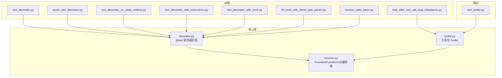
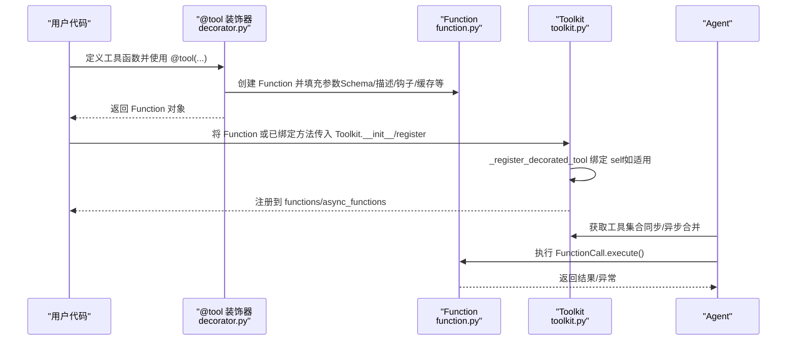
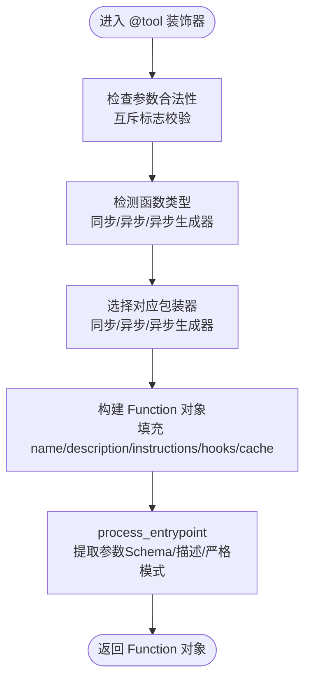
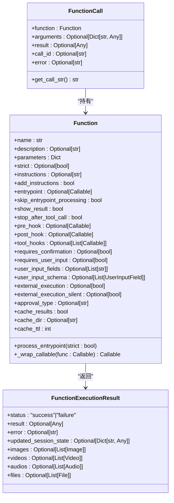
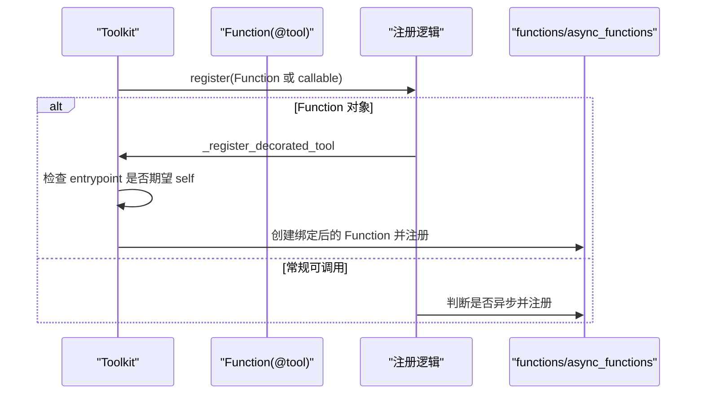
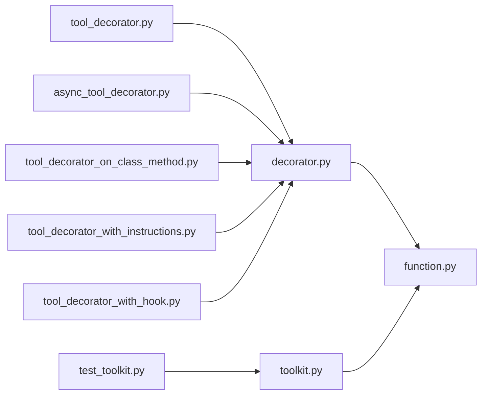

# 工具装饰器

<cite>
**本文引用的文件**
- [decorator.py](file://libs/agno/agno/tools/decorator.py)
- [toolkit.py](file://libs/agno/agno/tools/toolkit.py)
- [function.py](file://libs/agno/agno/tools/function.py)
- [tool_decorator.py](file://cookbook/91_tools/tool_decorator/tool_decorator.py)
- [async_tool_decorator.py](file://cookbook/91_tools/tool_decorator/async_tool_decorator.py)
- [tool_decorator_on_class_method.py](file://cookbook/91_tools/tool_decorator/tool_decorator_on_class_method.py)
- [tool_decorator_with_instructions.py](file://cookbook/91_tools/tool_decorator/tool_decorator_with_instructions.py)
- [tool_decorator_with_hook.py](file://cookbook/91_tools/tool_decorator/tool_decorator_with_hook.py)
- [04_tools_with_literal_type_param.py](file://cookbook/02_agents/04_tools/04_tools_with_literal_type_param.py)
- [session_state_basic.py](file://cookbook/02_agents/05_state_and_session/session_state_basic.py)
- [stop_after_tool_call_dual_inheritance.py](file://cookbook/91_tools/other/stop_after_tool_call_dual_inheritance.py)
- [test_toolkit.py](file://libs/agno/tests/unit/tools/test_toolkit.py)
</cite>

## 目录
1. [简介](#简介)
2. [项目结构](#项目结构)
3. [核心组件](#核心组件)
4. [架构总览](#架构总览)
5. [详细组件分析](#详细组件分析)
6. [依赖关系分析](#依赖关系分析)
7. [性能考量](#性能考量)
8. [故障排查指南](#故障排查指南)
9. [结论](#结论)
10. [附录](#附录)

## 简介
本文件系统性阐述工具装饰器的设计原理与实现机制，覆盖以下主题：
- @tool 装饰器的使用方法、参数校验、返回值处理与错误处理
- 工具函数的定义规范（函数签名、参数类型注解、返回值模式、异常处理）
- 工具包（Toolkit）的概念与使用，包含多工具组织、继承与扩展机制
- 丰富示例：简单工具、参数验证工具、异步工具、带状态管理工具
- 与 AgentOS 的集成：工具注册、工具发现与工具调用
- 最佳实践：命名规范、文档字符串编写、性能优化

## 项目结构
围绕工具装饰器与工具包的核心代码位于 libs/agno/agno/tools 下，示例与测试位于 cookbook 与 libs/agno/tests。

**图表来源**
- [decorator.py:87-294](file://libs/agno/agno/tools/decorator.py#L87-L294)
- [toolkit.py:15-383](file://libs/agno/agno/tools/toolkit.py#L15-L383)
- [function.py:132-800](file://libs/agno/agno/tools/function.py#L132-L800)
- [tool_decorator.py:1-158](file://cookbook/91_tools/tool_decorator/tool_decorator.py#L1-L158)
- [async_tool_decorator.py:1-58](file://cookbook/91_tools/tool_decorator/async_tool_decorator.py#L1-L58)
- [tool_decorator_on_class_method.py:1-53](file://cookbook/91_tools/tool_decorator/tool_decorator_on_class_method.py#L1-L53)
- [tool_decorator_with_instructions.py:1-61](file://cookbook/91_tools/tool_decorator/tool_decorator_with_instructions.py#L1-L61)
- [tool_decorator_with_hook.py:1-65](file://cookbook/91_tools/tool_decorator/tool_decorator_with_hook.py#L1-L65)
- [04_tools_with_literal_type_param.py:1-83](file://cookbook/02_agents/04_tools/04_tools_with_literal_type_param.py#L1-L83)
- [session_state_basic.py:1-49](file://cookbook/02_agents/05_state_and_session/session_state_basic.py#L1-L49)
- [stop_after_tool_call_dual_inheritance.py:1-84](file://cookbook/91_tools/other/stop_after_tool_call_dual_inheritance.py#L1-L84)
- [test_toolkit.py:284-357](file://libs/agno/tests/unit/tools/test_toolkit.py#L284-L357)

**章节来源**
- [decorator.py:87-294](file://libs/agno/agno/tools/decorator.py#L87-L294)
- [toolkit.py:15-383](file://libs/agno/agno/tools/toolkit.py#L15-L383)
- [function.py:132-800](file://libs/agno/agno/tools/function.py#L132-L800)

## 核心组件
- @tool 装饰器：将普通函数包装为 Function 对象，自动提取参数 Schema、处理同步/异步/异步生成器、注入错误日志与钩子、支持严格模式与缓存。
- Function：承载工具元数据（名称、描述、参数 Schema、指令、执行钩子、权限与外部执行标记、缓存配置等），并负责入口点包装与参数校验。
- Toolkit：工具包容器，负责注册工具（支持 Function 对象与常规可调用对象）、自动绑定类方法到 self、合并 include/exclude 过滤、异步/同步函数字典管理、连接生命周期管理。

**章节来源**
- [decorator.py:87-294](file://libs/agno/agno/tools/decorator.py#L87-L294)
- [function.py:132-800](file://libs/agno/agno/tools/function.py#L132-L800)
- [toolkit.py:15-383](file://libs/agno/agno/tools/toolkit.py#L15-L383)

## 架构总览
下图展示了从装饰器到工具包再到 Agent 执行的关键流程。

**图表来源**
- [decorator.py:170-287](file://libs/agno/agno/tools/decorator.py#L170-L287)
- [function.py:396-546](file://libs/agno/agno/tools/function.py#L396-L546)
- [toolkit.py:153-302](file://libs/agno/agno/tools/toolkit.py#L153-L302)

## 详细组件分析

### @tool 装饰器设计与实现
- 支持两种调用形式：@tool 与 @tool(...)，内部统一为装饰器工厂。
- 自动识别同步、异步与异步生成器函数，分别包裹为对应包装器，并保留原签名与元信息。
- 参数校验与错误处理：
  - 同步/异步/异步生成器均包裹 try/except 并记录错误日志，再抛出原始异常。
  - 严格模式（strict）下强制所有字段为必填，并确保对象无额外属性。
- 钩子与指令：
  - 支持 pre_hook/post_hook/tool_hooks；支持 instructions/add_instructions；支持 requires_confirmation/requires_user_input/external_execution 及互斥校验。
- 缓存：
  - 支持 cache_results/cache_dir/cache_ttl，Function 内部提供缓存键生成、文件路径、读写与过期判断。
- 入口点处理：
  - 通过 Function.process_entrypoint 提取参数 Schema（排除 agent/team/run_context/images/videos/audios/files/self 等框架注入与特殊参数），解析 docstring 参数描述，生成 JSON Schema。

**图表来源**
- [decorator.py:170-287](file://libs/agno/agno/tools/decorator.py#L170-L287)
- [function.py:396-546](file://libs/agno/agno/tools/function.py#L396-L546)

**章节来源**
- [decorator.py:87-294](file://libs/agno/agno/tools/decorator.py#L87-L294)
- [function.py:132-800](file://libs/agno/agno/tools/function.py#L132-L800)

### Function 类与参数处理
- 参数 Schema 生成：
  - 使用类型提示与 docstring 参数注释生成 JSON Schema；严格模式下要求所有字段必填且禁止额外属性。
  - 自动排除框架注入参数（agent/team/run_context/images/videos/audios/files/self）。
- 入口点包装：
  - 使用 Pydantic validate_call 包装（异步生成器除外），在满足版本条件时进行运行时参数校验。
- 执行与结果：
  - FunctionCall 负责调用与错误捕获；FunctionExecutionResult 统一返回结构（含状态、结果、错误、会话状态更新与媒体产物）。
- 缓存：
  - 基于函数名+排序后的参数键值生成 MD5 缓存键，按 TTL 读写磁盘缓存文件。

**图表来源**
- [function.py:132-800](file://libs/agno/agno/tools/function.py#L132-L800)

**章节来源**
- [function.py:132-800](file://libs/agno/agno/tools/function.py#L132-L800)

### Toolkit 工具包与注册机制
- 注册策略：
  - 支持直接传入 Function 对象或常规可调用对象；对 Function 对象优先处理，自动绑定类方法到 self（若入口点期望 self）。
  - 自动区分同步/异步函数，分别注册到 functions/async_functions 字典。
- 过滤与合并：
  - include_tools/exclude_tools 校验与过滤；get_async_functions 合并异步变体优先于同步变体。
- 生命周期与安全：
  - 支持 requires_connect/connect/close；提供路径安全检查（防止目录穿越）。
- 与装饰器协同：
  - 当 @tool 装饰类方法时，Toolkit 通过 _register_decorated_tool 将 unbound method 绑定到 self，同时保留装饰器配置（如 stop_after_tool_call/show_result/钩子等）。

**图表来源**
- [toolkit.py:153-302](file://libs/agno/agno/tools/toolkit.py#L153-L302)

**章节来源**
- [toolkit.py:15-383](file://libs/agno/agno/tools/toolkit.py#L15-L383)
- [test_toolkit.py:284-357](file://libs/agno/tests/unit/tools/test_toolkit.py#L284-L357)

### 示例与用法详解

#### 简单工具与生成器工具
- 使用 @tool(show_result=True) 包装生成器函数，逐条产出结果并在 Agent 流式输出中呈现。
- 异步工具示例：静态方法或实例方法均可，装饰器自动识别协程与异步生成器。

参考示例文件：
- [tool_decorator.py:20-51](file://cookbook/91_tools/tool_decorator/tool_decorator.py#L20-L51)
- [async_tool_decorator.py:21-41](file://cookbook/91_tools/tool_decorator/async_tool_decorator.py#L21-L41)

**章节来源**
- [tool_decorator.py:1-158](file://cookbook/91_tools/tool_decorator/tool_decorator.py#L1-L158)
- [async_tool_decorator.py:1-58](file://cookbook/91_tools/tool_decorator/async_tool_decorator.py#L1-L58)

#### 带参数验证的工具（含 Literal 类型）
- 使用 typing.Literal 约束参数取值范围，装饰器自动解析类型提示生成 Schema，提升模型调用准确性。
- 示例展示在 Toolkit 与独立工具中使用 Literal。

参考示例文件：
- [04_tools_with_literal_type_param.py:16-56](file://cookbook/02_agents/04_tools/04_tools_with_literal_type_param.py#L16-L56)

**章节来源**
- [04_tools_with_literal_type_param.py:1-83](file://cookbook/02_agents/04_tools/04_tools_with_literal_type_param.py#L1-L83)

#### 异步工具与外部 API 调用
- 展示异步 HTTP 请求与流式响应，强调异步生成器工具的使用场景。

参考示例文件：
- [tool_decorator.py:64-148](file://cookbook/91_tools/tool_decorator/tool_decorator.py#L64-L148)

**章节来源**
- [tool_decorator.py:1-158](file://cookbook/91_tools/tool_decorator/tool_decorator.py#L1-L158)

#### 带状态管理的工具
- 工具函数可接收 RunContext/Agent/Team 等注入参数以访问会话状态，实现跨轮次的状态累积与更新。

参考示例文件：
- [session_state_basic.py:14-36](file://cookbook/02_agents/05_state_and_session/session_state_basic.py#L14-L36)

**章节来源**
- [session_state_basic.py:1-49](file://cookbook/02_agents/05_state_and_session/session_state_basic.py#L1-L49)

#### 在类方法上使用 @tool 与 self 绑定
- @tool 可装饰实例方法，Toolkit 在注册时自动将 unbound method 绑定到 self，保留装饰器配置。
- 示例展示多工具组合与 stop_after_tool_call 行为。

参考示例文件：
- [tool_decorator_on_class_method.py:18-53](file://cookbook/91_tools/tool_decorator/tool_decorator_on_class_method.py#L18-L53)
- [test_toolkit.py:319-357](file://libs/agno/tests/unit/tools/test_toolkit.py#L319-L357)

**章节来源**
- [tool_decorator_on_class_method.py:1-53](file://cookbook/91_tools/tool_decorator/tool_decorator_on_class_method.py#L1-L53)
- [test_toolkit.py:284-357](file://libs/agno/tests/unit/tools/test_toolkit.py#L284-L357)

#### 带指令与钩子的工具
- 使用 instructions 与 add_instructions 控制工具使用说明注入；通过 tool_hooks/pre_hook/post_hook 扩展执行前后行为。

参考示例文件：
- [tool_decorator_with_instructions.py:17-46](file://cookbook/91_tools/tool_decorator/tool_decorator_with_instructions.py#L17-L46)
- [tool_decorator_with_hook.py:17-49](file://cookbook/91_tools/tool_decorator/tool_decorator_with_hook.py#L17-L49)

**章节来源**
- [tool_decorator_with_instructions.py:1-61](file://cookbook/91_tools/tool_decorator/tool_decorator_with_instructions.py#L1-L61)
- [tool_decorator_with_hook.py:1-65](file://cookbook/91_tools/tool_decorator/tool_decorator_with_hook.py#L1-L65)

#### 带 stop_after_tool_call 的工具包（含多重继承）
- 通过 Toolkit 构造参数 stop_after_tool_call_tools 设置特定工具在调用后停止；示例展示在多重继承场景下的正确行为。

参考示例文件：
- [stop_after_tool_call_dual_inheritance.py:23-59](file://cookbook/91_tools/other/stop_after_tool_call_dual_inheritance.py#L23-L59)

**章节来源**
- [stop_after_tool_call_dual_inheritance.py:1-84](file://cookbook/91_tools/other/stop_after_tool_call_dual_inheritance.py#L1-L84)

## 依赖关系分析
- 装饰器依赖 Function 来封装工具元数据与执行细节。
- Toolkit 依赖 Function 进行注册、绑定与异步/同步合并。
- Function 依赖 Pydantic 的 validate_call 进行参数校验（满足版本条件）。
- 示例与测试模块依赖核心库完成端到端验证。

**图表来源**
- [decorator.py:87-294](file://libs/agno/agno/tools/decorator.py#L87-L294)
- [toolkit.py:15-383](file://libs/agno/agno/tools/toolkit.py#L15-L383)
- [function.py:132-800](file://libs/agno/agno/tools/function.py#L132-L800)
- [tool_decorator.py:1-158](file://cookbook/91_tools/tool_decorator/tool_decorator.py#L1-L158)
- [async_tool_decorator.py:1-58](file://cookbook/91_tools/tool_decorator/async_tool_decorator.py#L1-L58)
- [tool_decorator_on_class_method.py:1-53](file://cookbook/91_tools/tool_decorator/tool_decorator_on_class_method.py#L1-L53)
- [tool_decorator_with_instructions.py:1-61](file://cookbook/91_tools/tool_decorator/tool_decorator_with_instructions.py#L1-L61)
- [tool_decorator_with_hook.py:1-65](file://cookbook/91_tools/tool_decorator/tool_decorator_with_hook.py#L1-L65)
- [test_toolkit.py:284-357](file://libs/agno/tests/unit/tools/test_toolkit.py#L284-L357)

**章节来源**
- [decorator.py:87-294](file://libs/agno/agno/tools/decorator.py#L87-L294)
- [toolkit.py:15-383](file://libs/agno/agno/tools/toolkit.py#L15-L383)
- [function.py:132-800](file://libs/agno/agno/tools/function.py#L132-L800)

## 性能考量
- 参数校验开销：
  - 使用 validate_call 进行运行时校验，建议在开发阶段开启，生产环境可评估关闭以减少延迟。
- 缓存策略：
  - 启用 cache_results 并合理设置 cache_ttl，避免重复昂贵操作；注意缓存目录权限与磁盘空间。
- 异步执行：
  - 对 I/O 密集型工具优先使用异步版本，减少阻塞；异步生成器适合流式输出。
- Schema 复杂度：
  - 复杂嵌套 Schema 会增加校验与序列化成本，建议简化参数结构或采用严格模式（strict）以减少额外字段。

[本节为通用指导，无需具体文件分析]

## 故障排查指南
- 参数非法导致的校验失败：
  - 检查类型提示与默认值；必要时使用 strict=True 强制必填字段。
- 异步函数未被识别：
  - 确认函数为 async def 或 async 生成器；装饰器会自动识别。
- 工具未出现在 Agent 中：
  - 检查 include_tools/exclude_tools 过滤列表；确认 Toolkit.auto_register 与注册顺序。
- self 绑定问题：
  - 若使用 @tool 装饰类方法，确保通过 Toolkit.tools 传入已绑定方法或让 Toolkit 自动绑定。
- 缓存异常：
  - 检查 cache_dir 权限与磁盘空间；确认 TTL 设置合理。

**章节来源**
- [decorator.py:150-168](file://libs/agno/agno/tools/decorator.py#L150-L168)
- [function.py:598-601](file://libs/agno/agno/tools/function.py#L598-L601)
- [toolkit.py:208-302](file://libs/agno/agno/tools/toolkit.py#L208-L302)
- [test_toolkit.py:284-357](file://libs/agno/tests/unit/tools/test_toolkit.py#L284-L357)

## 结论
工具装饰器系统通过 @tool 将函数无缝转化为可被 Agent 执行的 Function，并提供参数校验、钩子、缓存与严格模式等能力；Toolkit 则负责工具包的组织、注册与生命周期管理。结合示例与测试，开发者可以快速构建健壮、可维护的工具体系，并与 AgentOS 顺畅集成。

[本节为总结，无需具体文件分析]

## 附录

### 最佳实践清单
- 命名规范
  - 函数名简洁明确，描述工具职责；必要时使用 name 参数覆盖默认名称。
- 文档字符串
  - 为工具函数编写清晰的 docstring，包含参数说明与返回值描述；装饰器会解析用于 description 与参数注释。
- 参数类型注解
  - 使用 typing.Literal 等精确类型约束参数取值；复杂结构建议拆分为更小的参数或使用严格模式。
- 异步与流式
  - I/O 密集使用异步；需要逐步输出时使用异步生成器。
- 错误处理
  - 保持异常可追踪，利用装饰器的日志记录；必要时在 pre_hook/post_hook 中补充上下文。
- 缓存与性能
  - 对昂贵计算启用缓存；控制 TTL 与缓存目录；避免在缓存中存储敏感数据。
- 安全
  - 使用 Toolkit 的路径安全检查；对外部执行工具谨慎配置 external_execution。

[本节为通用指导，无需具体文件分析]