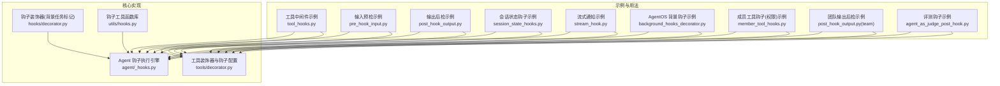
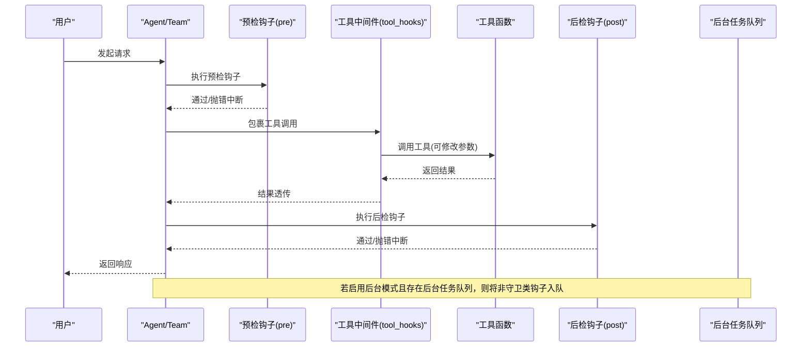
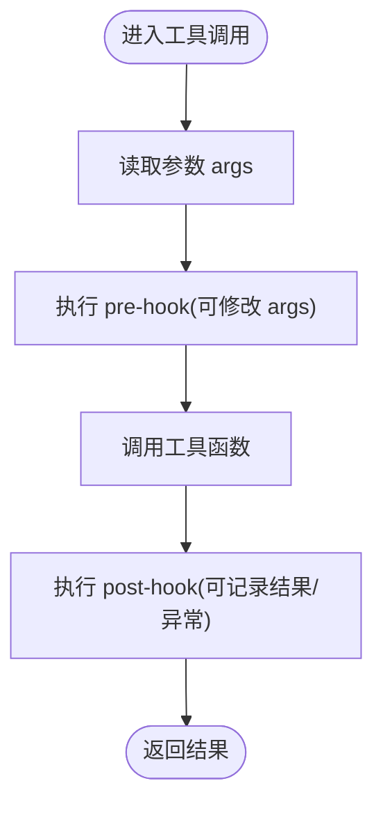
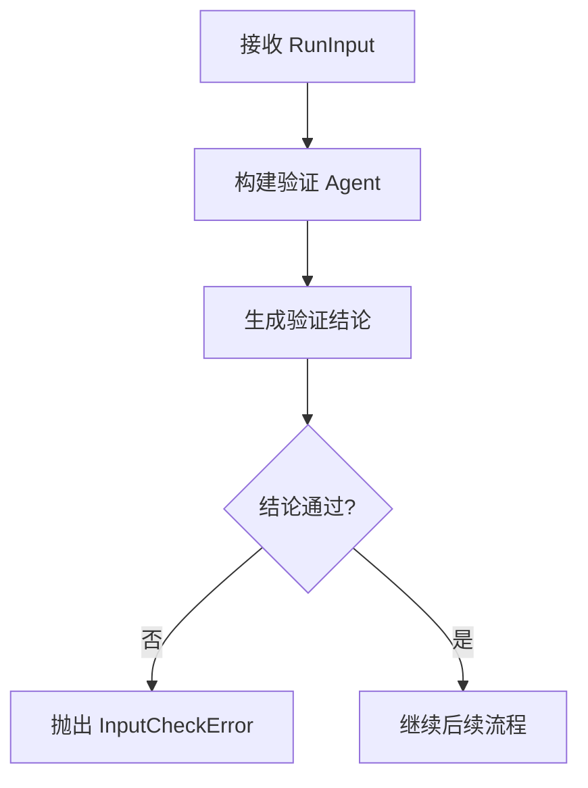
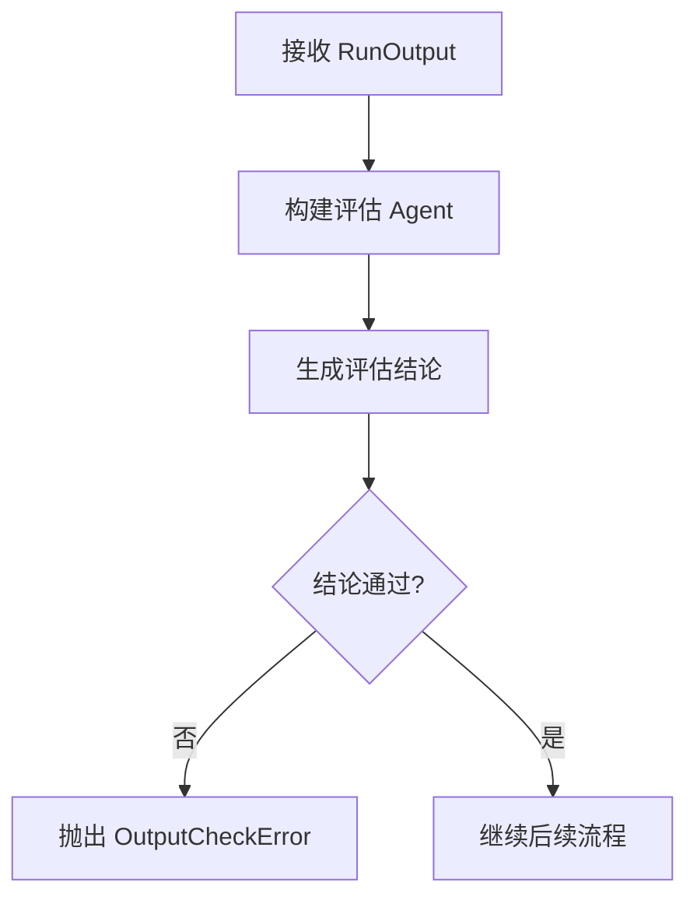
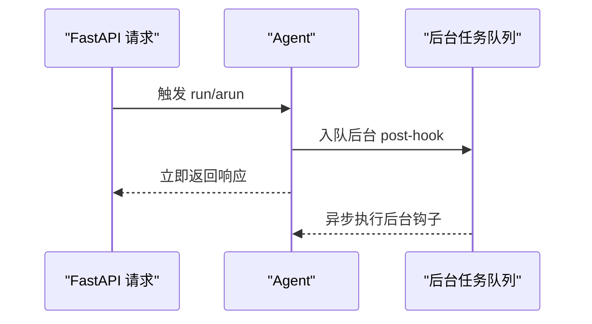
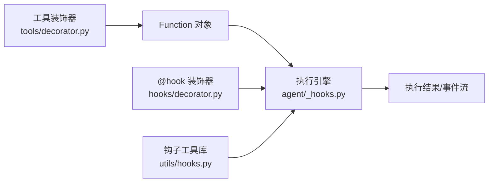

# 工具钩子

<cite>
**本文引用的文件**
- [cookbook/02_agents/09_hooks/tool_hooks.py](file://cookbook/02_agents/09_hooks/tool_hooks.py)
- [cookbook/02_agents/09_hooks/pre_hook_input.py](file://cookbook/02_agents/09_hooks/pre_hook_input.py)
- [cookbook/02_agents/09_hooks/post_hook_output.py](file://cookbook/02_agents/09_hooks/post_hook_output.py)
- [cookbook/02_agents/09_hooks/session_state_hooks.py](file://cookbook/02_agents/09_hooks/session_state_hooks.py)
- [cookbook/02_agents/09_hooks/stream_hook.py](file://cookbook/02_agents/09_hooks/stream_hook.py)
- [cookbook/05_agent_os/background_tasks/background_hooks_decorator.py](file://cookbook/05_agent_os/background_tasks/background_hooks_decorator.py)
- [libs/agno/agno/hooks/decorator.py](file://libs/agno/agno/hooks/decorator.py)
- [libs/agno/agno/agent/_hooks.py](file://libs/agno/agno/agent/_hooks.py)
- [libs/agno/agno/tools/decorator.py](file://libs/agno/agno/tools/decorator.py)
- [libs/agno/agno/utils/hooks.py](file://libs/agno/agno/utils/hooks.py)
- [cookbook/03_teams/03_tools/member_tool_hooks.py](file://cookbook/03_teams/03_tools/member_tool_hooks.py)
- [cookbook/03_teams/13_hooks/post_hook_output.py](file://cookbook/03_teams/13_hooks/post_hook_output.py)
- [cookbook/09_evals/agent_as_judge/agent_as_judge_post_hook.py](file://cookbook/09_evals/agent_as_judge/agent_as_judge_post_hook.py)
</cite>

## 目录
1. [简介](#简介)
2. [项目结构](#项目结构)
3. [核心组件](#核心组件)
4. [架构总览](#架构总览)
5. [详细组件分析](#详细组件分析)
6. [依赖分析](#依赖分析)
7. [性能考虑](#性能考虑)
8. [故障排查指南](#故障排查指南)
9. [结论](#结论)
10. [附录](#附录)

## 简介
本篇文档围绕“工具钩子”体系进行系统化说明，覆盖设计理念、实现机制、类型与触发时机、执行顺序、参数传递、用户控制流与反馈钩子、实际应用场景、与 AgentOS 集成以及调试与测试方法。读者可据此在工具调用前后插入自定义逻辑，实现权限校验、审计日志、性能监控、用户确认、输入/输出质量评估、团队协作输出规范化等能力。

## 项目结构
工具钩子相关代码分布在以下位置：
- 示例与用法：cookbook/02_agents/09_hooks、cookbook/03_teams、cookbook/05_agent_os、cookbook/09_evals
- 核心运行时与工具装饰器：libs/agno/agno/agent/_hooks.py、libs/agno/agno/tools/decorator.py、libs/agno/agno/hooks/decorator.py、libs/agno/agno/utils/hooks.py

图表来源
- [cookbook/02_agents/09_hooks/tool_hooks.py:1-53](file://cookbook/02_agents/09_hooks/tool_hooks.py#L1-L53)
- [libs/agno/agno/agent/_hooks.py:43-470](file://libs/agno/agno/agent/_hooks.py#L43-L470)
- [libs/agno/agno/tools/decorator.py:87-294](file://libs/agno/agno/tools/decorator.py#L87-L294)
- [libs/agno/agno/hooks/decorator.py:56-165](file://libs/agno/agno/hooks/decorator.py#L56-L165)
- [libs/agno/agno/utils/hooks.py:1-179](file://libs/agno/agno/utils/hooks.py#L1-L179)

章节来源
- [cookbook/02_agents/09_hooks/tool_hooks.py:1-53](file://cookbook/02_agents/09_hooks/tool_hooks.py#L1-L53)
- [libs/agno/agno/agent/_hooks.py:43-470](file://libs/agno/agno/agent/_hooks.py#L43-L470)
- [libs/agno/agno/tools/decorator.py:87-294](file://libs/agno/agno/tools/decorator.py#L87-L294)
- [libs/agno/agno/hooks/decorator.py:56-165](file://libs/agno/agno/hooks/decorator.py#L56-L165)
- [libs/agno/agno/utils/hooks.py:1-179](file://libs/agno/agno/utils/hooks.py#L1-L179)

## 核心组件
- 工具中间件钩子（tool_hooks）
  - 在每个工具调用前/后执行，支持同步与异步，可修改参数、记录耗时、打印日志等。
  - 参考路径：[cookbook/02_agents/09_hooks/tool_hooks.py:19-31](file://cookbook/02_agents/09_hooks/tool_hooks.py#L19-L31)

- 输入预检钩子（pre-hook）
  - 在 Agent 运行前对请求内容进行安全、相关性、完整性等检查，可抛出 InputCheckError 中断流程。
  - 参考路径：[cookbook/02_agents/09_hooks/pre_hook_input.py:26-81](file://cookbook/02_agents/09_hooks/pre_hook_input.py#L26-L81)

- 输出后检钩子（post-hook）
  - 对响应内容进行质量、专业度、安全性等评估，可抛出 OutputCheckError 中断并阻断输出。
  - 参考路径：[cookbook/02_agents/09_hooks/post_hook_output.py:28-95](file://cookbook/02_agents/09_hooks/post_hook_output.py#L28-L95)

- 会话状态钩子
  - 在预检阶段更新会话状态，如提取话题、维护上下文。
  - 参考路径：[cookbook/02_agents/09_hooks/session_state_hooks.py:23-57](file://cookbook/02_agents/09_hooks/session_state_hooks.py#L23-L57)

- 流式通知钩子
  - 在后检阶段发送通知或邮件提醒，适合非阻塞场景。
  - 参考路径：[cookbook/02_agents/09_hooks/stream_hook.py:17-33](file://cookbook/02_agents/09_hooks/stream_hook.py#L17-L33)

- AgentOS 背景钩子
  - 使用 @hook(run_in_background=True) 将钩子标记为后台任务，配合 AgentOS 的 FastAPI 后台任务队列实现完全非阻塞。
  - 参考路径：[cookbook/05_agent_os/background_tasks/background_hooks_decorator.py:22-50](file://cookbook/05_agent_os/background_tasks/background_hooks_decorator.py#L22-L50)

- 团队工具钩子（权限）
  - 在工具调用前根据用户权限决定是否允许委派给团队成员，实现细粒度访问控制。
  - 参考路径：[cookbook/03_teams/03_tools/member_tool_hooks.py:62-93](file://cookbook/03_teams/03_tools/member_tool_hooks.py#L62-L93)

- 团队输出后检
  - 对团队协作输出进行综合质量评估与格式化增强。
  - 参考路径：[cookbook/03_teams/13_hooks/post_hook_output.py:41-130](file://cookbook/03_teams/13_hooks/post_hook_output.py#L41-L130)

- 评测钩子（Agent-as-Judge）
  - 将评测评估作为后检钩子，自动评分与归档。
  - 参考路径：[cookbook/09_evals/agent_as_judge/agent_as_judge_post_hook.py:20-27](file://cookbook/09_evals/agent_as_judge/agent_as_judge_post_hook.py#L20-L27)

章节来源
- [cookbook/02_agents/09_hooks/tool_hooks.py:19-31](file://cookbook/02_agents/09_hooks/tool_hooks.py#L19-L31)
- [cookbook/02_agents/09_hooks/pre_hook_input.py:26-81](file://cookbook/02_agents/09_hooks/pre_hook_input.py#L26-L81)
- [cookbook/02_agents/09_hooks/post_hook_output.py:28-95](file://cookbook/02_agents/09_hooks/post_hook_output.py#L28-L95)
- [cookbook/02_agents/09_hooks/session_state_hooks.py:23-57](file://cookbook/02_agents/09_hooks/session_state_hooks.py#L23-L57)
- [cookbook/02_agents/09_hooks/stream_hook.py:17-33](file://cookbook/02_agents/09_hooks/stream_hook.py#L17-L33)
- [cookbook/05_agent_os/background_tasks/background_hooks_decorator.py:22-50](file://cookbook/05_agent_os/background_tasks/background_hooks_decorator.py#L22-L50)
- [cookbook/03_teams/03_tools/member_tool_hooks.py:62-93](file://cookbook/03_teams/03_tools/member_tool_hooks.py#L62-L93)
- [cookbook/03_teams/13_hooks/post_hook_output.py:41-130](file://cookbook/03_teams/13_hooks/post_hook_output.py#L41-L130)
- [cookbook/09_evals/agent_as_judge/agent_as_judge_post_hook.py:20-27](file://cookbook/09_evals/agent_as_judge/agent_as_judge_post_hook.py#L20-L27)

## 架构总览
工具钩子贯穿 Agent/Team 的运行生命周期，分为三类：
- 工具级钩子（tool_hooks）：包裹单个工具调用，支持 pre-hook 与 post-hook 组合。
- Agent/Team 钩子：在 run/arun 前后执行，分别对应 pre_hooks 与 post_hooks。
- 背景钩子：通过 @hook(run_in_background=True) 标记，在 AgentOS 中以后台任务执行。

图表来源
- [libs/agno/agno/agent/_hooks.py:43-470](file://libs/agno/agno/agent/_hooks.py#L43-L470)
- [libs/agno/agno/hooks/decorator.py:56-165](file://libs/agno/agno/hooks/decorator.py#L56-L165)
- [libs/agno/agno/utils/hooks.py:15-54](file://libs/agno/agno/utils/hooks.py#L15-L54)

## 详细组件分析

### 工具中间件钩子（tool_hooks）
- 设计理念
  - 将通用横切关注点（如鉴权、限流、埋点、缓存）下沉到工具层，避免在业务函数中重复实现。
- 触发时机
  - 每次工具调用前执行，可读取/修改参数；工具返回后再执行，可记录耗时、统计指标。
- 执行顺序
  - 按声明顺序依次执行，前一个钩子可影响下一个钩子收到的参数。
- 参数传递
  - 接收 function_name、func、args；可在钩子内修改 args 并调用 func(**args)。
- 实现要点
  - 支持同步与异步工具；建议在钩子中进行幂等操作，避免副作用。
- 示例参考
  - 计时与日志钩子：[cookbook/02_agents/09_hooks/tool_hooks.py:19-31](file://cookbook/02_agents/09_hooks/tool_hooks.py#L19-L31)

图表来源
- [cookbook/02_agents/09_hooks/tool_hooks.py:19-31](file://cookbook/02_agents/09_hooks/tool_hooks.py#L19-L31)

章节来源
- [cookbook/02_agents/09_hooks/tool_hooks.py:19-31](file://cookbook/02_agents/09_hooks/tool_hooks.py#L19-L31)

### 输入预检钩子（pre-hook）
- 功能目标
  - 在请求进入 Agent/Team 之前进行安全、相关性、完整性等检查，必要时阻断。
- 关键点
  - 可使用 Agent 自身进行二次判断，结合 Pydantic Schema 输出结构化结论。
  - 抛出 InputCheckError 时，错误信息与触发原因可用于上层策略。
- 示例参考
  - 复杂输入验证（安全、相关、细节）：[cookbook/02_agents/09_hooks/pre_hook_input.py:26-81](file://cookbook/02_agents/09_hooks/pre_hook_input.py#L26-L81)

图表来源
- [cookbook/02_agents/09_hooks/pre_hook_input.py:26-81](file://cookbook/02_agents/09_hooks/pre_hook_input.py#L26-L81)

章节来源
- [cookbook/02_agents/09_hooks/pre_hook_input.py:26-81](file://cookbook/02_agents/09_hooks/pre_hook_input.py#L26-L81)

### 输出后检钩子（post-hook）
- 功能目标
  - 对最终输出进行质量、专业度、安全性评估，必要时阻断输出。
- 关键点
  - 可设置长度阈值、置信度阈值等规则；失败时抛出 OutputCheckError。
  - 支持简单规则与复杂模型双重策略。
- 示例参考
  - 复杂质量评估与简单长度校验：[cookbook/02_agents/09_hooks/post_hook_output.py:28-95](file://cookbook/02_agents/09_hooks/post_hook_output.py#L28-L95)

图表来源
- [cookbook/02_agents/09_hooks/post_hook_output.py:28-95](file://cookbook/02_agents/09_hooks/post_hook_output.py#L28-L95)

章节来源
- [cookbook/02_agents/09_hooks/post_hook_output.py:28-95](file://cookbook/02_agents/09_hooks/post_hook_output.py#L28-L95)

### 会话状态钩子
- 功能目标
  - 在预检阶段更新会话状态，如提取话题、维护历史、注入上下文。
- 关键点
  - 利用 Agent 分析用户输入，将结构化结果写入 session_state，供后续钩子与工具使用。
- 示例参考
  - 话题追踪与会话状态更新：[cookbook/02_agents/09_hooks/session_state_hooks.py:23-57](file://cookbook/02_agents/09_hooks/session_state_hooks.py#L23-L57)

章节来源
- [cookbook/02_agents/09_hooks/session_state_hooks.py:23-57](file://cookbook/02_agents/09_hooks/session_state_hooks.py#L23-L57)

### 流式通知钩子
- 功能目标
  - 在后检阶段发送通知（如邮件），适合非阻塞场景。
- 关键点
  - 从 RunContext.metadata 获取用户邮箱等元数据，异步发送。
- 示例参考
  - 发送通知后检钩子：[cookbook/02_agents/09_hooks/stream_hook.py:17-33](file://cookbook/02_agents/09_hooks/stream_hook.py#L17-L33)

章节来源
- [cookbook/02_agents/09_hooks/stream_hook.py:17-33](file://cookbook/02_agents/09_hooks/stream_hook.py#L17-L33)

### AgentOS 背景钩子
- 功能目标
  - 将钩子标记为后台任务，完全不阻塞 API 响应。
- 关键点
  - 使用 @hook(run_in_background=True)，在 AgentOS 中由 FastAPI 后台任务队列调度。
  - 预检钩子在后台模式下不可修改输入，仅用于日志、统计等无副作用任务。
- 示例参考
  - 背景预检与后台通知：[cookbook/05_agent_os/background_tasks/background_hooks_decorator.py:22-50](file://cookbook/05_agent_os/background_tasks/background_hooks_decorator.py#L22-L50)

图表来源
- [cookbook/05_agent_os/background_tasks/background_hooks_decorator.py:22-50](file://cookbook/05_agent_os/background_tasks/background_hooks_decorator.py#L22-L50)
- [libs/agno/agno/hooks/decorator.py:56-165](file://libs/agno/agno/hooks/decorator.py#L56-L165)

章节来源
- [cookbook/05_agent_os/background_tasks/background_hooks_decorator.py:22-50](file://cookbook/05_agent_os/background_tasks/background_hooks_decorator.py#L22-L50)
- [libs/agno/agno/hooks/decorator.py:56-165](file://libs/agno/agno/hooks/decorator.py#L56-L165)

### 团队工具钩子（权限）
- 功能目标
  - 在工具调用前根据用户权限决定是否允许委派给团队成员，实现细粒度访问控制。
- 关键点
  - 通过 session_state 或上下文获取当前用户 ID，再比对权限集合。
- 示例参考
  - 成员工具钩子（权限）：[cookbook/03_teams/03_tools/member_tool_hooks.py:62-93](file://cookbook/03_teams/03_tools/member_tool_hooks.py#L62-L93)

章节来源
- [cookbook/03_teams/03_tools/member_tool_hooks.py:62-93](file://cookbook/03_teams/03_tools/member_tool_hooks.py#L62-L93)

### 团队输出后检
- 功能目标
  - 对团队协作输出进行综合质量评估与格式化增强，确保多视角协同价值得到体现。
- 关键点
  - 可进行一致性、专业度、安全性评估，并追加元数据或结构化摘要。
- 示例参考
  - 团队输出后检与格式化：[cookbook/03_teams/13_hooks/post_hook_output.py:41-130](file://cookbook/03_teams/13_hooks/post_hook_output.py#L41-L130)

章节来源
- [cookbook/03_teams/13_hooks/post_hook_output.py:41-130](file://cookbook/03_teams/13_hooks/post_hook_output.py#L41-L130)

### 评测钩子（Agent-as-Judge）
- 功能目标
  - 将评测评估作为后检钩子，自动评分与归档，便于持续改进。
- 关键点
  - 支持同步与异步两种评测实例；结果可写入数据库以便查询。
- 示例参考
  - 评测钩子示例：[cookbook/09_evals/agent_as_judge/agent_as_judge_post_hook.py:20-27](file://cookbook/09_evals/agent_as_judge/agent_as_judge_post_hook.py#L20-L27)

章节来源
- [cookbook/09_evals/agent_as_judge/agent_as_judge_post_hook.py:20-27](file://cookbook/09_evals/agent_as_judge/agent_as_judge_post_hook.py#L20-L27)

## 依赖分析
- 工具装饰器与钩子配置
  - @tool 支持 pre_hook、post_hook、tool_hooks 等参数，统一将函数包装为 Function。
  - 参考路径：[libs/agno/agno/tools/decorator.py:87-294](file://libs/agno/agno/tools/decorator.py#L87-L294)

- 钩子装饰器（背景任务）
  - @hook(run_in_background=True) 标记钩子为后台执行，属性持久化至包装器。
  - 参考路径：[libs/agno/agno/hooks/decorator.py:56-165](file://libs/agno/agno/hooks/decorator.py#L56-L165)

- 钩子执行引擎
  - execute_pre_hooks/aexecute_pre_hooks、execute_post_hooks/aexecute_post_hooks 负责按序执行、过滤参数、处理异常、事件流与后台任务。
  - 参考路径：[libs/agno/agno/agent/_hooks.py:43-470](file://libs/agno/agno/agent/_hooks.py#L43-L470)

- 钩子工具函数库
  - copy_args_for_background、should_run_hook_in_background、filter_hook_args、normalize_* 等辅助函数。
  - 参考路径：[libs/agno/agno/utils/hooks.py:1-179](file://libs/agno/agno/utils/hooks.py#L1-L179)

图表来源
- [libs/agno/agno/tools/decorator.py:87-294](file://libs/agno/agno/tools/decorator.py#L87-L294)
- [libs/agno/agno/agent/_hooks.py:43-470](file://libs/agno/agno/agent/_hooks.py#L43-L470)
- [libs/agno/agno/hooks/decorator.py:56-165](file://libs/agno/agno/hooks/decorator.py#L56-L165)
- [libs/agno/agno/utils/hooks.py:1-179](file://libs/agno/agno/utils/hooks.py#L1-L179)

章节来源
- [libs/agno/agno/tools/decorator.py:87-294](file://libs/agno/agno/tools/decorator.py#L87-L294)
- [libs/agno/agno/agent/_hooks.py:43-470](file://libs/agno/agno/agent/_hooks.py#L43-L470)
- [libs/agno/agno/hooks/decorator.py:56-165](file://libs/agno/agno/hooks/decorator.py#L56-L165)
- [libs/agno/agno/utils/hooks.py:1-179](file://libs/agno/agno/utils/hooks.py#L1-L179)

## 性能考虑
- 同步 vs 异步钩子
  - 同步 run() 不支持异步钩子；异步 arun() 支持异步钩子。若使用异步钩子，请使用异步运行接口。
  - 参考路径：[libs/agno/agno/agent/_hooks.py:123-127](file://libs/agno/agno/agent/_hooks.py#L123-L127)

- 后台执行与深拷贝
  - 后台钩子会对敏感参数进行深拷贝，防止竞态；若对象不可深拷贝，将回退为原引用并发出警告。
  - 参考路径：[libs/agno/agno/utils/hooks.py:15-39](file://libs/agno/agno/utils/hooks.py#L15-L39)

- 守卫类钩子（Guardrail/Eval）
  - 必须同步执行，以保证 InputCheckError/OutputCheckError 能正确传播；非守卫类钩子可后台执行。
  - 参考路径：[libs/agno/agno/agent/_hooks.py:74-98](file://libs/agno/agno/agent/_hooks.py#L74-L98)

- 工具中间件钩子
  - 计时与日志钩子属于轻量操作，建议保持同步；若需外部 IO，优先考虑后台模式。
  - 参考路径：[cookbook/02_agents/09_hooks/tool_hooks.py:19-31](file://cookbook/02_agents/09_hooks/tool_hooks.py#L19-L31)

章节来源
- [libs/agno/agno/agent/_hooks.py:74-98](file://libs/agno/agno/agent/_hooks.py#L74-L98)
- [libs/agno/agno/utils/hooks.py:15-39](file://libs/agno/agno/utils/hooks.py#L15-L39)
- [cookbook/02_agents/09_hooks/tool_hooks.py:19-31](file://cookbook/02_agents/09_hooks/tool_hooks.py#L19-L31)

## 故障排查指南
- 钩子签名不匹配
  - 使用 filter_hook_args 时，若钩子未声明接受的参数名，将被过滤；若需要接收全部参数，可声明 **kwargs。
  - 参考路径：[libs/agno/agno/utils/hooks.py:156-179](file://libs/agno/agno/utils/hooks.py#L156-L179)

- 异步钩子在同步 run() 中使用
  - 同步 run() 会拒绝异步钩子，提示改用 arun()。
  - 参考路径：[libs/agno/agno/utils/hooks.py:100-107](file://libs/agno/agno/utils/hooks.py#L100-L107)

- 后台钩子参数竞态
  - 若深拷贝失败，将使用原引用并记录警告；请确保传入对象可序列化或避免共享可变状态。
  - 参考路径：[libs/agno/agno/utils/hooks.py:31-36](file://libs/agno/agno/utils/hooks.py#L31-L36)

- 守卫类钩子被后台模式影响
  - 守卫类钩子必须同步执行；后台模式下会单独处理守卫钩子，其余钩子入队。
  - 参考路径：[libs/agno/agno/agent/_hooks.py:74-98](file://libs/agno/agno/agent/_hooks.py#L74-L98)

- 输入/输出拦截
  - InputCheckError/OutputCheckError 会在相应钩子中抛出并中断流程；可通过捕获并记录上下文定位问题。
  - 参考路径：[libs/agno/agno/agent/_hooks.py:143-147](file://libs/agno/agno/agent/_hooks.py#L143-L147)

章节来源
- [libs/agno/agno/utils/hooks.py:100-107](file://libs/agno/agno/utils/hooks.py#L100-L107)
- [libs/agno/agno/utils/hooks.py:156-179](file://libs/agno/agno/utils/hooks.py#L156-L179)
- [libs/agno/agno/utils/hooks.py:31-36](file://libs/agno/agno/utils/hooks.py#L31-L36)
- [libs/agno/agno/agent/_hooks.py:74-98](file://libs/agno/agno/agent/_hooks.py#L74-L98)
- [libs/agno/agno/agent/_hooks.py:143-147](file://libs/agno/agno/agent/_hooks.py#L143-L147)

## 结论
工具钩子提供了强大的横切能力，既能在工具层实现复用与标准化，也能在 Agent/Team 生命周期中完成输入/输出治理与用户体验增强。通过 @hook(run_in_background=True) 与 AgentOS 的后台任务队列，可进一步提升系统的吞吐与稳定性。结合权限控制、评测评估与格式化增强，工具钩子体系能够支撑从安全合规到质量优化的全栈需求。

## 附录
- 实际应用示例清单
  - 工具调用限制与权限验证：[cookbook/03_teams/03_tools/member_tool_hooks.py:62-93](file://cookbook/03_teams/03_tools/member_tool_hooks.py#L62-L93)
  - 审计日志与性能监控：[cookbook/02_agents/09_hooks/tool_hooks.py:19-31](file://cookbook/02_agents/09_hooks/tool_hooks.py#L19-L31)
  - 用户确认与交互式工具调用：[cookbook/02_agents/09_hooks/pre_hook_input.py:26-81](file://cookbook/02_agents/09_hooks/pre_hook_input.py#L26-L81)
  - 用户反馈钩子（满意度调查/使用统计/行为分析）：可基于会话状态钩子与后检钩子组合实现，参考 [cookbook/02_agents/09_hooks/session_state_hooks.py:23-57](file://cookbook/02_agents/09_hooks/session_state_hooks.py#L23-L57) 与 [cookbook/02_agents/09_hooks/stream_hook.py:17-33](file://cookbook/02_agents/09_hooks/stream_hook.py#L17-L33)
  - 评测与质量评估：[cookbook/09_evals/agent_as_judge/agent_as_judge_post_hook.py:20-27](file://cookbook/09_evals/agent_as_judge/agent_as_judge_post_hook.py#L20-L27)
  - 团队协作输出规范化：[cookbook/03_teams/13_hooks/post_hook_output.py:166-282](file://cookbook/03_teams/13_hooks/post_hook_output.py#L166-L282)