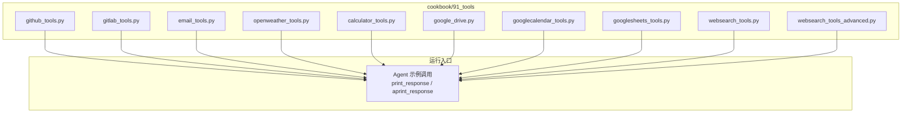
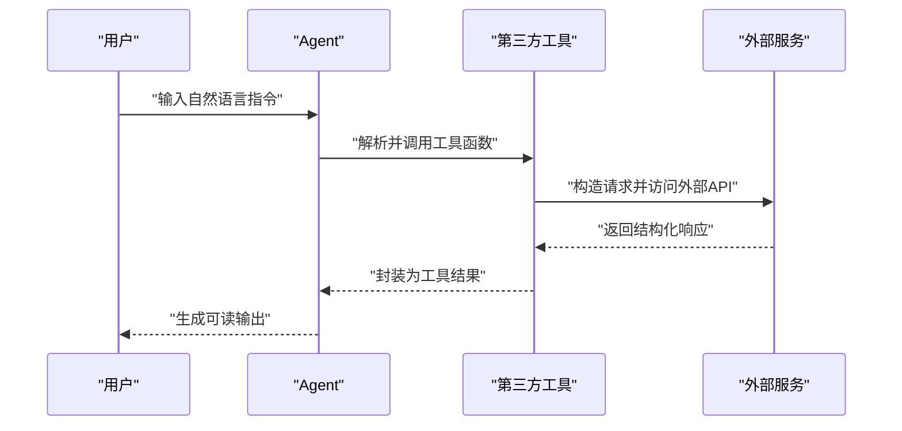
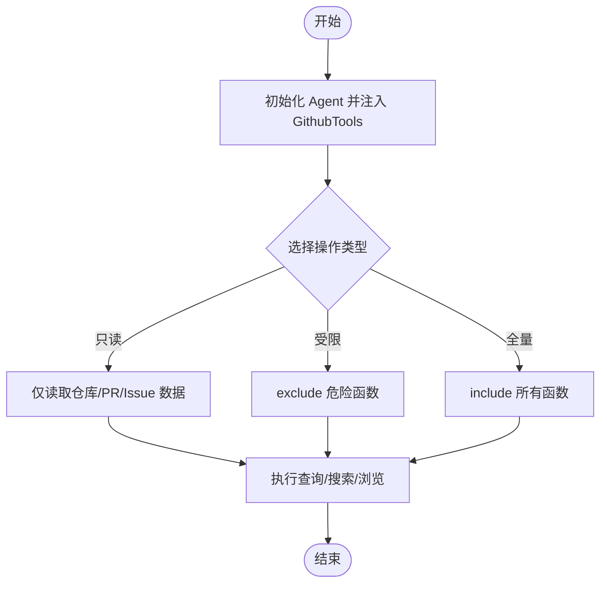
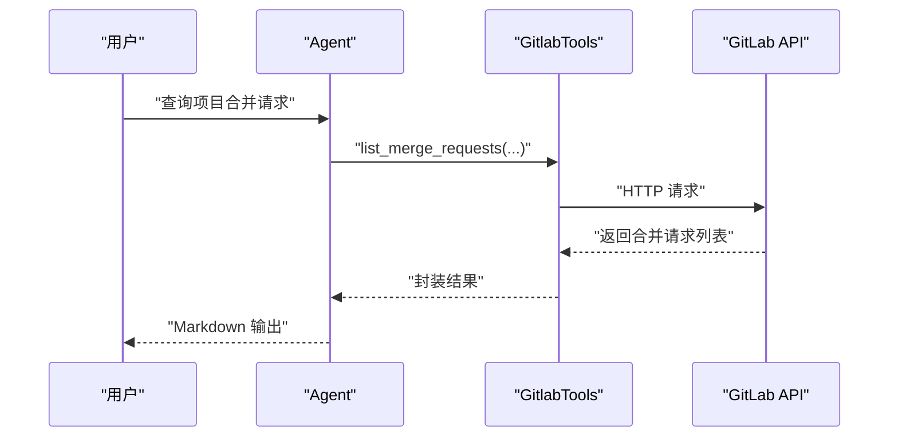
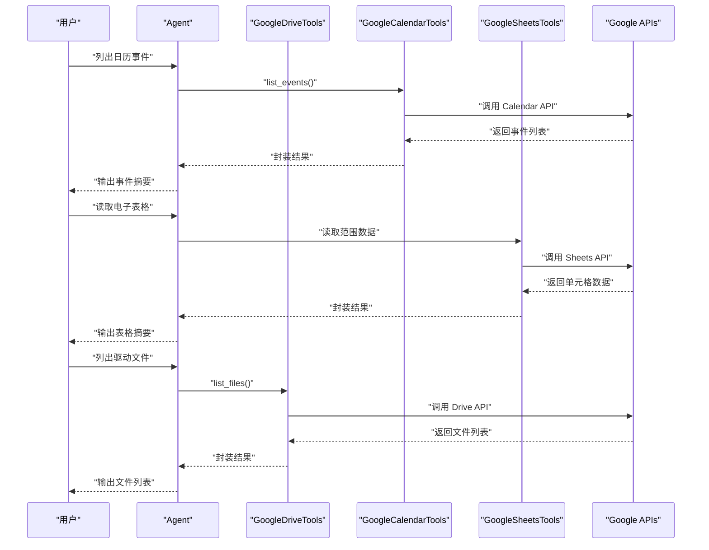
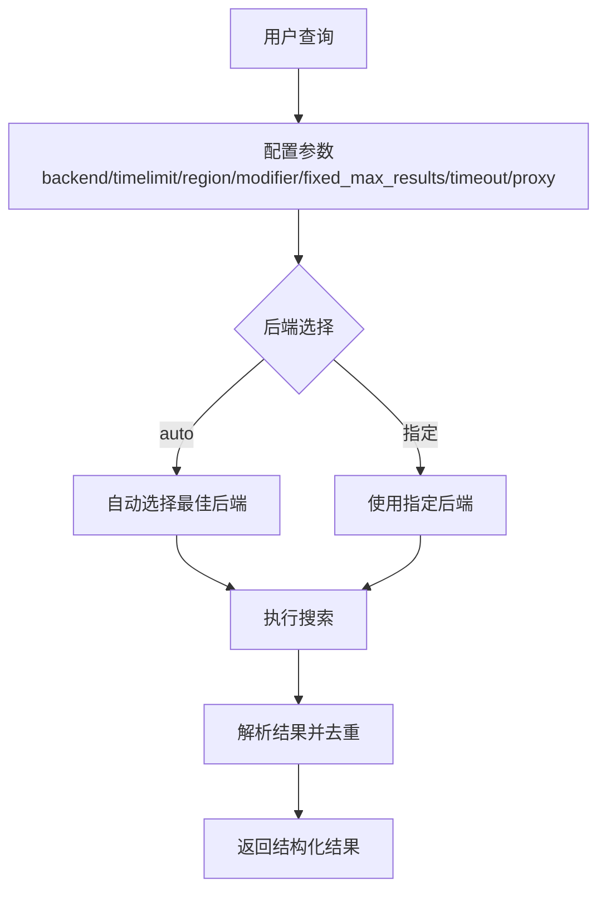
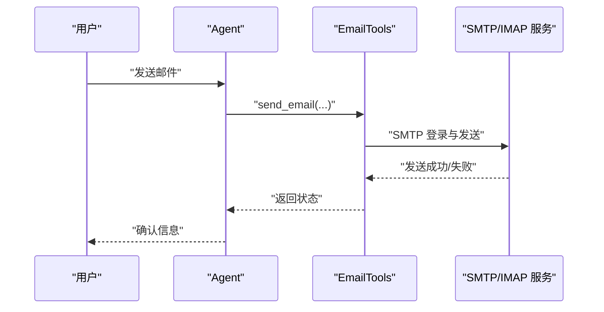
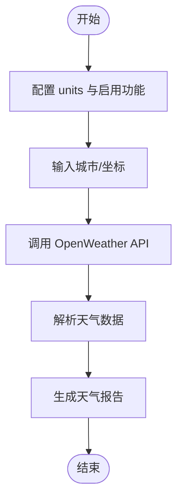
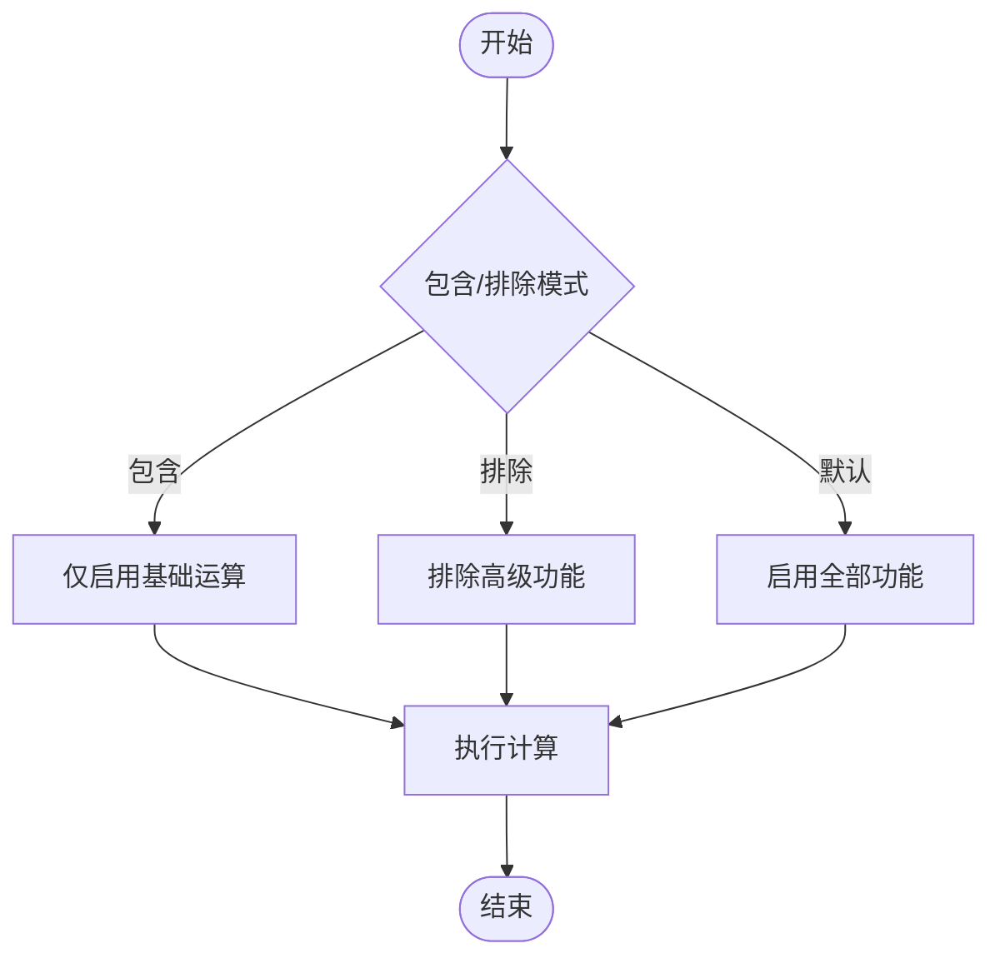
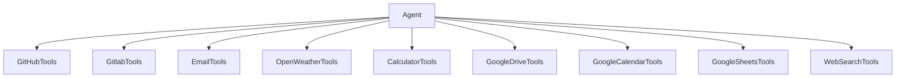

# 第三方工具

<cite>
**本文引用的文件**
- [cookbook/91_tools/github_tools.py](file://cookbook/91_tools/github_tools.py)
- [cookbook/91_tools/gitlab_tools.py](file://cookbook/91_tools/gitlab_tools.py)
- [cookbook/91_tools/email_tools.py](file://cookbook/91_tools/email_tools.py)
- [cookbook/91_tools/openweather_tools.py](file://cookbook/91_tools/openweather_tools.py)
- [cookbook/91_tools/calculator_tools.py](file://cookbook/91_tools/calculator_tools.py)
- [cookbook/91_tools/google_drive.py](file://cookbook/91_tools/google_drive.py)
- [cookbook/91_tools/googlecalendar_tools.py](file://cookbook/91_tools/googlecalendar_tools.py)
- [cookbook/91_tools/googlesheets_tools.py](file://cookbook/91_tools/googlesheets_tools.py)
- [cookbook/91_tools/websearch_tools.py](file://cookbook/91_tools/websearch_tools.py)
- [cookbook/91_tools/websearch_tools_advanced.py](file://cookbook/91_tools/websearch_tools_advanced.py)
</cite>

## 目录
1. [简介](#简介)
2. [项目结构](#项目结构)
3. [核心组件](#核心组件)
4. [架构总览](#架构总览)
5. [详细组件分析](#详细组件分析)
6. [依赖分析](#依赖分析)
7. [性能考虑](#性能考虑)
8. [故障排查指南](#故障排查指南)
9. [结论](#结论)
10. [附录](#附录)

## 简介
本文件面向第三方工具系统，系统性梳理与说明各类外部服务工具的集成与使用方法，覆盖以下主题：
- GitHub 工具：仓库检索、问题与拉取请求管理、分支与文件操作、代码搜索、评审流程等
- GitLab 工具：项目列表、合并请求、问题管理等
- Google 工具系列：Gmail（通过通用邮件工具）、Google Drive、Google Calendar、Google Sheets 的使用与认证
- Web 搜索工具：多后端搜索引擎集成、时间/区域过滤、新闻搜索、代理与超时配置
- 邮件工具：发件人/收件人配置、发送/接收、附件与模板能力
- 天气工具：当前天气、预报、空气质量、地理编码
- 计算器工具：基础运算、单位换算、科学计算
- 组合工作流：多工具协同完成复杂任务的实践路径

## 项目结构
本项目的“食谱”目录下提供了大量工具示例脚本，便于快速上手与验证功能。以下图示化展示与“第三方工具”相关的示例组织方式。

图表来源
- [cookbook/91_tools/github_tools.py:1-225](file://cookbook/91_tools/github_tools.py#L1-L225)
- [cookbook/91_tools/gitlab_tools.py:1-54](file://cookbook/91_tools/gitlab_tools.py#L1-L54)
- [cookbook/91_tools/email_tools.py:1-57](file://cookbook/91_tools/email_tools.py#L1-L57)
- [cookbook/91_tools/openweather_tools.py:1-108](file://cookbook/91_tools/openweather_tools.py#L1-L108)
- [cookbook/91_tools/calculator_tools.py:1-41](file://cookbook/91_tools/calculator_tools.py#L1-L41)
- [cookbook/91_tools/google_drive.py:1-58](file://cookbook/91_tools/google_drive.py#L1-L58)
- [cookbook/91_tools/googlecalendar_tools.py:1-119](file://cookbook/91_tools/googlecalendar_tools.py#L1-L119)
- [cookbook/91_tools/googlesheets_tools.py:1-48](file://cookbook/91_tools/googlesheets_tools.py#L1-L48)
- [cookbook/91_tools/websearch_tools.py:1-107](file://cookbook/91_tools/websearch_tools.py#L1-L107)
- [cookbook/91_tools/websearch_tools_advanced.py:1-328](file://cookbook/91_tools/websearch_tools_advanced.py#L1-L328)

章节来源
- [cookbook/91_tools/github_tools.py:1-225](file://cookbook/91_tools/github_tools.py#L1-L225)
- [cookbook/91_tools/gitlab_tools.py:1-54](file://cookbook/91_tools/gitlab_tools.py#L1-L54)
- [cookbook/91_tools/email_tools.py:1-57](file://cookbook/91_tools/email_tools.py#L1-L57)
- [cookbook/91_tools/openweather_tools.py:1-108](file://cookbook/91_tools/openweather_tools.py#L1-L108)
- [cookbook/91_tools/calculator_tools.py:1-41](file://cookbook/91_tools/calculator_tools.py#L1-L41)
- [cookbook/91_tools/google_drive.py:1-58](file://cookbook/91_tools/google_drive.py#L1-L58)
- [cookbook/91_tools/googlecalendar_tools.py:1-119](file://cookbook/91_tools/googlecalendar_tools.py#L1-L119)
- [cookbook/91_tools/googlesheets_tools.py:1-48](file://cookbook/91_tools/googlesheets_tools.py#L1-L48)
- [cookbook/91_tools/websearch_tools.py:1-107](file://cookbook/91_tools/websearch_tools.py#L1-L107)
- [cookbook/91_tools/websearch_tools_advanced.py:1-328](file://cookbook/91_tools/websearch_tools_advanced.py#L1-L328)

## 核心组件
- GitHub 工具：支持仓库检索、问题与 PR 列表、文件与分支操作、代码搜索、评论与评审等；可通过 include/exclude 精细控制可用函数
- GitLab 工具：支持项目列表、获取项目、合并请求列表与详情、问题列表等
- Google 工具系列：Google Drive（列出/上传/下载文件）、Google Calendar（事件查询/创建/更新/删除/空闲时段查找）、Google Sheets（读取/范围/凭据）
- Web 搜索工具：自动后端选择或指定 DuckDuckGo/Google/Bing/Brave/Yandex/Yahoo；支持时间窗口、地区、固定最大结果数、代理与超时
- 邮件工具：基于通用邮件工具，支持发件人/收件人/名称/密钥配置，启用特定或全部功能
- 天气工具：当前天气、预报、空气质量、地理编码；支持单位制（标准/公制/英制）
- 计算器工具：加减乘除、幂、阶乘、质数判断等；可按需包含/排除功能

章节来源
- [cookbook/91_tools/github_tools.py:37-82](file://cookbook/91_tools/github_tools.py#L37-L82)
- [cookbook/91_tools/gitlab_tools.py:19-33](file://cookbook/91_tools/gitlab_tools.py#L19-L33)
- [cookbook/91_tools/google_drive.py:30-38](file://cookbook/91_tools/google_drive.py#L30-L38)
- [cookbook/91_tools/googlecalendar_tools.py:51-72](file://cookbook/91_tools/googlecalendar_tools.py#L51-L72)
- [cookbook/91_tools/googlesheets_tools.py:26-41](file://cookbook/91_tools/googlesheets_tools.py#L26-L41)
- [cookbook/91_tools/websearch_tools.py:16-60](file://cookbook/91_tools/websearch_tools.py#L16-L60)
- [cookbook/91_tools/email_tools.py:21-45](file://cookbook/91_tools/email_tools.py#L21-L45)
- [cookbook/91_tools/openweather_tools.py:26-63](file://cookbook/91_tools/openweather_tools.py#L26-L63)
- [cookbook/91_tools/calculator_tools.py:16-32](file://cookbook/91_tools/calculator_tools.py#L16-L32)

## 架构总览
下图展示了“Agent + 工具”的典型交互流程：用户输入经由 Agent 调用具体工具，工具通过外部 API 获取数据并返回给 Agent，最终以结构化输出呈现。

图表来源
- [cookbook/91_tools/github_tools.py:89-91](file://cookbook/91_tools/github_tools.py#L89-L91)
- [cookbook/91_tools/gitlab_tools.py:38-42](file://cookbook/91_tools/gitlab_tools.py#L38-L42)
- [cookbook/91_tools/websearch_tools.py:65-70](file://cookbook/91_tools/websearch_tools.py#L65-L70)
- [cookbook/91_tools/email_tools.py:52-56](file://cookbook/91_tools/email_tools.py#L52-L56)
- [cookbook/91_tools/openweather_tools.py:70-75](file://cookbook/91_tools/openweather_tools.py#L70-L75)
- [cookbook/91_tools/calculator_tools.py:37-40](file://cookbook/91_tools/calculator_tools.py#L37-L40)
- [cookbook/91_tools/googlecalendar_tools.py:79-80](file://cookbook/91_tools/googlecalendar_tools.py#L79-L80)
- [cookbook/91_tools/googlesheets_tools.py:46-47](file://cookbook/91_tools/googlesheets_tools.py#L46-L47)
- [cookbook/91_tools/google_drive.py:45-46](file://cookbook/91_tools/google_drive.py#L45-L46)

## 详细组件分析

### GitHub 工具
- 功能特性
  - 仓库检索与统计、分支与文件浏览、代码搜索
  - 问题与拉取请求的列表、详情、评论与评审
  - 文件读写与分支管理（示例中默认安全模式禁用危险操作）
- 认证与环境变量
  - PAT（个人访问令牌）与基础 URL（支持公共与企业版）
- 使用限制
  - 默认启用所有工具；可通过 include/exclude 精准授权
  - 安全示例明确禁止删除/创建等高危操作
- 错误处理
  - 通过 Agent 的工具调用机制进行异常捕获与提示

图表来源
- [cookbook/91_tools/github_tools.py:37-82](file://cookbook/91_tools/github_tools.py#L37-L82)
- [cookbook/91_tools/github_tools.py:89-225](file://cookbook/91_tools/github_tools.py#L89-L225)

章节来源
- [cookbook/91_tools/github_tools.py:1-27](file://cookbook/91_tools/github_tools.py#L1-L27)
- [cookbook/91_tools/github_tools.py:37-82](file://cookbook/91_tools/github_tools.py#L37-L82)
- [cookbook/91_tools/github_tools.py:89-225](file://cookbook/91_tools/github_tools.py#L89-L225)

### GitLab 工具
- 功能特性
  - 项目列表、获取项目信息
  - 合并请求列表与详情、问题列表
- 认证与环境变量
  - 个人访问令牌与可选基础 URL
- 使用限制
  - 示例启用只读能力，避免修改操作
- 异步支持
  - 提供异步打印接口用于并发场景

图表来源
- [cookbook/91_tools/gitlab_tools.py:19-33](file://cookbook/91_tools/gitlab_tools.py#L19-L33)
- [cookbook/91_tools/gitlab_tools.py:38-53](file://cookbook/91_tools/gitlab_tools.py#L38-L53)

章节来源
- [cookbook/91_tools/gitlab_tools.py:1-9](file://cookbook/91_tools/gitlab_tools.py#L1-L9)
- [cookbook/91_tools/gitlab_tools.py:19-33](file://cookbook/91_tools/gitlab_tools.py#L19-L33)
- [cookbook/91_tools/gitlab_tools.py:38-53](file://cookbook/91_tools/gitlab_tools.py#L38-L53)

### Google 工具系列
- Google Drive
  - 功能：列出、上传、下载文件
  - 认证：OAuth 2.0 回调端口与配额项目设置
- Google Calendar
  - 功能：事件查询、创建、更新、删除、空闲时段查找
  - 认证：OAuth 凭证路径与令牌路径、允许更新开关
- Google Sheets
  - 功能：读取电子表格内容（指定 ID 与范围）
  - 认证：OAuth 或服务账号文件路径

图表来源
- [cookbook/91_tools/googlecalendar_tools.py:51-72](file://cookbook/91_tools/googlecalendar_tools.py#L51-L72)
- [cookbook/91_tools/googlecalendar_tools.py:79-118](file://cookbook/91_tools/googlecalendar_tools.py#L79-L118)
- [cookbook/91_tools/googlesheets_tools.py:26-41](file://cookbook/91_tools/googlesheets_tools.py#L26-L41)
- [cookbook/91_tools/googlesheets_tools.py:46-47](file://cookbook/91_tools/googlesheets_tools.py#L46-L47)
- [cookbook/91_tools/google_drive.py:30-38](file://cookbook/91_tools/google_drive.py#L30-L38)
- [cookbook/91_tools/google_drive.py:45-57](file://cookbook/91_tools/google_drive.py#L45-L57)

章节来源
- [cookbook/91_tools/google_drive.py:1-20](file://cookbook/91_tools/google_drive.py#L1-L20)
- [cookbook/91_tools/google_drive.py:30-38](file://cookbook/91_tools/google_drive.py#L30-L38)
- [cookbook/91_tools/googlecalendar_tools.py:1-41](file://cookbook/91_tools/googlecalendar_tools.py#L1-L41)
- [cookbook/91_tools/googlecalendar_tools.py:51-72](file://cookbook/91_tools/googlecalendar_tools.py#L51-L72)
- [cookbook/91_tools/googlesheets_tools.py:1-16](file://cookbook/91_tools/googlesheets_tools.py#L1-L16)
- [cookbook/91_tools/googlesheets_tools.py:26-41](file://cookbook/91_tools/googlesheets_tools.py#L26-L41)

### Web 搜索工具
- 功能特性
  - 自动后端选择或多后端指定（DuckDuckGo/Google/Bing/Brave/Yandex/Yahoo）
  - 新闻搜索、时间窗口过滤、地区本地化、固定最大结果数、代理与超时
- 配置要点
  - backend/auto 与 modifier/fixed_max_results/timeout/proxy 等参数
- 使用建议
  - 结合 timelimit/region 实现“研究助理”“新闻助手”等角色化 Agent

图表来源
- [cookbook/91_tools/websearch_tools.py:16-60](file://cookbook/91_tools/websearch_tools.py#L16-L60)
- [cookbook/91_tools/websearch_tools_advanced.py:25-70](file://cookbook/91_tools/websearch_tools_advanced.py#L25-L70)
- [cookbook/91_tools/websearch_tools_advanced.py:77-135](file://cookbook/91_tools/websearch_tools_advanced.py#L77-L135)
- [cookbook/91_tools/websearch_tools_advanced.py:142-212](file://cookbook/91_tools/websearch_tools_advanced.py#L142-L212)
- [cookbook/91_tools/websearch_tools_advanced.py:219-235](file://cookbook/91_tools/websearch_tools_advanced.py#L219-L235)
- [cookbook/91_tools/websearch_tools_advanced.py:241-256](file://cookbook/91_tools/websearch_tools_advanced.py#L241-L256)

章节来源
- [cookbook/91_tools/websearch_tools.py:1-107](file://cookbook/91_tools/websearch_tools.py#L1-L107)
- [cookbook/91_tools/websearch_tools_advanced.py:1-328](file://cookbook/91_tools/websearch_tools_advanced.py#L1-L328)

### 邮件工具
- 功能特性
  - 发件人/收件人/名称/密钥配置
  - 启用特定或全部邮件功能
- 使用建议
  - 在 Agent 中声明 EmailTools 并通过自然语言指令触发发送/查询等动作

图表来源
- [cookbook/91_tools/email_tools.py:21-45](file://cookbook/91_tools/email_tools.py#L21-L45)
- [cookbook/91_tools/email_tools.py:52-56](file://cookbook/91_tools/email_tools.py#L52-L56)

章节来源
- [cookbook/91_tools/email_tools.py:1-57](file://cookbook/91_tools/email_tools.py#L1-L57)

### 天气工具
- 功能特性
  - 当前天气、天气预报、空气质量、地理编码
  - 支持单位制（标准/公制/英制）
- 使用建议
  - 先获取 API Key，再在 Agent 中启用相应功能

图表来源
- [cookbook/91_tools/openweather_tools.py:26-63](file://cookbook/91_tools/openweather_tools.py#L26-L63)
- [cookbook/91_tools/openweather_tools.py:70-107](file://cookbook/91_tools/openweather_tools.py#L70-L107)

章节来源
- [cookbook/91_tools/openweather_tools.py:1-108](file://cookbook/91_tools/openweather_tools.py#L1-L108)

### 计算器工具
- 功能特性
  - 基础四则运算、幂、阶乘、质数判断等
  - 可按需包含/排除功能
- 使用建议
  - 对于简单场景排除高级功能，提升安全性与稳定性

图表来源
- [cookbook/91_tools/calculator_tools.py:16-32](file://cookbook/91_tools/calculator_tools.py#L16-L32)
- [cookbook/91_tools/calculator_tools.py:37-40](file://cookbook/91_tools/calculator_tools.py#L37-L40)

章节来源
- [cookbook/91_tools/calculator_tools.py:1-41](file://cookbook/91_tools/calculator_tools.py#L1-L41)

## 依赖分析
- 工具与 Agent 的耦合
  - 所有示例均通过 Agent 构造函数注入工具实例，体现“工具即插拔”的设计
- 工具间协作
  - 可在同一 Agent 中组合多个工具，形成“搜索+天气+邮件”的复合工作流
- 外部依赖
  - 各工具依赖对应平台的 OAuth/令牌/密钥等认证机制
  - Web 搜索工具依赖多后端服务，受网络与代理影响

图表来源
- [cookbook/91_tools/github_tools.py:37-82](file://cookbook/91_tools/github_tools.py#L37-L82)
- [cookbook/91_tools/gitlab_tools.py:19-33](file://cookbook/91_tools/gitlab_tools.py#L19-L33)
- [cookbook/91_tools/email_tools.py:21-45](file://cookbook/91_tools/email_tools.py#L21-L45)
- [cookbook/91_tools/openweather_tools.py:26-63](file://cookbook/91_tools/openweather_tools.py#L26-L63)
- [cookbook/91_tools/calculator_tools.py:16-32](file://cookbook/91_tools/calculator_tools.py#L16-L32)
- [cookbook/91_tools/google_drive.py:30-38](file://cookbook/91_tools/google_drive.py#L30-L38)
- [cookbook/91_tools/googlecalendar_tools.py:51-72](file://cookbook/91_tools/googlecalendar_tools.py#L51-L72)
- [cookbook/91_tools/googlesheets_tools.py:26-41](file://cookbook/91_tools/googlesheets_tools.py#L26-L41)
- [cookbook/91_tools/websearch_tools.py:16-60](file://cookbook/91_tools/websearch_tools.py#L16-L60)

章节来源
- [cookbook/91_tools/github_tools.py:37-82](file://cookbook/91_tools/github_tools.py#L37-L82)
- [cookbook/91_tools/gitlab_tools.py:19-33](file://cookbook/91_tools/gitlab_tools.py#L19-L33)
- [cookbook/91_tools/email_tools.py:21-45](file://cookbook/91_tools/email_tools.py#L21-L45)
- [cookbook/91_tools/openweather_tools.py:26-63](file://cookbook/91_tools/openweather_tools.py#L26-L63)
- [cookbook/91_tools/calculator_tools.py:16-32](file://cookbook/91_tools/calculator_tools.py#L16-L32)
- [cookbook/91_tools/google_drive.py:30-38](file://cookbook/91_tools/google_drive.py#L30-L38)
- [cookbook/91_tools/googlecalendar_tools.py:51-72](file://cookbook/91_tools/googlecalendar_tools.py#L51-L72)
- [cookbook/91_tools/googlesheets_tools.py:26-41](file://cookbook/91_tools/googlesheets_tools.py#L26-L41)
- [cookbook/91_tools/websearch_tools.py:16-60](file://cookbook/91_tools/websearch_tools.py#L16-L60)

## 性能考虑
- 搜索工具
  - 合理设置 fixed_max_results 与 timeout，避免过长等待
  - 使用 timelimit/region 缩小搜索范围，提高相关性与速度
- Google 工具
  - OAuth 回调端口需保持可用；服务账号可减少交互式认证开销
- 天气工具
  - 合理缓存地理编码结果，降低重复查询成本
- 计算器工具
  - 在复杂表达式中分步计算，避免一次性大运算导致阻塞

## 故障排查指南
- GitHub 工具
  - 确认 PAT 权限与基础 URL 设置；如出现权限不足，检查 include/exclude 配置
- GitLab 工具
  - 确保令牌具备读取权限；如需修改操作，调整 enable_* 开关
- Google 工具
  - OAuth 未完成或回调地址不匹配会导致认证失败；检查端口与已授权 URI
- Web 搜索工具
  - 后端不可用或被屏蔽时，尝试切换 backend 或添加代理
- 邮件工具
  - 发件人凭据错误或服务端拒绝：核对邮箱、密码/应用专用密码与服务器设置
- 天气工具
  - API Key 未配置或额度耗尽：检查环境变量与配额状态
- 计算器工具
  - 表达式非法或溢出：拆分步骤并校验输入类型

章节来源
- [cookbook/91_tools/github_tools.py:1-27](file://cookbook/91_tools/github_tools.py#L1-L27)
- [cookbook/91_tools/gitlab_tools.py:4-9](file://cookbook/91_tools/gitlab_tools.py#L4-L9)
- [cookbook/91_tools/googlecalendar_tools.py:1-41](file://cookbook/91_tools/googlecalendar_tools.py#L1-L41)
- [cookbook/91_tools/websearch_tools.py:16-60](file://cookbook/91_tools/websearch_tools.py#L16-L60)
- [cookbook/91_tools/email_tools.py:21-45](file://cookbook/91_tools/email_tools.py#L21-L45)
- [cookbook/91_tools/openweather_tools.py:7-16](file://cookbook/91_tools/openweather_tools.py#L7-L16)
- [cookbook/91_tools/calculator_tools.py:16-32](file://cookbook/91_tools/calculator_tools.py#L16-L32)

## 结论
本系统通过“Agent + 工具”的架构，将多种第三方服务以统一接口接入，既保证了易用性，也兼顾了安全与可控性。结合示例脚本，用户可以快速搭建从搜索、天气、邮件到代码仓库与日程管理的自动化工作流，并通过参数化配置实现个性化与规模化应用。

## 附录
- 使用示例路径（不含代码内容）
  - GitHub 工具：[cookbook/91_tools/github_tools.py:37-82](file://cookbook/91_tools/github_tools.py#L37-L82)，[cookbook/91_tools/github_tools.py:89-225](file://cookbook/91_tools/github_tools.py#L89-L225)
  - GitLab 工具：[cookbook/91_tools/gitlab_tools.py:19-33](file://cookbook/91_tools/gitlab_tools.py#L19-L33)，[cookbook/91_tools/gitlab_tools.py:38-53](file://cookbook/91_tools/gitlab_tools.py#L38-L53)
  - 邮件工具：[cookbook/91_tools/email_tools.py:21-45](file://cookbook/91_tools/email_tools.py#L21-L45)，[cookbook/91_tools/email_tools.py:52-56](file://cookbook/91_tools/email_tools.py#L52-L56)
  - 天气工具：[cookbook/91_tools/openweather_tools.py:26-63](file://cookbook/91_tools/openweather_tools.py#L26-L63)，[cookbook/91_tools/openweather_tools.py:70-107](file://cookbook/91_tools/openweather_tools.py#L70-L107)
  - 计算器工具：[cookbook/91_tools/calculator_tools.py:16-32](file://cookbook/91_tools/calculator_tools.py#L16-L32)，[cookbook/91_tools/calculator_tools.py:37-40](file://cookbook/91_tools/calculator_tools.py#L37-L40)
  - Google Drive：[cookbook/91_tools/google_drive.py:30-38](file://cookbook/91_tools/google_drive.py#L30-L38)，[cookbook/91_tools/google_drive.py:45-57](file://cookbook/91_tools/google_drive.py#L45-L57)
  - Google Calendar：[cookbook/91_tools/googlecalendar_tools.py:51-72](file://cookbook/91_tools/googlecalendar_tools.py#L51-L72)，[cookbook/91_tools/googlecalendar_tools.py:79-118](file://cookbook/91_tools/googlecalendar_tools.py#L79-L118)
  - Google Sheets：[cookbook/91_tools/googlesheets_tools.py:26-41](file://cookbook/91_tools/googlesheets_tools.py#L26-L41)，[cookbook/91_tools/googlesheets_tools.py:46-47](file://cookbook/91_tools/googlesheets_tools.py#L46-L47)
  - Web 搜索（基础）：[cookbook/91_tools/websearch_tools.py:16-60](file://cookbook/91_tools/websearch_tools.py#L16-L60)，[cookbook/91_tools/websearch_tools.py:65-107](file://cookbook/91_tools/websearch_tools.py#L65-L107)
  - Web 搜索（高级）：[cookbook/91_tools/websearch_tools_advanced.py:25-70](file://cookbook/91_tools/websearch_tools_advanced.py#L25-L70)，[cookbook/91_tools/websearch_tools_advanced.py:77-135](file://cookbook/91_tools/websearch_tools_advanced.py#L77-L135)，[cookbook/91_tools/websearch_tools_advanced.py:142-212](file://cookbook/91_tools/websearch_tools_advanced.py#L142-L212)，[cookbook/91_tools/websearch_tools_advanced.py:219-235](file://cookbook/91_tools/websearch_tools_advanced.py#L219-L235)，[cookbook/91_tools/websearch_tools_advanced.py:241-256](file://cookbook/91_tools/websearch_tools_advanced.py#L241-L256)，[cookbook/91_tools/websearch_tools_advanced.py:282-328](file://cookbook/91_tools/websearch_tools_advanced.py#L282-L328)