# 编码工具

<cite>
**本文引用的文件**
- [python_tools.py](file://cookbook/91_tools/python_tools.py)
- [shell_tools.py](file://cookbook/91_tools/shell_tools.py)
- [python.py](file://libs/agno/agno/tools/python.py)
- [shell.py](file://libs/agno/agno/tools/shell.py)
- [shell_util.py](file://libs/agno/agno/utils/shell.py)
- [toolkit_init.py](file://libs/agno/agno/tools/__init__.py)
- [mcp_toolbox.py](file://libs/agno/agno/tools/mcp_toolbox.py)
- [e2b_sandbox.py](file://libs/agno/agno/tools/e2b.py)
- [test_coding_tools.py](file://libs/agno/tests/unit/tools/test_coding_tools.py)
- [test_python_tools.py](file://libs/agno/tests/unit/tools/test_python_tools.py)
- [check_cookbook_pattern.py](file://cookbook/scripts/check_cookbook_pattern.py)
- [SKILL.md](file://cookbook/02_agents/16_skills/sample_skills/code-review/SKILL.md)
- [level_4_team.py](file://cookbook/levels_of_agentic_software/level_4_team.py)
- [early_stop_basic.py](file://cookbook/04_workflows/06_advanced_concepts/early_stopping/early_stop_basic.py)
- [mcp_tools.py](file://cookbook/91_tools/mcp_tools.py)
- [mcp_toolbox_for_db.py](file://cookbook/91_tools/mcp/mcp_toolbox_for_db.py)
- [groq_mcp.py](file://cookbook/91_tools/mcp/groq_mcp.py)
- [mcp_connector.py](file://cookbook/90_models/anthropic/mcp_connector.py)
</cite>

## 目录
1. [简介](#简介)
2. [项目结构](#项目结构)
3. [核心组件](#核心组件)
4. [架构总览](#架构总览)
5. [详细组件分析](#详细组件分析)
6. [依赖分析](#依赖分析)
7. [性能考量](#性能考量)
8. [故障排查指南](#故障排查指南)
9. [结论](#结论)
10. [附录](#附录)

## 简介
本文件面向“编码工具系统”，围绕代码生成、代码分析与代码执行三大能力，系统梳理了仓库中已实现的 Python 工具、Shell 工具、MCP 工具盒以及基于沙箱的执行能力，并结合工作流与技能体系给出可落地的使用范式。重点覆盖：
- 代码生成：通过自然语言描述生成并运行代码，支持多语言与模板化输出（以 Python 为例）。
- 代码分析：静态检查、风格校验、安全扫描与早期拦截，贯穿 CI/CD 流水线。
- 代码执行：安全沙箱、资源限制与超时控制，保障动态执行安全可控。
- Python 工具：动态代码执行、模块导入、依赖安装与文件操作。
- Shell 工具：命令执行、脚本自动化与系统管理任务。
- 与 AI 模型结合：通过 MCP、工具盒与工作流，实现代码补全、错误修复与持续集成。

## 项目结构
本项目采用“示例 + 工具库 + 测试”的分层组织方式：
- 示例层（cookbook）：提供各类工具的使用示例与最佳实践，便于快速上手。
- 工具库层（libs/agno/agno/tools）：封装通用工具接口与实现，统一工具生命周期与调用协议。
- 辅助工具层（utils）：提供日志、Shell 命令等通用能力。
- 测试层（tests）：覆盖工具行为与边界条件，确保稳定性与安全性。

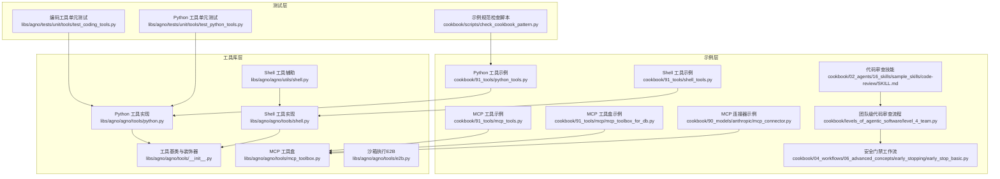

图表来源
- [python_tools.py:1-62](file://cookbook/91_tools/python_tools.py#L1-L62)
- [shell_tools.py:1-23](file://cookbook/91_tools/shell_tools.py#L1-L23)
- [python.py:1-214](file://libs/agno/agno/tools/python.py#L1-L214)
- [shell.py:1-54](file://libs/agno/agno/tools/shell.py#L1-L54)
- [shell_util.py:1-23](file://libs/agno/agno/utils/shell.py#L1-L23)
- [toolkit_init.py:1-11](file://libs/agno/agno/tools/__init__.py#L1-L11)
- [mcp_toolbox.py](file://libs/agno/agno/tools/mcp_toolbox.py)
- [e2b_sandbox.py:592-678](file://libs/agno/agno/tools/e2b.py#L592-L678)
- [test_coding_tools.py:41-82](file://libs/agno/tests/unit/tools/test_coding_tools.py#L41-L82)
- [test_python_tools.py](file://libs/agno/tests/unit/tools/test_python_tools.py)
- [check_cookbook_pattern.py:161-215](file://cookbook/scripts/check_cookbook_pattern.py#L161-L215)
- [SKILL.md:1-32](file://cookbook/02_agents/16_skills/sample_skills/code-review/SKILL.md#L1-L32)
- [level_4_team.py:82-129](file://cookbook/levels_of_agentic_software/level_4_team.py#L82-L129)
- [early_stop_basic.py:1-229](file://cookbook/04_workflows/06_advanced_concepts/early_stopping/early_stop_basic.py#L1-L229)

章节来源
- [python_tools.py:1-62](file://cookbook/91_tools/python_tools.py#L1-L62)
- [shell_tools.py:1-23](file://cookbook/91_tools/shell_tools.py#L1-L23)
- [python.py:1-214](file://libs/agno/agno/tools/python.py#L1-L214)
- [shell.py:1-54](file://libs/agno/agno/tools/shell.py#L1-L54)
- [shell_util.py:1-23](file://libs/agno/agno/utils/shell.py#L1-L23)
- [toolkit_init.py:1-11](file://libs/agno/agno/tools/__init__.py#L1-L11)

## 核心组件
- Python 工具（动态代码执行、文件读写、包安装）
  - 支持保存并运行代码、直接执行字符串代码、读取文件、列出目录、安装依赖（pip/uv）。
  - 提供路径限制与安全提示，避免越权访问与任意代码执行风险。
- Shell 工具（命令执行与系统管理）
  - 封装子进程执行，支持指定工作目录与输出截断，便于在受限环境中安全执行。
- 工具基类与装饰器
  - 统一工具注册、命名与调用协议，便于扩展与组合。
- MCP 工具盒与连接器
  - 通过 MCP 协议桥接外部服务，实现跨模型/平台的工具复用。
- 沙箱执行（E2B）
  - 提供服务器启动、超时设置、状态查询与沙箱关闭等能力，用于安全隔离的动态执行。

章节来源
- [python.py:15-214](file://libs/agno/agno/tools/python.py#L15-L214)
- [shell.py:8-54](file://libs/agno/agno/tools/shell.py#L8-L54)
- [toolkit_init.py:1-11](file://libs/agno/agno/tools/__init__.py#L1-L11)
- [mcp_toolbox.py](file://libs/agno/agno/tools/mcp_toolbox.py)
- [e2b_sandbox.py:592-678](file://libs/agno/agno/tools/e2b.py#L592-L678)

## 架构总览
下图展示了从“示例”到“工具实现”再到“测试验证”的整体架构，以及与“工作流/技能/沙箱”的集成路径。

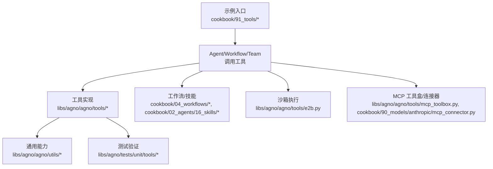

图表来源
- [python_tools.py:1-62](file://cookbook/91_tools/python_tools.py#L1-L62)
- [shell_tools.py:1-23](file://cookbook/91_tools/shell_tools.py#L1-L23)
- [python.py:1-214](file://libs/agno/agno/tools/python.py#L1-L214)
- [shell.py:1-54](file://libs/agno/agno/tools/shell.py#L1-L54)
- [shell_util.py:1-23](file://libs/agno/agno/utils/shell.py#L1-L23)
- [test_python_tools.py](file://libs/agno/tests/unit/tools/test_python_tools.py)
- [e2b_sandbox.py:592-678](file://libs/agno/agno/tools/e2b.py#L592-L678)
- [mcp_toolbox.py](file://libs/agno/agno/tools/mcp_toolbox.py)
- [mcp_connector.py](file://cookbook/90_models/anthropic/mcp_connector.py)

## 详细组件分析

### Python 工具组件分析
- 能力概览
  - 保存并运行代码：将代码写入文件并执行，支持返回指定变量或成功信息。
  - 直接运行代码：在当前全局/局部作用域执行字符串代码，支持返回变量值。
  - 文件操作：读取文件内容、列出目录文件。
  - 包管理：通过 pip/uv 安装依赖。
  - 安全与限制：路径检查、禁止越界；对任意代码执行进行警告提示。
- 关键流程（保存并运行）
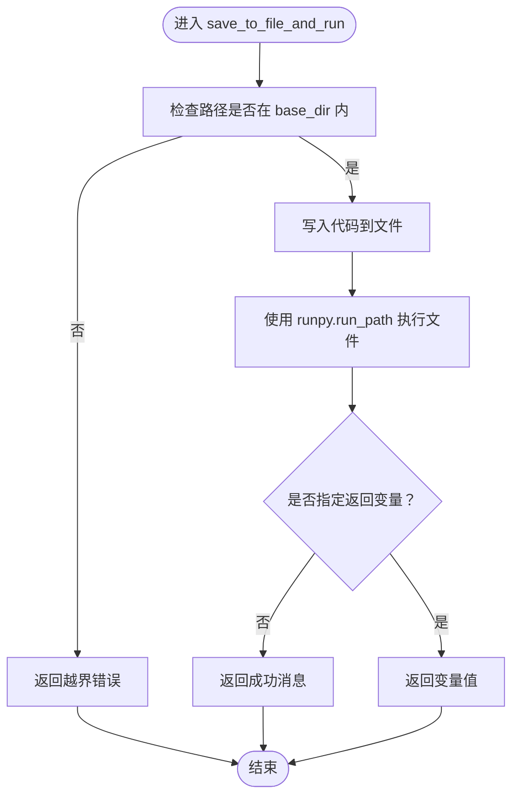

图表来源
- [python.py:43-84](file://libs/agno/agno/tools/python.py#L43-L84)

- 关键流程（直接运行代码）
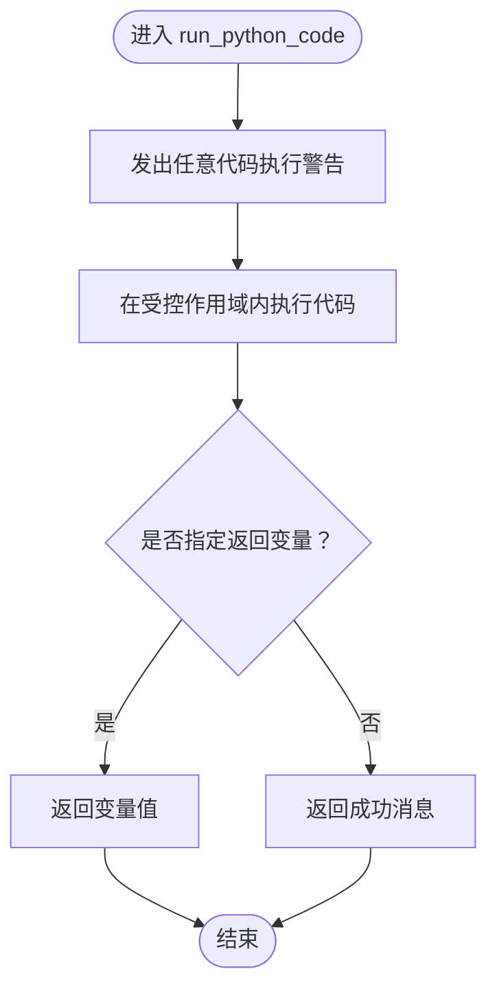

图表来源
- [python.py:144-172](file://libs/agno/agno/tools/python.py#L144-L172)

- 类关系图
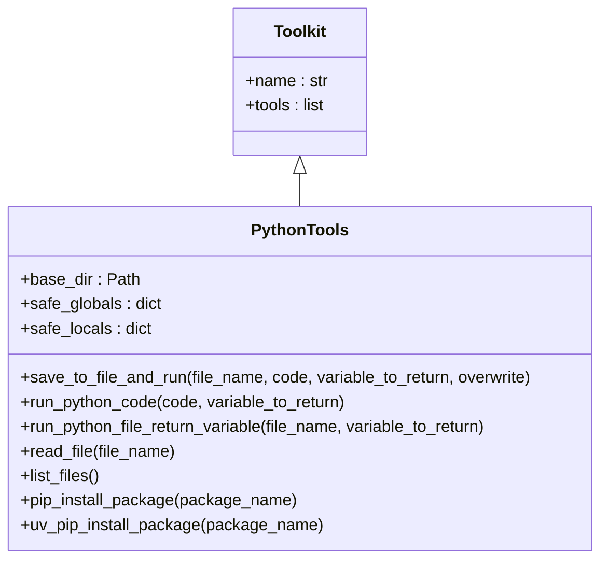

图表来源
- [python.py:15-42](file://libs/agno/agno/tools/python.py#L15-L42)
- [toolkit_init.py:1-11](file://libs/agno/agno/tools/__init__.py#L1-L11)

- 使用示例要点
  - 全量函数：默认启用所有工具，适合需要完整能力的场景。
  - 限定函数：仅允许保存/运行代码，不开放包安装。
  - 排除危险函数：屏蔽 pip/uv 安装，仅保留安全能力。
- 安全与合规
  - 对任意代码执行进行警告提示，建议配合人工审核。
  - 路径检查防止越界访问，避免读取/写入系统敏感文件。

章节来源
- [python_tools.py:18-50](file://cookbook/91_tools/python_tools.py#L18-L50)
- [python.py:15-214](file://libs/agno/agno/tools/python.py#L15-L214)
- [test_python_tools.py](file://libs/agno/tests/unit/tools/test_python_tools.py)

### Shell 工具组件分析
- 能力概览
  - 执行任意命令：接收参数列表，返回标准输出（可截断），错误时返回错误信息。
  - 受限工作目录：可选地限制执行目录，降低风险面。
- 关键流程
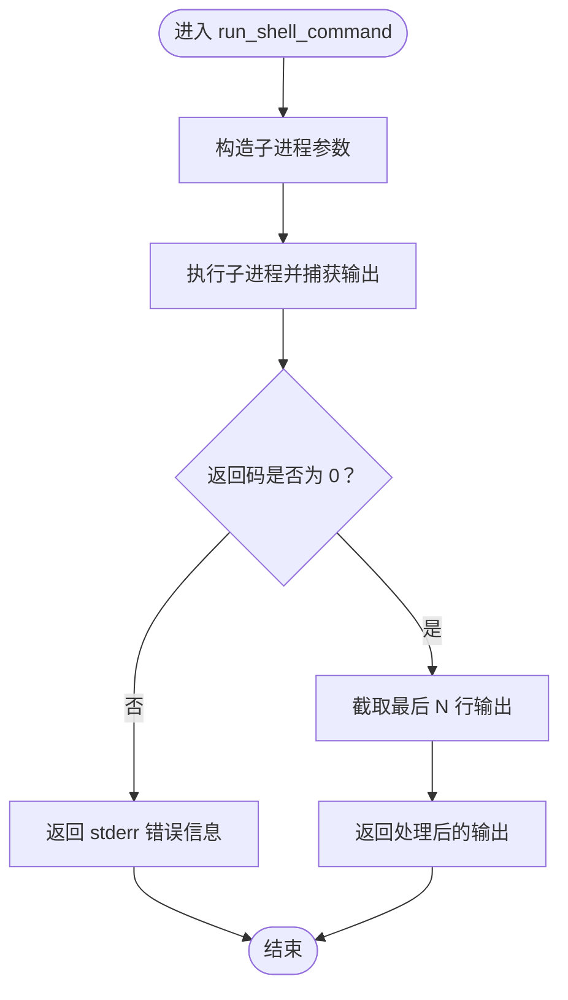

图表来源
- [shell.py:26-54](file://libs/agno/agno/tools/shell.py#L26-L54)
- [shell_util.py:6-23](file://libs/agno/agno/utils/shell.py#L6-L23)

- 类关系图
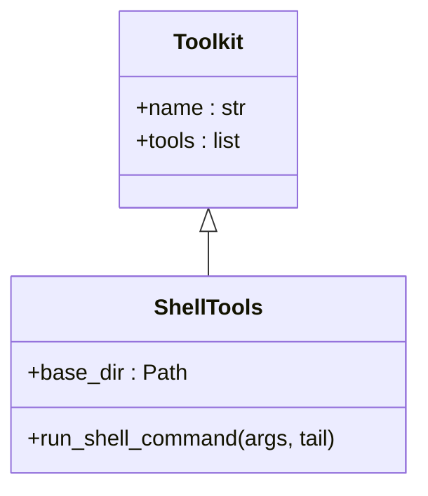

图表来源
- [shell.py:8-25](file://libs/agno/agno/tools/shell.py#L8-L25)
- [toolkit_init.py:1-11](file://libs/agno/agno/tools/__init__.py#L1-L11)

- 使用示例要点
  - 示例中直接创建包含 ShellTools 的 Agent，即可执行系统命令。
  - 可通过 tail 参数控制输出长度，避免大输出阻塞。

章节来源
- [shell_tools.py:16-23](file://cookbook/91_tools/shell_tools.py#L16-L23)
- [shell.py:8-54](file://libs/agno/agno/tools/shell.py#L8-L54)
- [shell_util.py:1-23](file://libs/agno/agno/utils/shell.py#L1-L23)

### 沙箱执行（E2B）组件分析
- 能力概览
  - 启动后台命令、获取公开 URL、设置超时、查询状态、关闭沙箱、列举运行中的沙箱。
- 关键流程（设置超时）
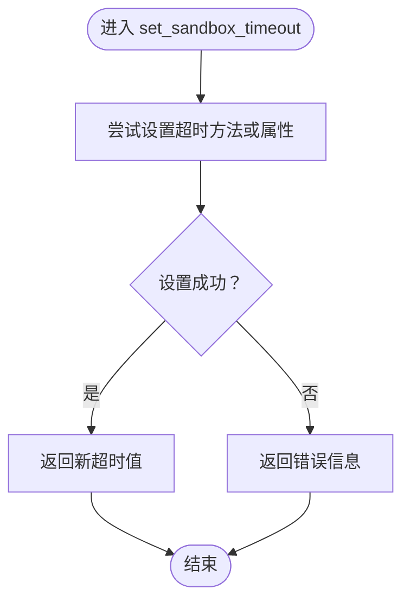

图表来源
- [e2b_sandbox.py:619-640](file://libs/agno/agno/tools/e2b.py#L619-L640)

- 关键流程（关闭沙箱）
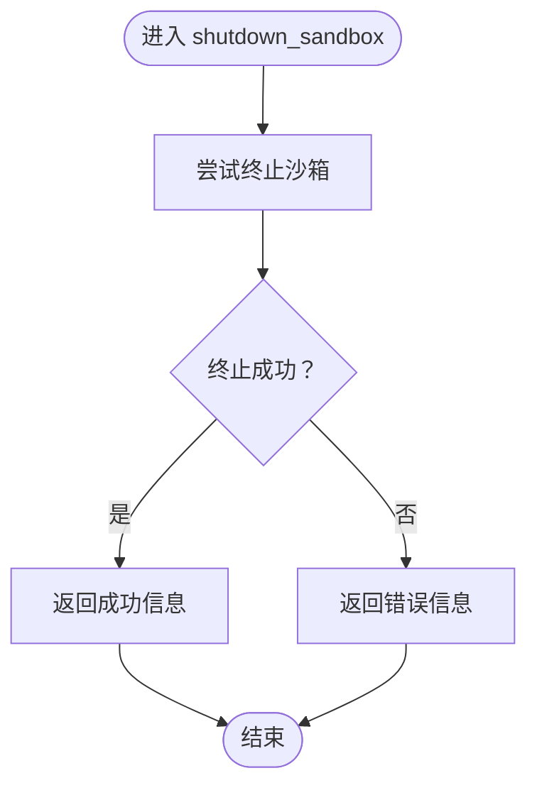

图表来源
- [e2b_sandbox.py:657-669](file://libs/agno/agno/tools/e2b.py#L657-L669)

- 类关系图（简化）
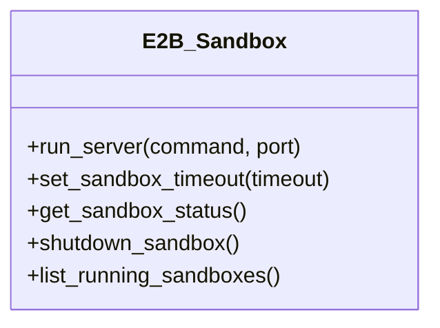

图表来源
- [e2b_sandbox.py:592-678](file://libs/agno/agno/tools/e2b.py#L592-L678)

章节来源
- [e2b_sandbox.py:592-678](file://libs/agno/agno/tools/e2b.py#L592-L678)

### MCP 工具与工具盒
- 能力概览
  - 通过 MCP 协议接入外部工具与服务，实现跨平台/跨模型的工具复用。
  - 工具盒封装常用工具集合，便于快速装配与部署。
- 使用示例
  - 示例文件展示了如何加载与使用 MCP 工具盒及连接器。

章节来源
- [mcp_toolbox.py](file://libs/agno/agno/tools/mcp_toolbox.py)
- [mcp_tools.py](file://cookbook/91_tools/mcp_tools.py)
- [mcp_toolbox_for_db.py](file://cookbook/91_tools/mcp/mcp_toolbox_for_db.py)
- [groq_mcp.py](file://cookbook/91_tools/mcp/groq_mcp.py)
- [mcp_connector.py](file://cookbook/90_models/anthropic/mcp_connector.py)

### 代码分析与安全门禁
- 代码分析能力
  - 静态检查与风格校验：通过技能与工具盒实现自动化检查与反馈。
  - 安全扫描：在部署前进行漏洞扫描，阻断高危代码。
- 早期拦截工作流
  - 通过工作流步骤返回 stop 控制流程，实现“安全门禁”。

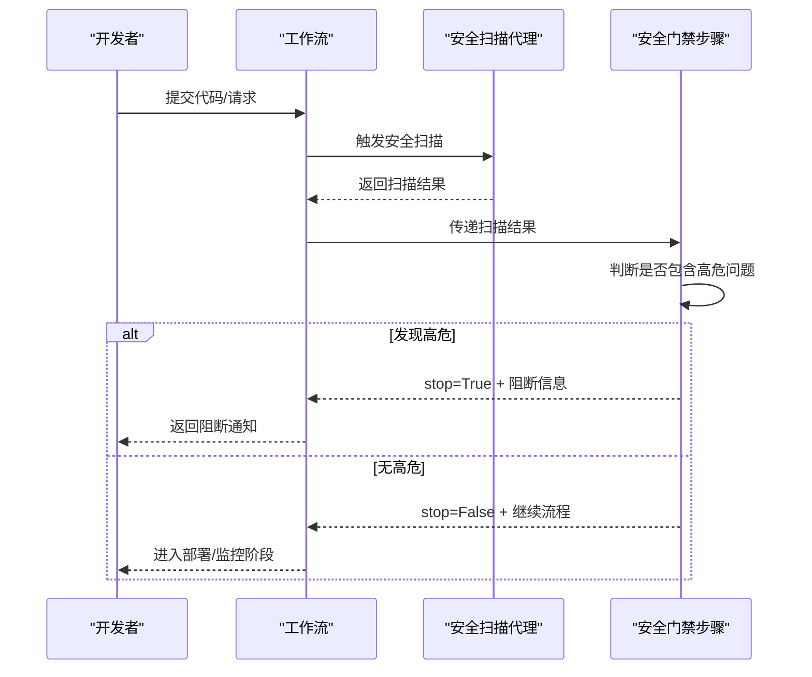

图表来源
- [early_stop_basic.py:45-58](file://cookbook/04_workflows/06_advanced_concepts/early_stopping/early_stop_basic.py#L45-L58)

章节来源
- [SKILL.md:1-32](file://cookbook/02_agents/16_skills/sample_skills/code-review/SKILL.md#L1-L32)
- [level_4_team.py:82-129](file://cookbook/levels_of_agentic_software/level_4_team.py#L82-L129)
- [early_stop_basic.py:1-229](file://cookbook/04_workflows/06_advanced_concepts/early_stopping/early_stop_basic.py#L1-L229)

## 依赖分析
- 组件耦合
  - 工具实现依赖工具基类与日志工具，保证统一的生命周期与可观测性。
  - Shell 工具可复用通用 Shell 执行工具，减少重复实现。
  - Python 工具通过 runpy 与 subprocess 实现代码与包管理能力，注意与安全策略协同。
- 外部依赖
  - 子进程执行与包管理依赖系统环境，需在受限环境中谨慎配置。
  - MCP 工具依赖外部服务与协议栈，需关注网络与认证配置。

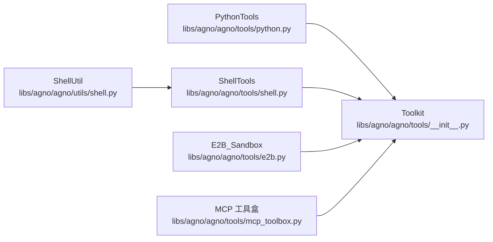

图表来源
- [python.py:1-214](file://libs/agno/agno/tools/python.py#L1-L214)
- [shell.py:1-54](file://libs/agno/agno/tools/shell.py#L1-L54)
- [shell_util.py:1-23](file://libs/agno/agno/utils/shell.py#L1-L23)
- [toolkit_init.py:1-11](file://libs/agno/agno/tools/__init__.py#L1-L11)
- [mcp_toolbox.py](file://libs/agno/agno/tools/mcp_toolbox.py)
- [e2b_sandbox.py:592-678](file://libs/agno/agno/tools/e2b.py#L592-L678)

章节来源
- [python.py:1-214](file://libs/agno/agno/tools/python.py#L1-L214)
- [shell.py:1-54](file://libs/agno/agno/tools/shell.py#L1-L54)
- [shell_util.py:1-23](file://libs/agno/agno/utils/shell.py#L1-L23)
- [toolkit_init.py:1-11](file://libs/agno/agno/tools/__init__.py#L1-L11)

## 性能考量
- 输出截断：Shell 工具支持 tail 参数，避免大输出造成内存与传输压力。
- 路径与文件大小限制：Python 工具与编码工具测试覆盖了大文件截断与路径逃逸保护，建议在生产中结合 max_lines 与 base_dir 限制。
- 子进程与包安装：pip/uv 安装可能耗时较长，建议在沙箱或独立容器中执行，并设置超时。
- 日志与可观测性：工具内部使用统一日志接口，便于定位性能瓶颈与异常。

## 故障排查指南
- Python 工具
  - 任意代码执行警告：若出现警告，请确认执行上下文与权限范围。
  - 路径越界错误：检查 base_dir 与 restrict_to_base_dir 配置，确保文件名不包含路径逃逸序列。
  - 变量未找到：确认变量名拼写与作用域，或在调用时明确返回变量。
- Shell 工具
  - 返回码非零：查看 stderr 获取具体错误原因。
  - 输出过大：调整 tail 参数或在上游进行过滤。
- 编码工具测试参考
  - 文件不存在、路径逃逸、大文件截断等边界条件均有测试覆盖，可对照定位问题。

章节来源
- [test_coding_tools.py:41-82](file://libs/agno/tests/unit/tools/test_coding_tools.py#L41-L82)
- [test_python_tools.py](file://libs/agno/tests/unit/tools/test_python_tools.py)
- [check_cookbook_pattern.py:161-215](file://cookbook/scripts/check_cookbook_pattern.py#L161-L215)

## 结论
本编码工具系统以“可组合、可扩展、可审计”为目标，提供了从代码生成、分析到执行的完整能力闭环。通过 Python 工具与 Shell 工具实现基础能力，借助 MCP 工具盒与沙箱执行提升跨平台与安全性，再以工作流与技能体系实现自动化与智能化。建议在生产中严格配置 base_dir、tail、超时与权限，配合日志与测试，确保稳定与安全。

## 附录
- 使用示例清单
  - Python 工具：全量函数、限定函数、排除危险函数三种模式。
  - Shell 工具：命令执行与目录浏览。
  - MCP 工具盒：数据库工具盒、Groq/MCPC 连接器等。
- 安全最佳实践
  - 任意代码执行必须配合人工审核与最小权限原则。
  - 路径检查与输出截断是防止越权与资源滥用的关键。
  - 沙箱执行应设置超时与资源上限，定期清理与审计。