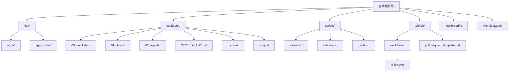
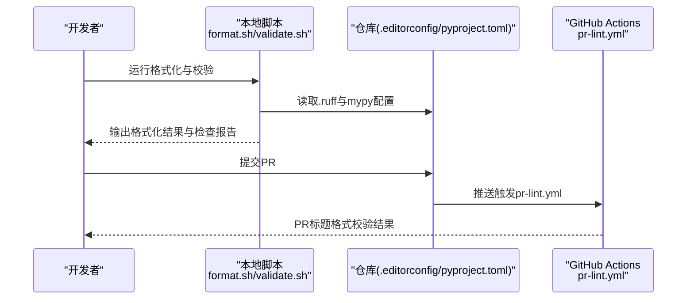
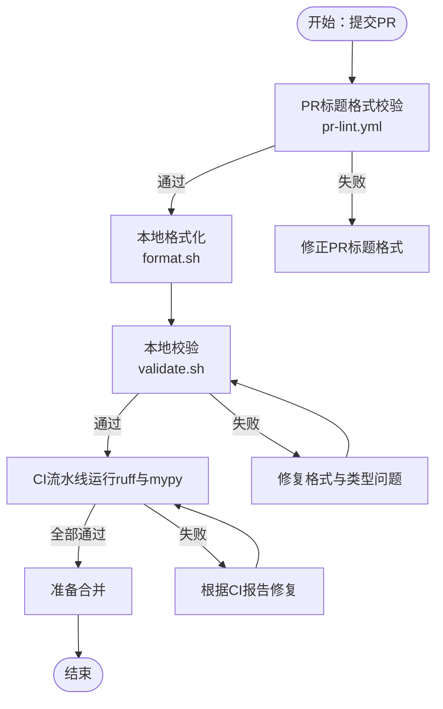
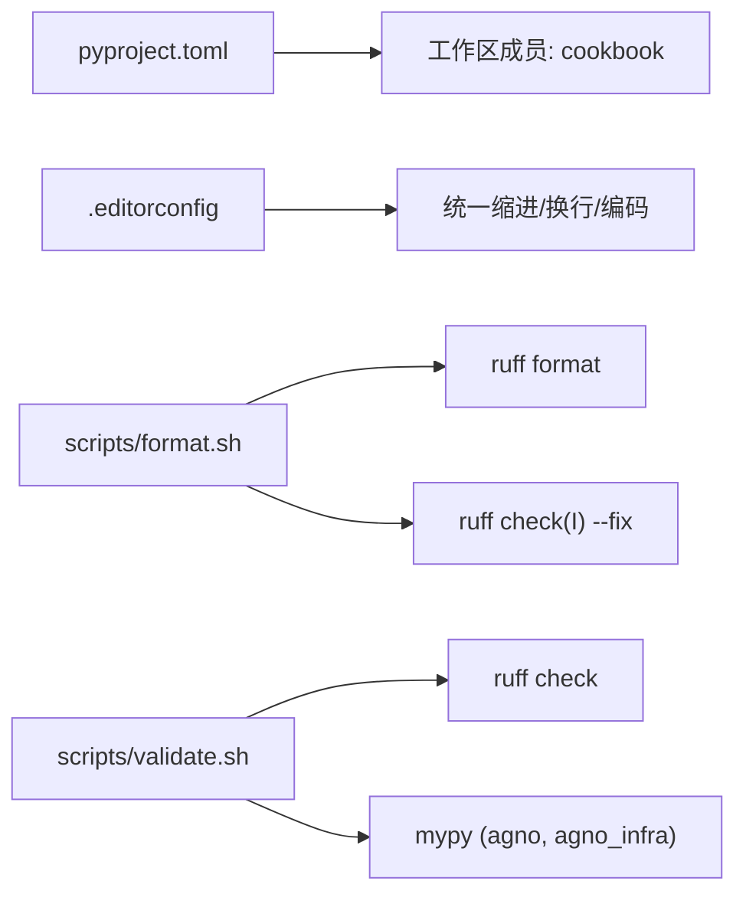

# 代码规范

<cite>
**本文引用的文件**
- [.editorconfig](file://.editorconfig)
- [pyproject.toml](file://pyproject.toml)
- [CODE_OF_CONDUCT.md](file://CODE_OF_CONDUCT.md)
- [.github/pull_request_template.md](file://.github/pull_request_template.md)
- [cookbook/STYLE_GUIDE.md](file://cookbook/STYLE_GUIDE.md)
- [scripts/format.sh](file://scripts/format.sh)
- [scripts/validate.sh](file://scripts/validate.sh)
- [.github/workflows/pr-lint.yml](file://.github/workflows/pr-lint.yml)
- [cookbook/mypy.ini](file://cookbook/mypy.ini)
- [cookbook/main.py](file://cookbook/main.py)
- [cookbook/00_quickstart/run.py](file://cookbook/00_quickstart/run.py)
- [cookbook/00_quickstart/agent_with_tools.py](file://cookbook/00_quickstart/agent_with_tools.py)
- [cookbook/00_quickstart/agent_with_memory.py](file://cookbook/00_quickstart/agent_with_memory.py)
- [cookbook/02_agents/16_skills/sample_skills/code-review/SKILL.md](file://cookbook/02_agents/16_skills/sample_skills/code-review/SKILL.md)
- [cookbook/02_agents/16_skills/sample_skills/code-review/scripts/check_style.py](file://cookbook/02_agents/16_skills/sample_skills/code-review/scripts/check_style.py)
- [cookbook/scripts/check_cookbook_pattern.py](file://cookbook/scripts/check_cookbook_pattern.py)
- [cookbook/levels_of_agentic_software/level_2_storage_knowledge.py](file://cookbook/levels_of_agentic_software/level_2_storage_knowledge.py)
- [cookbook/levels_of_agentic_software/level_4_team.py](file://cookbook/levels_of_agentic_software/level_4_team.py)
</cite>

## 目录
1. 引言
2. 项目结构
3. 核心组件
4. 架构总览
5. 详细组件分析
6. 依赖分析
7. 性能考虑
8. 故障排查指南
9. 结论
10. 附录

## 引言
本文件为 Agno Learn 项目的代码规范与标准文档，面向开发者与贡献者，系统阐述 Python 代码风格、命名约定、注释与文档字符串规范、编辑器与自动格式化配置、代码组织结构与模块划分、代码审查流程与合并要求、不同场景下的规范化写法、以及持续集成中的质量检查与自动化验证流程。目标是统一代码风格、提升可读性与可维护性，并降低协作成本。

## 项目结构
Agno Learn 采用多库工作区布局，核心由 cookbook 示例库与 libs 子包组成；根目录提供统一的 Python 工作区配置与脚本，用于格式化、校验与质量检查；GitHub Actions 提供 PR 标题与正文的自动化校验；行为准则确保社区协作的健康氛围。

图表来源
- [pyproject.toml:1-15](file://pyproject.toml#L1-L15)
- [scripts/format.sh:1-19](file://scripts/format.sh#L1-L19)
- [scripts/validate.sh:1-28](file://scripts/validate.sh#L1-L28)
- [.editorconfig:1-13](file://.editorconfig#L1-L13)

章节来源
- [pyproject.toml:1-15](file://pyproject.toml#L1-L15)
- [.editorconfig:1-13](file://.editorconfig#L1-L13)

## 核心组件
- 编辑器与格式化配置：通过 .editorconfig 统一换行、字符集、缩进与尾随空白策略；Python 文件使用 4 空格缩进。
- 自动格式化与静态检查：使用 ruff 进行格式化与导入排序修复；使用 mypy 进行类型检查；提供一键脚本统一执行。
- 示例与样式指南：cookbook/STYLE_GUIDE.md 规范示例文件的文档字符串、分段注释、主入口等结构。
- 行为准则与 PR 模板：CODE_OF_CONDUCT.md 明确社区行为标准；.github/pull_request_template.md 规范 PR 内容与检查清单。
- CI 校验：.github/workflows/pr-lint.yml 校验 PR 标题格式；validate.sh 聚合运行 ruff 与 mypy。

章节来源
- [.editorconfig:1-13](file://.editorconfig#L1-L13)
- [scripts/format.sh:1-19](file://scripts/format.sh#L1-L19)
- [scripts/validate.sh:1-28](file://scripts/validate.sh#L1-L28)
- [cookbook/STYLE_GUIDE.md:1-53](file://cookbook/STYLE_GUIDE.md#L1-L53)
- [CODE_OF_CONDUCT.md:1-83](file://CODE_OF_CONDUCT.md#L1-L83)
- [.github/pull_request_template.md:1-33](file://.github/pull_request_template.md#L1-L33)
- [.github/workflows/pr-lint.yml:1-28](file://.github/workflows/pr-lint.yml#L1-L28)

## 架构总览
下图展示了从本地开发到 CI 的质量控制闭环：本地先用 format.sh 格式化并用 validate.sh 校验，再提交 PR；CI 使用 pr-lint.yml 校验标题格式，随后在流水线中重复执行 ruff 与 mypy。

图表来源
- [scripts/format.sh:1-19](file://scripts/format.sh#L1-L19)
- [scripts/validate.sh:1-28](file://scripts/validate.sh#L1-L28)
- [.github/workflows/pr-lint.yml:1-28](file://.github/workflows/pr-lint.yml#L1-L28)
- [.editorconfig:1-13](file://.editorconfig#L1-L13)
- [pyproject.toml:1-15](file://pyproject.toml#L1-L15)

## 详细组件分析

### Python 代码风格与命名约定
- 缩进与排版
  - 通用规则：使用空格缩进，换行符为 LF，UTF-8 字符集，末尾插入换行，去除尾随空白。
  - Python 文件：缩进大小为 4 个空格。
- 命名约定
  - 函数与变量：snake_case。
  - 类型与常量：大写常量与类名驼峰或清晰名词；具体以示例为准。
  - 模块与包：小写下划线命名。
- 行长度与导入
  - 行长度建议不超过 88 字符（参考示例知识库中的风格声明）。
  - 导入排序：使用 ruff 的 I 规则自动修复。
- 文档字符串与注释
  - 示例文件顶部使用模块级文档字符串，概述功能、关键概念与可尝试的提示。
  - 使用分段横幅注释组织“配置/设置”、“指令”、“创建”、“运行”等步骤。
  - 避免在示例文件中使用表情符号。
- 主入口规范
  - 所有示例文件均包含 if __name__ == "__main__" 的主入口，仅在本地运行演示步骤。

章节来源
- [.editorconfig:1-13](file://.editorconfig#L1-L13)
- [cookbook/STYLE_GUIDE.md:1-53](file://cookbook/STYLE_GUIDE.md#L1-L53)
- [cookbook/00_quickstart/agent_with_tools.py:1-98](file://cookbook/00_quickstart/agent_with_tools.py#L1-L98)
- [cookbook/00_quickstart/agent_with_memory.py:1-158](file://cookbook/00_quickstart/agent_with_memory.py#L1-L158)
- [cookbook/00_quickstart/run.py:1-89](file://cookbook/00_quickstart/run.py#L1-L89)
- [cookbook/levels_of_agentic_software/level_2_storage_knowledge.py:78-120](file://cookbook/levels_of_agentic_software/level_2_storage_knowledge.py#L78-L120)

### 注释与文档字符串标准格式
- 示例文档字符串
  - 顶部包含示例目的、涉及的关键概念与可尝试的提示。
  - 分节注释清晰标注“配置/设置”“指令”“创建”“运行”等阶段。
- 主入口注释
  - 保持与示例文档字符串一致的结构化注释风格。
- 反例警示
  - 不要在示例文件中使用表情符号。
  - 不要省略主入口 if __name__ == "__main__"。

章节来源
- [cookbook/STYLE_GUIDE.md:1-53](file://cookbook/STYLE_GUIDE.md#L1-L53)
- [cookbook/00_quickstart/agent_with_tools.py:1-98](file://cookbook/00_quickstart/agent_with_tools.py#L1-L98)
- [cookbook/00_quickstart/agent_with_memory.py:1-158](file://cookbook/00_quickstart/agent_with_memory.py#L1-L158)
- [cookbook/00_quickstart/run.py:1-89](file://cookbook/00_quickstart/run.py#L1-L89)

### 编辑器配置与自动格式化
- .editorconfig
  - 通用：LF 换行、UTF-8、去除尾随空白、末行换行。
  - Python：4 空格缩进。
- 自动格式化
  - 使用 ruff 进行格式化与导入排序修复。
  - 提供统一脚本：format.sh 与 validate.sh。
- 本地执行
  - 格式化：./scripts/format.sh
  - 校验：./scripts/validate.sh

章节来源
- [.editorconfig:1-13](file://.editorconfig#L1-L13)
- [scripts/format.sh:1-19](file://scripts/format.sh#L1-L19)
- [scripts/validate.sh:1-28](file://scripts/validate.sh#L1-L28)

### 代码组织结构与模块划分
- 目录与文件命名
  - 示例按主题分层：cookbook/00_quickstart、cookbook/01_demo、cookbook/02_agents 等。
  - 文件命名采用小写下划线或清晰语义，避免混用大小写。
- 导入规范
  - 优先使用显式相对导入与绝对导入，避免裸导入。
  - 导入排序由 ruff 自动修复（I 规则）。
- 主入口与可运行性
  - 所有示例文件均包含 if __name__ == "__main__"，便于本地直接运行。

章节来源
- [cookbook/00_quickstart/run.py:1-89](file://cookbook/00_quickstart/run.py#L1-L89)
- [scripts/format.sh:1-19](file://scripts/format.sh#L1-L19)
- [cookbook/STYLE_GUIDE.md:1-53](file://cookbook/STYLE_GUIDE.md#L1-L53)

### 代码审查标准与流程
- PR 规范
  - 使用 .github/pull_request_template.md 中的模板填写摘要、类型、检查清单与附加说明。
  - 必须在本地运行格式化与校验脚本并通过后再提交 PR。
- 审查要点
  - 风格一致性：命名、缩进、文档字符串与注释。
  - 错误处理：异常类型选择、错误消息与日志记录。
  - 可测试性：新增功能需配套测试。
- 自动化辅助
  - 代码评审技能样例提供风格检查与最佳实践参考。
  - cookbook/scripts/check_cookbook_pattern.py 可扫描示例文件的模式违规。

章节来源
- [.github/pull_request_template.md:1-33](file://.github/pull_request_template.md#L1-L33)
- [cookbook/02_agents/16_skills/sample_skills/code-review/SKILL.md:1-32](file://cookbook/02_agents/16_skills/sample_skills/code-review/SKILL.md#L1-L32)
- [cookbook/scripts/check_cookbook_pattern.py:161-215](file://cookbook/scripts/check_cookbook_pattern.py#L161-L215)

### 持续集成中的质量检查与自动化验证
- PR 标题校验
  - pr-lint.yml 校验 PR 标题是否符合约定格式（如 [feat]/feat:/feat-suffix）。
- 代码质量检查
  - validate.sh 聚合执行：
    - ruff 检查（libs/ 与 cookbook/）。
    - mypy 类型检查（agno 与 agno_infra）。
- 本地先行
  - format.sh 与 validate.sh 应在提交前于本地执行，确保 CI 顺利通过。

章节来源
- [.github/workflows/pr-lint.yml:1-28](file://.github/workflows/pr-lint.yml#L1-L28)
- [scripts/validate.sh:1-28](file://scripts/validate.sh#L1-L28)
- [scripts/format.sh:1-19](file://scripts/format.sh#L1-L19)

### 不同类型代码的规范要求

#### 函数定义
- 命名：snake_case。
- 类型提示：所有函数签名应包含类型注解。
- 文档字符串：采用 Google 风格（示例知识库声明）。
- 复杂度：单函数长度建议不超过 50 行（评审技能样例）。

章节来源
- [cookbook/levels_of_agentic_software/level_2_storage_knowledge.py:78-120](file://cookbook/levels_of_agentic_software/level_2_storage_knowledge.py#L78-L120)
- [cookbook/02_agents/16_skills/sample_skills/code-review/SKILL.md:1-32](file://cookbook/02_agents/16_skills/sample_skills/code-review/SKILL.md#L1-L32)

#### 类设计
- 命名：类名采用清晰语义的驼峰或名词形式。
- 文档字符串：类与公共方法应具备清晰的文档字符串。
- 单一职责：尽量保持类职责单一，避免过度耦合。

章节来源
- [cookbook/00_quickstart/agent_with_tools.py:1-98](file://cookbook/00_quickstart/agent_with_tools.py#L1-L98)
- [cookbook/00_quickstart/agent_with_memory.py:1-158](file://cookbook/00_quickstart/agent_with_memory.py#L1-L158)

#### 异常与错误处理
- 异常类型：使用具体异常类型，避免裸 except。
- 错误消息：提供有意义的错误描述。
- 日志记录：非输出信息使用日志而非 print。
- 文件 I/O：使用 pathlib.Path、上下文管理器与 UTF-8 默认编码。

章节来源
- [cookbook/levels_of_agentic_software/level_2_storage_knowledge.py:78-120](file://cookbook/levels_of_agentic_software/level_2_storage_knowledge.py#L78-L120)

#### 示例文件结构（推荐与反例）
- 推荐结构
  - 模块文档字符串：说明示例目的、关键概念与可试提示。
  - 分段注释：配置/设置、指令、创建、运行等。
  - 主入口：if __name__ == "__main__"。
  - 避免表情符号。
- 反例
  - 缺少主入口。
  - 使用表情符号。
  - 文档字符串缺失或不完整。

章节来源
- [cookbook/STYLE_GUIDE.md:1-53](file://cookbook/STYLE_GUIDE.md#L1-L53)
- [cookbook/00_quickstart/run.py:1-89](file://cookbook/00_quickstart/run.py#L1-L89)
- [cookbook/00_quickstart/agent_with_tools.py:1-98](file://cookbook/00_quickstart/agent_with_tools.py#L1-L98)
- [cookbook/00_quickstart/agent_with_memory.py:1-158](file://cookbook/00_quickstart/agent_with_memory.py#L1-L158)

### 代码审查流程图

图表来源
- [.github/workflows/pr-lint.yml:1-28](file://.github/workflows/pr-lint.yml#L1-L28)
- [scripts/format.sh:1-19](file://scripts/format.sh#L1-L19)
- [scripts/validate.sh:1-28](file://scripts/validate.sh#L1-L28)

## 依赖分析
- 工具链依赖
  - ruff：格式化、导入排序修复、静态检查。
  - mypy：类型检查（分别针对 agno 与 agno_infra）。
- 仓库配置
  - pyproject.toml：工作区成员（cookbook），Python >= 3.12。
  - .editorconfig：统一编辑器行为。
- 脚本依赖
  - format.sh 与 validate.sh：封装 ruff 与 mypy 的调用，便于本地与 CI 复用。

图表来源
- [pyproject.toml:1-15](file://pyproject.toml#L1-L15)
- [.editorconfig:1-13](file://.editorconfig#L1-L13)
- [scripts/format.sh:1-19](file://scripts/format.sh#L1-L19)
- [scripts/validate.sh:1-28](file://scripts/validate.sh#L1-L28)

章节来源
- [pyproject.toml:1-15](file://pyproject.toml#L1-L15)
- [.editorconfig:1-13](file://.editorconfig#L1-L13)
- [scripts/format.sh:1-19](file://scripts/format.sh#L1-L19)
- [scripts/validate.sh:1-28](file://scripts/validate.sh#L1-L28)

## 性能考虑
- 代码风格与性能
  - 使用列表推导优于 map/filter（示例知识库声明）。
  - 合理拆分函数，避免过长函数导致的调试与维护成本上升。
- I/O 与资源
  - 使用 pathlib.Path 与上下文管理器，减少资源泄漏风险。
- CI 性能
  - 本地先行格式化与类型检查，减少 CI 时间与失败重试成本。

章节来源
- [cookbook/levels_of_agentic_software/level_2_storage_knowledge.py:78-120](file://cookbook/levels_of_agentic_software/level_2_storage_knowledge.py#L78-L120)

## 故障排查指南
- PR 标题不合规
  - 现象：pr-lint.yml 报错。
  - 处理：按模板格式修正标题（支持 [type] 标题、type: 标题、type-suffix）。
- 本地格式化失败
  - 现象：ruff 报错或导入顺序问题。
  - 处理：运行 format.sh，确认 ruff 与 Python 版本满足要求。
- 类型检查失败
  - 现象：mypy 报错。
  - 处理：根据 validate.sh 输出逐项修复类型注解与未使用导入。
- 示例文件不规范
  - 现象：cookbook 样式检查失败。
  - 处理：对照 STYLE_GUIDE.md 与示例文件修正结构与注释。

章节来源
- [.github/workflows/pr-lint.yml:1-28](file://.github/workflows/pr-lint.yml#L1-L28)
- [scripts/format.sh:1-19](file://scripts/format.sh#L1-L19)
- [scripts/validate.sh:1-28](file://scripts/validate.sh#L1-L28)
- [cookbook/STYLE_GUIDE.md:1-53](file://cookbook/STYLE_GUIDE.md#L1-L53)
- [cookbook/scripts/check_cookbook_pattern.py:161-215](file://cookbook/scripts/check_cookbook_pattern.py#L161-L215)

## 结论
本规范以 .editorconfig、ruff、mypy 与 GitHub Actions 为核心，结合 cookbook 的示例风格指南与 PR 模板，构建了从本地到 CI 的完整质量控制闭环。建议所有贡献者在提交前完成本地格式化与校验，并严格遵循示例文件的结构化注释与主入口规范，以确保代码一致性与可维护性。

## 附录

### 常用命令速查
- 格式化：./scripts/format.sh
- 校验：./scripts/validate.sh
- PR 模板字段：摘要、类型、检查清单、附加说明

章节来源
- [scripts/format.sh:1-19](file://scripts/format.sh#L1-L19)
- [scripts/validate.sh:1-28](file://scripts/validate.sh#L1-L28)
- [.github/pull_request_template.md:1-33](file://.github/pull_request_template.md#L1-L33)