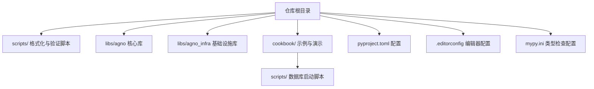
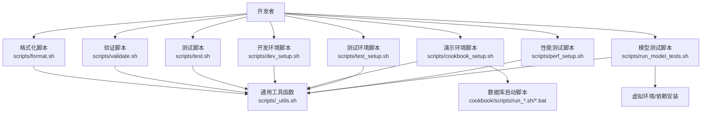
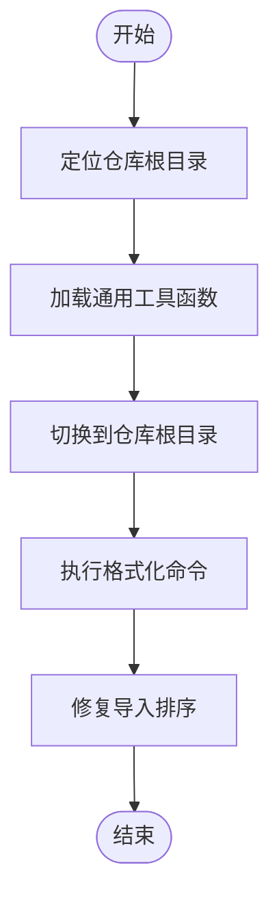
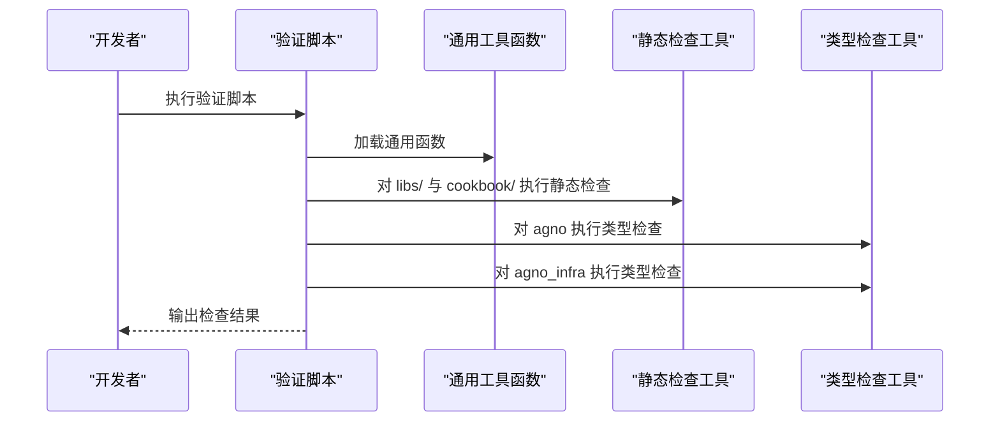
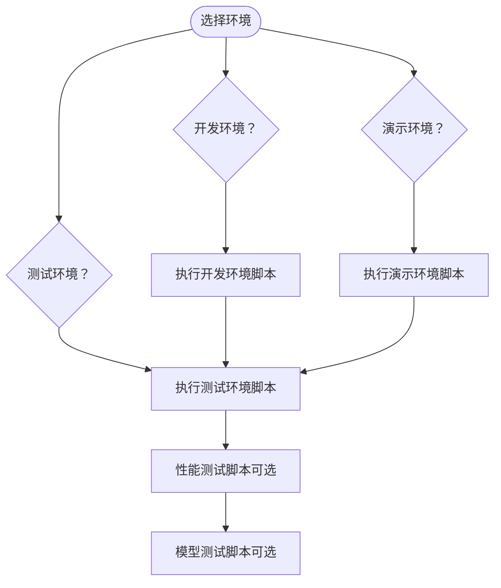
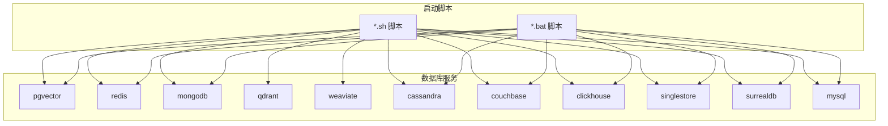
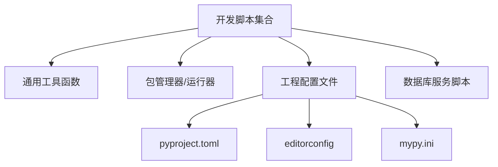

# 开发工具

<cite>
**本文引用的文件**
- [scripts/format.sh](file://scripts/format.sh)
- [scripts/validate.sh](file://scripts/validate.sh)
- [scripts/_utils.sh](file://scripts/_utils.sh)
- [_utils.bat](file://scripts/_utils.bat)
- [scripts/dev_setup.sh](file://scripts/dev_setup.sh)
- [scripts/cookbook_setup.sh](file://scripts/cookbook_setup.sh)
- [scripts/test.sh](file://scripts/test.sh)
- [scripts/test_setup.sh](file://scripts/test_setup.sh)
- [scripts/perf_setup.sh](file://scripts/perf_setup.sh)
- [scripts/run_model_tests.sh](file://scripts/run_model_tests.sh)
- [cookbook/scripts/run_pgvector.sh](file://cookbook/scripts/run_pgvector.sh)
- [cookbook/scripts/run_redis.sh](file://cookbook/scripts/run_redis.sh)
- [cookbook/scripts/run_mongodb.sh](file://cookbook/scripts/run_mongodb.sh)
- [cookbook/scripts/run_qdrant.sh](file://cookbook/scripts/run_qdrant.sh)
- [cookbook/scripts/run_weaviate.sh](file://cookbook/scripts/run_weaviate.sh)
- [cookbook/scripts/run_cassandra.sh](file://cookbook/scripts/run_cassandra.sh)
- [cookbook/scripts/run_couchbase.sh](file://cookbook/scripts/run_couchbase.sh)
- [cookbook/scripts/run_clickhouse.sh](file://cookbook/scripts/run_clickhouse.sh)
- [cookbook/scripts/run_singlestore.sh](file://cookbook/scripts/run_singlestore.sh)
- [cookbook/scripts/run_surrealdb.sh](file://cookbook/scripts/run_surrealdb.sh)
- [cookbook/scripts/run_mysql.sh](file://cookbook/scripts/run_mysql.sh)
- [cookbook/scripts/run_mongodb.bat](file://cookbook/scripts/run_mongodb.bat)
- [cookbook/scripts/run_pgvector.bat](file://cookbook/scripts/run_pgvector.bat)
- [cookbook/scripts/run_redis.bat](file://cookbook/scripts/run_redis.bat)
- [cookbook/scripts/run_cassandra.bat](file://cookbook/scripts/run_cassandra.bat)
- [cookbook/scripts/run_couchbase.bat](file://cookbook/scripts/run_couchbase.bat)
- [cookbook/scripts/run_clickhouse.bat](file://cookbook/scripts/run_clickhouse.bat)
- [cookbook/scripts/run_singlestore.bat](file://cookbook/scripts/run_singlestore.bat)
- [cookbook/scripts/run_surrealdb.bat](file://cookbook/scripts/run_surrealdb.bat)
- [cookbook/scripts/run_mysql.bat](file://cookbook/scripts/run_mysql.bat)
- [cookbook/scripts/run_weaviate.bat](file://cookbook/scripts/run_weaviate.bat)
- [pyproject.toml](file://pyproject.toml)
- [.editorconfig](file://.editorconfig)
- [mypy.ini](file://mypy.ini)
- [CODE_OF_CONDUCT.md](file://CODE_OF_CONDUCT.md)
- [README.md](file://README.md)
</cite>

## 目录
1. [简介](#简介)
2. [项目结构](#项目结构)
3. [核心组件](#核心组件)
4. [架构总览](#架构总览)
5. [详细组件分析](#详细组件分析)
6. [依赖分析](#依赖分析)
7. [性能考虑](#性能考虑)
8. [故障排查指南](#故障排查指南)
9. [结论](#结论)
10. [附录](#附录)

## 简介
本指南面向 Agno Learn 项目的开发者与贡献者，系统性介绍仓库内提供的开发工具与脚本体系，覆盖代码格式化、静态校验与类型检查、测试执行、环境搭建与数据库服务启动等关键环节。文档同时给出工具链集成（Git hooks、CI/CD）、最佳实践、定制与扩展方法以及调试与问题诊断建议，帮助团队在保证质量的同时提升开发效率。

## 项目结构
仓库采用多模块组织方式：根目录包含统一的开发脚本与配置；libs/agno 与 libs/agno_infra 为核心库；cookbook 提供示例与演示所需的数据库服务启动脚本；scripts 目录下提供格式化、验证、测试、环境搭建等脚本；另有 pyproject.toml、mypy.ini、.editorconfig 等工程配置文件。

图示来源
- [scripts/format.sh](file://scripts/format.sh)
- [scripts/validate.sh](file://scripts/validate.sh)
- [pyproject.toml](file://pyproject.toml)
- [.editorconfig](file://.editorconfig)
- [mypy.ini](file://mypy.ini)

章节来源
- [scripts/format.sh](file://scripts/format.sh)
- [scripts/validate.sh](file://scripts/validate.sh)
- [pyproject.toml](file://pyproject.toml)
- [.editorconfig](file://.editorconfig)
- [mypy.ini](file://mypy.ini)

## 核心组件
本节聚焦开发工具的核心脚本与配置，说明其职责、输入输出与典型用法。

- 格式化工具
  - 功能：统一格式化所有库与示例代码，修复导入排序。
  - 使用：在仓库根目录执行脚本，自动定位路径并调用格式化工具。
  - 支持范围：libs/ 与 cookbook/ 下的 Python 源码。
  - 关键实现：通过统一工具运行器执行格式化与导入排序修复。

- 验证工具
  - 功能：对所有库与示例进行静态检查与类型检查。
  - 使用：在仓库根目录执行脚本，按顺序运行静态检查与类型检查。
  - 关键实现：分别对 libs/ 与 cookbook/ 执行静态检查，并对 agno 与 agno_infra 分别执行类型检查。

- 辅助脚本
  - 环境搭建：提供开发环境、测试环境与演示环境的安装脚本，统一通过包管理器进行依赖同步。
  - 测试执行：集中运行各库的单元测试与覆盖率统计。
  - 性能测试：创建独立虚拟环境，安装指定依赖集，便于性能对比与回归测试。
  - 模型测试：按模型维度安装最小依赖并运行对应集成测试，支持多种大模型平台。

章节来源
- [scripts/format.sh](file://scripts/format.sh)
- [scripts/validate.sh](file://scripts/validate.sh)
- [scripts/dev_setup.sh](file://scripts/dev_setup.sh)
- [scripts/cookbook_setup.sh](file://scripts/cookbook_setup.sh)
- [scripts/test.sh](file://scripts/test.sh)
- [scripts/test_setup.sh](file://scripts/test_setup.sh)
- [scripts/perf_setup.sh](file://scripts/perf_setup.sh)
- [scripts/run_model_tests.sh](file://scripts/run_model_tests.sh)

## 架构总览
下图展示开发工具链的整体交互关系：开发者通过统一脚本触发格式化、验证、测试与环境搭建；脚本内部复用通用工具函数；部分脚本依赖外部服务（如数据库）时，由示例脚本负责启动相应服务。

图示来源
- [scripts/format.sh](file://scripts/format.sh)
- [scripts/validate.sh](file://scripts/validate.sh)
- [scripts/test.sh](file://scripts/test.sh)
- [scripts/dev_setup.sh](file://scripts/dev_setup.sh)
- [scripts/cookbook_setup.sh](file://scripts/cookbook_setup.sh)
- [scripts/test_setup.sh](file://scripts/test_setup.sh)
- [scripts/perf_setup.sh](file://scripts/perf_setup.sh)
- [scripts/run_model_tests.sh](file://scripts/run_model_tests.sh)
- [scripts/_utils.sh](file://scripts/_utils.sh)
- [cookbook/scripts/run_pgvector.sh](file://cookbook/scripts/run_pgvector.sh)
- [cookbook/scripts/run_redis.sh](file://cookbook/scripts/run_redis.sh)
- [cookbook/scripts/run_mongodb.sh](file://cookbook/scripts/run_mongodb.sh)
- [cookbook/scripts/run_qdrant.sh](file://cookbook/scripts/run_qdrant.sh)
- [cookbook/scripts/run_weaviate.sh](file://cookbook/scripts/run_weaviate.sh)
- [cookbook/scripts/run_cassandra.sh](file://cookbook/scripts/run_cassandra.sh)
- [cookbook/scripts/run_couchbase.sh](file://cookbook/scripts/run_couchbase.sh)
- [cookbook/scripts/run_clickhouse.sh](file://cookbook/scripts/run_clickhouse.sh)
- [cookbook/scripts/run_singlestore.sh](file://cookbook/scripts/run_singlestore.sh)
- [cookbook/scripts/run_surrealdb.sh](file://cookbook/scripts/run_surrealdb.sh)
- [cookbook/scripts/run_mysql.sh](file://cookbook/scripts/run_mysql.sh)

## 详细组件分析

### 格式化工具：format.sh
- 作用与流程
  - 定位仓库根目录，加载通用工具函数。
  - 切换到仓库根目录后，统一调用格式化工具对 libs/ 与 cookbook/ 进行格式化。
  - 对导入排序进行修复，确保代码风格一致。
- 文件路径与关键行
  - [scripts/format.sh](file://scripts/format.sh)
  - [scripts/_utils.sh](file://scripts/_utils.sh)
- 使用建议
  - 在提交前或批量修改后执行，避免 CI 因格式问题失败。
  - 如需自定义格式化规则，可在工程配置中调整（例如统一的格式化工具配置文件）。

图示来源
- [scripts/format.sh](file://scripts/format.sh)
- [scripts/_utils.sh](file://scripts/_utils.sh)

章节来源
- [scripts/format.sh](file://scripts/format.sh)
- [scripts/_utils.sh](file://scripts/_utils.sh)

### 验证工具：validate.sh
- 作用与流程
  - 定位 agno 与 agno_infra 的类型检查配置文件。
  - 先对 libs/ 与 cookbook/ 执行静态检查。
  - 再分别对 agno 与 agno_infra 执行类型检查，确保类型安全。
- 文件路径与关键行
  - [scripts/validate.sh](file://scripts/validate.sh)
  - [scripts/_utils.sh](file://scripts/_utils.sh)
- 使用建议
  - 在合并请求前执行，减少运行时错误。
  - 可结合编辑器的实时类型检查功能，提高反馈速度。

图示来源
- [scripts/validate.sh](file://scripts/validate.sh)
- [scripts/_utils.sh](file://scripts/_utils.sh)

章节来源
- [scripts/validate.sh](file://scripts/validate.sh)
- [scripts/_utils.sh](file://scripts/_utils.sh)

### 辅助脚本：环境与测试
- 开发环境脚本：dev_setup.sh
  - 通过包管理器同步工作区依赖，支持可编辑安装，便于本地联调。
  - 适合日常开发与迭代。
- 演示环境脚本：cookbook_setup.sh
  - 同步演示所需依赖，适合运行示例与演示场景。
- 测试环境脚本：test_setup.sh
  - 同步测试所需依赖，便于运行单元测试与覆盖率统计。
- 测试脚本：test.sh
  - 统一运行 agno_infra 与 agno 的单元测试，并生成覆盖率报告。
- 性能测试脚本：perf_setup.sh
  - 创建独立虚拟环境，安装指定依赖集，便于性能对比与回归测试。
- 模型测试脚本：run_model_tests.sh
  - 按模型维度安装最小依赖并运行对应集成测试，支持多种大模型平台。

图示来源
- [scripts/dev_setup.sh](file://scripts/dev_setup.sh)
- [scripts/cookbook_setup.sh](file://scripts/cookbook_setup.sh)
- [scripts/test_setup.sh](file://scripts/test_setup.sh)
- [scripts/test.sh](file://scripts/test.sh)
- [scripts/perf_setup.sh](file://scripts/perf_setup.sh)
- [scripts/run_model_tests.sh](file://scripts/run_model_tests.sh)

章节来源
- [scripts/dev_setup.sh](file://scripts/dev_setup.sh)
- [scripts/cookbook_setup.sh](file://scripts/cookbook_setup.sh)
- [scripts/test.sh](file://scripts/test.sh)
- [scripts/test_setup.sh](file://scripts/test_setup.sh)
- [scripts/perf_setup.sh](file://scripts/perf_setup.sh)
- [scripts/run_model_tests.sh](file://scripts/run_model_tests.sh)

### 数据库启动脚本（示例）
- 用途：为示例与演示提供本地向量数据库、缓存与搜索服务。
- 支持的服务：pgvector、redis、mongodb、qdrant、weaviate、cassandra、couchbase、clickhouse、singlestore、surrealdb、mysql 等。
- 平台支持：Linux/macOS（.sh）与 Windows（.bat）双份脚本，便于跨平台使用。
- 使用建议：在运行示例前先启动所需服务，确保端口未被占用。

图示来源
- [cookbook/scripts/run_pgvector.sh](file://cookbook/scripts/run_pgvector.sh)
- [cookbook/scripts/run_redis.sh](file://cookbook/scripts/run_redis.sh)
- [cookbook/scripts/run_mongodb.sh](file://cookbook/scripts/run_mongodb.sh)
- [cookbook/scripts/run_qdrant.sh](file://cookbook/scripts/run_qdrant.sh)
- [cookbook/scripts/run_weaviate.sh](file://cookbook/scripts/run_weaviate.sh)
- [cookbook/scripts/run_cassandra.sh](file://cookbook/scripts/run_cassandra.sh)
- [cookbook/scripts/run_couchbase.sh](file://cookbook/scripts/run_couchbase.sh)
- [cookbook/scripts/run_clickhouse.sh](file://cookbook/scripts/run_clickhouse.sh)
- [cookbook/scripts/run_singlestore.sh](file://cookbook/scripts/run_singlestore.sh)
- [cookbook/scripts/run_surrealdb.sh](file://cookbook/scripts/run_surrealdb.sh)
- [cookbook/scripts/run_mysql.sh](file://cookbook/scripts/run_mysql.sh)
- [cookbook/scripts/run_mongodb.bat](file://cookbook/scripts/run_mongodb.bat)
- [cookbook/scripts/run_pgvector.bat](file://cookbook/scripts/run_pgvector.bat)
- [cookbook/scripts/run_redis.bat](file://cookbook/scripts/run_redis.bat)
- [cookbook/scripts/run_cassandra.bat](file://cookbook/scripts/run_cassandra.bat)
- [cookbook/scripts/run_couchbase.bat](file://cookbook/scripts/run_couchbase.bat)
- [cookbook/scripts/run_clickhouse.bat](file://cookbook/scripts/run_clickhouse.bat)
- [cookbook/scripts/run_singlestore.bat](file://cookbook/scripts/run_singlestore.bat)
- [cookbook/scripts/run_surrealdb.bat](file://cookbook/scripts/run_surrealdb.bat)
- [cookbook/scripts/run_mysql.bat](file://cookbook/scripts/run_mysql.bat)
- [cookbook/scripts/run_weaviate.bat](file://cookbook/scripts/run_weaviate.bat)

章节来源
- [cookbook/scripts/run_pgvector.sh](file://cookbook/scripts/run_pgvector.sh)
- [cookbook/scripts/run_redis.sh](file://cookbook/scripts/run_redis.sh)
- [cookbook/scripts/run_mongodb.sh](file://cookbook/scripts/run_mongodb.sh)
- [cookbook/scripts/run_qdrant.sh](file://cookbook/scripts/run_qdrant.sh)
- [cookbook/scripts/run_weaviate.sh](file://cookbook/scripts/run_weaviate.sh)
- [cookbook/scripts/run_cassandra.sh](file://cookbook/scripts/run_cassandra.sh)
- [cookbook/scripts/run_couchbase.sh](file://cookbook/scripts/run_couchbase.sh)
- [cookbook/scripts/run_clickhouse.sh](file://cookbook/scripts/run_clickhouse.sh)
- [cookbook/scripts/run_singlestore.sh](file://cookbook/scripts/run_singlestore.sh)
- [cookbook/scripts/run_surrealdb.sh](file://cookbook/scripts/run_surrealdb.sh)
- [cookbook/scripts/run_mysql.sh](file://cookbook/scripts/run_mysql.sh)
- [cookbook/scripts/run_mongodb.bat](file://cookbook/scripts/run_mongodb.bat)
- [cookbook/scripts/run_pgvector.bat](file://cookbook/scripts/run_pgvector.bat)
- [cookbook/scripts/run_redis.bat](file://cookbook/scripts/run_redis.bat)
- [cookbook/scripts/run_cassandra.bat](file://cookbook/scripts/run_cassandra.bat)
- [cookbook/scripts/run_couchbase.bat](file://cookbook/scripts/run_couchbase.bat)
- [cookbook/scripts/run_clickhouse.bat](file://cookbook/scripts/run_clickhouse.bat)
- [cookbook/scripts/run_singlestore.bat](file://cookbook/scripts/run_singlestore.bat)
- [cookbook/scripts/run_surrealdb.bat](file://cookbook/scripts/run_surrealdb.bat)
- [cookbook/scripts/run_mysql.bat](file://cookbook/scripts/run_mysql.bat)
- [cookbook/scripts/run_weaviate.bat](file://cookbook/scripts/run_weaviate.bat)

## 依赖分析
- 工具链依赖
  - 包管理与运行：统一通过包管理器进行依赖同步与命令执行，减少环境差异。
  - 通用工具函数：多个脚本共享同一套通用函数（打印、分隔线、等待用户按键等），降低重复与维护成本。
- 外部服务依赖
  - 示例与演示依赖多种数据库与检索引擎，脚本提供一键启动能力，便于快速验证。
- 配置文件
  - 工程配置：pyproject.toml 提供项目元数据与构建/运行配置。
  - 编辑器配置：.editorconfig 统一编辑器行为。
  - 类型检查：mypy.ini 提供类型检查规则与忽略项。

图示来源
- [scripts/_utils.sh](file://scripts/_utils.sh)
- [pyproject.toml](file://pyproject.toml)
- [.editorconfig](file://.editorconfig)
- [mypy.ini](file://mypy.ini)

章节来源
- [scripts/_utils.sh](file://scripts/_utils.sh)
- [pyproject.toml](file://pyproject.toml)
- [.editorconfig](file://.editorconfig)
- [mypy.ini](file://mypy.ini)

## 性能考虑
- 独立虚拟环境：性能测试脚本创建专用虚拟环境，隔离依赖版本，避免干扰。
- 最小依赖策略：模型测试脚本仅安装必要依赖，缩短准备时间并减少冲突。
- 并行与增量：建议在 CI 中并行执行不同模块的测试与检查任务，减少总耗时。
- 缓存与复用：利用包管理器的缓存机制与镜像源，提升依赖安装速度。

## 故障排查指南
- 权限与路径
  - 确保脚本具备执行权限；在 Windows 上使用 .bat 脚本。
  - 脚本会自动定位仓库根目录，避免在错误目录执行。
- 依赖缺失
  - 若提示缺少包管理器，请先安装并重新执行脚本。
  - 对于数据库服务，确认端口未被占用，必要时修改默认端口。
- 类型检查失败
  - 根据类型检查输出逐项修复；必要时在配置文件中调整规则或忽略特定模块。
- 测试失败
  - 查看测试输出与覆盖率报告，定位失败用例；对模型测试，确认对应 API 密钥已正确设置。

章节来源
- [scripts/_utils.sh](file://scripts/_utils.sh)
- [scripts/_utils.bat](file://scripts/_utils.bat)
- [scripts/run_model_tests.sh](file://scripts/run_model_tests.sh)

## 结论
Agno Learn 的开发工具链以“统一入口、模块化脚本、可扩展配置”为核心设计原则，覆盖从格式化、验证、测试到环境搭建与数据库服务启动的完整开发流程。通过标准化的工具与脚本，团队可以显著提升协作效率与代码质量。建议在本地与 CI 中持续集成这些工具，形成稳定可靠的开发工作流。

## 附录
- 快速参考
  - 格式化：在仓库根目录执行格式化脚本。
  - 验证：在仓库根目录执行验证脚本。
  - 测试：在仓库根目录执行测试脚本，查看覆盖率报告。
  - 环境：根据需要选择开发/演示/测试环境脚本。
  - 数据库：在示例前启动所需数据库服务脚本。
- 最佳实践
  - 提交前先格式化与验证，减少 CI 失败概率。
  - 将常用命令封装为别名或 Makefile，提升效率。
  - 在 CI 中启用并行任务与缓存，缩短流水线时间。
- 定制与扩展
  - 新增脚本时复用通用工具函数，保持一致性。
  - 对工具链进行模块化拆分，便于维护与扩展。
  - 在工程配置中统一管理格式化与类型检查规则，避免分散配置。