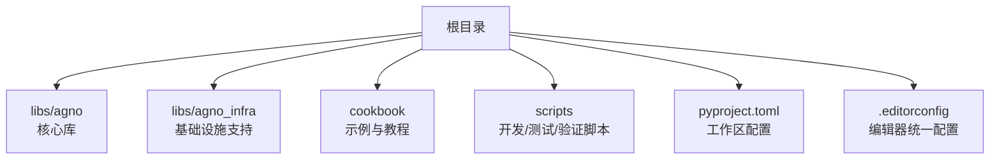
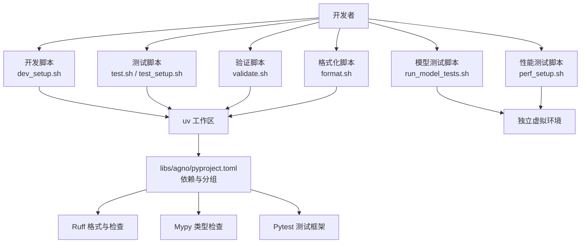
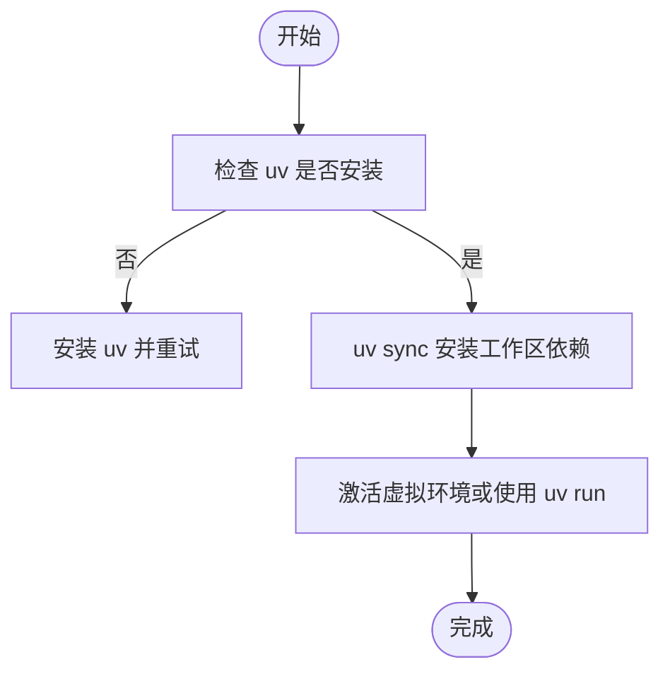
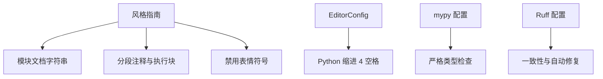
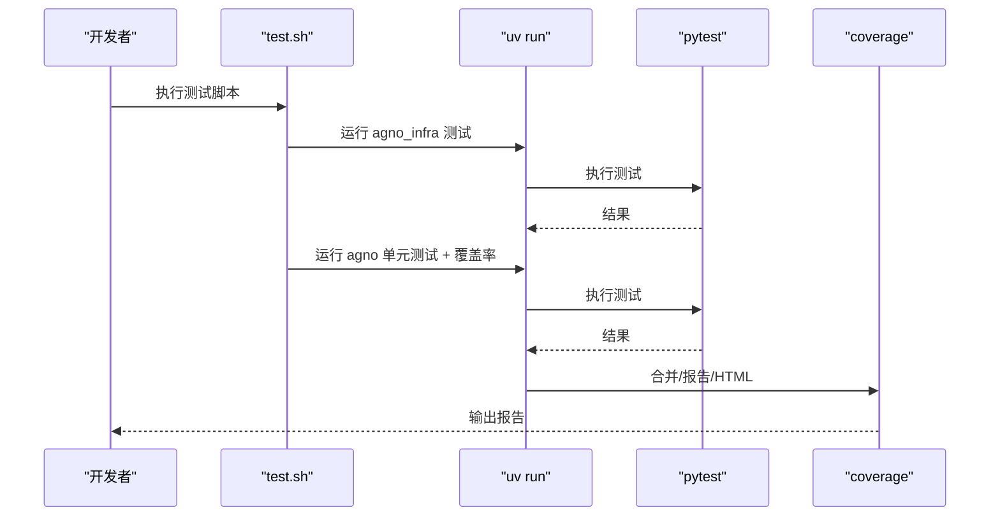
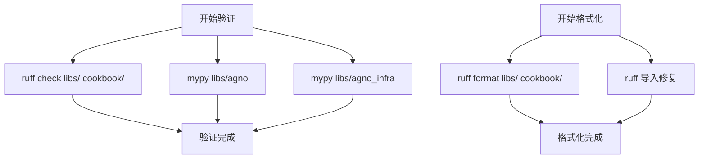
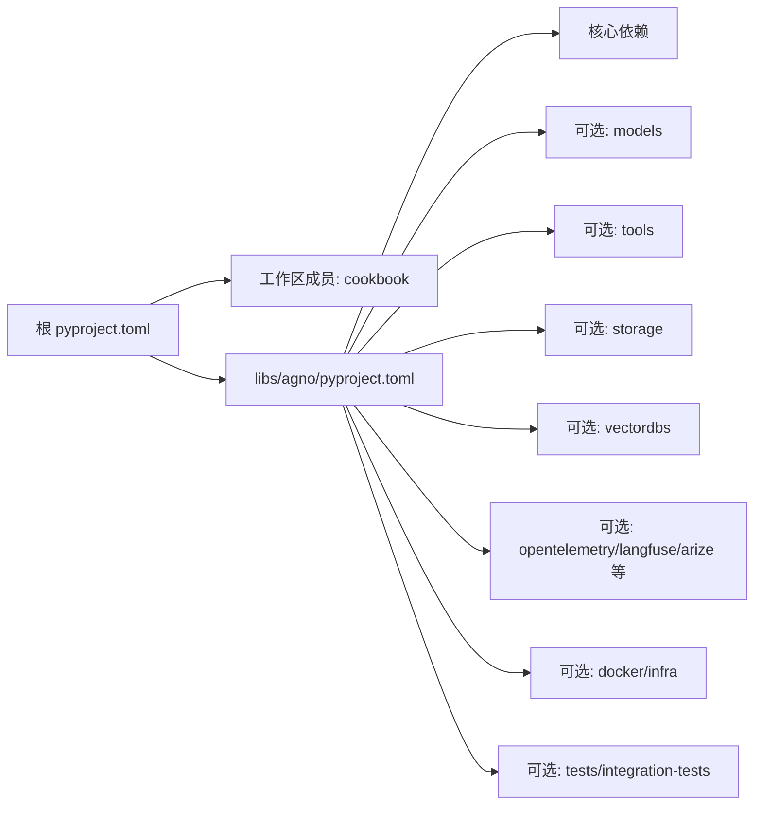

# 开发者指南

<cite>
**本文引用的文件**
- [README.md](file://README.md)
- [pyproject.toml](file://pyproject.toml)
- [cookbook/STYLE_GUIDE.md](file://cookbook/STYLE_GUIDE.md)
- [.editorconfig](file://.editorconfig)
- [scripts/dev_setup.sh](file://scripts/dev_setup.sh)
- [scripts/test.sh](file://scripts/test.sh)
- [scripts/test_setup.sh](file://scripts/test_setup.sh)
- [scripts/format.sh](file://scripts/format.sh)
- [scripts/validate.sh](file://scripts/validate.sh)
- [scripts/run_model_tests.sh](file://scripts/run_model_tests.sh)
- [scripts/perf_setup.sh](file://scripts/perf_setup.sh)
- [scripts/_utils.sh](file://scripts/_utils.sh)
- [libs/agno/pyproject.toml](file://libs/agno/pyproject.toml)
- [cookbook/mypy.ini](file://cookbook/mypy.ini)
- [cookbook/pyproject.toml](file://cookbook/pyproject.toml)
</cite>

## 目录
1. [简介](#简介)
2. [项目结构](#项目结构)
3. [核心组件](#核心组件)
4. [架构总览](#架构总览)
5. [详细组件分析](#详细组件分析)
6. [依赖关系分析](#依赖关系分析)
7. [性能考量](#性能考量)
8. [故障排查指南](#故障排查指南)
9. [结论](#结论)
10. [附录](#附录)

## 简介
本指南面向 Agno Learn 项目的开发者，提供从环境搭建、代码规范、测试与验证、格式化工具到部署与监控的全流程开发实践说明。内容覆盖：
- 开发环境设置与依赖安装
- 编码与文档规范
- 单元测试、集成测试与性能测试
- 部署与容器化思路
- 验证与格式化工具使用
- 最佳实践与常见问题

## 项目结构
仓库采用多包工作区布局，核心模块位于 libs/agno 与 libs/agno_infra，示例与教程位于 cookbook，脚本集中于 scripts 目录。

图表来源
- [pyproject.toml:10-13](file://pyproject.toml#L10-L13)
- [libs/agno/pyproject.toml:1-10](file://libs/agno/pyproject.toml#L1-L10)

章节来源
- [pyproject.toml:1-15](file://pyproject.toml#L1-L15)
- [README.md:1-178](file://README.md#L1-L178)

## 核心组件
- 工作区与包管理：使用 uv 工作区统一管理多包依赖，支持同步安装与虚拟环境管理。
- 核心库 agno：提供 Agent、团队、工作流、存储、向量库、模型与工具等能力，配套丰富的可选依赖。
- 教程与示例 cookbook：包含大量可运行示例，遵循统一风格指南，便于学习与复用。
- 脚本工具：覆盖开发、测试、验证、格式化、性能测试等场景，提升开发效率与质量。

章节来源
- [pyproject.toml:10-13](file://pyproject.toml#L10-L13)
- [libs/agno/pyproject.toml:1-574](file://libs/agno/pyproject.toml#L1-L574)
- [cookbook/STYLE_GUIDE.md:1-53](file://cookbook/STYLE_GUIDE.md#L1-L53)

## 架构总览
下图展示开发与测试相关的关键组件及其交互：

图表来源
- [scripts/dev_setup.sh:1-29](file://scripts/dev_setup.sh#L1-L29)
- [scripts/test.sh:1-30](file://scripts/test.sh#L1-L30)
- [scripts/test_setup.sh:1-29](file://scripts/test_setup.sh#L1-L29)
- [scripts/validate.sh:1-28](file://scripts/validate.sh#L1-L28)
- [scripts/format.sh:1-19](file://scripts/format.sh#L1-L19)
- [scripts/run_model_tests.sh:1-262](file://scripts/run_model_tests.sh#L1-L262)
- [scripts/perf_setup.sh:1-37](file://scripts/perf_setup.sh#L1-L37)
- [libs/agno/pyproject.toml:401-420](file://libs/agno/pyproject.toml#L401-L420)

## 详细组件分析

### 开发环境设置
- 使用 uv 工作区安装开发与测试依赖，推荐先安装 uv 再执行脚本。
- 支持直接使用 uv run 执行命令，无需全局安装。
- 脚本提供清晰的进度提示与错误处理。

图表来源
- [scripts/dev_setup.sh:1-29](file://scripts/dev_setup.sh#L1-L29)
- [scripts/test_setup.sh:1-29](file://scripts/test_setup.sh#L1-L29)

章节来源
- [scripts/dev_setup.sh:1-29](file://scripts/dev_setup.sh#L1-L29)
- [scripts/test_setup.sh:1-29](file://scripts/test_setup.sh#L1-L29)

### 代码规范与文档规范
- Cookbook 示例遵循统一风格：模块级文档字符串、分段注释、主入口执行块、禁止表情符号。
- 统一缩进与换行：EditorConfig 规定 Python 文件缩进为 4 空格，整体文本属性一致。
- 类型检查与格式化：通过 mypy 与 ruff 统一约束类型与风格。

图表来源
- [cookbook/STYLE_GUIDE.md:1-53](file://cookbook/STYLE_GUIDE.md#L1-L53)
- [.editorconfig:1-13](file://.editorconfig#L1-L13)
- [cookbook/mypy.ini:1-2](file://cookbook/mypy.ini#L1-L2)
- [libs/agno/pyproject.toml:413-420](file://libs/agno/pyproject.toml#L413-L420)
- [libs/agno/pyproject.toml:406-412](file://libs/agno/pyproject.toml#L406-L412)

章节来源
- [cookbook/STYLE_GUIDE.md:1-53](file://cookbook/STYLE_GUIDE.md#L1-L53)
- [.editorconfig:1-13](file://.editorconfig#L1-L13)
- [cookbook/mypy.ini:1-2](file://cookbook/mypy.ini#L1-L2)
- [libs/agno/pyproject.toml:406-420](file://libs/agno/pyproject.toml#L406-L420)

### 测试指南
- 单元测试与覆盖率：对 agno 与 agno_infra 分别运行 pytest，并生成 HTML 报告。
- 集成测试：按模型维度创建独立虚拟环境，安装对应依赖后运行集成测试。
- 性能测试：创建专用虚拟环境，安装对比框架与 agno，便于性能基准对比。

图表来源
- [scripts/test.sh:1-30](file://scripts/test.sh#L1-L30)

章节来源
- [scripts/test.sh:1-30](file://scripts/test.sh#L1-L30)
- [scripts/run_model_tests.sh:1-262](file://scripts/run_model_tests.sh#L1-L262)
- [scripts/perf_setup.sh:1-37](file://scripts/perf_setup.sh#L1-L37)

### 验证与格式化工具
- 验证：使用 ruff 检查代码风格与潜在问题；使用 mypy 对 agno 与 agno_infra 进行类型检查。
- 格式化：统一使用 ruff format 与导入排序修复，确保风格一致。

图表来源
- [scripts/validate.sh:1-28](file://scripts/validate.sh#L1-L28)
- [scripts/format.sh:1-19](file://scripts/format.sh#L1-L19)

章节来源
- [scripts/validate.sh:1-28](file://scripts/validate.sh#L1-L28)
- [scripts/format.sh:1-19](file://scripts/format.sh#L1-L19)

### 部署与容器化（概念性说明）
- 生产运行时：基于无状态、会话作用域的 FastAPI 后端，支持按用户与会话隔离。
- 容器化：可通过可选依赖中的 docker/infra 组合进行容器化打包与部署。
- 监控与可观测性：通过 OpenTelemetry、Langfuse、Arize Phoenix 等集成，实现链路追踪与指标采集。

章节来源
- [libs/agno/pyproject.toml:66-75](file://libs/agno/pyproject.toml#L66-L75)
- [libs/agno/pyproject.toml:204-211](file://libs/agno/pyproject.toml#L204-L211)

## 依赖关系分析
- 工作区配置：根 pyproject.toml 声明工作区成员为 cookbook，核心库位于 libs/agno。
- 核心库依赖：包含 HTTP、配置、序列化、类型扩展等基础依赖。
- 可选依赖：按模型、工具、存储、向量库、可观测性、Docker 等维度分组，便于按需安装。
- 测试依赖：dev、tests、integration-tests 等分组，覆盖开发、单元与集成测试场景。

图表来源
- [pyproject.toml:10-13](file://pyproject.toml#L10-L13)
- [libs/agno/pyproject.toml:29-43](file://libs/agno/pyproject.toml#L29-L43)
- [libs/agno/pyproject.toml:45-345](file://libs/agno/pyproject.toml#L45-L345)

章节来源
- [pyproject.toml:1-15](file://pyproject.toml#L1-L15)
- [libs/agno/pyproject.toml:1-574](file://libs/agno/pyproject.toml#L1-L574)

## 性能考量
- 性能测试环境：独立虚拟环境，安装 agno 与主流对比框架，便于横向对比。
- 性能相关依赖：memory_profiler 等用于内存分析。
- 建议：在 perf 环境中运行基准测试，记录吞吐与延迟，结合链路追踪定位瓶颈。

章节来源
- [scripts/perf_setup.sh:1-37](file://scripts/perf_setup.sh#L1-L37)
- [libs/agno/pyproject.toml:198-199](file://libs/agno/pyproject.toml#L198-L199)

## 故障排查指南
- 环境问题
  - uv 未安装：根据提示安装 uv 后重试。
  - 虚拟环境冲突：使用 perf_setup.sh 中的独立 venv，避免与主开发环境混淆。
- 测试失败
  - 模型密钥缺失：run_model_tests.sh 会校验所需环境变量，补齐后重试。
  - 测试路径不存在：确认 tests/integration/models/<model> 路径存在。
- 验证失败
  - ruff 错误：根据提示修复风格问题或忽略特定规则。
  - mypy 报错：完善类型注解或在 overrides 中放宽限制。

章节来源
- [scripts/dev_setup.sh:18-21](file://scripts/dev_setup.sh#L18-L21)
- [scripts/run_model_tests.sh:88-111](file://scripts/run_model_tests.sh#L88-L111)
- [scripts/validate.sh:20-27](file://scripts/validate.sh#L20-L27)

## 结论
本指南提供了从环境搭建到测试验证、格式化与性能分析的完整开发流程。建议开发者遵循风格与验证规范，使用脚本工具提升效率，并结合可选依赖按需扩展功能。生产部署可依托 FastAPI 运行时与可观测性集成，实现稳定可控的交付。

## 附录
- 快速参考
  - 开发环境：./scripts/dev_setup.sh
  - 测试：./scripts/test.sh 或 ./scripts/test_setup.sh
  - 验证：./scripts/validate.sh
  - 格式化：./scripts/format.sh
  - 模型测试：./scripts/run_model_tests.sh <model>
  - 性能测试：./scripts/perf_setup.sh