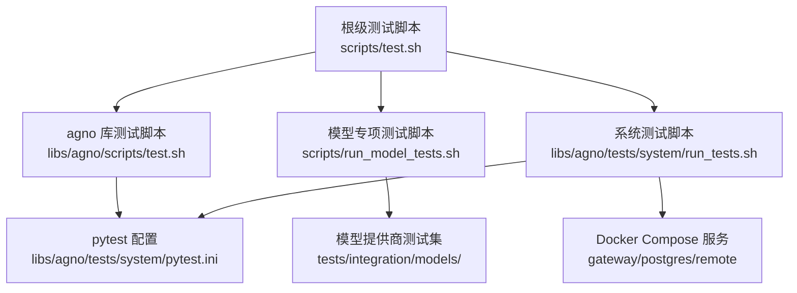
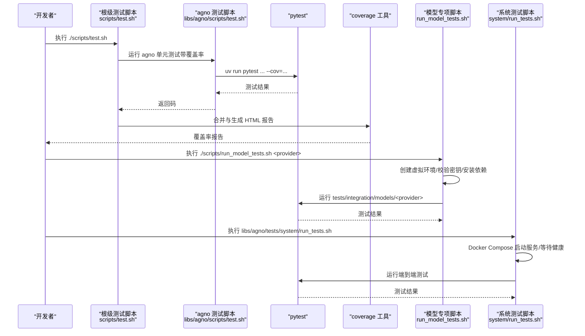
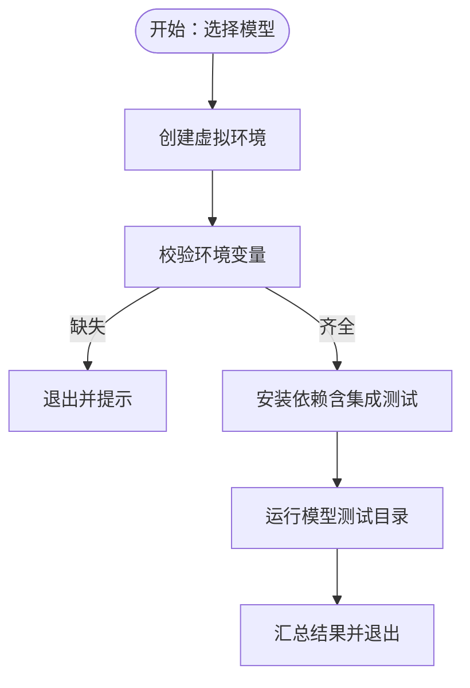
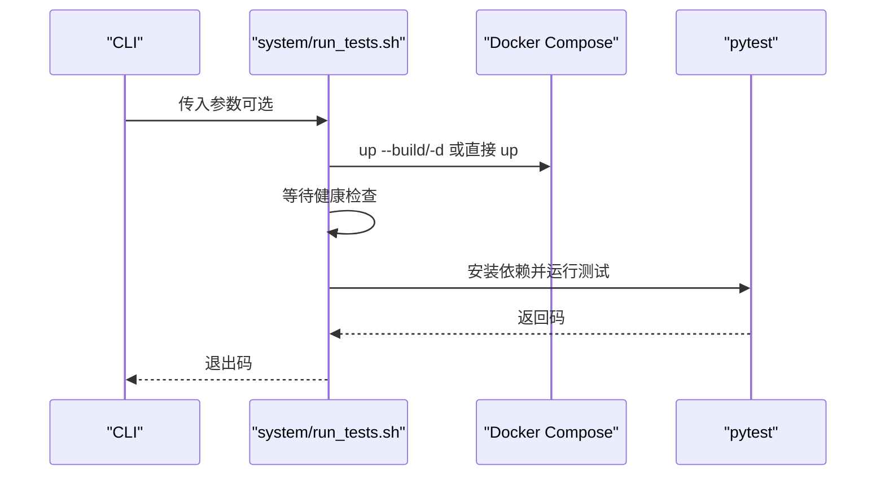
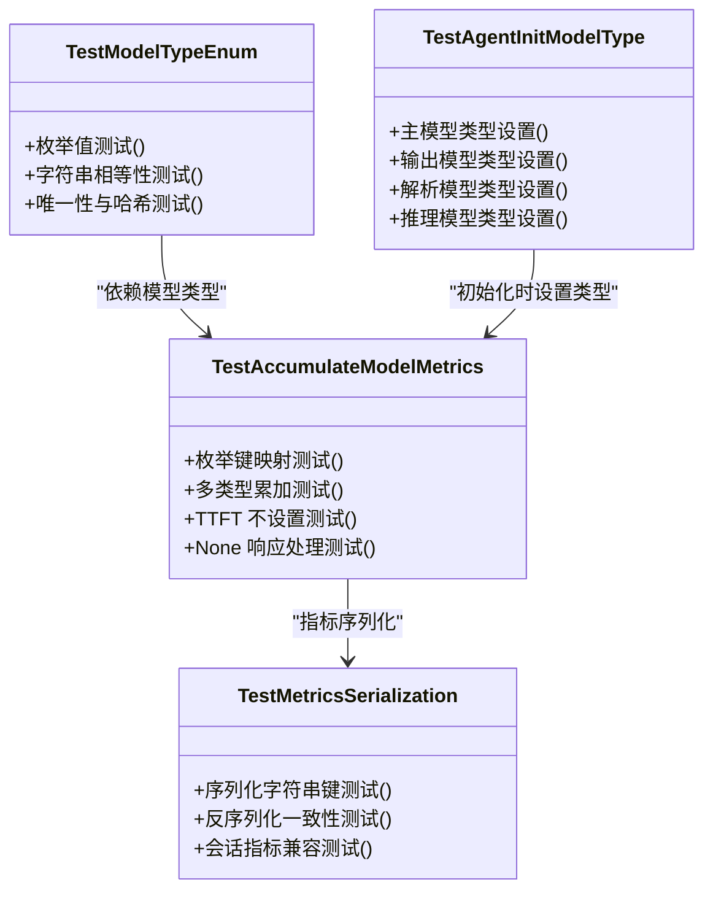
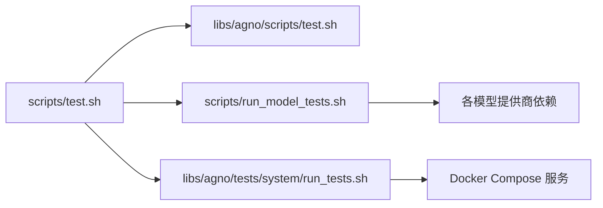

# 测试指南

<cite>
**本文引用的文件**
- [scripts/test.sh](file://scripts/test.sh)
- [libs/agno/scripts/test.sh](file://libs/agno/scripts/test.sh)
- [libs/agno/scripts/test.bat](file://libs/agno/scripts/test.bat)
- [scripts/run_model_tests.sh](file://scripts/run_model_tests.sh)
- [libs/agno/tests/system/run_tests.sh](file://libs/agno/tests/system/run_tests.sh)
- [libs/agno/tests/system/pytest.ini](file://libs/agno/tests/system/pytest.ini)
- [libs/agno/tests/integration/agent/conftest.py](file://libs/agno/tests/integration/agent/conftest.py)
- [libs/agno/tests/unit/test_model_type.py](file://libs/agno/tests/unit/test_model_type.py)
- [cookbook/01_demo/agents/scout/connectors/s3.py](file://cookbook/01_demo/agents/scout/connectors/s3.py)
</cite>

## 目录
1. [简介](#简介)
2. [项目结构](#项目结构)
3. [核心组件](#核心组件)
4. [架构总览](#架构总览)
5. [详细组件分析](#详细组件分析)
6. [依赖关系分析](#依赖关系分析)
7. [性能考量](#性能考量)
8. [故障排查指南](#故障排查指南)
9. [结论](#结论)
10. [附录](#附录)

## 简介
本测试指南面向 Agno Learn 项目，系统化阐述测试策略与实施方法，覆盖单元测试、集成测试与端到端（E2E）测试的设计原则与执行流程；详解测试脚本的使用方式、参数与选项；说明测试环境搭建与配置（含测试数据库、模拟服务与测试数据）；介绍模型测试的特殊要求与执行方法（不同模型提供商的配置与性能基准）；阐述测试覆盖率统计、报告生成与问题定位；提供测试用例编写指南（设计原则、边界条件与异常处理）；并涵盖持续集成中的自动化测试流程（流水线、并行执行与结果监控），以及性能与压力测试的实施要点。

## 项目结构
Agno Learn 的测试体系由多层脚本与配置组成：
- 根级测试脚本：统一调度各子库测试与覆盖率汇总
- 子库测试脚本：针对单个库（如 agno）进行独立测试与覆盖率输出
- 模型专项测试脚本：按模型提供商创建虚拟环境并安装依赖后运行集成测试
- 系统测试脚本：通过 Docker Compose 启动依赖服务，运行端到端测试
- pytest 配置：统一测试发现规则、异步模式与告警过滤
- 集成测试钩子：对特定错误（如 429 限流）进行跳过处理

图表来源
- [scripts/test.sh:1-30](file://scripts/test.sh#L1-L30)
- [libs/agno/scripts/test.sh:1-16](file://libs/agno/scripts/test.sh#L1-L16)
- [scripts/run_model_tests.sh:1-262](file://scripts/run_model_tests.sh#L1-L262)
- [libs/agno/tests/system/run_tests.sh:1-121](file://libs/agno/tests/system/run_tests.sh#L1-L121)
- [libs/agno/tests/system/pytest.ini:1-13](file://libs/agno/tests/system/pytest.ini#L1-L13)

章节来源
- [scripts/test.sh:1-30](file://scripts/test.sh#L1-L30)
- [libs/agno/scripts/test.sh:1-16](file://libs/agno/scripts/test.sh#L1-L16)
- [libs/agno/tests/system/run_tests.sh:1-121](file://libs/agno/tests/system/run_tests.sh#L1-L121)
- [libs/agno/tests/system/pytest.ini:1-13](file://libs/agno/tests/system/pytest.ini#L1-L13)

## 核心组件
- 测试脚本与入口
  - 根级脚本负责聚合执行 agno 与 agno_infra 的单元测试，并在完成后合并与生成覆盖率报告
  - agno 单库脚本专注于该库的单元测试与覆盖率输出
  - 模型专项脚本按模型名创建虚拟环境，校验并注入所需 API 密钥，安装依赖后运行对应模型测试目录
  - 系统测试脚本通过 Docker Compose 启动依赖服务，等待健康检查，再运行端到端测试
- 测试配置
  - pytest.ini 统一测试发现规则、异步模式与告警过滤
  - 集成测试钩子对 429 限流等错误进行跳过处理，避免失败阻断整体流水线
- 测试用例示例
  - 单元测试覆盖枚举行为、指标聚合、序列化与 Agent 初始化等关键路径
  - 集成测试覆盖多模型提供商、多模态、工具调用、检索增强等场景

章节来源
- [scripts/test.sh:1-30](file://scripts/test.sh#L1-L30)
- [libs/agno/scripts/test.sh:1-16](file://libs/agno/scripts/test.sh#L1-L16)
- [scripts/run_model_tests.sh:1-262](file://scripts/run_model_tests.sh#L1-L262)
- [libs/agno/tests/system/run_tests.sh:1-121](file://libs/agno/tests/system/run_tests.sh#L1-L121)
- [libs/agno/tests/system/pytest.ini:1-13](file://libs/agno/tests/system/pytest.ini#L1-L13)
- [libs/agno/tests/integration/agent/conftest.py:1-22](file://libs/agno/tests/integration/agent/conftest.py#L1-L22)
- [libs/agno/tests/unit/test_model_type.py:1-333](file://libs/agno/tests/unit/test_model_type.py#L1-L333)

## 架构总览
下图展示从命令行到测试执行与覆盖率生成的整体流程，以及模型专项测试与系统测试两条并行路径。

图表来源
- [scripts/test.sh:1-30](file://scripts/test.sh#L1-L30)
- [libs/agno/scripts/test.sh:1-16](file://libs/agno/scripts/test.sh#L1-L16)
- [scripts/run_model_tests.sh:1-262](file://scripts/run_model_tests.sh#L1-L262)
- [libs/agno/tests/system/run_tests.sh:1-121](file://libs/agno/tests/system/run_tests.sh#L1-L121)

## 详细组件分析

### 测试脚本与执行流程
- 根级脚本（scripts/test.sh）
  - 功能：统一执行 agno 与 agno_infra 的测试，并在完成后合并与生成覆盖率报告
  - 关键点：使用 uv run 调度 pytest；对 agno 使用 --cov 与 --cov-report 输出缺失行与 HTML 报告；最后合并与导出报告
- agno 单库脚本（libs/agno/scripts/test.sh）
  - 功能：仅执行 agno 库的单元测试并输出覆盖率
  - 关键点：通过 uv run 在当前环境中运行 pytest 并指定覆盖率输出格式
- Windows 兼容脚本（libs/agno/scripts/test.bat）
  - 功能：Windows 下运行 agno 单元测试并启用覆盖率
  - 关键点：使用 pytest 命令行参数控制覆盖率与报告格式
- 模型专项测试脚本（scripts/run_model_tests.sh）
  - 功能：按模型名创建虚拟环境，校验并注入所需 API 密钥，安装依赖后运行对应模型测试目录
  - 关键点：支持众多模型提供商；根据模型差异安装额外依赖；通过 -e .[<model>,integration-tests] 安装集成测试依赖；禁用遥测上报
- 系统测试脚本（libs/agno/tests/system/run_tests.sh）
  - 功能：通过 Docker Compose 启动 gateway/postgres/remote 等服务，等待健康检查后运行端到端测试
  - 关键点：支持 --rebuild/--down/--skip-build 参数；自动加载 .env；超时与日志输出；可指定运行特定测试文件

章节来源
- [scripts/test.sh:1-30](file://scripts/test.sh#L1-L30)
- [libs/agno/scripts/test.sh:1-16](file://libs/agno/scripts/test.sh#L1-L16)
- [libs/agno/scripts/test.bat:1-24](file://libs/agno/scripts/test.bat#L1-L24)
- [scripts/run_model_tests.sh:1-262](file://scripts/run_model_tests.sh#L1-L262)
- [libs/agno/tests/system/run_tests.sh:1-121](file://libs/agno/tests/system/run_tests.sh#L1-L121)

### 测试配置与钩子
- pytest.ini（libs/agno/tests/system/pytest.ini）
  - 功能：统一测试发现规则（testpaths、文件/类/函数前缀）、禁用特定插件、异步模式、告警过滤
  - 关键点：filterwarnings 忽略弃用警告，提升稳定性
- 集成测试钩子（libs/agno/tests/integration/agent/conftest.py）
  - 功能：在测试失败时检测 429/配额/速率限制等关键词，将失败转为跳过，避免 CI 中断
  - 关键点：结合异常信息、长描述与 sections 文本进行综合判断

章节来源
- [libs/agno/tests/system/pytest.ini:1-13](file://libs/agno/tests/system/pytest.ini#L1-L13)
- [libs/agno/tests/integration/agent/conftest.py:1-22](file://libs/agno/tests/integration/agent/conftest.py#L1-L22)

### 测试金字塔与覆盖率要求
- 测试金字塔（cookbook 示例）
  - 单元测试（60%）：函数、类、模块级
  - 集成测试（30%）：API、数据库、外部服务
  - 端到端测试（10%）：关键用户流程
- 覆盖率要求（cookbook 示例）
  - 最低 80%，关键路径 100%，新代码 90%
- 实践建议
  - 优先保证单元测试数量与质量，确保关键逻辑与边界条件被覆盖
  - 集成测试聚焦外部依赖交互与数据流
  - 端到端测试验证真实用户场景

章节来源
- [cookbook/01_demo/agents/scout/connectors/s3.py:996-1051](file://cookbook/01_demo/agents/scout/connectors/s3.py#L996-L1051)

### 模型测试的特殊要求与执行方法
- 环境隔离
  - 每个模型单独创建虚拟环境，避免依赖冲突
- 密钥管理
  - 按模型提供商检查必要环境变量，未设置则中止
- 依赖安装
  - 通过 -e .[<model>,integration-tests] 安装模型与集成测试依赖
  - 部分模型需要额外安装第三方包（如 litellm、groq、anthropic）
- 执行策略
  - 禁用遥测上报，避免干扰测试与隐私
  - 指定测试目录 tests/integration/models/<provider> 运行
- 性能基准
  - 可基于测试耗时与 token 使用量进行对比评估（需在测试中记录）

图表来源
- [scripts/run_model_tests.sh:1-262](file://scripts/run_model_tests.sh#L1-L262)

章节来源
- [scripts/run_model_tests.sh:1-262](file://scripts/run_model_tests.sh#L1-L262)

### 端到端测试与系统测试
- 服务编排
  - 使用 Docker Compose 启动 gateway、postgres、remote 等服务
  - 支持 --rebuild 清理重建；--down 在结束后停止容器；--skip-build 跳过构建
- 健康检查
  - 循环检查容器健康状态，超时打印日志并退出
- 测试执行
  - 自动安装 requirements.txt 中的测试依赖
  - 支持运行全部或指定测试文件
- 环境准备
  - 若未设置 OPENAI_API_KEY，尝试从 .env 加载

图表来源
- [libs/agno/tests/system/run_tests.sh:1-121](file://libs/agno/tests/system/run_tests.sh#L1-L121)

章节来源
- [libs/agno/tests/system/run_tests.sh:1-121](file://libs/agno/tests/system/run_tests.sh#L1-L121)

### 单元测试示例与最佳实践
- 示例：模型类型枚举与指标聚合
  - 覆盖枚举值、字符串相等性、哈希可用性、默认值与可覆盖性
  - 验证 accumulate_model_metrics 将不同 model_type 映射为字符串键，且累加正确
  - 验证序列化/反序列化保留字符串键，会话指标兼容字典格式
  - 验证 Agent 初始化时为不同模型设置正确的 model_type
- 最佳实践
  - 单一断言、描述性命名
  - 边界条件与异常路径（如 None 的 response_usage）
  - 与历史版本的兼容性（字符串键仍可用）

图表来源
- [libs/agno/tests/unit/test_model_type.py:1-333](file://libs/agno/tests/unit/test_model_type.py#L1-L333)

章节来源
- [libs/agno/tests/unit/test_model_type.py:1-333](file://libs/agno/tests/unit/test_model_type.py#L1-L333)

## 依赖关系分析
- 脚本耦合
  - 根级脚本依赖 agno 与 agno_infra 的测试入口
  - 模型专项脚本依赖各模型提供商的密钥与依赖
  - 系统测试脚本依赖 Docker Compose 与服务健康检查
- 外部依赖
  - pytest、coverage、uv、docker、pytest-asyncio、requests 等
- 潜在循环依赖
  - 当前脚本间无直接循环导入；系统测试通过容器隔离外部服务

图表来源
- [scripts/test.sh:1-30](file://scripts/test.sh#L1-L30)
- [libs/agno/scripts/test.sh:1-16](file://libs/agno/scripts/test.sh#L1-L16)
- [scripts/run_model_tests.sh:1-262](file://scripts/run_model_tests.sh#L1-L262)
- [libs/agno/tests/system/run_tests.sh:1-121](file://libs/agno/tests/system/run_tests.sh#L1-L121)

章节来源
- [scripts/test.sh:1-30](file://scripts/test.sh#L1-L30)
- [libs/agno/scripts/test.sh:1-16](file://libs/agno/scripts/test.sh#L1-L16)
- [scripts/run_model_tests.sh:1-262](file://scripts/run_model_tests.sh#L1-L262)
- [libs/agno/tests/system/run_tests.sh:1-121](file://libs/agno/tests/system/run_tests.sh#L1-L121)

## 性能考量
- 单元测试
  - 优先本地快速反馈，减少外部依赖
  - 使用 mock 与最小化输入，缩短执行时间
- 集成测试
  - 控制并发与重试策略，避免触发限流
  - 对慢依赖（如网络请求）设置合理超时
- 系统测试
  - 合理设置等待时间与超时阈值，避免长时间阻塞
  - 使用 --skip-build 在重复执行时节省时间
- 覆盖率
  - 结合覆盖率报告定位热点区域，针对性优化关键路径

## 故障排查指南
- 429/配额/速率限制
  - 集成测试钩子会将包含 429/rate limit/quota 等关键词的失败转换为跳过，避免 CI 中断
- 环境变量缺失
  - 模型专项脚本会在缺少必要密钥时中止并提示可用模型列表
  - 系统测试脚本会在未设置 OPENAI_API_KEY 且无 .env 时提示
- 容器健康检查超时
  - 系统测试脚本在超时后会打印容器日志，便于定位问题
- 覆盖率报告为空或不完整
  - 确认覆盖率参数已正确传递；根级脚本会尝试合并与生成报告

章节来源
- [libs/agno/tests/integration/agent/conftest.py:1-22](file://libs/agno/tests/integration/agent/conftest.py#L1-L22)
- [scripts/run_model_tests.sh:1-262](file://scripts/run_model_tests.sh#L1-L262)
- [libs/agno/tests/system/run_tests.sh:1-121](file://libs/agno/tests/system/run_tests.sh#L1-L121)

## 结论
Agno Learn 的测试体系以“测试金字塔”为核心，结合根级脚本统一调度、模型专项测试隔离执行、系统测试容器化验证，形成从单元到端到端的完整闭环。通过 pytest 配置与钩子机制提升稳定性，配合覆盖率与报告工具实现可观测性。建议在持续集成中并行执行单元与模型测试，系统测试作为每日流水线的一部分定期运行，以保障质量与稳定性。

## 附录
- 测试用例编写指南
  - 设计原则：单一断言、描述性命名、覆盖关键路径与异常
  - 边界条件：空值、极值、非法输入、时序边界
  - 异常处理：显式抛错、超时、网络中断、配额限制
- 持续集成建议
  - 分阶段流水线：单元测试（快速）、模型测试（并行）、系统测试（串行）
  - 并行执行：按模型提供商拆分作业，缩短总时长
  - 结果监控：覆盖率阈值、失败重试策略、告警与日志归档