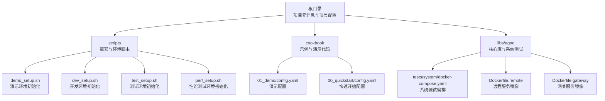
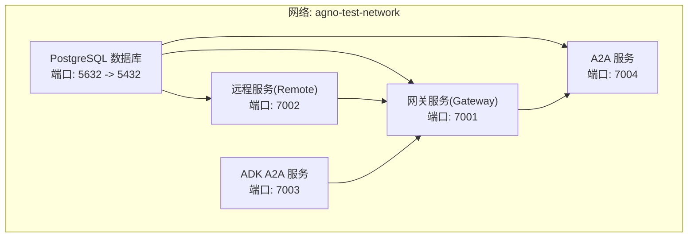
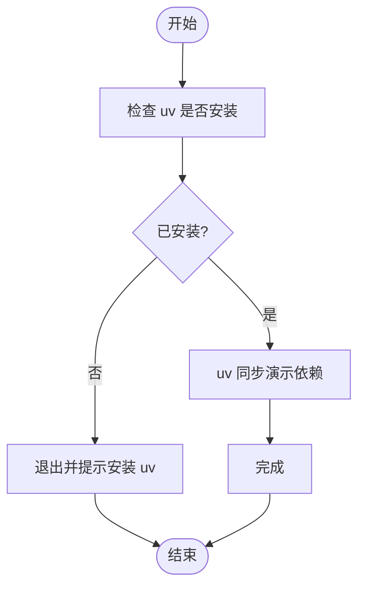
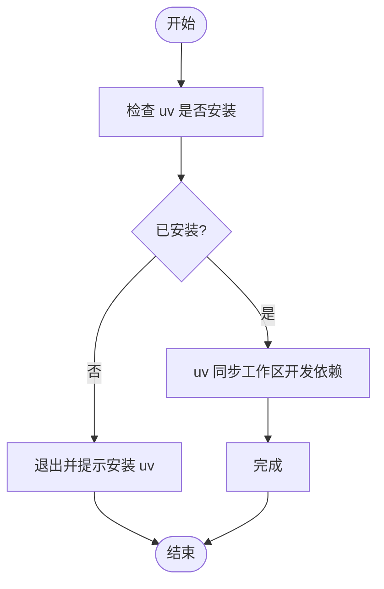
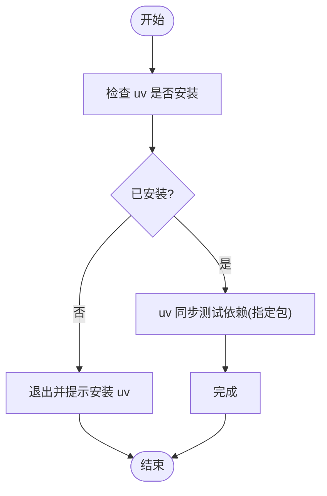
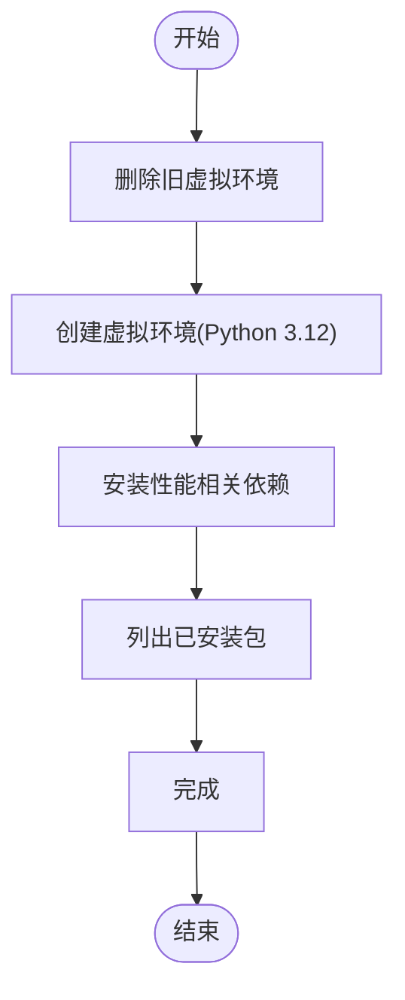
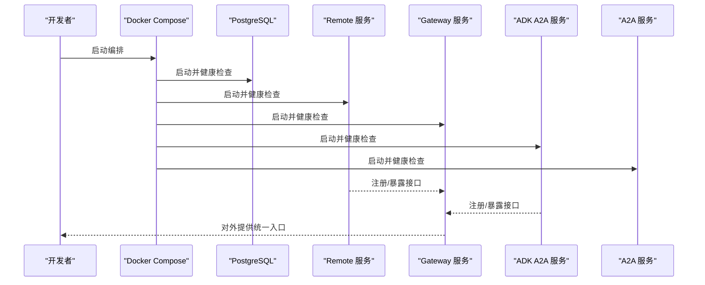
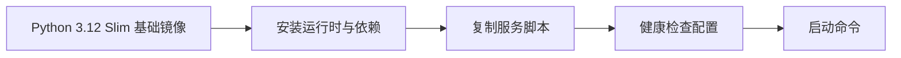
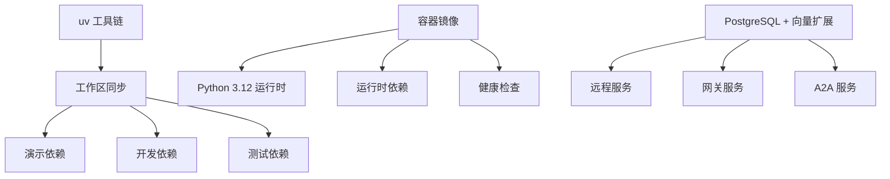

# 部署指南

<cite>
**本文引用的文件**
- [README.md](file://README.md)
- [pyproject.toml](file://pyproject.toml)
- [scripts/_utils.sh](file://scripts/_utils.sh)
- [scripts/demo_setup.sh](file://scripts/demo_setup.sh)
- [scripts/dev_setup.sh](file://scripts/dev_setup.sh)
- [scripts/test_setup.sh](file://scripts/test_setup.sh)
- [scripts/perf_setup.sh](file://scripts/perf_setup.sh)
- [cookbook/01_demo/config.yaml](file://cookbook/01_demo/config.yaml)
- [cookbook/00_quickstart/config.yaml](file://cookbook/00_quickstart/config.yaml)
- [libs/agno/tests/system/docker-compose.yaml](file://libs/agno/tests/system/docker-compose.yaml)
- [libs/agno/tests/system/Dockerfile.remote](file://libs/agno/tests/system/Dockerfile.remote)
- [libs/agno/tests/system/Dockerfile.gateway](file://libs/agno/tests/system/Dockerfile.gateway)
</cite>

## 目录
1. [简介](#简介)
2. [项目结构](#项目结构)
3. [核心组件](#核心组件)
4. [架构总览](#架构总览)
5. [详细组件分析](#详细组件分析)
6. [依赖关系分析](#依赖关系分析)
7. [性能考虑](#性能考虑)
8. [故障排查指南](#故障排查指南)
9. [结论](#结论)
10. [附录](#附录)

## 简介
本指南面向 Agno Learn 项目的部署与运维，覆盖开发、测试、演示与生产环境的部署策略与实施流程。重点包括：
- 演示环境部署：demo_setup.sh 脚本使用、服务配置与启动流程
- 生产环境部署：容器化、Kubernetes 配置与云平台集成建议
- 性能测试环境：搭建与基准测试执行
- 监控与日志：健康检查、性能指标与错误日志
- 安全配置：访问控制、数据加密与网络安全
- 滚动更新与回滚：零停机部署、版本管理与故障恢复
- 运维监控：服务与资源监控、告警配置
- 故障排查：常见问题诊断与修复

## 项目结构
仓库采用多包工作区组织，核心目录与职责如下：
- scripts：部署与环境初始化脚本集合（开发、测试、演示、性能）
- cookbook：示例与演示代码，包含演示配置
- libs/agno：核心库与系统测试编排（含容器镜像与编排文件）
- 根目录：项目元信息与顶层配置（如 pyproject.toml）

图表来源
- [pyproject.toml:1-15](file://pyproject.toml#L1-L15)
- [scripts/demo_setup.sh:1-56](file://scripts/demo_setup.sh#L1-L56)
- [scripts/dev_setup.sh:1-29](file://scripts/dev_setup.sh#L1-L29)
- [scripts/test_setup.sh:1-29](file://scripts/test_setup.sh#L1-L29)
- [scripts/perf_setup.sh:1-37](file://scripts/perf_setup.sh#L1-L37)
- [cookbook/01_demo/config.yaml:1-40](file://cookbook/01_demo/config.yaml#L1-L40)
- [cookbook/00_quickstart/config.yaml:1-57](file://cookbook/00_quickstart/config.yaml#L1-L57)
- [libs/agno/tests/system/docker-compose.yaml:1-148](file://libs/agno/tests/system/docker-compose.yaml#L1-L148)
- [libs/agno/tests/system/Dockerfile.remote:1-56](file://libs/agno/tests/system/Dockerfile.remote#L1-L56)
- [libs/agno/tests/system/Dockerfile.gateway:1-57](file://libs/agno/tests/system/Dockerfile.gateway#L1-L57)

章节来源
- [pyproject.toml:1-15](file://pyproject.toml#L1-L15)

## 核心组件
- 演示环境脚本：通过 uv 工作区同步演示依赖，提供一键激活与运行命令
- 开发环境脚本：安装工作区开发依赖，支持可编辑安装
- 测试环境脚本：安装测试依赖并指定包范围
- 性能测试环境脚本：创建独立虚拟环境并安装性能相关依赖
- 演示配置：提供示例提示词与演示场景
- 系统测试编排：多服务容器编排，包含数据库、远程服务、网关与 A2A 服务
- 容器镜像：远程服务与网关服务的 Dockerfile，定义运行时与依赖

章节来源
- [scripts/demo_setup.sh:1-56](file://scripts/demo_setup.sh#L1-L56)
- [scripts/dev_setup.sh:1-29](file://scripts/dev_setup.sh#L1-L29)
- [scripts/test_setup.sh:1-29](file://scripts/test_setup.sh#L1-L29)
- [scripts/perf_setup.sh:1-37](file://scripts/perf_setup.sh#L1-L37)
- [cookbook/01_demo/config.yaml:1-40](file://cookbook/01_demo/config.yaml#L1-L40)
- [libs/agno/tests/system/docker-compose.yaml:1-148](file://libs/agno/tests/system/docker-compose.yaml#L1-L148)
- [libs/agno/tests/system/Dockerfile.remote:1-56](file://libs/agno/tests/system/Dockerfile.remote#L1-L56)
- [libs/agno/tests/system/Dockerfile.gateway:1-57](file://libs/agno/tests/system/Dockerfile.gateway#L1-L57)

## 架构总览
下图展示系统测试编排中的服务关系与网络拓扑，体现演示与生产环境可复用的容器化思路。

图表来源
- [libs/agno/tests/system/docker-compose.yaml:1-148](file://libs/agno/tests/system/docker-compose.yaml#L1-L148)

## 详细组件分析

### 演示环境部署（demo_setup.sh）
- 目标：一键安装演示所需依赖，进入虚拟环境并运行演示入口
- 关键步骤
  - 检查 uv 是否可用
  - 切换到仓库根目录
  - 使用 uv 工作区同步演示分组依赖
  - 输出激活与运行指引
- 启动流程
  - 激活虚拟环境
  - 运行演示入口脚本

图表来源
- [scripts/demo_setup.sh:38-56](file://scripts/demo_setup.sh#L38-L56)

章节来源
- [scripts/demo_setup.sh:1-56](file://scripts/demo_setup.sh#L1-L56)

### 开发环境部署（dev_setup.sh）
- 目标：安装工作区开发依赖，支持可编辑安装
- 关键步骤
  - 检查 uv
  - 切换到仓库根目录
  - 执行 uv 工作区同步
  - 输出激活或直接运行指引

图表来源
- [scripts/dev_setup.sh:16-29](file://scripts/dev_setup.sh#L16-L29)

章节来源
- [scripts/dev_setup.sh:1-29](file://scripts/dev_setup.sh#L1-L29)

### 测试环境部署（test_setup.sh）
- 目标：安装测试依赖并限定包范围
- 关键步骤
  - 检查 uv
  - 切换到仓库根目录
  - 执行 uv 同步（带 extra tests 与包范围）
  - 输出激活或直接运行指引

图表来源
- [scripts/test_setup.sh:16-29](file://scripts/test_setup.sh#L16-L29)

章节来源
- [scripts/test_setup.sh:1-29](file://scripts/test_setup.sh#L1-L29)

### 性能测试环境部署（perf_setup.sh）
- 目标：创建独立虚拟环境并安装性能相关依赖
- 关键步骤
  - 删除旧虚拟环境
  - 创建新虚拟环境（Python 3.12）
  - 安装指定性能相关包
  - 列出已安装包
  - 输出激活指引

图表来源
- [scripts/perf_setup.sh:21-37](file://scripts/perf_setup.sh#L21-L37)

章节来源
- [scripts/perf_setup.sh:1-37](file://scripts/perf_setup.sh#L1-L37)

### 演示配置（cookbook/01_demo/config.yaml）
- 内容：演示场景的快速提示词集合，覆盖多个 Agent 与团队、工作流
- 用途：用于演示环境的快速验证与交互

章节来源
- [cookbook/01_demo/config.yaml:1-40](file://cookbook/01_demo/config.yaml#L1-L40)

### 快速开始配置（cookbook/00_quickstart/config.yaml）
- 内容：快速开始示例的提示词集合，覆盖工具、存储、知识、记忆、护栏、人机协作等主题
- 用途：帮助开发者快速理解与验证功能

章节来源
- [cookbook/00_quickstart/config.yaml:1-57](file://cookbook/00_quickstart/config.yaml#L1-L57)

### 系统测试编排（docker-compose.yaml）
- 服务组成
  - PostgreSQL 数据库：提供向量数据库与持久化
  - 远程服务（Remote）：承载实际 Agent、团队与工作流
  - 网关服务（Gateway）：消费远程服务并通过远程代理访问
  - ADK A2A 服务：提供外部能力接入
  - A2A 服务：另一类远程服务实例
- 网络与健康检查：跨服务健康检查与网络隔离
- 环境变量：数据库连接、API 密钥、认证开关、重载模式等

图表来源
- [libs/agno/tests/system/docker-compose.yaml:1-148](file://libs/agno/tests/system/docker-compose.yaml#L1-L148)

章节来源
- [libs/agno/tests/system/docker-compose.yaml:1-148](file://libs/agno/tests/system/docker-compose.yaml#L1-L148)

### 容器镜像（Dockerfile）
- 远程服务镜像：定义基础运行时、安装依赖、复制服务脚本、健康检查与启动命令
- 网关服务镜像：与远程镜像类似，但包含网关特有依赖与入口

图表来源
- [libs/agno/tests/system/Dockerfile.remote:1-56](file://libs/agno/tests/system/Dockerfile.remote#L1-L56)
- [libs/agno/tests/system/Dockerfile.gateway:1-57](file://libs/agno/tests/system/Dockerfile.gateway#L1-L57)

章节来源
- [libs/agno/tests/system/Dockerfile.remote:1-56](file://libs/agno/tests/system/Dockerfile.remote#L1-L56)
- [libs/agno/tests/system/Dockerfile.gateway:1-57](file://libs/agno/tests/system/Dockerfile.gateway#L1-L57)

## 依赖关系分析
- 工具链：统一使用 uv 进行依赖解析与安装，支持工作区与分组管理
- 运行时：基于 Python 3.12，容器内使用轻量镜像
- 数据库：PostgreSQL + 向量扩展，用于持久化与检索增强
- 服务间通信：通过健康检查与网络隔离保障稳定性

图表来源
- [pyproject.toml:10-15](file://pyproject.toml#L10-L15)
- [scripts/demo_setup.sh:46-48](file://scripts/demo_setup.sh#L46-L48)
- [scripts/dev_setup.sh:23-25](file://scripts/dev_setup.sh#L23-L25)
- [scripts/test_setup.sh:23-25](file://scripts/test_setup.sh#L23-L25)
- [libs/agno/tests/system/Dockerfile.remote:1-56](file://libs/agno/tests/system/Dockerfile.remote#L1-L56)
- [libs/agno/tests/system/Dockerfile.gateway:1-57](file://libs/agno/tests/system/Dockerfile.gateway#L1-L57)
- [libs/agno/tests/system/docker-compose.yaml:22-51](file://libs/agno/tests/system/docker-compose.yaml#L22-L51)

章节来源
- [pyproject.toml:1-15](file://pyproject.toml#L1-L15)
- [scripts/demo_setup.sh:1-56](file://scripts/demo_setup.sh#L1-L56)
- [scripts/dev_setup.sh:1-29](file://scripts/dev_setup.sh#L1-L29)
- [scripts/test_setup.sh:1-29](file://scripts/test_setup.sh#L1-L29)
- [libs/agno/tests/system/docker-compose.yaml:1-148](file://libs/agno/tests/system/docker-compose.yaml#L1-L148)

## 性能考虑
- 独立虚拟环境：避免依赖污染，便于对比不同版本性能
- 依赖精简：仅安装必要运行时与观测依赖，降低启动与运行时开销
- 健康检查：容器层面的健康检查有助于快速发现异常，减少故障恢复时间
- 数据库优化：使用向量扩展与专用索引提升检索性能

## 故障排查指南
- 依赖安装失败
  - 确认 uv 已安装且版本满足要求
  - 检查网络与缓存配置
- 容器启动失败
  - 查看健康检查日志与端口占用
  - 核对环境变量（数据库连接、密钥等）
- 数据库连接异常
  - 检查数据库服务状态与凭据
  - 确认网络连通与防火墙策略
- 性能测试环境问题
  - 确认虚拟环境隔离与依赖一致性
  - 对比不同版本的安装与运行日志

章节来源
- [scripts/demo_setup.sh:38-42](file://scripts/demo_setup.sh#L38-L42)
- [libs/agno/tests/system/docker-compose.yaml:14-18](file://libs/agno/tests/system/docker-compose.yaml#L14-L18)
- [libs/agno/tests/system/docker-compose.yaml:44-49](file://libs/agno/tests/system/docker-compose.yaml#L44-L49)

## 结论
本指南提供了从开发到生产的完整部署路径：以 uv 工作区为核心，结合演示、开发、测试与性能环境脚本；通过容器化与编排实现服务解耦与可观测；以健康检查与网络隔离确保稳定性。建议在生产环境中进一步完善认证授权、密钥管理与资源配额策略，并建立自动化监控与告警体系。

## 附录
- 快速开始参考：顶层 README 提供了最小示例与运行方式，便于快速验证本地运行时与 AgentOS UI 的连通性
- 配置文件：演示与快速开始的配置文件可用于快速切换与验证不同场景

章节来源
- [README.md:35-98](file://README.md#L35-L98)
- [cookbook/01_demo/config.yaml:1-40](file://cookbook/01_demo/config.yaml#L1-L40)
- [cookbook/00_quickstart/config.yaml:1-57](file://cookbook/00_quickstart/config.yaml#L1-L57)