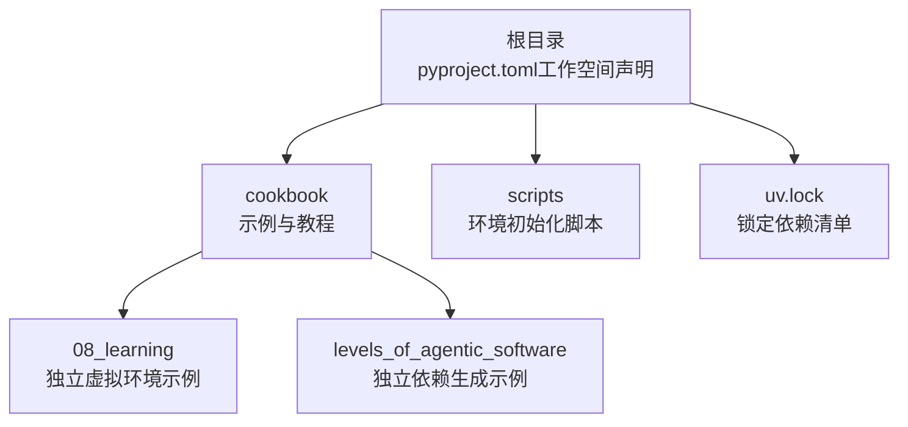
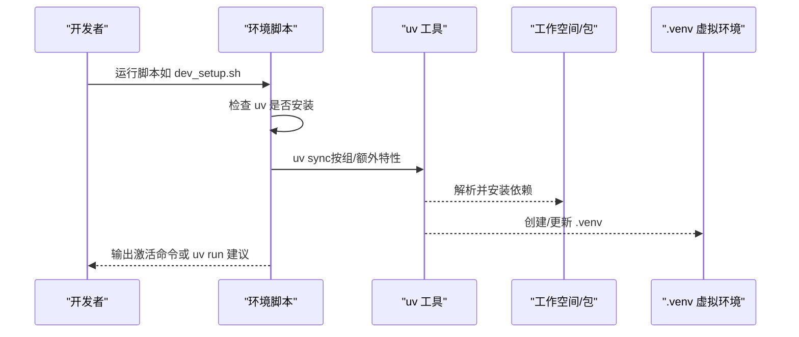
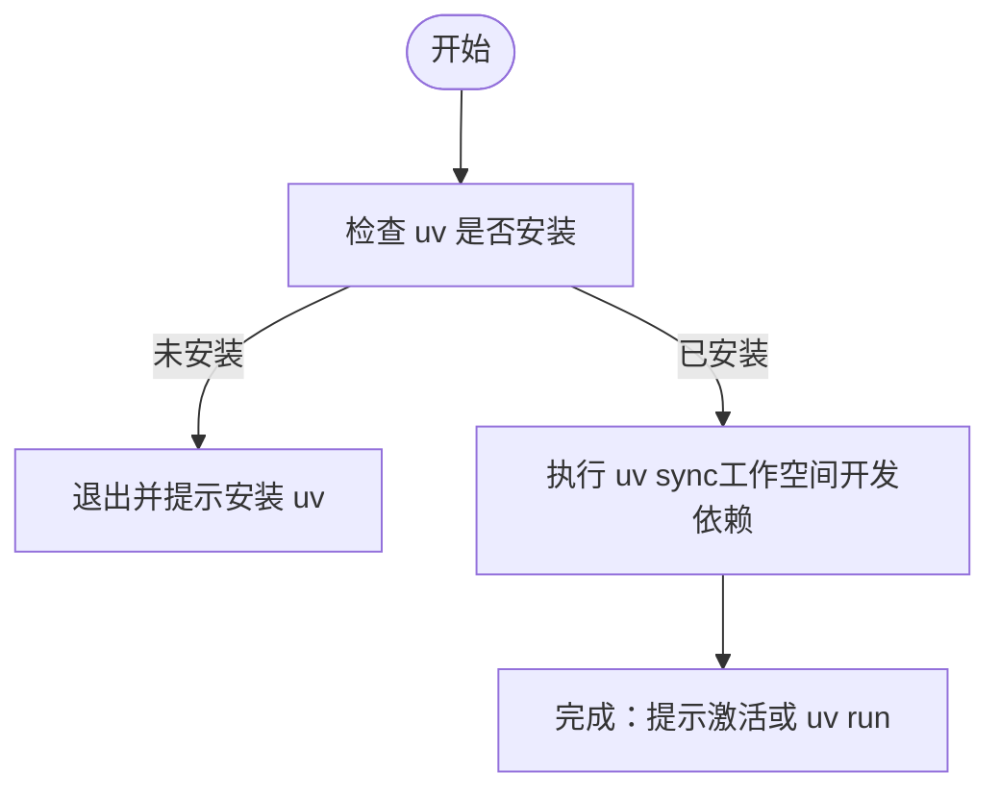
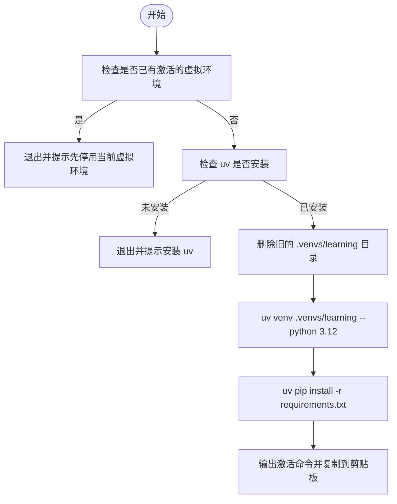
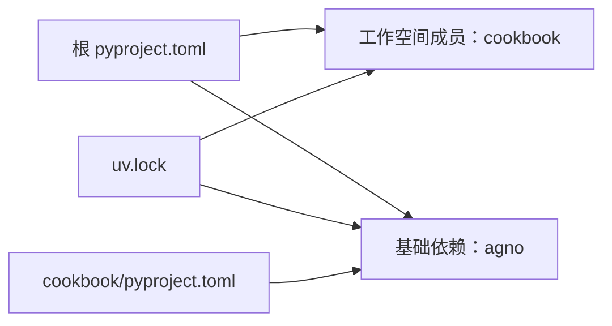

# 项目设置

<cite>
**本文引用的文件**
- [pyproject.toml](file://pyproject.toml)
- [README.md](file://README.md)
- [_utils.sh](file://scripts/_utils.sh)
- [dev_setup.sh](file://scripts/dev_setup.sh)
- [demo_setup.sh](file://scripts/demo_setup.sh)
- [test_setup.sh](file://scripts/test_setup.sh)
- [cookbook_setup.sh](file://scripts/cookbook_setup.sh)
- [setup_venv.sh](file://cookbook/08_learning/setup_venv.sh)
- [generate_requirements.sh（学习示例）](file://cookbook/08_learning/generate_requirements.sh)
- [generate_requirements.sh（关卡示例）](file://cookbook/levels_of_agentic_software/generate_requirements.sh)
- [cookbook_pyproject.toml](file://cookbook/pyproject.toml)
- [uv.lock](file://uv.lock)
</cite>

## 目录
1. [简介](#简介)
2. [项目结构](#项目结构)
3. [核心组件](#核心组件)
4. [架构总览](#架构总览)
5. [详细组件分析](#详细组件分析)
6. [依赖关系分析](#依赖关系分析)
7. [性能考量](#性能考量)
8. [故障排查指南](#故障排查指南)
9. [结论](#结论)
10. [附录](#附录)

## 简介
本指南面向 Agno Learn 项目的开发者，提供从零搭建与维护开发环境的完整流程，覆盖以下关键主题：
- uv 工具安装与配置
- 工作空间依赖的同步安装
- 虚拟环境的激活与使用
- 项目依赖管理（editable 安装、版本锁定与冲突解决）
- 不同环境脚本（开发、演示、测试、示例）的使用与差异
- 环境变量配置与最佳实践（路径、权限、网络代理）
- 常见问题排查与开发环境验证

## 项目结构
仓库采用 uv 工作空间组织，顶层通过 pyproject.toml 声明工作空间成员与基础依赖；示例与教程位于 cookbook 子目录，另有若干独立示例（如学习示例）包含独立的虚拟环境与依赖生成脚本。

图表来源
- [pyproject.toml:1-15](file://pyproject.toml#L1-L15)
- [cookbook_pyproject.toml:1-10](file://cookbook/pyproject.toml#L1-L10)
- [uv.lock:1-200](file://uv.lock#L1-L200)

章节来源
- [pyproject.toml:1-15](file://pyproject.toml#L1-L15)
- [cookbook_pyproject.toml:1-10](file://cookbook/pyproject.toml#L1-L10)
- [uv.lock:1-200](file://uv.lock#L1-L200)

## 核心组件
- 工作空间与基础依赖
  - 顶层 pyproject.toml 声明工作空间成员与最低 Python 版本要求，并将 agno 作为基础依赖之一。
- 环境初始化脚本
  - 提供开发、演示、测试、示例等多套脚本，统一通过 uv sync 安装依赖，支持分组与额外特性。
- 依赖锁定与生成
  - uv.lock 统一锁定工作空间内包的版本与来源；示例子项目提供 requirements.in 到 requirements.txt 的编译脚本。

章节来源
- [pyproject.toml:1-15](file://pyproject.toml#L1-L15)
- [dev_setup.sh:1-29](file://scripts/dev_setup.sh#L1-L29)
- [demo_setup.sh:1-56](file://scripts/demo_setup.sh#L1-L56)
- [test_setup.sh:1-29](file://scripts/test_setup.sh#L1-L29)
- [cookbook_setup.sh:1-30](file://scripts/cookbook_setup.sh#L1-L30)
- [setup_venv.sh:1-77](file://cookbook/08_learning/setup_venv.sh#L1-L77)
- [generate_requirements.sh（学习示例）:1-13](file://cookbook/08_learning/generate_requirements.sh#L1-L13)
- [generate_requirements.sh（关卡示例）:1-13](file://cookbook/levels_of_agentic_software/generate_requirements.sh#L1-L13)
- [uv.lock:1-200](file://uv.lock#L1-L200)

## 架构总览
下图展示开发环境初始化的关键流程：脚本检测 uv、切换到仓库根目录、执行 uv sync（按组或额外特性），随后提示激活虚拟环境或直接使用 uv run。

图表来源
- [dev_setup.sh:18-25](file://scripts/dev_setup.sh#L18-L25)
- [demo_setup.sh:45-48](file://scripts/demo_setup.sh#L45-L48)
- [test_setup.sh:23-25](file://scripts/test_setup.sh#L23-L25)
- [cookbook_setup.sh:23-25](file://scripts/cookbook_setup.sh#L23-L25)

## 详细组件分析

### 开发环境脚本（dev_setup.sh）
- 用途：一键安装工作空间开发依赖，推荐以 editable 方式安装，便于本地修改与调试。
- 关键行为：
  - 检测 uv 是否安装
  - 切换到仓库根目录
  - 执行 uv sync
  - 输出激活虚拟环境或直接使用 uv run 的建议

图表来源
- [dev_setup.sh:18-25](file://scripts/dev_setup.sh#L18-L25)

章节来源
- [dev_setup.sh:1-29](file://scripts/dev_setup.sh#L1-L29)

### 演示环境脚本（demo_setup.sh）
- 用途：为演示场景安装特定依赖组（demo），适合运行示例与演示。
- 关键行为：
  - 检测 uv
  - 执行 uv sync --group demo
  - 输出激活与运行演示的建议

章节来源
- [demo_setup.sh:1-56](file://scripts/demo_setup.sh#L1-L56)

### 测试环境脚本（test_setup.sh）
- 用途：为测试场景安装额外依赖（tests），并限定对 agno 包的 extras。
- 关键行为：
  - 检测 uv
  - 执行 uv sync --extra tests --package agno
  - 输出激活与 uv run 建议

章节来源
- [test_setup.sh:1-29](file://scripts/test_setup.sh#L1-L29)

### 示例环境脚本（cookbook_setup.sh）
- 用途：为运行 cookbook 示例安装 demo 依赖组。
- 关键行为：
  - 检测 uv
  - 执行 uv sync --group demo
  - 输出激活与 uv run 建议

章节来源
- [cookbook_setup.sh:1-30](file://scripts/cookbook_setup.sh#L1-L30)

### 学习示例独立虚拟环境（setup_venv.sh）
- 用途：为学习示例创建独立的 Python 3.12 虚拟环境，并安装 requirements.txt 中的依赖。
- 关键行为：
  - 检测当前是否已在虚拟环境中
  - 检测 uv
  - 删除旧环境目录
  - 创建新虚拟环境（Python 3.12）
  - 通过 uv pip 安装 requirements.txt
  - 输出激活命令并复制到剪贴板

图表来源
- [setup_venv.sh:40-63](file://cookbook/08_learning/setup_venv.sh#L40-L63)

章节来源
- [setup_venv.sh:1-77](file://cookbook/08_learning/setup_venv.sh#L1-L77)

### 依赖生成脚本（requirements.in → requirements.txt）
- 用途：从 requirements.in 生成锁定的 requirements.txt，便于独立示例的稳定复现。
- 关键行为：
  - 设置 UV_CUSTOM_COMPILE_COMMAND
  - 调用 uv pip compile 生成 requirements.txt

章节来源
- [generate_requirements.sh（学习示例）:1-13](file://cookbook/08_learning/generate_requirements.sh#L1-L13)
- [generate_requirements.sh（关卡示例）:1-13](file://cookbook/levels_of_agentic_software/generate_requirements.sh#L1-L13)

### 辅助脚本（_utils.sh）
- 用途：提供通用的打印与交互函数，供其他脚本导入复用。
- 关键行为：
  - 换行、标题打印、信息打印、等待用户按键等

章节来源
- [_utils.sh:1-31](file://scripts/_utils.sh#L1-L31)

## 依赖关系分析
- 工作空间与成员
  - 顶层 pyproject.toml 声明工作空间成员为 cookbook，同时声明最低 Python 版本与 agno 依赖。
- 依赖锁定
  - uv.lock 统一记录工作空间内包的版本、来源与依赖关系，保证跨平台一致性。
- 示例项目
  - cookbook/pyproject.toml 声明自身依赖 agno，与工作空间保持一致。

图表来源
- [pyproject.toml:10-13](file://pyproject.toml#L10-L13)
- [cookbook_pyproject.toml:7-9](file://cookbook/pyproject.toml#L7-L9)
- [uv.lock:11-44](file://uv.lock#L11-L44)

章节来源
- [pyproject.toml:1-15](file://pyproject.toml#L1-L15)
- [cookbook_pyproject.toml:1-10](file://cookbook/pyproject.toml#L1-L10)
- [uv.lock:1-200](file://uv.lock#L1-L200)

## 性能考量
- 使用 uv 的缓存与并行解析能力，可显著提升依赖安装速度。
- 在大型工作空间中，按需使用分组安装（如 --group demo）可减少无关依赖的解析与安装时间。
- 对于独立示例，使用 requirements.txt 可避免重复解析复杂依赖树，提高启动速度。

## 故障排查指南
- uv 未安装
  - 现象：脚本报错提示找不到 uv。
  - 处理：根据脚本提示安装 uv，并重新执行脚本。
  - 参考：各脚本中的 uv 检测逻辑。
- 当前处于虚拟环境
  - 现象：学习示例脚本拒绝在已激活的虚拟环境中运行。
  - 处理：先 deactivate 当前虚拟环境，再运行脚本。
  - 参考：独立虚拟环境脚本的环境检测。
- 权限不足
  - 现象：无法创建 .venv 或 .venvs 目录。
  - 处理：确保当前用户对仓库目录具有写权限；必要时以管理员身份重试。
- 网络连接问题
  - 现象：uv sync 或 uv pip install 失败。
  - 处理：检查网络连通性；如需代理，请在系统或 uv 层面正确配置代理；可尝试清理缓存后重试。
- 依赖冲突
  - 现象：uv 报告版本冲突。
  - 处理：查看 uv.lock 与各 pyproject.toml 的依赖声明，必要时降低或提升某包版本，确保满足所有约束；使用 uv pip compile 重新生成锁定文件。
- 激活与运行
  - 现象：激活后命令无效或模块导入失败。
  - 处理：确认 .venv 已正确创建且路径无误；使用 uv run 直接运行命令，避免环境污染。

章节来源
- [dev_setup.sh:18-21](file://scripts/dev_setup.sh#L18-L21)
- [setup_venv.sh:40-43](file://cookbook/08_learning/setup_venv.sh#L40-L43)
- [demo_setup.sh:39-42](file://scripts/demo_setup.sh#L39-L42)
- [test_setup.sh:18-21](file://scripts/test_setup.sh#L18-L21)
- [cookbook_setup.sh:18-21](file://scripts/cookbook_setup.sh#L18-L21)

## 结论
通过 uv 工作空间与一组标准化的环境初始化脚本，Agno Learn 项目实现了：
- 一致的依赖解析与安装体验
- 多环境（开发、演示、测试、示例）的灵活配置
- 明确的虚拟环境管理与激活建议
配合 uv.lock 的版本锁定与 requirements.in/requirements.txt 的独立示例依赖管理，开发者可以快速、稳定地建立可用的开发环境，并高效开展后续的开发与测试工作。

## 附录

### 环境变量与最佳实践
- 通用
  - 保持仓库目录可写，确保 .venv/.venvs 能正常创建与更新。
  - 如需代理访问 PyPI，请在系统或 uv 层面配置网络代理。
- Python 版本
  - 项目要求 Python >= 3.12；独立示例脚本显式创建 Python 3.12 虚拟环境。
- 可观测性与遥测
  - 顶层 README 提示可通过环境变量禁用遥测，便于本地开发时减少外部调用。

章节来源
- [pyproject.toml:5](file://pyproject.toml#L5)
- [setup_venv.sh:57-58](file://cookbook/08_learning/setup_venv.sh#L57-L58)
- [README.md:173-175](file://README.md#L173-L175)