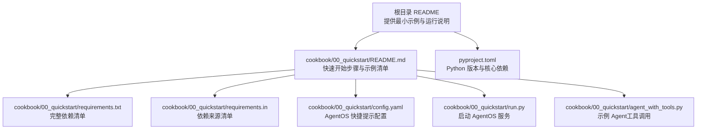
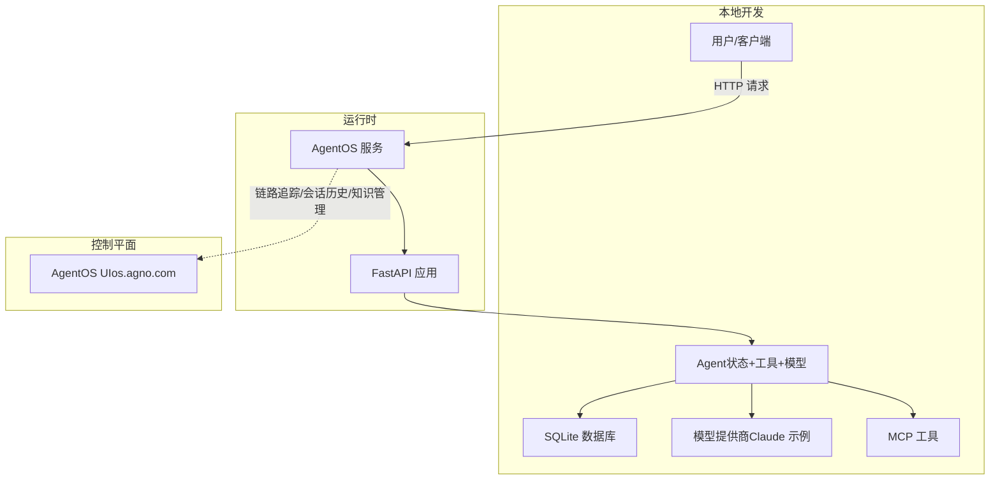
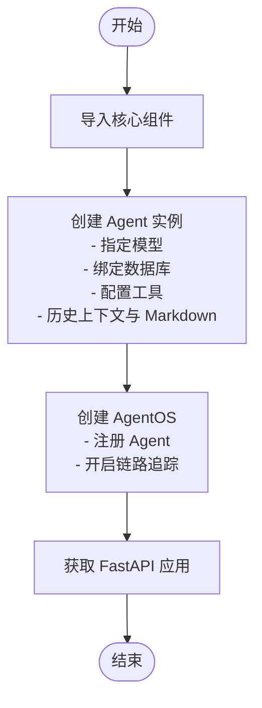
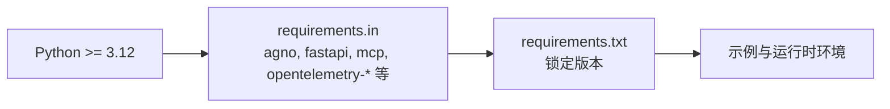
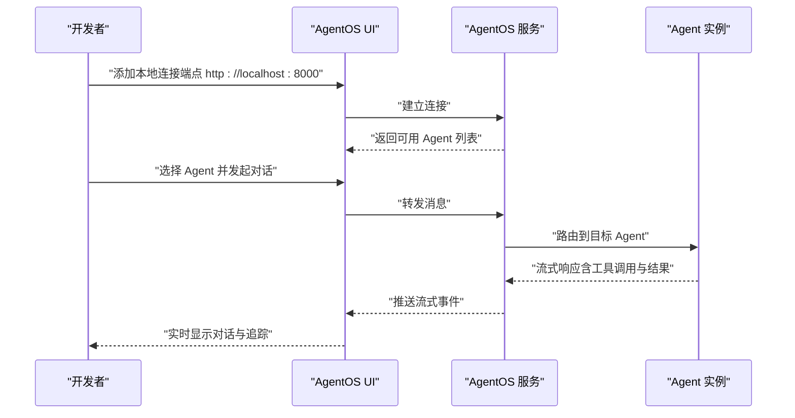

# 快速开始

<cite>
**本文引用的文件**
- [README.md](file://README.md)
- [pyproject.toml](file://pyproject.toml)
- [cookbook/00_quickstart/README.md](file://cookbook/00_quickstart/README.md)
- [cookbook/00_quickstart/config.yaml](file://cookbook/00_quickstart/config.yaml)
- [cookbook/00_quickstart/run.py](file://cookbook/00_quickstart/run.py)
- [cookbook/00_quickstart/agent_with_tools.py](file://cookbook/00_quickstart/agent_with_tools.py)
- [cookbook/00_quickstart/requirements.txt](file://cookbook/00_quickstart/requirements.txt)
- [cookbook/00_quickstart/requirements.in](file://cookbook/00_quickstart/requirements.in)
</cite>

## 目录
1. [简介](#简介)
2. [项目结构](#项目结构)
3. [核心组件](#核心组件)
4. [架构总览](#架构总览)
5. [详细组件解析](#详细组件解析)
6. [依赖关系分析](#依赖关系分析)
7. [性能与可扩展性](#性能与可扩展性)
8. [本地运行与部署](#本地运行与部署)
9. [连接 AgentOS UI 进行监控与管理](#连接-agentos-ui-进行监控与管理)
10. [常见问题排查](#常见问题排查)
11. [结论](#结论)

## 简介
本指南面向希望在最短时间内体验 Agno Learn 核心能力的用户。你将完成环境准备、安装依赖、配置 API 密钥，并通过一个约 20 行的示例程序，创建一个具备状态管理、工具调用能力的 Agent，并将其作为生产级 API 服务对外提供。随后，你将学会如何使用 AgentOS UI 对 Agent 进行监控、调试与管理。

## 项目结构
该仓库采用多模块组织，其中 cookbook/00_quickstart 提供“快速开始”示例，涵盖从单 Agent 到团队与工作流的渐进示例；根目录 README 提供一键式最小示例与运行说明；pyproject.toml 指定最低 Python 版本与核心依赖；requirements.* 文件用于固定依赖版本以便复现。

图表来源
- [README.md:35-98](file://README.md#L35-L98)
- [cookbook/00_quickstart/README.md:38-87](file://cookbook/00_quickstart/README.md#L38-L87)
- [pyproject.toml:1-15](file://pyproject.toml#L1-L15)
- [cookbook/00_quickstart/requirements.txt:1-10](file://cookbook/00_quickstart/requirements.txt#L1-L10)
- [cookbook/00_quickstart/requirements.in:1-15](file://cookbook/00_quickstart/requirements.in#L1-L15)
- [cookbook/00_quickstart/config.yaml:1-57](file://cookbook/00_quickstart/config.yaml#L1-L57)
- [cookbook/00_quickstart/run.py:55-89](file://cookbook/00_quickstart/run.py#L55-L89)
- [cookbook/00_quickstart/agent_with_tools.py:57-76](file://cookbook/00_quickstart/agent_with_tools.py#L57-L76)

章节来源
- [README.md:35-98](file://README.md#L35-L98)
- [cookbook/00_quickstart/README.md:38-87](file://cookbook/00_quickstart/README.md#L38-L87)
- [pyproject.toml:1-15](file://pyproject.toml#L1-L15)

## 核心组件
- 最小示例（约 20 行）：来自根目录 README 的示例，展示如何创建一个具备状态管理、工具调用、Markdown 输出、链路追踪的 Agent，并通过 AgentOS 暴露为生产 API。
- AgentOS：Agno 的运行时与控制平面，提供 Web UI、会话历史、追踪与调试能力。
- 数据库：示例中使用 SQLite 作为持久化存储，支持会话状态、记忆与知识的持久化。
- 工具：示例中使用 MCP 工具，可从外部上下文源拉取信息，增强 Agent 的推理与回答能力。
- 模型：示例中使用 Claude（Anthropic），也可替换为其他模型提供商（如 Gemini、OpenAI 等）。

章节来源
- [README.md:39-58](file://README.md#L39-L58)
- [README.md:72-78](file://README.md#L72-L78)

## 架构总览
下图展示了从 Agent 定义到对外提供 API 的整体流程，以及与 AgentOS UI 的连接关系。

图表来源
- [README.md:39-58](file://README.md#L39-L58)
- [README.md:78-95](file://README.md#L78-L95)
- [cookbook/00_quickstart/run.py:63-82](file://cookbook/00_quickstart/run.py#L63-L82)

## 详细组件解析
本节围绕“最小示例”的 20 行代码逐行解析其职责与影响，帮助初学者快速理解每个配置项的作用。

- 第 1 行：导入 Agent、SqliteDb、Claude、AgentOS、MCPTools。
- 第 2-5 行：创建 Agent 实例，指定名称、模型、数据库、工具列表。
  - 模型：Claude（示例中使用具体模型 ID）。
  - 数据库：SqliteDb（文件名可自定义，默认示例为本地文件）。
  - 工具：MCPTools（指向 Agno MCP 服务器，用于检索上下文）。
  - 上下文：开启历史上下文注入，并限制最近 N 轮历史参与推理。
  - 输出：启用 Markdown 渲染。
- 第 6 行：创建 AgentOS，注册该 Agent，并开启链路追踪。
- 第 7 行：从 AgentOS 获取 FastAPI 应用实例。

图表来源
- [README.md:39-58](file://README.md#L39-L58)

章节来源
- [README.md:39-58](file://README.md#L39-L58)

## 依赖关系分析
- Python 版本：要求 Python >= 3.12。
- 核心依赖：agno（主框架）、fastapi（运行时）、mcp（工具集成）、opentelemetry-*（链路追踪）、pgvector、sqlalchemy、psycopg 等（可选存储与向量能力）。
- 示例依赖：yfinance、google-genai、chromadb 等（示例 Agent 使用）。

图表来源
- [pyproject.toml:5-8](file://pyproject.toml#L5-L8)
- [cookbook/00_quickstart/requirements.in:1-15](file://cookbook/00_quickstart/requirements.in#L1-L15)
- [cookbook/00_quickstart/requirements.txt:1-10](file://cookbook/00_quickstart/requirements.txt#L1-L10)

章节来源
- [pyproject.toml:1-15](file://pyproject.toml#L1-L15)
- [cookbook/00_quickstart/requirements.in:1-15](file://cookbook/00_quickstart/requirements.in#L1-L15)
- [cookbook/00_quickstart/requirements.txt:1-10](file://cookbook/00_quickstart/requirements.txt#L1-L10)

## 性能与可扩展性
- 无状态、会话级作用域：AgentOS 以 FastAPI 为基础，支持无状态与可扩展的运行模式。
- 链路追踪与审计：内置 OpenTelemetry 支持，便于在生产中进行性能与行为分析。
- 存储与知识：可选多种存储后端（如 SQLite、PostgreSQL、向量数据库），满足不同规模的数据需求。
- 模型替换：示例中使用 Claude，可无缝切换至其他模型提供商，保持一致的 API 与行为。

[本节为通用指导，不直接分析特定文件]

## 本地运行与部署
以下命令基于根目录 README 中的示例，展示如何使用 uvx 与 fastapi dev 在本地快速启动服务。

- 设置模型 API 密钥（示例使用 Anthropic）：
  - export ANTHROPIC_API_KEY=your-anthropic-key
- 使用 uvx 与 fastapi dev 启动：
  - uvx --python 3.12 --with "agno[os]" --with anthropic --with mcp fastapi dev agno_assist.py

说明
- uvx：无需虚拟环境即可临时安装依赖并运行。
- fastapi dev：热重载开发模式，适合本地调试。
- 端口：默认监听本地端口，可在 AgentOS UI 中配置或通过 AgentOS 服务端口访问。

章节来源
- [README.md:60-70](file://README.md#L60-L70)

## 连接 AgentOS UI 进行监控与管理
- 登录 https://os.agno.com 并新建一个本地连接。
- 选择“Local”，输入本地 AgentOS 端点（默认 http://localhost:8000）并命名为“Local AgentOS”。
- 连接成功后，可在 UI 中：
  - 与 Agent 进行对话
  - 查看会话历史
  - 监控链路追踪
  - 管理知识库与记忆
  - 切换不同的 Agent、团队与工作流

图表来源
- [README.md:78-95](file://README.md#L78-L95)

章节来源
- [README.md:78-95](file://README.md#L78-L95)

## 常见问题排查
- Python 版本不符
  - 现象：安装失败或运行时报错。
  - 处理：确保使用 Python >= 3.12。
- API 密钥未设置
  - 现象：调用模型时返回鉴权错误。
  - 处理：根据所选模型提供商设置对应 API 密钥（示例中为 ANTHROPIC_API_KEY）。
- 依赖缺失或版本冲突
  - 现象：导入模块报错或运行时异常。
  - 处理：使用 requirements.txt 固定版本安装，或参考示例中的依赖清单进行安装。
- 端口占用
  - 现象：fastapi dev 或 AgentOS 无法绑定端口。
  - 处理：更换端口或释放占用端口。
- 数据库文件权限
  - 现象：SQLite 写入失败。
  - 处理：确认当前用户对数据库文件所在目录具有读写权限。

章节来源
- [pyproject.toml:5-8](file://pyproject.toml#L5-L8)
- [cookbook/00_quickstart/requirements.txt:1-10](file://cookbook/00_quickstart/requirements.txt#L1-L10)
- [README.md:60-70](file://README.md#L60-L70)

## 结论
通过本指南，你已完成了从环境准备、依赖安装、API 密钥配置，到创建并运行一个具备状态管理与工具调用能力的 Agent，并将其作为生产 API 提供服务。配合 AgentOS UI，你可以轻松地进行监控、调试与管理。建议在掌握基础后，逐步探索更多示例（如知识库、记忆、护栏、人机协作等），以构建更复杂的智能体系统。