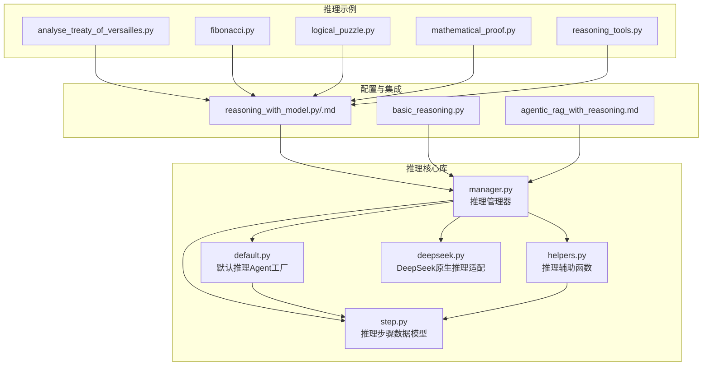
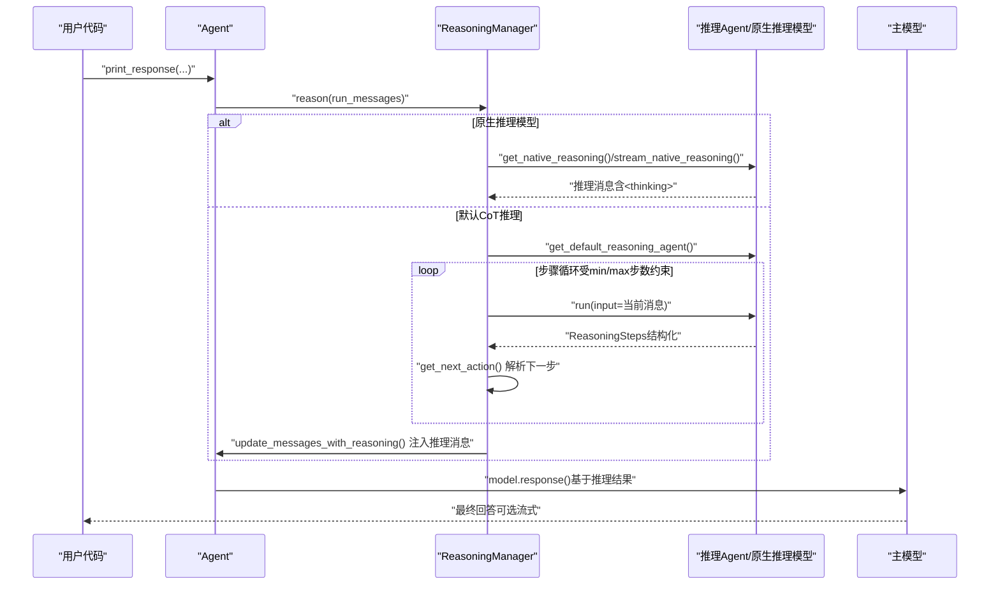
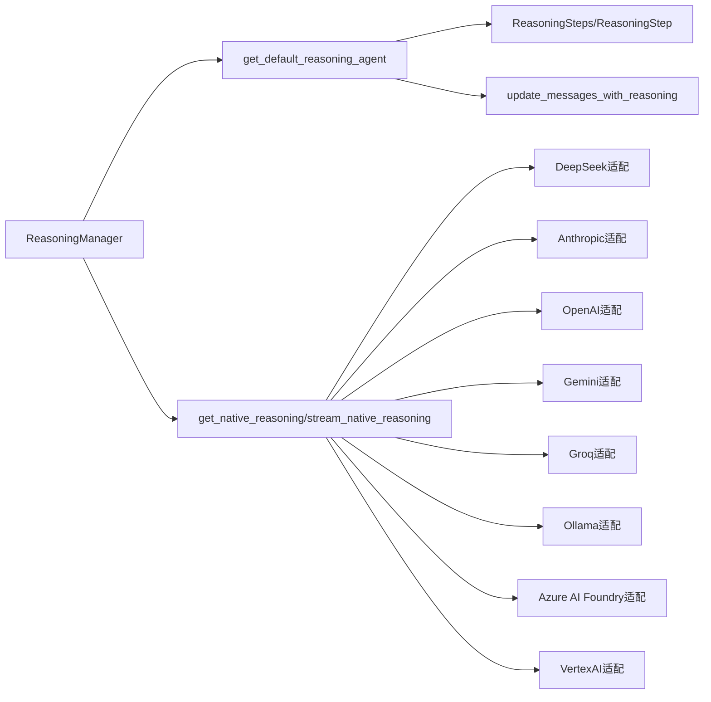

# 代理推理

<cite>
**本文引用的文件**
- [libs/agno/agno/reasoning/manager.py](file://libs/agno/agno/reasoning/manager.py)
- [libs/agno/agno/reasoning/default.py](file://libs/agno/agno/reasoning/default.py)
- [libs/agno/agno/reasoning/step.py](file://libs/agno/agno/reasoning/step.py)
- [libs/agno/agno/reasoning/helpers.py](file://libs/agno/agno/reasoning/helpers.py)
- [libs/agno/agno/reasoning/deepseek.py](file://libs/agno/agno/reasoning/deepseek.py)
- [cookbook/10_reasoning/agents/analyse_treaty_of_versailles.py](file://cookbook/10_reasoning/agents/analyse_treaty_of_versailles.py)
- [cookbook/10_reasoning/agents/fibonacci.py](file://cookbook/10_reasoning/agents/fibonacci.py)
- [cookbook/10_reasoning/agents/logical_puzzle.py](file://cookbook/10_reasoning/agents/logical_puzzle.py)
- [cookbook/10_reasoning/agents/mathematical_proof.py](file://cookbook/10_reasoning/agents/mathematical_proof.py)
- [cookbook/10_reasoning/tools/reasoning_tools.py](file://cookbook/10_reasoning/tools/reasoning_tools.py)
- [cookbook/02_agents/13_reasoning/basic_reasoning.py](file://cookbook/02_agents/13_reasoning/basic_reasoning.py)
- [cookbook/02_agents/13_reasoning/reasoning_with_model.py](file://cookbook/02_agents/13_reasoning/reasoning_with_model.py)
- [cookbook/02_agents/13_reasoning/reasoning_with_model.md](file://cookbook/02_agents/13_reasoning/reasoning_with_model.md)
- [cookbook/02_agents/07_knowledge/agentic_rag_with_reasoning.md](file://cookbook/02_agents/07_knowledge/agentic_rag_with_reasoning.md)
</cite>

## 目录
1. [简介](#简介)
2. [项目结构](#项目结构)
3. [核心组件](#核心组件)
4. [架构总览](#架构总览)
5. [详细组件分析](#详细组件分析)
6. [依赖关系分析](#依赖关系分析)
7. [性能考量](#性能考量)
8. [故障排查指南](#故障排查指南)
9. [结论](#结论)
10. [附录](#附录)

## 简介
本章节面向希望在代理系统中引入并优化“推理能力”的开发者，系统讲解单个代理的思维链（Chain of Thought, CoT）推理实现机制、推理流程与优化策略，并结合多个经典推理案例（如《凡尔赛条约分析》、斐波那契数列求解、逻辑谜题解答、数学证明等）说明如何配置与优化代理的推理能力。内容覆盖提示工程、上下文管理、工具调用、事件流与消息注入等关键技术点，并提供可直接参考的代码示例路径与最佳实践。

## 项目结构
围绕“代理推理”主题，仓库中与推理相关的关键目录与文件如下：
- 推理核心库（libs/agno/agno/reasoning/*）：推理管理器、默认推理Agent、推理步骤数据模型、辅助工具与特定模型适配（如DeepSeek）。
- 推理示例（cookbook/10_reasoning/*）：涵盖历史分析、数学证明、逻辑谜题、斐波那契脚本规划、推理工具等多样化案例。
- 推理配置与集成示例（cookbook/02_agents/13_reasoning/*）：展示原生推理模型与默认CoT推理的差异、以及与知识检索的组合。

**图表来源**
- [libs/agno/agno/reasoning/manager.py](file://libs/agno/agno/reasoning/manager.py)
- [libs/agno/agno/reasoning/default.py](file://libs/agno/agno/reasoning/default.py)
- [libs/agno/agno/reasoning/step.py](file://libs/agno/agno/reasoning/step.py)
- [libs/agno/agno/reasoning/helpers.py](file://libs/agno/agno/reasoning/helpers.py)
- [libs/agno/agno/reasoning/deepseek.py](file://libs/agno/agno/reasoning/deepseek.py)
- [cookbook/10_reasoning/agents/analyse_treaty_of_versailles.py](file://cookbook/10_reasoning/agents/analyse_treaty_of_versailles.py)
- [cookbook/10_reasoning/agents/fibonacci.py](file://cookbook/10_reasoning/agents/fibonacci.py)
- [cookbook/10_reasoning/agents/logical_puzzle.py](file://cookbook/10_reasoning/agents/logical_puzzle.py)
- [cookbook/10_reasoning/agents/mathematical_proof.py](file://cookbook/10_reasoning/agents/mathematical_proof.py)
- [cookbook/10_reasoning/tools/reasoning_tools.py](file://cookbook/10_reasoning/tools/reasoning_tools.py)
- [cookbook/02_agents/13_reasoning/basic_reasoning.py](file://cookbook/02_agents/13_reasoning/basic_reasoning.py)
- [cookbook/02_agents/13_reasoning/reasoning_with_model.py](file://cookbook/02_agents/13_reasoning/reasoning_with_model.py)
- [cookbook/02_agents/07_knowledge/agentic_rag_with_reasoning.md](file://cookbook/02_agents/07_knowledge/agentic_rag_with_reasoning.md)

**章节来源**
- [libs/agno/agno/reasoning/manager.py](file://libs/agno/agno/reasoning/manager.py)
- [libs/agno/agno/reasoning/default.py](file://libs/agno/agno/reasoning/default.py)
- [libs/agno/agno/reasoning/step.py](file://libs/agno/agno/reasoning/step.py)
- [libs/agno/agno/reasoning/helpers.py](file://libs/agno/agno/reasoning/helpers.py)
- [libs/agno/agno/reasoning/deepseek.py](file://libs/agno/agno/reasoning/deepseek.py)
- [cookbook/10_reasoning/agents/analyse_treaty_of_versailles.py](file://cookbook/10_reasoning/agents/analyse_treaty_of_versailles.py)
- [cookbook/10_reasoning/agents/fibonacci.py](file://cookbook/10_reasoning/agents/fibonacci.py)
- [cookbook/10_reasoning/agents/logical_puzzle.py](file://cookbook/10_reasoning/agents/logical_puzzle.py)
- [cookbook/10_reasoning/agents/mathematical_proof.py](file://cookbook/10_reasoning/agents/mathematical_proof.py)
- [cookbook/10_reasoning/tools/reasoning_tools.py](file://cookbook/10_reasoning/tools/reasoning_tools.py)
- [cookbook/02_agents/13_reasoning/basic_reasoning.py](file://cookbook/02_agents/13_reasoning/basic_reasoning.py)
- [cookbook/02_agents/13_reasoning/reasoning_with_model.py](file://cookbook/02_agents/13_reasoning/reasoning_with_model.py)
- [cookbook/02_agents/07_knowledge/agentic_rag_with_reasoning.md](file://cookbook/02_agents/07_knowledge/agentic_rag_with_reasoning.md)

## 核心组件
- 推理管理器（ReasoningManager）
  - 负责统一处理原生推理模型与默认CoT推理，支持同步与异步、流式与非流式推理。
  - 支持多种原生推理模型（如DeepSeek、Anthropic、OpenAI、Gemini、Groq、Ollama、Azure AI Foundry、VertexAI等）检测与路由。
  - 提供默认CoT推理Agent的创建与迭代推理循环，支持最小/最大步数约束、工具调用、结构化输出等。
- 默认推理Agent工厂（get_default_reasoning_agent）
  - 以结构化输出（ReasoningSteps）为核心，提供“问题分析—分解—意图澄清—执行计划—验证—最终答案”的六步指令模板。
  - 可注入工具、限制步数、JSON模式输出、调试与遥测等参数。
- 推理步骤数据模型（ReasoningStep/ReasoningSteps）
  - 定义推理步骤的字段：标题、行动、结果、推理过程、下一步动作（continue/validate/final_answer/reset）、置信度。
- 辅助工具（helpers）
  - 提供“下一步动作”解析与“将推理消息注入主消息流”的方法，确保主模型能基于推理结果生成最终回答。
- 原生推理模型适配（如DeepSeek）
  - 提供原生推理的非流式与流式接口，支持将推理内容包裹为<thinking>标签并注入消息。

**章节来源**
- [libs/agno/agno/reasoning/manager.py](file://libs/agno/agno/reasoning/manager.py)
- [libs/agno/agno/reasoning/default.py](file://libs/agno/agno/reasoning/default.py)
- [libs/agno/agno/reasoning/step.py](file://libs/agno/agno/reasoning/step.py)
- [libs/agno/agno/reasoning/helpers.py](file://libs/agno/agno/reasoning/helpers.py)
- [libs/agno/agno/reasoning/deepseek.py](file://libs/agno/agno/reasoning/deepseek.py)

## 架构总览
下图展示了“原生推理模型 vs 默认CoT推理”的统一入口与关键流程，以及与主模型回答阶段的衔接。

**图表来源**
- [libs/agno/agno/reasoning/manager.py](file://libs/agno/agno/reasoning/manager.py)
- [libs/agno/agno/reasoning/default.py](file://libs/agno/agno/reasoning/default.py)
- [libs/agno/agno/reasoning/helpers.py](file://libs/agno/agno/reasoning/helpers.py)
- [libs/agno/agno/reasoning/deepseek.py](file://libs/agno/agno/reasoning/deepseek.py)

## 详细组件分析

### 思维链（CoT）构建机制
- 指令模板与结构化输出
  - 默认推理Agent采用“六步法”指令模板，强制输出ReasoningSteps结构，确保每一步包含标题、行动、结果、推理过程、下一步动作与置信度。
  - 该模板既适用于复杂问题分解，也便于后续验证与最终答案生成。
- 步数控制与终止条件
  - 通过最小/最大步数限制，避免无限循环；同时根据最后一步的“下一步动作”决定是否继续或结束。
- 工具与上下文
  - 默认推理Agent可复用主Agent的工具集，便于在推理过程中进行查询、计算或外部验证。
  - 上下文通过消息注入与过渡消息实现，确保主模型在最终回答阶段聚焦于推理结果而非重复执行工具。

**章节来源**
- [libs/agno/agno/reasoning/default.py](file://libs/agno/agno/reasoning/default.py)
- [libs/agno/agno/reasoning/step.py](file://libs/agno/agno/reasoning/step.py)
- [libs/agno/agno/reasoning/helpers.py](file://libs/agno/agno/reasoning/helpers.py)

### 推理过程的分析与优化策略
- 分步验证与回退
  - 在每一步中明确“必要性、考虑因素、进展、假设”，并在最终阶段进行交叉验证，必要时重置分析。
- 置信度评分
  - 为每一步提供0~1的置信度，便于在多方案比较时做出稳健决策。
- 事件与流式输出
  - 支持事件驱动的流式推理，便于前端实时展示推理过程；同时保留最终聚合结果。
- 消息注入与去持久化
  - 推理消息标记为不进入记忆，仅用于引导主模型生成最终回答，降低上下文污染与成本。

**章节来源**
- [libs/agno/agno/reasoning/manager.py](file://libs/agno/agno/reasoning/manager.py)
- [libs/agno/agno/reasoning/helpers.py](file://libs/agno/agno/reasoning/helpers.py)

### 经典推理案例实现

#### 《凡尔赛条约分析》
- 场景说明
  - 使用内置CoT与外部推理模型（DeepSeek）分别对历史分析任务进行推理，对比推理质量与成本。
- 关键配置
  - reasoning=True 或 reasoning_model=DeepSeek，Markdown格式化输出，展示完整推理过程。
- 示例路径
  - [analyse_treaty_of_versailles.py](file://cookbook/10_reasoning/agents/analyse_treaty_of_versailles.py)

**章节来源**
- [cookbook/10_reasoning/agents/analyse_treaty_of_versailles.py](file://cookbook/10_reasoning/agents/analyse_treaty_of_versailles.py)

#### 斐波那契数列求解
- 场景说明
  - 通过内置CoT与外部推理模型生成Python脚本的规划步骤，强调“问题分解—策略制定—执行计划—验证”的完整流程。
- 示例路径
  - [fibonacci.py](file://cookbook/10_reasoning/agents/fibonacci.py)

**章节来源**
- [cookbook/10_reasoning/agents/fibonacci.py](file://cookbook/10_reasoning/agents/fibonacci.py)

#### 逻辑谜题解答
- 场景说明
  - 以经典的“传教士与食人族”谜题为例，演示推理Agent如何在受限条件下进行状态空间探索与安全路径规划。
- 示例路径
  - [logical_puzzle.py](file://cookbook/10_reasoning/agents/logical_puzzle.py)

**章节来源**
- [cookbook/10_reasoning/agents/logical_puzzle.py](file://cookbook/10_reasoning/agents/logical_puzzle.py)

#### 数学证明
- 场景说明
  - 对数学命题进行系统性证明，对比内置CoT与专用推理模型（DeepSeek）在证明深度与严谨性上的差异。
- 示例路径
  - [mathematical_proof.py](file://cookbook/10_reasoning/agents/mathematical_proof.py)

**章节来源**
- [cookbook/10_reasoning/agents/mathematical_proof.py](file://cookbook/10_reasoning/agents/mathematical_proof.py)

### 推理工具与提示工程
- ReasoningTools
  - 提供显式的思考与分析工具，结合自定义指令，帮助代理在复杂问题上形成结构化思路。
- 提示工程要点
  - 明确拆解步骤、假设与边界条件，量化不确定性与数据可靠性，鼓励多视角评估与权衡。
- 示例路径
  - [reasoning_tools.py](file://cookbook/10_reasoning/tools/reasoning_tools.py)

**章节来源**
- [cookbook/10_reasoning/tools/reasoning_tools.py](file://cookbook/10_reasoning/tools/reasoning_tools.py)

### 原生推理模型与默认CoT的对比
- 原生推理（如DeepSeek）
  - 通过<thinking>包裹推理内容，适合专用推理模型；支持流式与非流式两种模式。
- 默认CoT推理
  - 使用ReasoningSteps结构化输出，严格受min/max步数约束，适合通用主模型的推理阶段。
- 示例路径
  - [basic_reasoning.py](file://cookbook/02_agents/13_reasoning/basic_reasoning.py)
  - [reasoning_with_model.py](file://cookbook/02_agents/13_reasoning/reasoning_with_model.py)
  - [reasoning_with_model.md](file://cookbook/02_agents/13_reasoning/reasoning_with_model.md)

**章节来源**
- [cookbook/02_agents/13_reasoning/basic_reasoning.py](file://cookbook/02_agents/13_reasoning/basic_reasoning.py)
- [cookbook/02_agents/13_reasoning/reasoning_with_model.py](file://cookbook/02_agents/13_reasoning/reasoning_with_model.py)
- [cookbook/02_agents/13_reasoning/reasoning_with_model.md](file://cookbook/02_agents/13_reasoning/reasoning_with_model.md)

### 与知识检索的融合
- 架构要点
  - 将ReasoningTools与知识搜索工具结合，形成“思考—检索—分析—总结”的闭环，提升复杂问题的可解释性与准确性。
- 示例路径
  - [agentic_rag_with_reasoning.md](file://cookbook/02_agents/07_knowledge/agentic_rag_with_reasoning.md)

**章节来源**
- [cookbook/02_agents/07_knowledge/agentic_rag_with_reasoning.md](file://cookbook/02_agents/07_knowledge/agentic_rag_with_reasoning.md)

## 依赖关系分析
- ReasoningManager
  - 依赖推理Agent工厂、推理步骤模型、辅助函数与各原生推理模型适配模块。
  - 通过模型类型检测选择原生推理或默认CoT路径。
- 默认推理Agent
  - 依赖ReasoningSteps输出Schema，可选工具与上下文注入。
- 原生推理模型适配
  - 以模型类名与ID特征识别推理模型，封装推理调用与事件流。

**图表来源**
- [libs/agno/agno/reasoning/manager.py](file://libs/agno/agno/reasoning/manager.py)
- [libs/agno/agno/reasoning/default.py](file://libs/agno/agno/reasoning/default.py)
- [libs/agno/agno/reasoning/step.py](file://libs/agno/agno/reasoning/step.py)
- [libs/agno/agno/reasoning/helpers.py](file://libs/agno/agno/reasoning/helpers.py)
- [libs/agno/agno/reasoning/deepseek.py](file://libs/agno/agno/reasoning/deepseek.py)

**章节来源**
- [libs/agno/agno/reasoning/manager.py](file://libs/agno/agno/reasoning/manager.py)
- [libs/agno/agno/reasoning/default.py](file://libs/agno/agno/reasoning/default.py)
- [libs/agno/agno/reasoning/step.py](file://libs/agno/agno/reasoning/step.py)
- [libs/agno/agno/reasoning/helpers.py](file://libs/agno/agno/reasoning/helpers.py)
- [libs/agno/agno/reasoning/deepseek.py](file://libs/agno/agno/reasoning/deepseek.py)

## 性能考量
- 模型选择与成本
  - 原生推理模型通常在推理阶段一次性完成，适合强推理任务；默认CoT推理可将推理与回答阶段分离，使用轻量推理模型以降低成本。
- 步数限制与收敛速度
  - 通过合理设置min/max步数，平衡推理深度与响应时间；在达到验证阶段后尽早终止可减少无效迭代。
- 流式输出与事件处理
  - 流式推理可提前感知中间结果，但需注意事件合并与错误恢复的成本。
- 上下文注入与消息清理
  - 将推理消息标记为不持久化，避免上下文膨胀；通过过渡消息引导主模型聚焦最终回答。

[本节为通用指导，无需具体文件分析]

## 故障排查指南
- 推理Agent为空或输出Schema不匹配
  - 若推理Agent未正确创建或输出Schema不是ReasoningSteps，推理流程会直接失败并返回错误信息。
- 原生推理模型未识别
  - 当reasoning_model非原生推理模型时，系统会退化为默认CoT推理；若检测失败，需检查模型类名与ID特征。
- 推理消息未注入或丢失
  - 确认update_messages_with_reasoning是否被调用，以及推理消息的add_to_agent_memory标志是否正确设置。
- 流式推理中断
  - 检查事件流中reasoning_content与最终消息的触发条件，确保异常被捕获并返回错误结果。

**章节来源**
- [libs/agno/agno/reasoning/manager.py](file://libs/agno/agno/reasoning/manager.py)
- [libs/agno/agno/reasoning/helpers.py](file://libs/agno/agno/reasoning/helpers.py)

## 结论
通过统一的推理管理器与默认CoT推理Agent，代理系统能够在不同场景下灵活选择推理路径：对于强推理任务可采用原生推理模型，对于通用任务可采用结构化CoT推理。配合提示工程、工具调用、上下文管理与事件流，开发者可以构建可解释、可验证、可扩展的代理推理能力，并在成本与质量之间取得平衡。

[本节为总结，无需具体文件分析]

## 附录

### 配置与优化清单
- 推理开关与模型
  - reasoning=True / reasoning_model=XXX
- 步数约束
  - reasoning_min_steps / reasoning_max_steps
- 输出与格式
  - output_schema=ReasoningSteps / use_json_mode / markdown
- 工具与上下文
  - tools / add_datetime_to_context / add_name_to_context
- 事件与流式
  - stream_events / show_full_reasoning

**章节来源**
- [libs/agno/agno/reasoning/default.py](file://libs/agno/agno/reasoning/default.py)
- [libs/agno/agno/reasoning/manager.py](file://libs/agno/agno/reasoning/manager.py)
- [cookbook/02_agents/13_reasoning/reasoning_with_model.md](file://cookbook/02_agents/13_reasoning/reasoning_with_model.md)