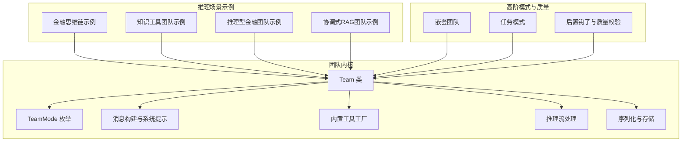
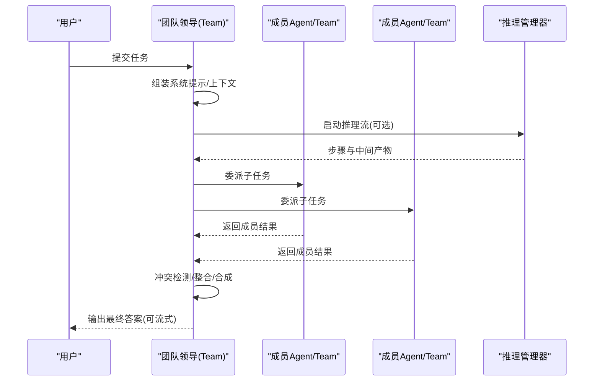
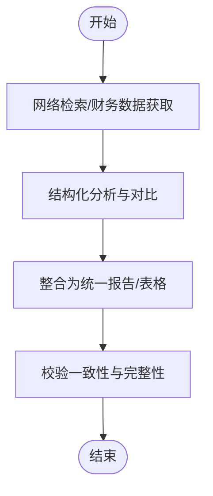
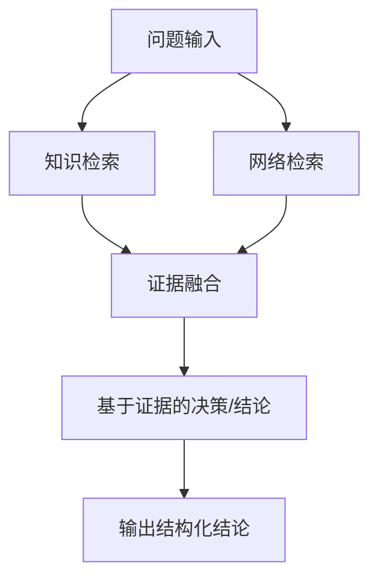
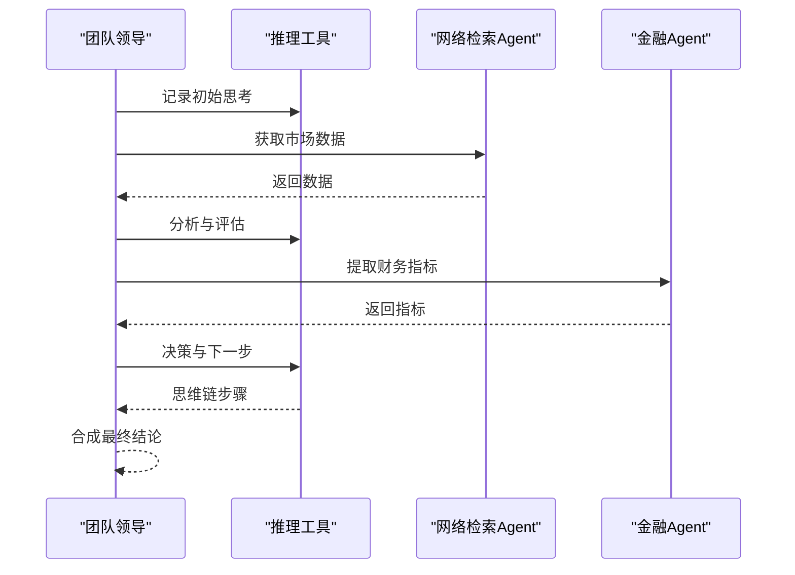
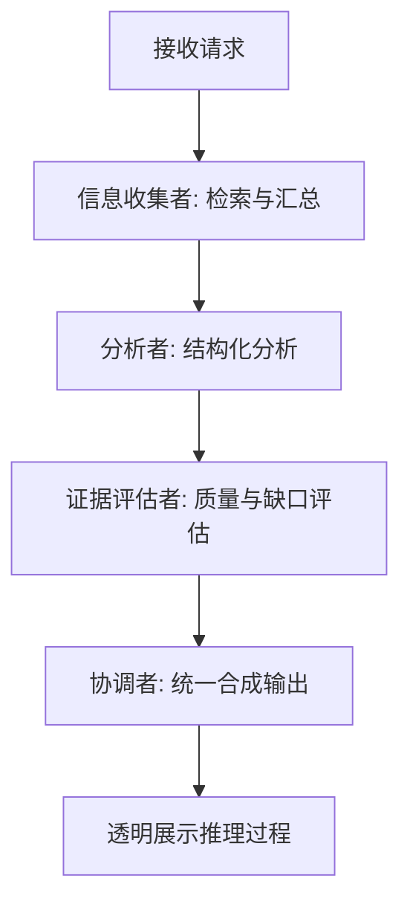
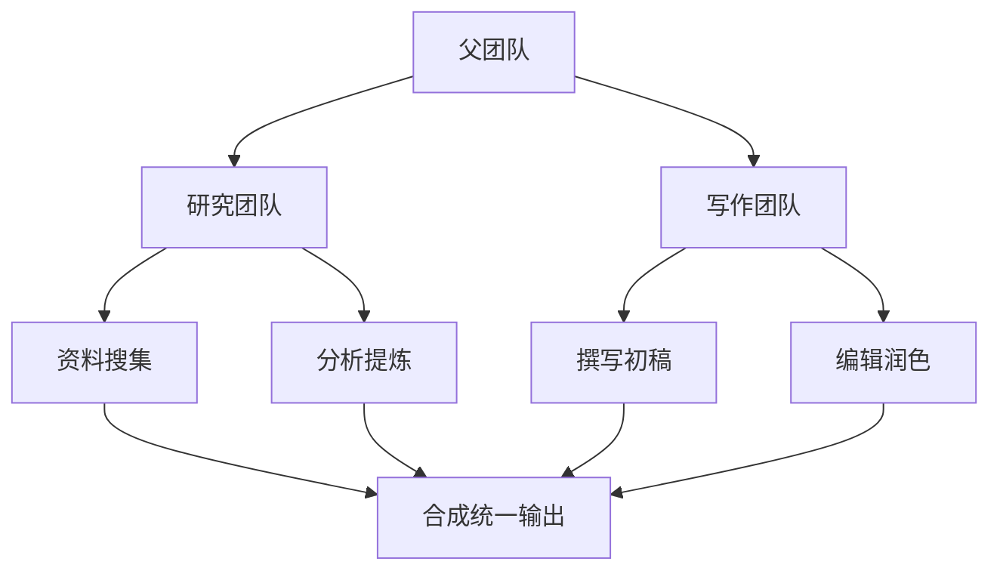
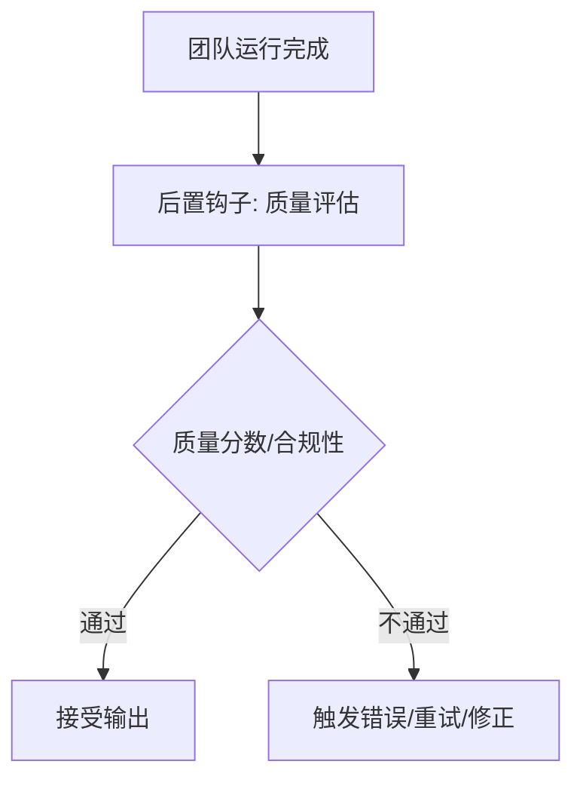
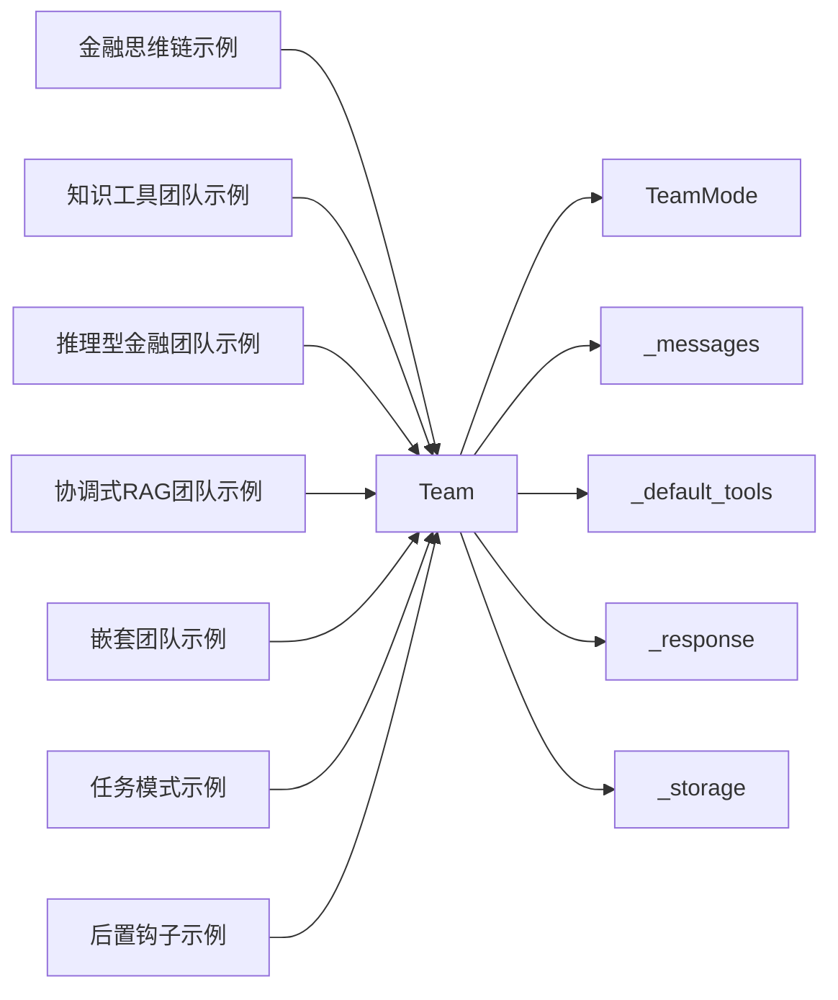

# 团队推理

<cite>
**本文引用的文件**
- [cookbook/10_reasoning/teams/finance_team_chain_of_thought.py](file://cookbook/10_reasoning/teams/finance_team_chain_of_thought.py)
- [cookbook/10_reasoning/teams/knowledge_tool_team.py](file://cookbook/10_reasoning/teams/knowledge_tool_team.py)
- [cookbook/10_reasoning/teams/reasoning_finance_team.py](file://cookbook/10_reasoning/teams/reasoning_finance_team.py)
- [libs/agno/agno/team/team.py](file://libs/agno/agno/team/team.py)
- [libs/agno/agno/team/mode.py](file://libs/agno/agno/team/mode.py)
- [libs/agno/agno/team/_messages.py](file://libs/agno/agno/team/_messages.py)
- [libs/agno/agno/team/_default_tools.py](file://libs/agno/agno/team/_default_tools.py)
- [libs/agno/agno/team/_response.py](file://libs/agno/agno/team/_response.py)
- [libs/agno/agno/team/_storage.py](file://libs/agno/agno/team/_storage.py)
- [cookbook/03_teams/01_quickstart/nested_teams.py](file://cookbook/03_teams/01_quickstart/nested_teams.py)
- [cookbook/03_teams/02_modes/tasks/10_multi_run_session.py](file://cookbook/03_teams/02_modes/tasks/10_multi_run_session.py)
- [cookbook/03_teams/13_hooks/post_hook_output.py](file://cookbook/03_teams/13_hooks/post_hook_output.py)
- [cookbook/10_reasoning/tools/reasoning_tools.md](file://cookbook/10_reasoning/tools/reasoning_tools.md)
- [libs/agno/tests/unit/team/test_team_config.py](file://libs/agno/tests/unit/team/test_team_config.py)
- [cookbook/03_teams/16_search_coordination/02_coordinated_reasoning_rag.py](file://cookbook/03_teams/16_search_coordination/02_coordinated_reasoning_rag.py)
- [cookbook/93_components/get_team.md](file://cookbook/93_components/get_team.md)
</cite>

## 目录
1. [简介](#简介)
2. [项目结构](#项目结构)
3. [核心组件](#核心组件)
4. [架构总览](#架构总览)
5. [详细组件分析](#详细组件分析)
6. [依赖分析](#依赖分析)
7. [性能考虑](#性能考虑)
8. [故障排查指南](#故障排查指南)
9. [结论](#结论)
10. [附录](#附录)

## 简介
本文件面向“团队推理”能力，系统阐述多代理团队的协同推理机制与工程化落地方法。内容覆盖团队成员间的推理协调、决策融合与推理质量保证；聚焦金融团队思维链推理、知识工具团队推理、推理型金融团队等典型场景；给出架构设计要点（任务分配、信息共享、冲突解决、结果整合）、参数与策略配置（推理模式、成员角色、沟通协议）、最佳实践与性能优化建议。

## 项目结构
围绕团队推理，仓库中与之直接相关的关键模块与示例包括：
- 团队内核与运行时：Team 类、模式枚举、消息构建、默认工具、推理流处理、序列化存储
- 典型推理场景示例：金融思维链、知识工具团队、推理型金融团队
- 高阶模式与协作：嵌套团队、任务模式、钩子与质量校验
- 配置与持久化：Team 的序列化与版本化加载

图表来源
- [libs/agno/agno/team/team.py](file://libs/agno/agno/team/team.py)
- [libs/agno/agno/team/mode.py](file://libs/agno/agno/team/mode.py)
- [libs/agno/agno/team/_messages.py](file://libs/agno/agno/team/_messages.py)
- [libs/agno/agno/team/_default_tools.py](file://libs/agno/agno/team/_default_tools.py)
- [libs/agno/agno/team/_response.py](file://libs/agno/agno/team/_response.py)
- [libs/agno/agno/team/_storage.py](file://libs/agno/agno/team/_storage.py)
- [cookbook/10_reasoning/teams/finance_team_chain_of_thought.py](file://cookbook/10_reasoning/teams/finance_team_chain_of_thought.py)
- [cookbook/10_reasoning/teams/knowledge_tool_team.py](file://cookbook/10_reasoning/teams/knowledge_tool_team.py)
- [cookbook/10_reasoning/teams/reasoning_finance_team.py](file://cookbook/10_reasoning/teams/reasoning_finance_team.py)
- [cookbook/03_teams/01_quickstart/nested_teams.py](file://cookbook/03_teams/01_quickstart/nested_teams.py)
- [cookbook/03_teams/02_modes/tasks/10_multi_run_session.py](file://cookbook/03_teams/02_modes/tasks/10_multi_run_session.py)
- [cookbook/03_teams/13_hooks/post_hook_output.py](file://cookbook/03_teams/13_hooks/post_hook_output.py)

章节来源
- [libs/agno/agno/team/team.py](file://libs/agno/agno/team/team.py)
- [libs/agno/agno/team/mode.py](file://libs/agno/agno/team/mode.py)
- [libs/agno/agno/team/_messages.py](file://libs/agno/agno/team/_messages.py)
- [libs/agno/agno/team/_default_tools.py](file://libs/agno/agno/team/_default_tools.py)
- [libs/agno/agno/team/_response.py](file://libs/agno/agno/team/_response.py)
- [libs/agno/agno/team/_storage.py](file://libs/agno/agno/team/_storage.py)

## 核心组件
- Team 类：团队容器，承载成员、模式、工具、上下文、会话状态、推理配置、流式与事件控制等。支持协调、路由、广播、任务四种模式，并可启用推理流。
- TeamMode 枚举：定义团队执行模式，决定任务委派与合成策略。
- 消息构建器：负责组装系统提示，包含团队成员清单、模式指令、身份描述、附加信息、工具说明、知识检索提示、记忆与会话摘要等。
- 内置工具工厂：提供委派任务、查询历史、会话检索、更新会话状态等工具，支撑团队协作与上下文传递。
- 推理流处理：封装统一的推理管理器，支持原生推理模型与通用思维链，按步生成与迭代，最终回传给团队主模型进行合成。
- 存储与序列化：将团队配置、成员引用、模式与执行参数序列化，支持版本化加载与跨组件链接。

章节来源
- [libs/agno/agno/team/team.py](file://libs/agno/agno/team/team.py)
- [libs/agno/agno/team/mode.py](file://libs/agno/agno/team/mode.py)
- [libs/agno/agno/team/_messages.py](file://libs/agno/agno/team/_messages.py)
- [libs/agno/agno/team/_default_tools.py](file://libs/agno/agno/team/_default_tools.py)
- [libs/agno/agno/team/_response.py](file://libs/agno/agno/team/_response.py)
- [libs/agno/agno/team/_storage.py](file://libs/agno/agno/team/_storage.py)

## 架构总览
团队推理的整体架构由“领导模型 + 成员模型 + 推理引擎 + 工具与上下文”构成。领导模型根据模式与任务动态委派、收集与合成成员输出；推理引擎贯穿整个流程，确保每一步都有清晰的思维轨迹与可验证的中间产物。

图表来源
- [libs/agno/agno/team/team.py](file://libs/agno/agno/team/team.py)
- [libs/agno/agno/team/_messages.py](file://libs/agno/agno/team/_messages.py)
- [libs/agno/agno/team/_default_tools.py](file://libs/agno/agno/team/_default_tools.py)
- [libs/agno/agno/team/_response.py](file://libs/agno/agno/team/_response.py)

## 详细组件分析

### 金融团队思维链推理
该场景强调“先检索—再分析—后合成”的结构化思维链，结合金融数据与表格化呈现要求，提升专业性与可解释性。

图表来源
- [cookbook/10_reasoning/teams/finance_team_chain_of_thought.py](file://cookbook/10_reasoning/teams/finance_team_chain_of_thought.py)

章节来源
- [cookbook/10_reasoning/teams/finance_team_chain_of_thought.py](file://cookbook/10_reasoning/teams/finance_team_chain_of_thought.py)

### 知识工具团队推理
该场景以“知识检索 + 多专家视角”为核心，通过知识工具与网络检索，形成多源证据的综合判断。

图表来源
- [cookbook/10_reasoning/teams/knowledge_tool_team.py](file://cookbook/10_reasoning/teams/knowledge_tool_team.py)

章节来源
- [cookbook/10_reasoning/teams/knowledge_tool_team.py](file://cookbook/10_reasoning/teams/knowledge_tool_team.py)

### 推理型金融团队
该场景引入“推理工具”，在每个步骤中显式记录“思考—分析—下一步行动”，形成可追踪的思维链。

图表来源
- [cookbook/10_reasoning/teams/reasoning_finance_team.py](file://cookbook/10_reasoning/teams/reasoning_finance_team.py)
- [cookbook/10_reasoning/tools/reasoning_tools.md](file://cookbook/10_reasoning/tools/reasoning_tools.md)

章节来源
- [cookbook/10_reasoning/teams/reasoning_finance_team.py](file://cookbook/10_reasoning/teams/reasoning_finance_team.py)
- [cookbook/10_reasoning/tools/reasoning_tools.md](file://cookbook/10_reasoning/tools/reasoning_tools.md)

### 协调式RAG团队
该场景强调“信息收集—结构化分析—证据评估—统一回复”的闭环，明确各阶段职责与工具使用。

图表来源
- [cookbook/03_teams/16_search_coordination/02_coordinated_reasoning_rag.py](file://cookbook/03_teams/16_search_coordination/02_coordinated_reasoning_rag.py)

章节来源
- [cookbook/03_teams/16_search_coordination/02_coordinated_reasoning_rag.py](file://cookbook/03_teams/16_search_coordination/02_coordinated_reasoning_rag.py)

### 嵌套团队与任务模式
- 嵌套团队：高层团队协调下设子团队，形成三层及以上层级的任务分解与合成。
- 任务模式：将目标拆解为离散任务列表，成员并行或串行执行，循环直至完成。

图表来源
- [cookbook/03_teams/01_quickstart/nested_teams.py](file://cookbook/03_teams/01_quickstart/nested_teams.py)
- [cookbook/03_teams/02_modes/tasks/10_multi_run_session.py](file://cookbook/03_teams/02_modes/tasks/10_multi_run_session.py)

章节来源
- [cookbook/03_teams/01_quickstart/nested_teams.py](file://cookbook/03_teams/01_quickstart/nested_teams.py)
- [cookbook/03_teams/02_modes/tasks/10_multi_run_session.py](file://cookbook/03_teams/02_modes/tasks/10_multi_run_session.py)

### 推理质量保障与后置钩子
通过后置钩子对团队输出进行质量评分与合规性检查，确保多视角整合后的回答具备综合性、一致性与安全性。

图表来源
- [cookbook/03_teams/13_hooks/post_hook_output.py](file://cookbook/03_teams/13_hooks/post_hook_output.py)

章节来源
- [cookbook/03_teams/13_hooks/post_hook_output.py](file://cookbook/03_teams/13_hooks/post_hook_output.py)

## 依赖分析
- Team 与模式：TeamMode 控制委派与合成策略；消息构建器依据模式注入相应指令块。
- Team 与工具：内置工具工厂提供委派、历史查询、会话检索、状态更新等；推理流处理依赖推理管理器。
- Team 与存储：序列化保存成员引用、模式与执行参数；版本化加载确保成员与团队配置一致。
- 示例与内核：推理场景示例均基于 Team 能力，通过工具与模式实现不同推理范式。

图表来源
- [libs/agno/agno/team/team.py](file://libs/agno/agno/team/team.py)
- [libs/agno/agno/team/mode.py](file://libs/agno/agno/team/mode.py)
- [libs/agno/agno/team/_messages.py](file://libs/agno/agno/team/_messages.py)
- [libs/agno/agno/team/_default_tools.py](file://libs/agno/agno/team/_default_tools.py)
- [libs/agno/agno/team/_response.py](file://libs/agno/agno/team/_response.py)
- [libs/agno/agno/team/_storage.py](file://libs/agno/agno/team/_storage.py)
- [cookbook/10_reasoning/teams/finance_team_chain_of_thought.py](file://cookbook/10_reasoning/teams/finance_team_chain_of_thought.py)
- [cookbook/10_reasoning/teams/knowledge_tool_team.py](file://cookbook/10_reasoning/teams/knowledge_tool_team.py)
- [cookbook/10_reasoning/teams/reasoning_finance_team.py](file://cookbook/10_reasoning/teams/reasoning_finance_team.py)
- [cookbook/03_teams/01_quickstart/nested_teams.py](file://cookbook/03_teams/01_quickstart/nested_teams.py)
- [cookbook/03_teams/02_modes/tasks/10_multi_run_session.py](file://cookbook/03_teams/02_modes/tasks/10_multi_run_session.py)
- [cookbook/03_teams/13_hooks/post_hook_output.py](file://cookbook/03_teams/13_hooks/post_hook_output.py)

章节来源
- [libs/agno/agno/team/team.py](file://libs/agno/agno/team/team.py)
- [libs/agno/agno/team/_storage.py](file://libs/agno/agno/team/_storage.py)
- [libs/agno/tests/unit/team/test_team_config.py](file://libs/agno/tests/unit/team/test_team_config.py)
- [cookbook/93_components/get_team.md](file://cookbook/93_components/get_team.md)

## 性能考虑
- 推理步数控制：通过最小/最大步数限制避免过度迭代；合理设置工具调用上限，降低上下文膨胀。
- 流式与事件：开启流式输出与成员事件有助于前端交互体验，但需权衡事件存储与传输成本。
- 会话与历史：适度加入历史消息与团队历史，避免过长上下文导致延迟与费用上升。
- 并行与串行：任务模式下优先并行独立任务，串行依赖任务采用流水线推进，减少整体等待时间。
- 缓存与复用：对工具工厂、知识检索与成员缓存进行合理复用，减少重复初始化开销。
- 数据库与存储：异步数据库与会话检索需谨慎使用，避免阻塞；必要时开启缓存与分页。

## 故障排查指南
- 输出质量不达标
  - 使用后置钩子对团队输出进行质量评分与合规性检查；若分数过低或存在安全风险，应重新委派或调整指令。
  - 章节来源
    - [cookbook/03_teams/13_hooks/post_hook_output.py](file://cookbook/03_teams/13_hooks/post_hook_output.py)
- 委派失败或成员不存在
  - 确认成员 ID 与系统提示中的成员清单一致；若未找到成员，系统会返回可用成员列表以便修正。
  - 章节来源
    - [libs/agno/agno/team/_default_tools.py](file://libs/agno/agno/team/_default_tools.py)
- 会话状态异常
  - 检查是否开启会话状态注入与更新；确认会话 ID 与历史检索参数设置正确。
  - 章节来源
    - [libs/agno/agno/team/_messages.py](file://libs/agno/agno/team/_messages.py)
- 版本化加载问题
  - 使用版本化加载时，确保 links 中的成员版本映射正确；从字典重建团队时需匹配版本与注册表。
  - 章节来源
    - [cookbook/93_components/get_team.md](file://cookbook/93_components/get_team.md)
    - [libs/agno/agno/team/_storage.py](file://libs/agno/agno/team/_storage.py)

## 结论
团队推理通过“模式驱动的委派—结构化推理—多视角整合”的闭环，实现复杂任务的高质量交付。依托统一的消息构建、内置工具与推理流处理，结合质量钩子与版本化配置，可在金融、知识检索、任务分解等多种场景稳定落地。建议在实际工程中，结合业务需求选择合适模式与工具组合，严格控制推理步数与上下文长度，并通过钩子与监控持续优化输出质量与性能。

## 附录

### 团队推理架构设计要点
- 任务分配：依据模式与成员专长进行委派；任务描述需自包含、目标明确。
- 信息共享：在成员间传递必要的上下文与历史；可选择共享成员交互与团队历史。
- 冲突解决：对矛盾观点进行识别与化解，必要时回退到成员重新执行或引入更高层协调。
- 结果整合：统一语言风格与格式，确保输出连贯、专业且可追溯。

### 参数与策略配置清单
- 推理模式
  - 协调(coordinate)：默认，适合需要合成与冲突解决的复杂任务
  - 路由(route)：单一专家直达，适合简单明确任务
  - 广播(broadcast)：多视角并行，适合需要聚合共识的任务
  - 任务(tasks)：目标拆解为任务列表，循环执行直至完成
- 成员角色与工具
  - 明确角色与工具集合，确保委派精准
  - 启用推理工具时，记录每步思考与评估
- 沟通协议
  - 清晰的任务描述与期望输出
  - 透明的推理过程展示与中间产物
- 上下文与会话
  - 合理加入日期、位置、知识、记忆与会话摘要
  - 控制历史消息数量与媒体传输策略

### 最佳实践
- 场景适配：金融与法律等专业领域优先采用结构化分析与表格化输出
- 质量闭环：引入后置钩子进行质量评分与合规检查
- 性能优化：限制推理步数、控制上下文长度、启用并行与缓存
- 可观测性：开启调试日志与事件存储，便于定位问题与优化流程