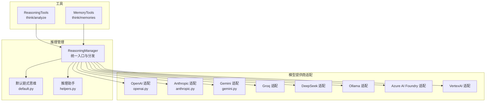
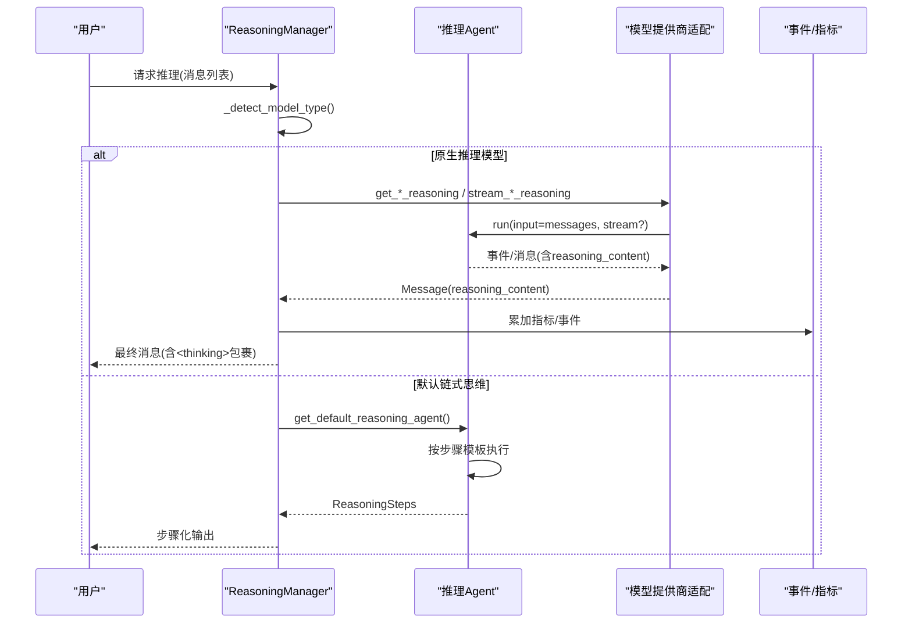
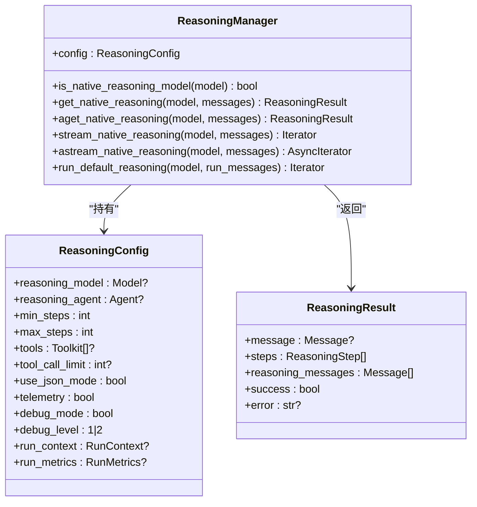
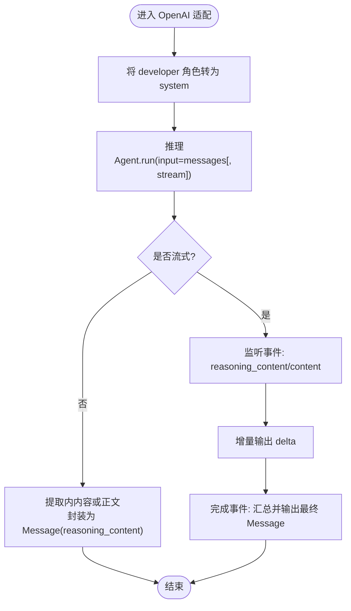
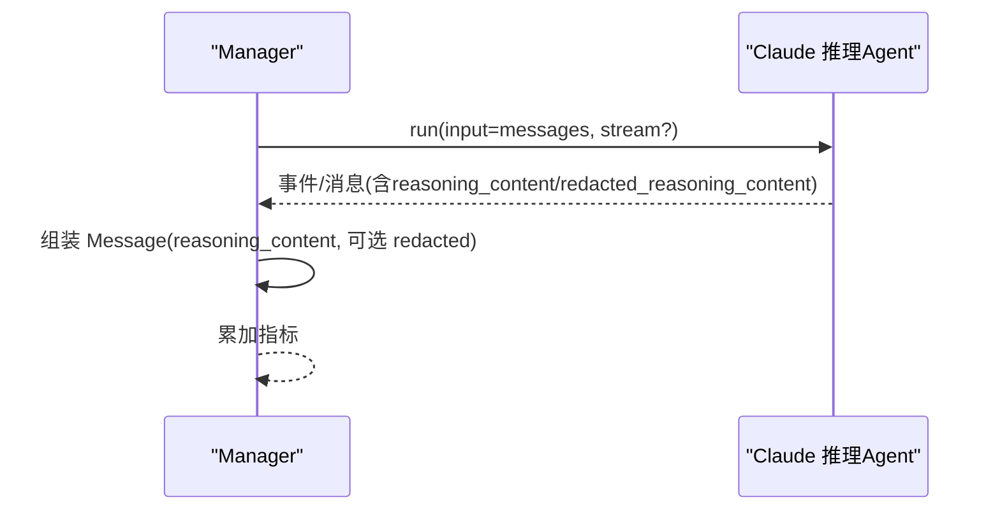
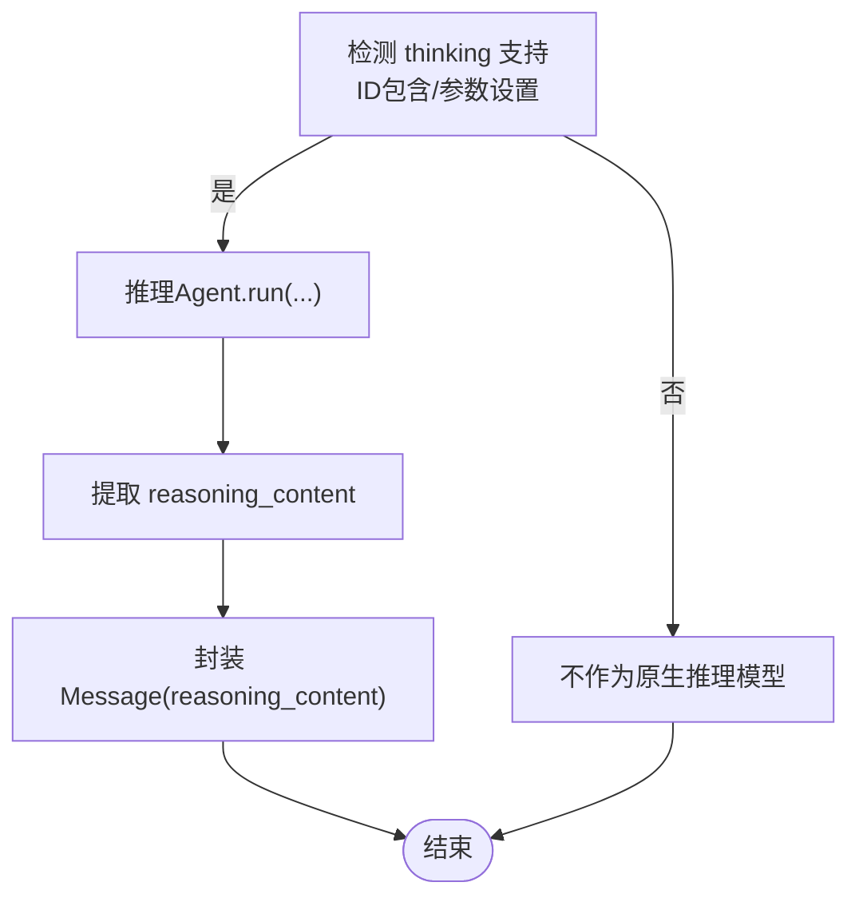
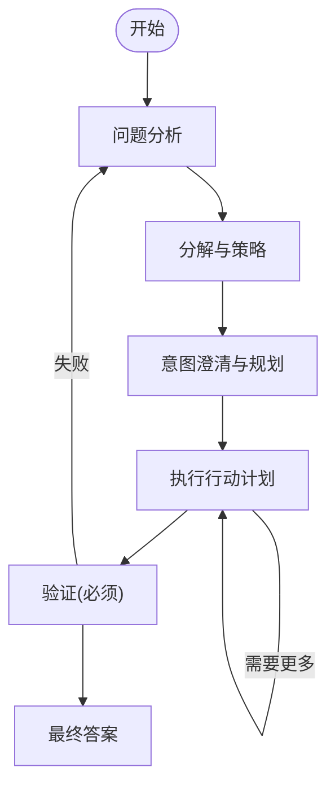
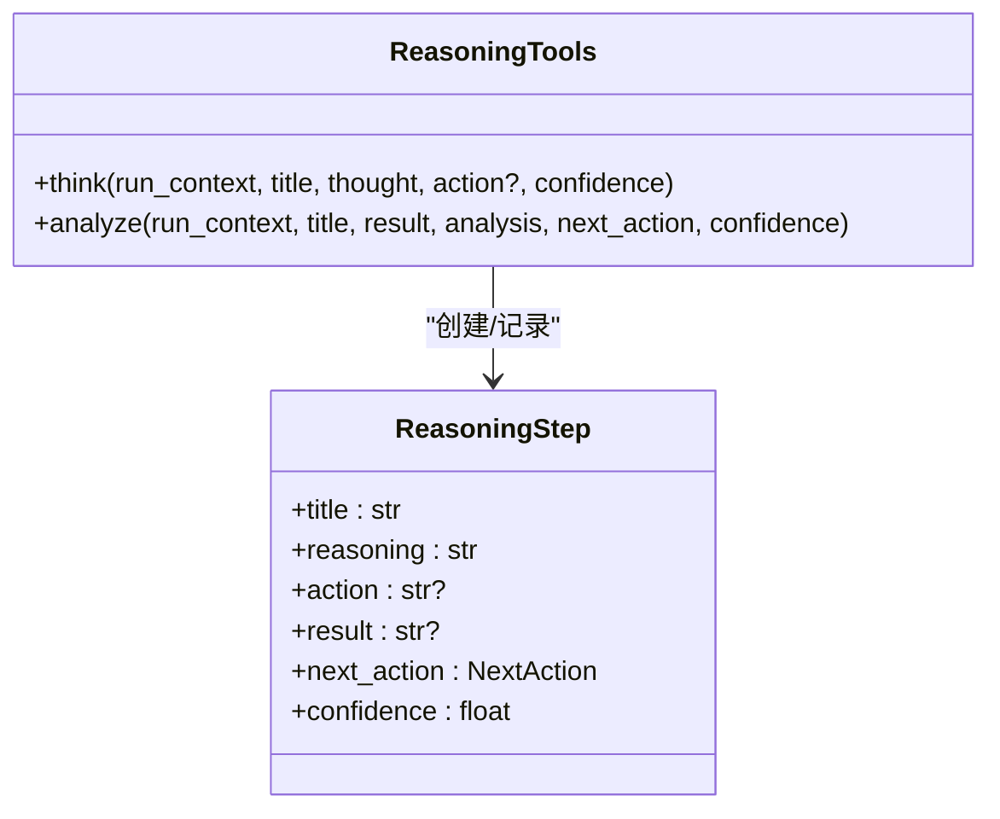
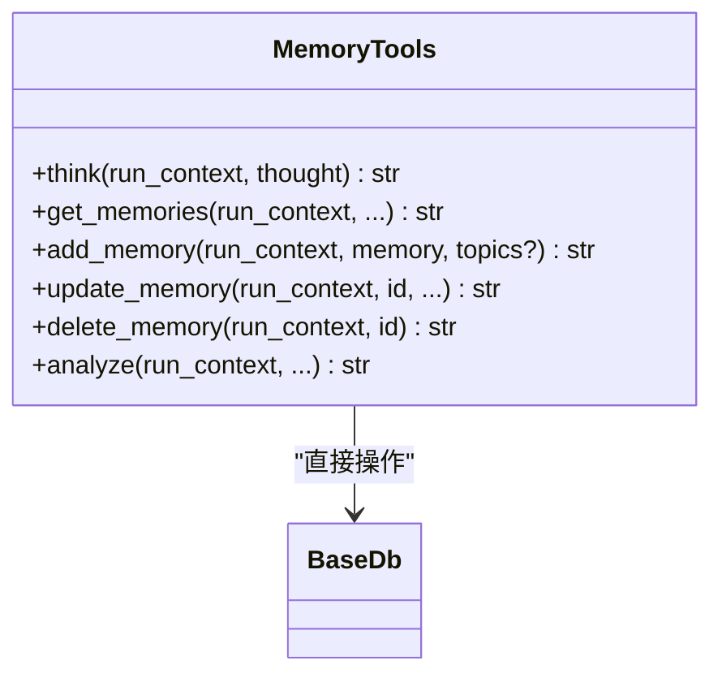
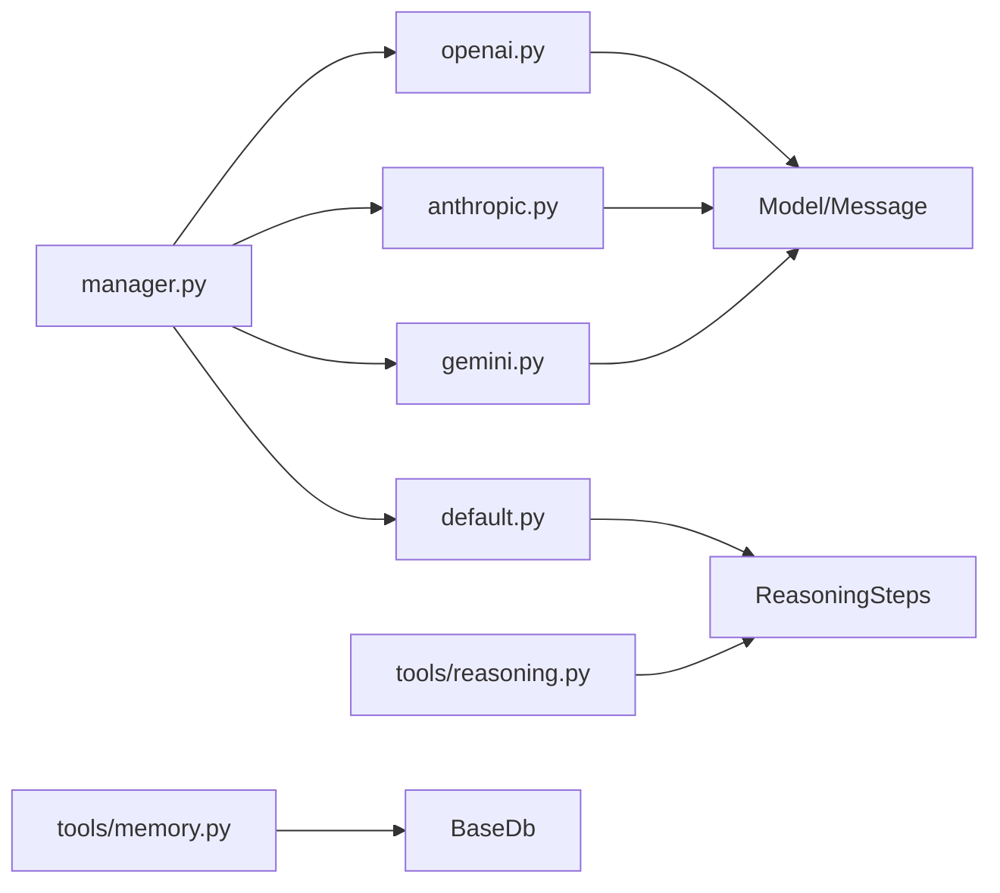

# 工具推理

<cite>
**本文引用的文件**
- [reasoning/manager.py](file://libs/agno/agno/reasoning/manager.py)
- [reasoning/openai.py](file://libs/agno/agno/reasoning/openai.py)
- [reasoning/anthropic.py](file://libs/agno/agno/reasoning/anthropic.py)
- [reasoning/gemini.py](file://libs/agno/agno/reasoning/gemini.py)
- [reasoning/default.py](file://libs/agno/agno/reasoning/default.py)
- [reasoning/helpers.py](file://libs/agno/agno/reasoning/helpers.py)
- [tools/reasoning.py](file://libs/agno/agno/tools/reasoning.py)
- [tools/memory.py](file://libs/agno/agno/tools/memory.py)
- [10_reasoning/models/README.md](file://cookbook/10_reasoning/models/README.md)
- [10_reasoning/tools/reasoning_tools.py](file://cookbook/10_reasoning/tools/reasoning_tools.py)
- [10_reasoning/tools/knowledge_tools.py](file://cookbook/10_reasoning/tools/knowledge_tools.py)
- [10_reasoning/tools/memory_tools.py](file://cookbook/10_reasoning/tools/memory_tools.py)
- [10_reasoning/agents/analyse_treaty_of_versailles.py](file://cookbook/10_reasoning/agents/analyse_treaty_of_versailles.py)
- [10_reasoning/teams/reasoning_finance_team.py](file://cookbook/10_reasoning/teams/reasoning_finance_team.py)
- [tests/unit/reasoning/test_reasoning_checkers.py](file://libs/agno/tests/unit/reasoning/test_reasoning_checkers.py)
- [tests/integration/agent/test_agent_reasoning_new_models.py](file://libs/agno/tests/integration/agent/test_agent_reasoning_new_models.py)
</cite>

## 目录
1. [简介](#简介)
2. [项目结构](#项目结构)
3. [核心组件](#核心组件)
4. [架构总览](#架构总览)
5. [详细组件分析](#详细组件分析)
6. [依赖关系分析](#依赖关系分析)
7. [性能考量](#性能考量)
8. [故障排查指南](#故障排查指南)
9. [结论](#结论)
10. [附录](#附录)

## 简介
本章节系统性介绍“工具推理”能力：如何在多模型提供商（OpenAI、Claude、Gemini、Groq、DeepSeek、Ollama、Azure AI Foundry、Vertex AI 等）下统一调度原生推理能力，并与知识工具、记忆工具、工作流工具协同，构建可观察、可验证、可自动化的推理流程。文档覆盖推理工具选择策略、推理路径优化、结果验证机制、推理内容捕获与分析、性能监控以及实际应用案例与配置指导。

## 项目结构
围绕“工具推理”的关键目录与文件如下：
- 推理管理与分发：libs/agno/agno/reasoning/*
- 模型提供商适配：openai、anthropic、gemini、groq、deepseek、ollama、azure_ai_foundry、vertexai
- 默认链式思维（CoT）：default.py
- 推理工具包：libs/agno/agno/tools/reasoning.py
- 记忆工具：libs/agno/agno/tools/memory.py
- 示例与用法：cookbook/10_reasoning/tools/* 与 cookbook/10_reasoning/agents/*、teams/*

图示来源
- [reasoning/manager.py:106-272](file://libs/agno/agno/reasoning/manager.py#L106-L272)
- [reasoning/openai.py:14-31](file://libs/agno/agno/reasoning/openai.py#L14-L31)
- [reasoning/anthropic.py:13-25](file://libs/agno/agno/reasoning/anthropic.py#L13-L25)
- [reasoning/gemini.py:13-36](file://libs/agno/agno/reasoning/gemini.py#L13-L36)
- [reasoning/default.py:13-96](file://libs/agno/agno/reasoning/default.py#L13-L96)
- [reasoning/helpers.py:11-28](file://libs/agno/agno/reasoning/helpers.py#L11-L28)
- [tools/reasoning.py:10-49](file://libs/agno/agno/tools/reasoning.py#L10-L49)
- [tools/memory.py:41-64](file://libs/agno/agno/tools/memory.py#L41-L64)

章节来源
- [10_reasoning/models/README.md:1-16](file://cookbook/10_reasoning/models/README.md#L1-L16)

## 核心组件
- ReasoningManager：集中式推理管理器，负责识别模型类型、选择原生推理或默认链式思维、处理同步/异步/流式推理、事件与指标聚合。
- 各模型适配模块：is_*_reasoning_model 判定 + get_*_reasoning / stream_*_reasoning 实现，统一输出带 reasoning_content 的消息。
- 默认链式思维：根据最小/最大步数、工具集合、JSON 输出模式生成 ReasoningSteps 结构化输出。
- ReasoningTools：提供 think/analyze 工具，作为内部推理草稿与分析的结构化记录。
- MemoryTools：提供 think/memories/add/update/delete/analyze 工具，支持直接数据库操作与分析工具。
- 辅助函数：获取推理 Agent、解析下一步动作、更新消息上下文等。

章节来源
- [reasoning/manager.py:106-272](file://libs/agno/agno/reasoning/manager.py#L106-L272)
- [reasoning/openai.py:14-31](file://libs/agno/agno/reasoning/openai.py#L14-L31)
- [reasoning/anthropic.py:13-25](file://libs/agno/agno/reasoning/anthropic.py#L13-L25)
- [reasoning/gemini.py:13-36](file://libs/agno/agno/reasoning/gemini.py#L13-L36)
- [reasoning/default.py:13-96](file://libs/agno/agno/reasoning/default.py#L13-L96)
- [reasoning/helpers.py:11-28](file://libs/agno/agno/reasoning/helpers.py#L11-L28)
- [tools/reasoning.py:10-49](file://libs/agno/agno/tools/reasoning.py#L10-L49)
- [tools/memory.py:41-64](file://libs/agno/agno/tools/memory.py#L41-L64)

## 架构总览
推理流程分为两条主线：
- 原生推理：由 ReasoningManager 识别模型类型后调用对应适配模块，产出带 reasoning_content 的消息；支持非流式与流式两种模式。
- 默认链式思维：当模型不满足原生推理条件时，ReasoningManager 调用默认推理 Agent，按固定步骤模板执行，最终以 ReasoningSteps 结构化输出。

图示来源
- [reasoning/manager.py:198-272](file://libs/agno/agno/reasoning/manager.py#L198-L272)
- [reasoning/openai.py:33-69](file://libs/agno/agno/reasoning/openai.py#L33-L69)
- [reasoning/anthropic.py:28-62](file://libs/agno/agno/reasoning/anthropic.py#L28-L62)
- [reasoning/gemini.py:39-66](file://libs/agno/agno/reasoning/gemini.py#L39-L66)
- [reasoning/default.py:13-96](file://libs/agno/agno/reasoning/default.py#L13-L96)

## 详细组件分析

### 推理管理器（ReasoningManager）
- 功能要点
  - 模型类型检测：基于 is_*_reasoning_model 判定 DeepSeek、Anthropic、OpenAI、Groq、Ollama、AI Foundry、Gemini、VertexAI。
  - 原生推理：按模型类型路由至对应适配模块，支持同步/异步/流式三种模式。
  - 默认链式思维：在不满足原生推理时，构造默认推理 Agent，按最小/最大步数与工具集合执行。
  - 事件与指标：统一发射推理事件、收集运行指标并累加到父级 RunMetrics。
- 关键接口
  - get_native_reasoning / aget_native_reasoning
  - stream_native_reasoning / astream_native_reasoning
  - run_default_reasoning
  - is_native_reasoning_model

图示来源
- [reasoning/manager.py:77-104](file://libs/agno/agno/reasoning/manager.py#L77-L104)
- [reasoning/manager.py:106-185](file://libs/agno/agno/reasoning/manager.py#L106-L185)

章节来源
- [reasoning/manager.py:106-272](file://libs/agno/agno/reasoning/manager.py#L106-L272)
- [reasoning/manager.py:274-348](file://libs/agno/agno/reasoning/manager.py#L274-L348)
- [reasoning/manager.py:354-568](file://libs/agno/agno/reasoning/manager.py#L354-L568)
- [reasoning/manager.py:570-784](file://libs/agno/agno/reasoning/manager.py#L570-L784)

### OpenAI 推理工具
- 模型判定：OpenAIChat/OpenAIResponses/AzureOpenAI 且包含特定 ID 片段（如 o4/o3/o1/4.1/4.5/5.1/5.2 或 deepseek-r1）。
- 行为特征：将 developer 角色消息转为 system，提取<think>标签内的推理内容或直接使用正文，封装为带 reasoning_content 的消息。
- 流式：支持事件驱动的增量输出，优先使用 reasoning_content，否则回退到 content。

图示来源
- [reasoning/openai.py:33-69](file://libs/agno/agno/reasoning/openai.py#L33-L69)
- [reasoning/openai.py:110-163](file://libs/agno/agno/reasoning/openai.py#L110-L163)
- [reasoning/openai.py:166-219](file://libs/agno/agno/reasoning/openai.py#L166-L219)

章节来源
- [reasoning/openai.py:14-31](file://libs/agno/agno/reasoning/openai.py#L14-L31)
- [reasoning/openai.py:33-69](file://libs/agno/agno/reasoning/openai.py#L33-L69)
- [reasoning/openai.py:110-163](file://libs/agno/agno/reasoning/openai.py#L110-L163)
- [reasoning/openai.py:166-219](file://libs/agno/agno/reasoning/openai.py#L166-L219)

### Claude（Anthropic）推理工具
- 模型判定：Claude 且 provider 为 Anthropic，且 thinking 参数已启用。
- 行为特征：从推理 Agent 的消息中提取 reasoning_content，必要时使用 redacted_reasoning_content，封装为带 reasoning_content 的消息。

图示来源
- [reasoning/anthropic.py:28-62](file://libs/agno/agno/reasoning/anthropic.py#L28-L62)
- [reasoning/anthropic.py:65-104](file://libs/agno/agno/reasoning/anthropic.py#L65-L104)
- [reasoning/anthropic.py:107-141](file://libs/agno/agno/reasoning/anthropic.py#L107-L141)
- [reasoning/anthropic.py:144-183](file://libs/agno/agno/reasoning/anthropic.py#L144-L183)

章节来源
- [reasoning/anthropic.py:13-25](file://libs/agno/agno/reasoning/anthropic.py#L13-L25)
- [reasoning/anthropic.py:28-62](file://libs/agno/agno/reasoning/anthropic.py#L28-L62)
- [reasoning/anthropic.py:65-104](file://libs/agno/agno/reasoning/anthropic.py#L65-L104)
- [reasoning/anthropic.py:107-141](file://libs/agno/agno/reasoning/anthropic.py#L107-L141)
- [reasoning/anthropic.py:144-183](file://libs/agno/agno/reasoning/anthropic.py#L144-L183)

### Gemini 推理工具
- 模型判定：Gemini 类，且模型 ID 包含 2.5/3.0/3.5/deepthink/gemini-3，或显式设置 thinking_budget>0 或 include_thoughts。
- 行为特征：从推理 Agent 的消息中提取 reasoning_content，封装为带 reasoning_content 的消息。

图示来源
- [reasoning/gemini.py:13-36](file://libs/agno/agno/reasoning/gemini.py#L13-L36)
- [reasoning/gemini.py:39-66](file://libs/agno/agno/reasoning/gemini.py#L39-L66)
- [reasoning/gemini.py:99-136](file://libs/agno/agno/reasoning/gemini.py#L99-L136)
- [reasoning/gemini.py:139-176](file://libs/agno/agno/reasoning/gemini.py#L139-L176)

章节来源
- [reasoning/gemini.py:13-36](file://libs/agno/agno/reasoning/gemini.py#L13-L36)
- [reasoning/gemini.py:39-66](file://libs/agno/agno/reasoning/gemini.py#L39-L66)
- [reasoning/gemini.py:99-136](file://libs/agno/agno/reasoning/gemini.py#L99-L136)
- [reasoning/gemini.py:139-176](file://libs/agno/agno/reasoning/gemini.py#L139-L176)

### 默认链式思维（CoT）
- 设计目标：在不具备原生推理能力时，仍能提供结构化、可追踪的推理过程。
- 关键点：固定步骤模板（问题分析、分解与策略、意图澄清与规划、执行计划、验证、最终答案）、ReasoningSteps 输出、工具调用限制、JSON 模式、调试与遥测开关。

图示来源
- [reasoning/default.py:13-96](file://libs/agno/agno/reasoning/default.py#L13-L96)

章节来源
- [reasoning/default.py:13-96](file://libs/agno/agno/reasoning/default.py#L13-L96)

### 推理工具包（ReasoningTools）
- 提供 think/analyze 两个核心工具：
  - think：记录内部推理步骤，写入会话状态，便于后续分析与展示。
  - analyze：对上一步结果进行评估，决定下一步动作（continue/validate/final_answer）。
- 支持注入系统提示、示例演示，便于模型理解如何正确使用。

图示来源
- [tools/reasoning.py:10-49](file://libs/agno/agno/tools/reasoning.py#L10-L49)
- [tools/reasoning.py:51-115](file://libs/agno/agno/tools/reasoning.py#L51-L115)
- [tools/reasoning.py:117-187](file://libs/agno/agno/tools/reasoning.py#L117-L187)

章节来源
- [tools/reasoning.py:10-49](file://libs/agno/agno/tools/reasoning.py#L10-L49)
- [tools/reasoning.py:51-115](file://libs/agno/agno/tools/reasoning.py#L51-L115)
- [tools/reasoning.py:117-187](file://libs/agno/agno/tools/reasoning.py#L117-L187)
- [tools/reasoning.py:193-290](file://libs/agno/agno/tools/reasoning.py#L193-L290)

### 记忆工具（MemoryTools）
- 提供 think/memories/add/update/delete/analyze 等工具，直接操作数据库，适合细粒度的记忆 CRUD。
- 与 ReasoningTools 协同：think 用于内部推理草稿，get/add/update/delete 用于持久化记忆，analyze 用于验证与复盘。

图示来源
- [tools/memory.py:41-64](file://libs/agno/agno/tools/memory.py#L41-L64)
- [tools/memory.py:66-94](file://libs/agno/agno/tools/memory.py#L66-L94)
- [tools/memory.py:126-183](file://libs/agno/agno/tools/memory.py#L126-L183)
- [tools/memory.py:341-361](file://libs/agno/agno/tools/memory.py#L341-L361)

章节来源
- [tools/memory.py:41-64](file://libs/agno/agno/tools/memory.py#L41-L64)
- [tools/memory.py:66-94](file://libs/agno/agno/tools/memory.py#L66-L94)
- [tools/memory.py:126-183](file://libs/agno/agno/tools/memory.py#L126-L183)
- [tools/memory.py:341-361](file://libs/agno/agno/tools/memory.py#L341-L361)

### 推理路径选择策略与优化
- 自动识别：通过 is_*_reasoning_model 快速判断是否为原生推理模型，避免不必要的降级。
- 回退策略：若非原生推理模型，则自动切换到默认链式思维，保证一致性体验。
- 流式优先：对于支持流式的模型（DeepSeek、Anthropic、Gemini、OpenAI、VertexAI、AI Foundry、Groq、Ollama），优先采用流式以提升交互体验。
- 指标聚合：将推理 Agent 的指标累加到父级 RunMetrics，便于统一观测与评估。

章节来源
- [reasoning/manager.py:123-150](file://libs/agno/agno/reasoning/manager.py#L123-L150)
- [reasoning/manager.py:565-568](file://libs/agno/agno/reasoning/manager.py#L565-L568)
- [reasoning/manager.py:588-589](file://libs/agno/agno/reasoning/manager.py#L588-L589)

### 结果验证机制
- 原生推理：从消息中提取 reasoning_content，必要时使用 redacted_reasoning_content，确保敏感信息保护。
- 默认推理：通过 ReasoningSteps 的 next_action 字段控制流程走向，validate 与 final_answer 明确终止条件。
- 事件与日志：ReasoningEventType 定义统一事件类型，便于外部订阅与可视化。

章节来源
- [reasoning/anthropic.py:57-62](file://libs/agno/agno/reasoning/anthropic.py#L57-L62)
- [reasoning/gemini.py:64-66](file://libs/agno/agno/reasoning/gemini.py#L64-L66)
- [reasoning/default.py:13-96](file://libs/agno/agno/reasoning/default.py#L13-L96)
- [reasoning/manager.py:43-51](file://libs/agno/agno/reasoning/manager.py#L43-L51)

### 推理内容捕获与分析
- 捕获：流式场景下，事件驱动地累积 reasoning_content；非流式场景下，直接从响应消息中提取。
- 分析：ReasoningTools 的 analyze 工具用于对结果进行评估与决策；MemoryTools 的 analyze 工具用于记忆层面的验证与复盘。
- 展示：支持 show_full_reasoning 输出完整推理链路，便于审计与教学。

章节来源
- [reasoning/openai.py:110-163](file://libs/agno/agno/reasoning/openai.py#L110-L163)
- [reasoning/anthropic.py:65-104](file://libs/agno/agno/reasoning/anthropic.py#L65-L104)
- [reasoning/gemini.py:99-136](file://libs/agno/agno/reasoning/gemini.py#L99-L136)
- [tools/reasoning.py:117-187](file://libs/agno/agno/tools/reasoning.py#L117-L187)
- [tools/memory.py:341-361](file://libs/agno/agno/tools/memory.py#L341-L361)

### 与知识工具、记忆工具、工作流工具的结合
- 知识工具：在推理前/后检索相关知识，增强上下文质量；示例见 cookbook/10_reasoning/tools/knowledge_tools.py。
- 记忆工具：在推理过程中记录关键洞察与决策依据，形成可追溯的记忆；示例见 cookbook/10_reasoning/tools/memory_tools.py。
- 工作流工具：将推理作为工作流中的一个节点，配合条件分支、并行执行与早停逻辑，实现自动化推理流程。

章节来源
- [10_reasoning/tools/knowledge_tools.py:19-45](file://cookbook/10_reasoning/tools/knowledge_tools.py#L19-L45)
- [10_reasoning/tools/memory_tools.py:18-38](file://cookbook/10_reasoning/tools/memory_tools.py#L18-L38)
- [10_reasoning/tools/reasoning_tools.py:18-58](file://cookbook/10_reasoning/tools/reasoning_tools.py#L18-L58)

### 实际应用案例与配置指导
- 多模型对比：内置链式思维 vs DeepSeek 原生推理，见 cookbook/10_reasoning/agents/analyse_treaty_of_versailles.py。
- 团队协作：团队领导使用 ReasoningTools 进行高层协调，成员分别处理搜索与财务数据，见 cookbook/10_reasoning/teams/reasoning_finance_team.py。
- 工具集成：在 Agent 中注册 ReasoningTools，开启 add_instructions 与 markdown，提升推理透明度与可读性。

章节来源
- [10_reasoning/agents/analyse_treaty_of_versailles.py:15-32](file://cookbook/10_reasoning/agents/analyse_treaty_of_versailles.py#L15-L32)
- [10_reasoning/teams/reasoning_finance_team.py:21-61](file://cookbook/10_reasoning/teams/reasoning_finance_team.py#L21-L61)
- [10_reasoning/tools/reasoning_tools.py:18-58](file://cookbook/10_reasoning/tools/reasoning_tools.py#L18-L58)

## 依赖关系分析
- 模型判定依赖：各 is_*_reasoning_model 函数定义了模型识别规则，避免误判。
- 适配模块依赖：每个适配模块仅依赖基础模型接口与消息结构，保持低耦合。
- 工具依赖：ReasoningTools 与 MemoryTools 依赖 RunContext 与会话状态，便于跨组件共享推理历史。

图示来源
- [reasoning/openai.py:5-8](file://libs/agno/agno/reasoning/openai.py#L5-L8)
- [reasoning/anthropic.py:5-7](file://libs/agno/agno/reasoning/anthropic.py#L5-L7)
- [reasoning/gemini.py:5-7](file://libs/agno/agno/reasoning/gemini.py#L5-L7)
- [reasoning/default.py:6-10](file://libs/agno/agno/reasoning/default.py#L6-L10)
- [tools/reasoning.py:4-6](file://libs/agno/agno/tools/reasoning.py#L4-L6)
- [tools/memory.py:41-42](file://libs/agno/agno/tools/memory.py#L41-L42)
- [reasoning/manager.py:123-150](file://libs/agno/agno/reasoning/manager.py#L123-L150)

章节来源
- [reasoning/manager.py:123-150](file://libs/agno/agno/reasoning/manager.py#L123-L150)
- [reasoning/openai.py:14-31](file://libs/agno/agno/reasoning/openai.py#L14-L31)
- [reasoning/anthropic.py:13-25](file://libs/agno/agno/reasoning/anthropic.py#L13-L25)
- [reasoning/gemini.py:13-36](file://libs/agno/agno/reasoning/gemini.py#L13-L36)
- [reasoning/default.py:13-96](file://libs/agno/agno/reasoning/default.py#L13-L96)
- [tools/reasoning.py:10-49](file://libs/agno/agno/tools/reasoning.py#L10-L49)
- [tools/memory.py:41-64](file://libs/agno/agno/tools/memory.py#L41-L64)

## 性能考量
- 流式优先：在支持的模型上优先使用流式推理，降低首字节延迟，提升交互体验。
- 指标聚合：将推理阶段指标合并到父级 RunMetrics，便于端到端性能评估与瓶颈定位。
- 工具调用限制：通过 tool_call_limit 控制工具调用次数，避免过度调用导致超时或成本过高。
- JSON 模式：在需要结构化输出时启用 JSON 模式，减少后处理开销并提高稳定性。

## 故障排查指南
- 模型识别失败：确认 is_*_reasoning_model 判定条件是否满足（ID 片段、thinking 参数、provider 等）。
- 流式无输出：检查事件监听逻辑与 reasoning_content 字段是否存在；必要时回退到非流式。
- 结果为空：核对消息中 reasoning_content 是否存在，或是否被过滤；查看日志与错误事件。
- 集成测试参考：
  - 模型识别测试：tests/unit/reasoning/test_reasoning_checkers.py
  - 新模型兼容测试：tests/integration/agent/test_agent_reasoning_new_models.py

章节来源
- [tests/unit/reasoning/test_reasoning_checkers.py:320-434](file://libs/agno/tests/unit/reasoning/test_reasoning_checkers.py#L320-L434)
- [tests/integration/agent/test_agent_reasoning_new_models.py:620-647](file://libs/agno/tests/integration/agent/test_agent_reasoning_new_models.py#L620-L647)

## 结论
通过统一的 ReasoningManager 与多模型适配层，工具推理实现了“原生推理优先、默认链式思维兜底”的稳健策略；结合 ReasoningTools、MemoryTools 与知识工具，可构建可观察、可验证、可自动化的推理流程。建议在生产环境中优先启用流式推理、严格控制工具调用次数、开启指标聚合与事件订阅，以获得最佳的性能与可观测性。

## 附录
- 模型提供商清单（来自 cookbook/10_reasoning/models/README.md）：Anthropic、Azure AI Foundry、Azure OpenAI、DeepSeek、Gemini、Groq、Ollama、OpenAI、Vertex AI、X.AI。
- 示例脚本路径：
  - 推理工具示例：cookbook/10_reasoning/tools/reasoning_tools.py
  - 知识工具示例：cookbook/10_reasoning/tools/knowledge_tools.py
  - 记忆工具示例：cookbook/10_reasoning/tools/memory_tools.py
  - 多模型对比示例：cookbook/10_reasoning/agents/analyse_treaty_of_versailles.py
  - 团队推理示例：cookbook/10_reasoning/teams/reasoning_finance_team.py