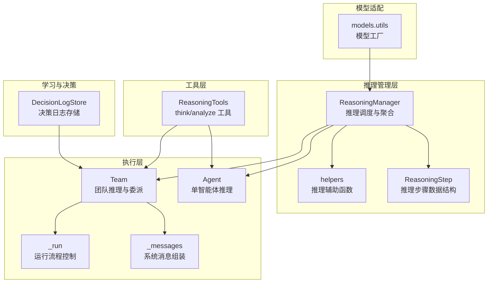
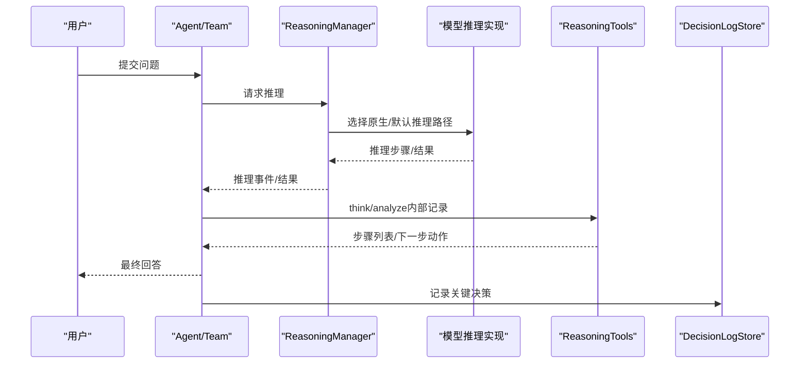
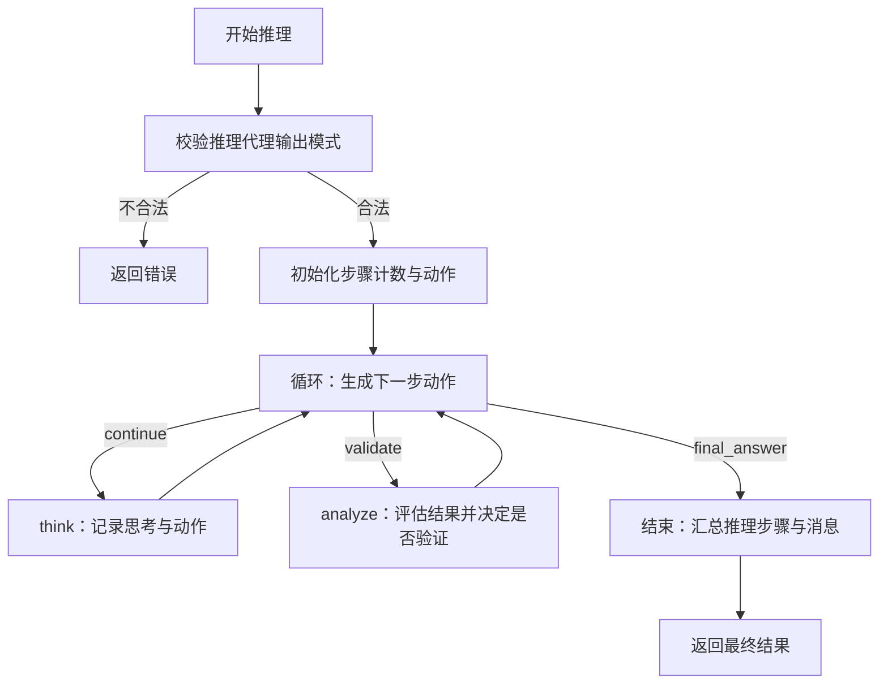
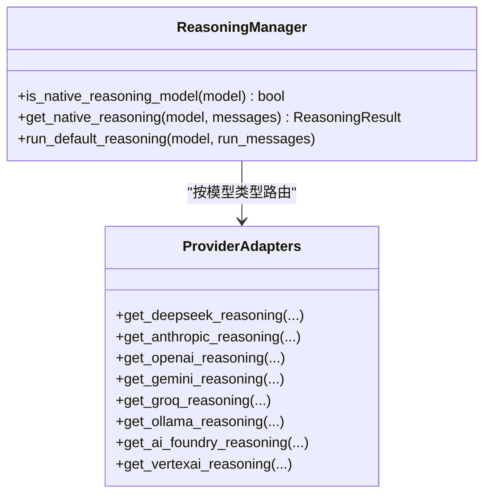
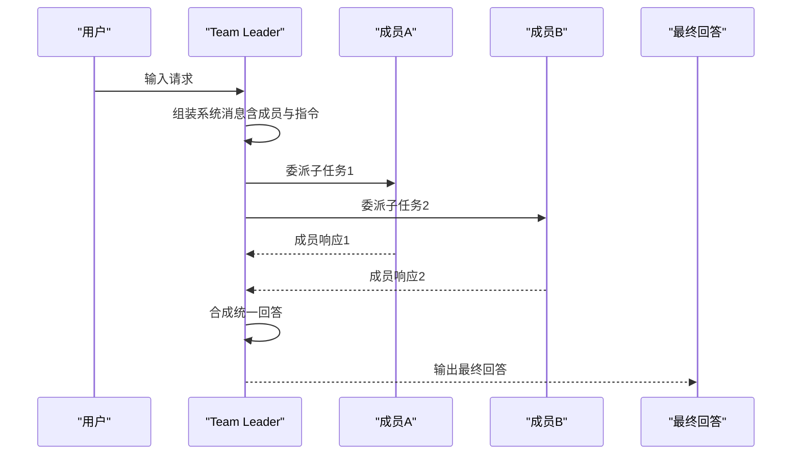
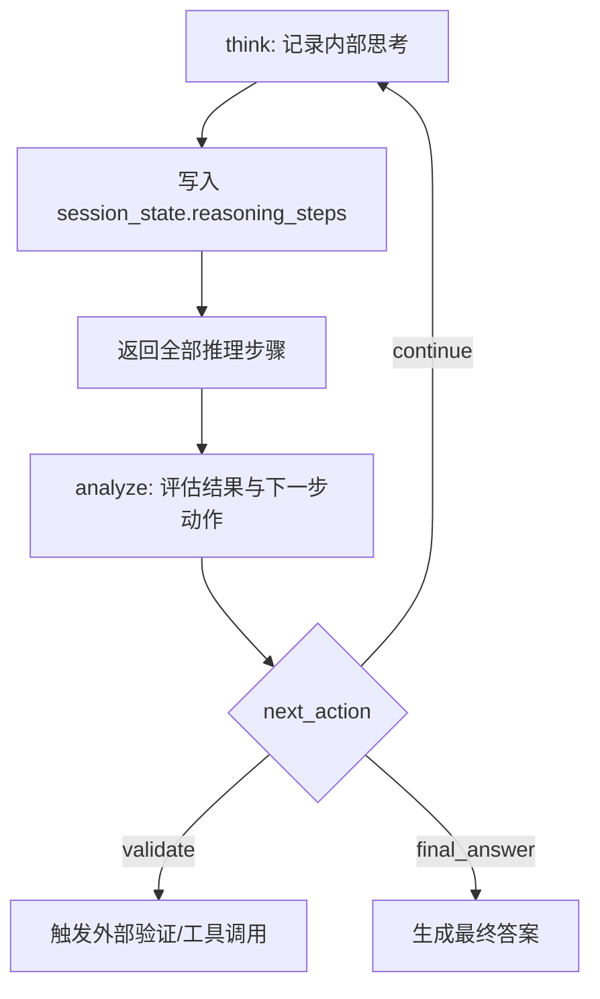
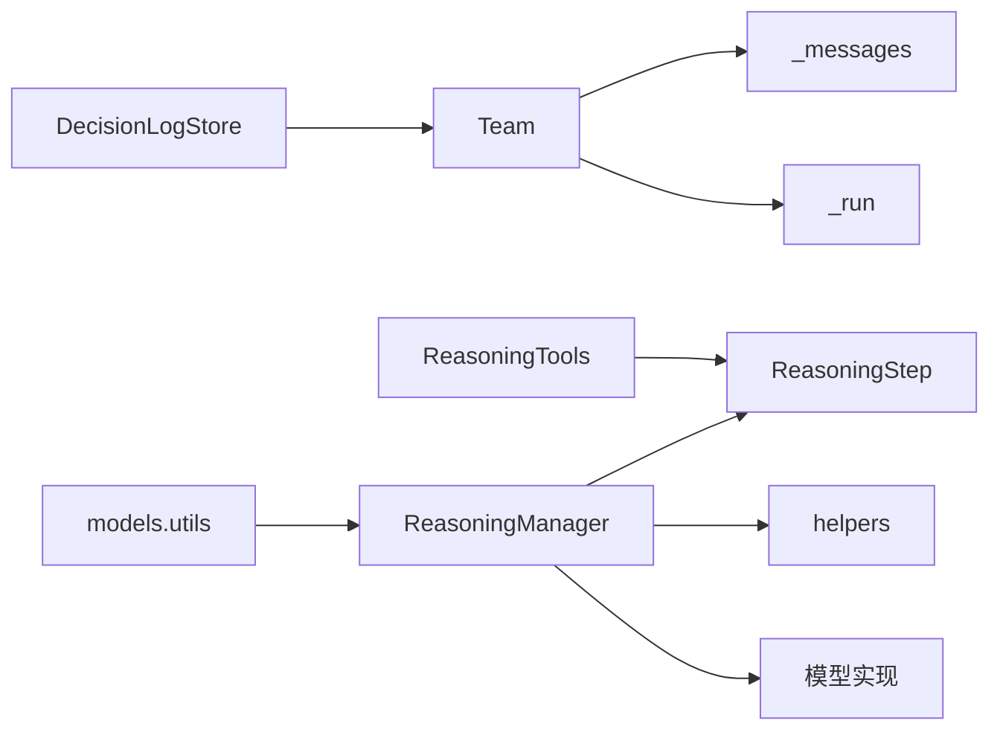

# 推理系统

<cite>
**本文引用的文件**
- [libs/agno/agno/reasoning/manager.py](file://libs/agno/agno/reasoning/manager.py)
- [libs/agno/agno/reasoning/step.py](file://libs/agno/agno/reasoning/step.py)
- [libs/agno/agno/reasoning/helpers.py](file://libs/agno/agno/reasoning/helpers.py)
- [libs/agno/agno/tools/reasoning.py](file://libs/agno/agno/tools/reasoning.py)
- [libs/agno/agno/team/team.py](file://libs/agno/agno/team/team.py)
- [libs/agno/agno/team/_messages.py](file://libs/agno/agno/team/_messages.py)
- [libs/agno/agno/team/_run.py](file://libs/agno/agno/team/_run.py)
- [libs/agno/agno/team/__init__.py](file://libs/agno/agno/team/__init__.py)
- [libs/agno/agno/learn/stores/decision_log.py](file://libs/agno/agno/learn/stores/decision_log.py)
- [libs/agno/agno/models/utils.py](file://libs/agno/agno/models/utils.py)
- [cookbook/10_reasoning/README.md](file://cookbook/10_reasoning/README.md)
- [cookbook/10_reasoning/tools/reasoning_tools.md](file://cookbook/10_reasoning/tools/reasoning_tools.md)
- [cookbook/03_teams/01_quickstart/01_basic_coordination.md](file://cookbook/03_teams/01_quickstart/01_basic_coordination.md)
- [cookbook/03_teams/02_modes/coordinate/README.md](file://cookbook/03_teams/02_modes/coordinate/README.md)
- [cookbook/03_teams/13_hooks/post_hook_output.py](file://cookbook/03_teams/13_hooks/post_hook_output.py)
- [cookbook/03_teams/12_learning/06_team_decision_log.py](file://cookbook/03_teams/12_learning/06_team_decision_log.py)
- [cookbook/03_teams/12_learning/06_team_decision_log.md](file://cookbook/03_teams/12_learning/06_team_decision_log.md)
- [libs/agno/tests/integration/teams/test_event_streaming.py](file://libs/agno/tests/integration/teams/test_event_streaming.py)
- [libs/agno/tests/integration/teams/test_hooks.py](file://libs/agno/tests/integration/teams/test_hooks.py)
</cite>

## 目录
1. [简介](#简介)
2. [项目结构](#项目结构)
3. [核心组件](#核心组件)
4. [架构总览](#架构总览)
5. [详细组件分析](#详细组件分析)
6. [依赖分析](#依赖分析)
7. [性能考虑](#性能考虑)
8. [故障排查指南](#故障排查指南)
9. [结论](#结论)
10. [附录](#附录)

## 简介
本文件系统性梳理 Agno Learn 的推理系统设计与实现，覆盖代理推理、模型推理、团队推理与工具推理的统一框架。重点包括：
- 代理推理：思维链（Chain-of-Thought）构建、决策过程与优化策略
- 多模型推理：模型类型检测、推理路径规划与结果融合
- 团队推理：成员委派、合成输出、质量保障与效率优化
- 工具推理：推理工具（think/analyze）的选择策略、路径优化与结果验证
- 多模型提供商支持：OpenAI、Anthropic、Google、Azure 等主流模型集成

## 项目结构
推理系统围绕“ReasoningManager + Agent/Team + Tools”的分层组织，辅以学习与决策日志模块，形成可扩展的推理闭环。

图表来源
- [libs/agno/agno/reasoning/manager.py:106-185](file://libs/agno/agno/reasoning/manager.py#L106-L185)
- [libs/agno/agno/reasoning/step.py:14-32](file://libs/agno/agno/reasoning/step.py#L14-L32)
- [libs/agno/agno/reasoning/helpers.py:11-28](file://libs/agno/agno/reasoning/helpers.py#L11-L28)
- [libs/agno/agno/tools/reasoning.py:10-49](file://libs/agno/agno/tools/reasoning.py#L10-L49)
- [libs/agno/agno/team/team.py:70-200](file://libs/agno/agno/team/team.py#L70-L200)
- [libs/agno/agno/team/_messages.py:90-125](file://libs/agno/agno/team/_messages.py#L90-L125)
- [libs/agno/agno/team/_run.py:3229-3259](file://libs/agno/agno/team/_run.py#L3229-L3259)
- [libs/agno/agno/learn/stores/decision_log.py:420-449](file://libs/agno/agno/learn/stores/decision_log.py#L420-L449)
- [libs/agno/agno/models/utils.py:6-55](file://libs/agno/agno/models/utils.py#L6-L55)

章节来源
- [libs/agno/agno/reasoning/manager.py:106-185](file://libs/agno/agno/reasoning/manager.py#L106-L185)
- [libs/agno/agno/team/team.py:70-200](file://libs/agno/agno/team/team.py#L70-L200)
- [libs/agno/agno/tools/reasoning.py:10-49](file://libs/agno/agno/tools/reasoning.py#L10-L49)
- [libs/agno/agno/learn/stores/decision_log.py:420-449](file://libs/agno/agno/learn/stores/decision_log.py#L420-L449)
- [libs/agno/agno/models/utils.py:6-55](file://libs/agno/agno/models/utils.py#L6-L55)

## 核心组件
- ReasoningManager：集中式推理管理器，统一处理原生模型推理与默认思维链推理，支持同步/异步、流式/非流式两种模式。
- ReasoningTools：推理工具集，提供 think/analyze 两工具，作为代理内部“草稿纸”，记录与评估推理步骤。
- ReasoningStep：推理步骤的数据模型，包含标题、动作、结果、思考、下一步动作与置信度等字段。
- Team：团队推理核心，负责成员委派、系统消息组装、运行流程控制与事件流。
- DecisionLogStore：决策日志存储，用于记录重要决策及其理由，支撑团队学习与审计。

章节来源
- [libs/agno/agno/reasoning/manager.py:106-185](file://libs/agno/agno/reasoning/manager.py#L106-L185)
- [libs/agno/agno/tools/reasoning.py:10-49](file://libs/agno/agno/tools/reasoning.py#L10-L49)
- [libs/agno/agno/reasoning/step.py:14-32](file://libs/agno/agno/reasoning/step.py#L14-L32)
- [libs/agno/agno/team/team.py:70-200](file://libs/agno/agno/team/team.py#L70-L200)
- [libs/agno/agno/learn/stores/decision_log.py:420-449](file://libs/agno/agno/learn/stores/decision_log.py#L420-L449)

## 架构总览
推理系统采用“分层解耦 + 事件驱动”的架构：
- 上层：Agent/Team 通过 ReasoningManager 发起推理请求
- 中层：ReasoningManager 选择推理路径（原生模型或默认 CoT），并维护推理事件
- 下层：工具层（ReasoningTools）与模型层（models.utils）提供能力支撑
- 辅助：DecisionLogStore 记录关键决策，TeamHooks 进行质量与协作校验

图表来源
- [libs/agno/agno/reasoning/manager.py:198-272](file://libs/agno/agno/reasoning/manager.py#L198-L272)
- [libs/agno/agno/tools/reasoning.py:51-125](file://libs/agno/agno/tools/reasoning.py#L51-L125)
- [libs/agno/agno/learn/stores/decision_log.py:420-449](file://libs/agno/agno/learn/stores/decision_log.py#L420-L449)

## 详细组件分析

### 代理推理：思维链构建与决策过程
- 思维链构建：通过默认 CoT 推理，逐步生成 ReasoningStep，每步包含思考、动作、结果与下一步动作，支持 continue/validate/final_answer。
- 决策过程：helpers.get_next_action 将字符串动作映射为枚举，确保流程一致性；update_messages_with_reasoning 将推理消息注入到最终输出中。
- 推理优化：支持最小/最大步数限制、工具调用上限、JSON 模式等配置；可开启遥测与调试模式。

图表来源
- [libs/agno/agno/reasoning/manager.py:790-900](file://libs/agno/agno/reasoning/manager.py#L790-L900)
- [libs/agno/agno/reasoning/helpers.py:31-39](file://libs/agno/agno/reasoning/helpers.py#L31-L39)
- [libs/agno/agno/reasoning/helpers.py:42-63](file://libs/agno/agno/reasoning/helpers.py#L42-L63)

章节来源
- [libs/agno/agno/reasoning/manager.py:790-918](file://libs/agno/agno/reasoning/manager.py#L790-L918)
- [libs/agno/agno/reasoning/helpers.py:31-63](file://libs/agno/agno/reasoning/helpers.py#L31-L63)
- [libs/agno/agno/reasoning/step.py:14-32](file://libs/agno/agno/reasoning/step.py#L14-L32)

### 多模型推理：模型类型检测与路径规划
- 类型检测：ReasoningManager 根据模型标识自动识别是否为原生推理模型（DeepSeek、Anthropic、OpenAI、Gemini、Groq、Ollama、AI Foundry、VertexAI）。
- 路径规划：对原生模型推理，按 provider 分发至对应实现；对非原生模型，回退到默认 CoT 推理。
- 结果融合：将推理消息追加到 run_messages，确保最终输出包含完整推理轨迹。

图表来源
- [libs/agno/agno/reasoning/manager.py:123-150](file://libs/agno/agno/reasoning/manager.py#L123-L150)
- [libs/agno/agno/reasoning/manager.py:198-272](file://libs/agno/agno/reasoning/manager.py#L198-L272)
- [libs/agno/agno/reasoning/manager.py:790-918](file://libs/agno/agno/reasoning/manager.py#L790-L918)

章节来源
- [libs/agno/agno/reasoning/manager.py:123-150](file://libs/agno/agno/reasoning/manager.py#L123-L150)
- [libs/agno/agno/reasoning/manager.py:198-272](file://libs/agno/agno/reasoning/manager.py#L198-L272)
- [libs/agno/agno/models/utils.py:6-55](file://libs/agno/agno/models/utils.py#L6-L55)

### 团队推理：成员委派与合成输出
- 成员委派：Team 在 system prompt 中注入成员信息与 coordinate 指令，Leader 模型通过内置工具 delegate_task_to_member 将子任务委派给最合适成员。
- 合成输出：Leader 收集成员响应后进行整合，避免简单拼接，确保回答连贯一致。
- 事件流：支持 run_started/model_request_started/tool_call_started/…/run_completed 等事件，便于可观测性与调试。

图表来源
- [libs/agno/agno/team/_messages.py:90-125](file://libs/agno/agno/team/_messages.py#L90-L125)
- [libs/agno/agno/team/_run.py:3229-3259](file://libs/agno/agno/team/_run.py#L3229-L3259)
- [libs/agno/tests/integration/teams/test_event_streaming.py:794-843](file://libs/agno/tests/integration/teams/test_event_streaming.py#L794-L843)

章节来源
- [libs/agno/agno/team/_messages.py:90-125](file://libs/agno/agno/team/_messages.py#L90-L125)
- [libs/agno/agno/team/_run.py:3229-3259](file://libs/agno/agno/team/_run.py#L3229-L3259)
- [libs/agno/tests/integration/teams/test_event_streaming.py:794-843](file://libs/agno/tests/integration/teams/test_event_streaming.py#L794-L843)

### 工具推理：think/analyze 与结果验证
- think 工具：记录推理步骤（标题、思考、动作、置信度），写入 session_state 的 reasoning_steps 列表，供后续分析与回溯。
- analyze 工具：评估上一步结果，决定下一步动作（continue/validate/final_answer），并记录结果与分析。
- 结果验证：通过 Team Hooks 对团队输出进行质量检查与协作证据校验，确保输出具备多视角整合与安全性。

图表来源
- [libs/agno/agno/tools/reasoning.py:51-125](file://libs/agno/agno/tools/reasoning.py#L51-L125)
- [cookbook/10_reasoning/tools/reasoning_tools.md:42-80](file://cookbook/10_reasoning/tools/reasoning_tools.md#L42-L80)
- [cookbook/03_teams/13_hooks/post_hook_output.py:58-130](file://cookbook/03_teams/13_hooks/post_hook_output.py#L58-L130)

章节来源
- [libs/agno/agno/tools/reasoning.py:51-125](file://libs/agno/agno/tools/reasoning.py#L51-L125)
- [cookbook/10_reasoning/tools/reasoning_tools.md:42-80](file://cookbook/10_reasoning/tools/reasoning_tools.md#L42-L80)
- [cookbook/03_teams/13_hooks/post_hook_output.py:58-130](file://cookbook/03_teams/13_hooks/post_hook_output.py#L58-L130)

### 推理模型支持：OpenAI、Anthropic、Google、Azure 等
- 模型工厂：models.utils 提供按 provider 选择具体模型类的能力，便于在推理与团队场景中灵活切换。
- 原生推理：ReasoningManager 对主流模型提供原生推理实现，支持流式与非流式两种模式。
- 示例入口：cookbook/10_reasoning/models 展示各提供商的推理示例与最佳实践。

章节来源
- [libs/agno/agno/models/utils.py:6-55](file://libs/agno/agno/models/utils.py#L6-L55)
- [libs/agno/agno/reasoning/manager.py:198-272](file://libs/agno/agno/reasoning/manager.py#L198-L272)
- [cookbook/10_reasoning/models/README.md:1-17](file://cookbook/10_reasoning/models/README.md#L1-L17)

## 依赖分析
- 组件内聚：ReasoningManager 聚合推理逻辑，降低 Agent/Team 对底层细节的耦合。
- 外部依赖：模型提供商 SDK 由 models.utils 抽象，避免直接依赖分散在各处。
- 循环依赖：当前结构未见明显循环依赖，Team 与 ReasoningManager 通过接口与事件解耦。

图表来源
- [libs/agno/agno/reasoning/manager.py:106-185](file://libs/agno/agno/reasoning/manager.py#L106-L185)
- [libs/agno/agno/tools/reasoning.py:10-49](file://libs/agno/agno/tools/reasoning.py#L10-L49)
- [libs/agno/agno/team/team.py:70-200](file://libs/agno/agno/team/team.py#L70-L200)
- [libs/agno/agno/team/_messages.py:90-125](file://libs/agno/agno/team/_messages.py#L90-L125)
- [libs/agno/agno/team/_run.py:3229-3259](file://libs/agno/agno/team/_run.py#L3229-L3259)
- [libs/agno/agno/learn/stores/decision_log.py:420-449](file://libs/agno/agno/learn/stores/decision_log.py#L420-L449)
- [libs/agno/agno/models/utils.py:6-55](file://libs/agno/agno/models/utils.py#L6-L55)

章节来源
- [libs/agno/agno/reasoning/manager.py:106-185](file://libs/agno/agno/reasoning/manager.py#L106-L185)
- [libs/agno/agno/team/team.py:70-200](file://libs/agno/agno/team/team.py#L70-L200)

## 性能考虑
- 流式推理：原生模型推理支持流式输出，减少端到端等待时间，提升交互体验。
- 工具调用上限：通过 tool_call_limit 控制工具调用次数，避免过度迭代导致延迟增加。
- 步数限制：min_steps/max_steps 控制 CoT 推理深度，平衡准确性与性能。
- 事件驱动：Team 事件流便于监控与降级策略，可在异常时快速中断或回退。

## 故障排查指南
- 推理代理输出模式不合法：检查 ReasoningAgent 的输出 schema 是否为 ReasoningSteps。
- 非原生推理模型：确认 is_native_reasoning_model 返回值，必要时回退到默认 CoT。
- 团队输出质量：通过 post hooks 校验协作证据与安全阈值，低分或不合规将抛出 OutputCheckError。
- 事件缺失：核对 Team 事件流是否正确触发，确保 run_started/model_request_started/tool_call_started 等事件链完整。

章节来源
- [libs/agno/agno/reasoning/manager.py:808-821](file://libs/agno/agno/reasoning/manager.py#L808-L821)
- [libs/agno/tests/integration/teams/test_hooks.py:623-655](file://libs/agno/tests/integration/teams/test_hooks.py#L623-L655)
- [libs/agno/tests/integration/teams/test_event_streaming.py:794-843](file://libs/agno/tests/integration/teams/test_event_streaming.py#L794-L843)

## 结论
Agno Learn 的推理系统以 ReasoningManager 为核心，结合 ReasoningTools 与 Team 的成员委派机制，实现了从单体代理到团队协作的全栈推理能力。通过多模型提供商适配、事件可观测性与学习审计（决策日志），系统在准确性、可解释性与可运维性方面达到良好平衡。建议在复杂任务中优先启用原生推理模型与流式输出，在需要跨域整合时采用团队推理与 hooks 校验。

## 附录
- 实际示例与应用场景
  - 代理推理：基础思维链与模型推理示例参见 cookbook/10_reasoning。
  - 团队推理：基础协调、嵌套团队与 hooks 校验示例参见 cookbook/03_teams。
  - 决策日志：团队学习与审计示例参见 cookbook/03_teams/12_learning。

章节来源
- [cookbook/10_reasoning/README.md:1-39](file://cookbook/10_reasoning/README.md#L1-L39)
- [cookbook/03_teams/01_quickstart/01_basic_coordination.md:1-90](file://cookbook/03_teams/01_quickstart/01_basic_coordination.md#L1-L90)
- [cookbook/03_teams/02_modes/coordinate/README.md:1-16](file://cookbook/03_teams/02_modes/coordinate/README.md#L1-L16)
- [cookbook/03_teams/12_learning/06_team_decision_log.py:82-112](file://cookbook/03_teams/12_learning/06_team_decision_log.py#L82-L112)
- [cookbook/03_teams/12_learning/06_team_decision_log.md:41-75](file://cookbook/03_teams/12_learning/06_team_decision_log.md#L41-L75)