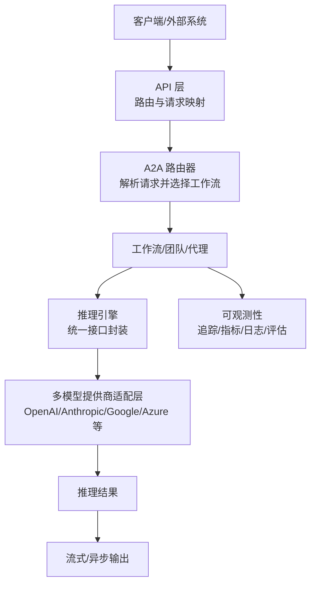
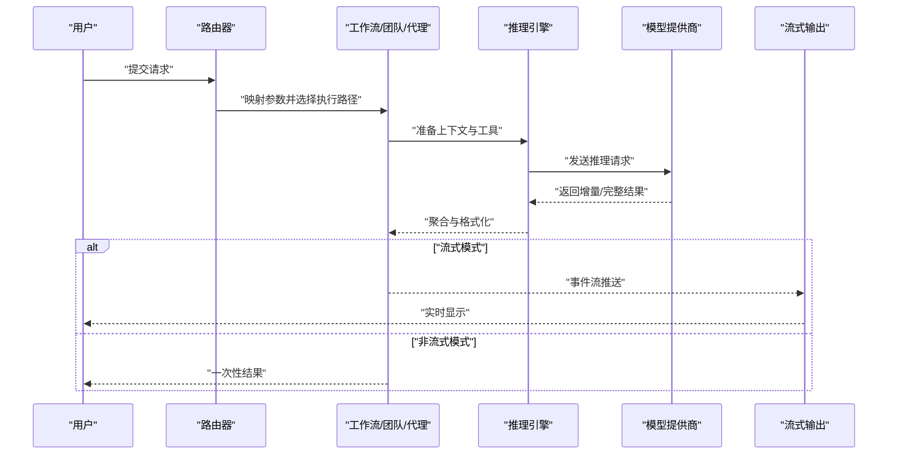
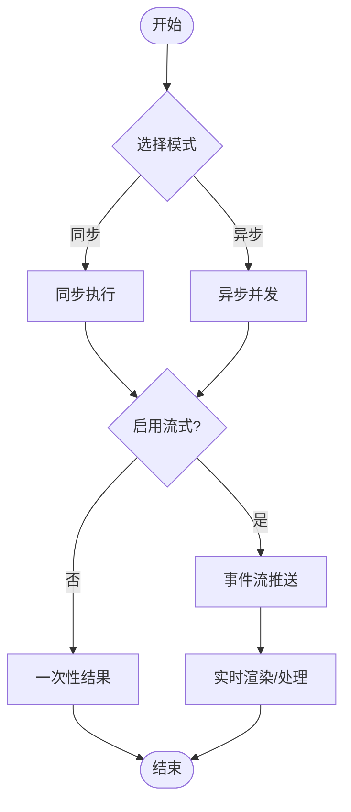
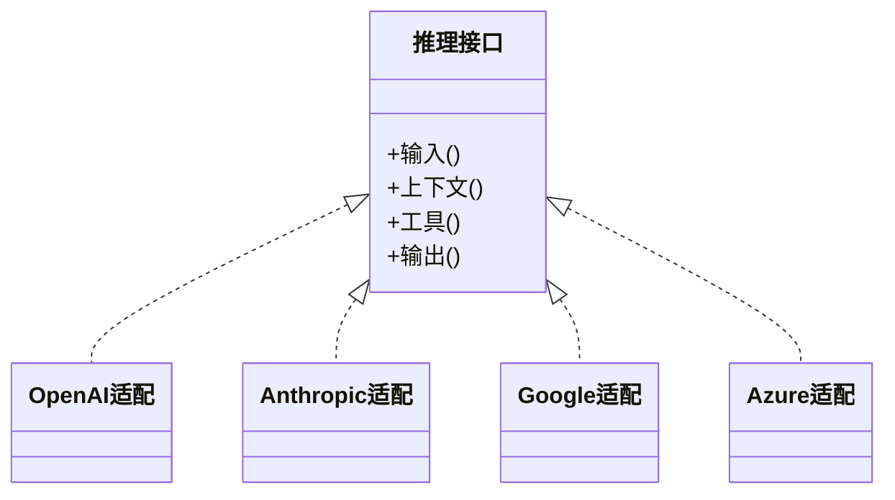
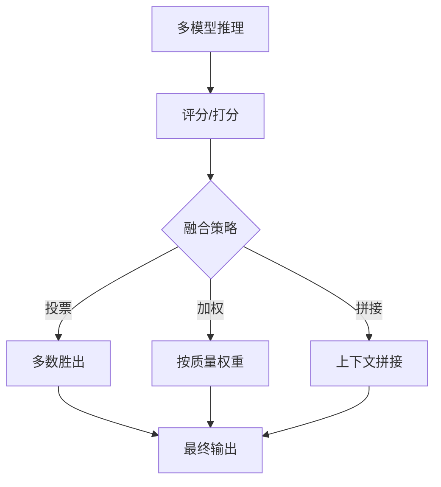
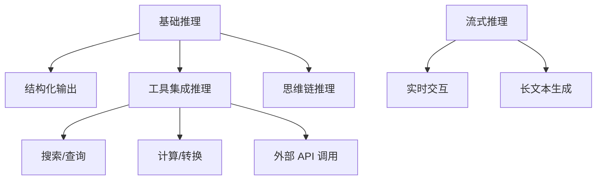
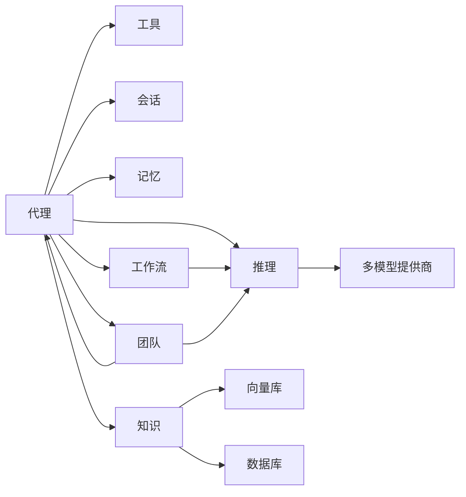

# 模型推理

<cite>
**本文引用的文件**
- [README.md](file://README.md)
- [pyproject.toml](file://pyproject.toml)
- [requirements.txt](file://requirements.txt)
- [libs/agno/agno/__init__.py](file://libs/agno/agno/__init__.py)
- [libs/agno/agno/agent/agent.py](file://libs/agno/agno/agent/agent.py)
- [libs/agno/agno/agent/_run.py](file://libs/agno/agno/agent/_run.py)
- [libs/agno/agno/agent/_run_options.py](file://libs/agno/agno/agent/_run_options.py)
- [libs/agno/agno/agent/_response.py](file://libs/agno/agno/agent/_response.py)
- [libs/agno/agno/workflow/workflow.py](file://libs/agno/agno/workflow/workflow.py)
- [libs/agno/agno/team/team.py](file://libs/agno/agno/team/team.py)
- [libs/agno/agno/os/interfaces/a2a/router.py](file://libs/agno/agno/os/interfaces/a2a/router.py)
- [cookbook/00_quickstart/run.py](file://cookbook/00_quickstart/run.py)
- [cookbook/01_demo/run.py](file://cookbook/01_demo/run.py)
- [cookbook/02_agents/02_input_output/streaming.py](file://cookbook/02_agents/02_input_output/streaming.py)
- [cookbook/03_teams/08_streaming/streaming.py](file://cookbook/03_teams/08_streaming/streaming.py)
- [cookbook/04_workflows/01_basic_workflows/03_function_workflows/function_workflow.py](file://cookbook/04_workflows/01_basic_workflows/03_function_workflows/function_workflow.py)
- [cookbook/04_workflows/02_conditional_execution/condition_with_parallel.py](file://cookbook/04_workflows/02_conditional_execution/condition_with_parallel.py)
- [cookbook/04_workflows/04_parallel_execution/parallel_basic.py](file://cookbook/04_workflows/04_parallel_execution/parallel_basic.py)
- [cookbook/04_workflows/04_parallel_execution/parallel_with_condition.py](file://cookbook/04_workflows/04_parallel_execution/parallel_with_condition.py)
- [cookbook/05_agent_os/advanced_demo/reasoning_model.py](file://cookbook/05_agent_os/advanced_demo/reasoning_model.py)
- [cookbook/08_learning/06_quick_tests/04_claude_model.md](file://cookbook/08_learning/06_quick_tests/04_claude_model.md)
- [cookbook/02_agents/14_advanced/cache_model_response.py](file://cookbook/02_agents/14_advanced/cache_model_response.py)
- [cookbook/02_agents/14_advanced/multi_model_metrics.py](file://cookbook/02_agents/14_advanced/multi_model_metrics.py)
- [cookbook/03_teams/14_run_control/model_inheritance.py](file://cookbook/03_teams/14_run_control/model_inheritance.py)
- [cookbook/02_agents/13_reasoning/reasoning_with_model.py](file://cookbook/02_agents/13_reasoning/reasoning_with_model.py)
- [cookbook/03_teams/04_structured_input_output/output_model.py](file://cookbook/03_teams/04_structured_input_output/output_model.py)
- [cookbook/02_agents/02_input_output/output_model.py](file://cookbook/02_agents/02_input_output/output_model.py)
- [cookbook/01_demo/agents/dash/context/semantic_model.py](file://cookbook/01_demo/agents/dash/context/semantic_model.py)
- [libs/agno/agno/reasoning/base.py](file://libs/agno/agno/reasoning/base.py)
- [libs/agno/agno/reasoning/reasoning.py](file://libs/agno/agno/reasoning/reasoning.py)
- [libs/agno/agno/knowledge/knowledge.py](file://libs/agno/agno/knowledge/knowledge.py)
- [libs/agno/agno/knowledge/content.py](file://libs/agno/agno/knowledge/content.py)
- [libs/agno/agno/memory/memory.py](file://libs/agno/agno/memory/memory.py)
- [libs/agno/agno/session/session.py](file://libs/agno/agno/session/session.py)
- [libs/agno/agno/tools/tools.py](file://libs/agno/agno/tools/tools.py)
- [libs/agno/agno/utils/utils.py](file://libs/agno/agno/utils/utils.py)
- [libs/agno/agno/db/base.py](file://libs/agno/agno/db/base.py)
- [libs/agno/agno/vectordb/base.py](file://libs/agno/agno/vectordb/base.py)
- [libs/agno/agno/metrics.py](file://libs/agno/agno/metrics.py)
- [libs/agno/agno/tracing/tracing.py](file://libs/agno/agno/tracing/tracing.py)
- [libs/agno/agno/integrations/observability/tracing.py](file://libs/agno/agno/integrations/observability/tracing.py)
- [libs/agno/agno/integrations/observability/metrics.py](file://libs/agno/agno/integrations/observability/metrics.py)
- [libs/agno/agno/integrations/observability/logs.py](file://libs/agno/agno/integrations/observability/logs.py)
- [libs/agno/agno/eval/performance.py](file://libs/agno/agno/eval/performance.py)
- [libs/agno/agno/eval/reliability.py](file://libs/agno/agno/eval/reliability.py)
- [libs/agno/agno/eval/accuracy.py](file://libs/agno/agno/eval/accuracy.py)
</cite>

## 目录
1. [简介](#简介)
2. [项目结构](#项目结构)
3. [核心组件](#核心组件)
4. [架构总览](#架构总览)
5. [详细组件分析](#详细组件分析)
6. [依赖关系分析](#依赖关系分析)
7. [性能考量](#性能考量)
8. [故障排查指南](#故障排查指南)
9. [结论](#结论)
10. [附录](#附录)

## 简介
本文件围绕多模型推理系统进行系统化梳理，覆盖以下关键主题：
- 多模型提供商集成：OpenAI、Anthropic、Google、Azure 等主流推理服务的接入与抽象。
- 推理模型选择策略：基于任务类型、成本、延迟与质量的权衡。
- 推理路径规划与结果融合：串行、并行、条件分支与多模型投票/拼接。
- 异步推理与流式响应：事件流、增量输出与实时交互。
- 推理模式应用：基础推理、流式推理、工具集成推理、结构化输出、思维链推理等。
- 配置、参数调优与性能监控：环境变量、运行选项、缓存与指标采集。

## 项目结构
该仓库以“示例与库并重”的方式组织，核心推理能力由 agno 库提供，cookbook 中通过大量示例展示如何在真实场景中使用这些能力。关键目录与职责如下：
- libs/agno：核心库，包含代理、工作流、团队、知识、记忆、会话、工具、推理、评估与可观测性等模块。
- cookbook：丰富的示例与最佳实践，涵盖推理、流式、工具、多模态、团队协作、评估与监控等主题。
- 根目录配置：项目元信息、依赖声明与脚本入口。

```mermaid
graph TB
subgraph "示例与演示"
CQ["快速开始示例<br/>cookbook/00_quickstart"]
CD["演示示例<br/>cookbook/01_demo"]
CA["代理示例集<br/>cookbook/02_agents"]
CT["团队示例集<br/>cookbook/03_teams"]
CW["工作流示例集<br/>cookbook/04_workflows"]
COA["Agent OS 示例<br/>cookbook/05_agent_os"]
end
subgraph "核心库"
LAA["agno/__init__.py"]
LAAG["agent/agent.py"]
LAAR["agent/_run.py"]
LAARO["agent/_run_options.py"]
LAARes["agent/_response.py"]
LAW["workflow/workflow.py"]
LAT["team/team.py"]
LAOS["os/interfaces/a2a/router.py"]
LARE["reasoning/base.py"]
LAK["knowledge/knowledge.py"]
LAM["memory/memory.py"]
LAS["session/session.py"]
LATs["tools/tools.py"]
LAU["utils/utils.py"]
LADB["db/base.py"]
LAVD["vectordb/base.py"]
LAMet["metrics.py"]
LATr["tracing/tracing.py"]
LAIObs["integrations/observability/*"]
LAEval["eval/*"]
end
CQ --> LAA
CD --> LAA
CA --> LAA
CT --> LAA
CW --> LAA
COA --> LAA
LAA --> LAAG
LAA --> LAAR
LAA --> LAARO
LAA --> LAARes
LAA --> LAW
LAA --> LAT
LAA --> LAOS
LAA --> LARE
LAA --> LAK
LAA --> LAM
LAA --> LAS
LAA --> LATs
LAA --> LAU
LAA --> LADB
LAA --> LAVD
LAA --> LAMet
LAA --> LATr
LAA --> LAIObs
LAA --> LAEval
```

**图表来源**
- [libs/agno/agno/__init__.py](file://libs/agno/agno/__init__.py)
- [libs/agno/agno/agent/agent.py](file://libs/agno/agno/agent/agent.py)
- [libs/agno/agno/agent/_run.py](file://libs/agno/agno/agent/_run.py)
- [libs/agno/agno/agent/_run_options.py](file://libs/agno/agno/agent/_run_options.py)
- [libs/agno/agno/agent/_response.py](file://libs/agno/agno/agent/_response.py)
- [libs/agno/agno/workflow/workflow.py](file://libs/agno/agno/workflow/workflow.py)
- [libs/agno/agno/team/team.py](file://libs/agno/agno/team/team.py)
- [libs/agno/agno/os/interfaces/a2a/router.py](file://libs/agno/agno/os/interfaces/a2a/router.py)
- [libs/agno/agno/reasoning/base.py](file://libs/agno/agno/reasoning/base.py)
- [libs/agno/agno/knowledge/knowledge.py](file://libs/agno/agno/knowledge/knowledge.py)
- [libs/agno/agno/memory/memory.py](file://libs/agno/agno/memory/memory.py)
- [libs/agno/agno/session/session.py](file://libs/agno/agno/session/session.py)
- [libs/agno/agno/tools/tools.py](file://libs/agno/agno/tools/tools.py)
- [libs/agno/agno/utils/utils.py](file://libs/agno/agno/utils/utils.py)
- [libs/agno/agno/db/base.py](file://libs/agno/agno/db/base.py)
- [libs/agno/agno/vectordb/base.py](file://libs/agno/agno/vectordb/base.py)
- [libs/agno/agno/metrics.py](file://libs/agno/agno/metrics.py)
- [libs/agno/agno/tracing/tracing.py](file://libs/agno/agno/tracing/tracing.py)
- [libs/agno/agno/integrations/observability/tracing.py](file://libs/agno/agno/integrations/observability/tracing.py)
- [libs/agno/agno/integrations/observability/metrics.py](file://libs/agno/agno/integrations/observability/metrics.py)
- [libs/agno/agno/integrations/observability/logs.py](file://libs/agno/agno/integrations/observability/logs.py)
- [libs/agno/agno/eval/performance.py](file://libs/agno/agno/eval/performance.py)
- [libs/agno/agno/eval/reliability.py](file://libs/agno/agno/eval/reliability.py)
- [libs/agno/agno/eval/accuracy.py](file://libs/agno/agno/eval/accuracy.py)

**章节来源**
- [README.md](file://README.md)
- [pyproject.toml](file://pyproject.toml)
- [requirements.txt](file://requirements.txt)

## 核心组件
- 代理（Agent）：负责对话、状态管理、工具调用与推理编排。
- 工作流（Workflow）：面向流程化的多步骤推理与执行，支持同步/异步与流式。
- 团队（Team）：多代理协作，实现复杂推理与决策。
- 推理（Reasoning）：结构化推理与思维链支持。
- 知识（Knowledge）：检索增强与上下文构建。
- 记忆（Memory）：会话与经验沉淀。
- 会话（Session）：上下文与状态持久化。
- 工具（Tools）：外部能力扩展与工具调用。
- 可观测性（Tracing/Metrics/Logs/Eval）：性能、可靠性与准确性评估。
- 数据与向量库（DB/Vectordb）：数据存储与检索基础设施。

**章节来源**
- [libs/agno/agno/agent/agent.py](file://libs/agno/agno/agent/agent.py)
- [libs/agno/agno/workflow/workflow.py](file://libs/agno/agno/workflow/workflow.py)
- [libs/agno/agno/team/team.py](file://libs/agno/agno/team/team.py)
- [libs/agno/agno/reasoning/base.py](file://libs/agno/agno/reasoning/base.py)
- [libs/agno/agno/knowledge/knowledge.py](file://libs/agno/agno/knowledge/knowledge.py)
- [libs/agno/agno/memory/memory.py](file://libs/agno/agno/memory/memory.py)
- [libs/agno/agno/session/session.py](file://libs/agno/agno/session/session.py)
- [libs/agno/agno/tools/tools.py](file://libs/agno/agno/tools/tools.py)
- [libs/agno/agno/metrics.py](file://libs/agno/agno/metrics.py)
- [libs/agno/agno/tracing/tracing.py](file://libs/agno/agno/tracing/tracing.py)
- [libs/agno/agno/integrations/observability/tracing.py](file://libs/agno/agno/integrations/observability/tracing.py)
- [libs/agno/agno/integrations/observability/metrics.py](file://libs/agno/agno/integrations/observability/metrics.py)
- [libs/agno/agno/integrations/observability/logs.py](file://libs/agno/agno/integrations/observability/logs.py)
- [libs/agno/agno/eval/performance.py](file://libs/agno/agno/eval/performance.py)
- [libs/agno/agno/eval/reliability.py](file://libs/agno/agno/eval/reliability.py)
- [libs/agno/agno/eval/accuracy.py](file://libs/agno/agno/eval/accuracy.py)

## 架构总览
多模型推理系统采用“抽象统一 + 插件化接入”的设计，核心思想是：
- 统一推理接口：无论底层是 OpenAI、Anthropic、Google 还是 Azure，对外暴露一致的调用协议。
- 路径编排：通过工作流与团队实现串行、并行、条件分支与多模型融合。
- 流式与异步：支持增量输出与并发执行，满足实时与高吞吐需求。
- 可观测性：埋点、指标与日志贯穿推理全链路，便于性能与质量治理。

**图表来源**
- [libs/agno/agno/os/interfaces/a2a/router.py](file://libs/agno/agno/os/interfaces/a2a/router.py)
- [libs/agno/agno/workflow/workflow.py](file://libs/agno/agno/workflow/workflow.py)
- [libs/agno/agno/team/team.py](file://libs/agno/agno/team/team.py)
- [libs/agno/agno/agent/agent.py](file://libs/agno/agno/agent/agent.py)
- [libs/agno/agno/reasoning/base.py](file://libs/agno/agno/reasoning/base.py)

## 详细组件分析

### 推理接口与运行选项
- 统一推理接口：通过代理与工作流的运行方法，抽象出输入、上下文、工具与输出的标准化流程。
- 运行选项：控制是否流式、并发、超时、重试与结果格式等。
- 响应处理：支持同步返回与事件流两种模式，便于前端实时渲染与后端批处理。

**图表来源**
- [libs/agno/agno/os/interfaces/a2a/router.py](file://libs/agno/agno/os/interfaces/a2a/router.py)
- [libs/agno/agno/workflow/workflow.py](file://libs/agno/agno/workflow/workflow.py)
- [libs/agno/agno/team/team.py](file://libs/agno/agno/team/team.py)
- [libs/agno/agno/agent/_run.py](file://libs/agno/agno/agent/_run.py)
- [libs/agno/agno/agent/_run_options.py](file://libs/agno/agno/agent/_run_options.py)
- [libs/agno/agno/agent/_response.py](file://libs/agno/agno/agent/_response.py)

**章节来源**
- [libs/agno/agno/agent/_run.py](file://libs/agno/agno/agent/_run.py)
- [libs/agno/agno/agent/_run_options.py](file://libs/agno/agno/agent/_run_options.py)
- [libs/agno/agno/agent/_response.py](file://libs/agno/agno/agent/_response.py)
- [libs/agno/agno/workflow/workflow.py](file://libs/agno/agno/workflow/workflow.py)
- [libs/agno/agno/team/team.py](file://libs/agno/agno/team/team.py)

### 流式推理与异步执行
- 流式推理：在工作流与团队中均提供流式开关，支持边生成边输出，适用于聊天、摘要与长文本生成。
- 异步执行：支持协程并发调用，提升吞吐；结合事件流可实现多源结果的合并与排序。
- 示例覆盖：从基础工作流到并行与条件分支，均有同步/异步与流式的组合用法。

**图表来源**
- [cookbook/04_workflows/01_basic_workflows/03_function_workflows/function_workflow.py](file://cookbook/04_workflows/01_basic_workflows/03_function_workflows/function_workflow.py)
- [cookbook/04_workflows/02_conditional_execution/condition_with_parallel.py](file://cookbook/04_workflows/02_conditional_execution/condition_with_parallel.py)
- [cookbook/04_workflows/04_parallel_execution/parallel_basic.py](file://cookbook/04_workflows/04_parallel_execution/parallel_basic.py)
- [cookbook/04_workflows/04_parallel_execution/parallel_with_condition.py](file://cookbook/04_workflows/04_parallel_execution/parallel_with_condition.py)
- [cookbook/02_agents/02_input_output/streaming.py](file://cookbook/02_agents/02_input_output/streaming.py)
- [cookbook/03_teams/08_streaming/streaming.py](file://cookbook/03_teams/08_streaming/streaming.py)

**章节来源**
- [cookbook/02_agents/02_input_output/streaming.py](file://cookbook/02_agents/02_input_output/streaming.py)
- [cookbook/03_teams/08_streaming/streaming.py](file://cookbook/03_teams/08_streaming/streaming.py)
- [cookbook/04_workflows/01_basic_workflows/03_function_workflows/function_workflow.py](file://cookbook/04_workflows/01_basic_workflows/03_function_workflows/function_workflow.py)
- [cookbook/04_workflows/02_conditional_execution/condition_with_parallel.py](file://cookbook/04_workflows/02_conditional_execution/condition_with_parallel.py)
- [cookbook/04_workflows/04_parallel_execution/parallel_basic.py](file://cookbook/04_workflows/04_parallel_execution/parallel_basic.py)
- [cookbook/04_workflows/04_parallel_execution/parallel_with_condition.py](file://cookbook/04_workflows/04_parallel_execution/parallel_with_condition.py)

### 多模型提供商集成与选择策略
- 抽象适配：通过统一推理接口对接不同提供商，隐藏差异。
- 选择策略：根据任务类型（问答、生成、结构化输出）、质量要求（准确性、创造性）、成本与延迟目标进行模型选择；必要时采用多模型投票或拼接策略。
- 配置与参数：通过运行选项与环境变量控制温度、最大令牌数、工具启用等；示例中展示了结构化输出与模型继承等高级用法。

**图表来源**
- [libs/agno/agno/reasoning/base.py](file://libs/agno/agno/reasoning/base.py)
- [cookbook/03_teams/14_run_control/model_inheritance.py](file://cookbook/03_teams/14_run_control/model_inheritance.py)
- [cookbook/02_agents/02_input_output/output_model.py](file://cookbook/02_agents/02_input_output/output_model.py)
- [cookbook/03_teams/04_structured_input_output/output_model.py](file://cookbook/03_teams/04_structured_input_output/output_model.py)

**章节来源**
- [libs/agno/agno/reasoning/base.py](file://libs/agno/agno/reasoning/base.py)
- [cookbook/03_teams/14_run_control/model_inheritance.py](file://cookbook/03_teams/14_run_control/model_inheritance.py)
- [cookbook/02_agents/02_input_output/output_model.py](file://cookbook/02_agents/02_input_output/output_model.py)
- [cookbook/03_teams/04_structured_input_output/output_model.py](file://cookbook/03_teams/04_structured_input_output/output_model.py)

### 结果融合与多模型策略
- 融合策略：对来自多个模型的输出进行评分、加权或投票，选择最优或综合结果。
- 缓存与复用：对常见问题的结果进行缓存，降低重复推理成本。
- 指标与评估：通过性能、可靠性与准确性评估，持续优化模型选择与参数。

**图表来源**
- [cookbook/02_agents/14_advanced/multi_model_metrics.py](file://cookbook/02_agents/14_advanced/multi_model_metrics.py)
- [cookbook/02_agents/14_advanced/cache_model_response.py](file://cookbook/02_agents/14_advanced/cache_model_response.py)
- [libs/agno/agno/eval/performance.py](file://libs/agno/agno/eval/performance.py)
- [libs/agno/agno/eval/reliability.py](file://libs/agno/agno/eval/reliability.py)
- [libs/agno/agno/eval/accuracy.py](file://libs/agno/agno/eval/accuracy.py)

**章节来源**
- [cookbook/02_agents/14_advanced/multi_model_metrics.py](file://cookbook/02_agents/14_advanced/multi_model_metrics.py)
- [cookbook/02_agents/14_advanced/cache_model_response.py](file://cookbook/02_agents/14_advanced/cache_model_response.py)
- [libs/agno/agno/eval/performance.py](file://libs/agno/agno/eval/performance.py)
- [libs/agno/agno/eval/reliability.py](file://libs/agno/agno/eval/reliability.py)
- [libs/agno/agno/eval/accuracy.py](file://libs/agno/agno/eval/accuracy.py)

### 推理模式与应用场景
- 基础推理：单轮问答、摘要与简单生成。
- 流式推理：实时聊天、长文本生成与可视化反馈。
- 工具集成推理：结合工具完成搜索、计算、调用外部 API 等。
- 结构化输出：将模型输出约束到特定 Schema，便于下游解析与入库。
- 思维链推理：通过中间思考步骤提升复杂任务的可解释性与正确率。

**图表来源**
- [cookbook/02_agents/13_reasoning/reasoning_with_model.py](file://cookbook/02_agents/13_reasoning/reasoning_with_model.py)
- [cookbook/02_agents/02_input_output/output_model.py](file://cookbook/02_agents/02_input_output/output_model.py)
- [cookbook/03_teams/04_structured_input_output/output_model.py](file://cookbook/03_teams/04_structured_input_output/output_model.py)
- [cookbook/02_agents/02_input_output/streaming.py](file://cookbook/02_agents/02_input_output/streaming.py)
- [libs/agno/agno/tools/tools.py](file://libs/agno/agno/tools/tools.py)

**章节来源**
- [cookbook/02_agents/13_reasoning/reasoning_with_model.py](file://cookbook/02_agents/13_reasoning/reasoning_with_model.py)
- [cookbook/02_agents/02_input_output/output_model.py](file://cookbook/02_agents/02_input_output/output_model.py)
- [cookbook/03_teams/04_structured_input_output/output_model.py](file://cookbook/03_teams/04_structured_input_output/output_model.py)
- [cookbook/02_agents/02_input_output/streaming.py](file://cookbook/02_agents/02_input_output/streaming.py)
- [libs/agno/agno/tools/tools.py](file://libs/agno/agno/tools/tools.py)

### 配置、参数调优与性能监控
- 配置项：运行选项、环境变量、模型参数（温度、最大令牌数、工具启用等）。
- 参数调优：通过示例中的结构化输出与模型继承，学习如何针对不同任务调整参数。
- 性能监控：利用指标、追踪与日志，观察延迟、吞吐与错误率，结合评估指标持续改进。

**章节来源**
- [libs/agno/agno/agent/_run_options.py](file://libs/agno/agno/agent/_run_options.py)
- [libs/agno/agno/metrics.py](file://libs/agno/agno/metrics.py)
- [libs/agno/agno/tracing/tracing.py](file://libs/agno/agno/tracing/tracing.py)
- [libs/agno/agno/integrations/observability/metrics.py](file://libs/agno/agno/integrations/observability/metrics.py)
- [libs/agno/agno/integrations/observability/tracing.py](file://libs/agno/agno/integrations/observability/tracing.py)
- [libs/agno/agno/integrations/observability/logs.py](file://libs/agno/agno/integrations/observability/logs.py)
- [libs/agno/agno/eval/performance.py](file://libs/agno/agno/eval/performance.py)
- [libs/agno/agno/eval/reliability.py](file://libs/agno/agno/eval/reliability.py)
- [libs/agno/agno/eval/accuracy.py](file://libs/agno/agno/eval/accuracy.py)

## 依赖关系分析
- 组件耦合：代理、工作流与团队依赖推理与工具模块；知识与记忆提供上下文；数据库与向量库支撑检索与存储。
- 外部依赖：示例与库通过 pyproject.toml/requirements.txt 声明依赖，确保可复现性。
- 循环依赖规避：通过清晰的模块边界与接口抽象，避免循环导入。

**图表来源**
- [libs/agno/agno/agent/agent.py](file://libs/agno/agno/agent/agent.py)
- [libs/agno/agno/workflow/workflow.py](file://libs/agno/agno/workflow/workflow.py)
- [libs/agno/agno/team/team.py](file://libs/agno/agno/team/team.py)
- [libs/agno/agno/reasoning/base.py](file://libs/agno/agno/reasoning/base.py)
- [libs/agno/agno/knowledge/knowledge.py](file://libs/agno/agno/knowledge/knowledge.py)
- [libs/agno/agno/memory/memory.py](file://libs/agno/agno/memory/memory.py)
- [libs/agno/agno/session/session.py](file://libs/agno/agno/session/session.py)
- [libs/agno/agno/tools/tools.py](file://libs/agno/agno/tools/tools.py)
- [libs/agno/agno/vectordb/base.py](file://libs/agno/agno/vectordb/base.py)
- [libs/agno/agno/db/base.py](file://libs/agno/agno/db/base.py)

**章节来源**
- [pyproject.toml](file://pyproject.toml)
- [requirements.txt](file://requirements.txt)

## 性能考量
- 并发与流式：优先采用异步与流式，减少等待时间，提升用户体验。
- 缓存策略：对高频、低变化的输入结果进行缓存，显著降低延迟与成本。
- 模型选择：根据任务特性选择合适模型，必要时采用多模型融合，平衡质量与速度。
- 监控与评估：建立端到端指标体系，持续跟踪性能与可靠性，及时发现瓶颈。

## 故障排查指南
- 请求映射与路由：检查路由器参数映射与工作流选择逻辑，确保输入被正确解析。
- 流式异常：确认流式开关与事件流处理逻辑，避免阻塞或丢帧。
- 工具调用失败：验证工具权限、参数与外部服务可用性。
- 指标缺失：检查追踪与指标上报配置，确保关键节点埋点完整。

**章节来源**
- [libs/agno/agno/os/interfaces/a2a/router.py](file://libs/agno/agno/os/interfaces/a2a/router.py)
- [libs/agno/agno/agent/_run.py](file://libs/agno/agno/agent/_run.py)
- [libs/agno/agno/agent/_run_options.py](file://libs/agno/agno/agent/_run_options.py)
- [libs/agno/agno/tracing/tracing.py](file://libs/agno/agno/tracing/tracing.py)
- [libs/agno/agno/integrations/observability/tracing.py](file://libs/agno/agno/integrations/observability/tracing.py)

## 结论
该多模型推理系统通过统一接口、灵活编排与可观测性，实现了从基础问答到复杂推理与实时交互的全栈能力。结合示例中的流式、工具集成与结构化输出等实践，开发者可在不同场景下高效选择与优化推理模型，并通过缓存与评估持续提升性能与质量。

## 附录
- 快速开始与演示入口：示例入口脚本展示了同步、异步与流式的基本用法。
- 高级主题：结构化输出、模型继承、缓存与多模型指标等进阶实践。

**章节来源**
- [cookbook/00_quickstart/run.py](file://cookbook/00_quickstart/run.py)
- [cookbook/01_demo/run.py](file://cookbook/01_demo/run.py)
- [cookbook/02_agents/14_advanced/cache_model_response.py](file://cookbook/02_agents/14_advanced/cache_model_response.py)
- [cookbook/02_agents/14_advanced/multi_model_metrics.py](file://cookbook/02_agents/14_advanced/multi_model_metrics.py)
- [cookbook/03_teams/14_run_control/model_inheritance.py](file://cookbook/03_teams/14_run_control/model_inheritance.py)
- [cookbook/02_agents/02_input_output/output_model.py](file://cookbook/02_agents/02_input_output/output_model.py)
- [cookbook/03_teams/04_structured_input_output/output_model.py](file://cookbook/03_teams/04_structured_input_output/output_model.py)