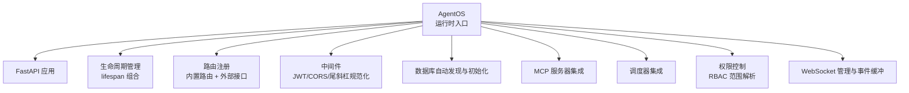
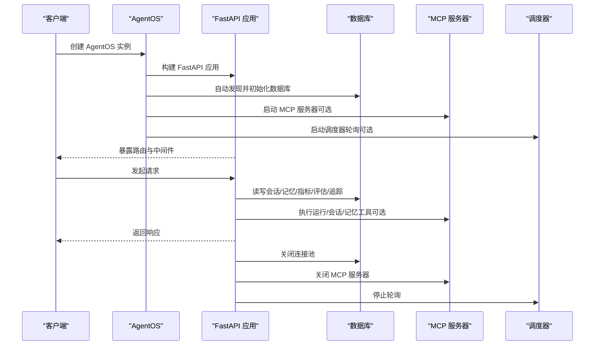
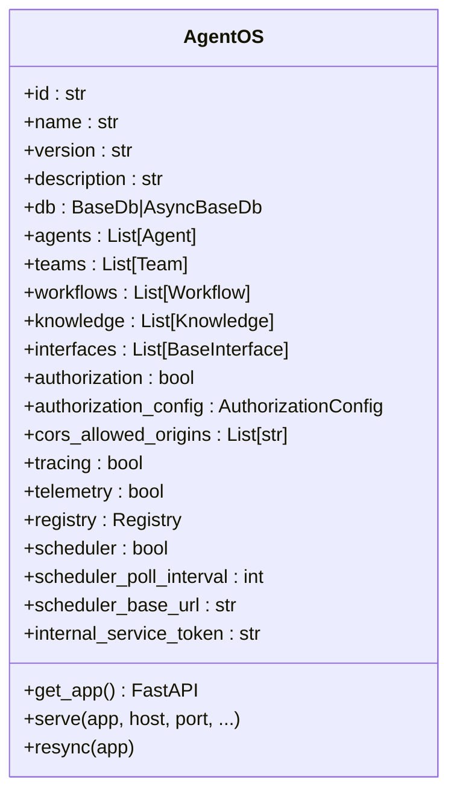
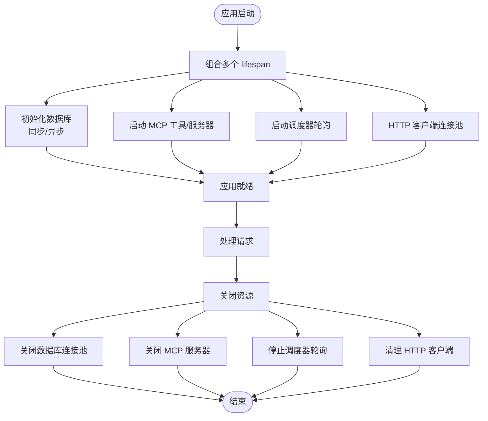
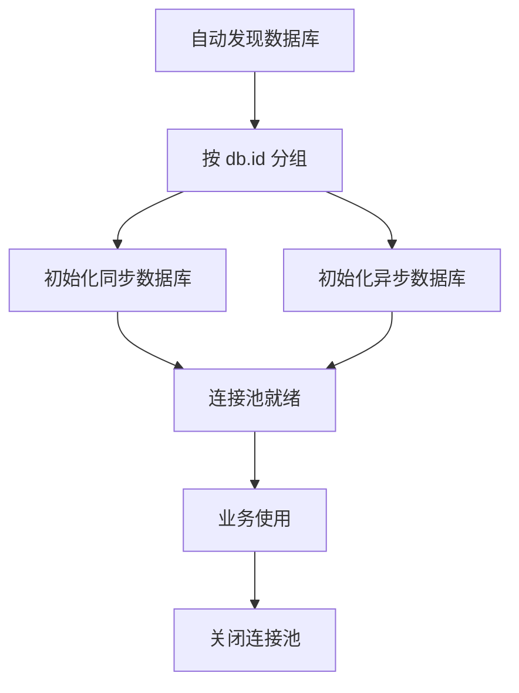
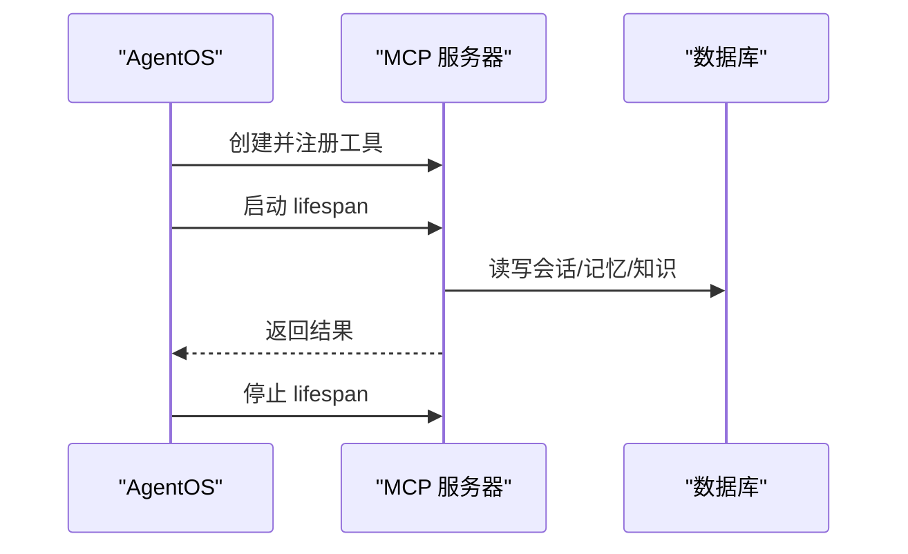
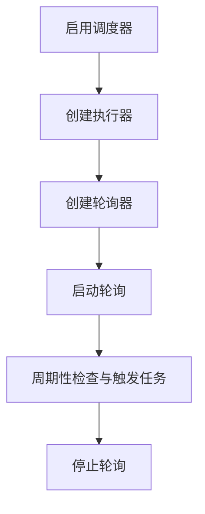
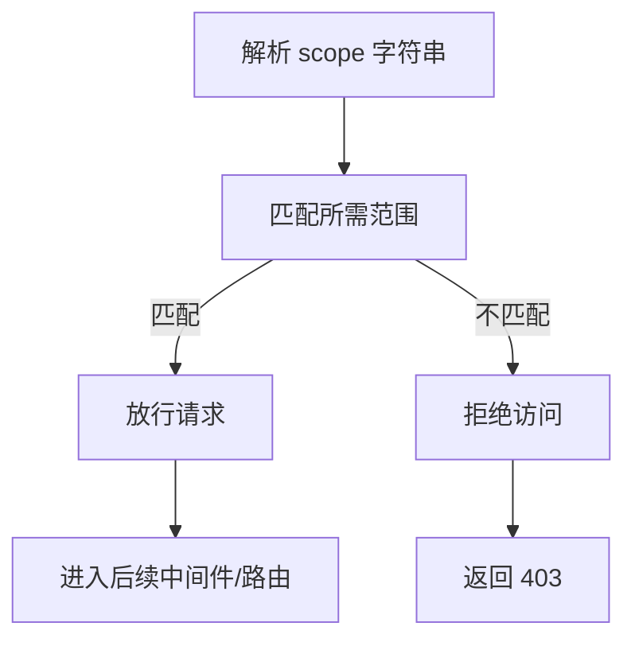
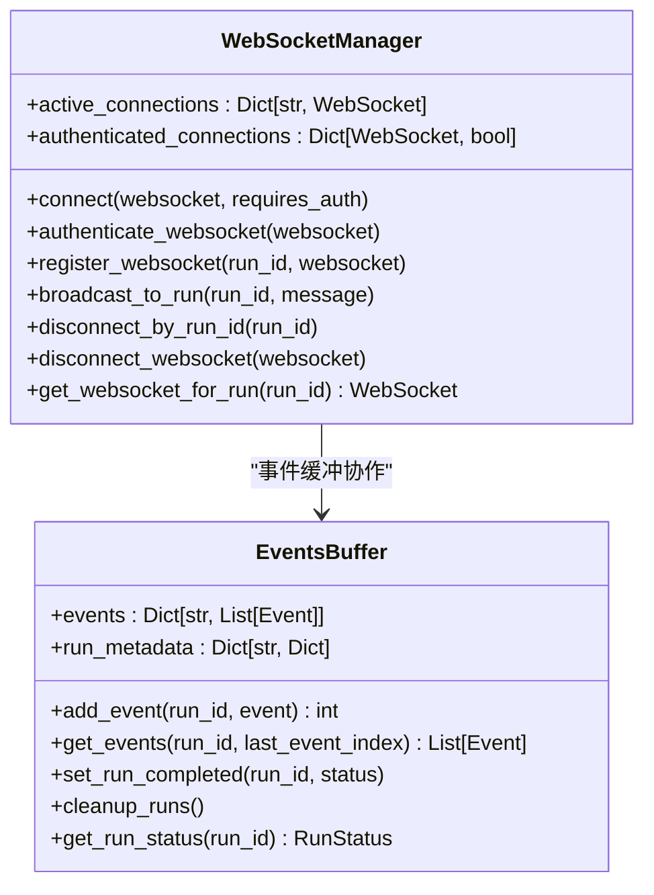
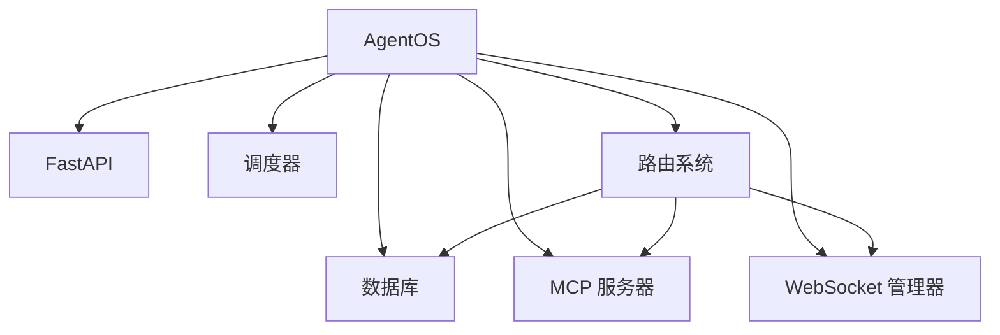

# AgentOS 运行时架构

<cite>
**本文引用的文件**
- [libs/agno/agno/os/app.py](file://libs/agno/agno/os/app.py)
- [libs/agno/agno/os/config.py](file://libs/agno/agno/os/config.py)
- [libs/agno/agno/os/mcp.py](file://libs/agno/agno/os/mcp.py)
- [libs/agno/agno/os/scopes.py](file://libs/agno/agno/os/scopes.py)
- [libs/agno/agno/os/managers.py](file://libs/agno/agno/os/managers.py)
</cite>

## 目录
1. [引言](#引言)
2. [项目结构](#项目结构)
3. [核心组件](#核心组件)
4. [架构总览](#架构总览)
5. [详细组件分析](#详细组件分析)
6. [依赖关系分析](#依赖关系分析)
7. [性能考量](#性能考量)
8. [故障排查指南](#故障排查指南)
9. [结论](#结论)
10. [附录：使用示例与最佳实践](#附录使用示例与最佳实践)

## 引言
本文件系统性阐述 AgentOS 的运行时架构，重点覆盖以下主题：
- 无状态设计理念与会话作用域机制
- FastAPI 应用生命周期管理与资源初始化流程
- AgentOS 类的核心职责：组件初始化、路由注册、中间件配置
- 数据库连接池管理、MCP 服务器集成、调度器配置
- 面向有经验开发者的架构剖析与最佳实践

AgentOS 将多智能体系统（Agent）、团队（Team）、工作流（Workflow）统一在一个运行时中，通过可插拔的接口与上下文数据库实现“无状态”服务端与“有状态”会话的解耦，同时提供可选的授权、追踪与可观测能力。

## 项目结构
AgentOS 运行时位于 agno/os 子模块，核心文件如下：
- app.py：运行时主入口，负责 FastAPI 应用构建、生命周期组合、路由装配、中间件注入、异常处理与服务发布
- config.py：运行时配置模型，涵盖会话、知识、内存、指标、评估、追踪等域的配置结构
- mcp.py：MCP（Model Context Protocol）服务器实现，提供运行、会话、记忆等工具
- scopes.py：RBAC 权限范围定义与匹配逻辑
- managers.py：WebSocket 管理与事件缓冲，支撑实时流式输出与断线重连

图表来源
- [libs/agno/agno/os/app.py:190-851](file://libs/agno/agno/os/app.py#L190-L851)
- [libs/agno/agno/os/mcp.py:49-800](file://libs/agno/agno/os/mcp.py#L49-L800)
- [libs/agno/agno/os/scopes.py:26-488](file://libs/agno/agno/os/scopes.py#L26-L488)
- [libs/agno/agno/os/managers.py:92-327](file://libs/agno/agno/os/managers.py#L92-L327)

章节来源
- [libs/agno/agno/os/app.py:190-851](file://libs/agno/agno/os/app.py#L190-L851)

## 核心组件
- AgentOS 类：运行时核心，负责组件初始化、路由装配、生命周期组合、中间件注入、异常处理、服务发布
- FastAPI 应用：承载所有路由、中间件与生命周期钩子
- 生命周期管理：将多个资源的生命周期（数据库、MCP 工具、HTTP 客户端、调度器）合并为单一 FastAPI lifespan
- 路由系统：内置路由（会话、记忆、评估、指标、知识、追踪、数据库、注册表、计划任务、审批等），并支持外部接口路由挂载
- 中间件体系：CORS、JWT 授权、尾斜杠规范化
- 数据库层：自动发现与初始化同步/异步数据库，统一连接池管理
- MCP 服务器：独立的 FastMCP 实例，提供运行、会话、记忆等工具
- 调度器：基于轮询的任务执行器，与数据库配合实现定时任务
- RBAC 权限：基于范围字符串的细粒度授权
- WebSocket 管理：连接注册、认证、广播、事件缓冲与断线重连

章节来源
- [libs/agno/agno/os/app.py:190-851](file://libs/agno/agno/os/app.py#L190-L851)
- [libs/agno/agno/os/mcp.py:49-800](file://libs/agno/agno/os/mcp.py#L49-L800)
- [libs/agno/agno/os/scopes.py:26-488](file://libs/agno/agno/os/scopes.py#L26-L488)
- [libs/agno/agno/os/managers.py:92-327](file://libs/agno/agno/os/managers.py#L92-L327)

## 架构总览
AgentOS 的运行时以“无状态服务 + 会话状态存储”的方式组织：
- 服务端无状态：路由与业务逻辑不保存会话状态，仅通过数据库或远程知识库持久化
- 会话作用域：每个请求在会话维度内进行访问控制与数据隔离
- 生命周期：数据库、MCP 工具、HTTP 客户端、调度器均通过 FastAPI lifespan 管理，确保正确初始化与关闭
- 可扩展接口：支持 A2A、Slack、WhatsApp 等接口，统一通过路由挂载

图表来源
- [libs/agno/agno/os/app.py:656-851](file://libs/agno/agno/os/app.py#L656-L851)
- [libs/agno/agno/os/mcp.py:49-800](file://libs/agno/agno/os/mcp.py#L49-L800)

## 详细组件分析

### AgentOS 类与生命周期管理
- 初始化阶段
  - 解析配置（YAML 或对象），设置实例元信息（名称、版本、描述、ID）
  - 收集并初始化 Agent、Team、Workflow，自动注入默认数据库、追踪事件存储、后台钩子策略
  - 注册到 Registry，避免重复 ID
  - 可选启用追踪与遥测上报
- 应用构建阶段
  - 若传入 base_app，则将其作为宿主应用；否则创建新的 FastAPI 应用
  - 组合多段 lifespan：用户自定义 lifespan、MCP 工具、MCP 服务器、数据库、调度器、HTTP 客户端清理
  - 注册内置路由与外部接口路由
  - 注入中间件（CORS、JWT、尾斜杠规范化）
  - 设置 app.state 字段（agent_os_id、cors_allowed_origins、内部令牌等）
- 路由装配阶段
  - 清理冲突路由（可选择保留用户路由或 AgentOS 路由）
  - 动态装配会话、记忆、评估、指标、知识、追踪、数据库、组件、计划任务、审批、注册表等路由
  - 可选挂载 MCP 服务器
- 服务发布阶段
  - 使用 uvicorn 启动，支持热重载、日志与环境变量覆盖

图表来源
- [libs/agno/agno/os/app.py:190-851](file://libs/agno/agno/os/app.py#L190-L851)

章节来源
- [libs/agno/agno/os/app.py:190-851](file://libs/agno/agno/os/app.py#L190-L851)

### FastAPI 应用生命周期与资源初始化
- 生命周期组合
  - 用户 lifespan 包装（可向其注入 agent_os 参数）
  - MCP 工具连接/断开
  - MCP 服务器 lifespan
  - 数据库初始化（同步/异步）与关闭
  - 调度器轮询启动/停止
  - HTTP 客户端连接池清理
- 异常处理
  - 请求验证错误、HTTP 异常、下游 HTTPStatusError、通用异常的统一处理与日志记录
- 中间件
  - CORS 更新
  - JWT 授权中间件（算法、密钥来源、受众校验可配置）
  - 尾斜杠规范化

图表来源
- [libs/agno/agno/os/app.py:75-164](file://libs/agno/agno/os/app.py#L75-L164)
- [libs/agno/agno/os/app.py:98-141](file://libs/agno/agno/os/app.py#L98-L141)
- [libs/agno/agno/os/app.py:818-851](file://libs/agno/agno/os/app.py#L818-L851)

章节来源
- [libs/agno/agno/os/app.py:75-164](file://libs/agno/agno/os/app.py#L75-L164)
- [libs/agno/agno/os/app.py:98-141](file://libs/agno/agno/os/app.py#L98-L141)
- [libs/agno/agno/os/app.py:818-851](file://libs/agno/agno/os/app.py#L818-L851)

### 数据库连接池管理与自动发现
- 自动发现
  - 遍历 Agent、Team、Workflow、Knowledge、Interface，收集使用的数据库（同步/异步/远程）
  - 去重后按 db.id 分组，分别记录用于常规域与知识域
- 初始化
  - 同步数据库：调用 _create_all_tables（若存在）
  - 异步数据库：await _create_all_tables（若存在）
- 关闭
  - 统一关闭连接池，区分同步/异步
- 表名映射
  - 提供会话、文化、记忆、指标、评估、知识等表名映射，便于配置与调试

图表来源
- [libs/agno/agno/os/app.py:971-1090](file://libs/agno/agno/os/app.py#L971-L1090)

章节来源
- [libs/agno/agno/os/app.py:971-1090](file://libs/agno/agno/os/app.py#L971-L1090)

### MCP 服务器集成
- 服务器创建
  - 基于 FastMCP 创建独立的 MCP 应用，挂载到根路径
- 工具清单
  - 配置获取、运行 Agent/Team/Workflow、会话 CRUD、记忆 CRUD、知识检索等
- 数据库适配
  - 支持同步/异步/远程数据库，自动解析 db_id 并分发到对应实现
- 生命周期
  - 与 AgentOS lifespan 组合，随应用启动/停止

图表来源
- [libs/agno/agno/os/mcp.py:49-800](file://libs/agno/agno/os/mcp.py#L49-L800)

章节来源
- [libs/agno/agno/os/mcp.py:49-800](file://libs/agno/agno/os/mcp.py#L49-L800)

### 调度器配置
- 启停流程
  - 启动：创建 ScheduleExecutor 与 SchedulePoller，设置轮询间隔，启动轮询
  - 停止：停止轮询，释放资源
- 认证
  - 内部服务令牌必须设置，防止外部误触发
- 依赖
  - 需要已初始化的数据库，以便读取计划任务与执行状态

图表来源
- [libs/agno/agno/os/app.py:110-141](file://libs/agno/agno/os/app.py#L110-L141)

章节来源
- [libs/agno/agno/os/app.py:110-141](file://libs/agno/agno/os/app.py#L110-L141)

### RBAC 权限与中间件
- 权限范围
  - 全局资源：system、agents、teams、workflows、sessions、memories、knowledge、metrics、evals、traces
  - 资源级：agents:<agent-id>:run、teams:*:run 等
  - 管理员：agent_os:admin
- 范围解析
  - 解析 scope 字符串，判断是否匹配所需范围，支持通配符与资源 ID
- 中间件
  - JWT 中间件：支持多种密钥来源与算法，可配置受众校验
  - CORS 中间件：允许跨域访问
  - 尾斜杠规范化：统一路径风格

图表来源
- [libs/agno/agno/os/scopes.py:95-297](file://libs/agno/agno/os/scopes.py#L95-L297)
- [libs/agno/agno/os/app.py:830-885](file://libs/agno/agno/os/app.py#L830-L885)

章节来源
- [libs/agno/agno/os/scopes.py:95-297](file://libs/agno/agno/os/scopes.py#L95-L297)
- [libs/agno/agno/os/app.py:830-885](file://libs/agno/agno/os/app.py#L830-L885)

### WebSocket 管理与事件缓冲
- WebSocket 管理器
  - 连接接受、认证标记、注册 run_id 与连接映射、广播消息、断开清理
- 事件缓冲
  - 为每个 run_id 维护事件列表与元数据，支持断线重连后的增量拉取
  - 完成/取消/错误状态的运行在超时后清理

图表来源
- [libs/agno/agno/os/managers.py:92-327](file://libs/agno/agno/os/managers.py#L92-L327)

章节来源
- [libs/agno/agno/os/managers.py:92-327](file://libs/agno/agno/os/managers.py#L92-L327)

## 依赖关系分析
- 组件耦合
  - AgentOS 对 FastAPI、数据库、MCP、调度器、WebSocket 管理器存在直接依赖
  - 路由系统对数据库、知识库、接口层存在间接依赖
- 生命周期耦合
  - 数据库与调度器的启动顺序要求：先初始化数据库，再启动调度器
  - HTTP 客户端清理应最后执行，确保其他资源释放后再关闭连接池
- 循环依赖
  - 未见循环依赖迹象；各模块职责清晰，通过接口与工厂模式解耦

图表来源
- [libs/agno/agno/os/app.py:656-851](file://libs/agno/agno/os/app.py#L656-L851)
- [libs/agno/agno/os/mcp.py:49-800](file://libs/agno/agno/os/mcp.py#L49-L800)

章节来源
- [libs/agno/agno/os/app.py:656-851](file://libs/agno/agno/os/app.py#L656-L851)
- [libs/agno/agno/os/mcp.py:49-800](file://libs/agno/agno/os/mcp.py#L49-L800)

## 性能考量
- 连接池管理
  - 同步/异步数据库分离初始化，避免阻塞；统一关闭，减少泄漏风险
- 生命周期顺序
  - 数据库先行，调度器次之，HTTP 客户端最后，降低并发竞争
- 路由冲突处理
  - 提供保留用户路由、保留 AgentOS 路由、报错三种策略，避免重复注册导致的性能损耗
- WebSocket 缓冲
  - 限制单 run 最大事件数与完成后的清理时间，避免内存膨胀
- 日志与异常
  - 统一异常处理与日志记录，便于定位性能瓶颈

## 故障排查指南
- 路由冲突
  - 现象：自定义 base_app 与内置路由冲突
  - 处理：根据 on_route_conflict 选择策略，或调整前缀
- 数据库初始化失败
  - 现象：同步/异步初始化抛出异常
  - 处理：检查数据库连接参数、表权限与迁移脚本
- MCP 工具连接失败
  - 现象：MCP 工具无法建立连接
  - 处理：确认工具实现、网络可达性与 lifespan 生命周期
- 调度器未启动
  - 现象：未创建轮询器或未触发任务
  - 处理：检查 internal_service_token、scheduler_base_url、数据库可用性
- WebSocket 断线
  - 现象：客户端断开后无法恢复事件
  - 处理：使用事件缓冲与 last_event_index 实现增量拉取

章节来源
- [libs/agno/agno/os/app.py:897-952](file://libs/agno/agno/os/app.py#L897-L952)
- [libs/agno/agno/os/app.py:1065-1090](file://libs/agno/agno/os/app.py#L1065-L1090)
- [libs/agno/agno/os/mcp.py:49-800](file://libs/agno/agno/os/mcp.py#L49-L800)
- [libs/agno/agno/os/managers.py:195-327](file://libs/agno/agno/os/managers.py#L195-L327)

## 结论
AgentOS 通过“无状态服务 + 会话状态存储”的设计，结合完善的生命周期管理、路由与中间件体系、数据库连接池、MCP 与调度器集成，为多智能体系统提供了高扩展性与高可靠性的运行时平台。RBAC 权限与 WebSocket 管理进一步增强了安全与实时交互能力。建议在生产环境中启用授权、追踪与可观测，并遵循生命周期顺序与资源清理的最佳实践。

## 附录：使用示例与最佳实践
- 基础配置
  - 通过构造函数传入 agents、teams、workflows、knowledge、db 等组件
  - 可选启用 authorization、tracing、telemetry、scheduler、enable_mcp_server
  - 使用 config 参数传入 YAML 或配置对象
- 自定义生命周期管理
  - 提供 lifespan 参数，AgentOS 会自动检测并注入 agent_os
  - 注意数据库先行、HTTP 客户端最后关闭的顺序
- 错误处理
  - 利用内置异常处理器捕获 422、HTTP 异常与下游错误
  - 在生产环境开启访问日志与错误日志
- 最佳实践
  - 明确 on_route_conflict 策略，避免路由冲突
  - 为每个组件分配唯一 ID，避免重复 ID 抛错
  - 使用 Registry 管理代码定义的组件，便于工作流重放
  - 合理设置调度器轮询间隔与内部令牌，保障安全性与稳定性

章节来源
- [libs/agno/agno/os/app.py:190-851](file://libs/agno/agno/os/app.py#L190-L851)
- [libs/agno/agno/os/config.py:135-146](file://libs/agno/agno/os/config.py#L135-L146)