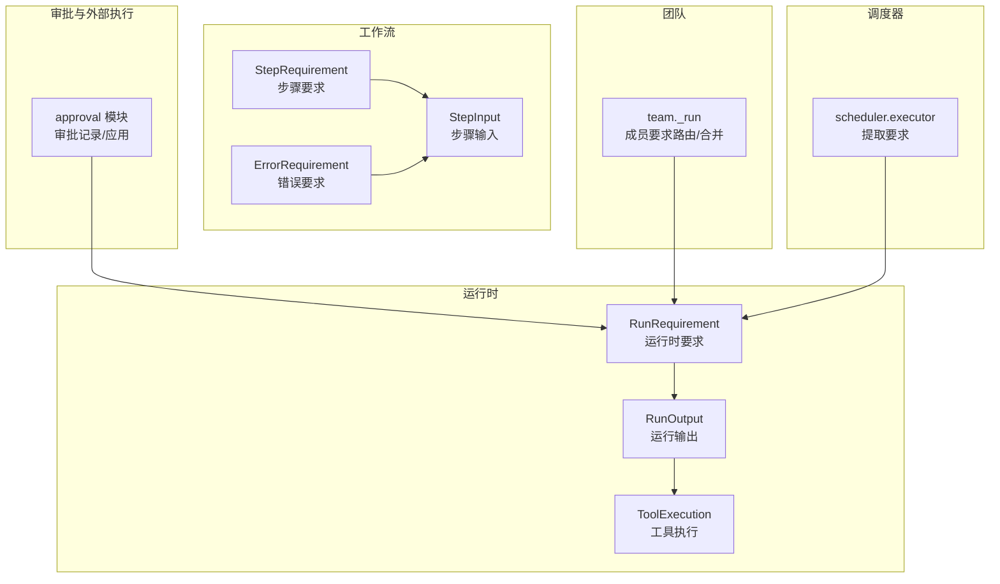
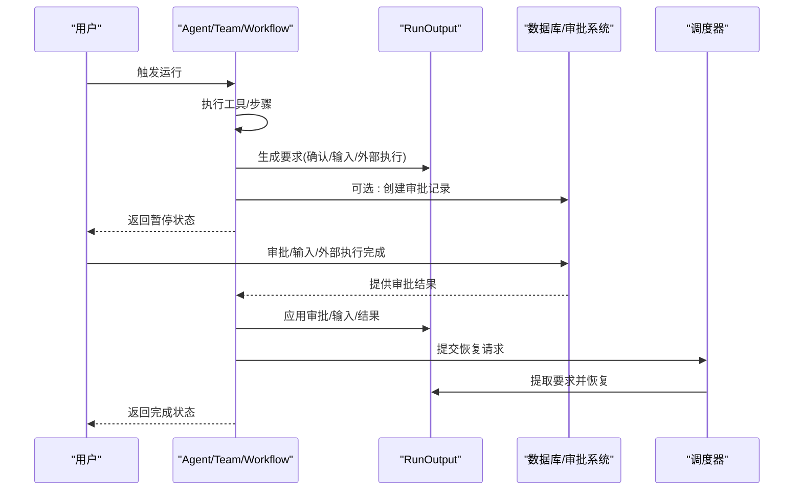
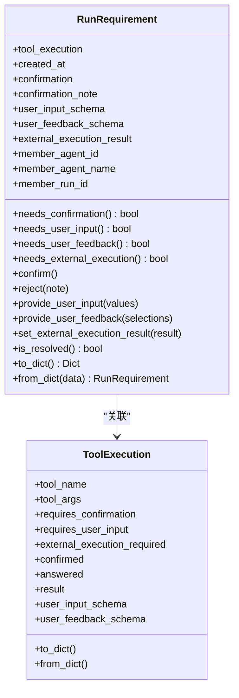
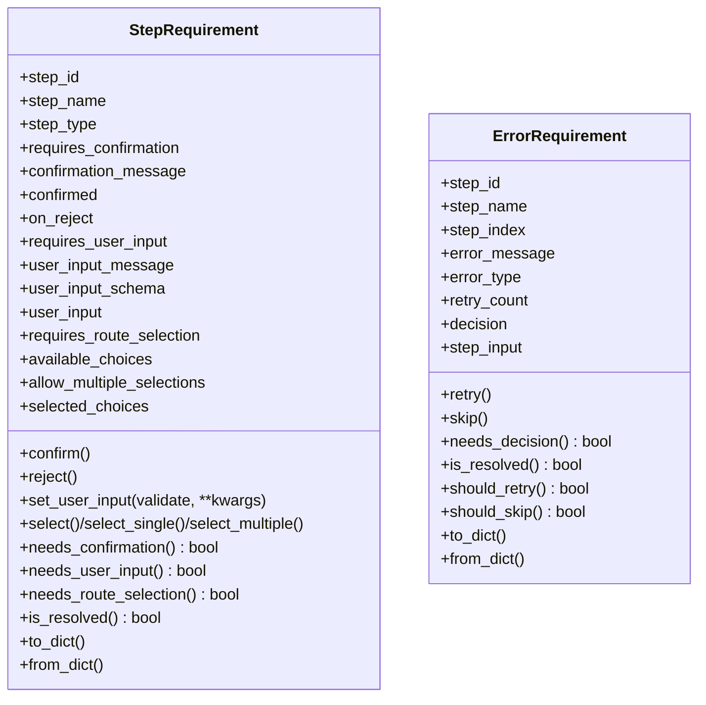
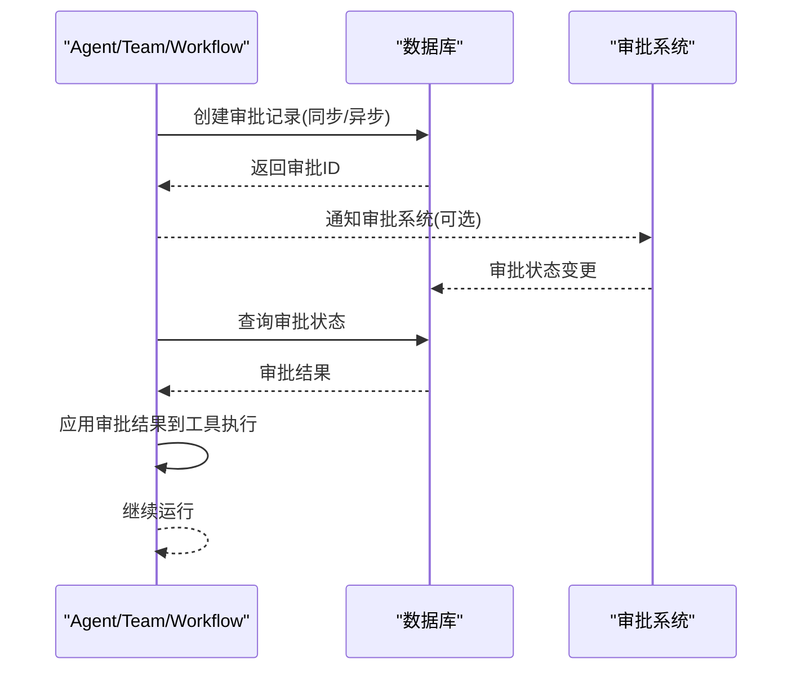
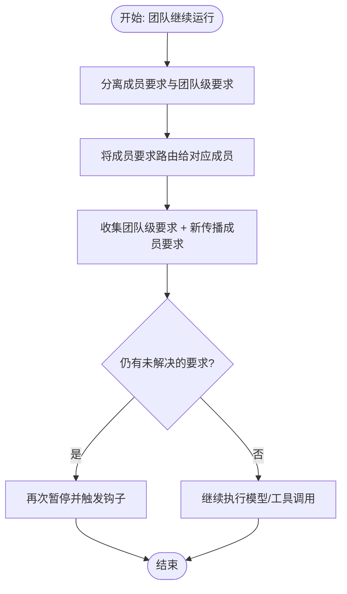
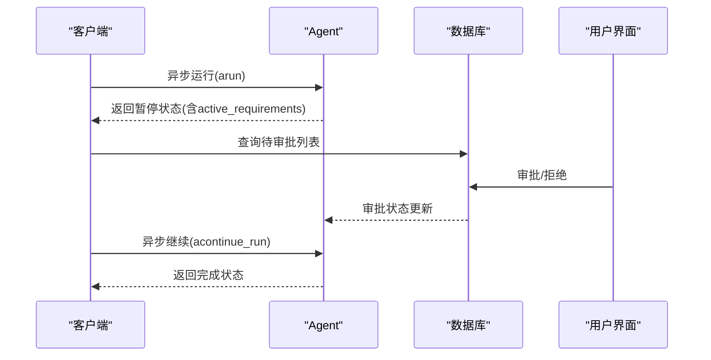
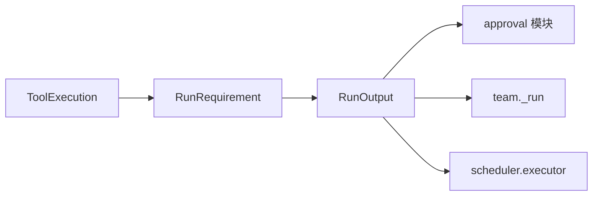
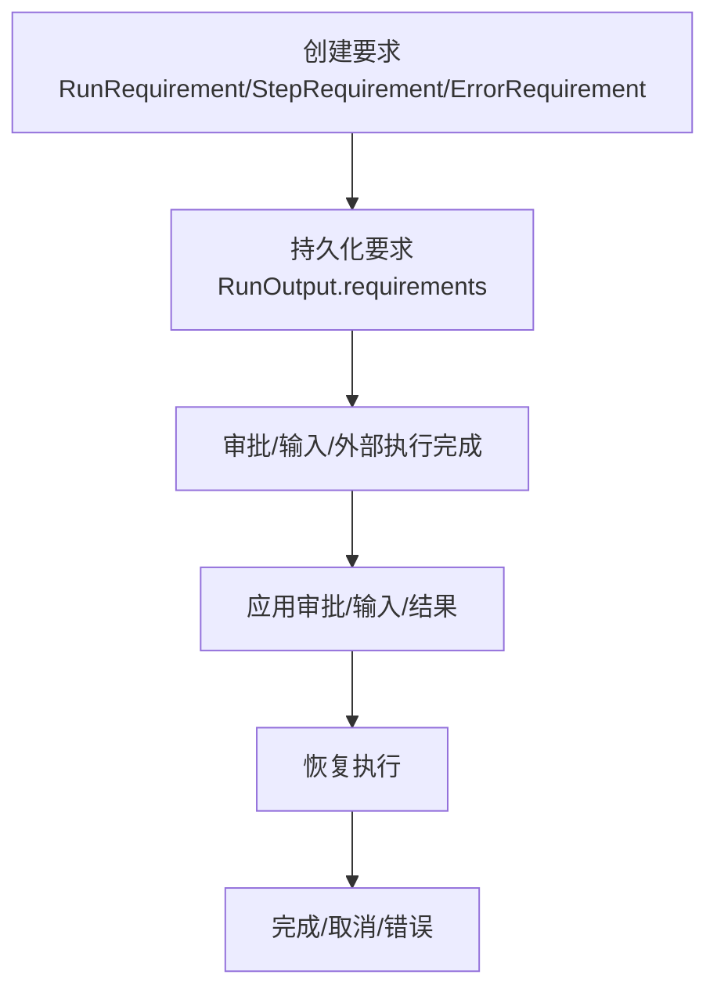

# Requirements 系统

<cite>
**本文引用的文件**
- [libs/agno/agno/run/requirement.py](file://libs/agno/agno/run/requirement.py)
- [libs/agno/agno/workflow/types.py](file://libs/agno/agno/workflow/types.py)
- [libs/agno/agno/run/agent.py](file://libs/agno/agno/run/agent.py)
- [libs/agno/agno/run/team.py](file://libs/agno/agno/run/team.py)
- [libs/agno/agno/run/approval.py](file://libs/agno/agno/run/approval.py)
- [libs/agno/agno/team/_run.py](file://libs/agno/agno/team/_run.py)
- [libs/agno/agno/scheduler/executor.py](file://libs/agno/agno/scheduler/executor.py)
- [cookbook/02_agents/11_approvals/approval_async.py](file://cookbook/02_agents/11_approvals/approval_async.py)
- [cookbook/02_agents/11_approvals/approval_async.md](file://cookbook/02_agents/11_approvals/approval_async.md)
- [libs/agno/tests/unit/team/test_run_requirement_fixes.py](file://libs/agno/tests/unit/team/test_run_requirement_fixes.py)
</cite>

## 目录
1. [简介](#简介)
2. [项目结构](#项目结构)
3. [核心组件](#核心组件)
4. [架构总览](#架构总览)
5. [详细组件分析](#详细组件分析)
6. [依赖分析](#依赖分析)
7. [性能考虑](#性能考虑)
8. [故障排查指南](#故障排查指南)
9. [结论](#结论)
10. [附录](#附录)

## 简介
本文件系统性阐述 Requirements 系统的设计理念与工作机制，重点覆盖以下方面：
- 基于要求的异步执行机制：如何在工具调用、工作流步骤、团队协作等场景下，通过“要求”暂停并等待人工或外部系统决策，随后以异步方式恢复执行。
- Requirements 对象的结构与属性：包括要求类型（确认、用户输入、外部执行）、参数、成员上下文、状态判定与序列化。
- 生命周期管理：从创建、调度、执行到完成的全链路行为；以及与审批、会话、事件系统的协同。
- 并发控制与资源管理：如何在多 Agent/Team/Workflow 场景下，通过要求进行暂停与恢复，避免竞争条件。
- 与代理、团队、工作流的交互模式：要求在不同执行器中的传播、路由与合并策略。
- 自定义要求的实现示例：同步与异步两类要求的定义与使用方法，帮助高级开发者快速集成与扩展。

## 项目结构
Requirements 系统横跨多个模块：
- 运行时数据模型与事件：RunRequirement、RunOutput、RunRequirement 的序列化/反序列化。
- 工作流要求：StepRequirement、ErrorRequirement，用于工作流级别的暂停与恢复。
- 审批与外部执行：approval 模块负责审批记录创建、查询与应用，支撑异步审批与审计。
- 团队执行：团队运行时对成员要求的路由、合并与再次调度。
- 调度器：从持久化数据中提取要求，驱动后续恢复流程。
- 示例与文档：cookbook 中的异步审批示例与说明文档，演示端到端流程。

**图表来源**
- [libs/agno/agno/run/requirement.py:1-273](file://libs/agno/agno/run/requirement.py#L1-L273)
- [libs/agno/agno/run/agent.py:630-829](file://libs/agno/agno/run/agent.py#L630-L829)
- [libs/agno/agno/workflow/types.py:577-907](file://libs/agno/agno/workflow/types.py#L577-L907)
- [libs/agno/agno/run/approval.py:1-570](file://libs/agno/agno/run/approval.py#L1-L570)
- [libs/agno/agno/team/_run.py:5560-5759](file://libs/agno/agno/team/_run.py#L5560-L5759)
- [libs/agno/agno/scheduler/executor.py:488-495](file://libs/agno/agno/scheduler/executor.py#L488-L495)

**章节来源**
- [libs/agno/agno/run/requirement.py:1-273](file://libs/agno/agno/run/requirement.py#L1-L273)
- [libs/agno/agno/workflow/types.py:577-907](file://libs/agno/agno/workflow/types.py#L577-L907)
- [libs/agno/agno/run/approval.py:1-570](file://libs/agno/agno/run/approval.py#L1-L570)
- [libs/agno/agno/team/_run.py:5560-5759](file://libs/agno/agno/team/_run.py#L5560-L5759)
- [libs/agno/agno/scheduler/executor.py:488-495](file://libs/agno/agno/scheduler/executor.py#L488-L495)

## 核心组件
- RunRequirement：运行时的人机交互要求，支持三种类型：确认、用户输入、外部执行。提供状态判定（是否仍需确认/输入/外部执行）、确认/拒绝、提供输入/反馈、设置外部执行结果、序列化/反序列化等能力。
- StepRequirement：工作流级别的要求，涵盖步骤确认、用户输入、路由选择等，支持验证与选择逻辑。
- ErrorRequirement：工作流错误处理要求，允许用户决定重试或跳过失败步骤。
- RunOutput：包含 requirements 字段，承载当前运行的所有要求，供继续执行时使用。
- approval 模块：在工具暂停时创建审批记录，异步查询审批状态并应用到工具执行，支持审计记录。
- team._run：在团队运行时将成员产生的要求路由给对应成员，并将团队级要求与新传播的要求合并，必要时再次暂停。

**章节来源**
- [libs/agno/agno/run/requirement.py:9-273](file://libs/agno/agno/run/requirement.py#L9-L273)
- [libs/agno/agno/workflow/types.py:577-907](file://libs/agno/agno/workflow/types.py#L577-L907)
- [libs/agno/agno/run/agent.py:630-829](file://libs/agno/agno/run/agent.py#L630-L829)
- [libs/agno/agno/run/approval.py:1-570](file://libs/agno/agno/run/approval.py#L1-L570)
- [libs/agno/agno/team/_run.py:5560-5759](file://libs/agno/agno/team/_run.py#L5560-L5759)

## 架构总览
Requirements 系统围绕“暂停-恢复”的异步执行范式构建：
- 工具/步骤/团队在满足特定条件时触发暂停，生成 RunRequirement 或 StepRequirement。
- 要求被写入 RunOutput.requirements，同时可选地创建审批记录。
- 外部系统（如审批平台）更新审批状态后，系统查询并应用审批结果，解除要求。
- 在团队场景中，成员要求被路由到对应成员，团队级要求与新传播的要求合并，必要时再次暂停。
- 调度器从持久化数据中提取要求，驱动后续恢复流程。

**图表来源**
- [libs/agno/agno/run/approval.py:152-262](file://libs/agno/agno/run/approval.py#L152-L262)
- [libs/agno/agno/team/_run.py:5560-5759](file://libs/agno/agno/team/_run.py#L5560-L5759)
- [libs/agno/agno/scheduler/executor.py:488-495](file://libs/agno/agno/scheduler/executor.py#L488-L495)

## 详细组件分析

### RunRequirement 类设计与行为
- 结构要点
  - 关联 ToolExecution：要求来源于工具调用，包含工具名、参数、是否需要确认/用户输入/外部执行等元信息。
  - 成员上下文：当要求来自团队成员时，记录成员 Agent 的标识与运行 ID，便于直接恢复。
  - 状态字段：confirmation、confirmation_note、user_input_schema、user_feedback_schema、external_execution_result。
- 行为特性
  - 需要确认/输入/反馈/外部执行的判定逻辑。
  - 提供 confirm/reject、provide_user_input、provide_user_feedback、set_external_execution_result 等方法。
  - is_resolved 判定所有要求是否已解决。
  - to_dict/from_dict 支持持久化与跨进程传输。

**图表来源**
- [libs/agno/agno/run/requirement.py:9-273](file://libs/agno/agno/run/requirement.py#L9-L273)

**章节来源**
- [libs/agno/agno/run/requirement.py:9-273](file://libs/agno/agno/run/requirement.py#L9-L273)

### StepRequirement 与 ErrorRequirement
- StepRequirement：用于工作流步骤的暂停与恢复，支持确认、用户输入、路由选择，具备验证与选择能力。
- ErrorRequirement：用于错误处理的暂停，允许用户决定重试或跳过，记录错误类型与重试次数。

**图表来源**
- [libs/agno/agno/workflow/types.py:577-907](file://libs/agno/agno/workflow/types.py#L577-L907)

**章节来源**
- [libs/agno/agno/workflow/types.py:577-907](file://libs/agno/agno/workflow/types.py#L577-L907)

### 审批与外部执行（Approval）机制
- 创建审批记录：当工具暂停且需要审批时，系统根据 RunOutput 构建审批记录并写入数据库，同时为相关工具打上审批 ID。
- 异步审批：提供异步变体，优先尝试异步接口，回退到同步接口。
- 应用审批结果：在继续运行前检查审批状态，若为“待定”则抛出异常阻止继续；否则将审批结果应用到工具执行（确认、用户输入、外部执行结果）。
- 审计审批：工具完成后创建审计审批记录，便于审计与追踪。

**图表来源**
- [libs/agno/agno/run/approval.py:152-262](file://libs/agno/agno/run/approval.py#L152-L262)
- [libs/agno/agno/run/approval.py:394-440](file://libs/agno/agno/run/approval.py#L394-L440)

**章节来源**
- [libs/agno/agno/run/approval.py:1-570](file://libs/agno/agno/run/approval.py#L1-L570)

### 团队运行中的要求路由与合并
- 路由成员要求：将带有成员 Agent 上下文的要求单独路由给对应成员处理。
- 合并团队级与新传播要求：保留团队级要求与新传播的成员要求，形成新的要求集合。
- 再次暂停：若仍有未解决的要求，则再次触发暂停钩子，等待进一步处理。

**图表来源**
- [libs/agno/agno/team/_run.py:5560-5759](file://libs/agno/agno/team/_run.py#L5560-L5759)

**章节来源**
- [libs/agno/agno/team/_run.py:5560-5759](file://libs/agno/agno/team/_run.py#L5560-L5759)

### 异步执行与恢复示例（cookbook）
- 示例展示了异步 Agent 运行在遇到审批要求时暂停，随后通过用户确认与数据库审批记录更新后，异步继续运行并最终完成。
- 示例文档提供了清晰的架构分层与系统提示词组装说明，便于理解端到端流程。

**图表来源**
- [cookbook/02_agents/11_approvals/approval_async.py:63-134](file://cookbook/02_agents/11_approvals/approval_async.py#L63-L134)
- [cookbook/02_agents/11_approvals/approval_async.md:18-98](file://cookbook/02_agents/11_approvals/approval_async.md#L18-L98)

**章节来源**
- [cookbook/02_agents/11_approvals/approval_async.py:1-134](file://cookbook/02_agents/11_approvals/approval_async.py#L1-L134)
- [cookbook/02_agents/11_approvals/approval_async.md:18-98](file://cookbook/02_agents/11_approvals/approval_async.md#L18-L98)

## 依赖分析
- RunRequirement 与 ToolExecution：要求来源于工具执行，两者通过 to_dict/from_dict 实现序列化与反序列化，确保跨进程/持久化安全。
- RunOutput：承载 requirements 字段，作为暂停与恢复的关键载体。
- approval 模块：与 RunOutput.requirements 协同，将审批状态应用到工具执行。
- team._run：在团队场景中对要求进行路由与合并，避免重复处理与遗漏。
- scheduler.executor：从持久化数据中提取 requirements，驱动恢复流程。

**图表来源**
- [libs/agno/agno/run/requirement.py:178-273](file://libs/agno/agno/run/requirement.py#L178-L273)
- [libs/agno/agno/run/agent.py:773-779](file://libs/agno/agno/run/agent.py#L773-L779)
- [libs/agno/agno/run/approval.py:84-149](file://libs/agno/agno/run/approval.py#L84-L149)
- [libs/agno/agno/team/_run.py:5564-5585](file://libs/agno/agno/team/_run.py#L5564-L5585)
- [libs/agno/agno/scheduler/executor.py:488-495](file://libs/agno/agno/scheduler/executor.py#L488-L495)

**章节来源**
- [libs/agno/agno/run/requirement.py:178-273](file://libs/agno/agno/run/requirement.py#L178-L273)
- [libs/agno/agno/run/agent.py:773-779](file://libs/agno/agno/run/agent.py#L773-L779)
- [libs/agno/agno/run/approval.py:84-149](file://libs/agno/agno/run/approval.py#L84-L149)
- [libs/agno/agno/team/_run.py:5564-5585](file://libs/agno/agno/team/_run.py#L5564-L5585)
- [libs/agno/agno/scheduler/executor.py:488-495](file://libs/agno/agno/scheduler/executor.py#L488-L495)

## 性能考虑
- 序列化开销：RunRequirement/RunOutput 的 to_dict/from_dict 仅在需要持久化或跨进程传递时发生，建议在内存中尽量避免频繁序列化。
- 审批查询：异步审批优先使用异步接口，减少阻塞；批量查询与缓存可降低数据库压力。
- 团队要求路由：在大规模团队场景中，应避免重复传播同一要求，可通过去重与增量传播优化。
- 调度器提取：从持久化数据中提取要求时，建议按 run_id 进行索引与过滤，避免全表扫描。

## 故障排查指南
- 审批仍为“待定”导致无法继续：检查审批状态查询与应用逻辑，确保在继续运行前审批已完成。
- 要求未解决导致循环暂停：检查 requirements 列表，确认 is_resolved 判定逻辑与用户输入/反馈/外部执行结果是否正确设置。
- 团队要求路由异常：核对成员要求与团队级要求的分离与合并逻辑，确保未遗漏或重复处理。
- 数据持久化问题：确认 to_dict/from_dict 的兼容性，避免字段缺失或类型不匹配。

**章节来源**
- [libs/agno/agno/run/approval.py:394-440](file://libs/agno/agno/run/approval.py#L394-L440)
- [libs/agno/agno/run/requirement.py:169-176](file://libs/agno/agno/run/requirement.py#L169-L176)
- [libs/agno/agno/team/_run.py:5564-5585](file://libs/agno/agno/team/_run.py#L5564-L5585)
- [libs/agno/tests/unit/team/test_run_requirement_fixes.py:39-97](file://libs/agno/tests/unit/team/test_run_requirement_fixes.py#L39-L97)

## 结论
Requirements 系统通过统一的要求模型与审批/外部执行机制，实现了在复杂执行器（Agent、Team、Workflow）中的暂停-恢复异步执行。其关键优势在于：
- 明确的要求类型与状态判定，简化了暂停与恢复的逻辑。
- 与审批系统深度集成，支持异步审批与审计。
- 团队场景下的要求路由与合并，保证了多 Agent/多步骤的协调一致性。
- 调度器与持久化数据的配合，使得恢复流程可追溯、可扩展。

## 附录

### Requirements 生命周期图

**图表来源**
- [libs/agno/agno/run/agent.py:630-829](file://libs/agno/agno/run/agent.py#L630-L829)
- [libs/agno/agno/run/approval.py:152-262](file://libs/agno/agno/run/approval.py#L152-L262)
- [libs/agno/agno/workflow/types.py:828-907](file://libs/agno/agno/workflow/types.py#L828-L907)

### 自定义要求实现指引
- 同步要求：在工具装饰器中启用 requires_confirmation/requires_user_input/external_execution_required，系统将自动创建 RunRequirement 并暂停。
- 异步要求：在异步运行路径中，同样创建 RunRequirement，但通过异步审批与数据库接口进行状态更新与应用。
- 示例参考：cookbook 中的异步审批示例展示了完整的端到端流程，包括暂停、审批、恢复与校验。

**章节来源**
- [cookbook/02_agents/11_approvals/approval_async.py:1-134](file://cookbook/02_agents/11_approvals/approval_async.py#L1-L134)
- [cookbook/02_agents/11_approvals/approval_async.md:18-98](file://cookbook/02_agents/11_approvals/approval_async.md#L18-L98)