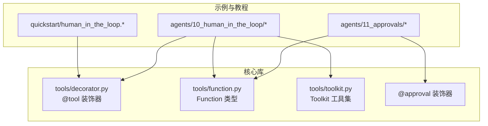
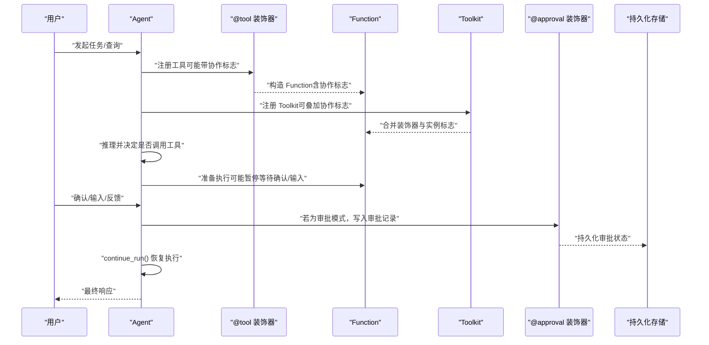
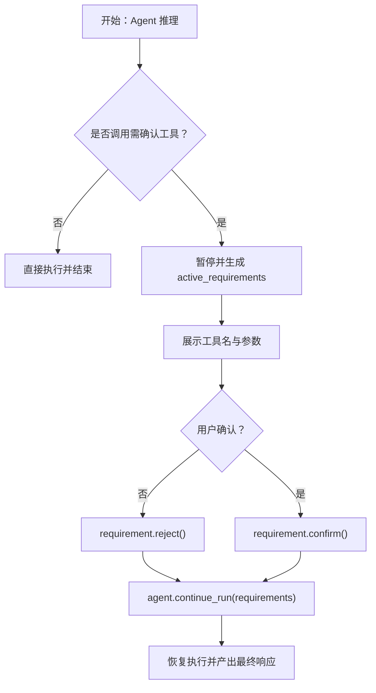
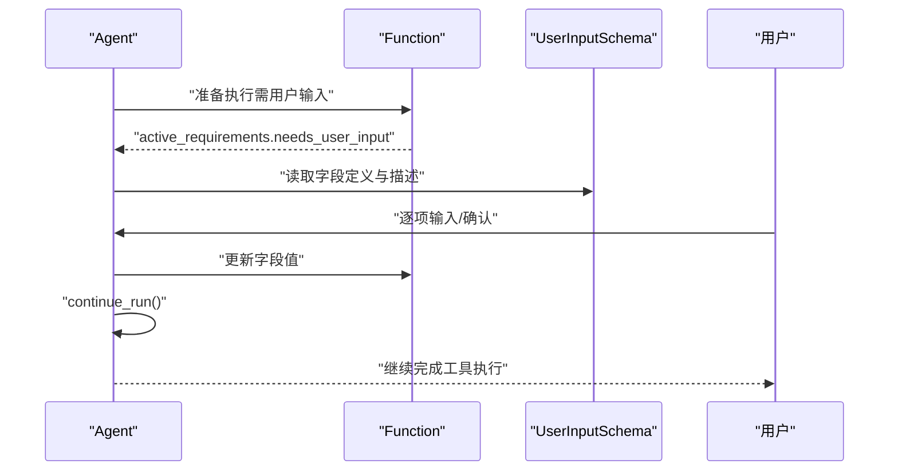
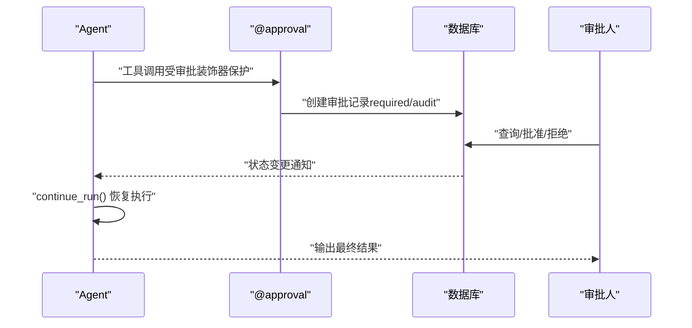
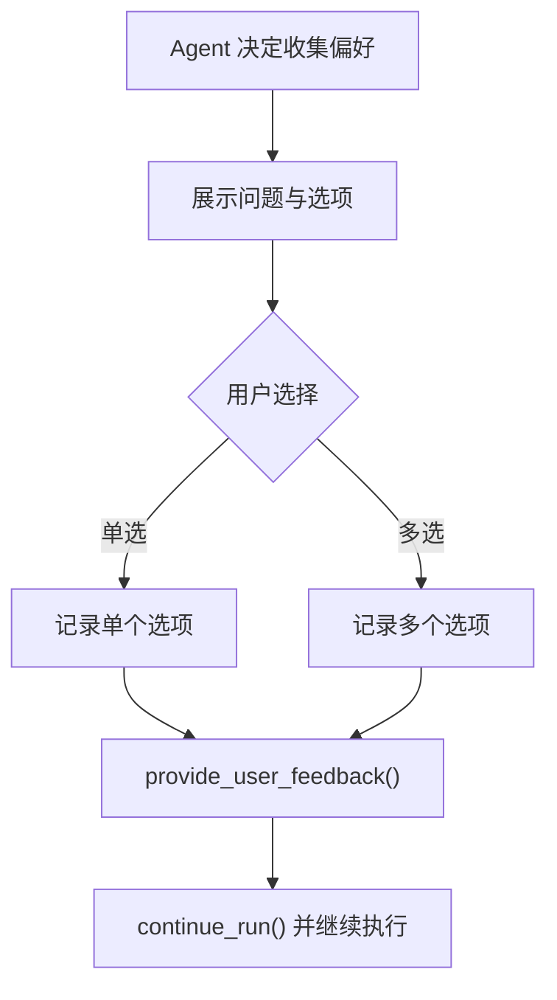
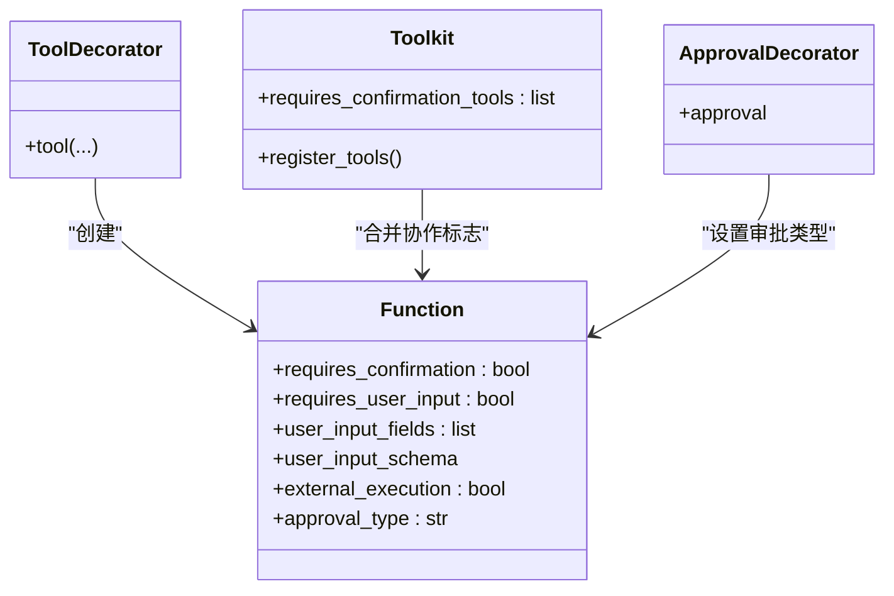

# 人机协作模式

<cite>
**本文引用的文件**
- [cookbook/00_quickstart/human_in_the_loop.py](file://cookbook/00_quickstart/human_in_the_loop.py)
- [cookbook/00_quickstart/human_in_the_loop.md](file://cookbook/00_quickstart/human_in_the_loop.md)
- [cookbook/02_agents/10_human_in_the_loop/confirmation_required.py](file://cookbook/02_agents/10_human_in_the_loop/confirmation_required.py)
- [cookbook/02_agents/10_human_in_the_loop/confirmation_advanced.md](file://cookbook/02_agents/10_human_in_the_loop/confirmation_advanced.md)
- [cookbook/02_agents/10_human_in_the_loop/confirmation_toolkit.md](file://cookbook/02_agents/10_human_in_the_loop/confirmation_toolkit.md)
- [cookbook/02_agents/10_human_in_the_loop/confirmation_with_session_state.py](file://cookbook/02_agents/10_human_in_the_loop/confirmation_with_session_state.py)
- [cookbook/02_agents/10_human_in_the_loop/user_input.py](file://cookbook/02_agents/10_human_in_the_loop/user_input.py)
- [cookbook/02_agents/10_human_in_the_loop/user_feedback.py](file://cookbook/02_agents/10_human_in_the_loop/user_feedback.py)
- [cookbook/02_agents/11_approvals/approval_basic.py](file://cookbook/02_agents/11_approvals/approval_basic.py)
- [cookbook/02_agents/11_approvals/audit_approval_confirmation.py](file://cookbook/02_agents/11_approvals/audit_approval_confirmation.py)
- [cookbook/02_agents/11_approvals/audit_approval_overview.py](file://cookbook/02_agents/11_approvals/audit_approval_overview.py)
- [libs/agno/agno/tools/decorator.py](file://libs/agno/agno/tools/decorator.py)
- [libs/agno/agno/tools/function.py](file://libs/agno/agno/tools/function.py)
- [libs/agno/agno/tools/toolkit.py](file://libs/agno/agno/tools/toolkit.py)
- [libs/agno/agno/approval/__init__.py](file://libs/agno/agno/approval/__init__.py)
</cite>

## 目录
1. [简介](#简介)
2. [项目结构](#项目结构)
3. [核心组件](#核心组件)
4. [架构总览](#架构总览)
5. [详细组件分析](#详细组件分析)
6. [依赖分析](#依赖分析)
7. [性能考量](#性能考量)
8. [故障排查指南](#故障排查指南)
9. [结论](#结论)
10. [附录](#附录)

## 简介
本实践文档围绕“人机协作（Human-in-the-loop / HITL）”模式，系统阐述其在智能代理系统中的作用与价值，并结合代码库中的示例，给出确认、输入、审批与反馈四类协作模式的设计与实现要点。文档同时覆盖协作流程设计、安全与审计、以及面向产品与开发的最佳实践，帮助读者在真实系统中落地可解释、可控且可审计的人机协作。

## 项目结构
本仓库以“食谱式教程（cookbook）+ 核心库（libs）”组织，HITL 示例分布在 quickstart、agents、teams、workflows 等目录；核心能力由 agno 工具与装饰器、Function 类型、Approval 装饰器等构成。

图表来源
- [cookbook/00_quickstart/human_in_the_loop.py:1-240](file://cookbook/00_quickstart/human_in_the_loop.py#L1-L240)
- [cookbook/02_agents/10_human_in_the_loop/confirmation_required.py:1-96](file://cookbook/02_agents/10_human_in_the_loop/confirmation_required.py#L1-L96)
- [cookbook/02_agents/11_approvals/approval_basic.py:1-132](file://cookbook/02_agents/11_approvals/approval_basic.py#L1-L132)
- [libs/agno/agno/tools/decorator.py:87-279](file://libs/agno/agno/tools/decorator.py#L87-L279)
- [libs/agno/agno/tools/function.py:170-369](file://libs/agno/agno/tools/function.py#L170-L369)
- [libs/agno/agno/tools/toolkit.py:239-269](file://libs/agno/agno/tools/toolkit.py#L239-L269)
- [libs/agno/agno/approval/__init__.py:1-5](file://libs/agno/agno/approval/__init__.py#L1-L5)

章节来源
- [cookbook/00_quickstart/human_in_the_loop.py:1-240](file://cookbook/00_quickstart/human_in_the_loop.py#L1-L240)
- [cookbook/02_agents/10_human_in_the_loop/confirmation_required.py:1-96](file://cookbook/02_agents/10_human_in_the_loop/confirmation_required.py#L1-L96)
- [cookbook/02_agents/11_approvals/approval_basic.py:1-132](file://cookbook/02_agents/11_approvals/approval_basic.py#L1-L132)
- [libs/agno/agno/tools/decorator.py:87-279](file://libs/agno/agno/tools/decorator.py#L87-L279)
- [libs/agno/agno/tools/function.py:170-369](file://libs/agno/agno/tools/function.py#L170-L369)
- [libs/agno/agno/tools/toolkit.py:239-269](file://libs/agno/agno/tools/toolkit.py#L239-L269)
- [libs/agno/agno/approval/__init__.py:1-5](file://libs/agno/agno/approval/__init__.py#L1-L5)

## 核心组件
- 工具装饰器与函数类型
  - @tool 装饰器支持 requires_confirmation、requires_user_input、external_execution 等标志位，用于声明工具的协作需求。
  - Function 类型承载工具元数据、协作标志与用户输入/反馈模式的 schema。
- 工具集 Toolkit
  - 支持在实例化时声明哪些工具需要“确认/外部执行”，并在注册阶段与 @tool 标志合并。
- 审批装饰器 @approval
  - 将工具调用纳入“审批记录”体系，支持 required（阻塞）与 audit（非阻塞审计）两类审批类型。
- 示例与模式
  - 确认模式：对敏感或不可逆操作进行用户确认。
  - 输入模式：在工具执行前收集用户输入字段。
  - 审批模式：持久化审批记录，支持批准/拒绝与审计追踪。
  - 反馈模式：以结构化问题收集用户偏好与选项。

章节来源
- [libs/agno/agno/tools/decorator.py:87-279](file://libs/agno/agno/tools/decorator.py#L87-L279)
- [libs/agno/agno/tools/function.py:170-369](file://libs/agno/agno/tools/function.py#L170-L369)
- [libs/agno/agno/tools/toolkit.py:239-269](file://libs/agno/agno/tools/toolkit.py#L239-L269)
- [libs/agno/agno/approval/__init__.py:1-5](file://libs/agno/agno/approval/__init__.py#L1-L5)

## 架构总览
下图展示了从“用户触发”到“代理响应与协作”的整体流程，涵盖确认、输入、审批与反馈四种模式的关键节点。

图表来源
- [libs/agno/agno/tools/decorator.py:87-279](file://libs/agno/agno/tools/decorator.py#L87-L279)
- [libs/agno/agno/tools/function.py:170-369](file://libs/agno/agno/tools/function.py#L170-L369)
- [libs/agno/agno/tools/toolkit.py:239-269](file://libs/agno/agno/tools/toolkit.py#L239-L269)
- [libs/agno/agno/approval/__init__.py:1-5](file://libs/agno/agno/approval/__init__.py#L1-L5)

## 详细组件分析

### 确认模式（Confirmation Mode）
- 设计要点
  - 使用 @tool(requires_confirmation=True) 标注敏感或不可逆工具。
  - 在 run_response.active_requirements 中轮询待确认项，调用 requirement.confirm()/reject()。
  - 通过 agent.continue_run() 携带更新后的 requirements 恢复执行。
- 典型场景
  - 敏感操作（删除、转账）、外部 API 调用、知识库写入等。
- 关键实现路径
  - 工具装饰与标志位：[libs/agno/agno/tools/decorator.py:87-279](file://libs/agno/agno/tools/decorator.py#L87-L279)
  - 函数协作标志字段：[libs/agno/agno/tools/function.py:170-369](file://libs/agno/agno/tools/function.py#L170-L369)
  - 工具集实例级确认叠加：[libs/agno/agno/tools/toolkit.py:239-269](file://libs/agno/agno/tools/toolkit.py#L239-L269)
  - 示例：quickstart 与 agents 示例
    - [cookbook/00_quickstart/human_in_the_loop.py:1-240](file://cookbook/00_quickstart/human_in_the_loop.py#L1-L240)
    - [cookbook/02_agents/10_human_in_the_loop/confirmation_required.py:1-96](file://cookbook/02_agents/10_human_in_the_loop/confirmation_required.py#L1-L96)
    - [cookbook/02_agents/10_human_in_the_loop/confirmation_advanced.md:1-160](file://cookbook/02_agents/10_human_in_the_loop/confirmation_advanced.md#L1-L160)
    - [cookbook/02_agents/10_human_in_the_loop/confirmation_toolkit.md:50-93](file://cookbook/02_agents/10_human_in_the_loop/confirmation_toolkit.md#L50-L93)
    - [cookbook/02_agents/10_human_in_the_loop/confirmation_with_session_state.py:1-200](file://cookbook/02_agents/10_human_in_the_loop/confirmation_with_session_state.py#L1-L200)

图表来源
- [cookbook/00_quickstart/human_in_the_loop.py:160-208](file://cookbook/00_quickstart/human_in_the_loop.py#L160-L208)
- [cookbook/02_agents/10_human_in_the_loop/confirmation_required.py:60-96](file://cookbook/02_agents/10_human_in_the_loop/confirmation_required.py#L60-L96)
- [libs/agno/agno/tools/function.py:170-369](file://libs/agno/agno/tools/function.py#L170-L369)

章节来源
- [cookbook/00_quickstart/human_in_the_loop.py:1-240](file://cookbook/00_quickstart/human_in_the_loop.py#L1-L240)
- [cookbook/02_agents/10_human_in_the_loop/confirmation_required.py:1-96](file://cookbook/02_agents/10_human_in_the_loop/confirmation_required.py#L1-L96)
- [cookbook/02_agents/10_human_in_the_loop/confirmation_advanced.md:1-160](file://cookbook/02_agents/10_human_in_the_loop/confirmation_advanced.md#L1-L160)
- [cookbook/02_agents/10_human_in_the_loop/confirmation_toolkit.md:50-93](file://cookbook/02_agents/10_human_in_the_loop/confirmation_toolkit.md#L50-L93)
- [cookbook/02_agents/10_human_in_the_loop/confirmation_with_session_state.py:1-200](file://cookbook/02_agents/10_human_in_the_loop/confirmation_with_session_state.py#L1-L200)
- [libs/agno/agno/tools/decorator.py:87-279](file://libs/agno/agno/tools/decorator.py#L87-L279)
- [libs/agno/agno/tools/function.py:170-369](file://libs/agno/agno/tools/function.py#L170-L369)
- [libs/agno/agno/tools/toolkit.py:239-269](file://libs/agno/agno/tools/toolkit.py#L239-L269)

### 输入模式（User Input Mode）
- 设计要点
  - 使用 requires_user_input 与 user_input_fields/schema，在工具执行前收集用户输入。
  - 通过 requirement.user_input_schema 获取字段定义，逐项采集并更新后继续执行。
- 典型场景
  - 邮件发送、日期范围查询、旅行计划等需要用户补充参数的工具。
- 关键实现路径
  - 函数协作标志与 schema 字段：[libs/agno/agno/tools/function.py:170-369](file://libs/agno/agno/tools/function.py#L170-L369)
  - 示例：[cookbook/02_agents/10_human_in_the_loop/user_input.py:1-145](file://cookbook/02_agents/10_human_in_the_loop/user_input.py#L1-L145)

图表来源
- [libs/agno/agno/tools/function.py:170-369](file://libs/agno/agno/tools/function.py#L170-L369)
- [cookbook/02_agents/10_human_in_the_loop/user_input.py:70-145](file://cookbook/02_agents/10_human_in_the_loop/user_input.py#L70-L145)

章节来源
- [libs/agno/agno/tools/function.py:170-369](file://libs/agno/agno/tools/function.py#L170-L369)
- [cookbook/02_agents/10_human_in_the_loop/user_input.py:1-145](file://cookbook/02_agents/10_human_in_the_loop/user_input.py#L1-L145)

### 审批模式（Approval Mode）
- 设计要点
  - 使用 @approval 装饰器将工具调用纳入审批记录，支持 required（阻塞）与 audit（非阻塞）两类。
  - 审批记录持久化于数据库，支持查询、批准/拒绝与审计分离。
- 典型场景
  - 高风险工具调用、合规要求、跨团队协作的审批流。
- 关键实现路径
  - @approval 导出入口：[libs/agno/agno/approval/__init__.py:1-5](file://libs/agno/agno/approval/__init__.py#L1-L5)
  - 示例：基础审批与审计概览
    - [cookbook/02_agents/11_approvals/approval_basic.py:1-132](file://cookbook/02_agents/11_approvals/approval_basic.py#L1-L132)
    - [cookbook/02_agents/11_approvals/audit_approval_overview.py:152-177](file://cookbook/02_agents/11_approvals/audit_approval_overview.py#L152-L177)
    - [cookbook/02_agents/11_approvals/audit_approval_confirmation.py:130-155](file://cookbook/02_agents/11_approvals/audit_approval_confirmation.py#L130-L155)

图表来源
- [libs/agno/agno/approval/__init__.py:1-5](file://libs/agno/agno/approval/__init__.py#L1-L5)
- [cookbook/02_agents/11_approvals/approval_basic.py:78-132](file://cookbook/02_agents/11_approvals/approval_basic.py#L78-L132)
- [cookbook/02_agents/11_approvals/audit_approval_overview.py:152-177](file://cookbook/02_agents/11_approvals/audit_approval_overview.py#L152-L177)
- [cookbook/02_agents/11_approvals/audit_approval_confirmation.py:130-155](file://cookbook/02_agents/11_approvals/audit_approval_confirmation.py#L130-L155)

章节来源
- [libs/agno/agno/approval/__init__.py:1-5](file://libs/agno/agno/approval/__init__.py#L1-L5)
- [cookbook/02_agents/11_approvals/approval_basic.py:1-132](file://cookbook/02_agents/11_approvals/approval_basic.py#L1-L132)
- [cookbook/02_agents/11_approvals/audit_approval_overview.py:152-177](file://cookbook/02_agents/11_approvals/audit_approval_overview.py#L152-L177)
- [cookbook/02_agents/11_approvals/audit_approval_confirmation.py:130-155](file://cookbook/02_agents/11_approvals/audit_approval_confirmation.py#L130-L155)

### 反馈模式（User Feedback Mode）
- 设计要点
  - 使用 UserFeedbackTools 在工具执行前以结构化问题收集用户偏好，支持单选/多选与描述信息。
  - 通过 requirement.user_feedback_schema 获取问题集合，收集选择后提供给工具继续执行。
- 典型场景
  - 旅行助手、内容推荐、个性化配置等需要明确用户偏好的任务。
- 关键实现路径
  - 示例：[cookbook/02_agents/10_human_in_the_loop/user_feedback.py:1-83](file://cookbook/02_agents/10_human_in_the_loop/user_feedback.py#L1-L83)

图表来源
- [cookbook/02_agents/10_human_in_the_loop/user_feedback.py:30-83](file://cookbook/02_agents/10_human_in_the_loop/user_feedback.py#L30-L83)

章节来源
- [cookbook/02_agents/10_human_in_the_loop/user_feedback.py:1-83](file://cookbook/02_agents/10_human_in_the_loop/user_feedback.py#L1-L83)

### 外部执行模式（External Execution Mode）
- 设计要点
  - 使用 external_execution 标志将工具执行置于代理控制之外，适合需要外部系统参与或异步处理的场景。
  - 可配合 external_execution_silent 抑制暂停时的冗长提示。
- 关键实现路径
  - 函数协作标志字段：[libs/agno/agno/tools/function.py:170-369](file://libs/agno/agno/tools/function.py#L170-L369)
  - 示例与说明可在相关示例文件中查阅。

章节来源
- [libs/agno/agno/tools/function.py:170-369](file://libs/agno/agno/tools/function.py#L170-L369)

## 依赖分析
- 装饰器与函数类型
  - @tool 装饰器负责将普通函数转换为 Function，并注入协作标志位。
  - Function 类型统一承载工具元数据、协作标志与用户输入/反馈 schema。
- 工具集 Toolkit
  - 在注册阶段将实例级协作标志与 @tool 标志合并，形成最终的协作策略。
- 审批装饰器 @approval
  - 与 @tool 协作，为工具调用建立审批记录，支持 required/audit 两类模式。

图表来源
- [libs/agno/agno/tools/decorator.py:87-279](file://libs/agno/agno/tools/decorator.py#L87-L279)
- [libs/agno/agno/tools/function.py:170-369](file://libs/agno/agno/tools/function.py#L170-L369)
- [libs/agno/agno/tools/toolkit.py:239-269](file://libs/agno/agno/tools/toolkit.py#L239-L269)
- [libs/agno/agno/approval/__init__.py:1-5](file://libs/agno/agno/approval/__init__.py#L1-L5)

章节来源
- [libs/agno/agno/tools/decorator.py:87-279](file://libs/agno/agno/tools/decorator.py#L87-L279)
- [libs/agno/agno/tools/function.py:170-369](file://libs/agno/agno/tools/function.py#L170-L369)
- [libs/agno/agno/tools/toolkit.py:239-269](file://libs/agno/agno/tools/toolkit.py#L239-L269)
- [libs/agno/agno/approval/__init__.py:1-5](file://libs/agno/agno/approval/__init__.py#L1-L5)

## 性能考量
- 工具调用的暂停与恢复
  - 确认/输入/反馈/审批均通过暂停与 continue_run 恢复实现，避免不必要的模型往返。
- 缓存与结果复用
  - Function 支持缓存配置（cache_results、cache_dir、cache_ttl），可减少重复外部调用带来的延迟。
- I/O 与网络调用
  - 外部 API 调用与数据库查询应尽量批量与去重，避免在协作等待期间产生额外开销。
- 会话与上下文
  - 合理利用会话状态与历史上下文，减少重复提示与参数输入。

## 故障排查指南
- 确认/输入/反馈未触发
  - 检查工具是否正确标注 requires_confirmation/requires_user_input，或是否被 Toolkit 的标志覆盖。
  - 确认 active_requirements 列表中包含对应标志。
- 审批记录异常
  - 查询数据库中审批状态是否正确创建与更新；核对 approval_type 与状态流转。
- 权限与身份
  - 审批系统应与身份认证与权限控制集成，确保只有授权人员可批准/拒绝。
- 审计日志
  - 审批记录应包含操作者、时间戳、上下文与结果，便于事后审计与回溯。

章节来源
- [cookbook/02_agents/11_approvals/approval_basic.py:85-132](file://cookbook/02_agents/11_approvals/approval_basic.py#L85-L132)
- [cookbook/02_agents/11_approvals/audit_approval_overview.py:152-177](file://cookbook/02_agents/11_approvals/audit_approval_overview.py#L152-L177)
- [cookbook/02_agents/11_approvals/audit_approval_confirmation.py:130-155](file://cookbook/02_agents/11_approvals/audit_approval_confirmation.py#L130-L155)

## 结论
人机协作模式通过“暂停—确认—恢复”的机制，将人类判断嵌入到智能代理的自动化流程中，既保证了系统的可控性与可解释性，又满足合规与审计要求。借助 @tool 与 @approval 等装饰器、Function 类型与 Toolkit 的组合，可以在不同场景下灵活选择确认、输入、审批与反馈模式，并通过会话状态、持久化与审计日志实现端到端的可追溯与可治理。

## 附录
- 快速参考
  - 确认模式：在工具上标注 requires_confirmation，处理 active_requirements，调用 confirm()/reject()，随后 continue_run()。
  - 输入模式：设置 requires_user_input 与 user_input_fields/schema，逐项采集后继续。
  - 审批模式：使用 @approval(type="required"/"audit")，持久化审批记录，支持批准/拒绝与审计分离。
  - 反馈模式：使用 UserFeedbackTools，结构化收集用户偏好，提供给工具继续执行。
- 最佳实践
  - 明确协作边界：仅对高风险或关键动作启用确认/审批。
  - 清晰提示与回退：在暂停时提供充分上下文，允许用户撤销或修改。
  - 审计与合规：保留完整的审批轨迹与日志，满足内控与监管要求。
  - 可观测性：在协作点增加可观测指标，监控暂停率、平均等待时长与通过率。