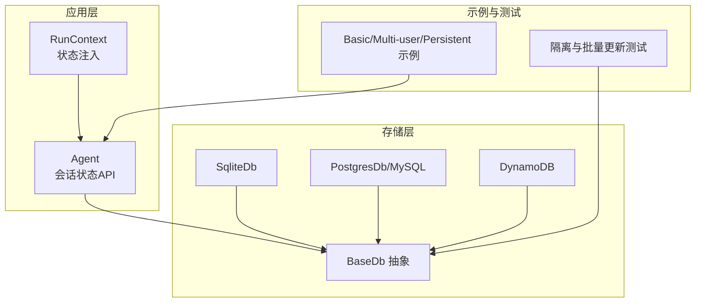
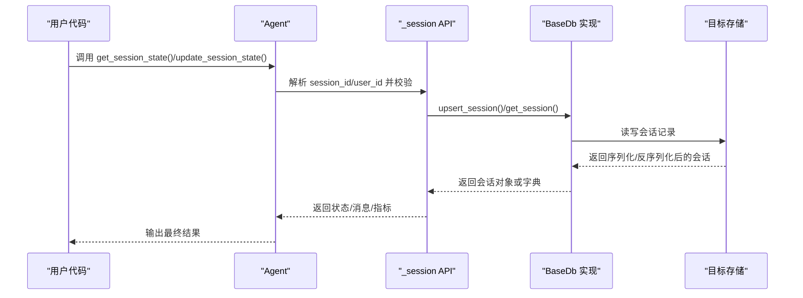
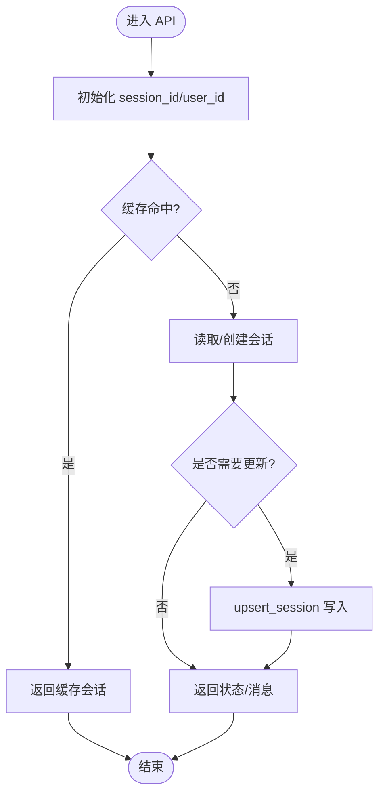
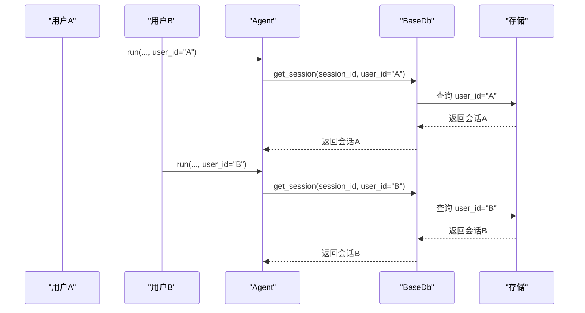
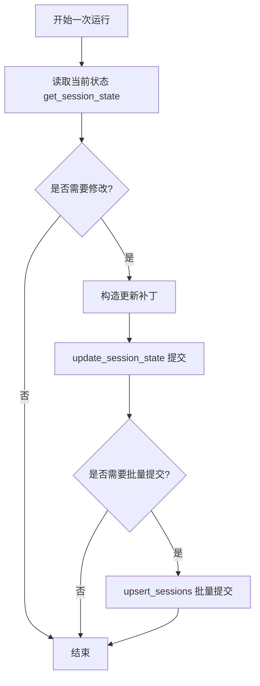
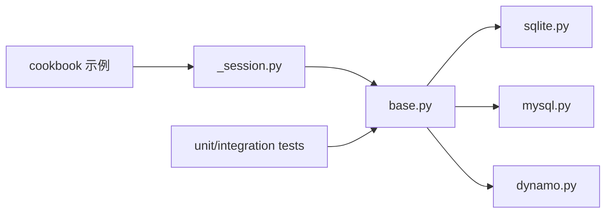

# 会话状态管理

<cite>
**本文引用的文件**
- [libs/agno/agno/agent/_session.py](file://libs/agno/agno/agent/_session.py)
- [libs/agno/agno/db/base.py](file://libs/agno/agno/db/base.py)
- [libs/agno/agno/db/sqlite/sqlite.py](file://libs/agno/agno/db/sqlite/sqlite.py)
- [cookbook/02_agents/05_state_and_session/session_state_basic.py](file://cookbook/02_agents/05_state_and_session/session_state_basic.py)
- [cookbook/02_agents/05_state_and_session/session_state_multiple_users.py](file://cookbook/02_agents/05_state_and_session/session_state_multiple_users.py)
- [cookbook/02_agents/05_state_and_session/persistent_session.py](file://cookbook/02_agents/05_state_and_session/persistent_session.py)
- [cookbook/06_storage/01_persistent_session_storage.py](file://cookbook/06_storage/01_persistent_session_storage.py)
- [libs/agno/agno/db/mysql/mysql.py](file://libs/agno/agno/db/mysql/mysql.py)
- [libs/agno/agno/db/dynamo/dynamo.py](file://libs/agno/agno/db/dynamo/dynamo.py)
- [libs/agno/agno/db/dynamo/utils.py](file://libs/agno/agno/db/dynamo/utils.py)
- [libs/agno/tests/unit/db/test_session_isolation.py](file://libs/agno/tests/unit/db/test_session_isolation.py)
- [libs/agno/tests/integration/db/async_mysql/test_session.py](file://libs/agno/tests/integration/db/async_mysql/test_session.py)
- [cookbook/02_agents/05_state_and_session/session_state_events.md](file://cookbook/02_agents/05_state_and_session/session_state_events.md)
- [cookbook/02_agents/05_state_and_session/session_state_manual_update.md](file://cookbook/02_agents/05_state_and_session/session_state_manual_update.md)
- [cookbook/02_agents/05_state_and_session/dynamic_session_state.md](file://cookbook/02_agents/05_state_and_session/dynamic_session_state.md)
- [cookbook/06_storage/in_memory/README.md](file://cookbook/06_storage/in_memory/README.md)
</cite>

## 目录
1. [引言](#引言)
2. [项目结构](#项目结构)
3. [核心组件](#核心组件)
4. [架构总览](#架构总览)
5. [详细组件分析](#详细组件分析)
6. [依赖分析](#依赖分析)
7. [性能考虑](#性能考虑)
8. [故障排查指南](#故障排查指南)
9. [结论](#结论)
10. [附录](#附录)

## 引言
本技术文档围绕“会话状态管理”展开，系统阐述会话状态的概念与价值、多用户隔离机制、状态持久化策略、数据结构设计、状态更新机制（实时/批量/冲突处理）、存储后端支持（内存/数据库/分布式），并提供可扩展的自定义会话状态管理器实现思路与最佳实践。文档同时结合仓库中的示例与测试用例，帮助开发者快速落地。

## 项目结构
本项目在多个层次提供了会话状态管理能力：
- 应用层：Agent 提供统一的状态读取、更新、删除接口，贯穿运行期与事件流。
- 存储层：抽象出 BaseDb 接口，内置 SQLite、MySQL、DynamoDB 等多种实现，支持会话的增删改查与批量操作。
- 示例与测试：通过 cookbook 中的示例演示基本状态、多用户隔离、持久化团队会话；通过 tests 验证隔离与并发一致性。

图表来源
- [libs/agno/agno/agent/_session.py:473-536](file://libs/agno/agno/agent/_session.py#L473-L536)
- [libs/agno/agno/db/base.py:30-210](file://libs/agno/agno/db/base.py#L30-L210)
- [libs/agno/agno/db/sqlite/sqlite.py:653-768](file://libs/agno/agno/db/sqlite/sqlite.py#L653-L768)

章节来源
- [libs/agno/agno/agent/_session.py:473-536](file://libs/agno/agno/agent/_session.py#L473-L536)
- [libs/agno/agno/db/base.py:30-210](file://libs/agno/agno/db/base.py#L30-L210)
- [libs/agno/agno/db/sqlite/sqlite.py:653-768](file://libs/agno/agno/db/sqlite/sqlite.py#L653-L768)

## 核心组件
- 会话状态 API：提供 get_session_state、update_session_state、get_session_messages 等方法，贯穿同步与异步调用路径。
- 存储抽象：BaseDb 定义了会话 CRUD、批量 upsert、重命名、删除等通用接口，具体实现由各数据库驱动完成。
- 数据模型：SessionType 统一区分 AGENT/TEAM/WORKFLOW 三类会话，便于在多组件场景下复用同一套存储逻辑。
- 示例与测试：覆盖单用户购物清单、多用户隔离、团队持久化会话、批量更新与隔离验证等场景。

章节来源
- [libs/agno/agno/agent/_session.py:473-536](file://libs/agno/agno/agent/_session.py#L473-L536)
- [libs/agno/agno/db/base.py:18-22](file://libs/agno/agno/db/base.py#L18-L22)
- [libs/agno/agno/db/base.py:150-210](file://libs/agno/agno/db/base.py#L150-L210)

## 架构总览
会话状态管理采用“应用层 API + 存储抽象 + 多后端实现”的分层架构。运行时通过 Agent 的会话 API 与存储交互，支持事件流、手工更新、动态状态注入等多种模式，并在多用户与多会话场景下保证隔离与一致性。

图表来源
- [libs/agno/agno/agent/_session.py:473-536](file://libs/agno/agno/agent/_session.py#L473-L536)
- [libs/agno/agno/db/base.py:150-210](file://libs/agno/agno/db/base.py#L150-L210)
- [libs/agno/agno/db/sqlite/sqlite.py:713-768](file://libs/agno/agno/db/sqlite/sqlite.py#L713-L768)

## 详细组件分析

### 1) 会话状态 API 设计与调用链
- 关键方法
  - get_session_state / aget_session_state：按 session_id 获取当前会话状态。
  - update_session_state / aupdate_session_state：对会话状态进行增量更新。
  - get_session_messages / aget_session_messages：按需筛选消息，支持跳过历史消息、限制条数等。
- 调用流程
  - 初始化 session_id 与 user_id，若未提供则生成或沿用缓存。
  - 通过 _storage 读取/写入会话，必要时进行序列化/反序列化。
  - 支持缓存命中直接返回，减少数据库访问。

图表来源
- [libs/agno/agno/agent/_session.py:46-67](file://libs/agno/agno/agent/_session.py#L46-L67)
- [libs/agno/agno/agent/_session.py:75-144](file://libs/agno/agno/agent/_session.py#L75-L144)
- [libs/agno/agno/agent/_session.py:216-262](file://libs/agno/agno/agent/_session.py#L216-L262)

章节来源
- [libs/agno/agno/agent/_session.py:473-536](file://libs/agno/agno/agent/_session.py#L473-L536)
- [libs/agno/agno/agent/_session.py:588-693](file://libs/agno/agno/agent/_session.py#L588-L693)

### 2) 多用户隔离与状态持久化
- 多用户隔离
  - 在查询/删除时支持 user_id 过滤，避免跨用户数据泄露。
  - 测试用例验证：删除指定用户会话、批量删除仅影响自身会话、通配符删除行为等。
- 持久化策略
  - 示例：团队使用 PostgresDb 持久化会话，确保跨运行/跨进程状态一致。
  - 单机示例：SQLite/内存存储用于本地开发与演示。

图表来源
- [libs/agno/tests/unit/db/test_session_isolation.py:51-82](file://libs/agno/tests/unit/db/test_session_isolation.py#L51-L82)
- [cookbook/02_agents/05_state_and_session/session_state_multiple_users.py:1-135](file://cookbook/02_agents/05_state_and_session/session_state_multiple_users.py#L1-L135)
- [cookbook/02_agents/05_state_and_session/persistent_session.py:1-31](file://cookbook/02_agents/05_state_and_session/persistent_session.py#L1-L31)

章节来源
- [libs/agno/tests/unit/db/test_session_isolation.py:51-82](file://libs/agno/tests/unit/db/test_session_isolation.py#L51-L82)
- [cookbook/02_agents/05_state_and_session/session_state_multiple_users.py:1-135](file://cookbook/02_agents/05_state_and_session/session_state_multiple_users.py#L1-L135)
- [cookbook/02_agents/05_state_and_session/persistent_session.py:1-31](file://cookbook/02_agents/05_state_and_session/persistent_session.py#L1-L31)

### 3) 数据结构设计
- 核心字段
  - 会话标识：session_id（唯一）
  - 用户标识：user_id（用于隔离）
  - 类型标识：session_type（AGENT/TEAM/WORKFLOW）
  - 状态数据：session_data（JSON 字段，包含业务状态如 shopping_list 等）
  - 时间戳：created_at、updated_at（自动维护）
- 字段约束与序列化
  - BaseDb 统一提供序列化/反序列化工具，确保 JSON 字段安全落库与恢复。
  - DynamoDB 场景提供合并策略，保留 created_at 并更新 updated_at。

章节来源
- [libs/agno/agno/db/base.py:150-210](file://libs/agno/agno/db/base.py#L150-L210)
- [libs/agno/agno/db/sqlite/sqlite.py:713-768](file://libs/agno/agno/db/sqlite/sqlite.py#L713-L768)
- [libs/agno/agno/db/dynamo/utils.py:240-274](file://libs/agno/agno/db/dynamo/utils.py#L240-L274)

### 4) 状态更新机制
- 实时更新
  - 工具函数/钩子在运行中直接修改 run_context.session_state，随后通过 update_session_state 提交。
- 手工更新
  - 先 get_session_state，再追加/修改，最后 update_session_state，适合复杂业务编排。
- 动态状态注入
  - 通过指令模板与上下文变量，将状态动态注入到提示词中，实现“所见即所得”的上下文感知。
- 批量更新与冲突处理
  - BaseDb 支持 upsert_sessions 批量写入，部分后端（如 MySQL/DynamoDB）提供条件更新与合并策略，避免丢失中间变更。

图表来源
- [cookbook/02_agents/05_state_and_session/session_state_manual_update.md:20-42](file://cookbook/02_agents/05_state_and_session/session_state_manual_update.md#L20-L42)
- [cookbook/02_agents/05_state_and_session/dynamic_session_state.md:21-46](file://cookbook/02_agents/05_state_and_session/dynamic_session_state.md#L21-L46)
- [libs/agno/agno/db/base.py:203-210](file://libs/agno/agno/db/base.py#L203-L210)

章节来源
- [cookbook/02_agents/05_state_and_session/session_state_manual_update.md:20-42](file://cookbook/02_agents/05_state_and_session/session_state_manual_update.md#L20-L42)
- [cookbook/02_agents/05_state_and_session/dynamic_session_state.md:21-46](file://cookbook/02_agents/05_state_and_session/dynamic_session_state.md#L21-L46)
- [libs/agno/agno/db/base.py:203-210](file://libs/agno/agno/db/base.py#L203-L210)

### 5) 存储后端支持
- 内存存储（InMemoryDb）
  - 适用于本地开发与单元测试，提供 get_all_sessions、get_recent_sessions、delete_session、drop 等常用操作。
- 关系型数据库（SQLite/MySQL/Postgres）
  - 提供完整的 CRUD、批量 upsert、索引与版本管理，适合生产环境。
- 分布式存储（DynamoDB）
  - 提供条件更新与 JSON 字段更新，支持合并策略与 created_at/updated_at 维护。
- 示例与测试
  - SQLite：基本会话状态示例。
  - 团队持久化：PostgresDb 持久化团队会话。
  - DynamoDB：条件更新与合并策略示例。

章节来源
- [cookbook/06_storage/in_memory/README.md:96-117](file://cookbook/06_storage/in_memory/README.md#L96-L117)
- [libs/agno/agno/db/sqlite/sqlite.py:653-768](file://libs/agno/agno/db/sqlite/sqlite.py#L653-L768)
- [libs/agno/agno/db/mysql/mysql.py:682-705](file://libs/agno/agno/db/mysql/mysql.py#L682-L705)
- [libs/agno/agno/db/dynamo/dynamo.py:503-529](file://libs/agno/agno/db/dynamo/dynamo.py#L503-L529)
- [libs/agno/agno/db/dynamo/utils.py:240-274](file://libs/agno/agno/db/dynamo/utils.py#L240-L274)
- [cookbook/02_agents/05_state_and_session/session_state_basic.py:1-49](file://cookbook/02_agents/05_state_and_session/session_state_basic.py#L1-L49)
- [cookbook/06_storage/01_persistent_session_storage.py:1-35](file://cookbook/06_storage/01_persistent_session_storage.py#L1-L35)

### 6) 自定义会话状态管理器实现指南
以下为实现自定义会话状态管理器的步骤与要点（以路径代替代码片段）：
- 步骤1：继承 BaseDb 或封装现有实现，实现 get_session/upsert_session/delete_session 等抽象方法
  - 参考路径：[libs/agno/agno/db/base.py:150-210](file://libs/agno/agno/db/base.py#L150-L210)
- 步骤2：在 Agent 中注入自定义 db 实例
  - 参考路径：[cookbook/02_agents/05_state_and_session/session_state_basic.py:27-36](file://cookbook/02_agents/05_state_and_session/session_state_basic.py#L27-L36)
- 步骤3：实现状态读取与写入
  - 读取：调用 get_session_state 或 get_session 后解析 session_data
    - 参考路径：[libs/agno/agno/agent/_session.py:473-502](file://libs/agno/agno/agent/_session.py#L473-L502)
  - 写入：调用 update_session_state 或 upsert_session
    - 参考路径：[libs/agno/agno/agent/_session.py:505-536](file://libs/agno/agno/agent/_session.py#L505-L536)
- 步骤4：实现清理与归档
  - 删除单个会话：delete_session
    - 参考路径：[libs/agno/agno/agent/_session.py:264-270](file://libs/agno/agno/agent/_session.py#L264-L270)
  - 批量清理：delete_sessions 或 upsert_sessions
    - 参考路径：[libs/agno/agno/db/base.py:155-156](file://libs/agno/agno/db/base.py#L155-L156)
- 步骤5：处理多用户隔离
  - 在查询/删除时传入 user_id
    - 参考路径：[libs/agno/agno/db/sqlite/sqlite.py:653-768](file://libs/agno/agno/db/sqlite/sqlite.py#L653-L768)
    - 参考路径：[libs/agno/tests/unit/db/test_session_isolation.py:51-82](file://libs/agno/tests/unit/db/test_session_isolation.py#L51-L82)

章节来源
- [libs/agno/agno/db/base.py:150-210](file://libs/agno/agno/db/base.py#L150-L210)
- [libs/agno/agno/agent/_session.py:473-536](file://libs/agno/agno/agent/_session.py#L473-L536)
- [libs/agno/agno/db/sqlite/sqlite.py:653-768](file://libs/agno/agno/db/sqlite/sqlite.py#L653-L768)
- [libs/agno/tests/unit/db/test_session_isolation.py:51-82](file://libs/agno/tests/unit/db/test_session_isolation.py#L51-L82)

### 7) 事件流与状态联动
- 事件流：在流式响应中，RunCompletedEvent 等事件携带 session_state，便于外部持久化或指标统计。
- 手工更新：先读取状态，再追加业务值，最后写回，确保状态与上下文一致。
- 动态状态：通过工具钩子拦截执行链，将动态值注入 session_state，从而影响后续提示词。

章节来源
- [cookbook/02_agents/05_state_and_session/session_state_events.md:20-44](file://cookbook/02_agents/05_state_and_session/session_state_events.md#L20-L44)
- [cookbook/02_agents/05_state_and_session/session_state_manual_update.md:20-42](file://cookbook/02_agents/05_state_and_session/session_state_manual_update.md#L20-L42)
- [cookbook/02_agents/05_state_and_session/dynamic_session_state.md:21-46](file://cookbook/02_agents/05_state_and_session/dynamic_session_state.md#L21-L46)

## 依赖分析
- 组件耦合
  - Agent 通过 _session API 与存储解耦，便于替换不同后端。
  - BaseDb 将表结构、序列化/反序列化、版本管理等抽象出来，降低具体实现的重复。
- 外部依赖
  - SQLite 使用 SQLAlchemy；MySQL/DynamoDB 有各自 SDK；Postgres 通过 SQLAlchemy/驱动组合。
- 循环依赖
  - 未发现循环导入；模块职责清晰，API 层与存储层分离良好。

图表来源
- [libs/agno/agno/agent/_session.py:473-536](file://libs/agno/agno/agent/_session.py#L473-L536)
- [libs/agno/agno/db/base.py:30-210](file://libs/agno/agno/db/base.py#L30-L210)
- [libs/agno/agno/db/sqlite/sqlite.py:653-768](file://libs/agno/agno/db/sqlite/sqlite.py#L653-L768)
- [libs/agno/agno/db/mysql/mysql.py:682-705](file://libs/agno/agno/db/mysql/mysql.py#L682-L705)
- [libs/agno/agno/db/dynamo/dynamo.py:503-529](file://libs/agno/agno/db/dynamo/dynamo.py#L503-L529)

章节来源
- [libs/agno/agno/agent/_session.py:473-536](file://libs/agno/agno/agent/_session.py#L473-L536)
- [libs/agno/agno/db/base.py:30-210](file://libs/agno/agno/db/base.py#L30-L210)

## 性能考虑
- 缓存策略：启用 agent.cache_session，在短时间内复用已加载会话，减少数据库往返。
- 批量写入：优先使用 upsert_sessions 批量提交，降低网络与事务开销。
- 索引与过滤：为 user_id、session_id、updated_at 等常用过滤字段建立索引，提升查询性能。
- 序列化成本：合理控制 session_data 规模，避免超大 JSON 导致序列化/反序列化开销过大。
- 异步与并发：在异步数据库场景下使用异步 API，避免阻塞；并发写入时利用后端条件更新与合并策略。

## 故障排查指南
- 无法获取会话
  - 检查 session_id 是否正确传递；确认缓存是否命中。
  - 参考路径：[libs/agno/agno/agent/_session.py:96-144](file://libs/agno/agno/agent/_session.py#L96-L144)
- 跨用户数据泄露
  - 确保查询/删除时传入 user_id；参考隔离测试用例。
  - 参考路径：[libs/agno/tests/unit/db/test_session_isolation.py:51-82](file://libs/agno/tests/unit/db/test_session_isolation.py#L51-L82)
- 批量更新异常
  - 检查后端是否支持 upsert_sessions；关注 created_at/updated_at 是否被正确维护。
  - 参考路径：[libs/agno/tests/integration/db/async_mysql/test_session.py:241-252](file://libs/agno/tests/integration/db/async_mysql/test_session.py#L241-L252)
- DynamoDB 条件更新失败
  - 确认 session_type 与 user_id 条件表达式；检查 JSON 字段更新语法。
  - 参考路径：[libs/agno/agno/db/dynamo/dynamo.py:503-529](file://libs/agno/agno/db/dynamo/dynamo.py#L503-L529)

章节来源
- [libs/agno/agno/agent/_session.py:96-144](file://libs/agno/agno/agent/_session.py#L96-L144)
- [libs/agno/tests/unit/db/test_session_isolation.py:51-82](file://libs/agno/tests/unit/db/test_session_isolation.py#L51-L82)
- [libs/agno/tests/integration/db/async_mysql/test_session.py:241-252](file://libs/agno/tests/integration/db/async_mysql/test_session.py#L241-L252)
- [libs/agno/agno/db/dynamo/dynamo.py:503-529](file://libs/agno/agno/db/dynamo/dynamo.py#L503-L529)

## 结论
本项目提供了完善的会话状态管理方案：以 Agent API 为核心，通过 BaseDb 抽象连接多种存储后端，支持多用户隔离、事件流联动与手工/动态状态注入，并在批量更新与冲突处理方面具备良好扩展性。结合示例与测试，开发者可快速构建稳定、高性能的会话状态管理能力。

## 附录
- 快速上手
  - 基础状态：参考 [cookbook/02_agents/05_state_and_session/session_state_basic.py:1-49](file://cookbook/02_agents/05_state_and_session/session_state_basic.py#L1-L49)
  - 多用户隔离：参考 [cookbook/02_agents/05_state_and_session/session_state_multiple_users.py:1-135](file://cookbook/02_agents/05_state_and_session/session_state_multiple_users.py#L1-L135)
  - 团队持久化：参考 [cookbook/06_storage/01_persistent_session_storage.py:1-35](file://cookbook/06_storage/01_persistent_session_storage.py#L1-L35)
- 存储后端选择
  - 内存：参考 [cookbook/06_storage/in_memory/README.md:96-117](file://cookbook/06_storage/in_memory/README.md#L96-L117)
  - SQLite：参考 [libs/agno/agno/db/sqlite/sqlite.py:653-768](file://libs/agno/agno/db/sqlite/sqlite.py#L653-L768)
  - MySQL：参考 [libs/agno/agno/db/mysql/mysql.py:682-705](file://libs/agno/agno/db/mysql/mysql.py#L682-L705)
  - DynamoDB：参考 [libs/agno/agno/db/dynamo/dynamo.py:503-529](file://libs/agno/agno/db/dynamo/dynamo.py#L503-L529)