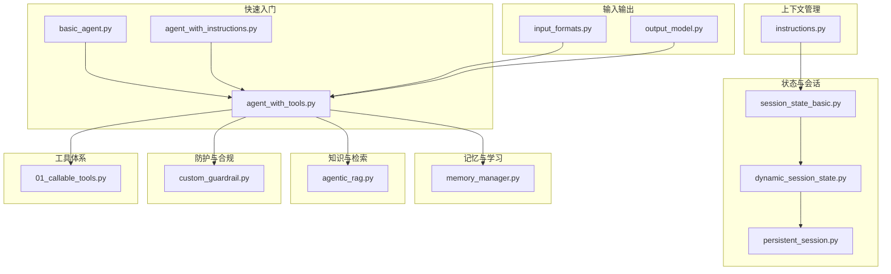
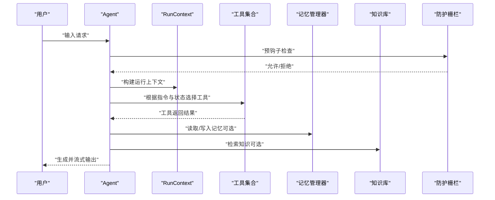
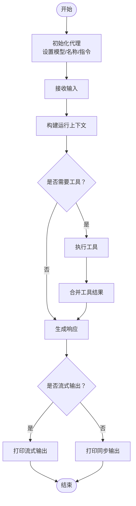
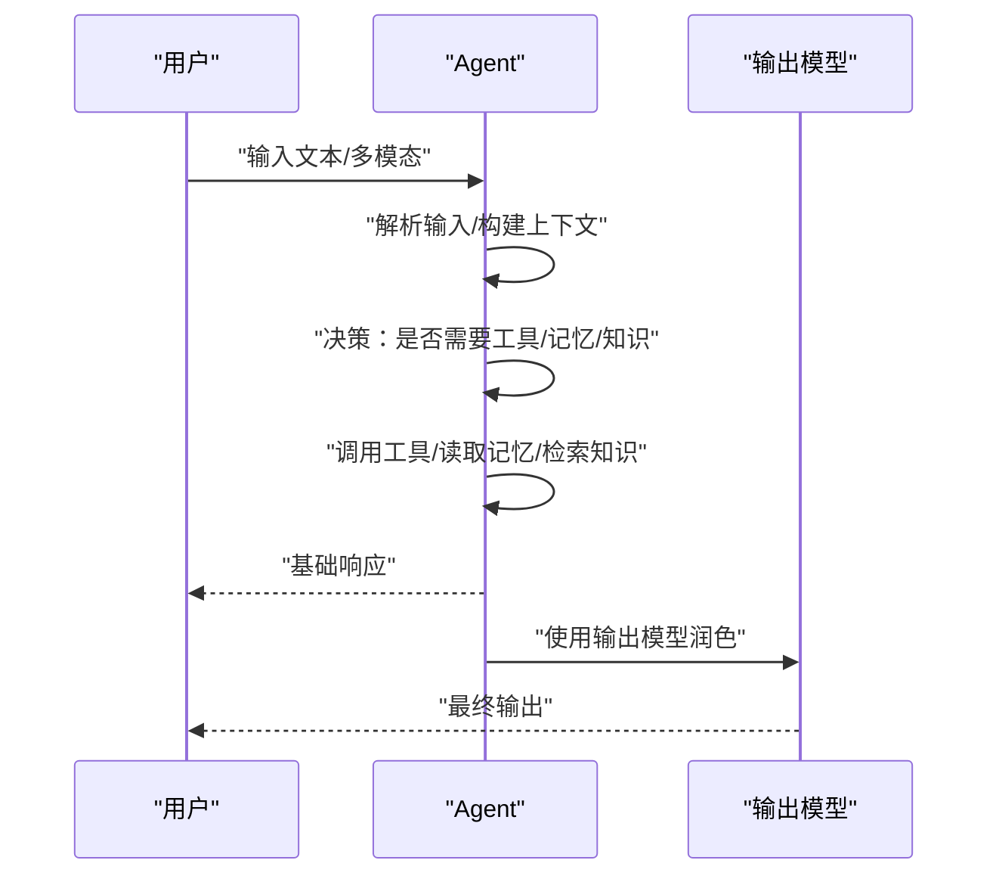
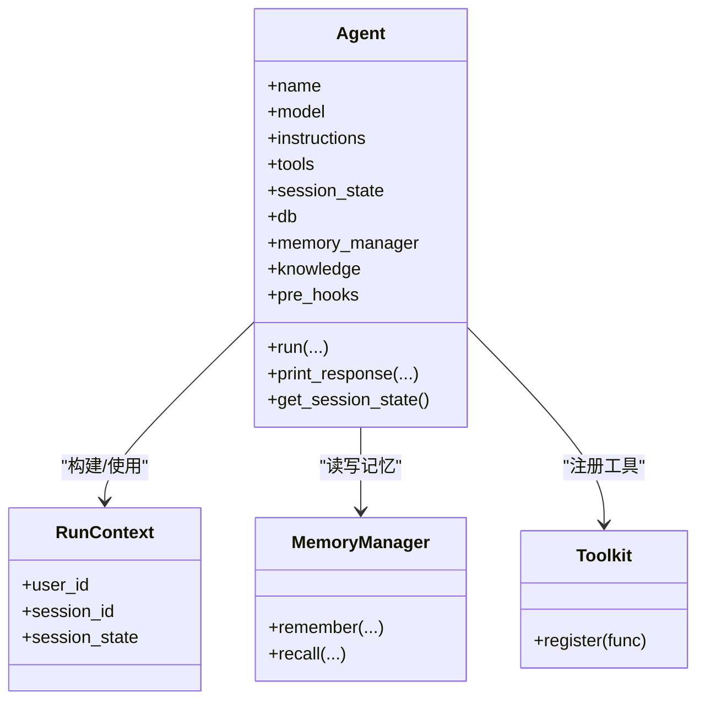
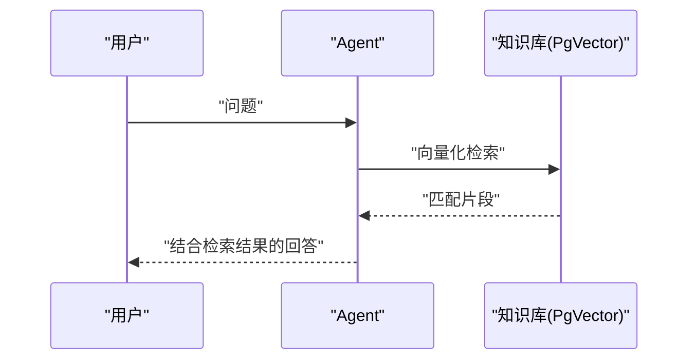
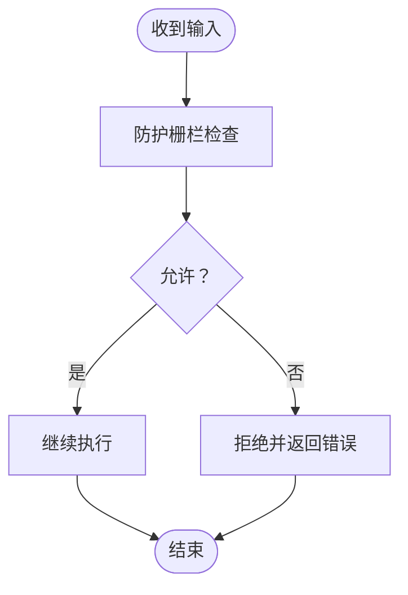
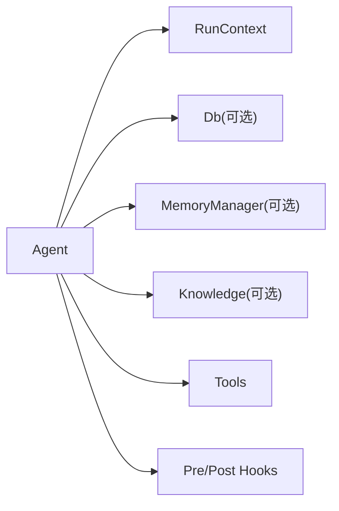

# 智能代理基础

<cite>
**本文引用的文件**
- [basic_agent.py](file://cookbook/02_agents/01_quickstart/basic_agent.py)
- [agent_with_instructions.py](file://cookbook/02_agents/01_quickstart/agent_with_instructions.py)
- [agent_with_tools.py](file://cookbook/02_agents/01_quickstart/agent_with_tools.py)
- [instructions.py](file://cookbook/02_agents/03_context_management/instructions.py)
- [session_state_basic.py](file://cookbook/02_agents/05_state_and_session/session_state_basic.py)
- [dynamic_session_state.py](file://cookbook/02_agents/05_state_and_session/dynamic_session_state.py)
- [persistent_session.py](file://cookbook/02_agents/05_state_and_session/persistent_session.py)
- [memory_manager.py](file://cookbook/02_agents/06_memory_and_learning/memory_manager.py)
- [agentic_rag.py](file://cookbook/02_agents/07_knowledge/agentic_rag.py)
- [custom_guardrail.py](file://cookbook/02_agents/08_guardrails/custom_guardrail.py)
- [01_callable_tools.py](file://cookbook/02_agents/04_tools/01_callable_tools.py)
- [input_formats.py](file://cookbook/02_agents/02_input_output/input_formats.py)
- [output_model.py](file://cookbook/02_agents/02_input_output/output_model.py)
</cite>

## 目录
1. [简介](#简介)
2. [项目结构](#项目结构)
3. [核心组件](#核心组件)
4. [架构总览](#架构总览)
5. [详细组件分析](#详细组件分析)
6. [依赖分析](#依赖分析)
7. [性能考虑](#性能考虑)
8. [故障排查指南](#故障排查指南)
9. [结论](#结论)
10. [附录](#附录)

## 简介
本入门文档面向初学者，系统讲解智能代理（Agent）的基础概念与实践方法。内容涵盖代理的定义、组成要素（属性与方法）、生命周期；对比传统软件与代理的差异；解释代理的工作原理（输入处理、决策制定、工具调用、输出生成）；说明状态管理（会话状态、记忆存储、上下文维护）；并通过仓库中的示例文件展示如何创建与使用基础代理。

## 项目结构
本仓库以“食谱式教程”组织，围绕“代理（Agent）”主题提供从快速入门到进阶应用的系列示例。与智能代理相关的关键路径如下：
- 快速入门：基础代理、带指令的代理、带工具的代理
- 上下文管理：系统消息、指令与状态联动
- 状态与会话：基础会话状态、动态会话状态、持久化会话
- 记忆与学习：代理记忆管理器
- 知识与检索：基于向量库的代理式RAG
- 防护与合规：自定义防护栅栏
- 工具体系：可调用工具工厂、工具选择与限制
- 输入输出：多模态输入格式、输出模型与解析模型

图表来源
- [basic_agent.py:1-26](file://cookbook/02_agents/01_quickstart/basic_agent.py#L1-L26)
- [agent_with_instructions.py:1-33](file://cookbook/02_agents/01_quickstart/agent_with_instructions.py#L1-L33)
- [agent_with_tools.py:1-28](file://cookbook/02_agents/01_quickstart/agent_with_tools.py#L1-L28)
- [instructions.py:1-27](file://cookbook/02_agents/03_context_management/instructions.py#L1-L27)
- [session_state_basic.py:1-49](file://cookbook/02_agents/05_state_and_session/session_state_basic.py#L1-L49)
- [dynamic_session_state.py:1-95](file://cookbook/02_agents/05_state_and_session/dynamic_session_state.py#L1-L95)
- [persistent_session.py:1-31](file://cookbook/02_agents/05_state_and_session/persistent_session.py#L1-L31)
- [memory_manager.py:1-48](file://cookbook/02_agents/06_memory_and_learning/memory_manager.py#L1-L48)
- [agentic_rag.py:1-50](file://cookbook/02_agents/07_knowledge/agentic_rag.py#L1-L50)
- [custom_guardrail.py:1-46](file://cookbook/02_agents/08_guardrails/custom_guardrail.py#L1-L46)
- [01_callable_tools.py:1-94](file://cookbook/02_agents/04_tools/01_callable_tools.py#L1-L94)
- [input_formats.py:1-35](file://cookbook/02_agents/02_input_output/input_formats.py#L1-L35)
- [output_model.py:1-35](file://cookbook/02_agents/02_input_output/output_model.py#L1-L35)

章节来源
- [basic_agent.py:1-26](file://cookbook/02_agents/01_quickstart/basic_agent.py#L1-L26)
- [agent_with_instructions.py:1-33](file://cookbook/02_agents/01_quickstart/agent_with_instructions.py#L1-L33)
- [agent_with_tools.py:1-28](file://cookbook/02_agents/01_quickstart/agent_with_tools.py#L1-L28)

## 核心组件
- 代理（Agent）
  - 属性：名称、模型、指令、工具集、会话状态、数据库、记忆管理器、知识库、防护钩子等
  - 方法：运行与流式输出打印、获取会话状态、执行工具等
- 运行上下文（RunContext）
  - 保存当前运行的用户ID、会话ID、会话状态等，贯穿一次交互的全生命周期
- 数据库（Db）
  - 支持内存、SQLite、PostgreSQL、向量数据库等，用于持久化会话与知识
- 记忆管理器（MemoryManager）
  - 提供结构化的记忆存储与检索能力
- 工具（Tools）
  - 可调用函数或工具包，支持按用户/会话动态装配
- 防护栅栏（Guardrails）
  - 在输入/输出阶段进行安全与合规检查

章节来源
- [session_state_basic.py:27-36](file://cookbook/02_agents/05_state_and_session/session_state_basic.py#L27-L36)
- [memory_manager.py:18-29](file://cookbook/02_agents/06_memory_and_learning/memory_manager.py#L18-L29)
- [01_callable_tools.py:44-55](file://cookbook/02_agents/04_tools/01_callable_tools.py#L44-L55)
- [custom_guardrail.py:33-37](file://cookbook/02_agents/08_guardrails/custom_guardrail.py#L33-L37)

## 架构总览
下图展示了从用户输入到代理输出的整体流程，以及与工具、记忆、知识、防护栅栏的交互关系。

图表来源
- [agent_with_tools.py:14-27](file://cookbook/02_agents/01_quickstart/agent_with_tools.py#L14-L27)
- [memory_manager.py:18-29](file://cookbook/02_agents/06_memory_and_learning/memory_manager.py#L18-L29)
- [agentic_rag.py:28-35](file://cookbook/02_agents/07_knowledge/agentic_rag.py#L28-L35)
- [custom_guardrail.py:33-37](file://cookbook/02_agents/08_guardrails/custom_guardrail.py#L33-L37)

## 详细组件分析

### 基础代理与生命周期
- 定义与初始化：设置模型、名称等基础属性
- 生命周期阶段：接收输入、构建上下文、选择工具、执行工具、生成输出、更新状态
- 输出方式：同步输出或流式输出打印

章节来源
- [basic_agent.py:14-25](file://cookbook/02_agents/01_quickstart/basic_agent.py#L14-L25)
- [agent_with_instructions.py:22-26](file://cookbook/02_agents/01_quickstart/agent_with_instructions.py#L22-L26)
- [agent_with_tools.py:15-19](file://cookbook/02_agents/01_quickstart/agent_with_tools.py#L15-L19)

### 代理与传统软件的区别
- 自主性：代理可自主选择工具与策略，而非严格遵循固定脚本
- 目标导向性：通过指令与规划驱动，围绕目标完成任务
- 适应性：结合上下文、记忆与知识，动态调整行为

章节来源
- [agent_with_instructions.py:14-17](file://cookbook/02_agents/01_quickstart/agent_with_instructions.py#L14-L17)
- [01_callable_tools.py:44-55](file://cookbook/02_agents/04_tools/01_callable_tools.py#L44-L55)

### 输入处理、决策制定、工具调用与输出生成
- 输入处理：支持文本、多模态结构化输入
- 决策制定：依据指令、上下文与工具可用性进行推理
- 工具调用：按需调用工具，支持动态工具集
- 输出生成：支持普通输出与专用输出模型优化

图表来源
- [input_formats.py:19-34](file://cookbook/02_agents/02_input_output/input_formats.py#L19-L34)
- [output_model.py:22-27](file://cookbook/02_agents/02_input_output/output_model.py#L22-L27)
- [01_callable_tools.py:44-55](file://cookbook/02_agents/04_tools/01_callable_tools.py#L44-L55)

章节来源
- [input_formats.py:19-34](file://cookbook/02_agents/02_input_output/input_formats.py#L19-L34)
- [output_model.py:22-27](file://cookbook/02_agents/02_input_output/output_model.py#L22-L27)
- [01_callable_tools.py:44-55](file://cookbook/02_agents/04_tools/01_callable_tools.py#L44-L55)

### 状态管理：会话状态、记忆存储与上下文维护
- 会话状态（Session State）
  - 基础会话状态：在代理初始化时设定，随交互更新
  - 动态会话状态：通过工具钩子直接修改，避免调用原始工具
  - 持久化会话：通过数据库将会话状态长期保存
- 记忆存储（Memory）
  - 使用记忆管理器实现跨会话的记忆持久化与检索
- 上下文维护（Context）
  - 指令中可引用会话状态变量，实现个性化系统提示

图表来源
- [session_state_basic.py:27-36](file://cookbook/02_agents/05_state_and_session/session_state_basic.py#L27-L36)
- [dynamic_session_state.py:70-78](file://cookbook/02_agents/05_state_and_session/dynamic_session_state.py#L70-L78)
- [memory_manager.py:18-29](file://cookbook/02_agents/06_memory_and_learning/memory_manager.py#L18-L29)

章节来源
- [session_state_basic.py:14-44](file://cookbook/02_agents/05_state_and_session/session_state_basic.py#L14-L44)
- [dynamic_session_state.py:35-78](file://cookbook/02_agents/05_state_and_session/dynamic_session_state.py#L35-L78)
- [persistent_session.py:19-24](file://cookbook/02_agents/05_state_and_session/persistent_session.py#L19-L24)
- [memory_manager.py:18-47](file://cookbook/02_agents/06_memory_and_learning/memory_manager.py#L18-L47)

### 知识与检索：代理式RAG
- 将知识库（向量数据库）与代理结合，启用“代理式RAG”
- 支持检索增强生成，提升回答准确性与可溯源性

图表来源
- [agentic_rag.py:15-35](file://cookbook/02_agents/07_knowledge/agentic_rag.py#L15-L35)

章节来源
- [agentic_rag.py:15-44](file://cookbook/02_agents/07_knowledge/agentic_rag.py#L15-L44)

### 防护与合规：自定义防护栅栏
- 在输入阶段对敏感内容进行拦截，保障安全与合规
- 可扩展为多种检查类型（如PII检测、提示注入防护）

图表来源
- [custom_guardrail.py:14-28](file://cookbook/02_agents/08_guardrails/custom_guardrail.py#L14-L28)

章节来源
- [custom_guardrail.py:14-45](file://cookbook/02_agents/08_guardrails/custom_guardrail.py#L14-L45)

### 工具体系：可调用工具工厂
- 工具可按用户角色/会话状态动态装配
- 支持缓存与复用，降低重复初始化成本

章节来源
- [01_callable_tools.py:44-68](file://cookbook/02_agents/04_tools/01_callable_tools.py#L44-L68)

### 输入输出：多模态与输出模型
- 输入：支持结构化多模态输入（文本+图片等）
- 输出：可配置输出模型对主模型输出进行润色与优化

章节来源
- [input_formats.py:19-34](file://cookbook/02_agents/02_input_output/input_formats.py#L19-L34)
- [output_model.py:22-34](file://cookbook/02_agents/02_input_output/output_model.py#L22-L34)

## 依赖分析
- 组件耦合
  - Agent与RunContext强耦合：贯穿一次运行的上下文信息
  - Agent与Db弱耦合：通过注入实现会话与记忆持久化
  - Agent与MemoryManager弱耦合：按需启用
  - Agent与Knowledge弱耦合：按需启用RAG
  - Agent与Tools弱耦合：通过工具注册与钩子扩展
  - Agent与Guardrails弱耦合：通过钩子链路接入
- 外部依赖
  - 向量数据库（PgVector）、嵌入模型、数据库驱动等

图表来源
- [session_state_basic.py:27-36](file://cookbook/02_agents/05_state_and_session/session_state_basic.py#L27-L36)
- [memory_manager.py:18-29](file://cookbook/02_agents/06_memory_and_learning/memory_manager.py#L18-L29)
- [agentic_rag.py:28-35](file://cookbook/02_agents/07_knowledge/agentic_rag.py#L28-L35)
- [custom_guardrail.py:33-37](file://cookbook/02_agents/08_guardrails/custom_guardrail.py#L33-L37)

## 性能考虑
- 工具缓存：按用户/会话缓存工具集，减少重复初始化
- 流式输出：在长文本生成时采用流式输出，改善用户体验
- 向量检索：合理设置检索参数与分页，平衡召回与速度
- 记忆与知识：控制上下文长度，避免过长上下文导致性能下降
- 数据库：对频繁查询建立索引，使用连接池与批量写入

## 故障排查指南
- 工具未生效
  - 检查工具是否正确注册或工厂是否返回对应工具
  - 确认工具钩子是否覆盖了原始工具行为
- 会话状态未更新
  - 确认工具是否直接修改了session_state
  - 检查持久化数据库是否正确配置
- 记忆未命中
  - 确认记忆管理器已启用且数据库可用
  - 检查记忆写入与检索的触发条件
- 防护栅栏误判
  - 调整阻断词表或检查规则逻辑
  - 开启日志定位具体触发点

章节来源
- [dynamic_session_state.py:35-78](file://cookbook/02_agents/05_state_and_session/dynamic_session_state.py#L35-L78)
- [session_state_basic.py:14-44](file://cookbook/02_agents/05_state_and_session/session_state_basic.py#L14-L44)
- [memory_manager.py:18-47](file://cookbook/02_agents/06_memory_and_learning/memory_manager.py#L18-L47)
- [custom_guardrail.py:14-28](file://cookbook/02_agents/08_guardrails/custom_guardrail.py#L14-L28)

## 结论
智能代理通过“输入—决策—工具—输出”的闭环，实现了比传统软件更强的自主性、目标导向性与适应性。借助会话状态、记忆管理、知识检索与防护栅栏，代理能够在复杂场景中稳定、安全地完成任务。建议从基础代理开始，逐步引入指令、工具、记忆与知识，最终形成具备上下文感知与持续学习能力的智能体。

## 附录
- 快速上手步骤
  - 创建基础代理并打印响应
  - 添加指令，约束输出风格
  - 注册工具，启用工具调用
  - 引入会话状态，实现跨轮次记忆
  - 启用记忆管理器，实现跨会话记忆
  - 集成知识库，开启代理式RAG
  - 加入防护栅栏，确保安全合规
- 示例文件路径
  - 基础代理：[basic_agent.py:1-26](file://cookbook/02_agents/01_quickstart/basic_agent.py#L1-L26)
  - 带指令代理：[agent_with_instructions.py:1-33](file://cookbook/02_agents/01_quickstart/agent_with_instructions.py#L1-L33)
  - 带工具代理：[agent_with_tools.py:1-28](file://cookbook/02_agents/01_quickstart/agent_with_tools.py#L1-L28)
  - 会话状态：[session_state_basic.py:1-49](file://cookbook/02_agents/05_state_and_session/session_state_basic.py#L1-L49)
  - 动态会话状态：[dynamic_session_state.py:1-95](file://cookbook/02_agents/05_state_and_session/dynamic_session_state.py#L1-L95)
  - 持久化会话：[persistent_session.py:1-31](file://cookbook/02_agents/05_state_and_session/persistent_session.py#L1-L31)
  - 记忆管理：[memory_manager.py:1-48](file://cookbook/02_agents/06_memory_and_learning/memory_manager.py#L1-L48)
  - 代理式RAG：[agentic_rag.py:1-50](file://cookbook/02_agents/07_knowledge/agentic_rag.py#L1-L50)
  - 防护栅栏：[custom_guardrail.py:1-46](file://cookbook/02_agents/08_guardrails/custom_guardrail.py#L1-L46)
  - 可调用工具工厂：[01_callable_tools.py:1-94](file://cookbook/02_agents/04_tools/01_callable_tools.py#L1-L94)
  - 多模态输入：[input_formats.py:1-35](file://cookbook/02_agents/02_input_output/input_formats.py#L1-L35)
  - 输出模型：[output_model.py:1-35](file://cookbook/02_agents/02_input_output/output_model.py#L1-L35)