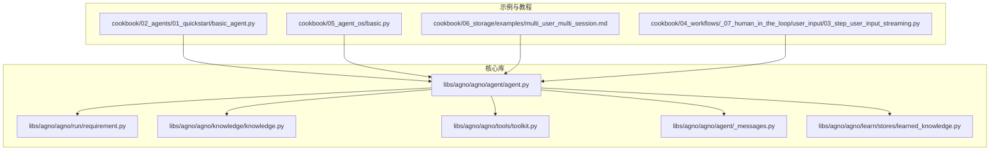
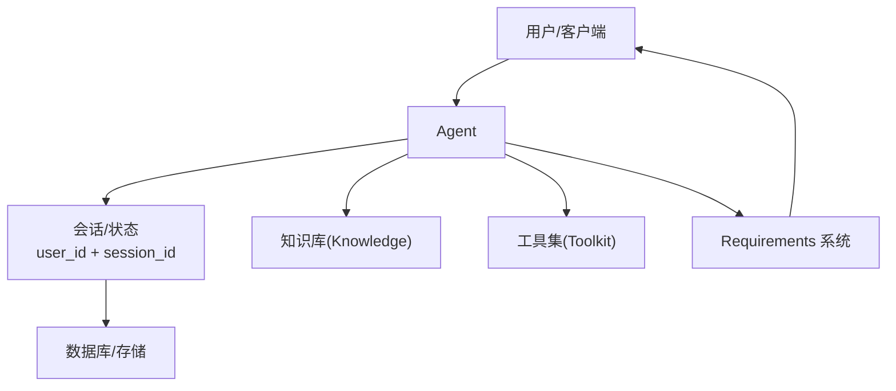
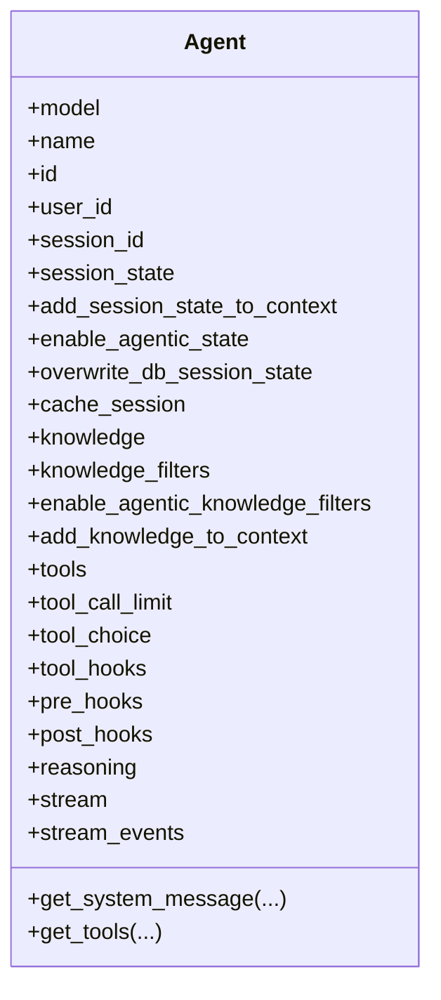
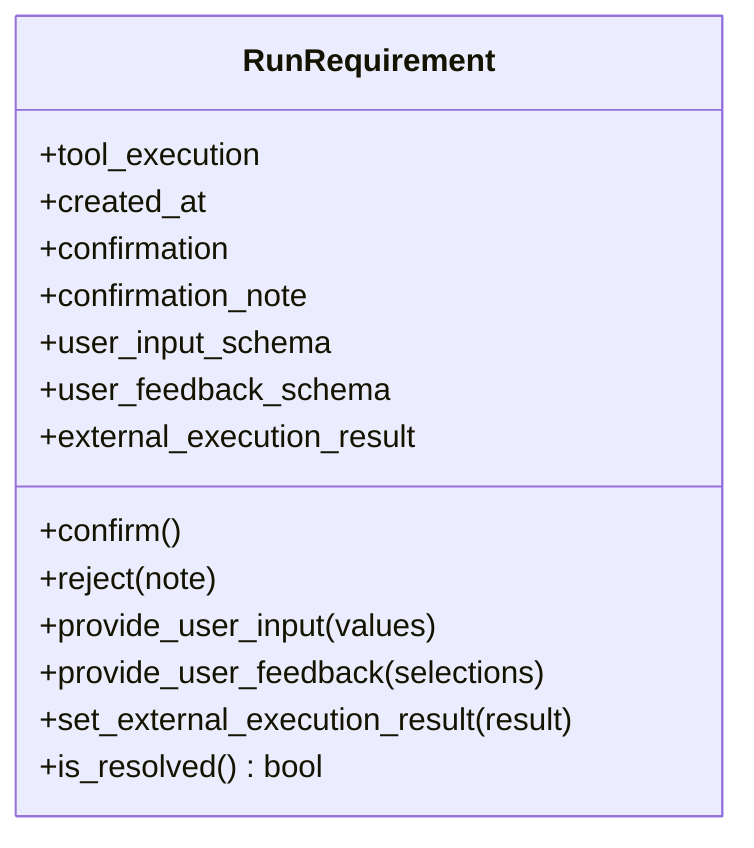
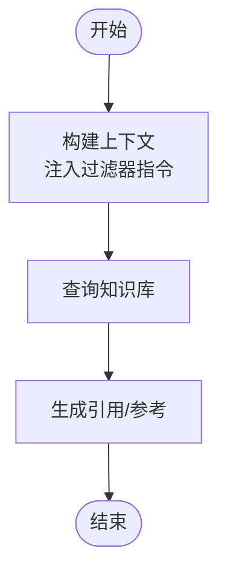
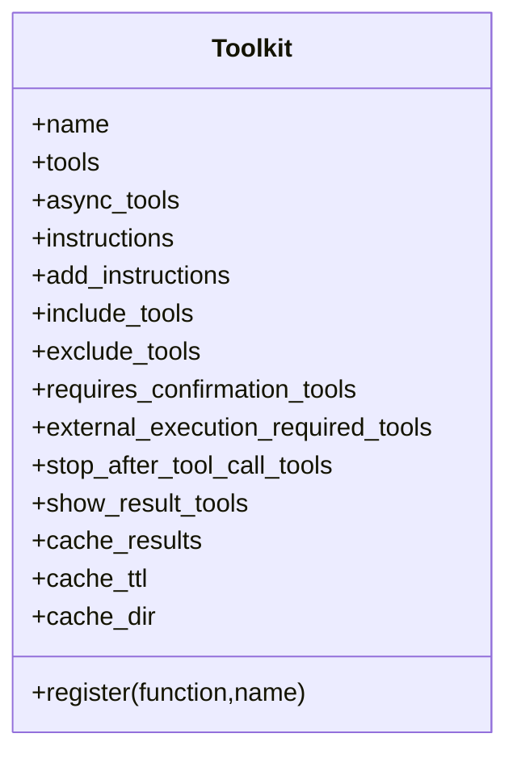
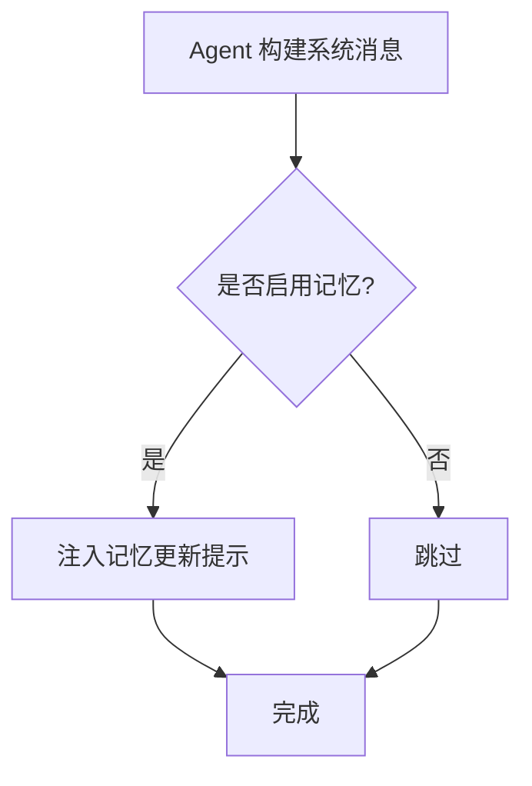
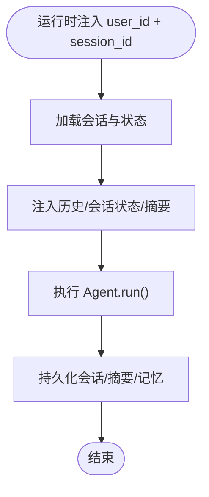
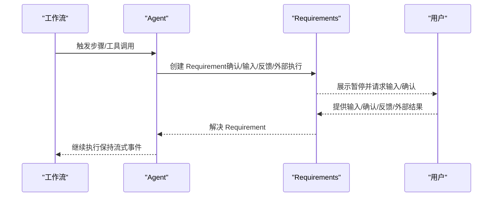
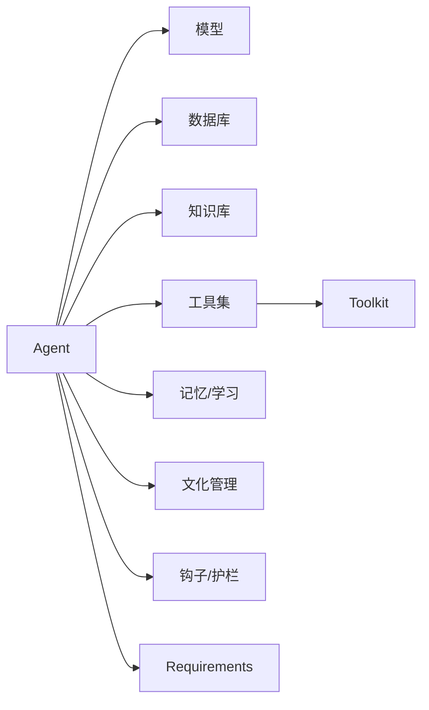

# 核心概念

<cite>
**本文引用的文件**   
- [libs/agno/agno/agent/agent.py](file://libs/agno/agno/agent/agent.py)
- [libs/agno/agno/run/requirement.py](file://libs/agno/agno/run/requirement.py)
- [libs/agno/agno/knowledge/knowledge.py](file://libs/agno/agno/knowledge/knowledge.py)
- [libs/agno/agno/tools/toolkit.py](file://libs/agno/agno/tools/toolkit.py)
- [libs/agno/agno/agent/_messages.py](file://libs/agno/agno/agent/_messages.py)
- [libs/agno/agno/learn/stores/learned_knowledge.py](file://libs/agno/agno/learn/stores/learned_knowledge.py)
- [libs/agno/tests/unit/db/test_session_isolation.py](file://libs/agno/tests/unit/db/test_session_isolation.py)
- [cookbook/06_storage/examples/multi_user_multi_session.md](file://cookbook/06_storage/examples/multi_user_multi_session.md)
- [cookbook/04_workflows/_07_human_in_the_loop/user_input/03_step_user_input_streaming.py](file://cookbook/04_workflows/_07_human_in_the_loop/user_input/03_step_user_input_streaming.py)
- [cookbook/05_agent_os/basic.py](file://cookbook/05_agent_os/basic.py)
- [cookbook/02_agents/01_quickstart/basic_agent.py](file://cookbook/02_agents/01_quickstart/basic_agent.py)
- [cookbook/07_knowledge/filters/agentic_filtering.md](file://cookbook/07_knowledge/filters/agentic_filtering.md)
- [cookbook/02_agents/07_knowledge/knowledge_filters.md](file://cookbook/02_agents/07_knowledge/knowledge_filters.md)
</cite>

## 目录
1. [引言](#引言)
2. [项目结构](#项目结构)
3. [核心组件](#核心组件)
4. [架构总览](#架构总览)
5. [详细组件分析](#详细组件分析)
6. [依赖分析](#依赖分析)
7. [性能考量](#性能考量)
8. [故障排查指南](#故障排查指南)
9. [结论](#结论)
10. [附录](#附录)

## 引言
本文件面向不同经验水平的开发者，系统化阐述 Agno Learn 的核心概念与实践方法，重点围绕以下主题：
- AgentOS 运行时架构的设计理念与实现要点：无状态设计、会话作用域、Requirements 系统
- 智能代理（Agent）的基本组成与工作机制：记忆管理、知识库、护栏系统
- 会话状态管理：多用户隔离、历史记录管理
- 人机协作（Human-in-the-loop, HITL）模式及其在代理系统中的应用
- 流式响应与长时间运行执行的实现原理
- 结合示例路径与使用模式，帮助读者快速上手并深入理解

## 项目结构
Agno Learn 仓库采用“示例驱动 + 核心库”的组织方式：
- 示例与教程位于 cookbook 目录，覆盖从基础到高级的多种用法
- 核心库位于 libs/agno/agno，包含 Agent、会话、知识库、工具、学习、运行时等模块
- 测试位于 libs/agno/tests，用于验证关键行为（如会话隔离）

**图示来源**
- [cookbook/02_agents/01_quickstart/basic_agent.py:1-26](file://cookbook/02_agents/01_quickstart/basic_agent.py#L1-L26)
- [cookbook/05_agent_os/basic.py:1-74](file://cookbook/05_agent_os/basic.py#L1-L74)
- [cookbook/06_storage/examples/multi_user_multi_session.md:1-86](file://cookbook/06_storage/examples/multi_user_multi_session.md#L1-L86)
- [cookbook/04_workflows/_07_human_in_the_loop/user_input/03_step_user_input_streaming.py:1-278](file://cookbook/04_workflows/_07_human_in_the_loop/user_input/03_step_user_input_streaming.py#L1-L278)
- [libs/agno/agno/agent/agent.py:1-800](file://libs/agno/agno/agent/agent.py#L1-L800)
- [libs/agno/agno/run/requirement.py:1-273](file://libs/agno/agno/run/requirement.py#L1-L273)
- [libs/agno/agno/knowledge/knowledge.py:1-200](file://libs/agno/agno/knowledge/knowledge.py#L1-L200)
- [libs/agno/agno/tools/toolkit.py:1-200](file://libs/agno/agno/tools/toolkit.py#L1-L200)
- [libs/agno/agno/agent/_messages.py:315-685](file://libs/agno/agno/agent/_messages.py#L315-L685)
- [libs/agno/agno/learn/stores/learned_knowledge.py:878-903](file://libs/agno/agno/learn/stores/learned_knowledge.py#L878-L903)

**章节来源**
- [cookbook/02_agents/01_quickstart/basic_agent.py:1-26](file://cookbook/02_agents/01_quickstart/basic_agent.py#L1-L26)
- [cookbook/05_agent_os/basic.py:1-74](file://cookbook/05_agent_os/basic.py#L1-L74)

## 核心组件
本节聚焦 AgentOS 的关键构件与其职责边界。

- Agent：智能代理主体，负责上下文构建、工具选择与执行、记忆与知识注入、钩子与护栏、流式输出、会话状态管理等
- RunRequirement：运行期暂停需求的抽象，支撑 HITL 的确认、用户输入、反馈与外部执行
- Knowledge：知识库与检索协议实现，支持内容插入、检索、过滤与引用格式化
- Toolkit：工具集合与注册中心，统一管理同步/异步工具、缓存、确认与外部执行标记
- AgentMessages：系统消息与上下文构建逻辑，含文化知识、记忆更新提示、时间地点等上下文注入
- LearnedKnowledgeStore：学习与沉淀的知识存储，支持命名空间与审计元数据
- 会话隔离测试：验证多用户/多会话下的数据隔离与删除权限

**章节来源**
- [libs/agno/agno/agent/agent.py:67-362](file://libs/agno/agno/agent/agent.py#L67-L362)
- [libs/agno/agno/run/requirement.py:9-273](file://libs/agno/agno/run/requirement.py#L9-L273)
- [libs/agno/agno/knowledge/knowledge.py:40-65](file://libs/agno/agno/knowledge/knowledge.py#L40-L65)
- [libs/agno/agno/tools/toolkit.py:10-90](file://libs/agno/agno/tools/toolkit.py#L10-L90)
- [libs/agno/agno/agent/_messages.py:315-685](file://libs/agno/agno/agent/_messages.py#L315-L685)
- [libs/agno/agno/learn/stores/learned_knowledge.py:878-903](file://libs/agno/agno/learn/stores/learned_knowledge.py#L878-L903)
- [libs/agno/tests/unit/db/test_session_isolation.py:51-82](file://libs/agno/tests/unit/db/test_session_isolation.py#L51-L82)

## 架构总览
AgentOS 以“无状态 + 会话作用域”为核心设计理念：
- 无状态：Agent 本身不持久化状态，运行时所需状态由会话与数据库承载
- 会话作用域：通过 user_id 与 session_id 将上下文、历史、状态与记忆限定在会话范围内
- Requirements 系统：在工具调用或工作流步骤中遇到需要人类干预的点时，暂停并等待外部输入或确认
- 知识与记忆：通过 Knowledge 与 Memory/Learning 机制，按需注入与沉淀

**图示来源**
- [libs/agno/agno/agent/agent.py:67-120](file://libs/agno/agno/agent/agent.py#L67-L120)
- [libs/agno/agno/run/requirement.py:9-110](file://libs/agno/agno/run/requirement.py#L9-L110)
- [libs/agno/agno/knowledge/knowledge.py:40-65](file://libs/agno/agno/knowledge/knowledge.py#L40-L65)
- [libs/agno/agno/tools/toolkit.py:10-90](file://libs/agno/agno/tools/toolkit.py#L10-L90)

## 详细组件分析

### Agent：无状态设计与会话作用域
- 无状态设计：Agent 的字段多为配置与工厂缓存，运行时状态通过会话与数据库传递
- 会话作用域：通过 user_id 与 session_id 区分用户与会话；支持历史注入、会话摘要、状态合并/覆盖
- 上下文构建：系统消息、指令、知识、记忆、文化知识、依赖、时间/地点等可按需注入
- 工具与护栏：工具列表可延迟生成；预/后置钩子与护栏在运行前/后执行
- 流式输出：支持输出流与事件流，便于长时间运行任务的实时反馈

**图示来源**
- [libs/agno/agno/agent/agent.py:67-362](file://libs/agno/agno/agent/agent.py#L67-L362)
- [libs/agno/agno/agent/agent.py:742-777](file://libs/agno/agno/agent/agent.py#L742-L777)

**章节来源**
- [libs/agno/agno/agent/agent.py:67-362](file://libs/agno/agno/agent/agent.py#L67-L362)
- [libs/agno/agno/agent/agent.py:742-800](file://libs/agno/agno/agent/agent.py#L742-L800)

### Requirements 系统：HITL 的运行期暂停与恢复
- 用途：在工具调用或工作流步骤中，当需要人类确认、输入、反馈或外部执行结果时，暂停并等待
- 能力：确认/拒绝、用户输入（带校验）、用户反馈（多选/单选）、外部执行结果回填
- 生命周期：创建 -> 暂停 -> 解决 -> 继续运行

**图示来源**
- [libs/agno/agno/run/requirement.py:9-273](file://libs/agno/agno/run/requirement.py#L9-L273)

**章节来源**
- [libs/agno/agno/run/requirement.py:9-273](file://libs/agno/agno/run/requirement.py#L9-L273)

### 知识库与检索：RAG 与过滤
- 知识库：支持内容插入、异步插入、向量化、检索与引用格式化
- 过滤：支持静态过滤器与“代理推断过滤器”，优先级与注入策略明确
- 使用模式：在系统消息中注入过滤器使用说明，使模型学会如何构造过滤条件

**图示来源**
- [libs/agno/agno/knowledge/knowledge.py:40-65](file://libs/agno/agno/knowledge/knowledge.py#L40-L65)
- [cookbook/07_knowledge/filters/agentic_filtering.md:18-41](file://cookbook/07_knowledge/filters/agentic_filtering.md#L18-L41)
- [cookbook/02_agents/07_knowledge/knowledge_filters.md:126-169](file://cookbook/02_agents/07_knowledge/knowledge_filters.md#L126-L169)

**章节来源**
- [libs/agno/agno/knowledge/knowledge.py:40-200](file://libs/agno/agno/knowledge/knowledge.py#L40-L200)
- [cookbook/07_knowledge/filters/agentic_filtering.md:18-41](file://cookbook/07_knowledge/filters/agentic_filtering.md#L18-L41)
- [cookbook/02_agents/07_knowledge/knowledge_filters.md:126-169](file://cookbook/02_agents/07_knowledge/knowledge_filters.md#L126-L169)

### 工具与工具包：统一注册与生命周期
- Toolkit：统一注册同步/异步工具，支持包含/排除、确认要求、外部执行、结果缓存、显示控制等
- 工具函数：自动识别异步，按需映射名称，支持装饰器工具对象

**图示来源**
- [libs/agno/agno/tools/toolkit.py:10-200](file://libs/agno/agno/tools/toolkit.py#L10-L200)

**章节来源**
- [libs/agno/agno/tools/toolkit.py:10-200](file://libs/agno/agno/tools/toolkit.py#L10-L200)

### 记忆与文化：系统消息中的记忆更新提示与文化知识
- 记忆更新提示：在系统消息中注入“更新用户记忆”工具的使用说明，引导模型在对话中提取与更新记忆
- 文化知识：可选注入文化知识，增强上下文相关性

**图示来源**
- [libs/agno/agno/agent/_messages.py:315-325](file://libs/agno/agno/agent/_messages.py#L315-L325)
- [libs/agno/agno/agent/_messages.py:666-676](file://libs/agno/agno/agent/_messages.py#L666-L676)

**章节来源**
- [libs/agno/agno/agent/_messages.py:315-325](file://libs/agno/agno/agent/_messages.py#L315-L325)
- [libs/agno/agno/agent/_messages.py:666-676](file://libs/agno/agno/agent/_messages.py#L666-L676)

### 学习与沉淀：命名空间与审计元数据
- 支持“全局/用户”命名空间，用户命名空间需提供 user_id
- 审计元数据：记录 agent_id、team_id 等，便于溯源与治理

**章节来源**
- [libs/agno/agno/learn/stores/learned_knowledge.py:878-903](file://libs/agno/agno/learn/stores/learned_knowledge.py#L878-L903)

### 会话状态管理：多用户隔离与历史记录
- 多用户多会话：同一 Agent 实例通过运行时 user_id 与 session_id 区分用户与会话
- 历史注入：限制最近 N 次运行或消息，控制上下文长度
- 隔离与删除：单元测试验证按用户删除会话、跨用户删除受限、通配符删除等行为

**图示来源**
- [cookbook/06_storage/examples/multi_user_multi_session.md:49-86](file://cookbook/06_storage/examples/multi_user_multi_session.md#L49-L86)
- [libs/agno/tests/unit/db/test_session_isolation.py:51-82](file://libs/agno/tests/unit/db/test_session_isolation.py#L51-L82)

**章节来源**
- [cookbook/06_storage/examples/multi_user_multi_session.md:1-86](file://cookbook/06_storage/examples/multi_user_multi_session.md#L1-L86)
- [libs/agno/tests/unit/db/test_session_isolation.py:51-82](file://libs/agno/tests/unit/db/test_session_isolation.py#L51-L82)

### 人机协作（HITL）：确认、输入、反馈与外部执行
- 确认：工具调用前要求用户确认，支持拒绝并给出备注
- 用户输入：支持结构化输入字段（类型、必填、取值范围等），运行时收集并校验
- 用户反馈：支持结构化问题与选项，收集多选/单选结果
- 外部执行：工具可在代理循环之外执行，完成后回填结果
- 流式工作流：通过事件流检测暂停点，继续运行时仍保持流式输出

**图示来源**
- [libs/agno/agno/run/requirement.py:9-177](file://libs/agno/agno/run/requirement.py#L9-L177)
- [cookbook/04_workflows/_07_human_in_the_loop/user_input/03_step_user_input_streaming.py:166-278](file://cookbook/04_workflows/_07_human_in_the_loop/user_input/03_step_user_input_streaming.py#L166-L278)

**章节来源**
- [libs/agno/agno/run/requirement.py:9-273](file://libs/agno/agno/run/requirement.py#L9-L273)
- [cookbook/04_workflows/_07_human_in_the_loop/user_input/03_step_user_input_streaming.py:1-278](file://cookbook/04_workflows/_07_human_in_the_loop/user_input/03_step_user_input_streaming.py#L1-L278)

### 流式响应与长时间运行执行
- 输出流：Agent 支持输出流，逐步返回片段
- 事件流：工作流支持事件流（步骤开始/完成/暂停等），便于 UI 与可观测性
- 长时间运行：结合 HITL 与事件流，可在暂停点进行交互后再继续

**章节来源**
- [libs/agno/agno/agent/agent.py:305-314](file://libs/agno/agno/agent/agent.py#L305-L314)
- [cookbook/04_workflows/_07_human_in_the_loop/user_input/03_step_user_input_streaming.py:166-278](file://cookbook/04_workflows/_07_human_in_the_loop/user_input/03_step_user_input_streaming.py#L166-L278)

## 依赖分析
- Agent 依赖：模型、数据库、知识库、工具集、记忆/学习、文化管理、压缩、钩子、评估等
- Requirements 与运行时输出：在工具调用与工作流步骤暂停时被使用
- 知识库与过滤：在系统消息构建阶段注入过滤器指令
- 工具包：统一注册与生命周期管理，支持缓存与外部执行

**图示来源**
- [libs/agno/agno/agent/agent.py:23-64](file://libs/agno/agno/agent/agent.py#L23-L64)
- [libs/agno/agno/run/requirement.py:9-273](file://libs/agno/agno/run/requirement.py#L9-L273)
- [libs/agno/agno/tools/toolkit.py:10-90](file://libs/agno/agno/tools/toolkit.py#L10-L90)

**章节来源**
- [libs/agno/agno/agent/agent.py:23-64](file://libs/agno/agno/agent/agent.py#L23-L64)
- [libs/agno/agno/run/requirement.py:9-273](file://libs/agno/agno/run/requirement.py#L9-L273)
- [libs/agno/agno/tools/toolkit.py:10-200](file://libs/agno/agno/tools/toolkit.py#L10-L200)

## 性能考量
- 无状态设计降低实例间耦合，提升横向扩展能力
- 会话缓存（cache_session）与可选内存缓存可减少重复加载
- 历史注入限制（num_history_runs/num_history_messages）控制上下文规模，避免 OOM
- 工具结果压缩（compress_tool_results）与压缩管理器可减少上下文占用
- 流式输出与事件流有助于长任务的资源占用与用户体验优化

[本节为通用指导，无需特定文件引用]

## 故障排查指南
- 会话隔离问题：检查 user_id 与 session_id 注入是否一致；验证删除操作是否受用户权限限制
- Requirements 未解决：确认是否调用了 confirm/reject/set_user_input/provide_user_feedback/set_external_execution_result
- 知识过滤无效：确认 enable_agentic_knowledge_filters 开关与过滤器优先级逻辑
- 流式工作流中断：确保 stream=True 与 stream_events=True，使用 continue_run 并继续消费事件流

**章节来源**
- [libs/agno/tests/unit/db/test_session_isolation.py:51-82](file://libs/agno/tests/unit/db/test_session_isolation.py#L51-L82)
- [libs/agno/agno/run/requirement.py:98-177](file://libs/agno/agno/run/requirement.py#L98-L177)
- [cookbook/07_knowledge/filters/agentic_filtering.md:18-41](file://cookbook/07_knowledge/filters/agentic_filtering.md#L18-L41)
- [cookbook/04_workflows/_07_human_in_the_loop/user_input/03_step_user_input_streaming.py:166-278](file://cookbook/04_workflows/_07_human_in_the_loop/user_input/03_step_user_input_streaming.py#L166-L278)

## 结论
Agno Learn 通过“无状态 + 会话作用域 + Requirements 系统 + 知识/记忆/文化”的组合，提供了可扩展、可观测、可协作的智能代理运行时。开发者可基于示例快速上手，再根据业务场景定制工具、护栏与上下文策略，实现从简单问答到复杂工作流与团队协作的演进。

[本节为总结性内容，无需特定文件引用]

## 附录
- 快速开始示例：基础 Agent 与 AgentOS 最小示例
- 多用户多会话示例：在同一 Agent 实例中区分用户与会话
- 流式工作流与 HITL：步骤级用户输入与确认的流式处理

**章节来源**
- [cookbook/02_agents/01_quickstart/basic_agent.py:1-26](file://cookbook/02_agents/01_quickstart/basic_agent.py#L1-L26)
- [cookbook/05_agent_os/basic.py:1-74](file://cookbook/05_agent_os/basic.py#L1-L74)
- [cookbook/06_storage/examples/multi_user_multi_session.md:1-86](file://cookbook/06_storage/examples/multi_user_multi_session.md#L1-L86)
- [cookbook/04_workflows/_07_human_in_the_loop/user_input/03_step_user_input_streaming.py:1-278](file://cookbook/04_workflows/_07_human_in_the_loop/user_input/03_step_user_input_streaming.py#L1-L278)