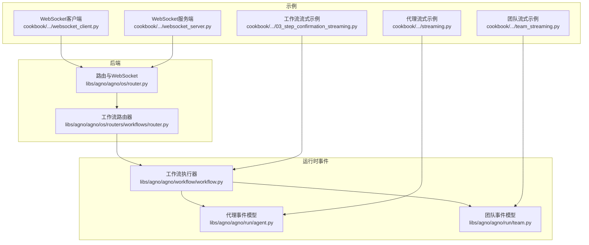
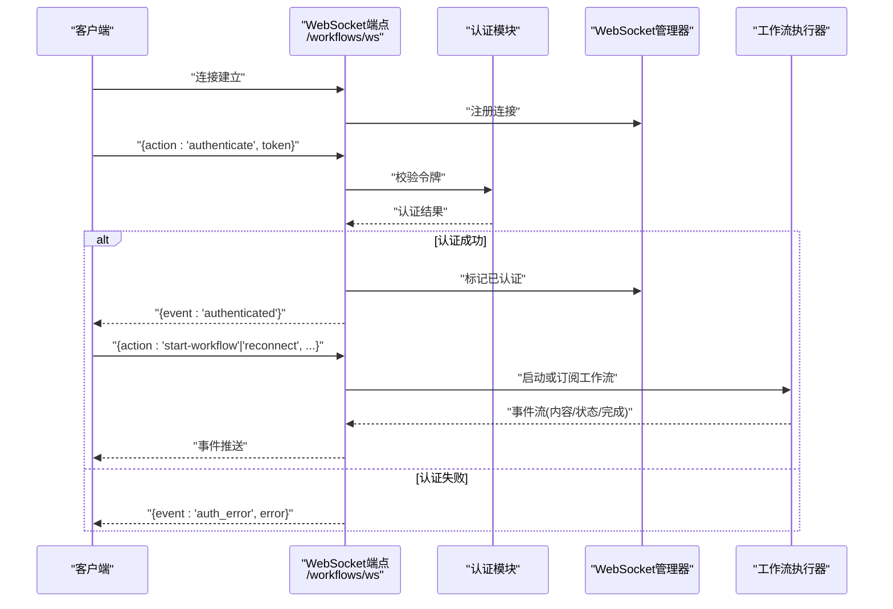
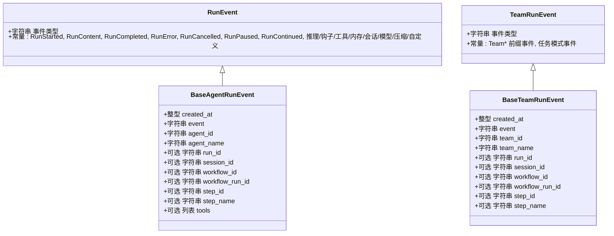
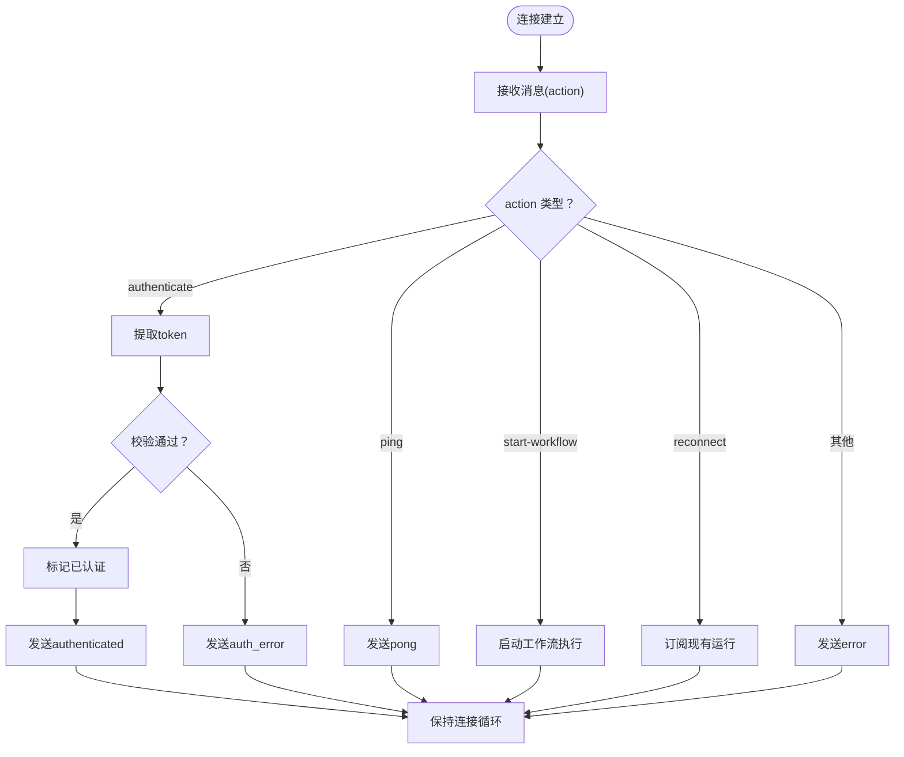
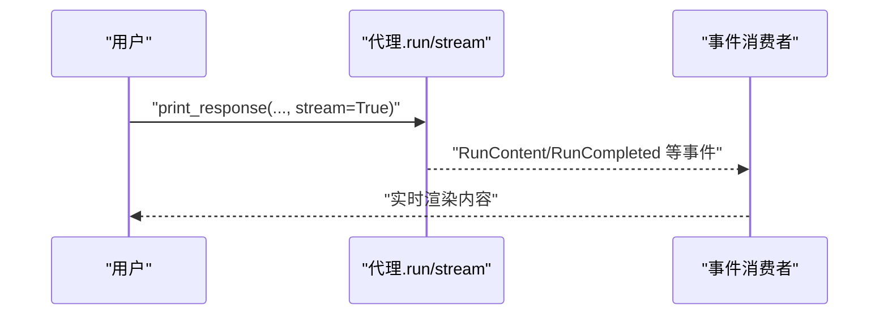
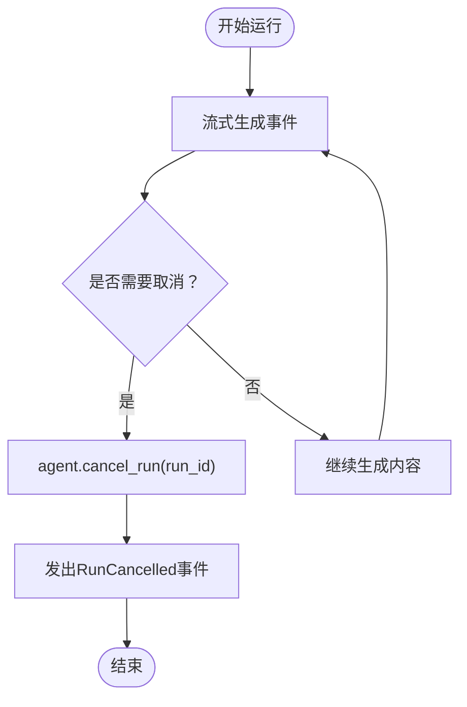
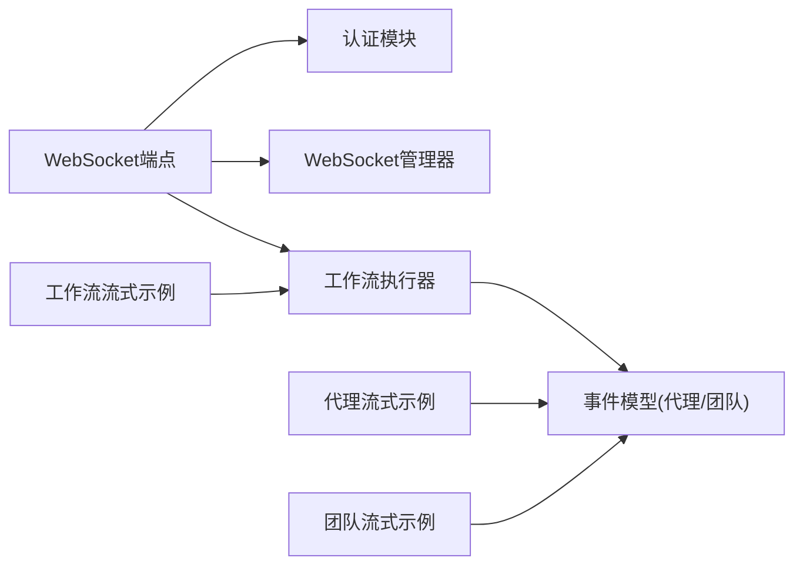

# 流式执行机制

<cite>
**本文引用的文件**
- [libs/agno/agno/os/router.py](file://libs/agno/agno/os/router.py)
- [libs/agno/agno/os/routers/workflows/router.py](file://libs/agno/agno/os/routers/workflows/router.py)
- [libs/agno/agno/run/agent.py](file://libs/agno/agno/run/agent.py)
- [libs/agno/agno/run/team.py](file://libs/agno/agno/run/team.py)
- [libs/agno/agno/workflow/workflow.py](file://libs/agno/agno/workflow/workflow.py)
- [cookbook/02_agents/02_input_output/streaming.py](file://cookbook/02_agents/02_input_output/streaming.py)
- [cookbook/03_teams/08_streaming/team_streaming.py](file://cookbook/03_teams/08_streaming/team_streaming.py)
- [cookbook/04_workflows/_07_human_in_the_loop/confirmation/03_step_confirmation_streaming.py](file://cookbook/04_workflows/_07_human_in_the_loop/confirmation/03_step_confirmation_streaming.py)
- [cookbook/04_workflows/06_advanced_concepts/background_execution/websocket_client.py](file://cookbook/04_workflows/06_advanced_concepts/background_execution/websocket_client.py)
- [cookbook/04_workflows/06_advanced_concepts/background_execution/websocket_server.py](file://cookbook/04_workflows/06_advanced_concepts/background_execution/websocket_server.py)
- [cookbook/02_agents/14_advanced/cancel_run.py](file://cookbook/02_agents/14_advanced/cancel_run.py)
- [libs/agno/agno/client/a2a/utils.py](file://libs/agno/agno/client/a2a/utils.py)
</cite>

## 目录
1. [简介](#简介)
2. [项目结构](#项目结构)
3. [核心组件](#核心组件)
4. [架构总览](#架构总览)
5. [详细组件分析](#详细组件分析)
6. [依赖分析](#依赖分析)
7. [性能考量](#性能考量)
8. [故障排除指南](#故障排除指南)
9. [结论](#结论)
10. [附录](#附录)

## 简介
本文件系统性阐述本仓库中的“流式执行机制”，涵盖以下主题：
- 流式响应的概念与优势：以事件驱动的方式逐步产出内容，降低首字节延迟并提升交互体验。
- 长时间运行任务：通过事件流与会话状态实现可恢复、可观测的后台执行。
- WebSocket 连接：建立、认证、订阅与断线重连，支持实时事件推送。
- 流式传输协议：事件类型、消息格式与错误处理。
- 控制机制：取消、超时与资源清理。
- 实战示例：流式代理、流式团队、流式工作流的实现路径与实时响应。

## 项目结构
围绕流式执行的关键代码分布在以下区域：
- 后端路由与 WebSocket：FastAPI 路由与工作流 WebSocket 端点，负责认证与事件分发。
- 运行时事件模型：代理、团队、工作流的事件枚举与事件载体。
- 示例与用法：代理/团队/工作流的流式示例，以及 WebSocket 客户端与服务端。
- 取消与控制：取消运行、取消管理器与资源清理工具。

图表来源
- [libs/agno/agno/os/router.py:238-311](file://libs/agno/agno/os/router.py#L238-L311)
- [libs/agno/agno/os/routers/workflows/router.py:401-441](file://libs/agno/agno/os/routers/workflows/router.py#L401-L441)
- [libs/agno/agno/run/agent.py:134-200](file://libs/agno/agno/run/agent.py#L134-L200)
- [libs/agno/agno/run/team.py:130-200](file://libs/agno/agno/run/team.py#L130-L200)
- [libs/agno/agno/workflow/workflow.py:3479-3888](file://libs/agno/agno/workflow/workflow.py#L3479-L3888)
- [cookbook/02_agents/02_input_output/streaming.py:1-28](file://cookbook/02_agents/02_input_output/streaming.py#L1-L28)
- [cookbook/03_teams/08_streaming/team_streaming.py:1-85](file://cookbook/03_teams/08_streaming/team_streaming.py#L1-L85)
- [cookbook/04_workflows/_07_human_in_the_loop/confirmation/03_step_confirmation_streaming.py:1-188](file://cookbook/04_workflows/_07_human_in_the_loop/confirmation/03_step_confirmation_streaming.py#L1-L188)
- [cookbook/04_workflows/06_advanced_concepts/background_execution/websocket_client.py:186-227](file://cookbook/04_workflows/06_advanced_concepts/background_execution/websocket_client.py#L186-L227)
- [cookbook/04_workflows/06_advanced_concepts/background_execution/websocket_server.py:110-138](file://cookbook/04_workflows/06_advanced_concepts/background_execution/websocket_server.py#L110-L138)

章节来源
- [libs/agno/agno/os/router.py:238-311](file://libs/agno/agno/os/router.py#L238-L311)
- [libs/agno/agno/run/agent.py:134-200](file://libs/agno/agno/run/agent.py#L134-L200)
- [libs/agno/agno/run/team.py:130-200](file://libs/agno/agno/run/team.py#L130-L200)
- [libs/agno/agno/workflow/workflow.py:3479-3888](file://libs/agno/agno/workflow/workflow.py#L3479-L3888)
- [cookbook/02_agents/02_input_output/streaming.py:1-28](file://cookbook/02_agents/02_input_output/streaming.py#L1-L28)
- [cookbook/03_teams/08_streaming/team_streaming.py:1-85](file://cookbook/03_teams/08_streaming/team_streaming.py#L1-L85)
- [cookbook/04_workflows/_07_human_in_the_loop/confirmation/03_step_confirmation_streaming.py:1-188](file://cookbook/04_workflows/_07_human_in_the_loop/confirmation/03_step_confirmation_streaming.py#L1-L188)
- [cookbook/04_workflows/06_advanced_concepts/background_execution/websocket_client.py:186-227](file://cookbook/04_workflows/06_advanced_concepts/background_execution/websocket_client.py#L186-L227)
- [cookbook/04_workflows/06_advanced_concepts/background_execution/websocket_server.py:110-138](file://cookbook/04_workflows/06_advanced_concepts/background_execution/websocket_server.py#L110-L138)

## 核心组件
- 事件模型与枚举
  - 代理事件：包含运行开始、内容增量、推理步骤、钩子、工具调用、内存更新、会话摘要、解析/输出模型响应、压缩、暂停/继续、自定义事件等。
  - 团队事件：在代理事件基础上扩展团队维度，并增加任务模式相关事件。
- WebSocket 路由与认证
  - 提供工作流 WebSocket 端点，支持 authenticate/ping/start-workflow/reconnect 等动作；按配置要求进行认证校验。
- 工作流执行器
  - 支持同步与异步流式执行，将底层事件向上冒泡，便于外部订阅与展示。
- 示例与客户端
  - 代理/团队/工作流的流式示例；WebSocket 客户端/服务端用于演示连接、认证与事件推送。

章节来源
- [libs/agno/agno/run/agent.py:134-200](file://libs/agno/agno/run/agent.py#L134-L200)
- [libs/agno/agno/run/team.py:130-200](file://libs/agno/agno/run/team.py#L130-L200)
- [libs/agno/agno/os/router.py:238-311](file://libs/agno/agno/os/router.py#L238-L311)
- [libs/agno/agno/workflow/workflow.py:3479-3888](file://libs/agno/agno/workflow/workflow.py#L3479-L3888)
- [cookbook/02_agents/02_input_output/streaming.py:1-28](file://cookbook/02_agents/02_input_output/streaming.py#L1-L28)
- [cookbook/03_teams/08_streaming/team_streaming.py:1-85](file://cookbook/03_teams/08_streaming/team_streaming.py#L1-L85)
- [cookbook/04_workflows/_07_human_in_the_loop/confirmation/03_step_confirmation_streaming.py:1-188](file://cookbook/04_workflows/_07_human_in_the_loop/confirmation/03_step_confirmation_streaming.py#L1-L188)
- [cookbook/04_workflows/06_advanced_concepts/background_execution/websocket_client.py:186-227](file://cookbook/04_workflows/06_advanced_concepts/background_execution/websocket_client.py#L186-L227)
- [cookbook/04_workflows/06_advanced_concepts/background_execution/websocket_server.py:110-138](file://cookbook/04_workflows/06_advanced_concepts/background_execution/websocket_server.py#L110-L138)

## 架构总览
下图展示了从客户端到后端、再到工作流执行器与事件系统的整体流程，以及 WebSocket 的认证与订阅路径。

图表来源
- [libs/agno/agno/os/router.py:248-311](file://libs/agno/agno/os/router.py#L248-L311)
- [libs/agno/agno/os/routers/workflows/router.py:401-441](file://libs/agno/agno/os/routers/workflows/router.py#L401-L441)

## 详细组件分析

### 事件模型与流式协议
- 事件类型
  - 代理事件：RunStarted、RunContent、RunContentCompleted、RunIntermediateContent、RunCompleted、RunError、RunCancelled、RunPaused、RunContinued、推理、钩子、工具调用、内存更新、会话摘要、解析/输出模型响应、压缩、自定义事件等。
  - 团队事件：在代理事件基础上扩展 Team* 前缀事件，并新增任务模式事件。
- 数据格式
  - 事件载体包含时间戳、事件类型、运行标识、会话标识、工作流/步骤上下文、工具执行记录等字段。
- 错误处理
  - 认证阶段返回 auth_required/auth_error；其他动作未知时返回 error；异常捕获后进行日志记录与连接清理。

图表来源
- [libs/agno/agno/run/agent.py:134-200](file://libs/agno/agno/run/agent.py#L134-L200)
- [libs/agno/agno/run/team.py:130-200](file://libs/agno/agno/run/team.py#L130-L200)

章节来源
- [libs/agno/agno/run/agent.py:134-200](file://libs/agno/agno/run/agent.py#L134-L200)
- [libs/agno/agno/run/team.py:130-200](file://libs/agno/agno/run/team.py#L130-L200)

### WebSocket 连接与认证
- 连接建立
  - 客户端通过 websockets 库连接 /workflows/ws；服务端接收文本消息并解析 action。
- 认证机制
  - authenticate 动作携带 token；支持 JWT 与传统 os_security_key 两种校验路径；未认证时对后续动作返回 auth_required。
- 消息格式
  - 认证成功返回 authenticated；错误返回 auth_error；未知动作返回 error；心跳 ping/pong。
- 断线重连
  - reconnect 动作用于订阅已有运行；客户端可自动提示输入 token 或使用预设令牌。

图表来源
- [libs/agno/agno/os/router.py:248-311](file://libs/agno/agno/os/router.py#L248-L311)
- [libs/agno/agno/os/routers/workflows/router.py:401-441](file://libs/agno/agno/os/routers/workflows/router.py#L401-L441)
- [cookbook/04_workflows/06_advanced_concepts/background_execution/websocket_client.py:186-227](file://cookbook/04_workflows/06_advanced_concepts/background_execution/websocket_client.py#L186-L227)
- [cookbook/04_workflows/06_advanced_concepts/background_execution/websocket_server.py:110-138](file://cookbook/04_workflows/06_advanced_concepts/background_execution/websocket_server.py#L110-L138)

章节来源
- [libs/agno/agno/os/router.py:248-311](file://libs/agno/agno/os/router.py#L248-L311)
- [libs/agno/agno/os/routers/workflows/router.py:401-441](file://libs/agno/agno/os/routers/workflows/router.py#L401-L441)
- [cookbook/04_workflows/06_advanced_concepts/background_execution/websocket_client.py:186-227](file://cookbook/04_workflows/06_advanced_concepts/background_execution/websocket_client.py#L186-L227)
- [cookbook/04_workflows/06_advanced_concepts/background_execution/websocket_server.py:110-138](file://cookbook/04_workflows/06_advanced_concepts/background_execution/websocket_server.py#L110-L138)

### 流式执行与事件消费
- 代理流式
  - 通过 print_response(..., stream=True) 或迭代 run(...) 输出事件，逐步打印内容增量。
- 团队流式
  - 支持同步与异步打印，成员响应可选择显示或隐藏。
- 工作流流式
  - run(..., stream=True, stream_events=True) 返回事件迭代器；支持暂停/确认/跳过/继续；完成后从会话获取最终结果。

图表来源
- [cookbook/02_agents/02_input_output/streaming.py:1-28](file://cookbook/02_agents/02_input_output/streaming.py#L1-L28)
- [libs/agno/agno/run/agent.py:134-200](file://libs/agno/agno/run/agent.py#L134-L200)

章节来源
- [cookbook/02_agents/02_input_output/streaming.py:1-28](file://cookbook/02_agents/02_input_output/streaming.py#L1-L28)
- [cookbook/03_teams/08_streaming/team_streaming.py:1-85](file://cookbook/03_teams/08_streaming/team_streaming.py#L1-L85)
- [cookbook/04_workflows/_07_human_in_the_loop/confirmation/03_step_confirmation_streaming.py:1-188](file://cookbook/04_workflows/_07_human_in_the_loop/confirmation/03_step_confirmation_streaming.py#L1-L188)
- [libs/agno/agno/run/agent.py:134-200](file://libs/agno/agno/run/agent.py#L134-L200)
- [libs/agno/agno/run/team.py:130-200](file://libs/agno/agno/run/team.py#L130-L200)

### 取消、超时与资源清理
- 取消运行
  - 通过 cancel_run(run_id) 触发取消；流式过程中会收到 RunCancelled 事件；示例中演示了多线程并发触发取消。
- 超时处理
  - 可结合定时器或外部调度在指定时间后取消运行。
- 资源清理
  - 使用清理工具关闭缓存资源，避免协程泄漏与句柄未释放。

图表来源
- [cookbook/02_agents/14_advanced/cancel_run.py:17-117](file://cookbook/02_agents/14_advanced/cancel_run.py#L17-L117)
- [libs/agno/agno/run/agent.py:134-200](file://libs/agno/agno/run/agent.py#L134-L200)

章节来源
- [cookbook/02_agents/14_advanced/cancel_run.py:17-117](file://cookbook/02_agents/14_advanced/cancel_run.py#L17-L117)
- [libs/agno/agno/run/agent.py:134-200](file://libs/agno/agno/run/agent.py#L134-L200)

### 实战示例：流式代理、团队与工作流
- 流式代理
  - 使用 print_response(..., stream=True) 实现实时内容输出。
- 流式团队
  - 同步/异步打印团队响应，可控制成员响应显示。
- 流式工作流
  - run(..., stream=True, stream_events=True) 获取事件流；遇到需要确认的步骤时暂停，用户确认/拒绝后继续。

章节来源
- [cookbook/02_agents/02_input_output/streaming.py:1-28](file://cookbook/02_agents/02_input_output/streaming.py#L1-L28)
- [cookbook/03_teams/08_streaming/team_streaming.py:1-85](file://cookbook/03_teams/08_streaming/team_streaming.py#L1-L85)
- [cookbook/04_workflows/_07_human_in_the_loop/confirmation/03_step_confirmation_streaming.py:1-188](file://cookbook/04_workflows/_07_human_in_the_loop/confirmation/03_step_confirmation_streaming.py#L1-L188)

## 依赖分析
- 组件耦合
  - WebSocket 路由依赖认证模块与 WebSocket 管理器；工作流执行器依赖事件模型与会话；示例脚本依赖具体执行器。
- 外部依赖
  - websockets 库用于客户端连接；FastAPI 用于服务端路由。
- 循环依赖
  - 当前结构以路由/执行器/事件模型为主干，未见明显循环导入。

图表来源
- [libs/agno/agno/os/router.py:248-311](file://libs/agno/agno/os/router.py#L248-L311)
- [libs/agno/agno/os/routers/workflows/router.py:401-441](file://libs/agno/agno/os/routers/workflows/router.py#L401-L441)
- [libs/agno/agno/workflow/workflow.py:3479-3888](file://libs/agno/agno/workflow/workflow.py#L3479-L3888)
- [libs/agno/agno/run/agent.py:134-200](file://libs/agno/agno/run/agent.py#L134-L200)
- [libs/agno/agno/run/team.py:130-200](file://libs/agno/agno/run/team.py#L130-L200)

章节来源
- [libs/agno/agno/os/router.py:248-311](file://libs/agno/agno/os/router.py#L248-L311)
- [libs/agno/agno/os/routers/workflows/router.py:401-441](file://libs/agno/agno/os/routers/workflows/router.py#L401-L441)
- [libs/agno/agno/workflow/workflow.py:3479-3888](file://libs/agno/agno/workflow/workflow.py#L3479-L3888)
- [libs/agno/agno/run/agent.py:134-200](file://libs/agno/agno/run/agent.py#L134-L200)
- [libs/agno/agno/run/team.py:130-200](file://libs/agno/agno/run/team.py#L130-L200)

## 性能考量
- 低延迟首包
  - 事件驱动的增量输出显著缩短首字节时间，改善用户体验。
- 背压与缓冲
  - 在客户端侧对内容块进行累积与截断显示，避免过长内容阻塞 UI。
- 并发与资源
  - 使用异步/协程与资源清理工具，防止句柄泄漏与协程警告。
- 认证与鉴权
  - 将认证前置，减少无效请求与错误开销；对异常进行降级处理与日志记录。

## 故障排除指南
- WebSocket 认证失败
  - 确认 token 是否正确传递；检查服务端日志与错误事件。
- 未认证访问
  - 对需要认证的环境，先发送 authenticate 再执行其他动作。
- 连接异常断开
  - 使用 reconnect 动作重新订阅；客户端可提示输入 token 或自动填充。
- 取消无效
  - 确认 run_id 是否存在且未完成；检查取消管理器状态与线程安全。
- 事件丢失
  - 确保客户端持续消费事件流；服务端异常捕获与连接清理逻辑正常。

章节来源
- [libs/agno/agno/os/router.py:248-311](file://libs/agno/agno/os/router.py#L248-L311)
- [libs/agno/agno/os/routers/workflows/router.py:401-441](file://libs/agno/agno/os/routers/workflows/router.py#L401-L441)
- [cookbook/04_workflows/06_advanced_concepts/background_execution/websocket_client.py:186-227](file://cookbook/04_workflows/06_advanced_concepts/background_execution/websocket_client.py#L186-L227)
- [cookbook/04_workflows/06_advanced_concepts/background_execution/websocket_server.py:110-138](file://cookbook/04_workflows/06_advanced_concepts/background_execution/websocket_server.py#L110-L138)
- [cookbook/02_agents/14_advanced/cancel_run.py:17-117](file://cookbook/02_agents/14_advanced/cancel_run.py#L17-L117)

## 结论
本仓库提供了完整的流式执行能力：从事件模型、WebSocket 认证与订阅，到代理/团队/工作流的流式示例，以及取消与资源清理的最佳实践。通过事件驱动的增量输出与实时订阅，能够有效支撑长时间运行任务与复杂协作场景的实时反馈与可观测性。

## 附录
- 代码示例路径
  - 代理流式示例：[streaming.py:1-28](file://cookbook/02_agents/02_input_output/streaming.py#L1-L28)
  - 团队流式示例：[team_streaming.py:1-85](file://cookbook/03_teams/08_streaming/team_streaming.py#L1-L85)
  - 工作流流式示例：[03_step_confirmation_streaming.py:1-188](file://cookbook/04_workflows/_07_human_in_the_loop/confirmation/03_step_confirmation_streaming.py#L1-L188)
  - WebSocket 客户端：[websocket_client.py:186-227](file://cookbook/04_workflows/06_advanced_concepts/background_execution/websocket_client.py#L186-L227)
  - WebSocket 服务端：[websocket_server.py:110-138](file://cookbook/04_workflows/06_advanced_concepts/background_execution/websocket_server.py#L110-L138)
  - 取消运行示例：[cancel_run.py:17-117](file://cookbook/02_agents/14_advanced/cancel_run.py#L17-L117)
  - 事件映射工具：[a2a utils:335-369](file://libs/agno/agno/client/a2a/utils.py#L335-L369)