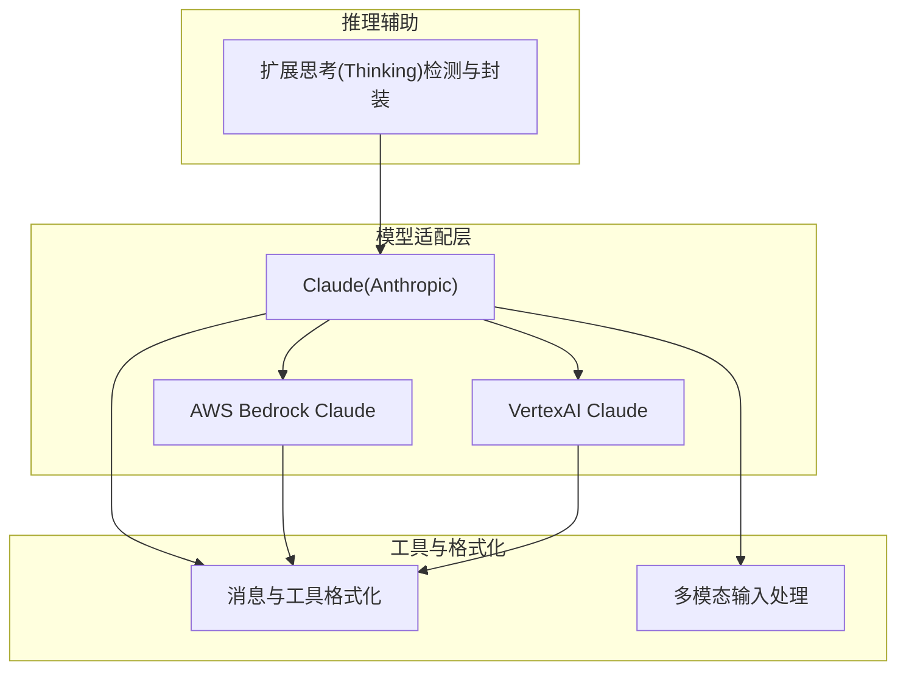
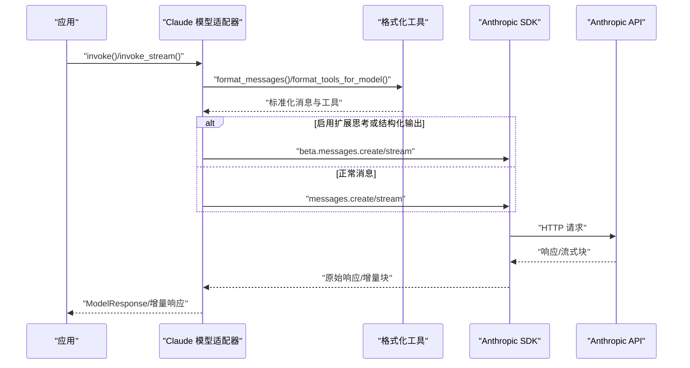
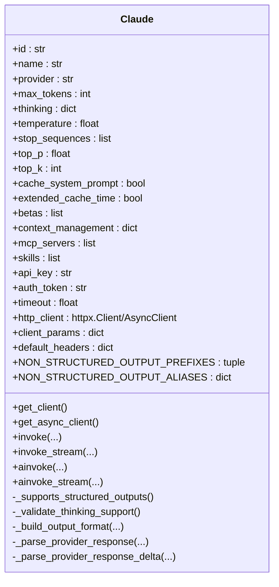
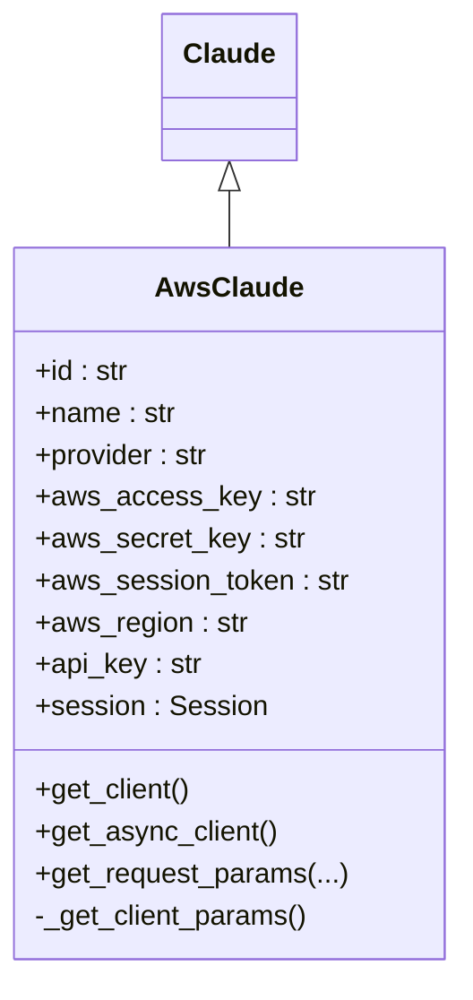
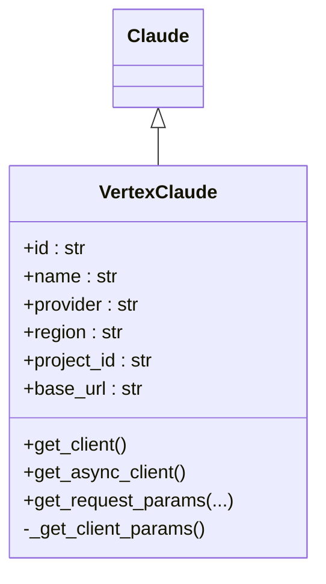
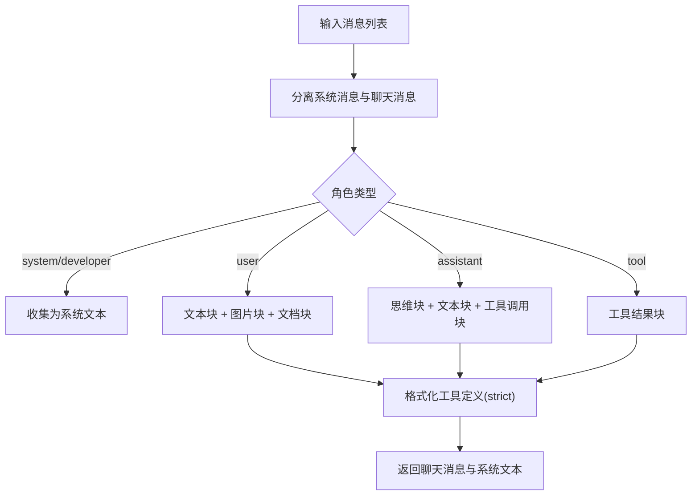
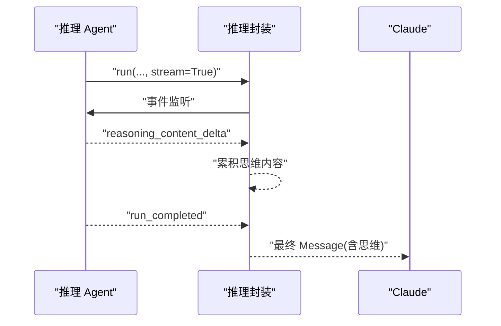
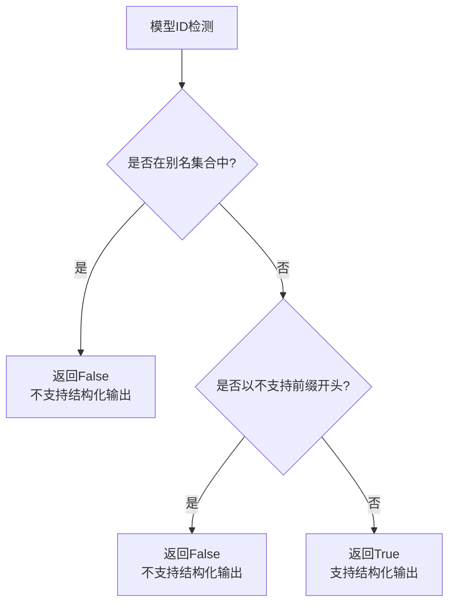
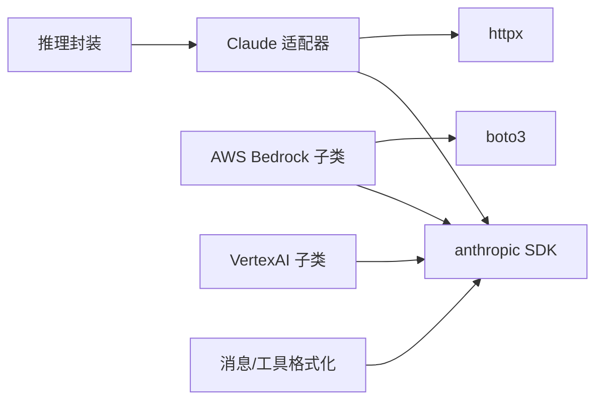

# Anthropic 模型

<cite>
**本文引用的文件**
- [libs/agno/agno/models/anthropic/claude.py](file://libs/agno/agno/models/anthropic/claude.py)
- [libs/agno/agno/utils/models/claude.py](file://libs/agno/agno/utils/models/claude.py)
- [libs/agno/agno/reasoning/anthropic.py](file://libs/agno/agno/reasoning/anthropic.py)
- [libs/agno/agno/models/aws/claude.py](file://libs/agno/agno/models/aws/claude.py)
- [libs/agno/agno/models/vertexai/claude.py](file://libs/agno/agno/models/vertexai/claude.py)
- [libs/agno/tests/unit/models/aws/test_claude_client.py](file://libs/agno/tests/unit/models/aws/test_claude_client.py)
- [libs/agno/tests/unit/utils/test_claude.py](file://libs/agno/tests/unit/utils/test_claude.py)
- [cookbook/08_learning/06_quick_tests/04_claude_model.py](file://cookbook/08_learning/06_quick_tests/04_claude_model.py)
- [libs/agno/tests/unit/models/anthropic/test_structured_output_capability.py](file://libs/agno/tests/unit/models/anthropic/test_structured_output_capability.py)
- [cookbook/90_models/anthropic/structured_output.py](file://cookbook/90_models/anthropic/structured_output.py)
- [cookbook/90_models/anthropic/structured_output_strict_tools.py](file://cookbook/90_models/anthropic/structured_output_strict_tools.py)
</cite>

## 更新摘要
**变更内容**
- 更新了 Claude 模型结构化输出能力检测机制，从脆弱的 blocklist 方法改为更稳健的 prefix-based 检测系统
- 新增了 NON_STRUCTURED_OUTPUT_PREFIXES 和 NON_STRUCTURED_OUTPUT_ALIASES 常量定义
- 改进了结构化输出支持的判断逻辑，采用更精确的前缀匹配和别名检测
- 更新了相关测试用例以验证新的检测机制

## 目录
1. [简介](#简介)
2. [项目结构](#项目结构)
3. [核心组件](#核心组件)
4. [架构总览](#架构总览)
5. [详细组件分析](#详细组件分析)
6. [依赖分析](#依赖分析)
7. [性能考虑](#性能考虑)
8. [故障排除指南](#故障排除指南)
9. [结论](#结论)
10. [附录](#附录)

## 简介
本文件面向在 Agno Learn 中集成与使用 Anthropic Claude 模型的开发者，系统性阐述 Claude 适配器的实现与配置方式，覆盖以下要点：
- 支持的 Claude 版本与特性：Claude 3、Claude 3.5、Claude Sonnet 4.x、Claude Opus 4.x 等；明确扩展思考（Extended Thinking）与原生结构化输出支持范围。
- Anthropic API 集成：API 密钥配置、请求参数构建、响应解析与流式处理。
- 多模态输入：图片、文档等媒体的格式化与上传。
- 工具调用与结构化输出：严格模式、输出模式、Schema 校验。
- 使用示例：对话交互、工具使用、复杂推理任务。
- 最佳实践：提示工程、成本优化、性能调优。
- 实际案例与故障排除：环境变量、凭证轮换、错误处理。

## 项目结构
Agno Learn 将 Claude 集成拆分为"模型适配层""工具层""推理辅助层"，并提供 AWS Bedrock 与 VertexAI 两种托管通道的 Claude 子类，便于在不同运行环境中选择。

**图表来源**
- [libs/agno/agno/models/anthropic/claude.py:66-142](file://libs/agno/agno/models/anthropic/claude.py#L66-L142)
- [libs/agno/agno/models/aws/claude.py:24-54](file://libs/agno/agno/models/aws/claude.py#L24-L54)
- [libs/agno/agno/models/vertexai/claude.py:19-47](file://libs/agno/agno/models/vertexai/claude.py#L19-L47)
- [libs/agno/agno/utils/models/claude.py:265-366](file://libs/agno/agno/utils/models/claude.py#L265-L366)
- [libs/agno/agno/reasoning/anthropic.py:13-26](file://libs/agno/agno/reasoning/anthropic.py#L13-L26)

**章节来源**
- [libs/agno/agno/models/anthropic/claude.py:66-142](file://libs/agno/agno/models/anthropic/claude.py#L66-L142)
- [libs/agno/agno/utils/models/claude.py:265-366](file://libs/agno/agno/utils/models/claude.py#L265-L366)
- [libs/agno/agno/reasoning/anthropic.py:13-26](file://libs/agno/agno/reasoning/anthropic.py#L13-L26)

## 核心组件
- Claude 模型适配器：统一 Anthropic API 的请求构建、参数校验、响应解析与流式处理，支持扩展思考与结构化输出。
- AWS Bedrock Claude 子类：适配 AWS 凭证体系与请求参数，屏蔽 Bedrock 客户端差异。
- VertexAI Claude 子类：适配 Vertex 客户端与区域/项目参数。
- 工具与消息格式化：将通用消息与工具定义转换为 Anthropic API 所需格式，支持严格模式与结构化输出 Schema。
- 推理辅助：识别与封装 Claude 的扩展思考能力，支持同步与异步流式推理。

**章节来源**
- [libs/agno/agno/models/anthropic/claude.py:66-142](file://libs/agno/agno/models/anthropic/claude.py#L66-L142)
- [libs/agno/agno/models/aws/claude.py:24-54](file://libs/agno/agno/models/aws/claude.py#L24-L54)
- [libs/agno/agno/models/vertexai/claude.py:19-47](file://libs/agno/agno/models/vertexai/claude.py#L19-L47)
- [libs/agno/agno/utils/models/claude.py:368-415](file://libs/agno/agno/utils/models/claude.py#L368-L415)
- [libs/agno/agno/reasoning/anthropic.py:13-26](file://libs/agno/agno/reasoning/anthropic.py#L13-L26)

## 架构总览
下图展示从应用到 Anthropic API 的调用链路，以及扩展思考与结构化输出的关键路径。

**图表来源**
- [libs/agno/agno/models/anthropic/claude.py:582-700](file://libs/agno/agno/models/anthropic/claude.py#L582-L700)
- [libs/agno/agno/utils/models/claude.py:265-366](file://libs/agno/agno/utils/models/claude.py#L265-L366)

**章节来源**
- [libs/agno/agno/models/anthropic/claude.py:582-700](file://libs/agno/agno/models/anthropic/claude.py#L582-L700)
- [libs/agno/agno/utils/models/claude.py:265-366](file://libs/agno/agno/utils/models/claude.py#L265-L366)

## 详细组件分析

### Claude 模型适配器（Anthropic）
- 支持的模型与特性
  - 扩展思考（Extended Thinking）黑名单：包含特定 Haiku 与部分 3.5 Haiku 模型。
  - 原生结构化输出支持：采用更稳健的 prefix-based 检测系统，使用 NON_STRUCTURED_OUTPUT_PREFIXES 和 NON_STRUCTURED_OUTPUT_ALIASES 常量进行精确判断。
- 配置项
  - 基础参数：max_tokens、temperature、stop_sequences、top_p、top_k。
  - 扩展参数：thinking（启用扩展思考）、cache_system_prompt、extended_cache_time。
  - Beta 功能：betas（实验特性列表）、context_management（上下文管理）、mcp_servers（MCP 服务器配置）、skills（技能容器）。
  - 客户端参数：api_key、auth_token、timeout、http_client、client_params、default_headers。
- 客户端获取
  - 同步/异步客户端均通过统一工厂方法创建，自动注入 httpx 全局客户端或用户自定义客户端。
- 请求构建
  - 根据 response_format 与 tools 决定是否启用结构化输出 beta 头部。
  - 根据 thinking 与 skills 等决定是否走 beta/messages 接口。
- 响应解析
  - 文本内容、思考块、工具调用、引用（URL/文档）、结构化输出（JSON 解析与 Pydantic 校验）、用量指标、上下文管理信息、文件 ID（技能场景）。
- 流式处理
  - 支持 ContentBlockDeltaEvent/BetaRawContentBlockDeltaEvent 等增量事件，避免重复内容拼接，支持结构化输出的流式解析。

**更新** 结构化输出能力检测机制已从脆弱的 blocklist 方法改进为更稳健的 prefix-based 检测系统，使用 NON_STRUCTURED_OUTPUT_PREFIXES 和 NON_STRUCTURED_OUTPUT_ALIASES 常量进行精确判断。

**图表来源**
- [libs/agno/agno/models/anthropic/claude.py:66-142](file://libs/agno/agno/models/anthropic/claude.py#L66-L142)
- [libs/agno/agno/models/anthropic/claude.py:582-700](file://libs/agno/agno/models/anthropic/claude.py#L582-L700)
- [libs/agno/agno/models/anthropic/claude.py:823-950](file://libs/agno/agno/models/anthropic/claude.py#L823-L950)
- [libs/agno/agno/models/anthropic/claude.py:952-1097](file://libs/agno/agno/models/anthropic/claude.py#L952-L1097)

**章节来源**
- [libs/agno/agno/models/anthropic/claude.py:66-142](file://libs/agno/agno/models/anthropic/claude.py#L66-L142)
- [libs/agno/agno/models/anthropic/claude.py:582-700](file://libs/agno/agno/models/anthropic/claude.py#L582-L700)
- [libs/agno/agno/models/anthropic/claude.py:823-950](file://libs/agno/agno/models/anthropic/claude.py#L823-L950)
- [libs/agno/agno/models/anthropic/claude.py:952-1097](file://libs/agno/agno/models/anthropic/claude.py#L952-L1097)

### AWS Bedrock Claude 子类
- 适配 AWS 凭证：支持 boto3 Session 或显式 AK/SK/Token/Region/API Key。
- 缓存策略：使用 Session 时每次重建客户端以读取最新凭据；静态凭据时缓存客户端实例。
- 参数映射：将通用参数映射为 Bedrock 客户端所需字段，禁用原生结构化输出支持。

**图表来源**
- [libs/agno/agno/models/aws/claude.py:24-54](file://libs/agno/agno/models/aws/claude.py#L24-L54)
- [libs/agno/agno/models/aws/claude.py:108-177](file://libs/agno/agno/models/aws/claude.py#L108-L177)
- [libs/agno/agno/models/aws/claude.py:179-260](file://libs/agno/agno/models/aws/claude.py#L179-L260)

**章节来源**
- [libs/agno/agno/models/aws/claude.py:24-54](file://libs/agno/agno/models/aws/claude.py#L24-L54)
- [libs/agno/tests/unit/models/aws/test_claude_client.py:27-101](file://libs/agno/tests/unit/models/aws/test_claude_client.py#L27-L101)

### VertexAI Claude 子类
- 适配 Vertex 客户端：通过 region、project_id、base_url 等参数初始化。
- 参数映射：与通用 Claude 类似，但禁用原生结构化输出支持。
- 客户端获取：复用全局 httpx 客户端或用户自定义客户端。

**图表来源**
- [libs/agno/agno/models/vertexai/claude.py:19-47](file://libs/agno/agno/models/vertexai/claude.py#L19-L47)
- [libs/agno/agno/models/vertexai/claude.py:65-107](file://libs/agno/agno/models/vertexai/claude.py#L65-L107)
- [libs/agno/agno/models/vertexai/claude.py:109-191](file://libs/agno/agno/models/vertexai/claude.py#L109-L191)

**章节来源**
- [libs/agno/agno/models/vertexai/claude.py:19-47](file://libs/agno/agno/models/vertexai/claude.py#L19-L47)

### 工具与消息格式化
- 消息格式化：将系统/用户/助手/工具消息映射为 Anthropic 角色与内容块，支持文本、思维块、工具调用块、引用块。
- 工具格式化：将函数定义转换为 Anthropic input_schema，支持 strict 模式。
- 多模态输入：图片（base64）、文档（URL/base64/text），自动推断 MIME 与编码。

**图表来源**
- [libs/agno/agno/utils/models/claude.py:265-366](file://libs/agno/agno/utils/models/claude.py#L265-L366)
- [libs/agno/agno/utils/models/claude.py:368-415](file://libs/agno/agno/utils/models/claude.py#L368-L415)

**章节来源**
- [libs/agno/agno/utils/models/claude.py:265-366](file://libs/agno/agno/utils/models/claude.py#L265-L366)
- [libs/agno/agno/utils/models/claude.py:368-415](file://libs/agno/agno/utils/models/claude.py#L368-L415)

### 扩展思考（Thinking）与推理封装
- 检测：判断模型是否支持扩展思考，避免在不支持的模型上启用。
- 封装：将推理 Agent 的内容封装为助手消息的思维块，支持同步与异步流式推理。
- 事件：在流式推理中发出 reasoning_started/reasoning_content_delta/reasoning_completed 事件，便于前端渲染与调试。

**图表来源**
- [libs/agno/agno/reasoning/anthropic.py:65-105](file://libs/agno/agno/reasoning/anthropic.py#L65-L105)
- [libs/agno/agno/reasoning/anthropic.py:144-184](file://libs/agno/agno/reasoning/anthropic.py#L144-L184)

**章节来源**
- [libs/agno/agno/reasoning/anthropic.py:13-26](file://libs/agno/agno/reasoning/anthropic.py#L13-L26)
- [libs/agno/agno/reasoning/anthropic.py:65-105](file://libs/agno/agno/reasoning/anthropic.py#L65-L105)
- [libs/agno/agno/reasoning/anthropic.py:144-184](file://libs/agno/agno/reasoning/anthropic.py#L144-L184)

### 结构化输出能力检测系统
**新增** Claude 模型引入了更稳健的结构化输出能力检测系统，替代了之前的脆弱 blocklist 方法。

- **前缀检测系统**：使用 NON_STRUCTURED_OUTPUT_PREFIXES 常量定义所有不支持结构化输出的模型前缀，如 "claude-3-" 前缀下的所有 3.x 模型。
- **别名检测系统**：使用 NON_STRUCTURED_OUTPUT_ALIASES 字典定义特定的不支持模型别名，如 claude-sonnet-4-20250514、claude-opus-4-20250514 等。
- **默认支持策略**：所有新模型（包括未来模型）默认支持结构化输出，体现了 Anthropic 向通用结构化输出支持的趋势。
- **检测逻辑**：通过 id in 别名集合 和 id.startswith(前缀) 的组合检查，确保检测的准确性。

**图表来源**
- [libs/agno/agno/models/anthropic/claude.py:85-98](file://libs/agno/agno/models/anthropic/claude.py#L85-L98)
- [libs/agno/agno/models/anthropic/claude.py:169-180](file://libs/agno/agno/models/anthropic/claude.py#L169-L180)

**章节来源**
- [libs/agno/agno/models/anthropic/claude.py:85-98](file://libs/agno/agno/models/anthropic/claude.py#L85-L98)
- [libs/agno/agno/models/anthropic/claude.py:169-180](file://libs/agno/agno/models/anthropic/claude.py#L169-L180)
- [libs/agno/tests/unit/models/anthropic/test_structured_output_capability.py:1-115](file://libs/agno/tests/unit/models/anthropic/test_structured_output_capability.py#L1-L115)

## 依赖分析
- 组件耦合
  - Claude 适配器依赖通用消息与工具格式化模块，解耦了模型无关逻辑。
  - AWS/Vertex 子类通过继承共享通用逻辑，仅覆写客户端参数与获取方式。
- 外部依赖
  - anthropic SDK（核心 API 与 Beta 类型）。
  - httpx（同步/异步客户端）。
  - boto3（AWS Bedrock 通道）。
  - pydantic（结构化输出 Schema 校验）。
- 循环依赖
  - 未发现循环导入；各模块职责清晰。

**图表来源**
- [libs/agno/agno/models/anthropic/claude.py:22-53](file://libs/agno/agno/models/anthropic/claude.py#L22-L53)
- [libs/agno/agno/models/aws/claude.py:13-21](file://libs/agno/agno/models/aws/claude.py#L13-L21)
- [libs/agno/agno/models/vertexai/claude.py:13-16](file://libs/agno/agno/models/vertexai/claude.py#L13-L16)
- [libs/agno/agno/utils/models/claude.py:9-15](file://libs/agno/agno/utils/models/claude.py#L9-L15)
- [libs/agno/agno/reasoning/anthropic.py:5-10](file://libs/agno/agno/reasoning/anthropic.py#L5-L10)

**章节来源**
- [libs/agno/agno/models/anthropic/claude.py:22-53](file://libs/agno/agno/models/anthropic/claude.py#L22-L53)
- [libs/agno/agno/models/aws/claude.py:13-21](file://libs/agno/agno/models/aws/claude.py#L13-L21)
- [libs/agno/agno/models/vertexai/claude.py:13-16](file://libs/agno/agno/models/vertexai/claude.py#L13-L16)
- [libs/agno/agno/utils/models/claude.py:9-15](file://libs/agno/agno/utils/models/claude.py#L9-L15)
- [libs/agno/agno/reasoning/anthropic.py:5-10](file://libs/agno/agno/reasoning/anthropic.py#L5-L10)

## 性能考虑
- 结构化输出与严格模式
  - 仅在支持的模型上启用结构化输出，避免不必要的 beta 头部与额外开销。
  - 严格模式会增加 Schema 校验成本，建议按需开启。
- 扩展思考
  - 合理设置 thinking 预算（tokens），避免过度消耗。
  - 在不需要深度推理的任务中关闭 thinking，减少延迟与成本。
- 流式输出
  - 使用流式接口降低首字节延迟，提升用户体验；注意避免重复拼接导致的内容冗余。
- 缓存系统提示
  - 对频繁出现的系统提示启用缓存控制，减少重复输入 token。
- 多模态输入
  - 图片与文档尽量采用 URL 或已上传文件，减少 base64 编码带来的体积膨胀。
- 并发与客户端复用
  - AWS/Vertex 子类在静态凭据场景可复用客户端实例，降低握手成本。
- **更新** 结构化输出检测优化
  - 新的 prefix-based 检测系统比之前的 blocklist 更高效，减少了字符串匹配的复杂度。
  - 通过常量定义的前缀和别名集合，检测过程更加直接和快速。

## 故障排除指南
- 环境变量与凭证
  - Anthropic：确保设置 ANTHROPIC_API_KEY 或 ANTHROPIC_AUTH_TOKEN。
  - AWS Bedrock：优先使用 AWS_BEDROCK_API_KEY 或 AK/SK/Token/Region；若使用 boto3 Session，需保证会话有效。
  - Vertex：设置 CLOUD_ML_REGION、ANTHROPIC_VERTEX_PROJECT_ID、ANTHROPIC_VERTEX_BASE_URL。
- 模型能力不匹配
  - 在不支持扩展思考的模型上启用 thinking 将触发参数校验异常。
  - 在不支持原生结构化输出的模型上使用 response_format 会被忽略并记录警告。
- 凭证轮换（AWS）
  - 使用 boto3 Session 时，客户端会在每次获取时重新创建，确保读取最新凭据。
  - 若凭据为空，将抛出明确的错误提示。
- 多模态输入
  - 图片/文档无法识别类型或文件不存在时，会记录错误并跳过该媒体。
- 错误处理
  - 连接错误、速率限制、状态错误均被捕获并转换为统一的 Provider/RateLimit 异常，便于上层处理。
- **更新** 结构化输出能力检测问题
  - 如果新模型被错误地识别为不支持结构化输出，检查其模型 ID 是否符合新的 prefix-based 检测规则。
  - 对于特殊模型，可以在 NON_STRUCTURED_OUTPUT_ALIASES 中添加别名，或在 NON_STRUCTURED_OUTPUT_PREFIXES 中添加前缀。

**章节来源**
- [libs/agno/agno/models/anthropic/claude.py:155-176](file://libs/agno/agno/models/anthropic/claude.py#L155-L176)
- [libs/agno/agno/models/aws/claude.py:55-106](file://libs/agno/agno/models/aws/claude.py#L55-L106)
- [libs/agno/agno/models/vertexai/claude.py:48-63](file://libs/agno/agno/models/vertexai/claude.py#L48-L63)
- [libs/agno/tests/unit/models/aws/test_claude_client.py:254-265](file://libs/agno/tests/unit/models/aws/test_claude_client.py#L254-L265)
- [libs/agno/tests/unit/utils/test_claude.py:62-66](file://libs/agno/tests/unit/utils/test_claude.py#L62-L66)

## 结论
Agno Learn 的 Anthropic Claude 集成提供了高内聚、低耦合的适配层，覆盖多模态、工具调用、扩展思考与结构化输出等关键能力。通过 AWS/Vertex 子类，开发者可在不同托管环境下无缝切换。最新的结构化输出能力检测系统采用了更稳健的 prefix-based 检测机制，替代了之前的脆弱 blocklist 方法，提高了检测的准确性和维护性。建议在生产中结合模型能力清单合理启用特性，配合流式输出与缓存策略优化性能与成本。

## 附录

### 配置与使用示例索引
- 基础对话与学习测试：使用 Claude 进行用户画像提取与回忆验证。
- 推理 Agent：启用扩展思考，观察思维块与最终答案的组合输出。
- 工具调用：在 Claude 上使用严格模式工具定义，确保参数 Schema 严格校验。
- **新增** 结构化输出示例：演示如何使用 Pydantic 模型定义结构化输出格式。

**章节来源**
- [cookbook/08_learning/06_quick_tests/04_claude_model.py:16-93](file://cookbook/08_learning/06_quick_tests/04_claude_model.py#L16-L93)
- [libs/agno/agno/reasoning/anthropic.py:28-63](file://libs/agno/agno/reasoning/anthropic.py#L28-L63)
- [cookbook/90_models/anthropic/structured_output.py:1-57](file://cookbook/90_models/anthropic/structured_output.py#L1-L57)
- [cookbook/90_models/anthropic/structured_output_strict_tools.py:1-71](file://cookbook/90_models/anthropic/structured_output_strict_tools.py#L1-L71)

### 结构化输出能力检测测试
**新增** 测试用例展示了新的结构化输出能力检测系统的正确行为：

- **支持结构化输出的模型**：claude-opus-4-1、claude-sonnet-4-5、claude-opus-4-5、claude-haiku-4-5、claude-opus-4-6、claude-sonnet-4-6 等新模型。
- **不支持结构化输出的模型**：claude-3-opus、claude-3-sonnet、claude-3-haiku、claude-3-5-sonnet、claude-3-5-haiku、claude-sonnet-4-0、claude-opus-4-0 等旧模型。
- **未来模型兼容性**：新模型如 claude-opus-4-7、claude-sonnet-5-0、claude-opus-5-0、claude-haiku-5-0 默认支持结构化输出。

**章节来源**
- [libs/agno/tests/unit/models/anthropic/test_structured_output_capability.py:1-115](file://libs/agno/tests/unit/models/anthropic/test_structured_output_capability.py#L1-L115)