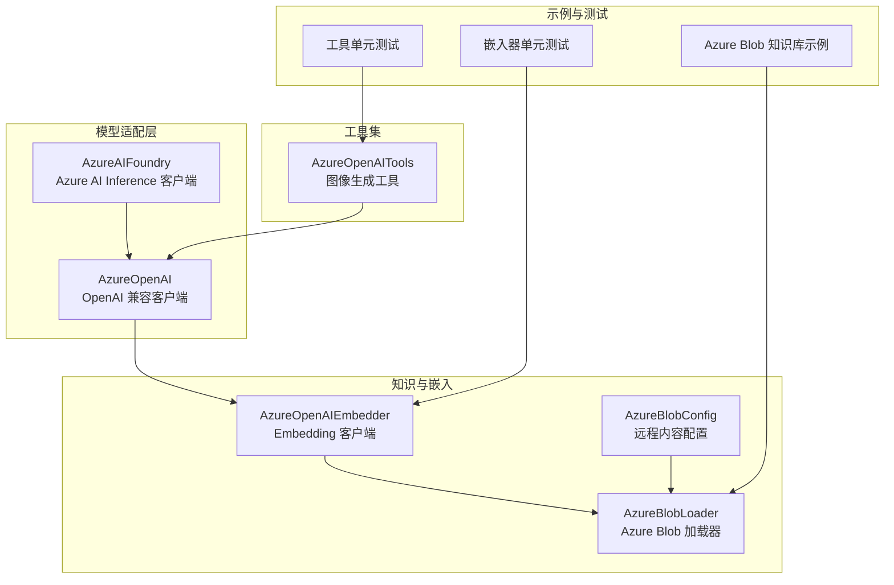
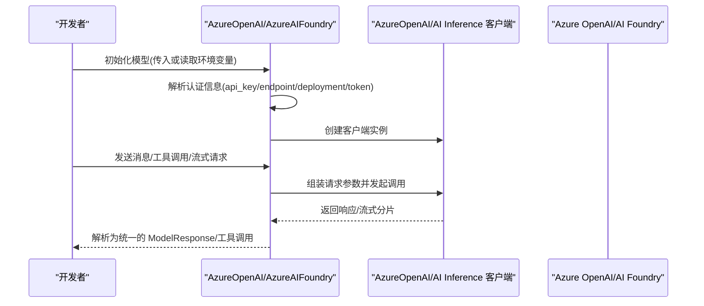
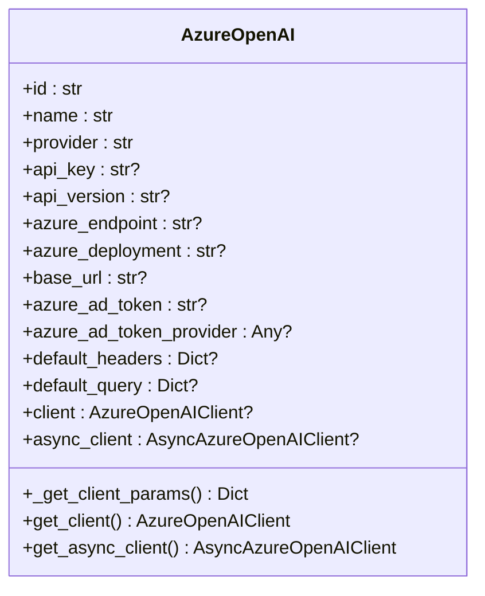
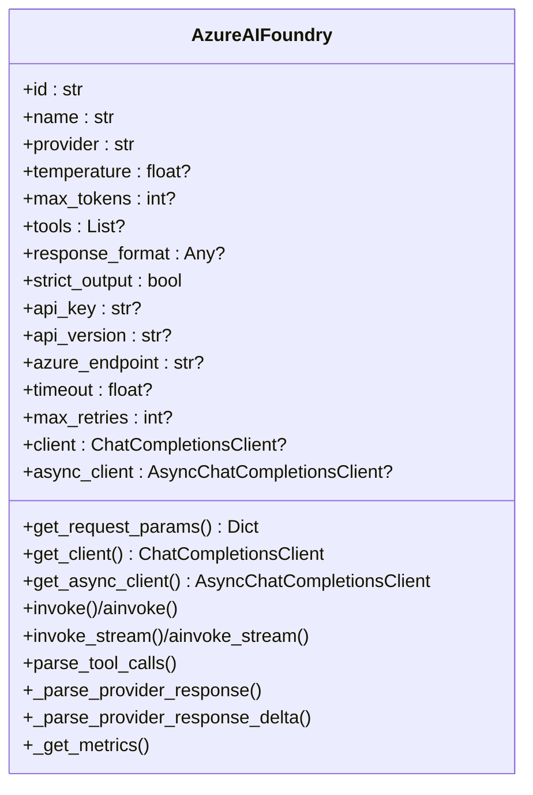
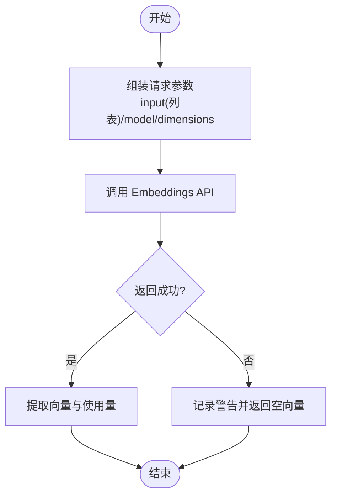
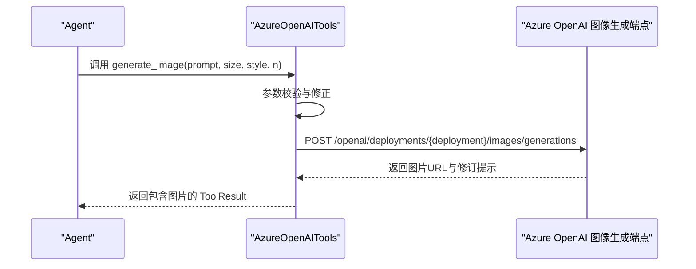
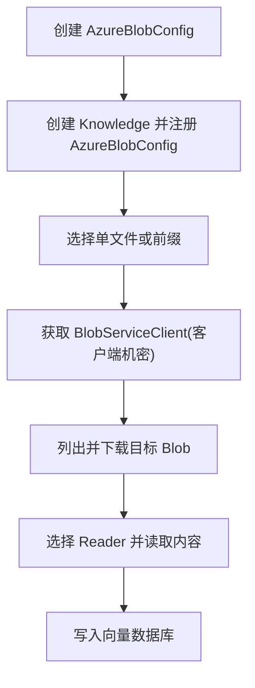
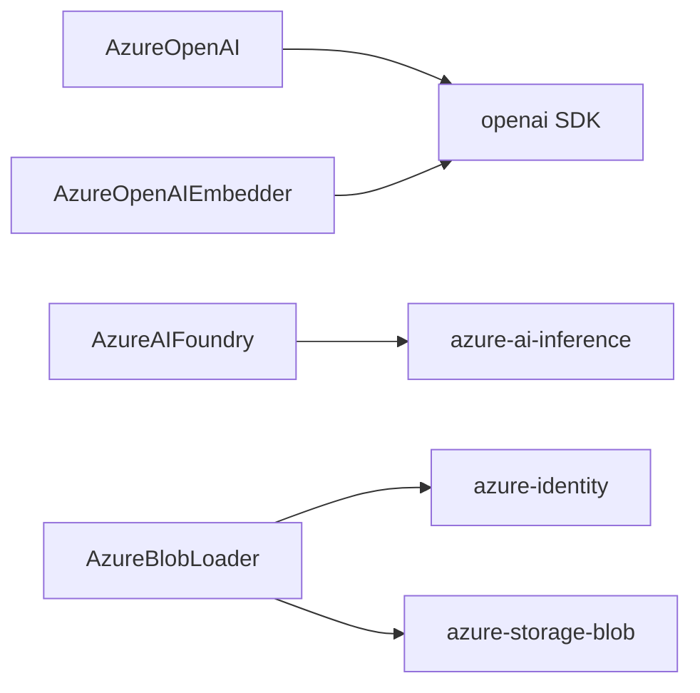

# Azure 模型

<cite>
**本文引用的文件**
- [libs/agno/agno/models/azure/ai_foundry.py](file://libs/agno/agno/models/azure/ai_foundry.py)
- [libs/agno/agno/models/azure/openai_chat.py](file://libs/agno/agno/models/azure/openai_chat.py)
- [libs/agno/agno/knowledge/embedder/azure_openai.py](file://libs/agno/agno/knowledge/embedder/azure_openai.py)
- [libs/agno/agno/tools/models/azure_openai.py](file://libs/agno/agno/tools/models/azure_openai.py)
- [libs/agno/agno/knowledge/loaders/azure_blob.py](file://libs/agno/agno/knowledge/loaders/azure_blob.py)
- [libs/agno/agno/knowledge/remote_content/azure_blob.py](file://libs/agno/agno/knowledge/remote_content/azure_blob.py)
- [cookbook/07_knowledge/05_integrations/cloud/02_azure.py](file://cookbook/07_knowledge/05_integrations/cloud/02_azure.py)
- [libs/agno/tests/unit/knowledge/test_azure_openai_embedder.py](file://libs/agno/tests/unit/knowledge/test_azure_openai_embedder.py)
- [libs/agno/tests/unit/tools/models/test_azure_openai.py](file://libs/agno/tests/unit/tools/models/test_azure_openai.py)
- [libs/agno/agno/models/azure/__init__.py](file://libs/agno/agno/models/azure/__init__.py)
</cite>

## 目录
1. [简介](#简介)
2. [项目结构](#项目结构)
3. [核心组件](#核心组件)
4. [架构总览](#架构总览)
5. [详细组件分析](#详细组件分析)
6. [依赖分析](#依赖分析)
7. [性能考虑](#性能考虑)
8. [故障排除指南](#故障排除指南)
9. [结论](#结论)
10. [附录](#附录)

## 简介
本文件面向在企业环境中使用 Agno Learn 集成 Azure 模型的开发者，系统性介绍 Azure OpenAI 与 Azure AI Foundry 的集成方式、认证与配置要点、企业级特性（安全性、合规性、大规模部署）、典型使用场景（企业聊天应用、数据安全处理、合规要求）、部署与管理（资源创建、监控与成本控制），并提供最佳实践与故障排除建议。内容基于仓库中已实现的 Azure 模型适配层与相关示例。

## 项目结构
围绕 Azure 模型的集成，Agno Learn 在以下模块提供了完整支持：
- 模型适配层：Azure OpenAI 与 Azure AI Foundry 的统一抽象与调用封装
- 知识与嵌入：Azure OpenAI Embedding 客户端与向量数据库对接
- 工具集：Azure OpenAI 图像生成功能工具包
- 存储与加载：Azure Blob 存储内容加载器与远程内容配置
- 示例与测试：知识库加载 Azure Blob 的演示脚本与单元测试

**图表来源**
- [libs/agno/agno/models/azure/openai_chat.py:19-150](file://libs/agno/agno/models/azure/openai_chat.py#L19-L150)
- [libs/agno/agno/models/azure/ai_foundry.py:37-484](file://libs/agno/agno/models/azure/ai_foundry.py#L37-L484)
- [libs/agno/agno/knowledge/embedder/azure_openai.py:18-214](file://libs/agno/agno/knowledge/embedder/azure_openai.py#L18-L214)
- [libs/agno/agno/knowledge/loaders/azure_blob.py:21-425](file://libs/agno/agno/knowledge/loaders/azure_blob.py#L21-L425)
- [libs/agno/agno/knowledge/remote_content/azure_blob.py:11-71](file://libs/agno/agno/knowledge/remote_content/azure_blob.py#L11-L71)
- [libs/agno/agno/tools/models/azure_openai.py:14-191](file://libs/agno/agno/tools/models/azure_openai.py#L14-L191)
- [cookbook/07_knowledge/05_integrations/cloud/02_azure.py:1-84](file://cookbook/07_knowledge/05_integrations/cloud/02_azure.py#L1-L84)

**章节来源**
- [libs/agno/agno/models/azure/openai_chat.py:19-150](file://libs/agno/agno/models/azure/openai_chat.py#L19-L150)
- [libs/agno/agno/models/azure/ai_foundry.py:37-484](file://libs/agno/agno/models/azure/ai_foundry.py#L37-L484)
- [libs/agno/agno/knowledge/embedder/azure_openai.py:18-214](file://libs/agno/agno/knowledge/embedder/azure_openai.py#L18-L214)
- [libs/agno/agno/knowledge/loaders/azure_blob.py:21-425](file://libs/agno/agno/knowledge/loaders/azure_blob.py#L21-L425)
- [libs/agno/agno/knowledge/remote_content/azure_blob.py:11-71](file://libs/agno/agno/knowledge/remote_content/azure_blob.py#L11-L71)
- [libs/agno/agno/tools/models/azure_openai.py:14-191](file://libs/agno/agno/tools/models/azure_openai.py#L14-L191)
- [cookbook/07_knowledge/05_integrations/cloud/02_azure.py:1-84](file://cookbook/07_knowledge/05_integrations/cloud/02_azure.py#L1-L84)

## 核心组件
- AzureOpenAI：基于 OpenAI SDK 的 Azure OpenAI 客户端封装，支持同步/异步、默认头与查询参数注入、令牌或令牌提供程序认证。
- AzureAIFoundry：基于 Azure AI Inference SDK 的客户端封装，支持请求参数构建、工具调用、流式与非流式响应解析、指标统计。
- AzureOpenAIEmbedder：Azure OpenAI Embedding 客户端封装，支持同步/异步批量嵌入、维度参数传递、使用量统计。
- AzureOpenAITools：Azure OpenAI 图像生成工具包，支持 DALL·E 模型参数校验与自动修正、HTTP 调用与结果解析。
- AzureBlobLoader/AzureBlobConfig：Azure Blob 存储内容加载器与远程内容配置，支持客户端凭据认证、前缀/单文件加载、元数据与虚拟路径构建。

**章节来源**
- [libs/agno/agno/models/azure/openai_chat.py:19-150](file://libs/agno/agno/models/azure/openai_chat.py#L19-L150)
- [libs/agno/agno/models/azure/ai_foundry.py:37-484](file://libs/agno/agno/models/azure/ai_foundry.py#L37-L484)
- [libs/agno/agno/knowledge/embedder/azure_openai.py:18-214](file://libs/agno/agno/knowledge/embedder/azure_openai.py#L18-L214)
- [libs/agno/agno/tools/models/azure_openai.py:14-191](file://libs/agno/agno/tools/models/azure_openai.py#L14-L191)
- [libs/agno/agno/knowledge/loaders/azure_blob.py:21-425](file://libs/agno/agno/knowledge/loaders/azure_blob.py#L21-L425)
- [libs/agno/agno/knowledge/remote_content/azure_blob.py:11-71](file://libs/agno/agno/knowledge/remote_content/azure_blob.py#L11-L71)

## 架构总览
下图展示了 Azure 模型在 Agno Learn 中的调用链路与关键交互点，包括认证、请求参数、客户端初始化与响应解析。

**图表来源**
- [libs/agno/agno/models/azure/openai_chat.py:61-93](file://libs/agno/agno/models/azure/openai_chat.py#L61-L93)
- [libs/agno/agno/models/azure/ai_foundry.py:132-156](file://libs/agno/agno/models/azure/ai_foundry.py#L132-L156)
- [libs/agno/agno/models/azure/ai_foundry.py:203-276](file://libs/agno/agno/models/azure/ai_foundry.py#L203-L276)

## 详细组件分析

### AzureOpenAI 组件分析
- 认证与初始化
  - 支持通过环境变量或构造函数参数传入 api_key、azure_endpoint、azure_deployment、base_url、azure_ad_token 或 azure_ad_token_provider。
  - 若未提供任何认证方式，抛出认证错误。
- 客户端管理
  - 提供同步/异步客户端获取方法；若用户传入自定义 httpx 客户端，需匹配类型，否则回退到全局默认客户端。
- 请求与响应
  - 基于 OpenAI SDK 的兼容行为，支持默认头与查询参数注入，返回统一的模型响应对象。

**图表来源**
- [libs/agno/agno/models/azure/openai_chat.py:19-150](file://libs/agno/agno/models/azure/openai_chat.py#L19-L150)

**章节来源**
- [libs/agno/agno/models/azure/openai_chat.py:61-93](file://libs/agno/agno/models/azure/openai_chat.py#L61-L93)
- [libs/agno/agno/models/azure/openai_chat.py:95-150](file://libs/agno/agno/models/azure/openai_chat.py#L95-L150)

### AzureAIFoundry 组件分析
- 认证与端点
  - 通过环境变量或构造函数参数设置 api_key 与 azure_endpoint；支持 Managed Compute、Serverless API、Github Models 以及 Azure OpenAI 的不同端点格式。
- 请求参数与工具调用
  - 动态组装温度、最大 tokens、工具定义、响应格式等；支持结构化输出严格模式。
- 流式与非流式响应
  - 支持同步/异步非流式与流式调用；流式响应按增量解析工具调用与内容。
- 指标统计
  - 解析 prompt/completion tokens、缓存命中与推理 tokens，汇总为统一指标对象。

**图表来源**
- [libs/agno/agno/models/azure/ai_foundry.py:37-484](file://libs/agno/agno/models/azure/ai_foundry.py#L37-L484)

**章节来源**
- [libs/agno/agno/models/azure/ai_foundry.py:78-131](file://libs/agno/agno/models/azure/ai_foundry.py#L78-L131)
- [libs/agno/agno/models/azure/ai_foundry.py:158-189](file://libs/agno/agno/models/azure/ai_foundry.py#L158-L189)
- [libs/agno/agno/models/azure/ai_foundry.py:203-352](file://libs/agno/agno/models/azure/ai_foundry.py#L203-L352)
- [libs/agno/agno/models/azure/ai_foundry.py:353-466](file://libs/agno/agno/models/azure/ai_foundry.py#L353-L466)

### AzureOpenAIEmbedder 组件分析
- 认证与端点
  - 支持 api_key、api_version、azure_endpoint、azure_deployment、base_url、azure_ad_token、azure_ad_token_provider 等参数。
- 嵌入请求
  - 统一将输入包装为列表，以满足特定部署的 API 要求；可选维度参数随自定义部署传递。
- 批量与异步
  - 提供同步/异步单条与批量嵌入接口，支持使用量统计返回。

**图表来源**
- [libs/agno/agno/knowledge/embedder/azure_openai.py:98-127](file://libs/agno/agno/knowledge/embedder/azure_openai.py#L98-L127)
- [libs/agno/agno/knowledge/embedder/azure_openai.py:128-159](file://libs/agno/agno/knowledge/embedder/azure_openai.py#L128-L159)
- [libs/agno/agno/knowledge/embedder/azure_openai.py:161-214](file://libs/agno/agno/knowledge/embedder/azure_openai.py#L161-L214)

**章节来源**
- [libs/agno/agno/knowledge/embedder/azure_openai.py:18-96](file://libs/agno/agno/knowledge/embedder/azure_openai.py#L18-L96)
- [libs/agno/agno/knowledge/embedder/azure_openai.py:98-159](file://libs/agno/agno/knowledge/embedder/azure_openai.py#L98-L159)
- [libs/agno/agno/knowledge/embedder/azure_openai.py:161-214](file://libs/agno/agno/knowledge/embedder/azure_openai.py#L161-L214)

### AzureOpenAITools 组件分析
- 功能
  - 当前支持 DALL·E 图像生成，自动校验并修正尺寸、风格、数量等参数，保证与模型兼容。
- 认证与端点
  - 从环境变量或构造函数读取 api_key、azure_endpoint、api_version 与 image_deployment。
- 调用流程
  - 组装请求参数并通过 HTTP POST 调用 Azure OpenAI 图像生成端点，解析返回并封装为工具结果。

**图表来源**
- [libs/agno/agno/tools/models/azure_openai.py:100-191](file://libs/agno/agno/tools/models/azure_openai.py#L100-L191)

**章节来源**
- [libs/agno/agno/tools/models/azure_openai.py:27-73](file://libs/agno/agno/tools/models/azure_openai.py#L27-L73)
- [libs/agno/agno/tools/models/azure_openai.py:100-191](file://libs/agno/agno/tools/models/azure_openai.py#L100-L191)

### Azure Blob 内容加载组件分析
- 配置
  - AzureBlobConfig 使用 Azure AD 客户端机密进行认证，需在存储账户上授予“存储 Blob 数据读取器”角色。
- 加载
  - AzureBlobLoader 支持同步/异步加载单文件或前缀（文件夹）；下载后交由 Reader 读取并插入向量数据库。
- 元数据与虚拟路径
  - 自动构建包含存储账户、容器、Blob 名称等的元数据与虚拟路径，便于溯源与去重。

**图表来源**
- [libs/agno/agno/knowledge/remote_content/azure_blob.py:11-71](file://libs/agno/agno/knowledge/remote_content/azure_blob.py#L11-L71)
- [libs/agno/agno/knowledge/loaders/azure_blob.py:47-100](file://libs/agno/agno/knowledge/loaders/azure_blob.py#L47-L100)
- [libs/agno/agno/knowledge/loaders/azure_blob.py:136-281](file://libs/agno/agno/knowledge/loaders/azure_blob.py#L136-L281)

**章节来源**
- [libs/agno/agno/knowledge/remote_content/azure_blob.py:11-71](file://libs/agno/agno/knowledge/remote_content/azure_blob.py#L11-L71)
- [libs/agno/agno/knowledge/loaders/azure_blob.py:47-100](file://libs/agno/agno/knowledge/loaders/azure_blob.py#L47-L100)
- [libs/agno/agno/knowledge/loaders/azure_blob.py:136-281](file://libs/agno/agno/knowledge/loaders/azure_blob.py#L136-L281)

## 依赖分析
- 模块内聚与耦合
  - AzureOpenAI/AzureAIFoundry 与底层 SDK 强耦合，但通过统一的 Model 抽象向上提供一致接口。
  - AzureOpenAIEmbedder 与 AzureBlobLoader 分别依赖 OpenAI SDK 与 Azure SDK，职责清晰。
- 外部依赖
  - AzureOpenAI 依赖 openai SDK；AzureAIFoundry 依赖 azure-ai-inference；Azure Blob 依赖 azure-identity 与 azure-storage-blob。
- 可能的循环依赖
  - 未发现循环导入；各模块通过工具类与异常类进行有限交互。

**图表来源**
- [libs/agno/agno/models/azure/openai_chat.py:12-16](file://libs/agno/agno/models/azure/openai_chat.py#L12-L16)
- [libs/agno/agno/models/azure/ai_foundry.py:18-34](file://libs/agno/agno/models/azure/ai_foundry.py#L18-L34)
- [libs/agno/agno/knowledge/embedder/azure_openai.py:10-15](file://libs/agno/agno/knowledge/embedder/azure_openai.py#L10-L15)
- [libs/agno/agno/knowledge/loaders/azure_blob.py:52-59](file://libs/agno/agno/knowledge/loaders/azure_blob.py#L52-L59)

**章节来源**
- [libs/agno/agno/models/azure/openai_chat.py:12-16](file://libs/agno/agno/models/azure/openai_chat.py#L12-L16)
- [libs/agno/agno/models/azure/ai_foundry.py:18-34](file://libs/agno/agno/models/azure/ai_foundry.py#L18-L34)
- [libs/agno/agno/knowledge/embedder/azure_openai.py:10-15](file://libs/agno/agno/knowledge/embedder/azure_openai.py#L10-L15)
- [libs/agno/agno/knowledge/loaders/azure_blob.py:52-59](file://libs/agno/agno/knowledge/loaders/azure_blob.py#L52-L59)

## 性能考虑
- 连接复用
  - AzureOpenAI/AzureAIFoundry 在内部维护客户端实例，避免重复创建带来的开销。
- 异步优先
  - AzureOpenAI/AzureAIFoundry 提供异步客户端与异步流式接口，适合高并发与低延迟场景。
- 批量嵌入
  - AzureOpenAIEmbedder 支持批量嵌入与异步批量接口，减少网络往返次数。
- 流式响应
  - AzureAIFoundry 的流式接口可提前感知响应片段，优化用户体验与资源占用。
- 指标采集
  - 统一解析 tokens 与推理 tokens，便于成本与性能分析。

[本节为通用指导，不直接分析具体文件]

## 故障排除指南
- 认证失败
  - AzureOpenAI：未设置 api_key、azure_endpoint、azure_deployment 或 token 提供程序时会触发认证错误。
  - AzureAIFoundry：未设置 api_key 或 azure_endpoint 会在初始化阶段记录错误。
  - AzureOpenAITools：未设置 AZURE_OPENAI_API_KEY 或 AZURE_OPENAI_ENDPOINT 会记录错误。
- 环境变量缺失
  - AzureOpenAIEmbedder：缺少 AZURE_EMBEDDER_OPENAI_API_KEY、AZURE_EMBEDDER_OPENAI_ENDPOINT 等会导致初始化异常。
- SDK 缺失
  - AzureAIFoundry：未安装 azure-ai-inference 将抛出 ImportError。
  - AzureOpenAIEmbedder/AzureBlobLoader：未安装 openai 或 azure-* SDK 将抛出 ImportError。
- 参数校验
  - AzureOpenAITools：对尺寸、风格、数量等参数进行自动修正；若仍失败，检查部署是否支持对应参数组合。
- 单元测试参考
  - 嵌入器输入始终为列表的断言与异步批量回退逻辑可作为行为验证依据。
  - 工具生成图像的请求参数与错误处理可通过测试用例定位问题。

**章节来源**
- [libs/agno/agno/models/azure/openai_chat.py:68-73](file://libs/agno/agno/models/azure/openai_chat.py#L68-L73)
- [libs/agno/agno/models/azure/ai_foundry.py:138-141](file://libs/agno/agno/models/azure/ai_foundry.py#L138-L141)
- [libs/agno/agno/tools/models/azure_openai.py:44-47](file://libs/agno/agno/tools/models/azure_openai.py#L44-L47)
- [libs/agno/agno/knowledge/embedder/azure_openai.py:14-15](file://libs/agno/agno/knowledge/embedder/azure_openai.py#L14-L15)
- [libs/agno/agno/knowledge/loaders/azure_blob.py:52-59](file://libs/agno/agno/knowledge/loaders/azure_blob.py#L52-L59)
- [libs/agno/tests/unit/knowledge/test_azure_openai_embedder.py:30-46](file://libs/agno/tests/unit/knowledge/test_azure_openai_embedder.py#L30-L46)
- [libs/agno/tests/unit/tools/models/test_azure_openai.py:86-125](file://libs/agno/tests/unit/tools/models/test_azure_openai.py#L86-L125)

## 结论
Agno Learn 对 Azure 模型的集成覆盖了主流企业场景：统一的模型抽象、灵活的认证方式、完善的工具与知识库能力，以及可扩展的异步与流式接口。结合 Azure Blob 存储加载与嵌入能力，可在企业环境中快速搭建安全、合规、可扩展的智能应用。

[本节为总结性内容，不直接分析具体文件]

## 附录

### Azure 模型配置与认证清单
- AzureOpenAI
  - 必填：AZURE_OPENAI_API_KEY、AZURE_OPENAI_ENDPOINT、AZURE_OPENAI_DEPLOYMENT（或在构造函数中指定）
  - 可选：AZURE_OPENAI_API_VERSION、base_url、azure_ad_token、azure_ad_token_provider
- AzureAIFoundry
  - 必填：AZURE_API_KEY、AZURE_ENDPOINT（根据端点类型调整）
  - 可选：api_version、timeout、max_retries、request_params、client_params
- AzureOpenAIEmbedder
  - 必填：AZURE_EMBEDDER_OPENAI_API_KEY、AZURE_EMBEDDER_OPENAI_ENDPOINT、AZURE_EMBEDDER_DEPLOYMENT（如使用自定义部署）
  - 可选：AZURE_EMBEDDER_OPENAI_API_VERSION、dimensions、encoding_format
- AzureOpenAITools
  - 必填：AZURE_OPENAI_API_KEY、AZURE_OPENAI_ENDPOINT、AZURE_OPENAI_IMAGE_DEPLOYMENT
  - 可选：AZURE_OPENAI_API_VERSION、image_model、image_quality

**章节来源**
- [libs/agno/agno/models/azure/openai_chat.py:64-66](file://libs/agno/agno/models/azure/openai_chat.py#L64-L66)
- [libs/agno/agno/models/azure/ai_foundry.py:134-136](file://libs/agno/agno/models/azure/ai_foundry.py#L134-L136)
- [libs/agno/agno/knowledge/embedder/azure_openai.py:24-27](file://libs/agno/agno/knowledge/embedder/azure_openai.py#L24-L27)
- [libs/agno/agno/tools/models/azure_openai.py:39-41](file://libs/agno/agno/tools/models/azure_openai.py#L39-L41)

### 使用示例与最佳实践
- 企业聊天应用
  - 使用 AzureOpenAI 或 AzureAIFoundry 作为主模型，结合工具调用与结构化输出提升对话质量与可控性。
- 数据安全与合规
  - Azure Blob 加载采用客户端机密认证，配合最小权限原则与角色授权；嵌入与检索过程尽量避免敏感字段进入索引。
- 大规模部署
  - 优先使用异步客户端与流式接口；合理设置超时与重试；利用指标统计进行成本与性能优化。
- 示例参考
  - Azure Blob 知识库加载示例展示了从配置到检索的完整流程。

**章节来源**
- [cookbook/07_knowledge/05_integrations/cloud/02_azure.py:33-84](file://cookbook/07_knowledge/05_integrations/cloud/02_azure.py#L33-L84)