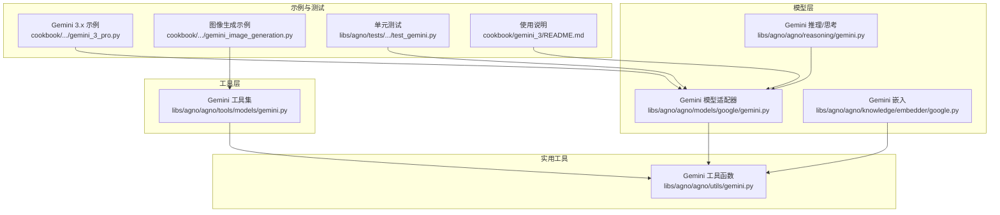
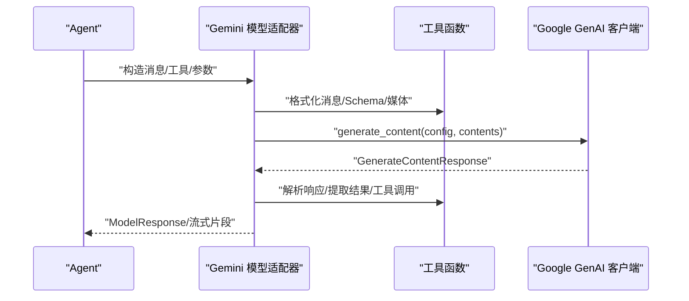
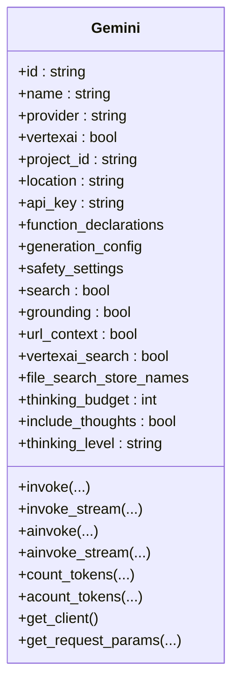
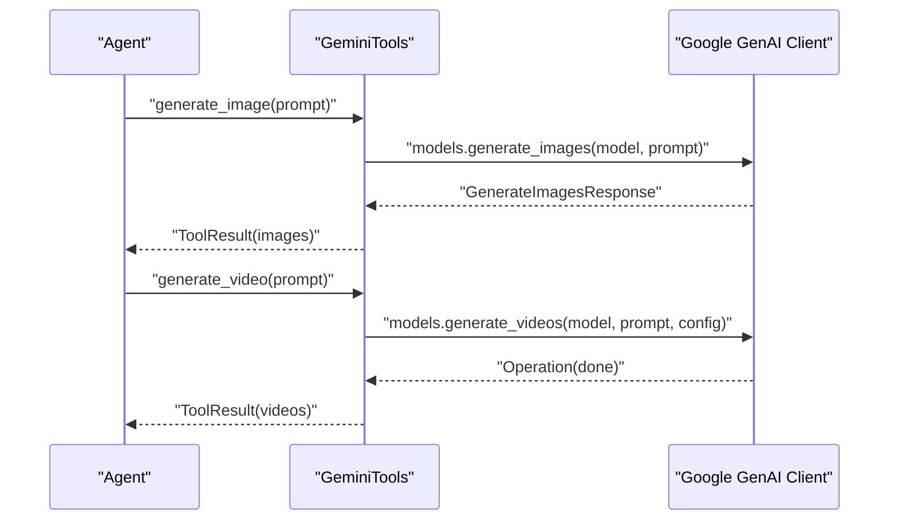
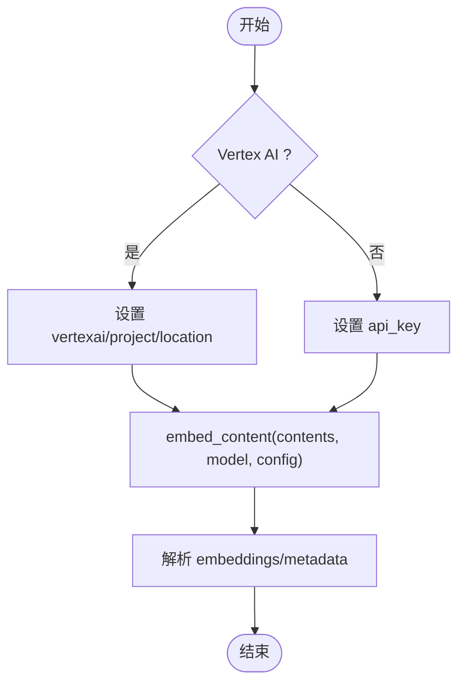
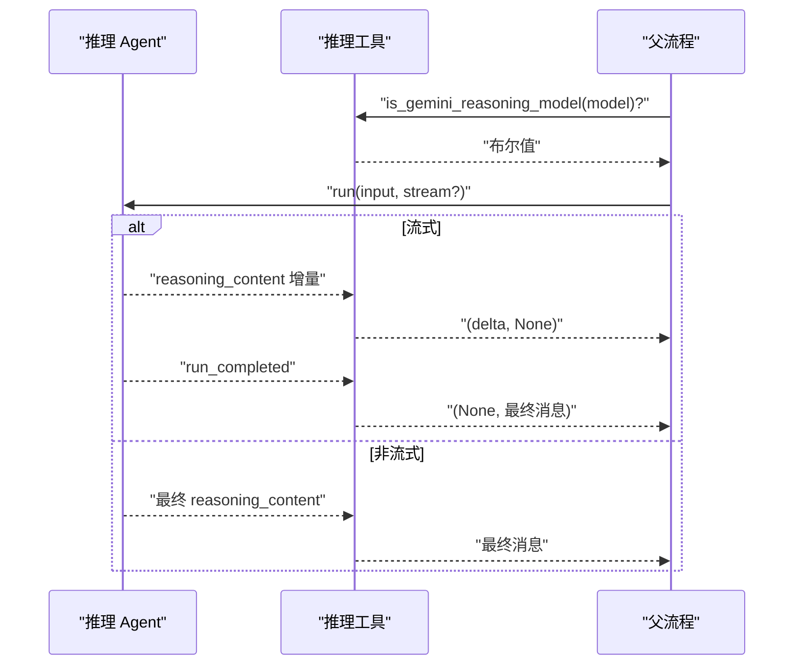
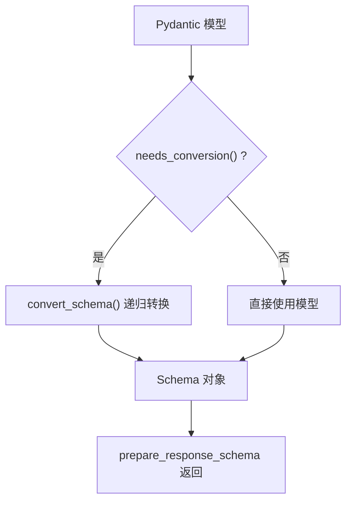
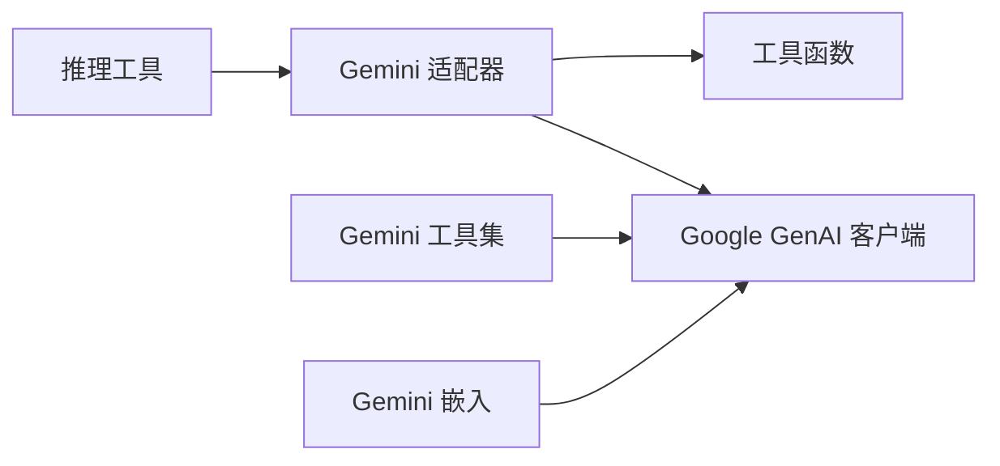

# Google 模型

<cite>
**本文引用的文件**
- [libs/agno/agno/models/google/gemini.py](file://libs/agno/agno/models/google/gemini.py)
- [libs/agno/agno/tools/models/gemini.py](file://libs/agno/agno/tools/models/gemini.py)
- [libs/agno/agno/knowledge/embedder/google.py](file://libs/agno/agno/knowledge/embedder/google.py)
- [libs/agno/agno/reasoning/gemini.py](file://libs/agno/agno/reasoning/gemini.py)
- [libs/agno/agno/utils/gemini.py](file://libs/agno/agno/utils/gemini.py)
- [libs/agno/tests/unit/models/google/test_gemini.py](file://libs/agno/tests/unit/models/google/test_gemini.py)
- [cookbook/90_models/google/gemini/gemini_3_pro.py](file://cookbook/90_models/google/gemini/gemini_3_pro.py)
- [cookbook/91_tools/models/gemini_image_generation.py](file://cookbook/91_tools/models/gemini_image_generation.py)
- [cookbook/gemini_3/README.md](file://cookbook/gemini_3/README.md)
</cite>

## 目录
1. [简介](#简介)
2. [项目结构](#项目结构)
3. [核心组件](#核心组件)
4. [架构总览](#架构总览)
5. [详细组件分析](#详细组件分析)
6. [依赖分析](#依赖分析)
7. [性能考虑](#性能考虑)
8. [故障排查指南](#故障排查指南)
9. [结论](#结论)
10. [附录](#附录)

## 简介
本文件面向 Agno Learn 项目中的 Google Gemini 模型集成，系统性梳理适配器设计与实现，覆盖 Gemini Pro、Gemini 3.x 等版本能力；详解 Google AI Studio 与 Vertex AI 双模式的认证与配置；阐述多模态输入（文本、图像、音频、视频、文件）、推理与思考、函数调用、结构化输出、流式响应等特性；并提供使用示例、高级功能与 Google Cloud 最佳实践。

## 项目结构
围绕 Google 模型的实现主要分布在以下模块：
- 模型适配器：Gemini 文本模型适配，支持同步/异步、流式、函数调用、结构化输出、思考模式、搜索/检索/URL 上下文、文件搜索等
- 工具集：Gemini 图像/视频生成工具，支持 Vertex AI 模式下的视频生成
- 嵌入：Gemini Embedder，支持 Vertex AI 与 AI Studio 模式
- 推理：Gemini 思考模式识别与抽取
- 工具函数：JSON Schema 到 Gemini Schema 的转换、消息格式化、媒体格式化等
- 示例与测试：cookbook 中的 Gemini 3.x 使用示例与单元测试

图表来源
- [libs/agno/agno/models/google/gemini.py](file://libs/agno/agno/models/google/gemini.py)
- [libs/agno/agno/tools/models/gemini.py](file://libs/agno/agno/tools/models/gemini.py)
- [libs/agno/agno/knowledge/embedder/google.py](file://libs/agno/agno/knowledge/embedder/google.py)
- [libs/agno/agno/reasoning/gemini.py](file://libs/agno/agno/reasoning/gemini.py)
- [libs/agno/agno/utils/gemini.py](file://libs/agno/agno/utils/gemini.py)
- [cookbook/90_models/google/gemini/gemini_3_pro.py](file://cookbook/90_models/google/gemini/gemini_3_pro.py)
- [cookbook/91_tools/models/gemini_image_generation.py](file://cookbook/91_tools/models/gemini_image_generation.py)
- [libs/agno/tests/unit/models/google/test_gemini.py](file://libs/agno/tests/unit/models/google/test_gemini.py)
- [cookbook/gemini_3/README.md](file://cookbook/gemini_3/README.md)

章节来源
- [libs/agno/agno/models/google/gemini.py](file://libs/agno/agno/models/google/gemini.py)
- [libs/agno/agno/tools/models/gemini.py](file://libs/agno/agno/tools/models/gemini.py)
- [libs/agno/agno/knowledge/embedder/google.py](file://libs/agno/agno/knowledge/embedder/google.py)
- [libs/agno/agno/reasoning/gemini.py](file://libs/agno/agno/reasoning/gemini.py)
- [libs/agno/agno/utils/gemini.py](file://libs/agno/agno/utils/gemini.py)
- [cookbook/90_models/google/gemini/gemini_3_pro.py](file://cookbook/90_models/google/gemini/gemini_3_pro.py)
- [cookbook/91_tools/models/gemini_image_generation.py](file://cookbook/91_tools/models/gemini_image_generation.py)
- [libs/agno/tests/unit/models/google/test_gemini.py](file://libs/agno/tests/unit/models/google/test_gemini.py)
- [cookbook/gemini_3/README.md](file://cookbook/gemini_3/README.md)

## 核心组件
- Gemini 文本模型适配器：统一的 Model 抽象，封装请求参数、消息格式化、函数调用、结构化输出、思考模式、搜索/检索/URL 上下文、文件搜索、计数令牌、流式与非流式调用、错误映射等
- Gemini 工具集：图像生成、视频生成（Vertex AI）
- Gemini 嵌入：支持 Vertex AI 与 AI Studio 模式，批量嵌入与用量统计
- Gemini 推理/思考：识别思考型模型、抽取思考内容、支持流式思考
- 工具函数：Schema 转换、消息/媒体格式化、响应模式准备

章节来源
- [libs/agno/agno/models/google/gemini.py](file://libs/agno/agno/models/google/gemini.py)
- [libs/agno/agno/tools/models/gemini.py](file://libs/agno/agno/tools/models/gemini.py)
- [libs/agno/agno/knowledge/embedder/google.py](file://libs/agno/agno/knowledge/embedder/google.py)
- [libs/agno/agno/reasoning/gemini.py](file://libs/agno/agno/reasoning/gemini.py)
- [libs/agno/agno/utils/gemini.py](file://libs/agno/agno/utils/gemini.py)

## 架构总览
下图展示了从 Agent 到 Gemini API 的调用链路，以及内置工具（搜索、检索、URL 上下文、文件搜索）与外部函数工具的协同。

图表来源
- [libs/agno/agno/models/google/gemini.py](file://libs/agno/agno/models/google/gemini.py)
- [libs/agno/agno/utils/gemini.py](file://libs/agno/agno/utils/gemini.py)

## 详细组件分析

### 组件一：Gemini 文本模型适配器
- 角色映射与消息格式化：支持 system/developer 提取为 system_instruction，assistant/tool 映射，函数调用与结果的 Part 组装，多模态媒体（图像/视频/文件）的 Part.from_* 构造
- 请求参数构建：generation_config 合并、温度/采样参数、最大输出、停止序列、logprobs、惩罚项、种子、响应模态（文本/图像/音频）、语音配置、缓存内容、思考预算/包含思考/思考等级、工具选择模式（auto/none/any/validated）
- 内置工具：Google 搜索、Grounding（已标记为遗留）、URL 上下文、Vertex AI 搜索、文件搜索工具
- 结构化输出：对 Pydantic 模型进行 Schema 转换或原生支持，自动设置 response_mime_type 与 response_schema
- 计数令牌：Vertex AI 支持完整计数（含 system_instruction 与 tools），AI Studio 使用混合策略（API 计算内容 + 本地估算 system/tools/schema）
- 流式与非流式：generate_content / generate_content_stream，异步 aio 版本
- 错误处理：捕获 ClientError/ServerError，映射为统一 ModelProviderError

图表来源
- [libs/agno/agno/models/google/gemini.py](file://libs/agno/agno/models/google/gemini.py)

章节来源
- [libs/agno/agno/models/google/gemini.py](file://libs/agno/agno/models/google/gemini.py)
- [libs/agno/agno/utils/gemini.py](file://libs/agno/agno/utils/gemini.py)

### 组件二：Gemini 工具集（图像/视频生成）
- 模式选择：AI Studio（api_key）或 Vertex AI（vertexai + project/location）
- 图像生成：调用 models.generate_images，返回 Image 媒体对象
- 视频生成：仅 Vertex AI 模式，使用 models.generate_videos 并轮询 Operation 直到完成，返回 Video 媒体对象
- 参数与校验：缺失必要环境变量时抛出错误

图表来源
- [libs/agno/agno/tools/models/gemini.py](file://libs/agno/agno/tools/models/gemini.py)

章节来源
- [libs/agno/agno/tools/models/gemini.py](file://libs/agno/agno/tools/models/gemini.py)

### 组件三：Gemini 嵌入（Embedder）
- 模式：AI Studio（api_key）或 Vertex AI（vertexai + project/location）
- 支持维度、任务类型、标题等配置
- 同步/异步获取嵌入与用量统计
- 批量嵌入（异步）回退策略

图表来源
- [libs/agno/agno/knowledge/embedder/google.py](file://libs/agno/agno/knowledge/embedder/google.py)

章节来源
- [libs/agno/agno/knowledge/embedder/google.py](file://libs/agno/agno/knowledge/embedder/google.py)

### 组件四：Gemini 推理/思考
- 模型识别：根据模型 ID 或思考参数判断是否为思考型模型
- 推理抽取：从推理 Agent 的运行结果中提取 reasoning_content，封装为带<thinking>标签的消息
- 流式推理：事件驱动地增量产出思考内容，最终汇总为完整消息

图表来源
- [libs/agno/agno/reasoning/gemini.py](file://libs/agno/agno/reasoning/gemini.py)

章节来源
- [libs/agno/agno/reasoning/gemini.py](file://libs/agno/agno/reasoning/gemini.py)

### 组件五：工具函数（Schema/消息/媒体）
- prepare_response_schema：将 Pydantic 模型转换为 Gemini Schema（处理自引用、additionalProperties、空定义等）
- format_function_definitions：将工具定义转为 FunctionDeclaration 列表
- format_image_for_message：支持 URL/本地路径/字节，生成 Part.from_bytes 参数
- convert_schema：递归转换 JSON Schema 为 Gemini Schema，处理 $ref 循环引用、联合类型、可空等

图表来源
- [libs/agno/agno/utils/gemini.py](file://libs/agno/agno/utils/gemini.py)

章节来源
- [libs/agno/agno/utils/gemini.py](file://libs/agno/agno/utils/gemini.py)

## 依赖分析
- 模块内聚与耦合
  - Gemini 适配器高度依赖 utils 的消息/Schema/媒体格式化函数，形成清晰的分层
  - 工具集与适配器解耦，通过通用媒体对象交互
  - 嵌入模块与适配器解耦，独立负责向量表示
- 外部依赖
  - google-genai 客户端（genai.Client），包含模型调用、计数、生成、操作轮询等
  - 环境变量：GOOGLE_API_KEY、GOOGLE_GENAI_USE_VERTEXAI、GOOGLE_CLOUD_PROJECT、GOOGLE_CLOUD_LOCATION

图表来源
- [libs/agno/agno/models/google/gemini.py](file://libs/agno/agno/models/google/gemini.py)
- [libs/agno/agno/tools/models/gemini.py](file://libs/agno/agno/tools/models/gemini.py)
- [libs/agno/agno/knowledge/embedder/google.py](file://libs/agno/agno/knowledge/embedder/google.py)
- [libs/agno/agno/reasoning/gemini.py](file://libs/agno/agno/reasoning/gemini.py)
- [libs/agno/agno/utils/gemini.py](file://libs/agno/agno/utils/gemini.py)

章节来源
- [libs/agno/agno/models/google/gemini.py](file://libs/agno/agno/models/google/gemini.py)
- [libs/agno/agno/tools/models/gemini.py](file://libs/agno/agno/tools/models/gemini.py)
- [libs/agno/agno/knowledge/embedder/google.py](file://libs/agno/agno/knowledge/embedder/google.py)
- [libs/agno/agno/reasoning/gemini.py](file://libs/agno/agno/reasoning/gemini.py)
- [libs/agno/agno/utils/gemini.py](file://libs/agno/agno/utils/gemini.py)

## 性能考虑
- 计数令牌
  - Vertex AI：支持在 API 中传入 system_instruction 与 tools，获得准确 total_tokens
  - AI Studio：优先调用 API 获取内容令牌，再以本地估算 system_instruction、tools 与 response_schema 的令牌
- 流式响应
  - 使用 generate_content_stream 与 aio 版本，降低首字延迟，适合长回复场景
- 缓存与提示词复用
  - Gemini 3.x 支持提示词缓存（prompt caching），可显著节省大文档场景的令牌成本
- 媒体与文件
  - 尽量使用 URI 方式传递远程资源，减少下载开销；本地文件建议预上传至云存储后以 URI 传入
- 工具调用
  - 合理设置 tool_choice 与函数参数 Schema，避免不必要的重试与引导

## 故障排查指南
- 环境变量未设置
  - GOOGLE_API_KEY 未设置：在 AI Studio 模式下会报错
  - GOOGLE_GENAI_USE_VERTEXAI=true 且未设置 GOOGLE_CLOUD_PROJECT/GOOGLE_CLOUD_LOCATION：Vertex AI 模式会报错
- 模型不可用或拼写错误
  - 检查模型 ID 是否正确（如 gemini-3-flash-preview、gemini-3.1-pro-preview 等）
- 速率限制
  - 429：等待或切换模型
- 单元测试参考
  - 客户端初始化：验证 vertexai 模式下 credentials 与 project/location 传参
  - 文件/URI/本地文件到 Part 的格式化逻辑
  - 空内容消息过滤与系统消息分离

章节来源
- [libs/agno/tests/unit/models/google/test_gemini.py](file://libs/agno/tests/unit/models/google/test_gemini.py)
- [cookbook/gemini_3/README.md](file://cookbook/gemini_3/README.md)

## 结论
Agno Learn 的 Google Gemini 集成以 Gemini 适配器为核心，统一了多模态输入、函数调用、结构化输出、思考模式与多种检索/搜索能力；配合工具集与嵌入模块，形成从基础对话到复杂推理与生产级应用的完整能力谱系。通过明确的配置与错误处理、完善的流式与异步接口，开发者可以快速在不同场景下落地 Gemini 能力。

## 附录

### Google AI Studio 与 Vertex AI 集成要点
- AI Studio 模式
  - 使用 GOOGLE_API_KEY
  - 支持 models.count_tokens 的内容令牌查询；system_instruction 与 tools 的令牌需本地估算
- Vertex AI 模式
  - 设置 GOOGLE_GENAI_USE_VERTEXAI="true"，并提供 GOOGLE_CLOUD_PROJECT 与 GOOGLE_CLOUD_LOCATION
  - 可使用服务账号凭据（credentials），或默认 ADC
  - 支持更丰富的检索/搜索与文件搜索工具

章节来源
- [libs/agno/agno/models/google/gemini.py](file://libs/agno/agno/models/google/gemini.py)
- [libs/agno/agno/tools/models/gemini.py](file://libs/agno/agno/tools/models/gemini.py)
- [libs/agno/agno/knowledge/embedder/google.py](file://libs/agno/agno/knowledge/embedder/google.py)

### 配置选项速览（Gemini 适配器）
- 基础参数：temperature、top_p、top_k、max_output_tokens、stop_sequences、seed
- 安全与生成：safety_settings、generation_config、generative_model_kwargs
- 多模态与输出：response_modalities、speech_config、cached_content
- 思考模式：thinking_budget、include_thoughts、thinking_level
- 工具与检索：search、grounding、url_context、vertexai_search、file_search_store_names、file_search_metadata_filter
- 认证与客户端：api_key、vertexai、project_id、location、client_params、credentials

章节来源
- [libs/agno/agno/models/google/gemini.py](file://libs/agno/agno/models/google/gemini.py)

### 使用示例索引
- Gemini 3.x 示例（异步、工具调用、搜索）
  - [cookbook/90_models/google/gemini/gemini_3_pro.py](file://cookbook/90_models/google/gemini/gemini_3_pro.py)
- 图像生成工具示例
  - [cookbook/91_tools/models/gemini_image_generation.py](file://cookbook/91_tools/models/gemini_image_generation.py)
- Gemini 3 快速上手与功能清单
  - [cookbook/gemini_3/README.md](file://cookbook/gemini_3/README.md)