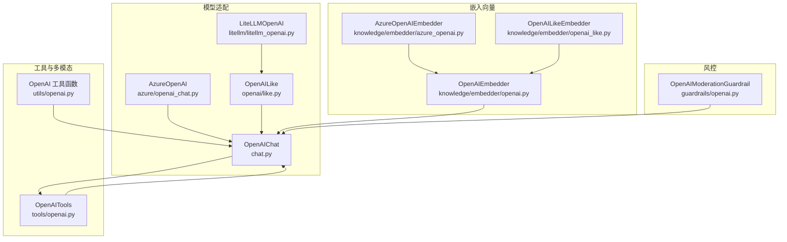
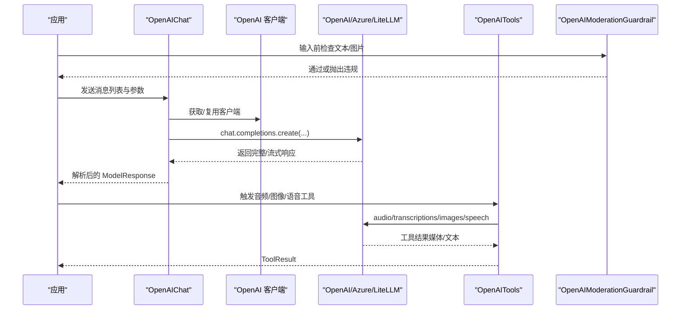
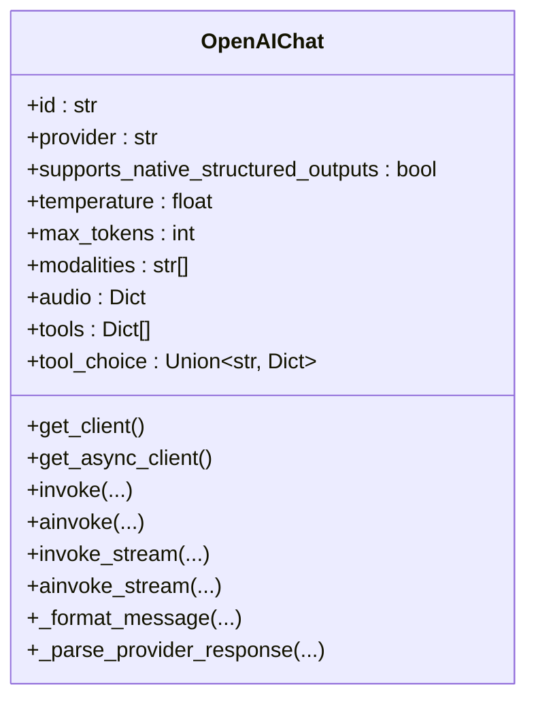
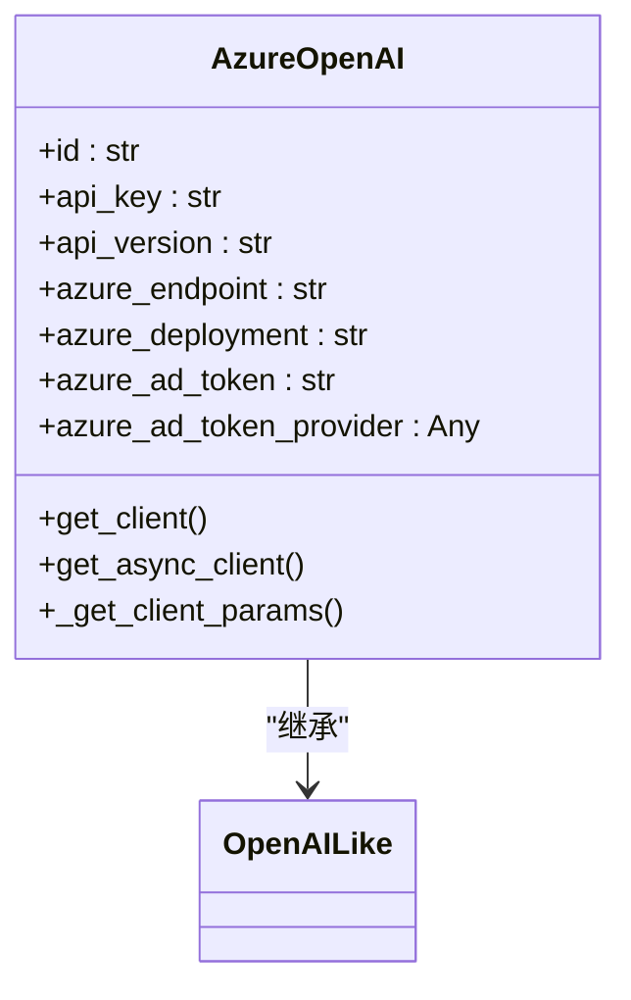
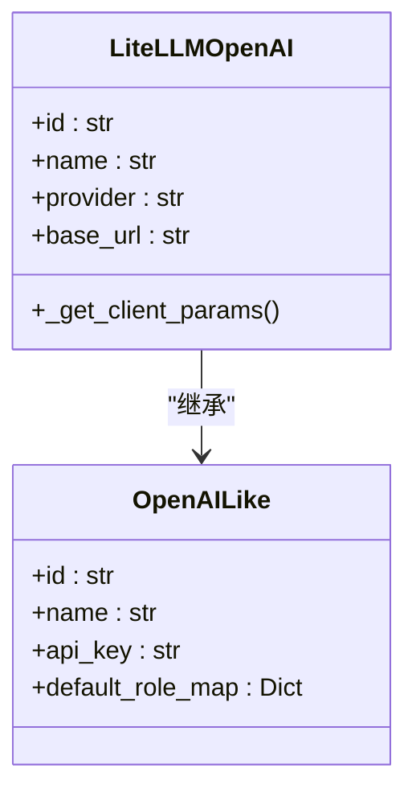
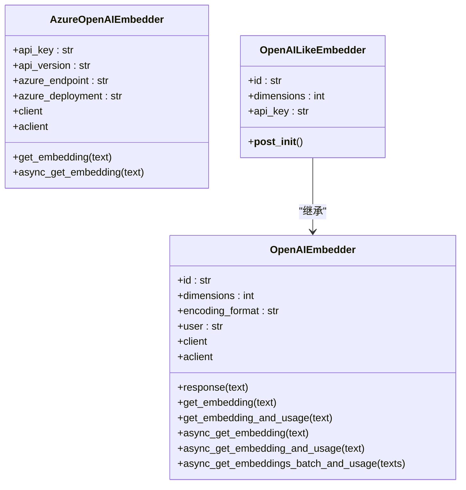
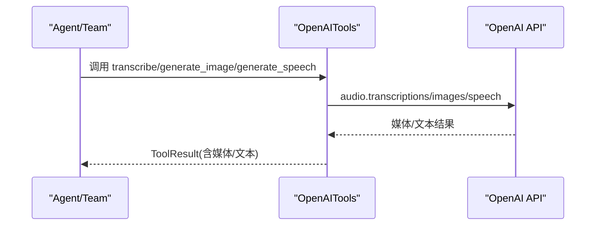
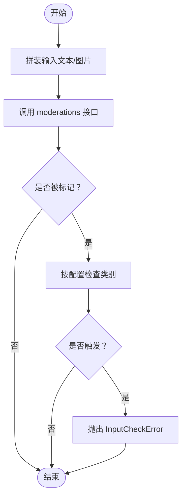
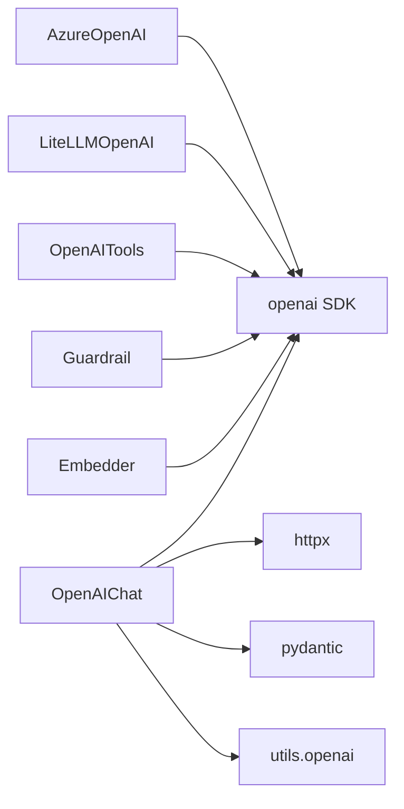

# OpenAI 模型

<cite>
**本文引用的文件**
- [libs/agno/agno/models/openai/chat.py](file://libs/agno/agno/models/openai/chat.py)
- [libs/agno/agno/models/azure/openai_chat.py](file://libs/agno/agno/models/azure/openai_chat.py)
- [libs/agno/agno/models/openai/like.py](file://libs/agno/agno/models/openai/like.py)
- [libs/agno/agno/models/litellm/litellm_openai.py](file://libs/agno/agno/models/litellm/litellm_openai.py)
- [libs/agno/agno/knowledge/embedder/openai.py](file://libs/agno/agno/knowledge/embedder/openai.py)
- [libs/agno/agno/knowledge/embedder/azure_openai.py](file://libs/agno/agno/knowledge/embedder/azure_openai.py)
- [libs/agno/agno/knowledge/embedder/openai_like.py](file://libs/agno/agno/knowledge/embedder/openai_like.py)
- [libs/agno/agno/guardrails/openai.py](file://libs/agno/agno/guardrails/openai.py)
- [libs/agno/agno/utils/openai.py](file://libs/agno/agno/utils/openai.py)
- [libs/agno/agno/tools/openai.py](file://libs/agno/agno/tools/openai.py)
</cite>

## 目录
1. [简介](#简介)
2. [项目结构](#项目结构)
3. [核心组件](#核心组件)
4. [架构总览](#架构总览)
5. [详细组件分析](#详细组件分析)
6. [依赖分析](#依赖分析)
7. [性能考虑](#性能考虑)
8. [故障排查指南](#故障排查指南)
9. [结论](#结论)
10. [附录](#附录)

## 简介
本文件系统性梳理 Agno Learn 中对 OpenAI 生态（Chat、Embeddings、Audio/Text/Image 工具与 Guardrails）的适配与集成，覆盖以下方面：
- OpenAI 模型适配器设计：支持 ChatGPT、GPT-4 等主流模型；兼容 Azure OpenAI、LiteLLM 等代理与兼容层。
- OpenAI API 集成：认证配置、请求参数映射、响应解析与流式处理。
- 多模态能力：图像、音频、文件输入与输出；语音合成与转写工具。
- 配置与调优：温度、最大令牌数、频率惩罚、结构化输出等。
- 使用示例：基础对话、函数调用、流式响应；以及 Guardrails 内容合规检查。
- 性能优化与最佳实践：客户端复用、批量嵌入、错误重试与超时控制。

## 项目结构
围绕 OpenAI 的核心模块分布于以下子目录：
- 模型适配器：models/openai、models/azure、models/litellm、models/openai/like
- 嵌入向量：knowledge/embedder 下的 openai、azure_openai、openai_like
- 工具与多模态：tools/openai、utils/openai
- 合规与风控：guardrails/openai
- 示例与用法：cookbook 中相关示例脚本与文档

图表来源
- [libs/agno/agno/models/openai/chat.py:1-961](file://libs/agno/agno/models/openai/chat.py#L1-L961)
- [libs/agno/agno/models/azure/openai_chat.py:1-150](file://libs/agno/agno/models/azure/openai_chat.py#L1-L150)
- [libs/agno/agno/models/openai/like.py:1-28](file://libs/agno/agno/models/openai/like.py#L1-L28)
- [libs/agno/agno/models/litellm/litellm_openai.py:1-43](file://libs/agno/agno/models/litellm/litellm_openai.py#L1-L43)
- [libs/agno/agno/knowledge/embedder/openai.py:1-200](file://libs/agno/agno/knowledge/embedder/openai.py#L1-L200)
- [libs/agno/agno/knowledge/embedder/azure_openai.py:1-214](file://libs/agno/agno/knowledge/embedder/azure_openai.py#L1-L214)
- [libs/agno/agno/knowledge/embedder/openai_like.py:1-30](file://libs/agno/agno/knowledge/embedder/openai_like.py#L1-L30)
- [libs/agno/agno/tools/openai.py:1-203](file://libs/agno/agno/tools/openai.py#L1-L203)
- [libs/agno/agno/utils/openai.py:1-258](file://libs/agno/agno/utils/openai.py#L1-L258)
- [libs/agno/agno/guardrails/openai.py:1-145](file://libs/agno/agno/guardrails/openai.py#L1-L145)

章节来源
- [libs/agno/agno/models/openai/chat.py:1-961](file://libs/agno/agno/models/openai/chat.py#L1-L961)
- [libs/agno/agno/models/azure/openai_chat.py:1-150](file://libs/agno/agno/models/azure/openai_chat.py#L1-L150)
- [libs/agno/agno/models/openai/like.py:1-28](file://libs/agno/agno/models/openai/like.py#L1-L28)
- [libs/agno/agno/models/litellm/litellm_openai.py:1-43](file://libs/agno/agno/models/litellm/litellm_openai.py#L1-L43)
- [libs/agno/agno/knowledge/embedder/openai.py:1-200](file://libs/agno/agno/knowledge/embedder/openai.py#L1-L200)
- [libs/agno/agno/knowledge/embedder/azure_openai.py:1-214](file://libs/agno/agno/knowledge/embedder/azure_openai.py#L1-L214)
- [libs/agno/agno/knowledge/embedder/openai_like.py:1-30](file://libs/agno/agno/knowledge/embedder/openai_like.py#L1-L30)
- [libs/agno/agno/tools/openai.py:1-203](file://libs/agno/agno/tools/openai.py#L1-L203)
- [libs/agno/agno/utils/openai.py:1-258](file://libs/agno/agno/utils/openai.py#L1-L258)
- [libs/agno/agno/guardrails/openai.py:1-145](file://libs/agno/agno/guardrails/openai.py#L1-L145)

## 核心组件
- OpenAIChat：统一的 OpenAI 聊天模型适配器，封装认证、请求参数、消息格式化、同步/异步调用与流式响应解析。
- AzureOpenAI：基于 OpenAI 客户端的 Azure 托管服务适配器，支持多种认证方式与默认参数注入。
- OpenAILike/LiteLLMOpenAI：面向兼容 OpenAI API 的第三方代理或自建服务，通过 OpenAILike 基类扩展。
- OpenAIEmbedder/AzureOpenAIEmbedder/OpenAILikeEmbedder：嵌入向量生成，支持维度、编码格式、批量与异步接口。
- OpenAITools：音频转写、图像生成、语音合成等工具集合。
- OpenAIModerationGuardrail：内容合规检查，支持文本与图片混合输入。
- utils.openai：多模态输入处理（图像、音频、文件）与消息格式化辅助。

章节来源
- [libs/agno/agno/models/openai/chat.py:34-100](file://libs/agno/agno/models/openai/chat.py#L34-L100)
- [libs/agno/agno/models/azure/openai_chat.py:19-59](file://libs/agno/agno/models/azure/openai_chat.py#L19-L59)
- [libs/agno/agno/models/openai/like.py:7-28](file://libs/agno/agno/models/openai/like.py#L7-L28)
- [libs/agno/agno/models/litellm/litellm_openai.py:9-43](file://libs/agno/agno/models/litellm/litellm_openai.py#L9-L43)
- [libs/agno/agno/knowledge/embedder/openai.py:17-64](file://libs/agno/agno/knowledge/embedder/openai.py#L17-L64)
- [libs/agno/agno/knowledge/embedder/azure_openai.py:18-96](file://libs/agno/agno/knowledge/embedder/azure_openai.py#L18-L96)
- [libs/agno/agno/knowledge/embedder/openai_like.py:7-30](file://libs/agno/agno/knowledge/embedder/openai_like.py#L7-L30)
- [libs/agno/agno/tools/openai.py:23-82](file://libs/agno/agno/tools/openai.py#L23-L82)
- [libs/agno/agno/guardrails/openai.py:12-53](file://libs/agno/agno/guardrails/openai.py#L12-L53)
- [libs/agno/agno/utils/openai.py:13-258](file://libs/agno/agno/utils/openai.py#L13-L258)

## 架构总览
下图展示从应用到 OpenAI API 的调用链路与关键组件交互：

图表来源
- [libs/agno/agno/models/openai/chat.py:382-544](file://libs/agno/agno/models/openai/chat.py#L382-L544)
- [libs/agno/agno/models/azure/openai_chat.py:95-149](file://libs/agno/agno/models/azure/openai_chat.py#L95-L149)
- [libs/agno/agno/models/litellm/litellm_openai.py:28-42](file://libs/agno/agno/models/litellm/litellm_openai.py#L28-L42)
- [libs/agno/agno/tools/openai.py:83-202](file://libs/agno/agno/tools/openai.py#L83-L202)
- [libs/agno/agno/guardrails/openai.py:54-144](file://libs/agno/agno/guardrails/openai.py#L54-L144)

## 详细组件分析

### OpenAIChat 组件分析
- 设计要点
  - 统一的请求参数映射：温度、最大令牌数、频率/存在惩罚、停止词、用户标识、结构化输出等。
  - 消息格式化：支持文本、图像、音频、文件、工具调用与结果的组合。
  - 客户端缓存：同步/异步客户端复用，避免重复初始化。
  - 错误处理：速率限制、连接异常、状态错误与鉴权错误的分类处理。
  - 流式响应：增量解析与用量统计，支持 include_usage。
- 关键流程（同步/异步/流式）
  - 同步：构建消息 → 调用 chat.completions.create → 解析响应。
  - 异步：同上，使用 AsyncOpenAI。
  - 流式：逐块解析，按需收集用量。
- 结构化输出
  - 支持 response_format 为 JSON Schema，可设置严格模式。
- 多模态
  - 图像/音频/文件自动转换为 OpenAI 兼容的消息片段。
- 函数调用
  - tools/tool_choice 参数透传，支持工具调用聚合与选择。

图表来源
- [libs/agno/agno/models/openai/chat.py:34-100](file://libs/agno/agno/models/openai/chat.py#L34-L100)
- [libs/agno/agno/models/openai/chat.py:382-544](file://libs/agno/agno/models/openai/chat.py#L382-L544)
- [libs/agno/agno/models/openai/chat.py:545-701](file://libs/agno/agno/models/openai/chat.py#L545-L701)

章节来源
- [libs/agno/agno/models/openai/chat.py:34-100](file://libs/agno/agno/models/openai/chat.py#L34-L100)
- [libs/agno/agno/models/openai/chat.py:189-270](file://libs/agno/agno/models/openai/chat.py#L189-L270)
- [libs/agno/agno/models/openai/chat.py:315-380](file://libs/agno/agno/models/openai/chat.py#L315-L380)
- [libs/agno/agno/models/openai/chat.py:382-544](file://libs/agno/agno/models/openai/chat.py#L382-L544)
- [libs/agno/agno/models/openai/chat.py:545-701](file://libs/agno/agno/models/openai/chat.py#L545-L701)
- [libs/agno/agno/utils/openai.py:13-258](file://libs/agno/agno/utils/openai.py#L13-L258)

### AzureOpenAI 组件分析
- 认证与连接
  - 支持 API Key、Azure AD Token 或 Token Provider。
  - 自动从环境变量加载 AZURE_OPENAI_API_KEY、AZURE_OPENAI_ENDPOINT、AZURE_OPENAI_DEPLOYMENT。
- 客户端管理
  - 同步/异步 AzureOpenAI 客户端缓存与默认 httpx 客户端注入。
- 与 OpenAIChat 的关系
  - 继承 OpenAILike，复用 OpenAI API 的请求参数与消息格式化逻辑。

图表来源
- [libs/agno/agno/models/azure/openai_chat.py:19-59](file://libs/agno/agno/models/azure/openai_chat.py#L19-L59)
- [libs/agno/agno/models/azure/openai_chat.py:61-93](file://libs/agno/agno/models/azure/openai_chat.py#L61-L93)
- [libs/agno/agno/models/azure/openai_chat.py:95-149](file://libs/agno/agno/models/azure/openai_chat.py#L95-L149)

章节来源
- [libs/agno/agno/models/azure/openai_chat.py:19-59](file://libs/agno/agno/models/azure/openai_chat.py#L19-L59)
- [libs/agno/agno/models/azure/openai_chat.py:61-93](file://libs/agno/agno/models/azure/openai_chat.py#L61-L93)
- [libs/agno/agno/models/azure/openai_chat.py:95-149](file://libs/agno/agno/models/azure/openai_chat.py#L95-L149)

### OpenAILike 与 LiteLLMOpenAI
- OpenAILike
  - 作为“OpenAI 兼容”适配器基类，定义通用字段与角色映射。
- LiteLLMOpenAI
  - 通过 LiteLLM 代理访问 OpenAI 兼容模型，要求设置 LITELLM_API_KEY 并指定 base_url。

图表来源
- [libs/agno/agno/models/openai/like.py:7-28](file://libs/agno/agno/models/openai/like.py#L7-L28)
- [libs/agno/agno/models/litellm/litellm_openai.py:9-43](file://libs/agno/agno/models/litellm/litellm_openai.py#L9-L43)

章节来源
- [libs/agno/agno/models/openai/like.py:7-28](file://libs/agno/agno/models/openai/like.py#L7-L28)
- [libs/agno/agno/models/litellm/litellm_openai.py:28-42](file://libs/agno/agno/models/litellm/litellm_openai.py#L28-L42)

### 嵌入向量组件分析
- OpenAIEmbedder
  - 默认模型与维度：根据模型 ID 推断维度；支持自定义 dimensions。
  - 请求参数：input、model、encoding_format、dimensions、user 等。
  - 同步/异步接口：单条与批量获取嵌入及用量。
- AzureOpenAIEmbedder
  - 与 AzureOpenAI 类似，支持 api_version、azure_endpoint、azure_deployment 等。
- OpenAILikeEmbedder
  - 面向第三方兼容服务，禁用自动维度推断，需显式设置 dimensions。

图表来源
- [libs/agno/agno/knowledge/embedder/openai.py:17-64](file://libs/agno/agno/knowledge/embedder/openai.py#L17-L64)
- [libs/agno/agno/knowledge/embedder/openai.py:66-200](file://libs/agno/agno/knowledge/embedder/openai.py#L66-L200)
- [libs/agno/agno/knowledge/embedder/azure_openai.py:18-96](file://libs/agno/agno/knowledge/embedder/azure_openai.py#L18-L96)
- [libs/agno/agno/knowledge/embedder/azure_openai.py:98-214](file://libs/agno/agno/knowledge/embedder/azure_openai.py#L98-L214)
- [libs/agno/agno/knowledge/embedder/openai_like.py:7-30](file://libs/agno/agno/knowledge/embedder/openai_like.py#L7-L30)

章节来源
- [libs/agno/agno/knowledge/embedder/openai.py:17-64](file://libs/agno/agno/knowledge/embedder/openai.py#L17-L64)
- [libs/agno/agno/knowledge/embedder/openai.py:66-200](file://libs/agno/agno/knowledge/embedder/openai.py#L66-L200)
- [libs/agno/agno/knowledge/embedder/azure_openai.py:18-96](file://libs/agno/agno/knowledge/embedder/azure_openai.py#L18-L96)
- [libs/agno/agno/knowledge/embedder/azure_openai.py:98-214](file://libs/agno/agno/knowledge/embedder/azure_openai.py#L98-L214)
- [libs/agno/agno/knowledge/embedder/openai_like.py:26-30](file://libs/agno/agno/knowledge/embedder/openai_like.py#L26-L30)

### OpenAITools 与多模态工具
- 功能清单
  - 音频转写：whisper-1，默认返回文本。
  - 图像生成：dall-e-3 或 gpt-image-*，统一返回 Image 媒体对象。
  - 语音合成：tts-1/tts-1-hd，支持多种音频格式。
- 参数与行为
  - 图像生成：尺寸、质量、风格参数透传；非 gpt-image-* 模型强制 response_format=b64_json。
  - 语音合成：voice、model、format 可配置。
- 错误处理：捕获异常并返回 ToolResult，便于上层统一处理。

图表来源
- [libs/agno/agno/tools/openai.py:83-202](file://libs/agno/agno/tools/openai.py#L83-L202)

章节来源
- [libs/agno/agno/tools/openai.py:23-82](file://libs/agno/agno/tools/openai.py#L23-L82)
- [libs/agno/agno/tools/openai.py:83-202](file://libs/agno/agno/tools/openai.py#L83-L202)

### OpenAIModerationGuardrail
- 输入支持：纯文本或文本+图片混合。
- 检测模型：默认 omni-moderation-latest，可配置。
- 分类阈值：可按类别触发，未配置则任一类别标记即触发。
- 异步/同步：均支持，返回一致的异常类型与附加数据。

图表来源
- [libs/agno/agno/guardrails/openai.py:54-144](file://libs/agno/agno/guardrails/openai.py#L54-L144)

章节来源
- [libs/agno/agno/guardrails/openai.py:12-53](file://libs/agno/agno/guardrails/openai.py#L12-L53)
- [libs/agno/agno/guardrails/openai.py:54-144](file://libs/agno/agno/guardrails/openai.py#L54-L144)

## 依赖分析
- 组件耦合
  - OpenAIChat 依赖 OpenAI 官方 SDK 的客户端与类型；通过 utils.openai 提供多模态消息格式化。
  - AzureOpenAI 与 OpenAILike 通过 OpenAI 客户端实现，减少重复代码。
  - OpenAITools 与 Guardrails 独立于模型适配器，仅依赖 OpenAI SDK。
- 外部依赖
  - openai（官方 SDK）、httpx（HTTP 客户端）、pydantic（结构化输出）、typing_extensions（类型提示）。
- 循环依赖
  - 未发现循环导入；各模块职责清晰，工具与模型解耦。

图表来源
- [libs/agno/agno/models/openai/chat.py:23-31](file://libs/agno/agno/models/openai/chat.py#L23-L31)
- [libs/agno/agno/models/azure/openai_chat.py:12-16](file://libs/agno/agno/models/azure/openai_chat.py#L12-L16)
- [libs/agno/agno/models/litellm/litellm_openai.py:1-6](file://libs/agno/agno/models/litellm/litellm_openai.py#L1-L6)
- [libs/agno/agno/tools/openai.py:12-15](file://libs/agno/agno/tools/openai.py#L12-L15)
- [libs/agno/agno/guardrails/openai.py:57-59](file://libs/agno/agno/guardrails/openai.py#L57-L59)
- [libs/agno/agno/knowledge/embedder/openai.py:9-14](file://libs/agno/agno/knowledge/embedder/openai.py#L9-L14)

章节来源
- [libs/agno/agno/models/openai/chat.py:23-31](file://libs/agno/agno/models/openai/chat.py#L23-L31)
- [libs/agno/agno/models/azure/openai_chat.py:12-16](file://libs/agno/agno/models/azure/openai_chat.py#L12-L16)
- [libs/agno/agno/models/litellm/litellm_openai.py:1-6](file://libs/agno/agno/models/litellm/litellm_openai.py#L1-L6)
- [libs/agno/agno/tools/openai.py:12-15](file://libs/agno/agno/tools/openai.py#L12-L15)
- [libs/agno/agno/guardrails/openai.py:57-59](file://libs/agno/agno/guardrails/openai.py#L57-L59)
- [libs/agno/agno/knowledge/embedder/openai.py:9-14](file://libs/agno/agno/knowledge/embedder/openai.py#L9-L14)

## 性能考虑
- 客户端复用
  - OpenAIChat/AzureOpenAI 缓存同步/异步客户端实例，避免频繁创建与连接开销。
- 批量嵌入
  - OpenAIEmbedder/AzureOpenAIEmbedder 提供批量异步接口，降低网络往返次数。
- 流式响应
  - 流式接口按块解析，尽早感知内容与用量，适合长对话与实时反馈。
- 超时与重试
  - 通过 client_params 注入 timeout 与 max_retries；合理设置以平衡稳定性与延迟。
- 多模态输入压缩
  - 对工具结果进行压缩可减少上下文长度，提升吞吐与降低成本。

## 故障排查指南
- 认证失败
  - OPENAI_API_KEY 未设置或无效；AzureOpenAI 缺少 AZURE_OPENAI_* 环境变量或 Azure AD Token。
- 速率限制
  - 捕获 RateLimitError 并记录错误信息与状态码，必要时降速或增加重试。
- 连接/状态错误
  - APIConnectionError/APIStatusError：检查网络、代理与服务可用性。
- 响应解析异常
  - 检查 response_format 与结构化输出模式；确认 JSON Schema 合法。
- Guardrails 触发
  - 若 Moderation 报告违规，检查 raise_for_categories 配置与输入内容。

章节来源
- [libs/agno/agno/models/openai/chat.py:423-462](file://libs/agno/agno/models/openai/chat.py#L423-L462)
- [libs/agno/agno/models/azure/openai_chat.py:68-73](file://libs/agno/agno/models/azure/openai_chat.py#L68-L73)
- [libs/agno/agno/guardrails/openai.py:93-98](file://libs/agno/agno/guardrails/openai.py#L93-L98)

## 结论
Agno Learn 对 OpenAI 生态提供了完善的适配层：统一的聊天模型接口、多模态输入输出、嵌入向量生成、合规风控与工具集。通过 OpenAILike 与 LiteLLMOpenAI，系统具备良好的扩展性以适配不同部署形态。结合客户端缓存、流式响应与批量嵌入等机制，可在保证易用性的同时兼顾性能与成本。

## 附录
- 常用配置项速览
  - 认证：OPENAI_API_KEY、AZURE_OPENAI_API_KEY、AZURE_OPENAI_ENDPOINT、AZURE_OPENAI_DEPLOYMENT、LITELLM_API_KEY。
  - 请求参数：temperature、max_tokens、frequency_penalty、presence_penalty、stop、user、response_format、tools/tool_choice。
  - 多模态：modalities、audio、images、files。
  - 嵌入：model、dimensions、encoding_format、user。
- 使用建议
  - 在生产中固定 base_url 与 api_version（Azure），并开启客户端缓存。
  - 对长对话启用流式响应与用量统计，以便监控与计费。
  - 使用 Guardrails 在进入推理前进行内容合规检查。
  - 对高并发场景优先采用异步接口与批量嵌入。