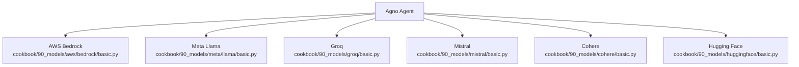
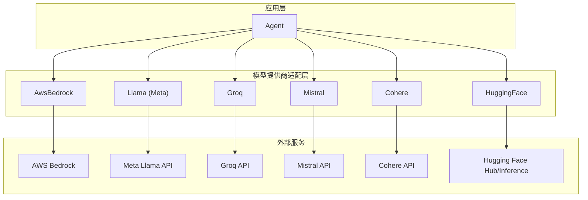
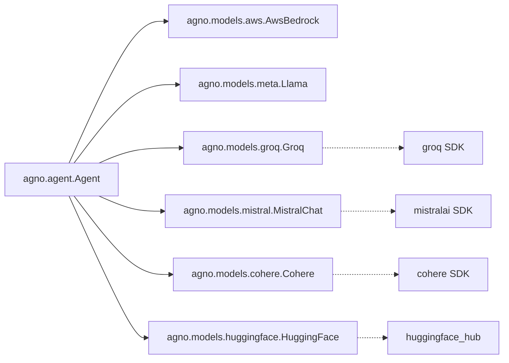

# 其他模型提供商

<cite>
**本文引用的文件**
- [cookbook/90_models/README.md](file://cookbook/90_models/README.md)
- [cookbook/90_models/aws/README.md](file://cookbook/90_models/aws/README.md)
- [cookbook/90_models/aws/bedrock/basic.py](file://cookbook/90_models/aws/bedrock/basic.py)
- [cookbook/90_models/meta/README.md](file://cookbook/90_models/meta/README.md)
- [cookbook/90_models/meta/llama/basic.py](file://cookbook/90_models/meta/llama/basic.py)
- [cookbook/90_models/groq/README.md](file://cookbook/90_models/groq/README.md)
- [cookbook/90_models/groq/basic.py](file://cookbook/90_models/groq/basic.py)
- [cookbook/90_models/mistral/README.md](file://cookbook/90_models/mistral/README.md)
- [cookbook/90_models/mistral/basic.py](file://cookbook/90_models/mistral/basic.py)
- [cookbook/90_models/cohere/README.md](file://cookbook/90_models/cohere/README.md)
- [cookbook/90_models/cohere/basic.py](file://cookbook/90_models/cohere/basic.py)
- [cookbook/90_models/huggingface/README.md](file://cookbook/90_models/huggingface/README.md)
- [cookbook/90_models/huggingface/basic.py](file://cookbook/90_models/huggingface/basic.py)
</cite>

## 目录
1. [简介](#简介)
2. [项目结构](#项目结构)
3. [核心组件](#核心组件)
4. [架构总览](#架构总览)
5. [详细组件分析](#详细组件分析)
6. [依赖关系分析](#依赖关系分析)
7. [性能考量](#性能考量)
8. [故障排除指南](#故障排除指南)
9. [结论](#结论)
10. [附录](#附录)

## 简介
本章节面向希望在 Agno Learn 中集成第三方模型提供商（AWS Bedrock、Meta Llama、Groq、Mistral、Cohere、Hugging Face）的开发者，系统性介绍各提供商的特性与适用场景、集成配置要点（API 密钥、端点与认证）、使用示例（基础调用、参数配置、响应处理）、特色能力（本地部署、推理加速、多模态支持），以及性能优化建议（缓存、批量与并发控制）与最佳实践、故障排除指南。

## 项目结构
Agno Learn 提供了统一的 Agent 模型抽象，通过在 Agent 初始化时注入不同提供商的模型类，即可完成跨提供商的无缝切换。示例代码集中在 cookbook/90_models 下，每个提供商一个子目录，包含基础调用、流式输出、工具调用、结构化输出等典型用法。

图表来源
- [cookbook/90_models/aws/bedrock/basic.py:1-41](file://cookbook/90_models/aws/bedrock/basic.py#L1-L41)
- [cookbook/90_models/meta/llama/basic.py:1-42](file://cookbook/90_models/meta/llama/basic.py#L1-L42)
- [cookbook/90_models/groq/basic.py:1-41](file://cookbook/90_models/groq/basic.py#L1-L41)
- [cookbook/90_models/mistral/basic.py:1-42](file://cookbook/90_models/mistral/basic.py#L1-L42)
- [cookbook/90_models/cohere/basic.py:1-39](file://cookbook/90_models/cohere/basic.py#L1-L39)
- [cookbook/90_models/huggingface/basic.py:1-52](file://cookbook/90_models/huggingface/basic.py#L1-L52)

章节来源
- [cookbook/90_models/README.md:1-42](file://cookbook/90_models/README.md#L1-L42)

## 核心组件
- 统一入口：Agent 构造函数接收 model 参数，传入对应提供商的模型类实例（如 AwsBedrock、Llama、Groq、MistralChat、Cohere、HuggingFace）。
- 响应模式：支持同步打印、同步返回、异步打印、异步返回；多数示例同时演示了流式与非流式两种输出模式。
- 参数配置：常见参数包括模型标识 id、最大生成长度 max_tokens、采样温度 temperature、Markdown 渲染等；部分提供商示例还展示了结构化输出与工具调用。

章节来源
- [cookbook/90_models/aws/bedrock/basic.py:16-37](file://cookbook/90_models/aws/bedrock/basic.py#L16-L37)
- [cookbook/90_models/meta/llama/basic.py:16-38](file://cookbook/90_models/meta/llama/basic.py#L16-L38)
- [cookbook/90_models/groq/basic.py:16-35](file://cookbook/90_models/groq/basic.py#L16-L35)
- [cookbook/90_models/mistral/basic.py:16-38](file://cookbook/90_models/mistral/basic.py#L16-L38)
- [cookbook/90_models/cohere/basic.py:16-35](file://cookbook/90_models/cohere/basic.py#L16-L35)
- [cookbook/90_models/huggingface/basic.py:17-43](file://cookbook/90_models/huggingface/basic.py#L17-L43)

## 架构总览
下图展示 Agno Agent 与各模型提供商的交互关系：Agent 作为上层编排者，通过统一接口调用不同提供商的模型类；提供商内部封装各自的认证、请求与响应处理逻辑。

图表来源
- [cookbook/90_models/aws/bedrock/basic.py:8-18](file://cookbook/90_models/aws/bedrock/basic.py#L8-L18)
- [cookbook/90_models/meta/llama/basic.py:8-19](file://cookbook/90_models/meta/llama/basic.py#L8-L19)
- [cookbook/90_models/groq/basic.py:8-16](file://cookbook/90_models/groq/basic.py#L8-L16)
- [cookbook/90_models/mistral/basic.py:8-19](file://cookbook/90_models/mistral/basic.py#L8-L19)
- [cookbook/90_models/cohere/basic.py:8-16](file://cookbook/90_models/cohere/basic.py#L8-L16)
- [cookbook/90_models/huggingface/basic.py:10-21](file://cookbook/90_models/huggingface/basic.py#L10-L21)

## 详细组件分析

### AWS Bedrock 集成
- 特点与适用场景
  - 依托 AWS 托管服务，适合企业级部署与合规要求较高的环境。
  - 支持多种模型（如 Claude、Llama），可按需选择推理实例与端点。
- 集成配置
  - 认证：使用 AWS 凭证（默认凭据链或显式配置）。
  - 模型标识：通过 AwsBedrock(id="...") 指定具体模型版本。
- 使用示例
  - 同步/异步打印与流式输出均有示例，便于快速验证。
- 性能与优化
  - 利用异步接口提升吞吐；结合连接池与重试策略减少抖动。
- 最佳实践
  - 在生产中启用超时与重试；对敏感数据注意传输加密与访问控制。
- 故障排除
  - 若出现权限错误，检查 IAM 角色与 Bedrock 客户端权限；若模型不可用，确认区域与端点配置。

章节来源
- [cookbook/90_models/aws/README.md:1-10](file://cookbook/90_models/aws/README.md#L1-L10)
- [cookbook/90_models/aws/bedrock/basic.py:16-37](file://cookbook/90_models/aws/bedrock/basic.py#L16-L37)

### Meta Llama 集成
- 特点与适用场景
  - 提供高质量指令遵循模型，适合对话、推理与工具调用。
  - 可通过 LlamaOpenAI 适配器以 OpenAI 兼容方式调用。
- 集成配置
  - 认证：导出 LLAMA_API_KEY。
  - 安装：需要安装 llama-api-client 或 openai（LlamaOpenAI）。
- 使用示例
  - 基础对话、流式输出、工具调用均有示例。
- 性能与优化
  - 合理设置温度与上下文长度；开启流式以改善延迟感知。
- 最佳实践
  - 对长对话使用记忆管理；在工具调用前明确函数签名与约束。
- 故障排除
  - 若提示密钥无效，确认已正确导出；若网络受限，检查代理与域名可达性。

章节来源
- [cookbook/90_models/meta/README.md:12-28](file://cookbook/90_models/meta/README.md#L12-L28)
- [cookbook/90_models/meta/llama/basic.py:16-38](file://cookbook/90_models/meta/llama/basic.py#L16-L38)

### Groq 集成
- 特点与适用场景
  - 以高性能推理著称，适合需要低延迟的实时场景。
- 集成配置
  - 认证：导出 GROQ_API_KEY。
  - 安装：示例依赖 groq、ddgs、duckdb、yfinance 等库。
- 使用示例
  - 基础对话、工具调用（搜索、研究）、结构化输出、存储与知识检索、图像分析、异步模式等。
- 性能与优化
  - 利用其高吞吐能力，结合批量与并发控制；对长文本任务考虑分段与缓存。
- 最佳实践
  - 在需要外部检索时，优先选择轻量级嵌入模型；对多模态输入确保输入格式符合要求。
- 故障排除
  - 若报错“模型不可用”，确认模型 ID 是否仍在可用列表；检查网络连通性与速率限制。

章节来源
- [cookbook/90_models/groq/README.md:12-22](file://cookbook/90_models/groq/README.md#L12-L22)
- [cookbook/90_models/groq/basic.py:16-35](file://cookbook/90_models/groq/basic.py#L16-L35)

### Mistral 集成
- 特点与适用场景
  - 覆盖中小规模与大规模模型，兼顾成本与性能。
- 集成配置
  - 认证：导出 MISTRAL_API_KEY。
  - 安装：示例依赖 mistralai、ddgs、duckdb、yfinance 等库。
- 使用示例
  - 基础对话、工具调用（搜索）、结构化输出、内存管理等。
- 性能与优化
  - 对高频查询启用缓存；对复杂任务拆分为子任务并行执行。
- 最佳实践
  - 使用记忆模块保存上下文摘要；在工具调用中严格校验输入。
- 故障排除
  - 若出现认证失败，检查密钥是否过期；若响应异常，核对模型参数范围。

章节来源
- [cookbook/90_models/mistral/README.md:12-22](file://cookbook/90_models/mistral/README.md#L12-L22)
- [cookbook/90_models/mistral/basic.py:16-38](file://cookbook/90_models/mistral/basic.py#L16-L38)

### Cohere 集成
- 特点与适用场景
  - 强调语义理解与检索增强，适合问答、知识检索与结构化输出。
- 集成配置
  - 认证：导出 CO_API_KEY。
  - 安装：示例依赖 cohere、ddgs、duckdb、yfinance 等库。
- 使用示例
  - 基础对话、工具调用、结构化输出、存储、知识检索、内存管理等。
- 性能与优化
  - 结合向量化与索引技术提升检索效率；对重复问题使用缓存。
- 最佳实践
  - 在检索前清洗与规范化查询；对输出进行后处理与校验。
- 故障排除
  - 若检索结果质量差，调整查询扩展与 rerank 策略；检查嵌入模型与索引一致性。

章节来源
- [cookbook/90_models/cohere/README.md:12-22](file://cookbook/90_models/cohere/README.md#L12-L22)
- [cookbook/90_models/cohere/basic.py:16-35](file://cookbook/90_models/cohere/basic.py#L16-L35)

### Hugging Face 集成
- 特点与适用场景
  - 支持广泛的开源模型与推理后端，适合研究与原型开发。
- 集成配置
  - 认证：导出 HF_TOKEN。
  - 安装：示例依赖 huggingface_hub、agno。
- 使用示例
  - 基础对话、流式输出、工具调用（如 Llama 文章写作）。
- 性能与优化
  - 使用更高效的量化模型与推理框架；对长序列采用分块策略。
- 最佳实践
  - 明确模型许可证与使用条款；对敏感数据避免上传至公共仓库。
- 故障排除
  - 若模型加载失败，检查模型 ID 与 Token 权限；若网络超时，考虑更换镜像源或代理。

章节来源
- [cookbook/90_models/huggingface/README.md:12-22](file://cookbook/90_models/huggingface/README.md#L12-L22)
- [cookbook/90_models/huggingface/basic.py:17-43](file://cookbook/90_models/huggingface/basic.py#L17-L43)

## 依赖关系分析
- 统一依赖：所有提供商示例均依赖 agno.agent 与 agno.models 下的对应模型类。
- 第三方依赖：各提供商示例额外依赖其官方 SDK 或相关生态库（如 groq、mistralai、cohere、huggingface_hub 等）。
- 运行时依赖：示例中常包含工具库（如 ddgs 搜索、duckdb 存储、yfinance 数据）用于演示完整工作流。

图表来源
- [cookbook/90_models/aws/bedrock/basic.py:8-9](file://cookbook/90_models/aws/bedrock/basic.py#L8-L9)
- [cookbook/90_models/meta/llama/basic.py:8-9](file://cookbook/90_models/meta/llama/basic.py#L8-L9)
- [cookbook/90_models/groq/basic.py:8-9](file://cookbook/90_models/groq/basic.py#L8-L9)
- [cookbook/90_models/mistral/basic.py:8-9](file://cookbook/90_models/mistral/basic.py#L8-L9)
- [cookbook/90_models/cohere/basic.py:8-9](file://cookbook/90_models/cohere/basic.py#L8-L9)
- [cookbook/90_models/huggingface/basic.py:10-11](file://cookbook/90_models/huggingface/basic.py#L10-L11)

## 性能考量
- 缓存策略
  - 对重复输入或相似查询使用键控缓存；对结构化输出与工具调用结果进行持久化缓存。
- 批量处理
  - 将多个小请求合并为批次，降低网络开销与握手次数；注意批大小与内存占用平衡。
- 并发控制
  - 使用异步接口与连接池；限制并发上限，避免触发提供商的速率限制。
- 上下文与参数
  - 合理设置 max_tokens 与 temperature；对长对话使用摘要与记忆模块减少上下文长度。
- 多模态与外部工具
  - 对图像/音频输入进行预处理与压缩；对外部工具调用增加超时与重试机制。

## 故障排除指南
- 认证失败
  - 检查环境变量是否正确导出；确认密钥未过期且具备相应权限。
- 模型不可用或返回空
  - 核对模型 ID 是否在当前区域/账户可用；检查网络连通性与代理设置。
- 响应异常或超时
  - 增加重试与退避策略；适当提高超时阈值；必要时切换到备用提供商。
- 工具调用失败
  - 校验工具输入格式与参数范围；对返回结果进行类型与完整性校验。
- 性能不达预期
  - 分析瓶颈（CPU/IO/网络/模型），针对性优化参数与并发；引入缓存与索引。

## 结论
通过 Agno Learn 的统一模型抽象，开发者可以快速在 AWS Bedrock、Meta Llama、Groq、Mistral、Cohere、Hugging Face 等多家提供商之间切换与组合使用。建议在实际项目中结合业务场景选择合适的提供商，建立完善的认证与监控体系，并持续优化参数与并发策略以获得稳定且高性能的体验。

## 附录
- 快速开始步骤（以 OpenAI 为例）
  - 安装依赖：pip 安装 agno 与对应提供商 SDK。
  - 设置密钥：导出 OPENAI_API_KEY。
  - 运行示例：执行 cookbook/92_models/openai/basic.py。
- 常见模式
  - 基础对话、流式输出、工具调用、结构化输出等模式在各提供商示例中均有体现，可作为模板直接复用。

章节来源
- [cookbook/90_models/README.md:22-42](file://cookbook/90_models/README.md#L22-L42)