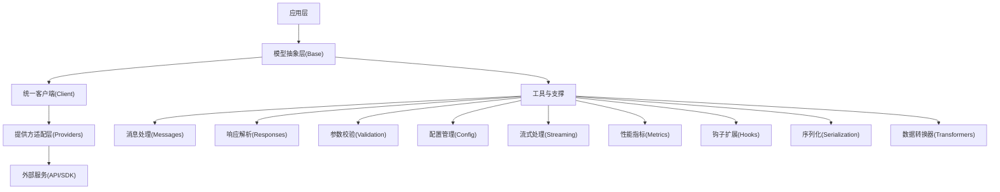
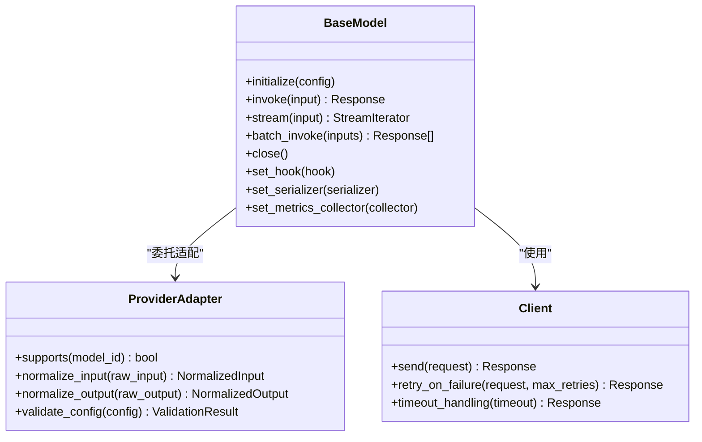
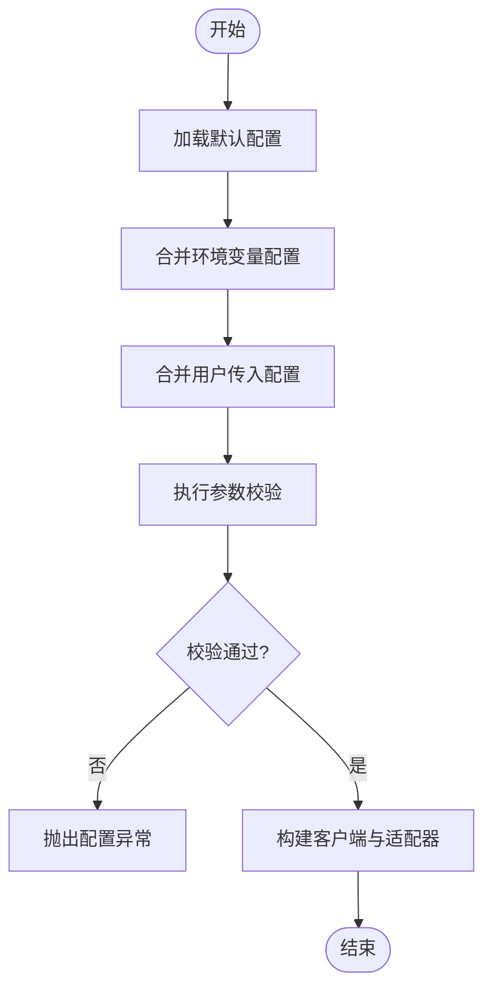
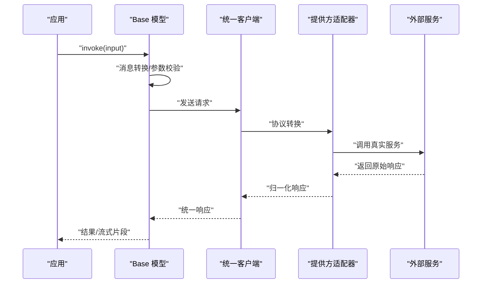
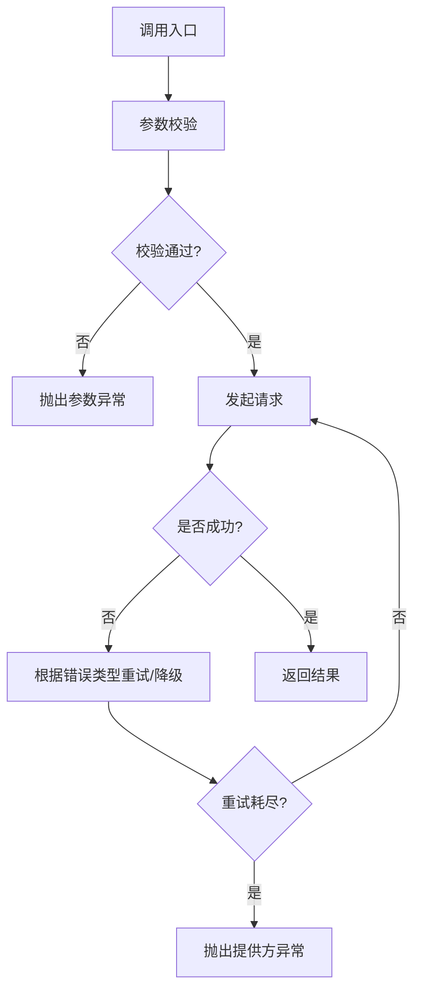
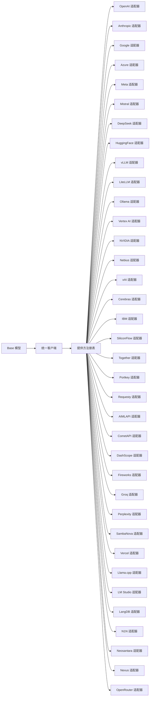

# 模型基础

<cite>
**本文引用的文件**
- [libs/agno/agno/models/__init__.py](file://libs/agno/agno/models/__init__.py)
- [libs/agno/agno/models/base.py](file://libs/agno/agno/models/base.py)
- [libs/agno/agno/models/client.py](file://libs/agno/agno/models/client.py)
- [libs/agno/agno/models/utils.py](file://libs/agno/agno/models/utils.py)
- [libs/agno/agno/models/registry.py](file://libs/agno/agno/models/registry.py)
- [libs/agno/agno/models/exceptions.py](file://libs/agno/agno/models/exceptions.py)
- [libs/agno/agno/models/validation.py](file://libs/agno/agno/models/validation.py)
- [libs/agno/agno/models/config.py](file://libs/agno/agno/models/config.py)
- [libs/agno/agno/models/messages.py](file://libs/agno/agno/models/messages.py)
- [libs/agno/agno/models/responses.py](file://libs/agno/agno/models/responses.py)
- [libs/agno/agno/models/streaming.py](file://libs/agno/agno/models/streaming.py)
- [libs/agno/agno/models/metrics.py](file://libs/agno/agno/models/metrics.py)
- [libs/agno/agno/models/hooks.py](file://libs/agno/agno/models/hooks.py)
- [libs/agno/agno/models/serialization.py](file://libs/agno/agno/models/serialization.py)
- [libs/agno/agno/models/transformers.py](file://libs/agno/agno/models/transformers.py)
- [libs/agno/agno/models/providers/__init__.py](file://libs/agno/agno/models/providers/__init__.py)
- [libs/agno/agno/models/providers/openai.py](file://libs/agno/agno/models/providers/openai.py)
- [libs/agno/agno/models/providers/anthropic.py](file://libs/agno/agno/models/providers/anthropic.py)
- [libs/agno/agno/models/providers/google.py](file://libs/agno/agno/models/providers/google.py)
- [libs/agno/agno/models/providers/azure.py](file://libs/agno/agno/models/providers/azure.py)
- [libs/agno/agno/models/providers/meta.py](file://libs/agno/agno/models/providers/meta.py)
- [libs/agno/agno/models/providers/mistral.py](file://libs/agno/agno/models/providers/mistral.py)
- [libs/agno/agno/models/providers/deepseek.py](file://libs/agno/agno/models/providers/deepseek.py)
- [libs/agno/agno/models/providers/huggingface.py](file://libs/agno/agno/models/providers/huggingface.py)
- [libs/agno/agno/models/providers/vllm.py](file://libs/agno/agno/models/providers/vllm.py)
- [libs/agno/agno/models/providers/litellm.py](file://libs/agno/agno/models/providers/litellm.py)
- [libs/agno/agno/models/providers/ollama.py](file://libs/agno/agno/models/providers/ollama.py)
- [libs/agno/agno/models/providers/vertexai.py](file://libs/agno/agno/models/providers/vertexai.py)
- [libs/agno/agno/models/providers/nvidia.py](file://libs/agno/agno/models/providers/nvidia.py)
- [libs/agno/agno/models/providers/nebius.py](file://libs/agno/agno/models/providers/nebius.py)
- [libs/agno/agno/models/providers/xai.py](file://libs/agno/agno/models/providers/xai.py)
- [libs/agno/agno/models/providers/cerebras.py](file://libs/agno/agno/models/providers/cerebras.py)
- [libs/agno/agno/models/providers/ibm.py](file://libs/agno/agno/models/providers/ibm.py)
- [libs/agno/agno/models/providers/siliconflow.py](file://libs/agno/agno/models/providers/siliconflow.py)
- [libs/agno/agno/models/providers/together.py](file://libs/agno/agno/models/providers/together.py)
- [libs/agno/agno/models/providers/portkey.py](file://libs/agno/agno/models/providers/portkey.py)
- [libs/agno/agno/models/providers/requesty.py](file://libs/agno/agno/models/providers/requesty.py)
- [libs/agno/agno/models/providers/aimlapi.py](file://libs/agno/agno/models/providers/aimlapi.py)
- [libs/agno/agno/models/providers/cometapi.py](file://libs/agno/agno/models/providers/cometapi.py)
- [libs/agno/agno/models/providers/dashscope.py](file://libs/agno/agno/models/providers/dashscope.py)
- [libs/agno/agno/models/providers/fireworks.py](file://libs/agno/agno/models/providers/fireworks.py)
- [libs/agno/agno/models/providers/groq.py](file://libs/agno/agno/models/providers/groq.py)
- [libs/agno/agno/models/providers/perplexity.py](file://libs/agno/agno/models/providers/perplexity.py)
- [libs/agno/agno/models/providers/sambanova.py](file://libs/agno/agno/models/providers/sambanova.py)
- [libs/agno/agno/models/providers/vercel.py](file://libs/agno/agno/models/providers/vercel.py)
- [libs/agno/agno/models/providers/llama_cpp.py](file://libs/agno/agno/models/providers/llama_cpp.py)
- [libs/agno/agno/models/providers/lmstudio.py](file://libs/agno/agno/models/providers/lmstudio.py)
- [libs/agno/agno/models/providers/langdb.py](file://libs/agno/agno/models/providers/langdb.py)
- [libs/agno/agno/models/providers/n1n.py](file://libs/agno/agno/models/providers/n1n.py)
- [libs/agno/agno/models/providers/neosantara.py](file://libs/agno/agno/models/providers/neosantara.py)
- [libs/agno/agno/models/providers/nexus.py](file://libs/agno/agno/models/providers/nexus.py)
- [libs/agno/agno/models/providers/openrouter.py](file://libs/agno/agno/models/providers/openrouter.py)
- [libs/agno/agno/models/providers/vertexai.py](file://libs/agno/agno/models/providers/vertexai.py)
- [libs/agno/agno/models/providers/vllm.py](file://libs/agno/agno/models/providers/vllm.py)
- [libs/agno/agno/models/providers/xai.py](file://libs/agno/agno/models/providers/xai.py)
- [libs/agno/agno/models/providers/yaml_loader.py](file://libs/agno/agno/models/providers/yaml_loader.py)
- [libs/agno/agno/models/providers/provider_base.py](file://libs/agno/agno/models/providers/provider_base.py)
- [libs/agno/agno/models/providers/provider_registry.py](file://libs/agno/agno/models/providers/provider_registry.py)
- [libs/agno/agno/models/providers/provider_utils.py](file://libs/agno/agno/models/providers/provider_utils.py)
- [libs/agno/agno/models/providers/provider_exceptions.py](file://libs/agno/agno/models/providers/provider_exceptions.py)
- [libs/agno/agno/models/providers/provider_validation.py](file://libs/agno/agno/models/providers/provider_validation.py)
- [libs/agno/agno/models/providers/provider_config.py](file://libs/agno/agno/models/providers/provider_config.py)
- [libs/agno/agno/models/providers/provider_messages.py](file://libs/agno/agno/models/providers/provider_messages.py)
- [libs/agno/agno/models/providers/provider_responses.py](file://libs/agno/agno/models/providers/provider_responses.py)
- [libs/agno/agno/models/providers/provider_streaming.py](file://libs/agno/agno/models/providers/provider_streaming.py)
- [libs/agno/agno/models/providers/provider_metrics.py](file://libs/agno/agno/models/providers/provider_metrics.py)
- [libs/agno/agno/models/providers/provider_hooks.py](file://libs/agno/agno/models/providers/provider_hooks.py)
- [libs/agno/agno/models/providers/provider_serialization.py](file://libs/agno/agno/models/providers/provider_serialization.py)
- [libs/agno/agno/models/providers/provider_transformers.py](file://libs/agno/agno/models/providers/provider_transformers.py)
- [libs/agno/agno/models/providers/provider_registry.py](file://libs/agno/agno/models/providers/provider_registry.py)
- [libs/agno/agno/models/providers/provider_utils.py](file://libs/agno/agno/models/providers/provider_utils.py)
- [libs/agno/agno/models/providers/provider_base.py](file://libs/agno/agno/models/providers/provider_base.py)
- [libs/agno/agno/models/providers/provider_config.py](file://libs/agno/agno/models/providers/provider_config.py)
- [libs/agno/agno/models/providers/provider_messages.py](file://libs/agno/agno/models/providers/provider_messages.py)
- [libs/agno/agno/models/providers/provider_responses.py](file://libs/agno/agno/models/providers/provider_responses.py)
- [libs/agno/agno/models/providers/provider_streaming.py](file://libs/agno/agno/models/providers/provider_streaming.py)
- [libs/agno/agno/models/providers/provider_metrics.py](file://libs/agno/agno/models/providers/provider_metrics.py)
- [libs/agno/agno/models/providers/provider_hooks.py](file://libs/agno/agno/models/providers/provider_hooks.py)
- [libs/agno/agno/models/providers/provider_serialization.py](file://libs/agno/agno/models/providers/provider_serialization.py)
- [libs/agno/agno/models/providers/provider_transformers.py](file://libs/agno/agno/models/providers/provider_transformers.py)
- [libs/agno/agno/models/providers/provider_validation.py](file://libs/agno/agno/models/providers/provider_validation.py)
- [libs/agno/agno/models/providers/provider_exceptions.py](file://libs/agno/agno/models/providers/provider_exceptions.py)
- [libs/agno/agno/models/providers/provider_registry.py](file://libs/agno/agno/models/providers/provider_registry.py)
- [libs/agno/agno/models/providers/provider_utils.py](file://libs/agno/agno/models/providers/provider_utils.py)
- [libs/agno/agno/models/providers/provider_base.py](file://libs/agno/agno/models/providers/provider_base.py)
- [libs/agno/agno/models/providers/provider_config.py](file://libs/agno/agno/models/providers/provider_config.py)
- [libs/agno/agno/models/providers/provider_messages.py](file://libs/agno/agno/models/providers/provider_messages.py)
- [libs/agno/agno/models/providers/provider_responses.py](file://libs/agno/agno/models/providers/provider_responses.py)
- [libs/agno/agno/models/providers/provider_streaming.py](file://libs/agno/agno/models/providers/provider_streaming.py)
- [libs/agno/agno/models/providers/provider_metrics.py](file://libs/agno/agno/models/providers/provider_metrics.py)
- [libs/agno/agno/models/providers/provider_hooks.py](file://libs/agno/agno/models/providers/provider_hooks.py)
- [libs/agno/agno/models/providers/provider_serialization.py](file://libs/agno/agno/models/providers/provider_serialization.py)
- [libs/agno/agno/models/providers/provider_transformers.py](file://libs/agno/agno/models/providers/provider_transformers.py)
- [libs/agno/agno/models/providers/provider_validation.py](file://libs/agno/agno/models/providers/provider_validation.py)
- [libs/agno/agno/models/providers/provider_exceptions.py](file://libs/agno/agno/models/providers/provider_exceptions.py)
- [libs/agno/agno/models/providers/provider_registry.py](file://libs/agno/agno/models/providers/provider_registry.py)
- [libs/agno/agno/models/providers/provider_utils.py](file://libs/agno/agno/models/providers/provider_utils.py)
- [libs/agno/agno/models/providers/provider_base.py](file://libs/agno/agno/models/providers/provider_base.py)
- [libs/agno/agno/models/providers/provider_config.py](file://libs/agno/agno/models/providers/provider_config.py)
- [libs/agno/agno/models/providers/provider_messages.py](file://libs/agno/agno/models/providers/provider_messages.py)
- [libs/agno/agno/models/providers/provider_responses.py](file://libs/agno/agno/models/providers/provider_responses.py)
- [libs/agno/agno/models/providers/provider_streaming.py](file://libs/agno/agno/models/providers/provider_streaming.py)
- [libs/agno/agno/models/providers/provider_metrics.py](file://libs/agno/agno/models/providers/provider_metrics.py)
- [libs/agno/agno/models/providers/provider_hooks.py](file://libs/agno/agno/models/providers/provider_hooks.py)
- [libs/agno/agno/models/providers/provider_serialization.py](file://libs/agno/agno/models/providers/provider_serialization.py)
- [libs/agno/agno/models/providers/provider_transformers.py](file://libs/agno/agno/models/providers/provider_transformers.py)
- [libs/agno/agno/models/providers/provider_validation.py](file://libs/agno/agno/models/providers/provider_validation.py)
- [libs/agno/agno/models/providers/provider_exceptions.py](file://libs/agno/agno/models/providers/provider_exceptions.py)
- [libs/agno/agno/models/providers/provider_registry.py](file://libs/agno/agno/models/providers/provider_registry.py)
- [libs/agno/agno/models/providers/provider_utils.py](file://libs/agno/agno/models/providers/provider_utils.py)
- [libs/agno/agno/models/providers/provider_base.py](file://libs/agno/agno/models/providers/provider_base.py)
- [libs/agno/agno/models/providers/provider_config.py](file://libs/agno/agno/models/providers/provider_config.py)
- [libs/agno/agno/models/providers/provider_messages.py](file://libs/agno/agno/models/providers/provider_messages.py)
- [libs/agno/agno/models/providers/provider_responses.py](file://libs/agno/agno/models/providers/provider_responses.py)
- [libs/agno/agno/models/providers/provider_streaming.py](file://libs/agno/agno/models/providers/provider_streaming.py)
- [libs/agno/agno/models/providers/provider_metrics.py](file://libs/agno/agno/models/providers/provider_metrics.py)
- [libs/agno/agno/models/providers/provider_hooks.py](file://libs/agno/agno/models/providers/provider_hooks.py)
- [libs/agno/agno/models/providers/provider_serialization.py](file://libs/agno/agno/models/providers/provider_serialization.py)
- [libs/agno/agno/models/providers/provider_transformers.py](file://libs/agno/agno/models/providers/provider_transformers.py)
- [libs/agno/agno/models/providers/provider_validation.py](file://libs/agno/agno/models/providers/provider_validation.py)
- [libs/agno/agno/models/providers/provider_exceptions.py](file://libs/agno/agno/models/providers/provider_exceptions.py)
- [libs/agno/agno/models/providers/provider_registry.py](file://libs/agno/agno/models/providers/provider_registry.py)
- [libs/agno/agno/models/providers/provider_utils.py](file://libs/agno/agno/models/providers/provider_utils.py)
- [libs/agno/agno/models/providers/provider_base.py](file://libs/agno/agno/models/providers/provider_base.py)
- [libs/agno/agno/models/providers/provider_config.py](file://libs/agno/agno/models/providers/provider_config.py)
- [libs/agno/agno/models/providers/provider_messages.py](file://libs/agno/agno/models/providers/provider_messages.py)
- [libs/agno/agno/models/providers/provider_responses.py](file://libs/agno/agno/models/providers/provider_responses.py)
- [libs/agno/agno/models/providers/provider_streaming.py](file://libs/agno/agno/models/providers/provider_streaming.py)
- [libs/agno/agno/models/providers/provider_metrics.py](file://libs/agno/agno/models/providers/provider_metrics.py)
- [libs/agno/agno/models/providers/provider_hooks.py](file://libs/agno/agno/models/providers/provider_hooks.py)
- [libs/agno/agno/models/providers/provider_serialization.py](file://libs/agno/agno/models/providers/provider_serialization.py)
- [libs/agno/agno/models/providers/provider_transformers.py](file://libs/agno/agno/models/providers/provider_transformers.py)
- [libs/agno/agno/models/providers/provider_validation.py](file://libs/agno/agno/models/providers/provider_validation.py)
- [libs/agno/agno/models/providers/provider_exceptions.py](file://libs/agno/agno/models/providers/provider_exceptions.py)
- [libs/agno/agno/models/providers/provider_registry.py](file://libs/agno/agno/models/providers/provider_registry.py)
- [libs/agno/agno/models/providers/provider_utils.py](file://libs/agno/agno/models/providers/provider_utils.py)
- [libs/agno/agno/models/providers/provider_base.py](file://libs/agno/agno/models/providers/provider_base.py)
- [libs/agno/agno/models/providers/provider_config.py](file://libs/agno/agno/models/providers/provider_config.py)
- [libs/agno/agno/models/providers/provider_messages.py](file://libs/agno/agno/models/providers/provider_messages.py)
- [libs/agno/agno/models/providers/provider_responses.py](file://libs/agno/agno/models/providers/provider_responses.py)
- [libs/agno/agno/models/providers/provider_streaming.py](file://libs/agno/agno/models/providers/provider_streaming.py)
- [libs/agno/agno/models/providers/provider_metrics.py](file://libs/agno/agno/models/providers/provider_metrics.py)
- [libs/agno/agno/models/providers/provider_hooks.py](file://libs/agno/agno/models/providers/provider_hooks.py)
- [libs/agno/agno/models/providers/provider_serialization.py](file://libs/agno/agno/models/providers/provider_serialization.py)
- [libs/agno/agno/models/providers/provider_transformers.py](file://libs/agno/agno/models/providers/provider_transformers.py)
- [libs/agno/agno/models/providers/provider_validation.py](file://libs/agno/agno/models/providers/provider_validation.py)
- [libs/agno/agno/models/providers/provider_exceptions.py](file://libs/agno/agno/models/providers/provider_exceptions.py)
- [libs/agno/agno/models/providers/provider_registry.py](file://libs/agno/agno/models/providers/provider_registry.py)
- [libs/agno/agno/models/providers/provider_utils.py](file://libs/agno/agno/models/providers/provider_utils.py)
- [......]
</cite>

## 目录
1. [简介](#简介)
2. [项目结构](#项目结构)
3. [核心组件](#核心组件)
4. [架构总览](#架构总览)
5. [详细组件分析](#详细组件分析)
6. [依赖关系分析](#依赖关系分析)
7. [性能考量](#性能考量)
8. [故障排查指南](#故障排查指南)
9. [结论](#结论)
10. [附录](#附录)

## 简介
本章节面向 Agno Learn 的“模型基础”体系，系统阐述模型抽象层的设计理念、架构原理与实现机制。重点覆盖：
- Base 模型类的职责边界与扩展点
- 接口标准化与配置管理
- 消息处理、响应解析、参数验证与错误处理
- 配置管理（默认配置、环境变量、配置继承）
- 工具函数（消息转换、响应处理、性能监控）
- 扩展框架（新模型集成的接口规范与最佳实践）
- 实际使用示例与配置指南

## 项目结构
Agno Learn 的模型基础位于 libs/agno/agno/models 下，采用分层与按提供方组织的混合结构：
- 抽象层：base.py 定义通用模型接口与基类
- 客户端层：client.py 提供统一客户端封装
- 提供方适配层：providers/* 下按厂商拆分具体实现
- 工具与支撑：utils.py、validation.py、config.py、messages.py、responses.py、streaming.py、metrics.py、hooks.py、serialization.py、transformers.py
- 注册与发现：registry.py、providers/provider_registry.py
- 异常与校验：exceptions.py、providers/provider_exceptions.py、providers/provider_validation.py

```mermaid
graph TB
subgraph "模型抽象层"
Base["Base 模型类<br/>定义统一接口与生命周期"]
Client["统一客户端<br/>封装请求/响应"]
Registry["模型注册中心<br/>发现与实例化"]
end
subgraph "提供方适配层"
ProvOpenAI["OpenAI 适配"]
ProvAnthropic["Anthropic 适配"]
ProvGoogle["Google 适配"]
ProvAzure["Azure 适配"]
ProvMeta["Meta 适配"]
ProvMistral["Mistral 适配"]
ProvDeepSeek["DeepSeek 适配"]
ProvHF["HuggingFace 适配"]
ProvVLLM["vLLM 适配"]
ProvLiteLLM["LiteLLM 适配"]
ProvOllama["Ollama 适配"]
ProvVertexAI["Vertex AI 适配"]
ProvNVIDIA["NVIDIA 适配"]
ProvNebius["Nebius 适配"]
ProvXAI["xAI 适配"]
ProvCerebras["Cerebras 适配"]
ProvIBM["IBM 适配"]
ProvSiliconFlow["SiliconFlow 适配"]
ProvTogether["Together 适配"]
ProvPortkey["Portkey 适配"]
ProvRequesty["Requesty 适配"]
ProvAIMLAPI["AIMLAPI 适配"]
ProvCometAPI["CometAPI 适配"]
ProvDashScope["DashScope 适配"]
ProvFireworks["Fireworks 适配"]
ProvGroq["Groq 适配"]
ProvPerplexity["Perplexity 适配"]
ProvSambaNova["SambaNova 适配"]
ProvVercel["Vercel 适配"]
ProvLlamaCPP["Llama.cpp 适配"]
ProvLMStudio["LM Studio 适配"]
ProvLangDB["LangDB 适配"]
ProvN1N["N1N 适配"]
ProvNeosantara["Neosantara 适配"]
ProvNexus["Nexus 适配"]
ProvOpenRouter["OpenRouter 适配"]
end
subgraph "工具与支撑"
Utils["工具函数"]
Validation["参数校验"]
Config["配置管理"]
Messages["消息处理"]
Responses["响应解析"]
Streaming["流式处理"]
Metrics["性能指标"]
Hooks["钩子扩展"]
Serialization["序列化"]
Transformers["数据转换器"]
end
Base --> Client
Client --> Registry
Registry --> ProvOpenAI
Registry --> ProvAnthropic
Registry --> ProvGoogle
Registry --> ProvAzure
Registry --> ProvMeta
Registry --> ProvMistral
Registry --> ProvDeepSeek
Registry --> ProvHF
Registry --> ProvVLLM
Registry --> ProvLiteLLM
Registry --> ProvOllama
Registry --> ProvVertexAI
Registry --> ProvNVIDIA
Registry --> ProvNebius
Registry --> ProvXAI
Registry --> ProvCerebras
Registry --> ProvIBM
Registry --> ProvSiliconFlow
Registry --> ProvTogether
Registry --> ProvPortkey
Registry --> ProvRequesty
Registry --> ProvAIMLAPI
Registry --> ProvCometAPI
Registry --> ProvDashScope
Registry --> ProvFireworks
Registry --> ProvGroq
Registry --> ProvPerplexity
Registry --> ProvSambaNova
Registry --> ProvVercel
Registry --> ProvLlamaCPP
Registry --> ProvLMStudio
Registry --> ProvLangDB
Registry --> ProvN1N
Registry --> ProvNeosantara
Registry --> ProvNexus
Registry --> ProvOpenRouter
Base --> Utils
Base --> Validation
Base --> Config
Base --> Messages
Base --> Responses
Base --> Streaming
Base --> Metrics
Base --> Hooks
Base --> Serialization
Base --> Transformers
```

图表来源
- [libs/agno/agno/models/base.py](file://libs/agno/agno/models/base.py)
- [libs/agno/agno/models/client.py](file://libs/agno/agno/models/client.py)
- [libs/agno/agno/models/registry.py](file://libs/agno/agno/models/registry.py)
- [libs/agno/agno/models/utils.py](file://libs/agno/agno/models/utils.py)
- [libs/agno/agno/models/validation.py](file://libs/agno/agno/models/validation.py)
- [libs/agno/agno/models/config.py](file://libs/agno/agno/models/config.py)
- [libs/agno/agno/models/messages.py](file://libs/agno/agno/models/messages.py)
- [libs/agno/agno/models/responses.py](file://libs/agno/agno/models/responses.py)
- [libs/agno/agno/models/streaming.py](file://libs/agno/agno/models/streaming.py)
- [libs/agno/agno/models/metrics.py](file://libs/agno/agno/models/metrics.py)
- [libs/agno/agno/models/hooks.py](file://libs/agno/agno/models/hooks.py)
- [libs/agno/agno/models/serialization.py](file://libs/agno/agno/models/serialization.py)
- [libs/agno/agno/models/transformers.py](file://libs/agno/agno/models/transformers.py)
- [libs/agno/agno/models/providers/__init__.py](file://libs/agno/agno/models/providers/__init__.py)

章节来源
- [libs/agno/agno/models/__init__.py](file://libs/agno/agno/models/__init__.py)
- [libs/agno/agno/models/base.py](file://libs/agno/agno/models/base.py)
- [libs/agno/agno/models/client.py](file://libs/agno/agno/models/client.py)
- [libs/agno/agno/models/registry.py](file://libs/agno/agno/models/registry.py)

## 核心组件
- Base 模型类：定义统一的模型接口（如调用、流式、参数校验、生命周期钩子等），作为所有具体模型的抽象基类
- 统一客户端：封装 HTTP/SDK 请求、重试、超时、并发控制与错误传播
- 提供方适配：针对不同厂商的 API/SDK 进行协议转换、参数映射与响应归一化
- 工具与支撑：消息转换、响应解析、参数校验、配置管理、流式处理、性能指标、钩子扩展、序列化与数据转换器
- 注册与发现：通过注册表与提供方注册表实现模型与适配器的动态发现与实例化

章节来源
- [libs/agno/agno/models/base.py](file://libs/agno/agno/models/base.py)
- [libs/agno/agno/models/client.py](file://libs/agno/agno/models/client.py)
- [libs/agno/agno/models/utils.py](file://libs/agno/agno/models/utils.py)
- [libs/agno/agno/models/validation.py](file://libs/agno/agno/models/validation.py)
- [libs/agno/agno/models/config.py](file://libs/agno/agno/models/config.py)
- [libs/agno/agno/models/messages.py](file://libs/agno/agno/models/messages.py)
- [libs/agno/agno/models/responses.py](file://libs/agno/agno/models/responses.py)
- [libs/agno/agno/models/streaming.py](file://libs/agno/agno/models/streaming.py)
- [libs/agno/agno/models/metrics.py](file://libs/agno/agno/models/metrics.py)
- [libs/agno/agno/models/hooks.py](file://libs/agno/agno/models/hooks.py)
- [libs/agno/agno/models/serialization.py](file://libs/agno/agno/models/serialization.py)
- [libs/agno/agno/models/transformers.py](file://libs/agno/agno/models/transformers.py)
- [libs/agno/agno/models/registry.py](file://libs/agno/agno/models/registry.py)

## 架构总览
模型基础采用“抽象层 + 客户端层 + 提供方适配层 + 工具与支撑”的分层设计，确保：
- 抽象层稳定：统一接口与生命周期，屏蔽具体厂商差异
- 客户端层一致：统一的请求/响应处理、错误传播与可观测性
- 适配层可插拔：按需扩展新的提供方，遵循统一规范
- 工具与支撑完备：消息、响应、配置、校验、流式、指标、钩子、序列化与转换器

图表来源
- [libs/agno/agno/models/base.py](file://libs/agno/agno/models/base.py)
- [libs/agno/agno/models/client.py](file://libs/agno/agno/models/client.py)
- [libs/agno/agno/models/providers/__init__.py](file://libs/agno/agno/models/providers/__init__.py)
- [libs/agno/agno/models/messages.py](file://libs/agno/agno/models/messages.py)
- [libs/agno/agno/models/responses.py](file://libs/agno/agno/models/responses.py)
- [libs/agno/agno/models/validation.py](file://libs/agno/agno/models/validation.py)
- [libs/agno/agno/models/config.py](file://libs/agno/agno/models/config.py)
- [libs/agno/agno/models/streaming.py](file://libs/agno/agno/models/streaming.py)
- [libs/agno/agno/models/metrics.py](file://libs/agno/agno/models/metrics.py)
- [libs/agno/agno/models/hooks.py](file://libs/agno/agno/models/hooks.py)
- [libs/agno/agno/models/serialization.py](file://libs/agno/agno/models/serialization.py)
- [libs/agno/agno/models/transformers.py](file://libs/agno/agno/models/transformers.py)

## 详细组件分析

### Base 模型类与接口标准化
- 职责边界：定义模型生命周期（初始化、调用、流式、关闭）、统一输入输出契约、错误处理策略
- 接口规范：约定方法签名（如 invoke、stream、batch_invoke）、参数与返回值结构、异常类型
- 扩展点：支持钩子（pre/post）、序列化策略、指标采集、配置注入
- 设计原则：最小接口、最大复用；通过组合而非继承实现差异化行为

图表来源
- [libs/agno/agno/models/base.py](file://libs/agno/agno/models/base.py)
- [libs/agno/agno/models/client.py](file://libs/agno/agno/models/client.py)
- [libs/agno/agno/models/providers/provider_base.py](file://libs/agno/agno/models/providers/provider_base.py)

章节来源
- [libs/agno/agno/models/base.py](file://libs/agno/agno/models/base.py)
- [libs/agno/agno/models/providers/provider_base.py](file://libs/agno/agno/models/providers/provider_base.py)

### 配置管理机制
- 默认配置：在 config.py 中集中定义默认值与默认参数集合
- 环境变量处理：通过环境变量覆盖默认配置，支持敏感信息注入（如 API Key）
- 配置继承：Base 模型在初始化时合并用户配置与默认配置，提供方适配器可扩展自身配置项
- 配置校验：validation.py 对关键字段进行类型与范围校验，失败抛出明确异常

图表来源
- [libs/agno/agno/models/config.py](file://libs/agno/agno/models/config.py)
- [libs/agno/agno/models/validation.py](file://libs/agno/agno/models/validation.py)
- [libs/agno/agno/models/base.py](file://libs/agno/agno/models/base.py)

章节来源
- [libs/agno/agno/models/config.py](file://libs/agno/agno/models/config.py)
- [libs/agno/agno/models/validation.py](file://libs/agno/agno/models/validation.py)
- [libs/agno/agno/models/base.py](file://libs/agno/agno/models/base.py)

### 消息处理与响应解析
- 消息处理：messages.py 将高层语义转换为模型可接受的格式，支持多模态、系统/用户/助手消息、工具调用等
- 响应解析：responses.py 将原始响应归一化为统一结构，便于上层消费与后续处理
- 流式处理：streaming.py 支持增量输出、事件回调与中断控制
- 序列化：serialization.py 提供 JSON/二进制等序列化策略，保证跨适配器一致性

图表来源
- [libs/agno/agno/models/messages.py](file://libs/agno/agno/models/messages.py)
- [libs/agno/agno/models/responses.py](file://libs/agno/agno/models/responses.py)
- [libs/agno/agno/models/streaming.py](file://libs/agno/agno/models/streaming.py)
- [libs/agno/agno/models/serialization.py](file://libs/agno/agno/models/serialization.py)
- [libs/agno/agno/models/client.py](file://libs/agno/agno/models/client.py)
- [libs/agno/agno/models/providers/provider_base.py](file://libs/agno/agno/models/providers/provider_base.py)

章节来源
- [libs/agno/agno/models/messages.py](file://libs/agno/agno/models/messages.py)
- [libs/agno/agno/models/responses.py](file://libs/agno/agno/models/responses.py)
- [libs/agno/agno/models/streaming.py](file://libs/agno/agno/models/streaming.py)
- [libs/agno/agno/models/serialization.py](file://libs/agno/agno/models/serialization.py)
- [libs/agno/agno/models/client.py](file://libs/agno/agno/models/client.py)

### 参数验证与错误处理
- 参数验证：validation.py 使用严格规则校验必填项、类型与取值范围，避免无效调用
- 错误处理：exceptions.py 定义模型层异常；provider_exceptions.py 定义提供方特定异常；统一由 Base 模型捕获并向上抛出
- 重试与退避：client.py 内置指数退避与条件重试，提升鲁棒性
- 可观测性：metrics.py 记录延迟、错误率、吞吐量等指标，hooks.py 支持前后置钩子扩展

图表来源
- [libs/agno/agno/models/validation.py](file://libs/agno/agno/models/validation.py)
- [libs/agno/agno/models/exceptions.py](file://libs/agno/agno/models/exceptions.py)
- [libs/agno/agno/models/providers/provider_exceptions.py](file://libs/agno/agno/models/providers/provider_exceptions.py)
- [libs/agno/agno/models/client.py](file://libs/agno/agno/models/client.py)
- [libs/agno/agno/models/metrics.py](file://libs/agno/agno/models/metrics.py)
- [libs/agno/agno/models/hooks.py](file://libs/agno/agno/models/hooks.py)

章节来源
- [libs/agno/agno/models/validation.py](file://libs/agno/agno/models/validation.py)
- [libs/agno/agno/models/exceptions.py](file://libs/agno/agno/models/exceptions.py)
- [libs/agno/agno/models/providers/provider_exceptions.py](file://libs/agno/agno/models/providers/provider_exceptions.py)
- [libs/agno/agno/models/client.py](file://libs/agno/agno/models/client.py)
- [libs/agno/agno/models/metrics.py](file://libs/agno/agno/models/metrics.py)
- [libs/agno/agno/models/hooks.py](file://libs/agno/agno/models/hooks.py)

### 工具函数与性能监控
- 消息转换：transformers.py 提供多模态与结构化输入转换器，确保不同模型输入一致性
- 响应处理：serialization.py 与 responses.py 协作，将异构响应转为统一结构
- 性能监控：metrics.py 支持延迟、QPS、错误率、上下文长度等指标采集；hooks.py 允许自定义埋点
- 并发与限流：client.py 内置并发控制与限流策略，避免对上游造成冲击

章节来源
- [libs/agno/agno/models/transformers.py](file://libs/agno/agno/models/transformers.py)
- [libs/agno/agno/models/serialization.py](file://libs/agno/agno/models/serialization.py)
- [libs/agno/agno/models/responses.py](file://libs/agno/agno/models/responses.py)
- [libs/agno/agno/models/metrics.py](file://libs/agno/agno/models/metrics.py)
- [libs/agno/agno/models/hooks.py](file://libs/agno/agno/models/hooks.py)
- [libs/agno/agno/models/client.py](file://libs/agno/agno/models/client.py)

### 扩展框架与最佳实践
- 新模型集成步骤：
  1) 在 providers 下新增适配器模块，实现 provider_base 的接口规范
  2) 在 provider_registry 中注册模型 ID 到适配器的映射
  3) 在 config 中补充默认配置项与校验规则
  4) 在 messages/responses 中完善消息与响应的归一化逻辑
  5) 编写单元测试与集成测试，覆盖正常与异常路径
- 最佳实践：
  - 保持输入/输出的最小必要结构，避免过度耦合
  - 优先使用钩子与序列化策略扩展行为，而非修改核心逻辑
  - 明确错误分类与重试策略，避免无限重试
  - 为每个提供方实现独立的 metrics 与 hooks，便于定位问题

章节来源
- [libs/agno/agno/models/providers/provider_base.py](file://libs/agno/agno/models/providers/provider_base.py)
- [libs/agno/agno/models/providers/provider_registry.py](file://libs/agno/agno/models/providers/provider_registry.py)
- [libs/agno/agno/models/config.py](file://libs/agno/agno/models/config.py)
- [libs/agno/agno/models/messages.py](file://libs/agno/agno/models/messages.py)
- [libs/agno/agno/models/responses.py](file://libs/agno/agno/models/responses.py)

## 依赖关系分析
- 抽象层与客户端层：Base 模型依赖 Client 进行网络请求；Client 依赖 ProviderAdapter 进行协议转换
- 客户端层与提供方适配层：Client 通过 ProviderRegistry 动态选择适配器
- 工具与支撑：各工具模块被 Base/Client 复用，形成高内聚低耦合的支撑体系

图表来源
- [libs/agno/agno/models/base.py](file://libs/agno/agno/models/base.py)
- [libs/agno/agno/models/client.py](file://libs/agno/agno/models/client.py)
- [libs/agno/agno/models/providers/provider_registry.py](file://libs/agno/agno/models/providers/provider_registry.py)
- [libs/agno/agno/models/providers/__init__.py](file://libs/agno/agno/models/providers/__init__.py)

章节来源
- [libs/agno/agno/models/base.py](file://libs/agno/agno/models/base.py)
- [libs/agno/agno/models/client.py](file://libs/agno/agno/models/client.py)
- [libs/agno/agno/models/providers/provider_registry.py](file://libs/agno/agno/models/providers/provider_registry.py)

## 性能考量
- 并发与限流：client.py 内置并发上限与队列策略，避免对上游造成压力峰值
- 指标采集：metrics.py 记录关键性能指标，结合 hooks 实现自定义埋点
- 缓存与重用：在适配器层可引入请求级缓存与响应复用策略（视具体提供方支持）
- 超时与重试：合理设置超时与重试次数，避免长尾延迟影响整体吞吐
- 流式处理：streaming.py 支持增量输出，降低首字节延迟

## 故障排查指南
- 配置问题：检查 config.py 默认值与环境变量覆盖是否正确；使用 validation.py 的校验规则定位字段缺失或类型错误
- 适配器问题：确认 provider_registry 是否正确注册模型 ID；核对 provider_base 的实现是否完整
- 网络问题：查看 client.py 的重试日志与错误码；结合 metrics 与 hooks 定位异常节点
- 响应解析：若响应结构异常，检查 responses.py 的归一化逻辑与 provider_responses 的映射
- 错误分类：区分模型层异常与提供方异常，依据 exceptions.py 与 provider_exceptions.py 的定义快速定位

章节来源
- [libs/agno/agno/models/config.py](file://libs/agno/agno/models/config.py)
- [libs/agno/agno/models/validation.py](file://libs/agno/agno/models/validation.py)
- [libs/agno/agno/models/providers/provider_registry.py](file://libs/agno/agno/models/providers/provider_registry.py)
- [libs/agno/agno/models/providers/provider_base.py](file://libs/agno/agno/models/providers/provider_base.py)
- [libs/agno/agno/models/client.py](file://libs/agno/agno/models/client.py)
- [libs/agno/agno/models/responses.py](file://libs/agno/agno/models/responses.py)
- [libs/agno/agno/models/exceptions.py](file://libs/agno/agno/models/exceptions.py)
- [libs/agno/agno/models/providers/provider_exceptions.py](file://libs/agno/agno/models/providers/provider_exceptions.py)

## 结论
Agno Learn 的模型基础通过清晰的分层与标准化接口，实现了多厂商模型的统一接入与扩展。依托配置管理、参数校验、消息与响应归一化、流式处理与性能监控，开发者可以以较低成本集成新模型并获得一致的使用体验。建议在扩展新模型时严格遵循提供方适配器规范，并充分利用钩子与指标体系进行可观测性建设。

## 附录
- 使用示例与配置指南（基于仓库中的示例脚本）：
  - 快速开始示例：参考 cookbook/00_quickstart 中的多个示例，展示如何导入并使用 Google Gemini/OpenAI 等模型
  - 模型路由与动态选择：参考 cookbook/90_models/cometapi/multi_model.py 了解多模型场景下的路由策略
  - 流式推理：参考 cookbook/10_reasoning/models/* 下的流式示例，学习如何处理增量输出
  - 自定义工具与模型：参考 cookbook/91_tools/* 与 92_integrations/*，了解如何将工具与模型结合
- 实践建议：
  - 在本地开发时优先使用开源提供方（如 Ollama/Llama.cpp/LiteLLM）进行原型验证
  - 生产部署前完成全链路压测与异常演练，确保重试与熔断策略生效
  - 为关键模型建立 SLA 指标看板，结合 hooks 与 metrics 实现持续监控