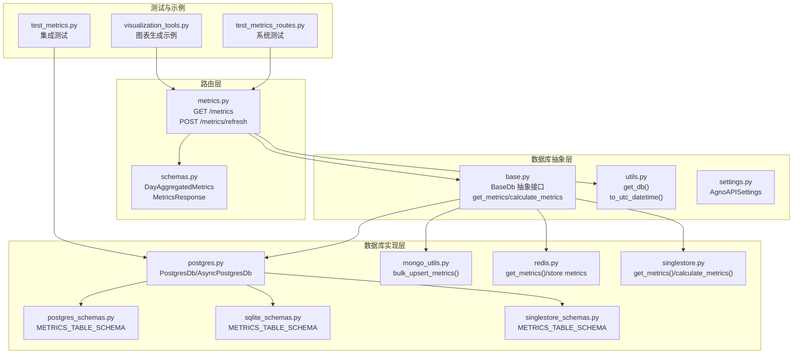
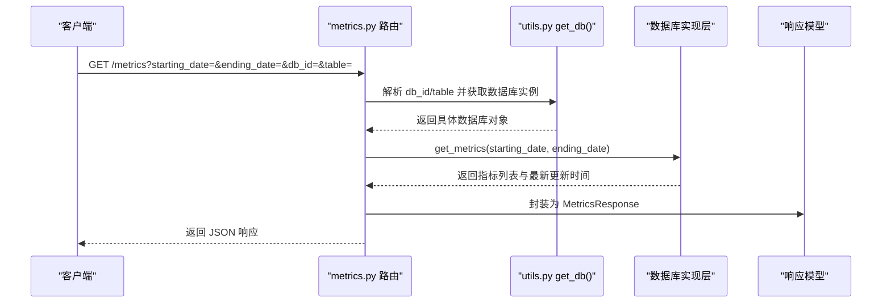
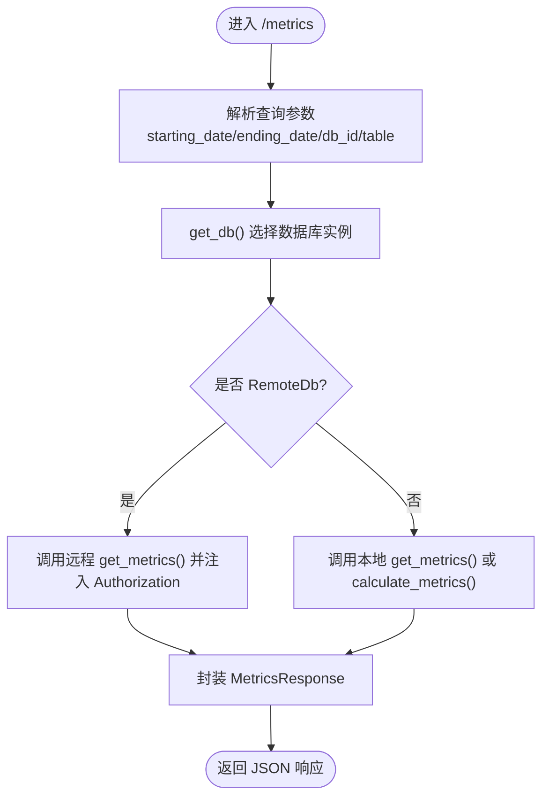
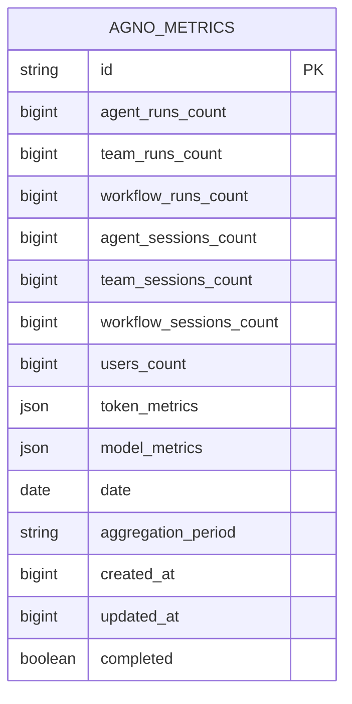
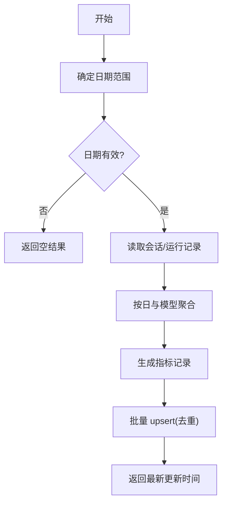
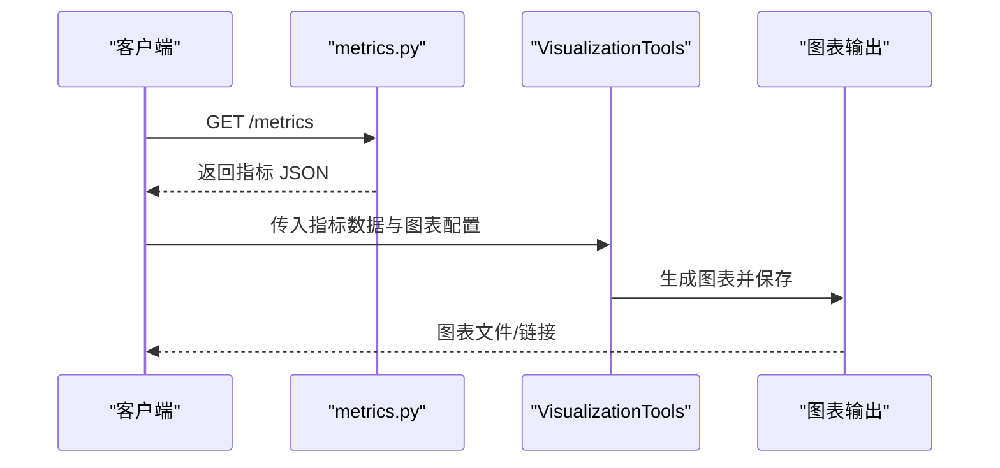
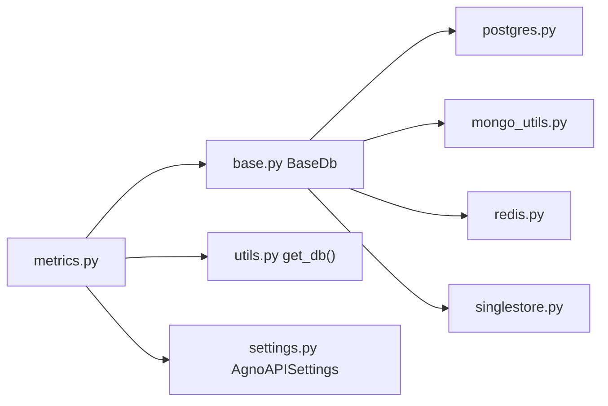

# 模型指标监控

<cite>
**本文引用的文件**
- [metrics.py](file://libs/agno/agno/os/routers/metrics/metrics.py)
- [schemas.py](file://libs/agno/agno/os/routers/metrics/schemas.py)
- [base.py](file://libs/agno/agno/db/base.py)
- [utils.py](file://libs/agno/agno/os/utils.py)
- [settings.py](file://libs/agno/agno/os/settings.py)
- [postgres.py](file://libs/agno/agno/db/postgres/__init__.py)
- [postgres_schemas.py](file://libs/agno/agno/db/postgres/schemas.py)
- [sqlite_schemas.py](file://libs/agno/agno/db/sqlite/schemas.py)
- [singlestore_schemas.py](file://libs/agno/agno/db/singlestore/schemas.py)
- [mongo_utils.py](file://libs/agno/agno/db/mongo/utils.py)
- [redis.py](file://libs/agno/agno/db/redis/redis.py)
- [singlestore.py](file://libs/agno/agno/db/singlestore/singlestore.py)
- [test_metrics_routes.py](file://libs/agno/tests/system/tests/test_metrics_routes.py)
- [test_metrics.py](file://libs/agno/tests/integration/db/postgres/test_metrics.py)
- [visualization_tools.py](file://cookbook/91_tools/visualization_tools.py)
- [visualization_tools.md](file://cookbook/91_tools/visualization_tools.md)
</cite>

## 目录
1. [简介](#简介)
2. [项目结构](#项目结构)
3. [核心组件](#核心组件)
4. [架构总览](#架构总览)
5. [详细组件分析](#详细组件分析)
6. [依赖分析](#依赖分析)
7. [性能考虑](#性能考虑)
8. [故障排除指南](#故障排除指南)
9. [结论](#结论)
10. [附录](#附录)

## 简介
本文件面向 Agno Learn 的“模型指标监控”子系统，系统性梳理了指标采集、聚合、存储、查询与可视化的完整链路，并结合测试用例与数据库模式定义，给出可操作的配置与运维建议。重点覆盖以下方面：
- 关键指标：日级运行次数（Agent/Team/Workflow）、会话次数、用户数、Token 使用（输入/输出/缓存/推理等）、按模型分组的调用统计
- 采集与聚合：基于会话与运行记录的聚合计算，支持按日期范围过滤
- 存储与查询：多数据库后端（PostgreSQL、SQLite、SingleStore、MongoDB、Redis）的指标表结构与索引设计
- 可视化与仪表板：基于内置可视化工具生成图表，支撑实时监控与趋势分析
- 最佳实践：采样策略、聚合方法、异常检测与告警配置建议

## 项目结构
围绕指标监控的关键代码分布在如下模块：
- 路由层：FastAPI 路由与响应模型，提供指标查询与刷新接口
- 数据库抽象层：统一的指标接口定义与多数据库适配
- 数据库实现层：PostgreSQL、SQLite、SingleStore、MongoDB、Redis 的指标表结构与 CRUD
- 工具与实用函数：数据库选择、UTC 时间转换、认证头注入
- 测试与示例：系统测试与可视化示例

**图示来源**
- [metrics.py:25-206](file://libs/agno/agno/os/routers/metrics/metrics.py#L25-L206)
- [schemas.py:9-52](file://libs/agno/agno/os/routers/metrics/schemas.py#L9-L52)
- [base.py:279-291](file://libs/agno/agno/db/base.py#L279-L291)
- [utils.py:202-269](file://libs/agno/agno/os/utils.py#L202-L269)
- [settings.py:9-47](file://libs/agno/agno/os/settings.py#L9-L47)
- [postgres.py:1-5](file://libs/agno/agno/db/postgres/__init__.py#L1-L5)
- [postgres_schemas.py:74-96](file://libs/agno/agno/db/postgres/schemas.py#L74-L96)
- [sqlite_schemas.py:74-96](file://libs/agno/agno/db/sqlite/schemas.py#L74-L96)
- [singlestore_schemas.py:73-89](file://libs/agno/agno/db/singlestore/schemas.py#L73-L89)
- [mongo_utils.py:186-218](file://libs/agno/agno/db/mongo/utils.py#L186-L218)
- [redis.py:1180-1198](file://libs/agno/agno/db/redis/redis.py#L1180-L1198)
- [singlestore.py:1771-1801](file://libs/agno/agno/db/singlestore/singlestore.py#L1771-L1801)
- [test_metrics_routes.py:73-185](file://libs/agno/tests/system/tests/test_metrics_routes.py#L73-L185)
- [test_metrics.py:198-228](file://libs/agno/tests/integration/db/postgres/test_metrics.py#L198-L228)
- [visualization_tools.py:38-272](file://cookbook/91_tools/visualization_tools.py#L38-L272)

**章节来源**
- [metrics.py:25-206](file://libs/agno/agno/os/routers/metrics/metrics.py#L25-L206)
- [schemas.py:9-52](file://libs/agno/agno/os/routers/metrics/schemas.py#L9-L52)
- [base.py:279-291](file://libs/agno/agno/db/base.py#L279-L291)
- [utils.py:202-269](file://libs/agno/agno/os/utils.py#L202-L269)
- [settings.py:9-47](file://libs/agno/agno/os/settings.py#L9-L47)

## 核心组件
- 指标路由与响应模型
  - 路由：提供 GET /metrics 查询与 POST /metrics/refresh 刷新两个接口；支持起止日期过滤、数据库与表选择参数
  - 响应模型：DayAggregatedMetrics 表示单日聚合指标，MetricsResponse 包含指标列表与最新更新时间
- 数据库抽象接口
  - BaseDb 定义 get_metrics(starting_date, ending_date) 与 calculate_metrics() 两个核心方法
- 数据库实现
  - PostgreSQL/SQLite/SingleStore：定义指标表结构与索引，支持按日期与聚合周期查询
  - MongoDB：提供批量 upsert 指标记录的工具方法
  - Redis：提供指标存储与检索
- 工具与实用函数
  - get_db()：根据 db_id 与 table 动态选择数据库实例
  - to_utc_datetime()：统一时间格式处理
  - 认证：从请求中提取 Authorization 头并传递给远程数据库

**章节来源**
- [metrics.py:95-128](file://libs/agno/agno/os/routers/metrics/metrics.py#L95-L128)
- [schemas.py:9-52](file://libs/agno/agno/os/routers/metrics/schemas.py#L9-L52)
- [base.py:279-291](file://libs/agno/agno/db/base.py#L279-L291)
- [utils.py:202-269](file://libs/agno/agno/os/utils.py#L202-L269)

## 架构总览
下图展示了指标监控系统的端到端流程：客户端请求经路由层进入，动态选择数据库后端执行查询或计算，返回聚合指标。

**图示来源**
- [metrics.py:95-128](file://libs/agno/agno/os/routers/metrics/metrics.py#L95-L128)
- [utils.py:202-269](file://libs/agno/agno/os/utils.py#L202-L269)

## 详细组件分析

### 路由与响应模型
- GET /metrics
  - 支持查询参数：starting_date、ending_date、db_id、table
  - 对于远程数据库，自动注入 Authorization 头
  - 返回 MetricsResponse，包含指标数组与 updated_at
- POST /metrics/refresh
  - 手动触发指标重新计算，适用于维护后或需要即时更新的场景

**图示来源**
- [metrics.py:95-128](file://libs/agno/agno/os/routers/metrics/metrics.py#L95-L128)
- [metrics.py:179-203](file://libs/agno/agno/os/routers/metrics/metrics.py#L179-L203)

**章节来源**
- [metrics.py:95-128](file://libs/agno/agno/os/routers/metrics/metrics.py#L95-L128)
- [metrics.py:179-203](file://libs/agno/agno/os/routers/metrics/metrics.py#L179-L203)
- [schemas.py:49-52](file://libs/agno/agno/os/routers/metrics/schemas.py#L49-L52)

### 数据库抽象与实现
- 抽象接口
  - BaseDb.get_metrics(starting_date, ending_date)：返回指标列表与最新更新时间戳
  - BaseDb.calculate_metrics()：触发指标重算
- PostgreSQL/SQLite/SingleStore
  - 指标表字段：运行次数、会话次数、用户数、Token 指标、模型指标、日期、聚合周期、时间戳、完成标记
  - 索引：date 字段与 (date, aggregation_period) 复合索引，提升范围查询效率
- MongoDB
  - bulk_upsert_metrics：按日期与聚合周期去重 upsert，避免重复写入
- Redis
  - 提供指标存储与检索能力，适合高频读取场景
- SingleStore
  - 支持批量 upsert 与条件更新，保证幂等性

**图示来源**
- [postgres_schemas.py:74-96](file://libs/agno/agno/db/postgres/schemas.py#L74-L96)
- [sqlite_schemas.py:74-96](file://libs/agno/agno/db/sqlite/schemas.py#L74-L96)
- [singlestore_schemas.py:73-89](file://libs/agno/agno/db/singlestore/schemas.py#L73-L89)

**章节来源**
- [base.py:279-291](file://libs/agno/agno/db/base.py#L279-L291)
- [postgres_schemas.py:74-96](file://libs/agno/agno/db/postgres/schemas.py#L74-L96)
- [sqlite_schemas.py:74-96](file://libs/agno/agno/db/sqlite/schemas.py#L74-L96)
- [singlestore_schemas.py:73-89](file://libs/agno/agno/db/singlestore/schemas.py#L73-L89)
- [mongo_utils.py:186-218](file://libs/agno/agno/db/mongo/utils.py#L186-L218)
- [redis.py:1180-1198](file://libs/agno/agno/db/redis/redis.py#L1180-L1198)
- [singlestore.py:1771-1801](file://libs/agno/agno/db/singlestore/singlestore.py#L1771-L1801)

### 数据采集与聚合逻辑
- 采集来源：会话与运行记录（Agent/Team/Workflow）
- 聚合粒度：按自然日与聚合周期（如日、周、月）进行汇总
- 日期范围：支持 starting_date 与 ending_date 过滤，无效范围返回空结果
- 批量写入：MongoDB 与 SingleStore 提供批量 upsert，减少写放大

**图示来源**
- [mongo_utils.py:177-183](file://libs/agno/agno/db/mongo/utils.py#L177-L183)
- [mongo_utils.py:186-218](file://libs/agno/agno/db/mongo/utils.py#L186-L218)
- [singlestore.py:1763-1770](file://libs/agno/agno/db/singlestore/singlestore.py#L1763-L1770)

**章节来源**
- [mongo_utils.py:177-183](file://libs/agno/agno/db/mongo/utils.py#L177-L183)
- [mongo_utils.py:186-218](file://libs/agno/agno/db/mongo/utils.py#L186-L218)
- [singlestore.py:1763-1770](file://libs/agno/agno/db/singlestore/singlestore.py#L1763-L1770)

### 存储与查询机制
- PostgreSQL/SQLite/SingleStore
  - 表结构一致，均包含日期索引与复合索引，支持高效范围查询
  - created_at/updated_at 字段用于审计与一致性校验
- MongoDB
  - 以 replace_one 按 (date, aggregation_period) 去重，避免重复
- Redis
  - 采用键空间存储指标，适合高并发读取与短期缓存
- 查询路径
  - 路由层传入日期范围，数据库层按索引过滤，返回聚合结果

**章节来源**
- [postgres_schemas.py:74-96](file://libs/agno/agno/db/postgres/schemas.py#L74-L96)
- [sqlite_schemas.py:74-96](file://libs/agno/agno/db/sqlite/schemas.py#L74-L96)
- [singlestore_schemas.py:73-89](file://libs/agno/agno/db/singlestore/schemas.py#L73-L89)
- [redis.py:1180-1198](file://libs/agno/agno/db/redis/redis.py#L1180-L1198)

### 指标仪表板与可视化
- 可视化工具
  - 提供多种图表类型（柱状、折线、散点、饼图、直方图），支持输出目录与标题/标签定制
- 与指标联动
  - 可直接将 /metrics 接口返回的指标序列化为图表数据，生成趋势与分布类图表
- 示例
  - 销售业绩、市场份额、收入增长、客户满意度与销售关系、评分分布等

**图示来源**
- [visualization_tools.py:38-272](file://cookbook/91_tools/visualization_tools.py#L38-L272)

**章节来源**
- [visualization_tools.py:38-272](file://cookbook/91_tools/visualization_tools.py#L38-L272)
- [visualization_tools.md:1-55](file://cookbook/91_tools/visualization_tools.md#L1-L55)

### 指标分析应用场景
- 性能优化
  - 通过 Token 指标与模型调用统计，识别高消耗模型与长上下文场景，指导模型切换与提示词优化
- 成本控制
  - 按模型维度拆分输入/输出 Token 成本，结合调用量制定预算与限额
- 容量规划
  - 日级运行次数与会话趋势预测峰值，评估数据库与缓存容量需求

[本节为概念性说明，不直接分析具体文件]

## 依赖分析
- 路由层依赖数据库抽象层与工具函数，实现跨数据库的一致行为
- 数据库实现层遵循统一接口，确保在不同后端上具备相同的查询与计算能力
- 认证与授权通过设置与中间件注入，保障远程数据库访问安全

**图示来源**
- [metrics.py:25-206](file://libs/agno/agno/os/routers/metrics/metrics.py#L25-L206)
- [base.py:279-291](file://libs/agno/agno/db/base.py#L279-L291)
- [utils.py:202-269](file://libs/agno/agno/os/utils.py#L202-L269)
- [settings.py:9-47](file://libs/agno/agno/os/settings.py#L9-L47)

**章节来源**
- [metrics.py:25-206](file://libs/agno/agno/os/routers/metrics/metrics.py#L25-L206)
- [base.py:279-291](file://libs/agno/agno/db/base.py#L279-L291)
- [utils.py:202-269](file://libs/agno/agno/os/utils.py#L202-L269)
- [settings.py:9-47](file://libs/agno/agno/os/settings.py#L9-L47)

## 性能考虑
- 查询性能
  - 指标表对 date 与 (date, aggregation_period) 建立索引，建议优先按日期范围过滤
  - 对于 PostgreSQL/SQLite/SingleStore，尽量使用日期边界参数，避免全表扫描
- 写入性能
  - MongoDB/SingleStore 使用批量 upsert，减少网络往返与重复写入
  - Redis 适合高频读取场景，但需注意过期策略与内存占用
- 时间处理
  - 统一使用 UTC 时间，避免时区差异导致的查询偏差

[本节为通用性能建议，不直接分析具体文件]

## 故障排除指南
- 常见问题
  - 无效日期范围：结束日期早于开始日期时返回空结果，检查查询参数
  - 多数据库未指定 db_id：当存在多个数据库实例时必须提供 db_id
  - 表不存在：当指定 table 但未配置对应数据库时抛出 404
- 排查步骤
  - 确认 /metrics 查询参数：starting_date、ending_date、db_id、table
  - 检查数据库连接与表是否存在
  - 查看路由层异常处理返回的错误详情
- 单元与集成测试参考
  - 系统测试覆盖 GET /metrics 的结构与日期范围过滤
  - 集成测试验证插入会话、计算指标、查询指标的完整流程

**章节来源**
- [test_metrics_routes.py:73-185](file://libs/agno/tests/system/tests/test_metrics_routes.py#L73-L185)
- [test_metrics.py:198-228](file://libs/agno/tests/integration/db/postgres/test_metrics.py#L198-L228)
- [utils.py:202-269](file://libs/agno/agno/os/utils.py#L202-L269)

## 结论
Agno Learn 的指标监控体系以统一的数据库抽象为核心，配合多后端实现与标准化的指标模型，实现了从采集、聚合到查询与可视化的闭环。通过合理的索引设计与批量写入策略，系统在保证查询性能的同时具备良好的扩展性。结合可视化工具与测试用例，开发者可以快速搭建生产可用的模型性能监控体系。

[本节为总结性内容，不直接分析具体文件]

## 附录

### 指标字段说明
- 运行次数：agent_runs_count、team_runs_count、workflow_runs_count
- 会话次数：agent_sessions_count、team_sessions_count、workflow_sessions_count
- 用户数：users_count
- Token 指标：token_metrics（输入/输出/缓存/音频/推理等）
- 模型指标：model_metrics（按模型与提供商分组的调用次数）

**章节来源**
- [schemas.py:9-47](file://libs/agno/agno/os/routers/metrics/schemas.py#L9-L47)

### 配置指南
- 认证与授权
  - 通过 AgnoAPISettings 设置安全密钥与 JWT 开关
  - 远程数据库调用时自动注入 Authorization 头
- 数据库选择
  - 使用 db_id 与 table 参数定位目标数据库与表
- CORS 与文档
  - 可通过设置启用/禁用文档服务与 CORS 源列表

**章节来源**
- [settings.py:9-47](file://libs/agno/agno/os/settings.py#L9-L47)
- [metrics.py:95-128](file://libs/agno/agno/os/routers/metrics/metrics.py#L95-L128)
- [utils.py:202-269](file://libs/agno/agno/os/utils.py#L202-L269)