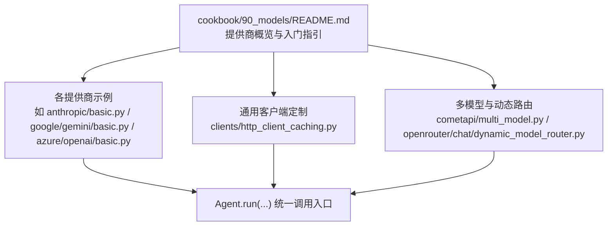
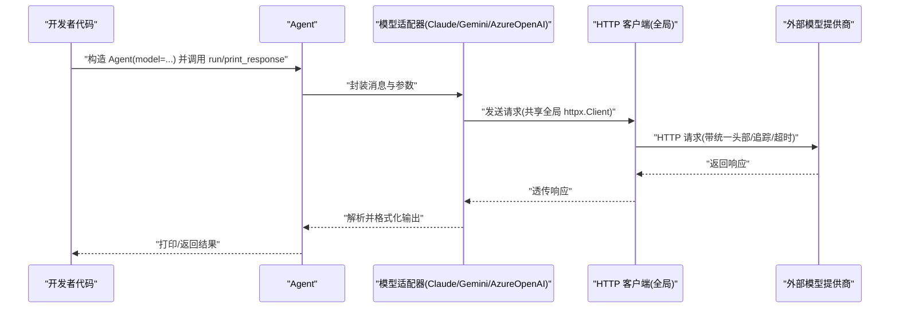
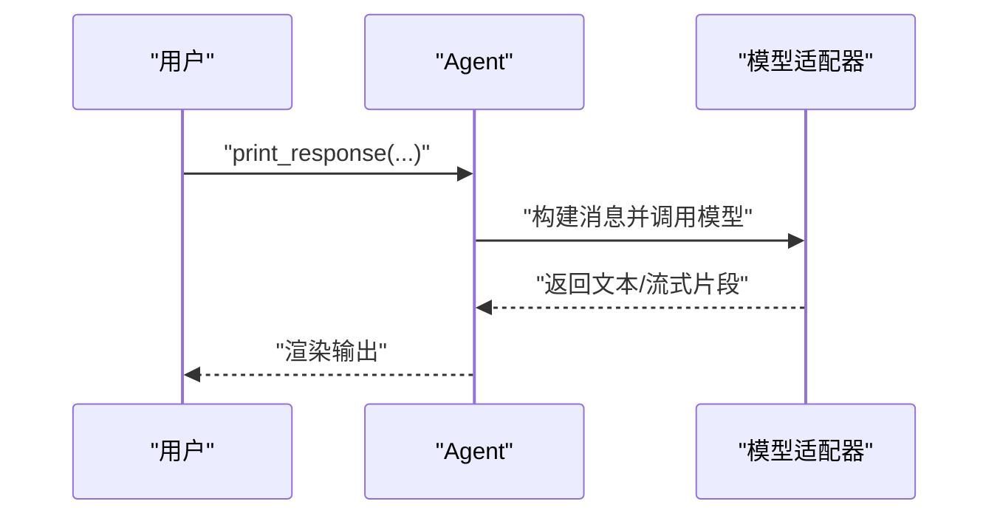
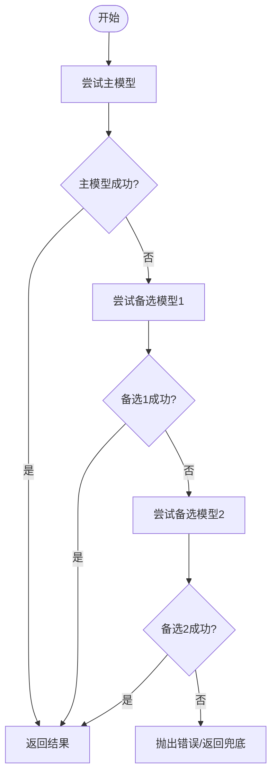
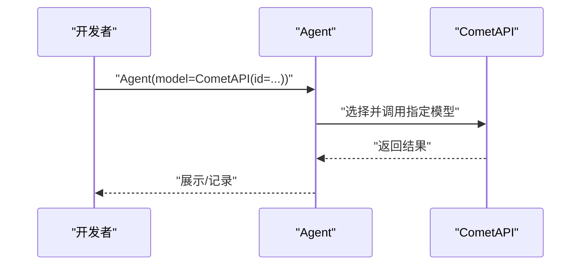
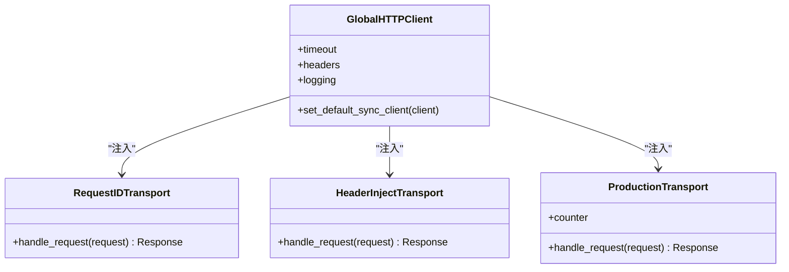
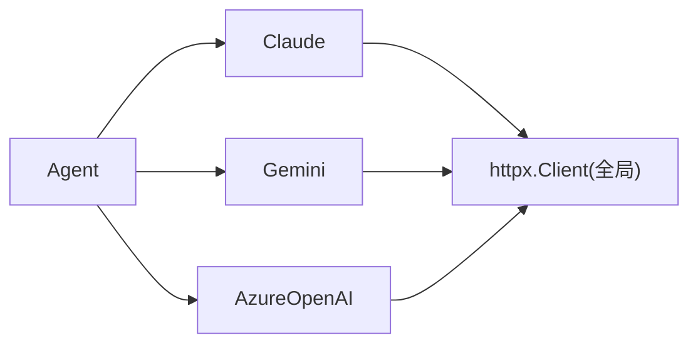

# 模型适配器

<cite>
**本文引用的文件**
- [cookbook/90_models/README.md](file://cookbook/90_models/README.md)
- [cookbook/90_models/clients/http_client_caching.py](file://cookbook/90_models/clients/http_client_caching.py)
- [cookbook/90_models/cometapi/multi_model.py](file://cookbook/90_models/cometapi/multi_model.py)
- [cookbook/90_models/openrouter/chat/dynamic_model_router.py](file://cookbook/90_models/openrouter/chat/dynamic_model_router.py)
- [cookbook/90_models/anthropic/basic.py](file://cookbook/90_models/anthropic/basic.py)
- [cookbook/90_models/google/gemini/basic.py](file://cookbook/90_models/google/gemini/basic.py)
- [cookbook/90_models/azure/openai/basic.py](file://cookbook/90_models/azure/openai/basic.py)
</cite>

## 目录
1. [简介](#简介)
2. [项目结构](#项目结构)
3. [核心组件](#核心组件)
4. [架构总览](#架构总览)
5. [详细组件分析](#详细组件分析)
6. [依赖关系分析](#依赖关系分析)
7. [性能考量](#性能考量)
8. [故障排查指南](#故障排查指南)
9. [结论](#结论)
10. [附录](#附录)

## 简介
本文件面向 Agno Learn 的“模型适配器”体系，系统化梳理其设计理念、架构原理与实现机制，覆盖以下主题：
- 模型抽象与接口统一：如何通过统一的模型接口屏蔽不同提供商的差异，使上层 Agent 调用一致。
- 配置管理：API 密钥、基础地址、超时、重试等参数的集中管理与环境变量注入。
- 多模型支持：动态路由、多模型回退、负载均衡与性能优化策略。
- 扩展方法：如何接入新模型提供商或第三方模型服务。
- 实战示例：OpenAI、Anthropic、Google、Azure 等主流提供商的集成步骤与最佳实践。

## 项目结构
Agno Learn 将“模型适配器”的示例与最佳实践集中在 cookbook/90_models 目录下，按提供商分层组织，并提供通用客户端定制与多模型演示。

图表来源
- [cookbook/90_models/README.md:1-42](file://cookbook/90_models/README.md#L1-L42)
- [cookbook/90_models/anthropic/basic.py:1-39](file://cookbook/90_models/anthropic/basic.py#L1-L39)
- [cookbook/90_models/google/gemini/basic.py:1-39](file://cookbook/90_models/google/gemini/basic.py#L1-L39)
- [cookbook/90_models/azure/openai/basic.py:1-41](file://cookbook/90_models/azure/openai/basic.py#L1-L41)
- [cookbook/90_models/clients/http_client_caching.py:1-169](file://cookbook/90_models/clients/http_client_caching.py#L1-L169)
- [cookbook/90_models/cometapi/multi_model.py:1-62](file://cookbook/90_models/cometapi/multi_model.py#L1-L62)
- [cookbook/90_models/openrouter/chat/dynamic_model_router.py:1-46](file://cookbook/90_models/openrouter/chat/dynamic_model_router.py#L1-L46)

章节来源
- [cookbook/90_models/README.md:1-42](file://cookbook/90_models/README.md#L1-L42)

## 核心组件
- 模型抽象与统一接口
  - 上层 Agent 通过统一的 model 参数传入具体模型实例（如 Claude、Gemini、AzureOpenAI），内部统一封装请求构建、发送与响应解析流程。
  - 示例路径：[cookbook/90_models/anthropic/basic.py:16](file://cookbook/90_models/anthropic/basic.py#L16)，[cookbook/90_models/google/gemini/basic.py:16](file://cookbook/90_models/google/gemini/basic.py#L16)，[cookbook/90_models/azure/openai/basic.py:16](file://cookbook/90_models/azure/openai/basic.py#L16)

- 配置管理
  - API 密钥与基础地址：通过环境变量或显式参数注入（如 OPENAI_API_KEY、ANTHROPIC_API_KEY、GOOGLE_API_KEY、AZURE_* 等）。
  - 超时与重试：可在模型初始化或全局 HTTP 客户端中配置。
  - 示例路径：[cookbook/90_models/README.md:9-18](file://cookbook/90_models/README.md#L9-L18)

- 多模型支持
  - 动态路由与回退：OpenRouter 支持在多个模型间自动切换，提升可用性与稳定性。
  - 多模型聚合：CometAPI 可直接测试多家提供商的模型，便于横向对比。
  - 示例路径：[cookbook/90_models/openrouter/chat/dynamic_model_router.py:20-35](file://cookbook/90_models/openrouter/chat/dynamic_model_router.py#L20-L35)，[cookbook/90_models/cometapi/multi_model.py:32-47](file://cookbook/90_models/cometapi/multi_model.py#L32-L47)

- 通用客户端定制
  - 全局 HTTP 客户端：通过 set_default_sync_client 注入统一的 httpx.Client，实现日志、请求头、追踪 ID、超时与错误处理的一致化。
  - 示例路径：[cookbook/90_models/clients/http_client_caching.py:24](file://cookbook/90_models/clients/http_client_caching.py#L24)，[cookbook/90_models/clients/http_client_caching.py:58-62](file://cookbook/90_models/clients/http_client_caching.py#L58-L62)，[cookbook/90_models/clients/http_client_caching.py:92-96](file://cookbook/90_models/clients/http_client_caching.py#L92-L96)，[cookbook/90_models/clients/http_client_caching.py:148-152](file://cookbook/90_models/clients/http_client_caching.py#L148-L152)

章节来源
- [cookbook/90_models/anthropic/basic.py:16](file://cookbook/90_models/anthropic/basic.py#L16)
- [cookbook/90_models/google/gemini/basic.py:16](file://cookbook/90_models/google/gemini/basic.py#L16)
- [cookbook/90_models/azure/openai/basic.py:16](file://cookbook/90_models/azure/openai/basic.py#L16)
- [cookbook/90_models/README.md:9-18](file://cookbook/90_models/README.md#L9-L18)
- [cookbook/90_models/openrouter/chat/dynamic_model_router.py:20-35](file://cookbook/90_models/openrouter/chat/dynamic_model_router.py#L20-L35)
- [cookbook/90_models/cometapi/multi_model.py:32-47](file://cookbook/90_models/cometapi/multi_model.py#L32-L47)
- [cookbook/90_models/clients/http_client_caching.py:24](file://cookbook/90_models/clients/http_client_caching.py#L24)

## 架构总览
下图展示了从 Agent 到模型适配器再到各提供商的调用链路，以及通用客户端定制对所有模型的影响。

图表来源
- [cookbook/90_models/anthropic/basic.py:16](file://cookbook/90_models/anthropic/basic.py#L16)
- [cookbook/90_models/google/gemini/basic.py:16](file://cookbook/90_models/google/gemini/basic.py#L16)
- [cookbook/90_models/azure/openai/basic.py:16](file://cookbook/90_models/azure/openai/basic.py#L16)
- [cookbook/90_models/clients/http_client_caching.py:24](file://cookbook/90_models/clients/http_client_caching.py#L24)

## 详细组件分析

### 组件 A：统一模型接口与基础用法
- 设计要点
  - Agent 仅关心 model=id 或 model=ModelClass(...)，不感知底层提供商差异。
  - 同步/异步、流式/非流式均通过统一方法族支持。
- 关键路径
  - [cookbook/90_models/anthropic/basic.py:16](file://cookbook/90_models/anthropic/basic.py#L16)
  - [cookbook/90_models/google/gemini/basic.py:16](file://cookbook/90_models/google/gemini/basic.py#L16)
  - [cookbook/90_models/azure/openai/basic.py:16](file://cookbook/90_models/azure/openai/basic.py#L16)

图表来源
- [cookbook/90_models/anthropic/basic.py:28-39](file://cookbook/90_models/anthropic/basic.py#L28-L39)
- [cookbook/90_models/google/gemini/basic.py:28-39](file://cookbook/90_models/google/gemini/basic.py#L28-L39)
- [cookbook/90_models/azure/openai/basic.py:28-41](file://cookbook/90_models/azure/openai/basic.py#L28-L41)

章节来源
- [cookbook/90_models/anthropic/basic.py:16-39](file://cookbook/90_models/anthropic/basic.py#L16-L39)
- [cookbook/90_models/google/gemini/basic.py:16-39](file://cookbook/90_models/google/gemini/basic.py#L16-L39)
- [cookbook/90_models/azure/openai/basic.py:16-41](file://cookbook/90_models/azure/openai/basic.py#L16-L41)

### 组件 B：动态模型路由与多模型回退
- 设计要点
  - OpenRouter 提供“主模型 + 备选模型”的动态路由能力，在主模型受限时自动回退。
  - 适合高可用场景：避免单点失败导致整体不可用。
- 关键路径
  - [cookbook/90_models/openrouter/chat/dynamic_model_router.py:20-35](file://cookbook/90_models/openrouter/chat/dynamic_model_router.py#L20-L35)

图表来源
- [cookbook/90_models/openrouter/chat/dynamic_model_router.py:20-35](file://cookbook/90_models/openrouter/chat/dynamic_model_router.py#L20-L35)

章节来源
- [cookbook/90_models/openrouter/chat/dynamic_model_router.py:1-46](file://cookbook/90_models/openrouter/chat/dynamic_model_router.py#L1-L46)

### 组件 C：多模型聚合与横向对比
- 设计要点
  - 通过单一入口访问多家提供商的模型，便于快速对比性能、质量与成本。
- 关键路径
  - [cookbook/90_models/cometapi/multi_model.py:32-47](file://cookbook/90_models/cometapi/multi_model.py#L32-L47)

图表来源
- [cookbook/90_models/cometapi/multi_model.py:20](file://cookbook/90_models/cometapi/multi_model.py#L20)
- [cookbook/90_models/cometapi/multi_model.py:32-47](file://cookbook/90_models/cometapi/multi_model.py#L32-L47)

章节来源
- [cookbook/90_models/cometapi/multi_model.py:1-62](file://cookbook/90_models/cometapi/multi_model.py#L1-L62)

### 组件 D：通用 HTTP 客户端定制
- 设计要点
  - 通过 set_default_sync_client 注入全局 httpx.Client，统一实现：
    - 请求头注入（如公司标识、版本、时间戳）
    - 请求 ID 追踪（X-Request-ID、X-Request-Number）
    - 日志与错误处理
    - 超时控制
- 关键路径
  - [cookbook/90_models/clients/http_client_caching.py:24](file://cookbook/90_models/clients/http_client_caching.py#L24)
  - [cookbook/90_models/clients/http_client_caching.py:58-62](file://cookbook/90_models/clients/http_client_caching.py#L58-L62)
  - [cookbook/90_models/clients/http_client_caching.py:92-96](file://cookbook/90_models/clients/http_client_caching.py#L92-L96)
  - [cookbook/90_models/clients/http_client_caching.py:148-152](file://cookbook/90_models/clients/http_client_caching.py#L148-L152)

图表来源
- [cookbook/90_models/clients/http_client_caching.py:44-56](file://cookbook/90_models/clients/http_client_caching.py#L44-L56)
- [cookbook/90_models/clients/http_client_caching.py:72-82](file://cookbook/90_models/clients/http_client_caching.py#L72-L82)
- [cookbook/90_models/clients/http_client_caching.py:108-146](file://cookbook/90_models/clients/http_client_caching.py#L108-L146)

章节来源
- [cookbook/90_models/clients/http_client_caching.py:1-169](file://cookbook/90_models/clients/http_client_caching.py#L1-L169)

## 依赖关系分析
- 组件耦合与内聚
  - Agent 与模型适配器：低耦合，通过统一接口交互；高内聚于各自提供商的适配逻辑。
  - 通用客户端：对所有模型适配器透明生效，提升可观测性与一致性。
- 外部依赖与集成点
  - 各大模型提供商 SDK/HTTP 接口（OpenAI、Anthropic、Google、Azure 等）。
  - httpx 作为统一 HTTP 客户端库。
- 潜在循环依赖
  - 当前示例未见循环导入；若自行扩展，请确保模型类与工具模块解耦。

图表来源
- [cookbook/90_models/anthropic/basic.py:16](file://cookbook/90_models/anthropic/basic.py#L16)
- [cookbook/90_models/google/gemini/basic.py:16](file://cookbook/90_models/google/gemini/basic.py#L16)
- [cookbook/90_models/azure/openai/basic.py:16](file://cookbook/90_models/azure/openai/basic.py#L16)
- [cookbook/90_models/clients/http_client_caching.py:24](file://cookbook/90_models/clients/http_client_caching.py#L24)

章节来源
- [cookbook/90_models/anthropic/basic.py:16](file://cookbook/90_models/anthropic/basic.py#L16)
- [cookbook/90_models/google/gemini/basic.py:16](file://cookbook/90_models/google/gemini/basic.py#L16)
- [cookbook/90_models/azure/openai/basic.py:16](file://cookbook/90_models/azure/openai/basic.py#L16)
- [cookbook/90_models/clients/http_client_caching.py:24](file://cookbook/90_models/clients/http_client_caching.py#L24)

## 性能考量
- 延迟与吞吐
  - 使用统一 HTTP 客户端可减少连接开销，建议在生产环境启用连接池与合理的超时配置。
- 可用性与弹性
  - 采用动态路由与多模型回退，降低主模型限流/故障带来的影响。
- 成本控制
  - 通过多模型聚合进行横向对比，结合输出质量与单价评估，选择性价比最优模型。
- 观测性
  - 通过请求 ID 与统一日志，定位慢请求与错误根因。

## 故障排查指南
- 常见问题与定位
  - API 密钥无效或缺失：检查环境变量是否正确设置，参考 [cookbook/90_models/README.md:28-29](file://cookbook/90_models/README.md#L28-L29)。
  - 超时/网络异常：调整全局 httpx.Client 的超时参数，参考 [cookbook/90_models/clients/http_client_caching.py:60](file://cookbook/90_models/clients/http_client_caching.py#L60)、[cookbook/90_models/clients/http_client_caching.py:94](file://cookbook/90_models/clients/http_client_caching.py#L94)、[cookbook/90_models/clients/http_client_caching.py:150](file://cookbook/90_models/clients/http_client_caching.py#L150)。
  - 主模型不可用：启用动态路由或多模型回退，参考 [cookbook/90_models/openrouter/chat/dynamic_model_router.py:20-35](file://cookbook/90_models/openrouter/chat/dynamic_model_router.py#L20-L35)。
- 日志与追踪
  - 开启 DEBUG 级别日志，观察请求/响应状态码与请求 ID，参考 [cookbook/90_models/clients/http_client_caching.py:34-37](file://cookbook/90_models/clients/http_client_caching.py#L34-L37)、[cookbook/90_models/clients/http_client_caching.py:131-145](file://cookbook/90_models/clients/http_client_caching.py#L131-L145)。

章节来源
- [cookbook/90_models/README.md:28-29](file://cookbook/90_models/README.md#L28-L29)
- [cookbook/90_models/clients/http_client_caching.py:34-37](file://cookbook/90_models/clients/http_client_caching.py#L34-L37)
- [cookbook/90_models/clients/http_client_caching.py:60](file://cookbook/90_models/clients/http_client_caching.py#L60)
- [cookbook/90_models/clients/http_client_caching.py:94](file://cookbook/90_models/clients/http_client_caching.py#L94)
- [cookbook/90_models/clients/http_client_caching.py:131-145](file://cookbook/90_models/clients/http_client_caching.py#L131-L145)
- [cookbook/90_models/clients/http_client_caching.py:150](file://cookbook/90_models/clients/http_client_caching.py#L150)
- [cookbook/90_models/openrouter/chat/dynamic_model_router.py:20-35](file://cookbook/90_models/openrouter/chat/dynamic_model_router.py#L20-L35)

## 结论
Agno Learn 的模型适配器通过“统一接口 + 通用客户端 + 多模型策略”实现了对多提供商的高效抽象与工程化落地。开发者只需关注业务逻辑，即可在不同模型之间灵活切换、弹性扩展，并获得一致的可观测性与稳定性保障。

## 附录

### A. 主流模型提供商集成清单与配置要点
- OpenAI
  - 环境变量：OPENAI_API_KEY
  - 示例路径：[cookbook/90_models/README.md:9](file://cookbook/90_models/README.md#L9)
- Anthropic
  - 环境变量：ANTHROPIC_API_KEY
  - 示例路径：[cookbook/90_models/anthropic/basic.py:16](file://cookbook/90_models/anthropic/basic.py#L16)
- Google
  - 环境变量：GOOGLE_API_KEY
  - 示例路径：[cookbook/90_models/google/gemini/basic.py:16](file://cookbook/90_models/google/gemini/basic.py#L16)
- Azure OpenAI
  - 环境变量：AZURE_*（如 AZURE_OPENAI_API_KEY、AZURE_OPENAI_ENDPOINT 等）
  - 示例路径：[cookbook/90_models/azure/openai/basic.py:16](file://cookbook/90_models/azure/openai/basic.py#L16)
- 其他常见提供商
  - Groq、DeepSeek、Mistral、Cohere、Ollama、LM Studio、llama.cpp 等
  - 示例路径：[cookbook/90_models/README.md:14-20](file://cookbook/90_models/README.md#L14-L20)

章节来源
- [cookbook/90_models/README.md:9-20](file://cookbook/90_models/README.md#L9-L20)
- [cookbook/90_models/anthropic/basic.py:16](file://cookbook/90_models/anthropic/basic.py#L16)
- [cookbook/90_models/google/gemini/basic.py:16](file://cookbook/90_models/google/gemini/basic.py#L16)
- [cookbook/90_models/azure/openai/basic.py:16](file://cookbook/90_models/azure/openai/basic.py#L16)

### B. 配置管理最佳实践
- API 密钥管理
  - 使用环境变量注入，避免硬编码；在 CI/CD 中通过密钥管理服务注入。
  - 参考：[cookbook/90_models/README.md:28-29](file://cookbook/90_models/README.md#L28-L29)
- 超时与重试
  - 在全局 httpx.Client 中设置合理超时；必要时在模型层增加指数退避重试。
  - 参考：[cookbook/90_models/clients/http_client_caching.py:60](file://cookbook/90_models/clients/http_client_caching.py#L60)、[cookbook/90_models/clients/http_client_caching.py:94](file://cookbook/90_models/clients/http_client_caching.py#L94)、[cookbook/90_models/clients/http_client_caching.py:150](file://cookbook/90_models/clients/http_client_caching.py#L150)
- 请求追踪
  - 为每个请求注入唯一 ID，便于跨服务定位问题。
  - 参考：[cookbook/90_models/clients/http_client_caching.py:48](file://cookbook/90_models/clients/http_client_caching.py#L48)、[cookbook/90_models/clients/http_client_caching.py:119](file://cookbook/90_models/clients/http_client_caching.py#L119)

章节来源
- [cookbook/90_models/README.md:28-29](file://cookbook/90_models/README.md#L28-L29)
- [cookbook/90_models/clients/http_client_caching.py:48](file://cookbook/90_models/clients/http_client_caching.py#L48)
- [cookbook/90_models/clients/http_client_caching.py:60](file://cookbook/90_models/clients/http_client_caching.py#L60)
- [cookbook/90_models/clients/http_client_caching.py:94](file://cookbook/90_models/clients/http_client_caching.py#L94)
- [cookbook/90_models/clients/http_client_caching.py:119](file://cookbook/90_models/clients/http_client_caching.py#L119)
- [cookbook/90_models/clients/http_client_caching.py:150](file://cookbook/90_models/clients/http_client_caching.py#L150)

### C. 多模型支持与扩展方法
- 动态路由与回退
  - 使用 OpenRouter 的 models 列表实现主备切换。
  - 参考：[cookbook/90_models/openrouter/chat/dynamic_model_router.py:20-35](file://cookbook/90_models/openrouter/chat/dynamic_model_router.py#L20-L35)
- 多模型聚合
  - 通过 CometAPI 测试多家提供商模型，辅助选型与对比。
  - 参考：[cookbook/90_models/cometapi/multi_model.py:32-47](file://cookbook/90_models/cometapi/multi_model.py#L32-L47)
- 自定义模型集成
  - 建议遵循现有模型适配器模式：封装请求构建、发送、响应解析与错误处理；在统一接口下注册新模型类。
  - 参考：[cookbook/90_models/anthropic/basic.py:16](file://cookbook/90_models/anthropic/basic.py#L16)、[cookbook/90_models/google/gemini/basic.py:16](file://cookbook/90_models/google/gemini/basic.py#L16)、[cookbook/90_models/azure/openai/basic.py:16](file://cookbook/90_models/azure/openai/basic.py#L16)

章节来源
- [cookbook/90_models/openrouter/chat/dynamic_model_router.py:20-35](file://cookbook/90_models/openrouter/chat/dynamic_model_router.py#L20-L35)
- [cookbook/90_models/cometapi/multi_model.py:32-47](file://cookbook/90_models/cometapi/multi_model.py#L32-L47)
- [cookbook/90_models/anthropic/basic.py:16](file://cookbook/90_models/anthropic/basic.py#L16)
- [cookbook/90_models/google/gemini/basic.py:16](file://cookbook/90_models/google/gemini/basic.py#L16)
- [cookbook/90_models/azure/openai/basic.py:16](file://cookbook/90_models/azure/openai/basic.py#L16)