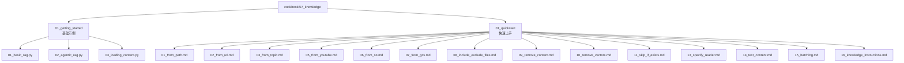
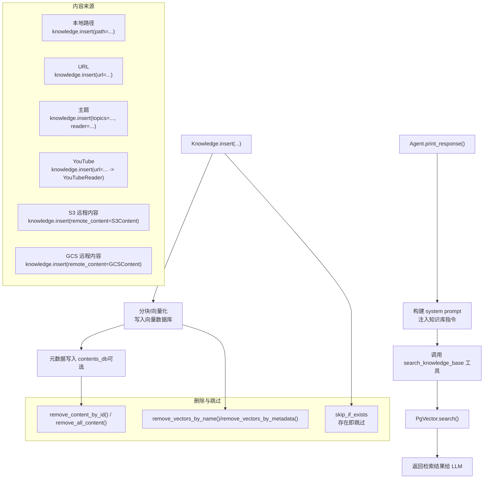
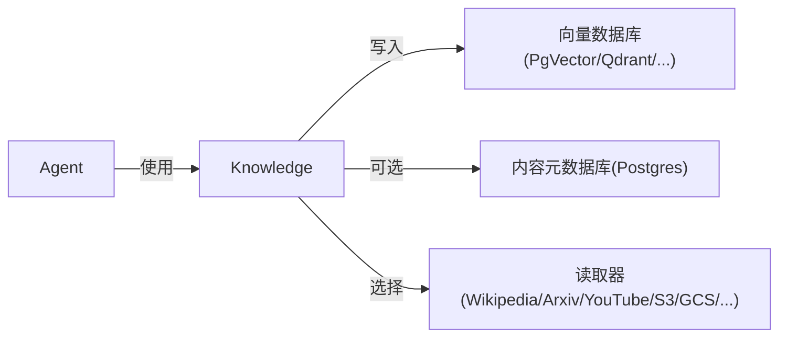

# 快速开始

<cite>
**本文引用的文件**
- [cookbook/README.md](file://cookbook/README.md)
- [cookbook/07_knowledge/01_getting_started/README.md](file://cookbook/07_knowledge/01_getting_started/README.md)
- [cookbook/07_knowledge/01_getting_started/01_basic_rag.py](file://cookbook/07_knowledge/01_getting_started/01_basic_rag.py)
- [cookbook/07_knowledge/01_getting_started/02_agentic_rag.py](file://cookbook/07_knowledge/01_getting_started/02_agentic_rag.py)
- [cookbook/07_knowledge/01_getting_started/03_loading_content.py](file://cookbook/07_knowledge/01_getting_started/03_loading_content.py)
- [cookbook/07_knowledge/01_quickstart/01_from_path.md](file://cookbook/07_knowledge/01_quickstart/01_from_path.md)
- [cookbook/07_knowledge/01_quickstart/02_from_url.md](file://cookbook/07_knowledge/01_quickstart/02_from_url.md)
- [cookbook/07_knowledge/01_quickstart/03_from_topic.md](file://cookbook/07_knowledge/01_quickstart/03_from_topic.md)
- [cookbook/07_knowledge/01_quickstart/05_from_youtube.md](file://cookbook/07_knowledge/01_quickstart/05_from_youtube.md)
- [cookbook/07_knowledge/01_quickstart/06_from_s3.md](file://cookbook/07_knowledge/01_quickstart/06_from_s3.md)
- [cookbook/07_knowledge/01_quickstart/07_from_gcs.md](file://cookbook/07_knowledge/01_quickstart/07_from_gcs.md)
- [cookbook/07_knowledge/01_quickstart/08_include_exclude_files.md](file://cookbook/07_knowledge/01_quickstart/08_include_exclude_files.md)
- [cookbook/07_knowledge/01_quickstart/09_remove_content.md](file://cookbook/07_knowledge/01_quickstart/09_remove_content.md)
- [cookbook/07_knowledge/01_quickstart/10_remove_vectors.md](file://cookbook/07_knowledge/01_quickstart/10_remove_vectors.md)
- [cookbook/07_knowledge/01_quickstart/11_skip_if_exists.md](file://cookbook/07_knowledge/01_quickstart/11_skip_if_exists.md)
- [cookbook/07_knowledge/01_quickstart/13_specify_reader.md](file://cookbook/07_knowledge/01_quickstart/13_specify_reader.md)
- [cookbook/07_knowledge/01_quickstart/14_text_content.md](file://cookbook/07_knowledge/01_quickstart/14_text_content.md)
- [cookbook/07_knowledge/01_quickstart/15_batching.md](file://cookbook/07_knowledge/01_quickstart/15_batching.md)
- [cookbook/07_knowledge/01_quickstart/16_knowledge_instructions.md](file://cookbook/07_knowledge/01_quickstart/16_knowledge_instructions.md)
</cite>

## 目录
1. [简介](#简介)
2. [项目结构](#项目结构)
3. [核心组件](#核心组件)
4. [架构总览](#架构总览)
5. [详细组件分析](#详细组件分析)
6. [依赖关系分析](#依赖关系分析)
7. [性能考虑](#性能考虑)
8. [故障排查指南](#故障排查指南)
9. [结论](#结论)
10. [附录](#附录)

## 简介
本章节面向首次接触知识管理系统的开发者，目标是帮助你在最短时间内完成“创建第一个知识库 → 加载文档内容 → 配置基础检索参数”的全流程。你将学会：
- 如何从本地路径、URL、主题、YouTube视频、云存储（S3/GCS）等多种来源加载内容
- 如何配置文件包含/排除规则、内容删除、向量删除、存在性跳过等核心能力
- 如何选择和配置文档读取器、处理文本内容、进行批量处理
- 如何设置知识库指令，让 Agent 在合适时机检索知识库

## 项目结构
知识管理系统的快速开始示例集中在 cookbook/07_knowledge/01_quickstart 与 01_getting_started 两个目录中，前者覆盖“从不同来源加载内容、删除与跳过”等实操，后者提供“基础 RAG 与智能体驱动 RAG”的入门示例。

图表来源
- [cookbook/07_knowledge/01_getting_started/README.md:10-17](file://cookbook/07_knowledge/01_getting_started/README.md#L10-L17)
- [cookbook/07_knowledge/01_quickstart/01_from_path.md:1-20](file://cookbook/07_knowledge/01_quickstart/01_from_path.md#L1-L20)

章节来源
- [cookbook/README.md:36-37](file://cookbook/README.md#L36-L37)
- [cookbook/07_knowledge/01_getting_started/README.md:10-17](file://cookbook/07_knowledge/01_getting_started/README.md#L10-L17)

## 核心组件
- 知识库 Knowledge：负责内容加载、向量化、检索与上下文构建。常见配置包括向量数据库（如 PgVector）、嵌入模型、搜索类型（如混合检索）、contents_db（用于持久化元数据）。
- Agent：通过 search_knowledge 或 add_knowledge_to_context 控制是否启用工具式检索或自动注入上下文。
- 读取器 Reader：根据来源自动或手动选择（如 WikipediaReader、ArxivReader、YouTubeReader、S3Content/GCSContent 等）。
- 检索参数：向量数据库的搜索类型、相似度阈值、返回条数等。

章节来源
- [cookbook/07_knowledge/01_getting_started/01_basic_rag.py:34-41](file://cookbook/07_knowledge/01_getting_started/01_basic_rag.py#L34-L41)
- [cookbook/07_knowledge/01_getting_started/02_agentic_rag.py:34-41](file://cookbook/07_knowledge/01_getting_started/02_agentic_rag.py#L34-L41)
- [cookbook/07_knowledge/01_quickstart/01_from_path.md:21-30](file://cookbook/07_knowledge/01_quickstart/01_from_path.md#L21-L30)

## 架构总览
下图展示了从“加载内容”到“Agent 检索”的端到端流程，涵盖不同来源与删除/跳过等关键能力。

图表来源
- [cookbook/07_knowledge/01_quickstart/01_from_path.md:147-176](file://cookbook/07_knowledge/01_quickstart/01_from_path.md#L147-L176)
- [cookbook/07_knowledge/01_quickstart/02_from_url.md:126-145](file://cookbook/07_knowledge/01_quickstart/02_from_url.md#L126-L145)
- [cookbook/07_knowledge/01_quickstart/03_from_topic.md:137-162](file://cookbook/07_knowledge/01_quickstart/03_from_topic.md#L137-L162)
- [cookbook/07_knowledge/01_quickstart/05_from_youtube.md:90-111](file://cookbook/07_knowledge/01_quickstart/05_from_youtube.md#L90-L111)
- [cookbook/07_knowledge/01_quickstart/06_from_s3.md:24-41](file://cookbook/07_knowledge/01_quickstart/06_from_s3.md#L24-L41)
- [cookbook/07_knowledge/01_quickstart/07_from_gcs.md:24-41](file://cookbook/07_knowledge/01_quickstart/07_from_gcs.md#L24-L41)
- [cookbook/07_knowledge/01_quickstart/09_remove_content.md:1-65](file://cookbook/07_knowledge/01_quickstart/09_remove_content.md#L1-L65)
- [cookbook/07_knowledge/01_quickstart/10_remove_vectors.md:1-65](file://cookbook/07_knowledge/01_quickstart/10_remove_vectors.md#L1-L65)
- [cookbook/07_knowledge/01_quickstart/11_skip_if_exists.md:1-65](file://cookbook/07_knowledge/01_quickstart/11_skip_if_exists.md#L1-L65)

## 详细组件分析

### 从本地路径加载内容
- 适用场景：加载本地 PDF/DOCX 等文件，自动识别类型并分块向量化。
- 关键点：
  - 使用 knowledge.insert(path=...)，可附加 metadata 与 name
  - contents_db 可持久化元数据，支持后续按内容 ID 删除与存在性跳过
  - 支持异步 ainsert 与同步 insert
- 示例参考：[cookbook/07_knowledge/01_quickstart/01_from_path.md:63-72](file://cookbook/07_knowledge/01_quickstart/01_from_path.md#L63-L72)

章节来源
- [cookbook/07_knowledge/01_quickstart/01_from_path.md:61-84](file://cookbook/07_knowledge/01_quickstart/01_from_path.md#L61-L84)

### 从 URL 加载内容
- 适用场景：HTTP 下载 PDF、YouTube 视频链接、S3 公共链接等。
- 关键点：
  - knowledge.insert(url=...) 内部根据 URL 自动路由到对应 Reader（如 YouTubeReader）
  - 支持按名称批量删除向量 remove_vectors_by_name()
- 示例参考：[cookbook/07_knowledge/01_quickstart/02_from_url.md:52-74](file://cookbook/07_knowledge/01_quickstart/02_from_url.md#L52-L74)

章节来源
- [cookbook/07_knowledge/01_quickstart/02_from_url.md:67-82](file://cookbook/07_knowledge/01_quickstart/02_from_url.md#L67-L82)

### 从主题加载内容（Wikipedia/ArXiv）
- 适用场景：按主题名批量抓取维基百科或 ArXiv 论文摘要。
- 关键点：
  - knowledge.insert(topics=[...], reader=WikipediaReader/ArxivReader)
  - insert_many 支持多主题批量插入，可结合 skip_if_exists 避免重复
- 示例参考：[cookbook/07_knowledge/01_quickstart/03_from_topic.md:51-82](file://cookbook/07_knowledge/01_quickstart/03_from_topic.md#L51-L82)

章节来源
- [cookbook/07_knowledge/01_quickstart/03_from_topic.md:71-94](file://cookbook/07_knowledge/01_quickstart/03_from_topic.md#L71-L94)

### 从 YouTube 加载内容
- 适用场景：抽取视频字幕/转录文本，构建视频问答能力。
- 关键点：
  - URL 为 YouTube 时自动使用 YouTubeReader
  - 无 contents_db 时仅向量数据库存储，不支持按内容 ID 删除
- 示例参考：[cookbook/07_knowledge/01_quickstart/05_from_youtube.md:49-67](file://cookbook/07_knowledge/01_quickstart/05_from_youtube.md#L49-L67)

章节来源
- [cookbook/07_knowledge/01_quickstart/05_from_youtube.md:62-67](file://cookbook/07_knowledge/01_quickstart/05_from_youtube.md#L62-L67)

### 从 S3/GCS 加载内容
- 适用场景：私有云存储桶内文件的安全访问与加载。
- 关键点：
  - 使用 knowledge.insert(remote_content=S3Content/GCSContent(...))
  - S3Content 依赖 boto3，GCSContent 依赖 google-cloud-storage
- 示例参考：[cookbook/07_knowledge/01_quickstart/06_from_s3.md:24-41](file://cookbook/07_knowledge/01_quickstart/06_from_s3.md#L24-L41)，[cookbook/07_knowledge/01_quickstart/07_from_gcs.md:24-41](file://cookbook/07_knowledge/01_quickstart/07_from_gcs.md#L24-L41)

章节来源
- [cookbook/07_knowledge/01_quickstart/06_from_s3.md:43-49](file://cookbook/07_knowledge/01_quickstart/06_from_s3.md#L43-L49)
- [cookbook/07_knowledge/01_quickstart/07_from_gcs.md:43-49](file://cookbook/07_knowledge/01_quickstart/07_from_gcs.md#L43-L49)

### 文件包含/排除规则
- 适用场景：控制哪些文件被加载，避免无关内容进入向量库。
- 关键点：
  - 通过 Reader 的 include/exclude 配置或外部过滤逻辑实现
  - 建议在加载前对路径/扩展名/目录进行白名单/黑名单校验
- 示例参考：[cookbook/07_knowledge/01_quickstart/08_include_exclude_files.md:1-65](file://cookbook/07_knowledge/01_quickstart/08_include_exclude_files.md#L1-L65)

章节来源
- [cookbook/07_knowledge/01_quickstart/08_include_exclude_files.md:1-65](file://cookbook/07_knowledge/01_quickstart/08_include_exclude_files.md#L1-L65)

### 内容删除与向量删除
- 内容删除（contents_db + 向量）：remove_content_by_id()，支持按内容 ID 精确删除
- 向量删除（仅向量库）：remove_vectors_by_name()/remove_vectors_by_metadata()
- 全量清空：remove_all_content()
- 示例参考：[cookbook/07_knowledge/01_quickstart/09_remove_content.md:1-65](file://cookbook/07_knowledge/01_quickstart/09_remove_content.md#L1-L65)，[cookbook/07_knowledge/01_quickstart/10_remove_vectors.md:1-65](file://cookbook/07_knowledge/01_quickstart/10_remove_vectors.md#L1-L65)

章节来源
- [cookbook/07_knowledge/01_quickstart/09_remove_content.md:1-65](file://cookbook/07_knowledge/01_quickstart/09_remove_content.md#L1-L65)
- [cookbook/07_knowledge/01_quickstart/10_remove_vectors.md:1-65](file://cookbook/07_knowledge/01_quickstart/10_remove_vectors.md#L1-L65)

### 存在性跳过（skip_if_exists）
- 适用场景：避免重复向量化同一内容，提升加载效率
- 关键点：
  - 配置 skip_if_exists=True
  - 若配置 contents_db，则基于内容指纹（如 SHA-256）判断；否则基于向量库元数据
- 示例参考：[cookbook/07_knowledge/01_quickstart/11_skip_if_exists.md:1-65](file://cookbook/07_knowledge/01_quickstart/11_skip_if_exists.md#L1-L65)

章节来源
- [cookbook/07_knowledge/01_quickstart/11_skip_if_exists.md:1-65](file://cookbook/07_knowledge/01_quickstart/11_skip_if_exists.md#L1-L65)

### 指定读取器与文本内容处理
- 指定读取器：通过 reader 参数显式选择 WikipediaReader/ArxivReader/YouTubeReader 等
- 文本内容：使用 text_content 直接注入纯文本
- 示例参考：[cookbook/07_knowledge/01_quickstart/13_specify_reader.md:1-65](file://cookbook/07_knowledge/01_quickstart/13_specify_reader.md#L1-L65)，[cookbook/07_knowledge/01_quickstart/14_text_content.md:1-65](file://cookbook/07_knowledge/01_quickstart/14_text_content.md#L1-L65)

章节来源
- [cookbook/07_knowledge/01_quickstart/13_specify_reader.md:1-65](file://cookbook/07_knowledge/01_quickstart/13_specify_reader.md#L1-L65)
- [cookbook/07_knowledge/01_quickstart/14_text_content.md:1-65](file://cookbook/07_knowledge/01_quickstart/14_text_content.md#L1-L65)

### 批量处理策略
- 同步批量：knowledge.insert_many([...])，支持多条记录并发/串行写入
- 异步批量：knowledge.ainsert_many([...])
- 结合 skip_if_exists 避免重复
- 示例参考：[cookbook/07_knowledge/01_quickstart/15_batching.md:1-65](file://cookbook/07_knowledge/01_quickstart/15_batching.md#L1-L65)

章节来源
- [cookbook/07_knowledge/01_quickstart/15_batching.md:1-65](file://cookbook/07_knowledge/01_quickstart/15_batching.md#L1-L65)

### 知识库指令设置
- 通过 Knowledge.build_context() 构建 system prompt 中的知识库指令
- Agent.search_knowledge=True 时自动注入 search_knowledge_base 工具说明
- 示例参考：[cookbook/07_knowledge/01_quickstart/16_knowledge_instructions.md:1-65](file://cookbook/07_knowledge/01_quickstart/16_knowledge_instructions.md#L1-L65)

章节来源
- [cookbook/07_knowledge/01_quickstart/16_knowledge_instructions.md:1-65](file://cookbook/07_knowledge/01_quickstart/16_knowledge_instructions.md#L1-L65)

## 依赖关系分析
- Knowledge 依赖向量数据库（如 PgVector）与可选 contents_db（Postgres）进行持久化
- Agent 依赖 Knowledge 的检索工具（search_knowledge_base）与 system prompt 指令
- Reader 依赖外部服务（Wikipedia/ArXiv/YouTube/S3/GCS）或本地文件系统

图表来源
- [cookbook/07_knowledge/01_getting_started/01_basic_rag.py:34-41](file://cookbook/07_knowledge/01_getting_started/01_basic_rag.py#L34-L41)
- [cookbook/07_knowledge/01_getting_started/02_agentic_rag.py:34-41](file://cookbook/07_knowledge/01_getting_started/02_agentic_rag.py#L34-L41)
- [cookbook/07_knowledge/01_quickstart/01_from_path.md:26-27](file://cookbook/07_knowledge/01_quickstart/01_from_path.md#L26-L27)

## 性能考虑
- 向量数据库选择：生产环境建议使用 PgVector/Qdrant 等具备高可用与检索优化的向量库
- 搜索类型：混合检索（hybrid）通常在准确率与召回之间取得平衡
- 批量写入：insert_many/ainsert_many 并发写入可显著缩短加载时间
- 跳过重复：开启 skip_if_exists，减少重复向量化与网络请求
- 读取器选择：针对主题检索优先 Wikipedia/ArXiv，针对视频内容优先 YouTubeReader

## 故障排查指南
- 无法连接向量数据库：确认地址与端口正确，必要时切换 Qdrant 本地示例验证
- 读取器失败：检查网络与 API 密钥（如 Wikipedia/ArXiv/YouTube），或确认本地路径可读
- 删除无效：若未配置 contents_db，remove_content_by_id() 不可用；请使用 remove_vectors_by_name()
- 重复加载：开启 skip_if_exists 或在插入前做指纹比对
- 权限问题：S3/GCS 需要正确的凭证与 IAM/服务账号配置

章节来源
- [cookbook/07_knowledge/01_quickstart/02_from_url.md:67-74](file://cookbook/07_knowledge/01_quickstart/02_from_url.md#L67-L74)
- [cookbook/07_knowledge/01_quickstart/05_from_youtube.md:62-67](file://cookbook/07_knowledge/01_quickstart/05_from_youtube.md#L62-L67)
- [cookbook/07_knowledge/01_quickstart/06_from_s3.md:24-41](file://cookbook/07_knowledge/01_quickstart/06_from_s3.md#L24-L41)
- [cookbook/07_knowledge/01_quickstart/07_from_gcs.md:24-41](file://cookbook/07_knowledge/01_quickstart/07_from_gcs.md#L24-L41)

## 结论
通过本快速开始，你已经掌握了知识库的基本概念与核心操作：从多种来源加载内容、配置读取器与检索参数、进行批量处理、删除与跳过策略，以及设置知识库指令。建议在实际项目中结合业务场景选择合适的向量库与 Reader，并在开发阶段开启调试模式与日志，逐步完善内容治理与检索效果。

## 附录
- 基础示例：传统 RAG 与智能体驱动 RAG 的差异与适用场景
  - [cookbook/07_knowledge/01_getting_started/01_basic_rag.py:1-78](file://cookbook/07_knowledge/01_getting_started/01_basic_rag.py#L1-L78)
  - [cookbook/07_knowledge/01_getting_started/02_agentic_rag.py:1-87](file://cookbook/07_knowledge/01_getting_started/02_agentic_rag.py#L1-L87)
- 内容加载综合示例：本地、URL、文本、主题、批量
  - [cookbook/07_knowledge/01_getting_started/03_loading_content.py:1-132](file://cookbook/07_knowledge/01_getting_started/03_loading_content.py#L1-L132)