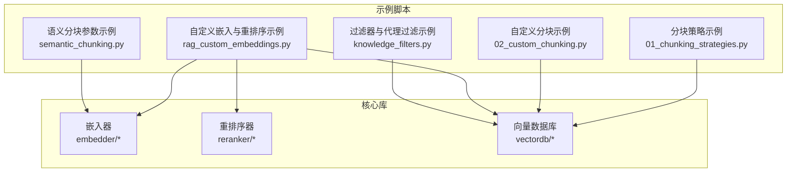
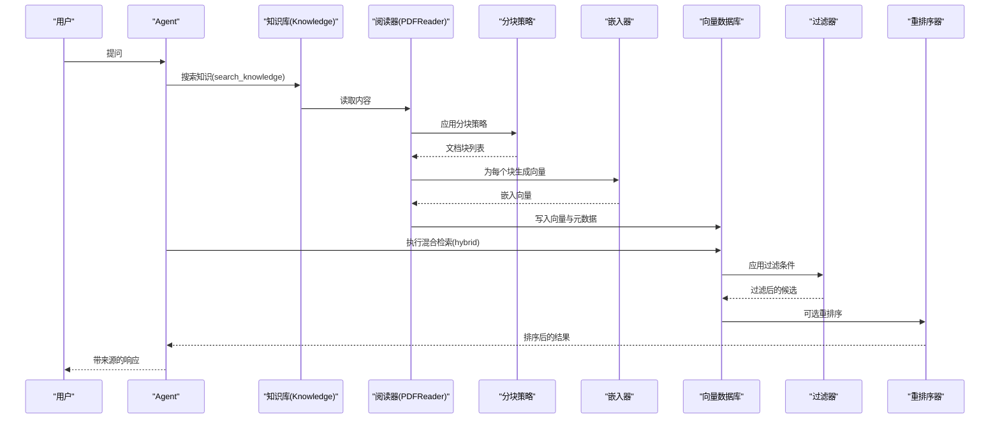
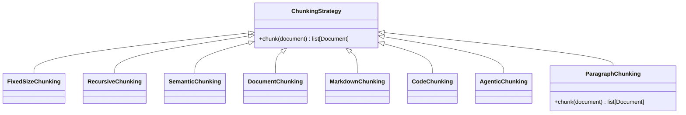
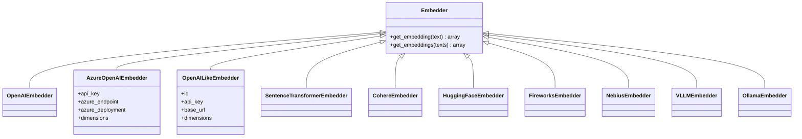
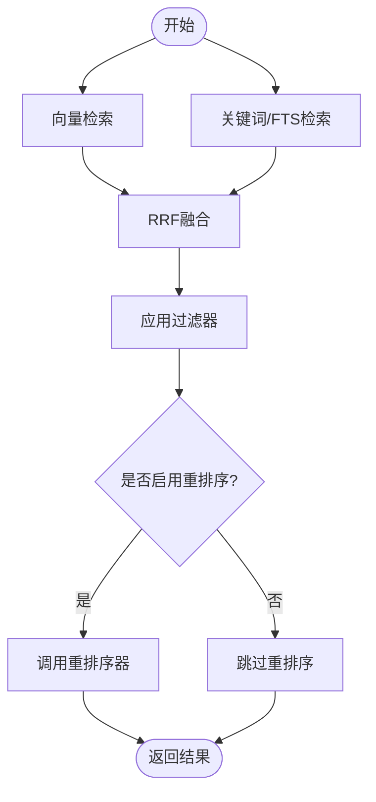
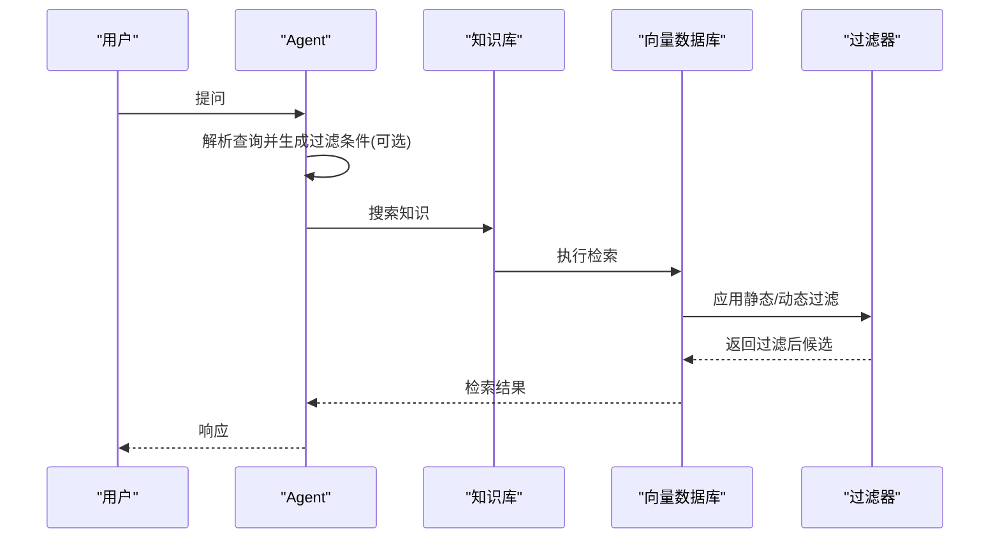
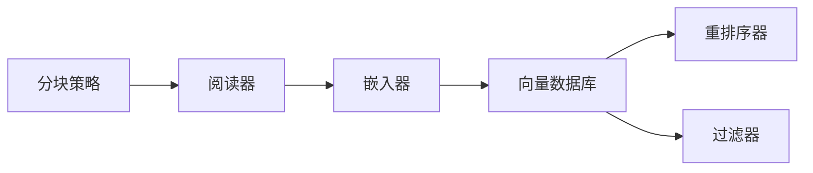

# 构建模块

<cite>
**本文引用的文件**
- [01_chunking_strategies.py](file://cookbook/07_knowledge/02_building_blocks/01_chunking_strategies.py)
- [02_custom_chunking.py](file://cookbook/07_knowledge/04_advanced/02_custom_chunking.py)
- [rag_custom_embeddings.py](file://cookbook/02_agents/07_knowledge/rag_custom_embeddings.py)
- [knowledge_filters.py](file://cookbook/02_agents/07_knowledge/knowledge_filters.py)
- [semantic_chunking.py](file://cookbook/07_knowledge/09_archive/chunking/semantic_chunking.py)
- [openai_like.py](file://libs/agno/agno/knowledge/embedder/openai_like.py)
- [azure_openai.py](file://libs/agno/agno/knowledge/embedder/azure_openai.py)
- [qdrant.py](file://libs/agno/agno/vectordb/qdrant/qdrant.py)
- [mongodb.py](file://libs/agno/agno/vectordb/mongodb/mongodb.py)
- [weaviate.py](file://libs/agno/agno/vectordb/weaviate/weaviate.py)
- [milvus.py](file://libs/agno/agno/vectordb/milvus/milvus.py)
- [chromadb.py](file://libs/agno/agno/vectordb/chromadb/chromadb.py)
</cite>

## 目录
1. [简介](#简介)
2. [项目结构](#项目结构)
3. [核心组件](#核心组件)
4. [架构总览](#架构总览)
5. [详细组件分析](#详细组件分析)
6. [依赖分析](#依赖分析)
7. [性能考虑](#性能考虑)
8. [故障排查指南](#故障排查指南)
9. [结论](#结论)
10. [附录](#附录)

## 简介
本章节聚焦知识管理系统的“构建模块”，系统性阐述文档分块策略、嵌入器与向量数据库、混合检索与重排序、过滤器与代理过滤等关键技术的原理、实现与选型建议。通过仓库中的示例脚本与核心库源码，读者可以理解如何在不同场景下选择合适的分块策略（固定大小、递归、语义、文档级、Markdown、代码、智能），如何配置多提供商嵌入器（OpenAI、Gemini、Azure OpenAI、LiteLLM 兼容、SentenceTransformer 等），以及如何在向量数据库中实现混合检索与重排序，最终形成可扩展、可维护的知识检索体系。

## 项目结构
围绕“构建模块”的知识管理示例主要分布在以下位置：
- 分块策略：cookbook/07_knowledge/02_building_blocks 与 07_knowledge/04_advanced
- 嵌入与重排序：cookbook/02_agents/07_knowledge 与 libs/agno/agno/knowledge/embedder、reranker
- 检索与过滤：libs/agno/agno/vectordb/* 与 cookbook/02_agents/07_knowledge
- 过滤器与代理过滤：cookbook/02_agents/07_knowledge/knowledge_filters.py

图表来源
- [01_chunking_strategies.py:1-118](file://cookbook/07_knowledge/02_building_blocks/01_chunking_strategies.py#L1-L118)
- [02_custom_chunking.py:1-108](file://cookbook/07_knowledge/04_advanced/02_custom_chunking.py#L1-L108)
- [rag_custom_embeddings.py:1-79](file://cookbook/02_agents/07_knowledge/rag_custom_embeddings.py#L1-L79)
- [knowledge_filters.py:1-71](file://cookbook/02_agents/07_knowledge/knowledge_filters.py#L1-L71)
- [semantic_chunking.py:1-39](file://cookbook/07_knowledge/09_archive/chunking/semantic_chunking.py#L1-L39)

章节来源
- [01_chunking_strategies.py:1-118](file://cookbook/07_knowledge/02_building_blocks/01_chunking_strategies.py#L1-L118)
- [02_custom_chunking.py:1-108](file://cookbook/07_knowledge/04_advanced/02_custom_chunking.py#L1-L108)
- [rag_custom_embeddings.py:1-79](file://cookbook/02_agents/07_knowledge/rag_custom_embeddings.py#L1-L79)
- [knowledge_filters.py:1-71](file://cookbook/02_agents/07_knowledge/knowledge_filters.py#L1-L71)
- [semantic_chunking.py:1-39](file://cookbook/07_knowledge/09_archive/chunking/semantic_chunking.py#L1-L39)

## 核心组件
- 文档分块策略：固定大小、递归、语义、文档级、Markdown、代码、智能分块；支持自定义策略
- 嵌入器：OpenAI、Gemini、Azure OpenAI、LiteLLM 兼容、SentenceTransformer、HuggingFace、Cohere、Fireworks、Nebius、VLLM、Ollama 等
- 向量数据库：Qdrant、Weaviate、Milvus、Chroma、MongoDB Atlas、PgVector 等
- 混合检索与重排序：向量+关键词融合、RRF 融合、可插拔重排序器
- 过滤器与代理过滤：静态过滤、基于查询动态选择的代理过滤

章节来源
- [01_chunking_strategies.py:58-82](file://cookbook/07_knowledge/02_building_blocks/01_chunking_strategies.py#L58-L82)
- [02_custom_chunking.py:34-61](file://cookbook/07_knowledge/04_advanced/02_custom_chunking.py#L34-L61)
- [rag_custom_embeddings.py:28-37](file://cookbook/02_agents/07_knowledge/rag_custom_embeddings.py#L28-L37)
- [knowledge_filters.py:18-26](file://cookbook/02_agents/07_knowledge/knowledge_filters.py#L18-L26)

## 架构总览
下图展示了从“知识入库”到“检索增强生成”的端到端流程，涵盖分块、嵌入、入库、检索、重排序与过滤的关键节点。

图表来源
- [01_chunking_strategies.py:43-51](file://cookbook/07_knowledge/02_building_blocks/01_chunking_strategies.py#L43-L51)
- [01_chunking_strategies.py:88-117](file://cookbook/07_knowledge/02_building_blocks/01_chunking_strategies.py#L88-L117)
- [rag_custom_embeddings.py:28-37](file://cookbook/02_agents/07_knowledge/rag_custom_embeddings.py#L28-L37)
- [qdrant.py:706-728](file://libs/agno/agno/vectordb/qdrant/qdrant.py#L706-L728)
- [weaviate.py:610-640](file://libs/agno/agno/vectordb/weaviate/weaviate.py#L610-L640)
- [milvus.py:893-929](file://libs/agno/agno/vectordb/milvus/milvus.py#L893-L929)
- [chromadb.py:777-807](file://libs/agno/agno/vectordb/chromadb/chromadb.py#L777-L807)
- [mongodb.py:737-747](file://libs/agno/agno/vectordb/mongodb/mongodb.py#L737-L747)

## 详细组件分析

### 文档分块策略
- 固定大小分块：按字符数切分，简单稳定，适合统一格式文本
- 递归分块：优先段落、其次句子、最后字符，兼顾质量与边界自然性
- 语义分块：基于相似度聚类，适合跨主题混合文档
- 文档级/Markdown/代码分块：尊重结构或语法边界，提升检索粒度一致性
- 智能分块：由 LLM 判定最优切分点，准确性高但成本较高
- 自定义分块：实现 ChunkingStrategy 接口，按领域或特殊格式定制

图表来源
- [01_chunking_strategies.py:58-82](file://cookbook/07_knowledge/02_building_blocks/01_chunking_strategies.py#L58-L82)
- [02_custom_chunking.py:34-61](file://cookbook/07_knowledge/04_advanced/02_custom_chunking.py#L34-L61)

章节来源
- [01_chunking_strategies.py:58-82](file://cookbook/07_knowledge/02_building_blocks/01_chunking_strategies.py#L58-L82)
- [02_custom_chunking.py:34-61](file://cookbook/07_knowledge/04_advanced/02_custom_chunking.py#L34-L61)
- [semantic_chunking.py:9-31](file://cookbook/07_knowledge/09_archive/chunking/semantic_chunking.py#L9-L31)

### 嵌入器与配置
- OpenAI：标准文本嵌入，支持维度与模型选择
- Azure OpenAI：企业级部署，支持自定义维度与认证方式
- LiteLLM 兼容：OpenAI 兼容接口，便于本地/第三方服务对接
- SentenceTransformer/HuggingFace/Cohere/Fireworks/Nebius/VLLM/Ollama：开源/多语言/专用场景
- 配置要点：模型 id、维度、API Key、base_url、超时与并发

图表来源
- [openai_like.py:7-29](file://libs/agno/agno/knowledge/embedder/openai_like.py#L7-L29)
- [azure_openai.py:18-35](file://libs/agno/agno/knowledge/embedder/azure_openai.py#L18-L35)

章节来源
- [openai_like.py:7-29](file://libs/agno/agno/knowledge/embedder/openai_like.py#L7-L29)
- [azure_openai.py:18-35](file://libs/agno/agno/knowledge/embedder/azure_openai.py#L18-L35)
- [rag_custom_embeddings.py:28-37](file://cookbook/02_agents/07_knowledge/rag_custom_embeddings.py#L28-L37)

### 混合检索与重排序
- 混合检索：向量相似度 + 关键词/FTS 搜索，采用 Reciprocal Rank Fusion(RRF) 融合
- 重排序：可插拔 reranker（如 BAAI/m3、SentenceTransformer），对候选进行再排序
- 过滤：支持静态过滤与代理过滤，可在检索前或检索后施加元数据过滤

图表来源
- [qdrant.py:706-728](file://libs/agno/agno/vectordb/qdrant/qdrant.py#L706-L728)
- [weaviate.py:610-640](file://libs/agno/agno/vectordb/weaviate/weaviate.py#L610-L640)
- [milvus.py:893-929](file://libs/agno/agno/vectordb/milvus/milvus.py#L893-L929)
- [chromadb.py:777-807](file://libs/agno/agno/vectordb/chromadb/chromadb.py#L777-L807)
- [mongodb.py:737-747](file://libs/agno/agno/vectordb/mongodb/mongodb.py#L737-L747)

章节来源
- [qdrant.py:706-728](file://libs/agno/agno/vectordb/qdrant/qdrant.py#L706-L728)
- [weaviate.py:610-640](file://libs/agno/agno/vectordb/weaviate/weaviate.py#L610-L640)
- [milvus.py:893-929](file://libs/agno/agno/vectordb/milvus/milvus.py#L893-L929)
- [chromadb.py:777-807](file://libs/agno/agno/vectordb/chromadb/chromadb.py#L777-L807)
- [mongodb.py:737-747](file://libs/agno/agno/vectordb/mongodb/mongodb.py#L737-L747)

### 过滤器与代理过滤
- 静态过滤：在 Agent 创建时设置，每次检索均生效
- 代理过滤：根据用户问题动态选择过滤值，提升上下文相关性
- 实现要点：使用 FilterExpr 对象表达类型安全的过滤条件

图表来源
- [knowledge_filters.py:18-26](file://cookbook/02_agents/07_knowledge/knowledge_filters.py#L18-L26)
- [knowledge_filters.py:32-52](file://cookbook/02_agents/07_knowledge/knowledge_filters.py#L32-L52)

章节来源
- [knowledge_filters.py:18-26](file://cookbook/02_agents/07_knowledge/knowledge_filters.py#L18-L26)
- [knowledge_filters.py:32-52](file://cookbook/02_agents/07_knowledge/knowledge_filters.py#L32-L52)

## 依赖分析
- 组件内聚与耦合
  - 分块策略与阅读器解耦，通过 ChunkingStrategy 接口连接
  - 嵌入器与向量数据库通过统一的 Embedder 接口解耦
  - 检索层（Qdrant/Weaviate/Milvus/Chroma/MongoDB/PgVector）共享混合检索与重排序能力
- 外部依赖
  - OpenAI/Azure OpenAI 客户端
  - 向量数据库 SDK（Qdrant、Weaviate、Milvus、Chroma、MongoDB）
  - 重排序器（SentenceTransformer 等）

图表来源
- [01_chunking_strategies.py:43-51](file://cookbook/07_knowledge/02_building_blocks/01_chunking_strategies.py#L43-L51)
- [rag_custom_embeddings.py:28-37](file://cookbook/02_agents/07_knowledge/rag_custom_embeddings.py#L28-L37)
- [qdrant.py:706-728](file://libs/agno/agno/vectordb/qdrant/qdrant.py#L706-L728)

章节来源
- [01_chunking_strategies.py:43-51](file://cookbook/07_knowledge/02_building_blocks/01_chunking_strategies.py#L43-L51)
- [rag_custom_embeddings.py:28-37](file://cookbook/02_agents/07_knowledge/rag_custom_embeddings.py#L28-L37)
- [qdrant.py:706-728](file://libs/agno/agno/vectordb/qdrant/qdrant.py#L706-L728)

## 性能考虑
- 分块策略
  - 固定大小：吞吐高、延迟低，适合大规模入库
  - 递归/语义：召回更优但计算开销较大，适合高质量检索场景
  - 自定义分块：按领域优化，平衡召回与性能
- 嵌入器
  - 云端模型（OpenAI/Gemini）延迟与成本可控，适合生产
  - 本地/兼容接口（LiteLLM/Ollama/VLLM）降低外部依赖，需评估延迟与吞吐
- 检索与重排序
  - 混合检索在关键词与向量之间权衡，RRF 调参影响融合效果
  - 重排序器会增加延迟，建议仅在必要时启用
- 过滤
  - 元数据过滤在向量数据库侧执行更高效，避免回传大结果集

## 故障排查指南
- 嵌入维度不匹配
  - 现象：向量维度与数据库期望不一致导致写入/查询失败
  - 处理：显式设置 embedder 的 dimensions，AzureOpenAIEmbedder 支持自定义维度
- OpenAI 兼容接口
  - 现象：自定义服务未正确暴露 /v1/embeddings 或缺少必要字段
  - 处理：使用 OpenAILikeEmbedder 显式配置 base_url 与 dimensions
- 混合检索未生效
  - 现象：仅向量或仅关键词检索
  - 处理：确认向量数据库实现是否支持混合检索与 RRF 融合
- 过滤不生效
  - 现象：过滤条件未被应用
  - 处理：检查过滤键名是否为 meta_data.* 前缀，或使用 FilterExpr 表达式

章节来源
- [azure_openai.py:18-35](file://libs/agno/agno/knowledge/embedder/azure_openai.py#L18-L35)
- [openai_like.py:7-29](file://libs/agno/agno/knowledge/embedder/openai_like.py#L7-L29)
- [qdrant.py:706-728](file://libs/agno/agno/vectordb/qdrant/qdrant.py#L706-L728)
- [weaviate.py:610-640](file://libs/agno/agno/vectordb/weaviate/weaviate.py#L610-L640)
- [milvus.py:893-929](file://libs/agno/agno/vectordb/milvus/milvus.py#L893-L929)
- [chromadb.py:777-807](file://libs/agno/agno/vectordb/chromadb/chromadb.py#L777-L807)
- [mongodb.py:737-747](file://libs/agno/agno/vectordb/mongodb/mongodb.py#L737-L747)

## 结论
- 分块策略应与内容形态匹配：统一格式用固定大小，混合主题用语义，结构化内容用文档/Markdown/代码分块
- 嵌入器选型需综合成本、延迟与功能：生产环境倾向云端模型，本地/兼容接口用于私有化部署
- 检索与重排序应按需启用：混合检索提升召回，重排序提升相关性，二者都会增加延迟
- 过滤器与代理过滤提升检索精准度：静态过滤保证一致性，代理过滤提升动态适配能力
- 通过标准化接口与可插拔组件，系统具备良好的扩展性与可维护性

## 附录
- 示例脚本路径
  - 分块策略对比：[01_chunking_strategies.py:1-118](file://cookbook/07_knowledge/02_building_blocks/01_chunking_strategies.py#L1-L118)
  - 自定义分块策略：[02_custom_chunking.py:1-108](file://cookbook/07_knowledge/04_advanced/02_custom_chunking.py#L1-L108)
  - 自定义嵌入与重排序：[rag_custom_embeddings.py:1-79](file://cookbook/02_agents/07_knowledge/rag_custom_embeddings.py#L1-L79)
  - 过滤器与代理过滤：[knowledge_filters.py:1-71](file://cookbook/02_agents/07_knowledge/knowledge_filters.py#L1-L71)
  - 语义分块参数示例：[semantic_chunking.py:1-39](file://cookbook/07_knowledge/09_archive/chunking/semantic_chunking.py#L1-L39)
- 嵌入器与向量数据库实现参考
  - OpenAI 兼容嵌入器：[openai_like.py:7-29](file://libs/agno/agno/knowledge/embedder/openai_like.py#L7-L29)
  - Azure OpenAI 嵌入器：[azure_openai.py:18-35](file://libs/agno/agno/knowledge/embedder/azure_openai.py#L18-L35)
  - Qdrant 检索与重排序：[qdrant.py:706-728](file://libs/agno/agno/vectordb/qdrant/qdrant.py#L706-L728)
  - Weaviate 混合检索：[weaviate.py:610-640](file://libs/agno/agno/vectordb/weaviate/weaviate.py#L610-L640)
  - Milvus 多向量与 RRF：[milvus.py:893-929](file://libs/agno/agno/vectordb/milvus/milvus.py#L893-L929)
  - Chroma 向量+FTS 与 RRF：[chromadb.py:777-807](file://libs/agno/agno/vectordb/chromadb/chromadb.py#L777-L807)
  - MongoDB 关键词与混合检索：[mongodb.py:737-747](file://libs/agno/agno/vectordb/mongodb/mongodb.py#L737-L747)