# 生产环境

<cite>
**本文引用的文件**
- [01_multi_source_rag.py](file://cookbook/07_knowledge/03_production/01_multi_source_rag.py)
- [02_knowledge_lifecycle.py](file://cookbook/07_knowledge/03_production/02_knowledge_lifecycle.py)
- [03_multi_tenant.py](file://cookbook/07_knowledge/03_production/03_multi_tenant.py)
- [04_error_handling.py](file://cookbook/07_knowledge/03_production/04_error_handling.py)
- [README.md](file://cookbook/07_knowledge/03_production/README.md)
- [operator.py](file://libs/agno_infra/agno/cli/operator.py)
- [operator.py](file://libs/agno_infra/agno/infra/operator.py)
- [README.md](file://libs/agno_infra/README.md)
- [base.py](file://libs/agno/agno/remote/base.py)
- [schemas.py](file://libs/agno/agno/tracing/schemas.py)
- [async_mongo.py](file://libs/agno/agno/db/mongo/async_mongo.py)
- [agent_ops.md](file://cookbook/92_integrations/observability/agent_ops.md)
- [opik_via_openinference.md](file://cookbook/92_integrations/observability/opik_via_openinference.md)
- [README.md](file://cookbook/92_integrations/observability/README.md)
- [performance.py](file://libs/agno/agno/eval/performance.py)
- [test_knowledge_routes.py](file://libs/agno/tests/system/tests/test_knowledge_routes.py)
- [02_distributed_rag_lancedb.py](file://cookbook/03_teams/15_distributed_rag/02_distributed_rag_lancedb.py)
- [02_distributed_rag_lancedb.md](file://cookbook/03_teams/15_distributed_rag/02_distributed_rag_lancedb.md)
- [TEST_LOG.md](file://cookbook/03_teams/15_distributed_rag/TEST_LOG.md)
- [01_demo/agents/scout/connectors/s3.py](file://cookbook/01_demo/agents/scout/connectors/s3.py)
</cite>

## 目录
1. [简介](#简介)
2. [项目结构](#项目结构)
3. [核心组件](#核心组件)
4. [架构总览](#架构总览)
5. [详细组件分析](#详细组件分析)
6. [依赖分析](#依赖分析)
7. [性能考量](#性能考量)
8. [故障排查指南](#故障排查指南)
9. [结论](#结论)
10. [附录](#附录)

## 简介
本章节面向知识管理系统的生产环境部署与运维，聚焦以下主题：
- 多源RAG的实现与配置：统一向量库中混合来源（文件、URL、文本）的批量加载与检索。
- 知识库生命周期管理：插入、去重、移除、状态跟踪与再索引。
- 多租户架构：基于向量检索隔离的数据隔离、资源分配与权限控制思路。
- 与AgentOS的集成：远程配置拉取、鉴权头注入、缓存与刷新策略。
- 错误处理与异常恢复：幂等插入、批处理容错、失败回滚与验证。
- 性能优化与可观测性：分布式RAG、追踪与监控、内存分析与容量规划建议。
- 安全策略与扩展性：最小权限、网络隔离、弹性伸缩与灾难恢复。

## 项目结构
本仓库包含知识管理与AgentOS相关示例、基础设施管理框架以及可观测性集成示例。生产环境关注的知识管理示例位于“cookbook/07_knowledge/03_production”，基础设施管理位于“libs/agno_infra”，可观测性集成位于“cookbook/92_integrations/observability”。

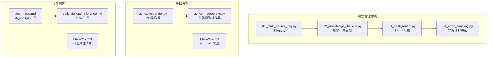

**图表来源**
- [01_multi_source_rag.py:1-86](file://cookbook/07_knowledge/03_production/01_multi_source_rag.py#L1-L86)
- [02_knowledge_lifecycle.py:1-44](file://cookbook/07_knowledge/03_production/02_knowledge_lifecycle.py#L1-L44)
- [03_multi_tenant.py:43-104](file://cookbook/07_knowledge/03_production/03_multi_tenant.py#L43-L104)
- [04_error_handling.py:1-91](file://cookbook/07_knowledge/03_production/04_error_handling.py#L1-L91)
- [operator.py:100-136](file://libs/agno_infra/agno/cli/operator.py#L100-L136)
- [operator.py:249-286](file://libs/agno_infra/agno/infra/operator.py#L249-L286)
- [README.md:1-140](file://libs/agno_infra/README.md#L1-L140)
- [agent_ops.md:1-19](file://cookbook/92_integrations/observability/agent_ops.md#L1-L19)
- [opik_via_openinference.md:1-18](file://cookbook/92_integrations/observability/opik_via_openinference.md#L1-L18)
- [README.md:1-35](file://cookbook/92_integrations/observability/README.md#L1-L35)

**章节来源**
- [README.md:1-28](file://cookbook/07_knowledge/03_production/README.md#L1-L28)
- [README.md:1-140](file://libs/agno_infra/README.md#L1-L140)
- [README.md:1-35](file://cookbook/92_integrations/observability/README.md#L1-L35)

## 核心组件
- 多源RAG：统一向量库集合，支持从文件、URL、文本批量插入，使用混合检索类型提升召回效果。
- 知识生命周期：通过内容数据库跟踪已入湖内容的状态与元数据，支持跳过已存在内容、删除过期内容与再索引。
- 多租户隔离：通过向量检索隔离参数，确保不同租户仅看到自身数据，避免跨租户信息泄露。
- 错误处理模式：幂等插入、批处理容错、失败日志记录与后续可用性验证。
- AgentOS集成：远程配置获取、鉴权头注入、缓存与强制刷新策略。
- 可观测性：与AgentOps、Opik等平台集成，通过OpenInference或SDK初始化进行追踪与上报。
- 分布式RAG：团队协作式检索-扩展-合成-校验流程，结合LanceDB/PGVector等向量库。

**章节来源**
- [01_multi_source_rag.py:28-42](file://cookbook/07_knowledge/03_production/01_multi_source_rag.py#L28-L42)
- [02_knowledge_lifecycle.py:30-44](file://cookbook/07_knowledge/03_production/02_knowledge_lifecycle.py#L30-L44)
- [03_multi_tenant.py:43-73](file://cookbook/07_knowledge/03_production/03_multi_tenant.py#L43-L73)
- [04_error_handling.py:30-44](file://cookbook/07_knowledge/03_production/04_error_handling.py#L30-L44)
- [base.py:450-489](file://libs/agno/agno/remote/base.py#L450-L489)
- [agent_ops.md:1-19](file://cookbook/92_integrations/observability/agent_ops.md#L1-L19)
- [opik_via_openinference.md:1-18](file://cookbook/92_integrations/observability/opik_via_openinference.md#L1-L18)
- [02_distributed_rag_lancedb.py:99-121](file://cookbook/03_teams/15_distributed_rag/02_distributed_rag_lancedb.py#L99-L121)

## 架构总览
下图展示了生产环境中知识管理的关键组件与交互路径：Agent通过Knowledge访问向量数据库；多租户通过检索隔离保障数据边界；错误处理与生命周期管理贯穿入湖与检索；可观测性贯穿请求链路；基础设施层负责资源编排与部署。

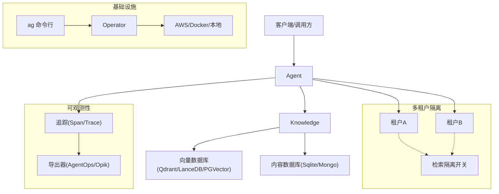

**图表来源**
- [01_multi_source_rag.py:28-42](file://cookbook/07_knowledge/03_production/01_multi_source_rag.py#L28-L42)
- [02_knowledge_lifecycle.py:30-44](file://cookbook/07_knowledge/03_production/02_knowledge_lifecycle.py#L30-L44)
- [03_multi_tenant.py:43-73](file://cookbook/07_knowledge/03_production/03_multi_tenant.py#L43-L73)
- [agent_ops.md:1-19](file://cookbook/92_integrations/observability/agent_ops.md#L1-L19)
- [opik_via_openinference.md:1-18](file://cookbook/92_integrations/observability/opik_via_openinference.md#L1-L18)
- [operator.py:100-136](file://libs/agno_infra/agno/cli/operator.py#L100-L136)

## 详细组件分析

### 多源RAG实现与配置
- 统一向量库：在同一集合中加载多种来源（PDF、网页、文本），减少跨库检索复杂度。
- 批量插入：使用批量接口一次性处理多个来源，降低调用开销。
- 混合检索：启用混合检索类型以兼顾关键词与语义匹配，提升召回质量。
- 查询验证：通过Agent对不同主题进行检索验证，确保跨源一致性。

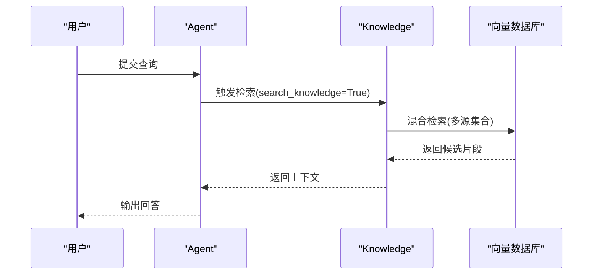

**图表来源**
- [01_multi_source_rag.py:48-85](file://cookbook/07_knowledge/03_production/01_multi_source_rag.py#L48-L85)

**章节来源**
- [01_multi_source_rag.py:1-86](file://cookbook/07_knowledge/03_production/01_multi_source_rag.py#L1-L86)

### 知识库生命周期管理
- 插入策略：支持跳过已存在内容（幂等），避免重复入湖与浪费。
- 内容跟踪：通过内容数据库记录内容ID、状态、元数据与时间戳，便于审计与再索引。
- 删除与更新：提供删除过期内容与重新索引的能力，保持知识新鲜度。
- 状态查询：提供内容状态查询接口，便于运维与监控。

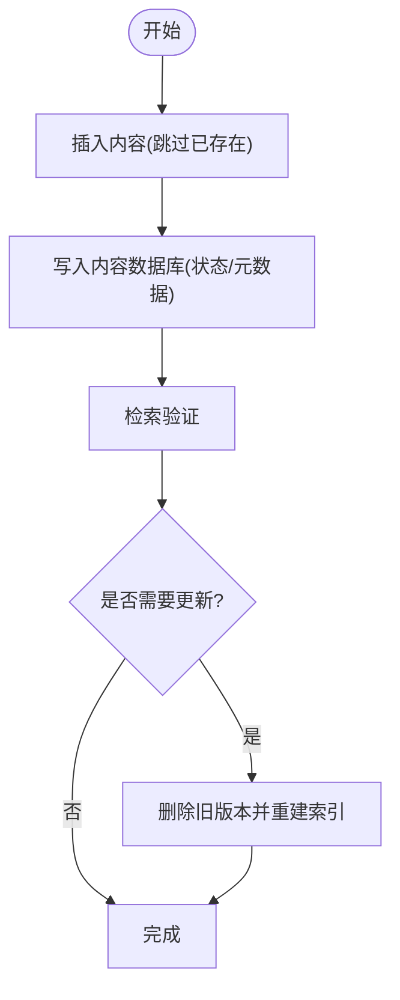

**图表来源**
- [02_knowledge_lifecycle.py:30-44](file://cookbook/07_knowledge/03_production/02_knowledge_lifecycle.py#L30-L44)

**章节来源**
- [02_knowledge_lifecycle.py:1-44](file://cookbook/07_knowledge/03_production/02_knowledge_lifecycle.py#L1-L44)
- [test_knowledge_routes.py:110-140](file://libs/agno/tests/system/tests/test_knowledge_routes.py#L110-L140)

### 多租户架构设计与实现
- 数据隔离：通过向量检索隔离参数，确保每个租户只能检索到自身集合。
- 资源分配：为不同租户配置独立集合或命名空间，避免共享带来的冲突。
- 权限控制：在应用层通过租户标识与访问令牌控制知识库访问范围。
- 验证流程：分别对租户A与租户B执行查询，确认各自只看到自身数据。

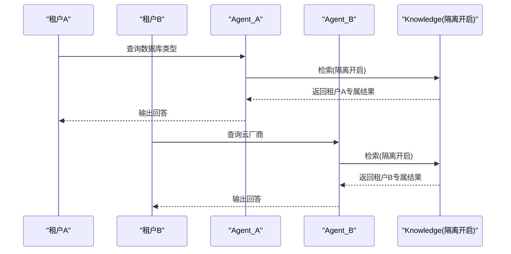

**图表来源**
- [03_multi_tenant.py:43-104](file://cookbook/07_knowledge/03_production/03_multi_tenant.py#L43-L104)

**章节来源**
- [03_multi_tenant.py:43-104](file://cookbook/07_knowledge/03_production/03_multi_tenant.py#L43-L104)

### 与AgentOS的集成方案
- 远程配置：通过HTTP客户端获取远端配置，支持缓存与TTL控制，避免频繁拉取。
- 鉴权头注入：根据可选的JWT令牌生成Authorization头，确保访问安全。
- 缓存与刷新：提供强制刷新接口，用于在配置变更后快速生效。

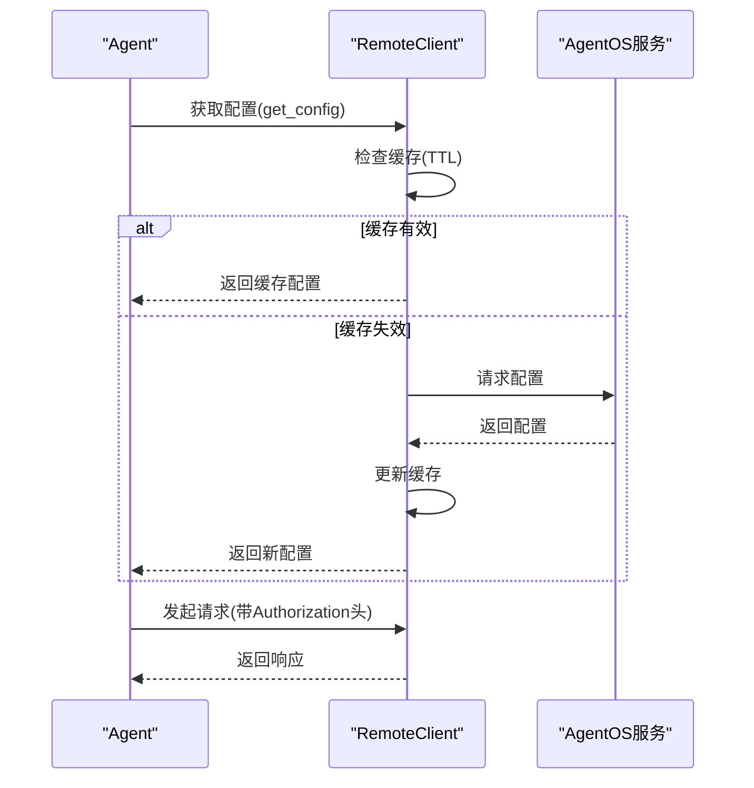

**图表来源**
- [base.py:450-489](file://libs/agno/agno/remote/base.py#L450-L489)

**章节来源**
- [base.py:450-489](file://libs/agno/agno/remote/base.py#L450-L489)

### 错误处理策略与异常恢复
- 幂等插入：通过跳过已存在内容，允许重复调用而不产生副作用。
- 批处理容错：逐条尝试插入并记录失败项，保证部分成功时仍可继续。
- 可用性验证：在入湖后通过Agent提问验证知识库可用性。
- 回滚与修复：对失败批次进行标记与重试，必要时回滚并修复问题。

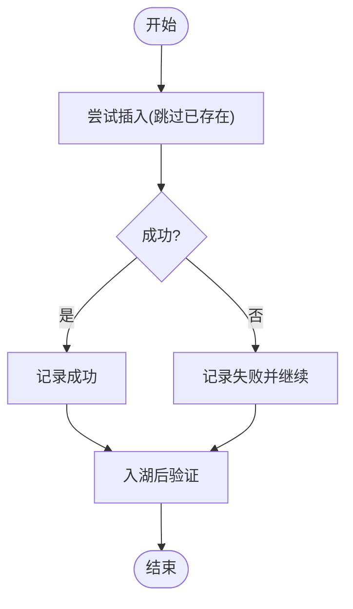

**图表来源**
- [04_error_handling.py:50-90](file://cookbook/07_knowledge/03_production/04_error_handling.py#L50-L90)

**章节来源**
- [04_error_handling.py:1-91](file://cookbook/07_knowledge/03_production/04_error_handling.py#L1-L91)

### 分布式RAG与扩展性设计
- 团队协作：主检索器、上下文扩展器、答案合成器、质量验证器分工明确，提升鲁棒性。
- 向量库选择：支持LanceDB与PGVector等，依据场景选择全文检索或向量检索能力。
- 异步处理：支持异步分布式RAG，提高吞吐与响应速度。
- 失败示例与修复：部分示例因缺失依赖导致导入失败，需安装对应包后重试。

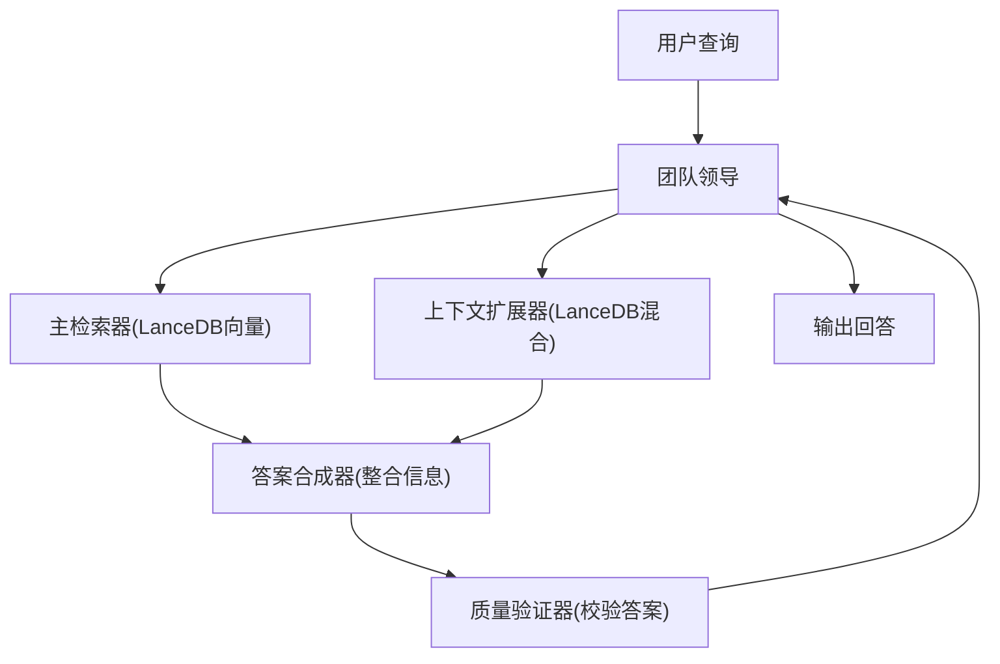

**图表来源**
- [02_distributed_rag_lancedb.md:64-77](file://cookbook/03_teams/15_distributed_rag/02_distributed_rag_lancedb.md#L64-L77)

**章节来源**
- [02_distributed_rag_lancedb.py:99-186](file://cookbook/03_teams/15_distributed_rag/02_distributed_rag_lancedb.py#L99-L186)
- [02_distributed_rag_lancedb.md:52-85](file://cookbook/03_teams/15_distributed_rag/02_distributed_rag_lancedb.md#L52-L85)
- [TEST_LOG.md:238-284](file://cookbook/03_teams/15_distributed_rag/TEST_LOG.md#L238-L284)

### 可观测性与监控告警
- AgentOps集成：通过SDK全局初始化，自动追踪LLM调用并上报至平台。
- Opik集成：通过OpenInference手动配置OTLP导出，支持自定义trace属性过滤。
- 追踪模型：将Span聚合为Trace，计算时延、错误数与整体状态，便于分析。
- 数据存储：MongoDB支持traces/spans表的动态获取与校验。

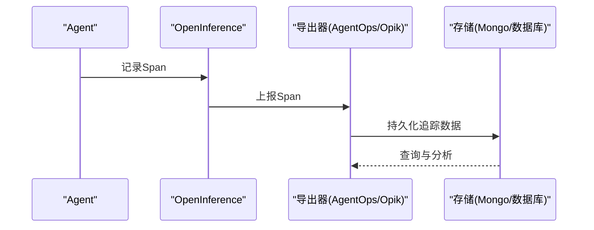

**图表来源**
- [agent_ops.md:1-19](file://cookbook/92_integrations/observability/agent_ops.md#L1-L19)
- [opik_via_openinference.md:1-18](file://cookbook/92_integrations/observability/opik_via_openinference.md#L1-L18)
- [schemas.py:218-243](file://libs/agno/agno/tracing/schemas.py#L218-L243)
- [async_mongo.py:441-461](file://libs/agno/agno/db/mongo/async_mongo.py#L441-L461)

**章节来源**
- [agent_ops.md:1-19](file://cookbook/92_integrations/observability/agent_ops.md#L1-L19)
- [opik_via_openinference.md:1-18](file://cookbook/92_integrations/observability/opik_via_openinference.md#L1-L18)
- [schemas.py:202-243](file://libs/agno/agno/tracing/schemas.py#L202-L243)
- [async_mongo.py:441-461](file://libs/agno/agno/db/mongo/async_mongo.py#L441-L461)

### 基础设施与部署
- CLI统一入口：通过命令行模板创建、部署、检查状态与销毁基础设施。
- 多平台支持：覆盖AWS、Docker与本地环境，支持数据库、网络、存储与计算资源管理。
- 操作器流程：遍历资源组创建资源，统计成功/失败数量并输出结果。

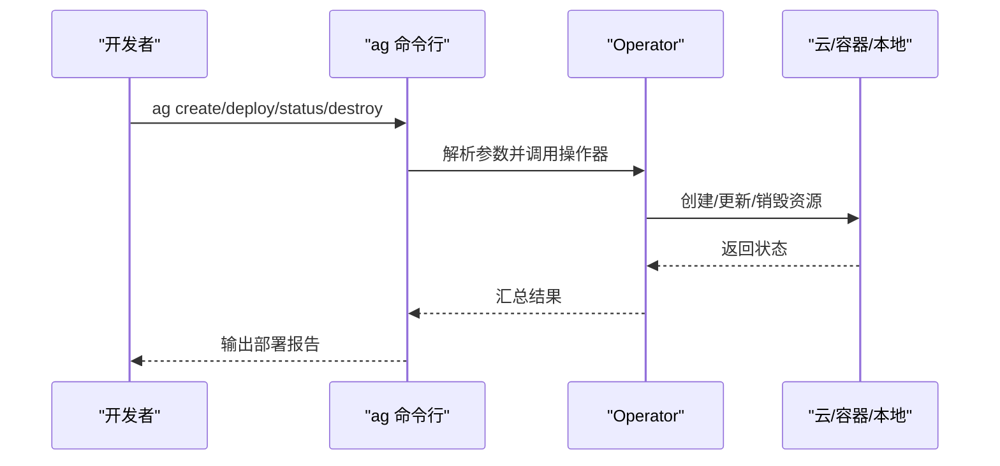

**图表来源**
- [README.md:42-68](file://libs/agno_infra/README.md#L42-L68)
- [operator.py:100-136](file://libs/agno_infra/agno/cli/operator.py#L100-L136)
- [operator.py:249-286](file://libs/agno_infra/agno/infra/operator.py#L249-L286)

**章节来源**
- [README.md:1-140](file://libs/agno_infra/README.md#L1-L140)
- [operator.py:100-136](file://libs/agno_infra/agno/cli/operator.py#L100-L136)
- [operator.py:249-286](file://libs/agno_infra/agno/infra/operator.py#L249-L286)

## 依赖分析
- 组件耦合：Knowledge与向量数据库强耦合，内容数据库作为弱依赖用于状态跟踪；Agent仅依赖Knowledge接口。
- 外部依赖：向量库（Qdrant/LanceDB/PGVector）、可观测性平台（AgentOps/Opik）、基础设施SDK（AWS/Docker）。
- 循环依赖：示例代码未见循环导入；若在生产中引入插件或中间件，需避免循环引用。

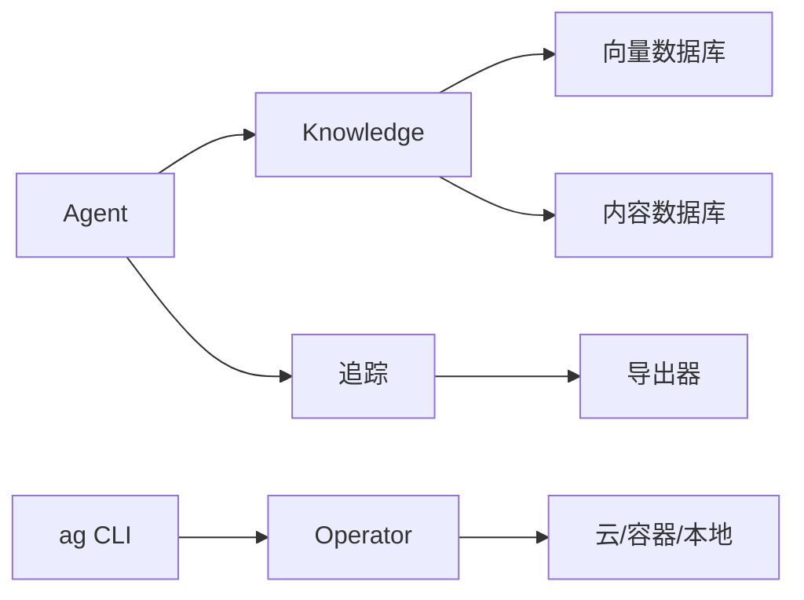

**图表来源**
- [01_multi_source_rag.py:28-42](file://cookbook/07_knowledge/03_production/01_multi_source_rag.py#L28-L42)
- [02_knowledge_lifecycle.py:30-44](file://cookbook/07_knowledge/03_production/02_knowledge_lifecycle.py#L30-L44)
- [agent_ops.md:1-19](file://cookbook/92_integrations/observability/agent_ops.md#L1-L19)
- [opik_via_openinference.md:1-18](file://cookbook/92_integrations/observability/opik_via_openinference.md#L1-L18)
- [operator.py:100-136](file://libs/agno_infra/agno/cli/operator.py#L100-L136)

**章节来源**
- [01_multi_source_rag.py:28-42](file://cookbook/07_knowledge/03_production/01_multi_source_rag.py#L28-L42)
- [02_knowledge_lifecycle.py:30-44](file://cookbook/07_knowledge/03_production/02_knowledge_lifecycle.py#L30-L44)
- [agent_ops.md:1-19](file://cookbook/92_integrations/observability/agent_ops.md#L1-L19)
- [opik_via_openinference.md:1-18](file://cookbook/92_integrations/observability/opik_via_openinference.md#L1-L18)
- [operator.py:100-136](file://libs/agno_infra/agno/cli/operator.py#L100-L136)

## 性能考量
- 分布式RAG：通过团队成员分阶段处理，减少单点瓶颈，提升吞吐。
- 向量库选择：根据场景选择LanceDB（全文+向量）或PGVector（向量为主），平衡检索质量与成本。
- 批处理与幂等：批量插入与跳过已存在内容，降低重复计算与网络往返。
- 追踪与分析：利用Trace聚合与Span统计定位慢调用与错误热点。
- 内存分析：通过快照对比识别内存增长来源，指导GC与对象复用策略。

**章节来源**
- [02_distributed_rag_lancedb.py:99-186](file://cookbook/03_teams/15_distributed_rag/02_distributed_rag_lancedb.py#L99-L186)
- [schemas.py:218-243](file://libs/agno/agno/tracing/schemas.py#L218-L243)
- [performance.py:359-384](file://libs/agno/agno/eval/performance.py#L359-L384)

## 故障排查指南
- 部署与回滚：采用金丝雀发布与回滚脚本，发现问题立即回滚并通知。
- 常见问题：数据库迁移失败、上线后高错误率、性能退化等，按步骤检查日志、指标与索引。
- 错误处理：对失败批次进行日志记录与重试，必要时回滚并修复。
- 运维流程：检测—确认—评估—沟通—处置—复盘，形成闭环。

**章节来源**
- [04_error_handling.py:50-90](file://cookbook/07_knowledge/03_production/04_error_handling.py#L50-L90)
- [01_demo/agents/scout/connectors/s3.py:539-613](file://cookbook/01_demo/agents/scout/connectors/s3.py#L539-L613)

## 结论
生产环境的知识管理系统应围绕“多源RAG、生命周期管理、多租户隔离、可观测性与基础设施自动化”构建。通过幂等插入与批处理容错保障稳定性，借助分布式RAG与向量库选择提升性能，配合AgentOps/Opik等平台实现端到端可观测，最终以基础设施自动化与标准化运维流程确保高并发与大数据量场景下的可靠运行。

## 附录
- 部署清单：模板创建、部署、状态检查、销毁。
- 安全建议：最小权限、网络隔离、密钥轮换、审计日志。
- 容量规划：根据QPS、向量维度、集合规模估算存储与计算资源，预留冗余与弹性扩容。

**章节来源**
- [README.md:42-68](file://libs/agno_infra/README.md#L42-L68)
- [01_demo/agents/scout/connectors/s3.py:539-613](file://cookbook/01_demo/agents/scout/connectors/s3.py#L539-L613)