# 知识管理系统

<cite>
**本文引用的文件**
- [cookbook/07_knowledge/01_getting_started/01_basic_rag.py](file://cookbook/07_knowledge/01_getting_started/01_basic_rag.py)
- [cookbook/02_agents/07_knowledge/traditional_rag.py](file://cookbook/02_agents/07_knowledge/traditional_rag.py)
- [cookbook/02_agents/07_knowledge/agentic_rag.py](file://cookbook/02_agents/07_knowledge/agentic_rag.py)
- [cookbook/07_knowledge/04_advanced/04_knowledge_tools.py](file://cookbook/07_knowledge/04_advanced/04_knowledge_tools.py)
- [cookbook/02_agents/07_knowledge/knowledge_filters.py](file://cookbook/02_agents/07_knowledge/knowledge_filters.py)
- [cookbook/02_agents/07_knowledge/custom_retriever.py](file://cookbook/02_agents/07_knowledge/custom_retriever.py)
- [cookbook/07_knowledge/03_production/02_knowledge_lifecycle.py](file://cookbook/07_knowledge/03_production/02_knowledge_lifecycle.py)
- [cookbook/07_knowledge/04_advanced/05_knowledge_protocol.py](file://cookbook/07_knowledge/04_advanced/05_knowledge_protocol.py)
- [cookbook/03_teams/15_distributed_rag/01_distributed_rag_pgvector.py](file://cookbook/03_teams/15_distributed_rag/01_distributed_rag_pgvector.py)
- [cookbook/03_teams/15_distributed_rag/02_distributed_rag_lancedb.py](file://cookbook/03_teams/15_distributed_rag/02_distributed_rag_lancedb.py)
- [cookbook/03_teams/15_distributed_rag/03_distributed_rag_with_reranking.py](file://cookbook/03_teams/15_distributed_rag/03_distributed_rag_with_reranking.py)
- [cookbook/02_agents/07_knowledge/rag_custom_embeddings.py](file://cookbook/02_agents/07_knowledge/rag_custom_embeddings.py)
- [cookbook/02_agents/07_knowledge/agentic_rag_with_reranking.py](file://cookbook/02_agents/07_knowledge/agentic_rag_with_reranking.py)
- [cookbook/03_teams/16_search_coordination/01_coordinated_agentic_rag.py](file://cookbook/03_teams/16_search_coordination/01_coordinated_agentic_rag.py)
- [cookbook/03_teams/16_search_coordination/02_coordinated_reasoning_rag.py](file://cookbook/03_teams/16_search_coordination/02_coordinated_reasoning_rag.py)
- [cookbook/07_knowledge/03_production/01_multi_source_rag.py](file://cookbook/07_knowledge/03_production/01_multi_source_rag.py)
- [cookbook/07_knowledge/04_advanced/03_graph_rag.py](file://cookbook/07_knowledge/04_advanced/03_graph_rag.py)
- [cookbook/05_agent_os/advanced_demo/multiple_knowledge_bases.py](file://cookbook/05_agent_os/advanced_demo/multiple_knowledge_bases.py)
- [cookbook/05_agent_os/client/05_knowledge_search.py](file://cookbook/05_agent_os/client/05_knowledge_search.py)
- [cookbook/05_agent_os/knowledge/agentos_knowledge.py](file://cookbook/05_agent_os/knowledge/agentos_knowledge.py)
- [cookbook/05_agent_os/tracing/03_agent_with_knowledge_tracing.py](file://cookbook/05_agent_os/tracing/03_agent_with_knowledge_tracing.py)
- [cookbook/03_teams/05_knowledge/01_team_with_knowledge.py](file://cookbook/03_teams/05_knowledge/01_team_with_knowledge.py)
- [cookbook/03_teams/05_knowledge/02_team_with_knowledge_filters.py](file://cookbook/03_teams/05_knowledge/02_team_with_knowledge_filters.py)
- [cookbook/03_teams/05_knowledge/03_team_with_agentic_knowledge_filters.py](file://cookbook/03_teams/05_knowledge/03_team_with_agentic_knowledge_filters.py)
- [cookbook/03_teams/05_knowledge/05_team_update_knowledge.py](file://cookbook/03_teams/05_knowledge/05_team_update_knowledge.py)
- [cookbook/03_teams/12_learning/05_team_learned_knowledge.py](file://cookbook/03_teams/12_learning/05_team_learned_knowledge.py)
- [cookbook/03_teams/05_knowledge/04_team_knowledge_tracing.py](file://cookbook/03_teams/05_knowledge/04_team_knowledge_tracing.py)
</cite>

## 目录
1. [简介](#简介)
2. [项目结构](#项目结构)
3. [核心组件](#核心组件)
4. [架构总览](#架构总览)
5. [详细组件分析](#详细组件分析)
6. [依赖分析](#依赖分析)
7. [性能考量](#性能考量)
8. [故障排查指南](#故障排查指南)
9. [结论](#结论)
10. [附录](#附录)

## 简介
本文件面向希望在 Agno Learn 平台上构建高效、可扩展、可运维的知识管理系统（RAG）的工程师与技术负责人。文档从“快速开始”到“高级功能与生产实践”，覆盖知识库创建、文档加载与检索配置、构建模块（文档处理、向量嵌入、检索与重排序）、生产环境（性能、安全、监控、扩展）、集成方案（第三方服务、自定义适配器、数据迁移）以及团队协作与学习场景下的知识管理最佳实践。

## 项目结构
本仓库以“食谱”和“知识管理”为主线，通过多个 Cookbook 示例演示不同层次的 RAG 能力与工程化实践。知识管理相关示例主要集中在以下路径：
- 快速开始：基础 RAG、传统 RAG、代理驱动 RAG
- 高级功能：知识工具、过滤器、自定义检索器、协议接口
- 生产实践：生命周期管理、多源 RAG、分布式 RAG、图谱 RAG
- 团队与学习：团队知识、追踪与审计、学习与更新

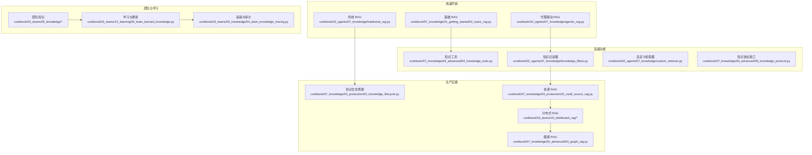

图表来源
- [cookbook/07_knowledge/01_getting_started/01_basic_rag.py](file://cookbook/07_knowledge/01_getting_started/01_basic_rag.py)
- [cookbook/02_agents/07_knowledge/traditional_rag.py](file://cookbook/02_agents/07_knowledge/traditional_rag.py)
- [cookbook/02_agents/07_knowledge/agentic_rag.py](file://cookbook/02_agents/07_knowledge/agentic_rag.py)
- [cookbook/07_knowledge/04_advanced/04_knowledge_tools.py](file://cookbook/07_knowledge/04_advanced/04_knowledge_tools.py)
- [cookbook/02_agents/07_knowledge/knowledge_filters.py](file://cookbook/02_agents/07_knowledge/knowledge_filters.py)
- [cookbook/02_agents/07_knowledge/custom_retriever.py](file://cookbook/02_agents/07_knowledge/custom_retriever.py)
- [cookbook/07_knowledge/03_production/02_knowledge_lifecycle.py](file://cookbook/07_knowledge/03_production/02_knowledge_lifecycle.py)
- [cookbook/07_knowledge/03_production/01_multi_source_rag.py](file://cookbook/07_knowledge/03_production/01_multi_source_rag.py)
- [cookbook/03_teams/15_distributed_rag/01_distributed_rag_pgvector.py](file://cookbook/03_teams/15_distributed_rag/01_distributed_rag_pgvector.py)
- [cookbook/03_teams/15_distributed_rag/02_distributed_rag_lancedb.py](file://cookbook/03_teams/15_distributed_rag/02_distributed_rag_lancedb.py)
- [cookbook/03_teams/15_distributed_rag/03_distributed_rag_with_reranking.py](file://cookbook/03_teams/15_distributed_rag/03_distributed_rag_with_reranking.py)
- [cookbook/07_knowledge/04_advanced/03_graph_rag.py](file://cookbook/07_knowledge/04_advanced/03_graph_rag.py)
- [cookbook/03_teams/05_knowledge/01_team_with_knowledge.py](file://cookbook/03_teams/05_knowledge/01_team_with_knowledge.py)
- [cookbook/03_teams/12_learning/05_team_learned_knowledge.py](file://cookbook/03_teams/12_learning/05_team_learned_knowledge.py)
- [cookbook/03_teams/05_knowledge/04_team_knowledge_tracing.py](file://cookbook/03_teams/05_knowledge/04_team_knowledge_tracing.py)

章节来源
- [cookbook/07_knowledge/01_getting_started/01_basic_rag.py](file://cookbook/07_knowledge/01_getting_started/01_basic_rag.py)
- [cookbook/02_agents/07_knowledge/traditional_rag.py](file://cookbook/02_agents/07_knowledge/traditional_rag.py)
- [cookbook/02_agents/07_knowledge/agentic_rag.py](file://cookbook/02_agents/07_knowledge/agentic_rag.py)
- [cookbook/07_knowledge/04_advanced/04_knowledge_tools.py](file://cookbook/07_knowledge/04_advanced/04_knowledge_tools.py)
- [cookbook/02_agents/07_knowledge/knowledge_filters.py](file://cookbook/02_agents/07_knowledge/knowledge_filters.py)
- [cookbook/02_agents/07_knowledge/custom_retriever.py](file://cookbook/02_agents/07_knowledge/custom_retriever.py)
- [cookbook/07_knowledge/03_production/02_knowledge_lifecycle.py](file://cookbook/07_knowledge/03_production/02_knowledge_lifecycle.py)
- [cookbook/07_knowledge/03_production/01_multi_source_rag.py](file://cookbook/07_knowledge/03_production/01_multi_source_rag.py)
- [cookbook/03_teams/15_distributed_rag/01_distributed_rag_pgvector.py](file://cookbook/03_teams/15_distributed_rag/01_distributed_rag_pgvector.py)
- [cookbook/03_teams/15_distributed_rag/02_distributed_rag_lancedb.py](file://cookbook/03_teams/15_distributed_rag/02_distributed_rag_lancedb.py)
- [cookbook/03_teams/15_distributed_rag/03_distributed_rag_with_reranking.py](file://cookbook/03_teams/15_distributed_rag/03_distributed_rag_with_reranking.py)
- [cookbook/07_knowledge/04_advanced/03_graph_rag.py](file://cookbook/07_knowledge/04_advanced/03_graph_rag.py)
- [cookbook/03_teams/05_knowledge/01_team_with_knowledge.py](file://cookbook/03_teams/05_knowledge/01_team_with_knowledge.py)
- [cookbook/03_teams/12_learning/05_team_learned_knowledge.py](file://cookbook/03_teams/12_learning/05_team_learned_knowledge.py)
- [cookbook/03_teams/05_knowledge/04_team_knowledge_tracing.py](file://cookbook/03_teams/05_knowledge/04_team_knowledge_tracing.py)

## 核心组件
- 知识库（Knowledge）：封装向量化存储、嵌入器、检索类型与内容数据库，统一对外提供检索与上下文注入能力。
- 向量数据库（VectorDB）：支持多种后端（如 Qdrant、PgVector、LanceDB），提供相似度检索与混合检索。
- 嵌入器（Embedder）：负责文本向量化，示例中使用 OpenAI Embedding。
- 检索器（Retriever）：可替换为自定义函数或协议实现，满足非标准检索需求。
- 过滤器（Filters）：静态过滤与代理驱动过滤，按字段条件筛选候选文档。
- 工具（KnowledgeTools）：think/search/analyze 三类工具，增强代理对知识的推理与分析。
- 协议（KnowledgeProtocol）：抽象知识源接口，便于接入任意数据源与检索逻辑。
- 生命周期（ContentsDB）：跟踪已摄入内容、状态与元数据，支持跳过重复、删除与重新索引。

章节来源
- [cookbook/07_knowledge/01_getting_started/01_basic_rag.py](file://cookbook/07_knowledge/01_getting_started/01_basic_rag.py)
- [cookbook/02_agents/07_knowledge/traditional_rag.py](file://cookbook/02_agents/07_knowledge/traditional_rag.py)
- [cookbook/02_agents/07_knowledge/agentic_rag.py](file://cookbook/02_agents/07_knowledge/agentic_rag.py)
- [cookbook/07_knowledge/04_advanced/04_knowledge_tools.py](file://cookbook/07_knowledge/04_advanced/04_knowledge_tools.py)
- [cookbook/02_agents/07_knowledge/knowledge_filters.py](file://cookbook/02_agents/07_knowledge/knowledge_filters.py)
- [cookbook/02_agents/07_knowledge/custom_retriever.py](file://cookbook/02_agents/07_knowledge/custom_retriever.py)
- [cookbook/07_knowledge/03_production/02_knowledge_lifecycle.py](file://cookbook/07_knowledge/03_production/02_knowledge_lifecycle.py)
- [cookbook/07_knowledge/04_advanced/05_knowledge_protocol.py](file://cookbook/07_knowledge/04_advanced/05_knowledge_protocol.py)

## 架构总览
下图展示了从“用户查询”到“返回带引用的响应”的端到端流程，包含检索、重排序、上下文注入与工具调用等关键环节。

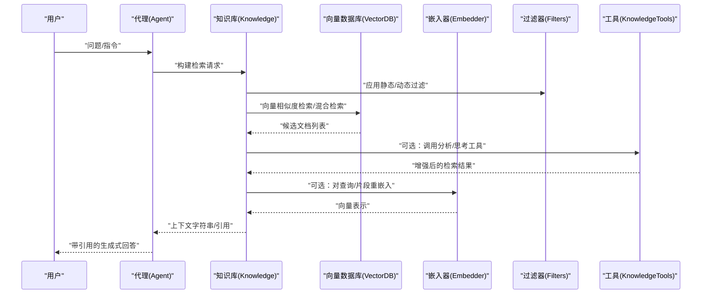

图表来源
- [cookbook/02_agents/07_knowledge/agentic_rag.py](file://cookbook/02_agents/07_knowledge/agentic_rag.py)
- [cookbook/07_knowledge/04_advanced/04_knowledge_tools.py](file://cookbook/07_knowledge/04_advanced/04_knowledge_tools.py)
- [cookbook/02_agents/07_knowledge/knowledge_filters.py](file://cookbook/02_agents/07_knowledge/knowledge_filters.py)
- [cookbook/02_agents/07_knowledge/rag_custom_embeddings.py](file://cookbook/02_agents/07_knowledge/rag_custom_embeddings.py)

## 详细组件分析

### 组件一：知识库与向量数据库
- 知识库封装了向量数据库实例、嵌入器与可选的内容数据库，提供统一的插入、检索与上下文注入接口。
- 支持多种检索类型（如混合检索），并可配置嵌入模型。
- 示例中同时出现 Qdrant 与 PgVector，体现跨存储的兼容性。

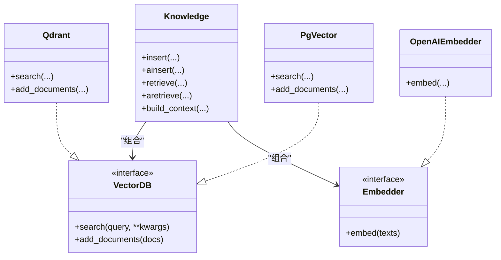

图表来源
- [cookbook/07_knowledge/01_getting_started/01_basic_rag.py](file://cookbook/07_knowledge/01_getting_started/01_basic_rag.py)
- [cookbook/02_agents/07_knowledge/traditional_rag.py](file://cookbook/02_agents/07_knowledge/traditional_rag.py)
- [cookbook/02_agents/07_knowledge/agentic_rag.py](file://cookbook/02_agents/07_knowledge/agentic_rag.py)

章节来源
- [cookbook/07_knowledge/01_getting_started/01_basic_rag.py](file://cookbook/07_knowledge/01_getting_started/01_basic_rag.py)
- [cookbook/02_agents/07_knowledge/traditional_rag.py](file://cookbook/02_agents/07_knowledge/traditional_rag.py)
- [cookbook/02_agents/07_knowledge/agentic_rag.py](file://cookbook/02_agents/07_knowledge/agentic_rag.py)

### 组件二：检索与重排序
- 传统 RAG：直接将检索到的上下文注入提示词，适合简单问答。
- 代理驱动 RAG：启用搜索工具，由代理根据对话动态决定是否检索。
- 自定义嵌入：可替换嵌入器或对检索片段进行二次嵌入以提升匹配质量。
- 重排序：在检索后对候选进行再排序，提升相关性。

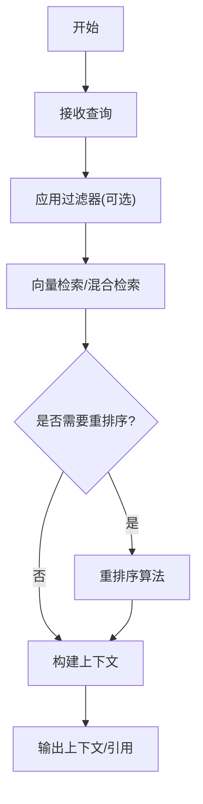

图表来源
- [cookbook/02_agents/07_knowledge/agentic_rag.py](file://cookbook/02_agents/07_knowledge/agentic_rag.py)
- [cookbook/02_agents/07_knowledge/rag_custom_embeddings.py](file://cookbook/02_agents/07_knowledge/rag_custom_embeddings.py)
- [cookbook/02_agents/07_knowledge/agentic_rag_with_reranking.py](file://cookbook/02_agents/07_knowledge/agentic_rag_with_reranking.py)

章节来源
- [cookbook/02_agents/07_knowledge/agentic_rag.py](file://cookbook/02_agents/07_knowledge/agentic_rag.py)
- [cookbook/02_agents/07_knowledge/rag_custom_embeddings.py](file://cookbook/02_agents/07_knowledge/rag_custom_embeddings.py)
- [cookbook/02_agents/07_knowledge/agentic_rag_with_reranking.py](file://cookbook/02_agents/07_knowledge/agentic_rag_with_reranking.py)

### 组件三：过滤器系统
- 静态过滤：在代理初始化时设置，适用于固定维度（如领域、语言、标签）。
- 动态过滤：由代理在运行时基于用户输入选择过滤值，提升灵活性。

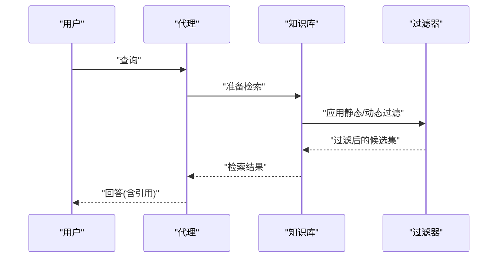

图表来源
- [cookbook/02_agents/07_knowledge/knowledge_filters.py](file://cookbook/02_agents/07_knowledge/knowledge_filters.py)

章节来源
- [cookbook/02_agents/07_knowledge/knowledge_filters.py](file://cookbook/02_agents/07_knowledge/knowledge_filters.py)

### 组件四：自定义检索器与协议
- 自定义检索器：提供一个可调用对象，替代默认知识库检索，便于对接外部系统。
- 知识协议：实现统一接口以接入任意数据源与检索逻辑，支持同步/异步检索与工具注册。

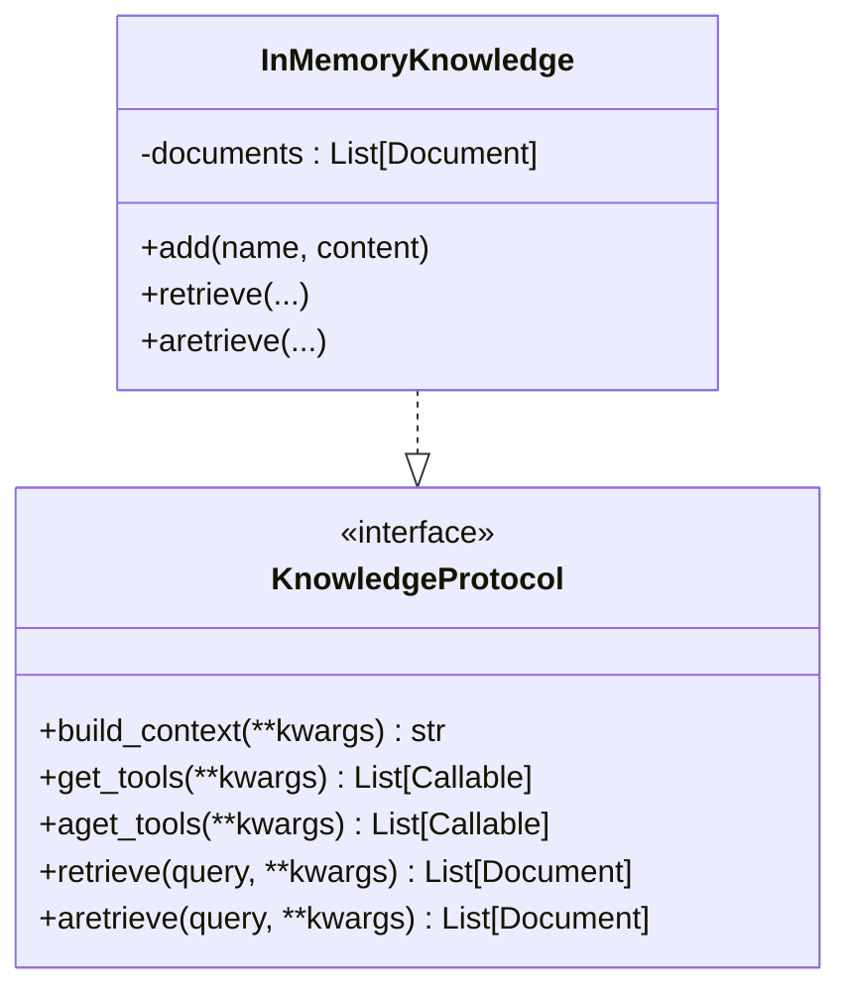

图表来源
- [cookbook/07_knowledge/04_advanced/05_knowledge_protocol.py](file://cookbook/07_knowledge/04_advanced/05_knowledge_protocol.py)
- [cookbook/02_agents/07_knowledge/custom_retriever.py](file://cookbook/02_agents/07_knowledge/custom_retriever.py)

章节来源
- [cookbook/07_knowledge/04_advanced/05_knowledge_protocol.py](file://cookbook/07_knowledge/04_advanced/05_knowledge_protocol.py)
- [cookbook/02_agents/07_knowledge/custom_retriever.py](file://cookbook/02_agents/07_knowledge/custom_retriever.py)

### 组件五：知识工具（Think/Search/Analyze）
- Think：先对问题进行推理，再决定检索策略。
- Search：标准知识库检索。
- Analyze：对检索结果进行深度分析，辅助生成更准确的回答。

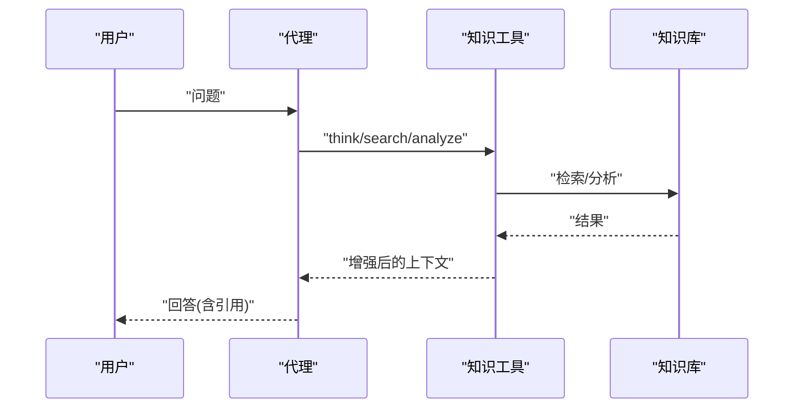

图表来源
- [cookbook/07_knowledge/04_advanced/04_knowledge_tools.py](file://cookbook/07_knowledge/04_advanced/04_knowledge_tools.py)

章节来源
- [cookbook/07_knowledge/04_advanced/04_knowledge_tools.py](file://cookbook/07_knowledge/04_advanced/04_knowledge_tools.py)

### 组件六：知识生命周期与内容数据库
- 内容数据库用于记录已摄入内容、状态与元数据，支持去重、删除与重新索引。
- 典型流程：插入 → 判断存在 → 删除向量 → 重新索引。

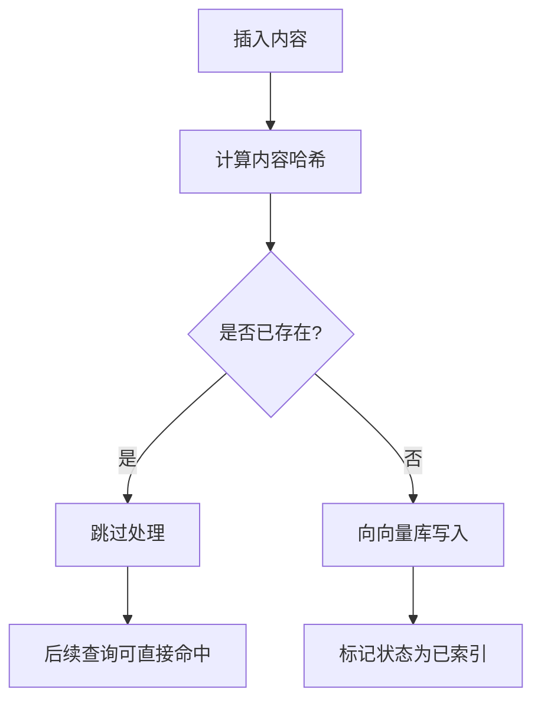

图表来源
- [cookbook/07_knowledge/03_production/02_knowledge_lifecycle.py](file://cookbook/07_knowledge/03_production/02_knowledge_lifecycle.py)

章节来源
- [cookbook/07_knowledge/03_production/02_knowledge_lifecycle.py](file://cookbook/07_knowledge/03_production/02_knowledge_lifecycle.py)

### 组件七：分布式与协调检索
- 分布式 RAG：在多节点或多集合上执行检索，聚合结果后再进行重排序。
- 协调检索：在团队/多智能体场景下，协调多个代理的检索与推理。

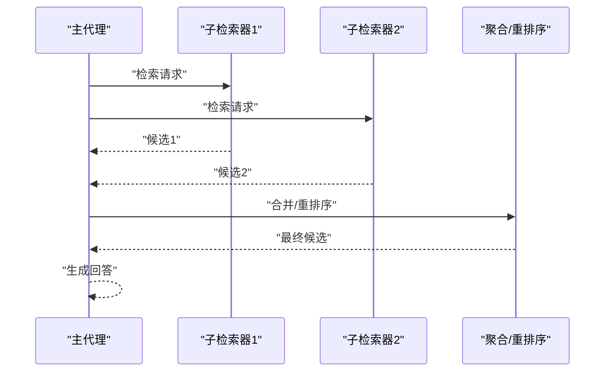

图表来源
- [cookbook/03_teams/15_distributed_rag/01_distributed_rag_pgvector.py](file://cookbook/03_teams/15_distributed_rag/01_distributed_rag_pgvector.py)
- [cookbook/03_teams/15_distributed_rag/02_distributed_rag_lancedb.py](file://cookbook/03_teams/15_distributed_rag/02_distributed_rag_lancedb.py)
- [cookbook/03_teams/15_distributed_rag/03_distributed_rag_with_reranking.py](file://cookbook/03_teams/15_distributed_rag/03_distributed_rag_with_reranking.py)
- [cookbook/03_teams/16_search_coordination/01_coordinated_agentic_rag.py](file://cookbook/03_teams/16_search_coordination/01_coordinated_agentic_rag.py)
- [cookbook/03_teams/16_search_coordination/02_coordinated_reasoning_rag.py](file://cookbook/03_teams/16_search_coordination/02_coordinated_reasoning_rag.py)

章节来源
- [cookbook/03_teams/15_distributed_rag/01_distributed_rag_pgvector.py](file://cookbook/03_teams/15_distributed_rag/01_distributed_rag_pgvector.py)
- [cookbook/03_teams/15_distributed_rag/02_distributed_rag_lancedb.py](file://cookbook/03_teams/15_distributed_rag/02_distributed_rag_lancedb.py)
- [cookbook/03_teams/15_distributed_rag/03_distributed_rag_with_reranking.py](file://cookbook/03_teams/15_distributed_rag/03_distributed_rag_with_reranking.py)
- [cookbook/03_teams/16_search_coordination/01_coordinated_agentic_rag.py](file://cookbook/03_teams/16_search_coordination/01_coordinated_agentic_rag.py)
- [cookbook/03_teams/16_search_coordination/02_coordinated_reasoning_rag.py](file://cookbook/03_teams/16_search_coordination/02_coordinated_reasoning_rag.py)

### 组件八：团队与学习场景下的知识管理
- 多知识库：在同一系统内维护多个知识库，按域隔离。
- 追踪与审计：记录检索与生成过程，便于回溯与优化。
- 学习与更新：团队在交互中持续学习并更新知识库。

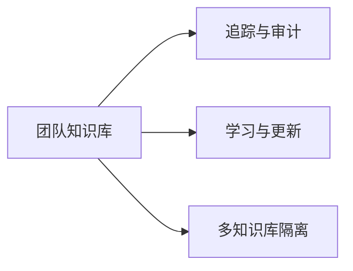

图表来源
- [cookbook/05_agent_os/advanced_demo/multiple_knowledge_bases.py](file://cookbook/05_agent_os/advanced_demo/multiple_knowledge_bases.py)
- [cookbook/05_agent_os/tracing/03_agent_with_knowledge_tracing.py](file://cookbook/05_agent_os/tracing/03_agent_with_knowledge_tracing.py)
- [cookbook/03_teams/12_learning/05_team_learned_knowledge.py](file://cookbook/03_teams/12_learning/05_team_learned_knowledge.py)
- [cookbook/03_teams/05_knowledge/01_team_with_knowledge.py](file://cookbook/03_teams/05_knowledge/01_team_with_knowledge.py)
- [cookbook/03_teams/05_knowledge/02_team_with_knowledge_filters.py](file://cookbook/03_teams/05_knowledge/02_team_with_knowledge_filters.py)
- [cookbook/03_teams/05_knowledge/03_team_with_agentic_knowledge_filters.py](file://cookbook/03_teams/05_knowledge/03_team_with_agentic_knowledge_filters.py)
- [cookbook/03_teams/05_knowledge/05_team_update_knowledge.py](file://cookbook/03_teams/05_knowledge/05_team_update_knowledge.py)
- [cookbook/03_teams/05_knowledge/04_team_knowledge_tracing.py](file://cookbook/03_teams/05_knowledge/04_team_knowledge_tracing.py)

章节来源
- [cookbook/05_agent_os/advanced_demo/multiple_knowledge_bases.py](file://cookbook/05_agent_os/advanced_demo/multiple_knowledge_bases.py)
- [cookbook/05_agent_os/tracing/03_agent_with_knowledge_tracing.py](file://cookbook/05_agent_os/tracing/03_agent_with_knowledge_tracing.py)
- [cookbook/03_teams/12_learning/05_team_learned_knowledge.py](file://cookbook/03_teams/12_learning/05_team_learned_knowledge.py)
- [cookbook/03_teams/05_knowledge/01_team_with_knowledge.py](file://cookbook/03_teams/05_knowledge/01_team_with_knowledge.py)
- [cookbook/03_teams/05_knowledge/02_team_with_knowledge_filters.py](file://cookbook/03_teams/05_knowledge/02_team_with_knowledge_filters.py)
- [cookbook/03_teams/05_knowledge/03_team_with_agentic_knowledge_filters.py](file://cookbook/03_teams/05_knowledge/03_team_with_agentic_knowledge_filters.py)
- [cookbook/03_teams/05_knowledge/05_team_update_knowledge.py](file://cookbook/03_teams/05_knowledge/05_team_update_knowledge.py)
- [cookbook/03_teams/05_knowledge/04_team_knowledge_tracing.py](file://cookbook/03_teams/05_knowledge/04_team_knowledge_tracing.py)

## 依赖分析
- 组件耦合：知识库与向量数据库、嵌入器松耦合，通过组合与接口解耦；过滤器、工具与协议提供扩展点。
- 外部依赖：向量数据库（Qdrant、PgVector、LanceDB）、嵌入服务（OpenAI Embeddings）、容器化脚本（run_pgvector.sh 等）。
- 循环依赖：示例未见循环导入；协议接口避免了强绑定。

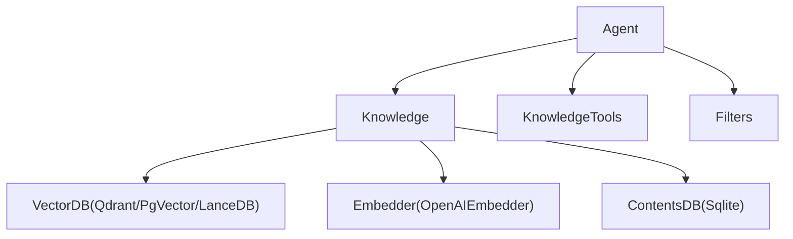

图表来源
- [cookbook/07_knowledge/01_getting_started/01_basic_rag.py](file://cookbook/07_knowledge/01_getting_started/01_basic_rag.py)
- [cookbook/07_knowledge/03_production/02_knowledge_lifecycle.py](file://cookbook/07_knowledge/03_production/02_knowledge_lifecycle.py)
- [cookbook/07_knowledge/04_advanced/04_knowledge_tools.py](file://cookbook/07_knowledge/04_advanced/04_knowledge_tools.py)
- [cookbook/02_agents/07_knowledge/knowledge_filters.py](file://cookbook/02_agents/07_knowledge/knowledge_filters.py)

章节来源
- [cookbook/07_knowledge/01_getting_started/01_basic_rag.py](file://cookbook/07_knowledge/01_getting_started/01_basic_rag.py)
- [cookbook/07_knowledge/03_production/02_knowledge_lifecycle.py](file://cookbook/07_knowledge/03_production/02_knowledge_lifecycle.py)
- [cookbook/07_knowledge/04_advanced/04_knowledge_tools.py](file://cookbook/07_knowledge/04_advanced/04_knowledge_tools.py)
- [cookbook/02_agents/07_knowledge/knowledge_filters.py](file://cookbook/02_agents/07_knowledge/knowledge_filters.py)

## 性能考量
- 向量检索优化
  - 使用合适的向量数据库与索引参数，控制向量维度与距离度量。
  - 混合检索结合关键词与向量，平衡召回与速度。
- 嵌入与缓存
  - 对常用查询/片段进行嵌入缓存，减少重复计算。
  - 采用批量嵌入与并发控制，提高吞吐。
- 过滤与裁剪
  - 在检索前应用过滤器缩小候选集，降低后续处理成本。
  - 控制返回文档数量与上下文长度，避免提示词溢出。
- 分布式与并行
  - 多集合/多节点并行检索，聚合后再重排序。
  - 异步插入与检索，提升整体响应时间。
- 存储与索引
  - 定期重建索引与清理无效向量，保持检索效率。
  - 使用内容数据库跟踪状态，避免重复处理。

## 故障排查指南
- 插入失败或重复
  - 现象：重复内容被跳过或报错。
  - 排查：检查内容哈希与去重策略，确认内容数据库状态。
  - 参考：知识生命周期示例。
- 检索不到结果
  - 现象：返回空或相关性差。
  - 排查：调整检索类型、过滤器、嵌入模型或增加重排序。
  - 参考：传统/代理驱动 RAG、重排序示例。
- 向量数据库连接异常
  - 现象：无法连接或超时。
  - 排查：确认容器/服务地址、端口与网络连通性。
  - 参考：分布式 RAG 示例中的数据库启动脚本。
- 团队协作与追踪
  - 现象：检索与生成过程难以回溯。
  - 排查：开启追踪与审计日志，定位检索链路。
  - 参考：团队知识追踪示例。

章节来源
- [cookbook/07_knowledge/03_production/02_knowledge_lifecycle.py](file://cookbook/07_knowledge/03_production/02_knowledge_lifecycle.py)
- [cookbook/02_agents/07_knowledge/agentic_rag.py](file://cookbook/02_agents/07_knowledge/agentic_rag.py)
- [cookbook/03_teams/15_distributed_rag/01_distributed_rag_pgvector.py](file://cookbook/03_teams/15_distributed_rag/01_distributed_rag_pgvector.py)
- [cookbook/03_teams/05_knowledge/04_team_knowledge_tracing.py](file://cookbook/03_teams/05_knowledge/04_team_knowledge_tracing.py)

## 结论
Agno Learn 的知识管理系统以“知识库 + 向量数据库 + 嵌入器”为核心，配合过滤器、工具与协议接口，形成可扩展、可定制的 RAG 能力。通过生命周期管理、分布式检索与团队协作机制，可在生产环境中实现高可用与高性能。建议从快速开始入手，逐步引入过滤、重排序与协议扩展，并结合追踪与审计完善可观测性。

## 附录
- 快速开始路径
  - 基础 RAG：[cookbook/07_knowledge/01_getting_started/01_basic_rag.py](file://cookbook/07_knowledge/01_getting_started/01_basic_rag.py)
  - 传统 RAG：[cookbook/02_agents/07_knowledge/traditional_rag.py](file://cookbook/02_agents/07_knowledge/traditional_rag.py)
  - 代理驱动 RAG：[cookbook/02_agents/07_knowledge/agentic_rag.py](file://cookbook/02_agents/07_knowledge/agentic_rag.py)
- 高级功能路径
  - 知识工具：[cookbook/07_knowledge/04_advanced/04_knowledge_tools.py](file://cookbook/07_knowledge/04_advanced/04_knowledge_tools.py)
  - 过滤器：[cookbook/02_agents/07_knowledge/knowledge_filters.py](file://cookbook/02_agents/07_knowledge/knowledge_filters.py)
  - 自定义检索器：[cookbook/02_agents/07_knowledge/custom_retriever.py](file://cookbook/02_agents/07_knowledge/custom_retriever.py)
  - 知识协议：[cookbook/07_knowledge/04_advanced/05_knowledge_protocol.py](file://cookbook/07_knowledge/04_advanced/05_knowledge_protocol.py)
- 生产实践路径
  - 知识生命周期：[cookbook/07_knowledge/03_production/02_knowledge_lifecycle.py](file://cookbook/07_knowledge/03_production/02_knowledge_lifecycle.py)
  - 多源 RAG：[cookbook/07_knowledge/03_production/01_multi_source_rag.py](file://cookbook/07_knowledge/03_production/01_multi_source_rag.py)
  - 分布式 RAG：[cookbook/03_teams/15_distributed_rag/01_distributed_rag_pgvector.py](file://cookbook/03_teams/15_distributed_rag/01_distributed_rag_pgvector.py), [cookbook/03_teams/15_distributed_rag/02_distributed_rag_lancedb.py](file://cookbook/03_teams/15_distributed_rag/02_distributed_rag_lancedb.py), [cookbook/03_teams/15_distributed_rag/03_distributed_rag_with_reranking.py](file://cookbook/03_teams/15_distributed_rag/03_distributed_rag_with_reranking.py)
  - 图谱 RAG：[cookbook/07_knowledge/04_advanced/03_graph_rag.py](file://cookbook/07_knowledge/04_advanced/03_graph_rag.py)
- 团队与学习路径
  - 多知识库：[cookbook/05_agent_os/advanced_demo/multiple_knowledge_bases.py](file://cookbook/05_agent_os/advanced_demo/multiple_knowledge_bases.py)
  - 知识搜索客户端：[cookbook/05_agent_os/client/05_knowledge_search.py](file://cookbook/05_agent_os/client/05_knowledge_search.py)
  - AgentOS 知识：[cookbook/05_agent_os/knowledge/agentos_knowledge.py](file://cookbook/05_agent_os/knowledge/agentos_knowledge.py)
  - 团队知识与追踪：[cookbook/03_teams/05_knowledge/01_team_with_knowledge.py](file://cookbook/03_teams/05_knowledge/01_team_with_knowledge.py), [cookbook/03_teams/05_knowledge/04_team_knowledge_tracing.py](file://cookbook/03_teams/05_knowledge/04_team_knowledge_tracing.py)
  - 学习与更新：[cookbook/03_teams/12_learning/05_team_learned_knowledge.py](file://cookbook/03_teams/12_learning/05_team_learned_knowledge.py)