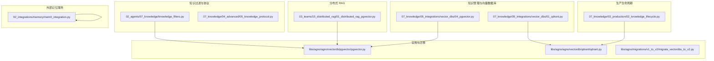
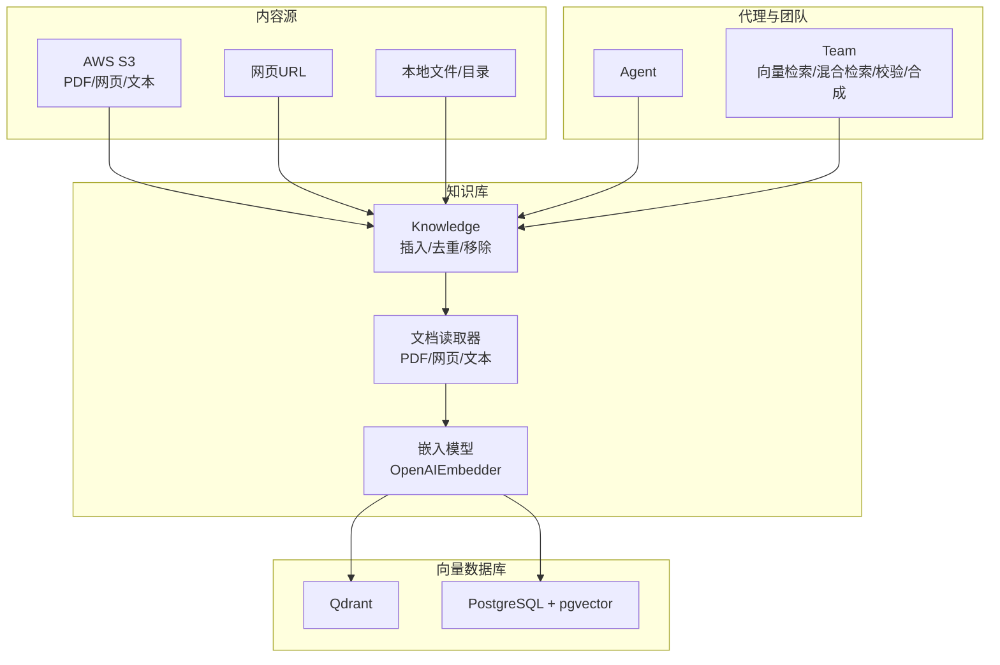
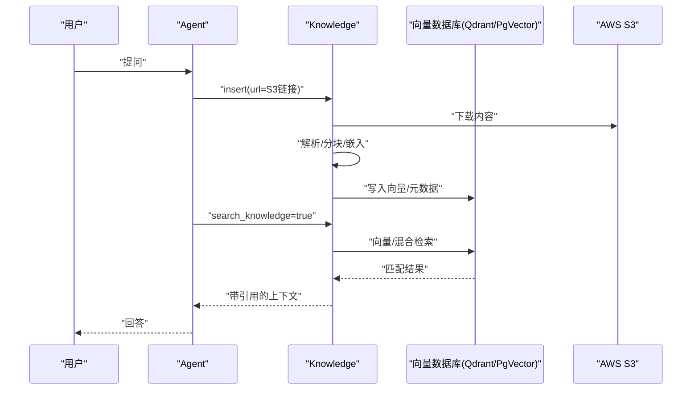
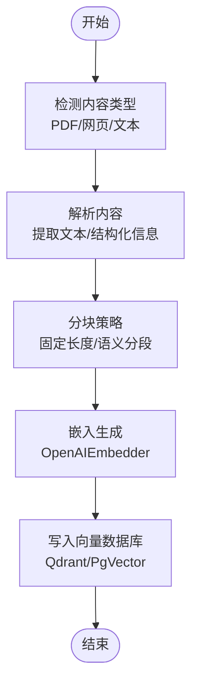
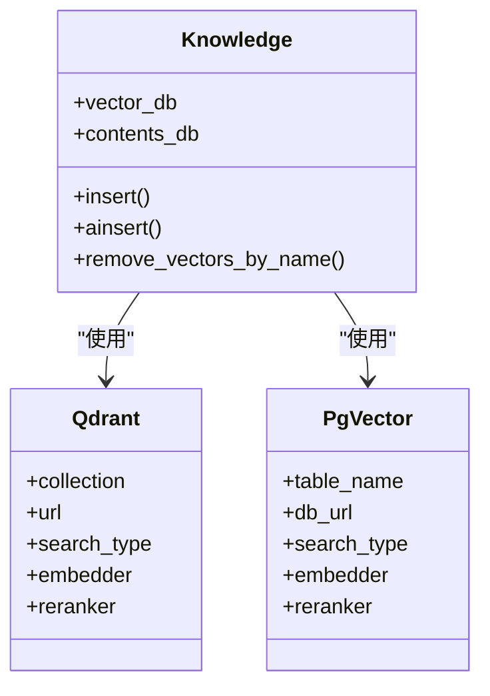
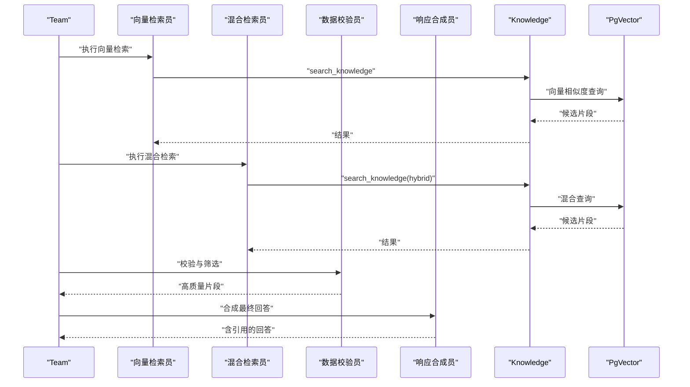
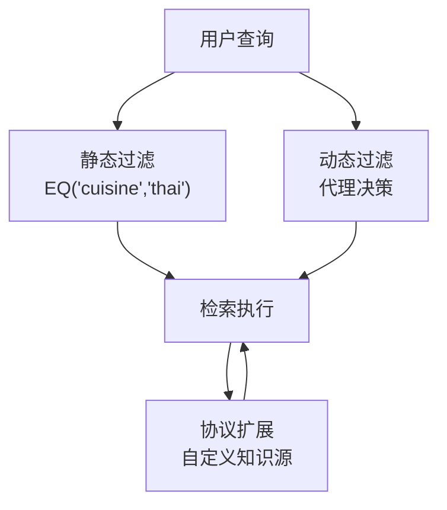
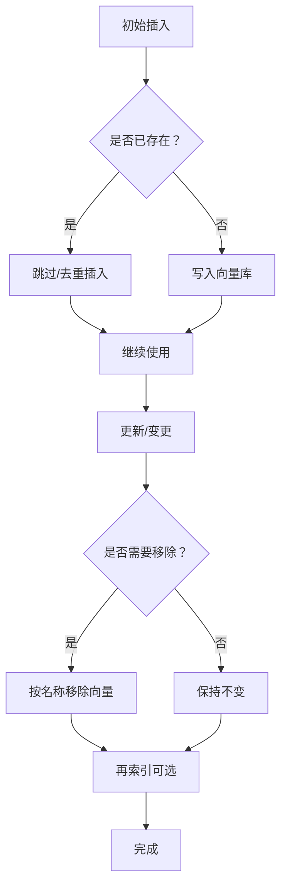
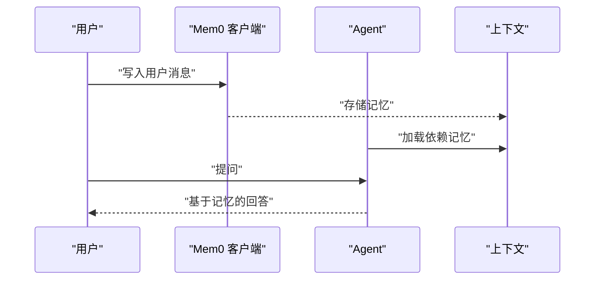
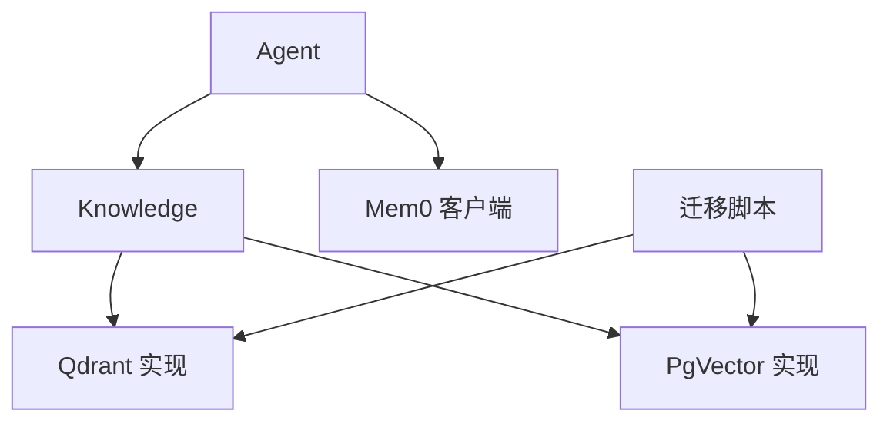

# 集成方案

<cite>
**本文引用的文件**
- [07_knowledge/05_integrations/vector_dbs/04_pgvector.py](file://cookbook/07_knowledge/05_integrations/vector_dbs/04_pgvector.py)
- [03_teams/15_distributed_rag/01_distributed_rag_pgvector.py](file://cookbook/03_teams/15_distributed_rag/01_distributed_rag_pgvector.py)
- [02_agents/07_knowledge/knowledge_filters.py](file://cookbook/02_agents/07_knowledge/knowledge_filters.py)
- [07_knowledge/04_advanced/04_knowledge_tools.py](file://cookbook/07_knowledge/04_advanced/04_knowledge_tools.py)
- [07_knowledge/04_advanced/05_knowledge_protocol.py](file://cookbook/07_knowledge/04_advanced/05_knowledge_protocol.py)
- [07_knowledge/03_production/02_knowledge_lifecycle.py](file://cookbook/07_knowledge/03_production/02_knowledge_lifecycle.py)
- [92_integrations/memory/mem0_integration.py](file://cookbook/92_integrations/memory/mem0_integration.py)
- [07_knowledge/05_integrations/vector_dbs/01_qdrant.py](file://cookbook/07_knowledge/05_integrations/vector_dbs/01_qdrant.py)
- [libs/agno/agno/vectordb/pgvector/pgvector.py](file://libs/agno/agno/vectordb/pgvector/pgvector.py)
- [libs/agno/agno/vectordb/qdrant/qdrant.py](file://libs/agno/agno/vectordb/qdrant/qdrant.py)
- [libs/agno/migrations/v1_to_v2/migrate_vectordbs_to_v2.py](file://libs/agno/migrations/v1_to_v2/migrate_vectordbs_to_v2.py)
- [scripts/run_pgvector.sh](file://cookbook/scripts/run_pgvector.sh)
- [scripts/run_qdrant.sh](file://cookbook/scripts/run_qdrant.sh)
</cite>

## 目录
1. [简介](#简介)
2. [项目结构](#项目结构)
3. [核心组件](#核心组件)
4. [架构总览](#架构总览)
5. [详细组件分析](#详细组件分析)
6. [依赖分析](#依赖分析)
7. [性能考虑](#性能考虑)
8. [故障排查指南](#故障排查指南)
9. [结论](#结论)
10. [附录](#附录)

## 简介
本集成方案面向知识管理系统与外部系统及服务的对接，覆盖以下方面：
- 云平台与企业系统集成：以 AWS S3 为例，演示从对象存储拉取文档并写入知识库；可类推至 Azure Blob、GCS 等。
- 文档读取器与内容处理：统一通过知识库的插入接口完成 PDF、网页、文本等多源内容的解析与嵌入。
- 向量数据库集成：重点对比 Qdrant 与 PostgreSQL + pgvector 的部署与使用方式；同时给出本地向量库与托管服务的通用配置思路。
- 团队化分布式 RAG：基于团队成员分工的向量检索、混合检索、校验与响应合成流程。
- 生产级知识生命周期：插入、去重、移除、跟踪与再索引。
- 外部记忆服务：以 Mem0 为例，展示如何将外部记忆注入到代理上下文。

## 项目结构
本仓库中与“集成方案”直接相关的示例主要集中在 cookbook 的知识管理与集成章节，核心路径如下：
- 知识管理与向量数据库：cookbook/07_knowledge/05_integrations/vector_dbs
- 分布式 RAG 示例：cookbook/03_teams/15_distributed_rag
- 知识过滤与协议扩展：cookbook/02_agents/07_knowledge 与 cookbook/07_knowledge/04_advanced
- 生产级知识生命周期：cookbook/07_knowledge/03_production
- 外部记忆服务集成：cookbook/92_integrations/memory
- 向量库实现与迁移：libs/agno/agno/vectordb/* 与 libs/agno/migrations/v1_to_v2

图示来源
- [07_knowledge/05_integrations/vector_dbs/04_pgvector.py:1-88](file://cookbook/07_knowledge/05_integrations/vector_dbs/04_pgvector.py#L1-L88)
- [07_knowledge/05_integrations/vector_dbs/01_qdrant.py](file://cookbook/07_knowledge/05_integrations/vector_dbs/01_qdrant.py)
- [03_teams/15_distributed_rag/01_distributed_rag_pgvector.py:1-200](file://cookbook/03_teams/15_distributed_rag/01_distributed_rag_pgvector.py#L1-L200)
- [02_agents/07_knowledge/knowledge_filters.py:1-71](file://cookbook/02_agents/07_knowledge/knowledge_filters.py#L1-L71)
- [07_knowledge/04_advanced/05_knowledge_protocol.py:1-98](file://cookbook/07_knowledge/04_advanced/05_knowledge_protocol.py#L1-L98)
- [07_knowledge/03_production/02_knowledge_lifecycle.py:1-92](file://cookbook/07_knowledge/03_production/02_knowledge_lifecycle.py#L1-L92)
- [92_integrations/memory/mem0_integration.py:1-55](file://cookbook/92_integrations/memory/mem0_integration.py#L1-L55)
- [libs/agno/agno/vectordb/pgvector/pgvector.py](file://libs/agno/agno/vectordb/pgvector/pgvector.py)
- [libs/agno/agno/vectordb/qdrant/qdrant.py](file://libs/agno/agno/vectordb/qdrant/qdrant.py)
- [libs/agno/migrations/v1_to_v2/migrate_vectordbs_to_v2.py](file://libs/agno/migrations/v1_to_v2/migrate_vectordbs_to_v2.py)

章节来源
- [07_knowledge/05_integrations/vector_dbs/04_pgvector.py:1-88](file://cookbook/07_knowledge/05_integrations/vector_dbs/04_pgvector.py#L1-L88)
- [03_teams/15_distributed_rag/01_distributed_rag_pgvector.py:1-200](file://cookbook/03_teams/15_distributed_rag/01_distributed_rag_pgvector.py#L1-L200)
- [02_agents/07_knowledge/knowledge_filters.py:1-71](file://cookbook/02_agents/07_knowledge/knowledge_filters.py#L1-L71)
- [07_knowledge/04_advanced/04_knowledge_tools.py:1-76](file://cookbook/07_knowledge/04_advanced/04_knowledge_tools.py#L1-L76)
- [07_knowledge/04_advanced/05_knowledge_protocol.py:1-98](file://cookbook/07_knowledge/04_advanced/05_knowledge_protocol.py#L1-L98)
- [07_knowledge/03_production/02_knowledge_lifecycle.py:1-92](file://cookbook/07_knowledge/03_production/02_knowledge_lifecycle.py#L1-L92)
- [92_integrations/memory/mem0_integration.py:1-55](file://cookbook/92_integrations/memory/mem0_integration.py#L1-L55)

## 核心组件
- 知识库与向量数据库
  - PgVector：在 PostgreSQL 中启用向量相似度检索，支持向量/关键词/混合检索，适合已有关系型数据栈的企业环境。
  - Qdrant：独立向量数据库，支持高效向量检索与标签过滤，适合快速原型与云原生部署。
- 文档读取与嵌入
  - 统一通过知识库的插入接口完成内容解析、分块与嵌入生成，支持 PDF、网页、文本等。
- 搜索与过滤
  - 静态过滤与动态过滤，结合标签字段进行检索限定。
- 协议扩展
  - KnowledgeProtocol 提供自定义知识源的最小接口，便于对接非标准来源或既有检索系统。
- 外部记忆服务
  - Mem0 集成示例展示如何将外部记忆注入代理上下文，增强长程对话能力。
- 生产生命周期
  - 插入、去重、移除、跟踪与再索引，确保知识库的持续演进。

章节来源
- [07_knowledge/05_integrations/vector_dbs/04_pgvector.py:1-88](file://cookbook/07_knowledge/05_integrations/vector_dbs/04_pgvector.py#L1-L88)
- [07_knowledge/05_integrations/vector_dbs/01_qdrant.py](file://cookbook/07_knowledge/05_integrations/vector_dbs/01_qdrant.py)
- [02_agents/07_knowledge/knowledge_filters.py:1-71](file://cookbook/02_agents/07_knowledge/knowledge_filters.py#L1-L71)
- [07_knowledge/04_advanced/05_knowledge_protocol.py:1-98](file://cookbook/07_knowledge/04_advanced/05_knowledge_protocol.py#L1-L98)
- [92_integrations/memory/mem0_integration.py:1-55](file://cookbook/92_integrations/memory/mem0_integration.py#L1-L55)
- [07_knowledge/03_production/02_knowledge_lifecycle.py:1-92](file://cookbook/07_knowledge/03_production/02_knowledge_lifecycle.py#L1-L92)

## 架构总览
下图展示了知识管理与外部系统的主要交互路径：内容源（如 S3）经由知识库插入，嵌入后写入向量数据库；代理在推理时根据配置执行向量/混合检索，并可结合过滤与协议扩展实现更复杂的检索逻辑。

图示来源
- [07_knowledge/05_integrations/vector_dbs/04_pgvector.py:1-88](file://cookbook/07_knowledge/05_integrations/vector_dbs/04_pgvector.py#L1-L88)
- [07_knowledge/05_integrations/vector_dbs/01_qdrant.py](file://cookbook/07_knowledge/05_integrations/vector_dbs/01_qdrant.py)
- [03_teams/15_distributed_rag/01_distributed_rag_pgvector.py:1-200](file://cookbook/03_teams/15_distributed_rag/01_distributed_rag_pgvector.py#L1-L200)

## 详细组件分析

### 云平台集成（AWS S3）
- 内容来源：示例中使用 S3 公共桶中的 PDF 文件作为知识源。
- 集成步骤
  - 准备知识库实例，配置嵌入模型与向量数据库。
  - 使用知识库的插入接口传入 S3 URL，自动完成下载、解析与嵌入。
  - 在代理中开启知识检索，即可对新内容进行问答。
- 可扩展性
  - 对于 Azure Blob/GCS 等对象存储，只需替换为对应 SDK 或 URL 即可复用相同流程。

图示来源
- [07_knowledge/05_integrations/vector_dbs/04_pgvector.py:58-87](file://cookbook/07_knowledge/05_integrations/vector_dbs/04_pgvector.py#L58-L87)
- [03_teams/15_distributed_rag/01_distributed_rag_pgvector.py:123-162](file://cookbook/03_teams/15_distributed_rag/01_distributed_rag_pgvector.py#L123-L162)

章节来源
- [07_knowledge/05_integrations/vector_dbs/04_pgvector.py:1-88](file://cookbook/07_knowledge/05_integrations/vector_dbs/04_pgvector.py#L1-L88)
- [03_teams/15_distributed_rag/01_distributed_rag_pgvector.py:1-200](file://cookbook/03_teams/15_distributed_rag/01_distributed_rag_pgvector.py#L1-L200)

### 文档读取器与内容处理策略
- 统一入口：知识库的插入接口负责下载、解析、分块与嵌入，屏蔽底层格式差异。
- 支持类型：PDF、网页、文本等，均可通过同一接口接入。
- 嵌入模型：示例中使用 OpenAIEmbedder，可按需替换为其他嵌入模型。
- 工具增强：KnowledgeTools 提供 think/search/analyze 等工具，提升代理对知识的推理与分析能力。

图示来源
- [07_knowledge/04_advanced/04_knowledge_tools.py:1-76](file://cookbook/07_knowledge/04_advanced/04_knowledge_tools.py#L1-L76)
- [07_knowledge/05_integrations/vector_dbs/04_pgvector.py:20-52](file://cookbook/07_knowledge/05_integrations/vector_dbs/04_pgvector.py#L20-L52)

章节来源
- [07_knowledge/04_advanced/04_knowledge_tools.py:1-76](file://cookbook/07_knowledge/04_advanced/04_knowledge_tools.py#L1-L76)
- [07_knowledge/05_integrations/vector_dbs/04_pgvector.py:1-88](file://cookbook/07_knowledge/05_integrations/vector_dbs/04_pgvector.py#L1-L88)

### 向量数据库集成方案（Qdrant 与 PostgreSQL + pgvector）
- Qdrant
  - 特点：独立向量数据库，支持标签过滤与混合检索，易于部署与扩展。
  - 示例：在知识库中配置 Qdrant 集合与嵌入模型，即可完成插入与检索。
- PostgreSQL + pgvector
  - 特点：在现有关系型数据库上启用向量检索，适合已有 Postgres 基础设施的企业。
  - 示例：通过 PgVector 连接串配置数据库连接，设置表名与搜索类型（向量/混合），并配置嵌入模型与重排序器。
- 本地与托管
  - 本地：使用脚本一键启动 Qdrant 或 PgVector 容器。
  - 托管：Qdrant Cloud、AWS OpenSearch/Aurora、Azure Cognitive Search、GCS 向量搜索等，遵循相同的客户端配置模式。

图示来源
- [07_knowledge/05_integrations/vector_dbs/01_qdrant.py](file://cookbook/07_knowledge/05_integrations/vector_dbs/01_qdrant.py)
- [07_knowledge/05_integrations/vector_dbs/04_pgvector.py:20-52](file://cookbook/07_knowledge/05_integrations/vector_dbs/04_pgvector.py#L20-L52)
- [libs/agno/agno/vectordb/qdrant/qdrant.py](file://libs/agno/agno/vectordb/qdrant/qdrant.py)
- [libs/agno/agno/vectordb/pgvector/pgvector.py](file://libs/agno/agno/vectordb/pgvector/pgvector.py)

章节来源
- [07_knowledge/05_integrations/vector_dbs/01_qdrant.py](file://cookbook/07_knowledge/05_integrations/vector_dbs/01_qdrant.py)
- [07_knowledge/05_integrations/vector_dbs/04_pgvector.py:1-88](file://cookbook/07_knowledge/05_integrations/vector_dbs/04_pgvector.py#L1-L88)
- [libs/agno/agno/vectordb/qdrant/qdrant.py](file://libs/agno/agno/vectordb/qdrant/qdrant.py)
- [libs/agno/agno/vectordb/pgvector/pgvector.py](file://libs/agno/agno/vectordb/pgvector/pgvector.py)

### 团队化分布式 RAG（基于 PgVector）
- 角色分工
  - 向量检索员：专注向量相似度检索。
  - 混合检索员：结合向量与关键词检索，扩大覆盖面。
  - 数据校验员：评估检索质量与一致性。
  - 响应合成员：整合信息并输出带引用的回答。
- 流程
  - 先向量检索，再混合检索，随后校验与合成，最终输出。
- 并发与异步：提供同步与异步两种演示，便于在不同运行环境中选择。

图示来源
- [03_teams/15_distributed_rag/01_distributed_rag_pgvector.py:41-117](file://cookbook/03_teams/15_distributed_rag/01_distributed_rag_pgvector.py#L41-L117)

章节来源
- [03_teams/15_distributed_rag/01_distributed_rag_pgvector.py:1-200](file://cookbook/03_teams/15_distributed_rag/01_distributed_rag_pgvector.py#L1-L200)

### 知识过滤与协议扩展
- 静态过滤：在代理创建时指定过滤条件（如按标签 cuisine=thai），所有检索均应用该条件。
- 动态过滤：允许代理根据用户问题动态选择过滤值，提升灵活性。
- 协议扩展：实现 KnowledgeProtocol 接口，即可将任意知识源（文件系统、API、数据库）无缝接入代理的检索流程。

图示来源
- [02_agents/07_knowledge/knowledge_filters.py:18-52](file://cookbook/02_agents/07_knowledge/knowledge_filters.py#L18-L52)
- [07_knowledge/04_advanced/05_knowledge_protocol.py:28-67](file://cookbook/07_knowledge/04_advanced/05_knowledge_protocol.py#L28-L67)

章节来源
- [02_agents/07_knowledge/knowledge_filters.py:1-71](file://cookbook/02_agents/07_knowledge/knowledge_filters.py#L1-L71)
- [07_knowledge/04_advanced/05_knowledge_protocol.py:1-98](file://cookbook/07_knowledge/04_advanced/05_knowledge_protocol.py#L1-L98)

### 生产级知识生命周期
- 目标：在生产环境中管理知识的全生命周期，避免重复处理、及时移除过期内容、跟踪状态并支持再索引。
- 关键步骤
  - 初始插入：首次入库并建立索引。
  - 去重插入：基于内容哈希跳过已存在内容。
  - 移除向量：按名称删除对应向量。
  - 跟踪与再索引：通过内容数据库记录状态，必要时触发再索引。
- 工具链：知识库内置方法与 SQLite 内容数据库配合使用。

图示来源
- [07_knowledge/03_production/02_knowledge_lifecycle.py:57-91](file://cookbook/07_knowledge/03_production/02_knowledge_lifecycle.py#L57-L91)

章节来源
- [07_knowledge/03_production/02_knowledge_lifecycle.py:1-92](file://cookbook/07_knowledge/03_production/02_knowledge_lifecycle.py#L1-L92)

### 外部记忆服务集成（Mem0）
- 目标：将外部记忆服务注入代理上下文，实现跨会话的记忆持久化与共享。
- 步骤
  - 初始化外部记忆客户端。
  - 将用户消息写入外部记忆。
  - 创建代理时将外部记忆作为依赖注入，并开启上下文注入。
  - 运行时可查看代理对历史信息的调用。

图示来源
- [92_integrations/memory/mem0_integration.py:12-55](file://cookbook/92_integrations/memory/mem0_integration.py#L12-L55)

章节来源
- [92_integrations/memory/mem0_integration.py:1-55](file://cookbook/92_integrations/memory/mem0_integration.py#L1-L55)

## 依赖分析
- 组件耦合
  - Knowledge 与向量数据库实现解耦，通过统一接口适配不同后端。
  - 代理与知识库通过检索开关与过滤器解耦，便于在不改变检索逻辑的情况下切换向量库。
- 外部依赖
  - Qdrant：通过 URL 连接，支持标签过滤与混合检索。
  - PgVector：通过数据库连接串，支持向量/关键词/混合检索与重排序。
  - 外部记忆服务：通过 SDK 客户端注入到代理上下文。
- 迁移与兼容
  - 提供向量库版本迁移脚本，指导从旧版本平滑升级。

图示来源
- [libs/agno/migrations/v1_to_v2/migrate_vectordbs_to_v2.py](file://libs/agno/migrations/v1_to_v2/migrate_vectordbs_to_v2.py)
- [libs/agno/agno/vectordb/qdrant/qdrant.py](file://libs/agno/agno/vectordb/qdrant/qdrant.py)
- [libs/agno/agno/vectordb/pgvector/pgvector.py](file://libs/agno/agno/vectordb/pgvector/pgvector.py)
- [92_integrations/memory/mem0_integration.py:12-17](file://cookbook/92_integrations/memory/mem0_integration.py#L12-L17)

章节来源
- [libs/agno/migrations/v1_to_v2/migrate_vectordbs_to_v2.py](file://libs/agno/migrations/v1_to_v2/migrate_vectordbs_to_v2.py)
- [libs/agno/agno/vectordb/qdrant/qdrant.py](file://libs/agno/agno/vectordb/qdrant/qdrant.py)
- [libs/agno/agno/vectordb/pgvector/pgvector.py](file://libs/agno/agno/vectordb/pgvector/pgvector.py)
- [92_integrations/memory/mem0_integration.py:1-55](file://cookbook/92_integrations/memory/mem0_integration.py#L1-L55)

## 性能考虑
- 向量检索
  - Qdrant：适合高并发与灵活标签过滤场景，注意集合与过滤器的合理设计。
  - PgVector：在已有 Postgres 基础设施上具备良好一致性与扩展性，适合混合查询与复杂 SQL 场景。
- 搜索类型
  - 向量检索：语义匹配强，适合模糊查询与概念检索。
  - 混合检索：兼顾语义与关键词，覆盖面更广。
  - 关键词检索：精确匹配，适合结构化字段过滤。
- 嵌入模型
  - 选择合适的嵌入维度与模型，平衡召回率与延迟。
- 过滤与协议
  - 静态过滤减少检索空间，提高命中质量。
  - 协议扩展可将已有检索系统纳入统一框架，降低迁移成本。

## 故障排查指南
- 启动与连接
  - Qdrant：确认容器或服务已启动，检查 URL 与网络连通性。
  - PgVector：确认数据库服务可用，检查连接串与权限。
- 插入失败
  - 检查内容 URL 是否可达，确认网络代理与证书配置。
  - 若重复插入导致异常，启用“已存在则跳过”策略。
- 检索无结果
  - 确认嵌入模型一致且向量已写入。
  - 调整阈值与搜索类型，尝试混合检索。
- 团队流程异常
  - 分别验证各成员的检索配置，确保知识库实例正确初始化。
- 外部记忆服务
  - 确认客户端 SDK 安装与认证配置，检查用户 ID 与消息格式。

章节来源
- [03_teams/15_distributed_rag/01_distributed_rag_pgvector.py:123-162](file://cookbook/03_teams/15_distributed_rag/01_distributed_rag_pgvector.py#L123-L162)
- [07_knowledge/03_production/02_knowledge_lifecycle.py:120-162](file://cookbook/07_knowledge/03_production/02_knowledge_lifecycle.py#L120-L162)
- [92_integrations/memory/mem0_integration.py:12-17](file://cookbook/92_integrations/memory/mem0_integration.py#L12-L17)

## 结论
本集成方案提供了从内容接入、向量检索、团队化分布式 RAG 到生产级生命周期管理的完整路径。Qdrant 与 PostgreSQL + pgvector 两种向量数据库方案分别适用于云原生与企业关系型数据栈场景；通过知识过滤与协议扩展，系统可灵活适配多种知识源；借助外部记忆服务与生产生命周期管理，可实现长期稳定的知识演进与服务可用性。

## 附录
- 部署脚本
  - Qdrant：./cookbook/scripts/run_qdrant.sh
  - PgVector：./cookbook/scripts/run_pgvector.sh
- 相关实现与迁移
  - Qdrant 实现：libs/agno/agno/vectordb/qdrant/qdrant.py
  - PgVector 实现：libs/agno/agno/vectordb/pgvector/pgvector.py
  - 迁移脚本：libs/agno/migrations/v1_to_v2/migrate_vectordbs_to_v2.py

章节来源
- [scripts/run_qdrant.sh](file://cookbook/scripts/run_qdrant.sh)
- [scripts/run_pgvector.sh](file://cookbook/scripts/run_pgvector.sh)
- [libs/agno/agno/vectordb/qdrant/qdrant.py](file://libs/agno/agno/vectordb/qdrant/qdrant.py)
- [libs/agno/agno/vectordb/pgvector/pgvector.py](file://libs/agno/agno/vectordb/pgvector/pgvector.py)
- [libs/agno/migrations/v1_to_v2/migrate_vectordbs_to_v2.py](file://libs/agno/migrations/v1_to_v2/migrate_vectordbs_to_v2.py)