# 高级功能

<cite>
**本文引用的文件**
- [04_knowledge_tools.py](file://cookbook/07_knowledge/04_advanced/04_knowledge_tools.py)
- [05_knowledge_protocol.py](file://cookbook/07_knowledge/04_advanced/05_knowledge_protocol.py)
- [custom_retriever.py](file://cookbook/02_agents/07_knowledge/custom_retriever.py)
- [01_chunking_strategies.py](file://cookbook/07_knowledge/02_building_blocks/01_chunking_strategies.py)
- [02_custom_chunking.py](file://cookbook/07_knowledge/04_advanced/02_custom_chunking.py)
- [code_chunking.py](file://cookbook/07_knowledge/09_archive/chunking/code_chunking.py)
- [csv_row_chunking.py](file://cookbook/07_knowledge/09_archive/chunking/csv_row_chunking.py)
- [03_graph_rag.py](file://cookbook/07_knowledge/04_advanced/03_graph_rag.py)
- [02_entity_relationships.md](file://cookbook/08_learning/04_entity_memory/02_entity_relationships.md)
- [traditional_rag.md](file://cookbook/02_agents/07_knowledge/traditional_rag.md)
- [01_distributed_rag_pgvector.md](file://cookbook/03_teams/15_distributed_rag/01_distributed_rag_pgvector.md)
- [05_knowledge_search.py](file://cookbook/05_agent_os/client/05_knowledge_search.py)
- [agentos_knowledge.py](file://cookbook/05_agent_os/knowledge/agentos_knowledge.py)
- [multiple_knowledge_bases.py](file://cookbook/05_agent_os/advanced_demo/multiple_knowledge_bases.py)
- [surrealdb.py](file://libs/agno/agno/db/surrealdb/surrealdb.py)
</cite>

## 目录
1. [简介](#简介)
2. [项目结构](#项目结构)
3. [核心组件](#核心组件)
4. [架构总览](#架构总览)
5. [详细组件分析](#详细组件分析)
6. [依赖分析](#依赖分析)
7. [性能考虑](#性能考虑)
8. [故障排查指南](#故障排查指南)
9. [结论](#结论)
10. [附录](#附录)

## 简介
本章节聚焦于知识管理系统的高级特性与定制化能力，涵盖以下主题：
- 自定义检索器的开发与集成：通过提供自定义检索函数或实现知识协议，将任意数据源与检索流程对接。
- 自定义分块策略：针对代码、表格等特殊格式，实现专用的文本切分逻辑，提升检索质量。
- 图谱RAG（Graph RAG）：利用知识图谱增强检索与推理，支持多跳关联与结构化关系查询。
- 知识工具：将外部API与业务逻辑无缝集成到知识检索流程中，实现“思考-检索-分析”的闭环。
- 知识协议标准化：通过统一接口抽象，实现非标准知识源的可插拔接入，提升系统互操作性。

## 项目结构
围绕高级功能的相关示例主要分布在以下路径：
- cookbook/02_agents/07_knowledge：传统RAG、自定义检索器、知识过滤器等基础与进阶示例
- cookbook/07_knowledge/02_building_blocks：分块策略对比与实现
- cookbook/07_knowledge/04_advanced：知识工具、知识协议、图谱RAG等高级示例
- cookbook/03_teams/15_distributed_rag：分布式RAG团队协作示例
- cookbook/05_agent_os：Agent OS中的知识搜索与多知识库场景
- libs/agno：知识库、向量数据库、SurrealDB等底层实现

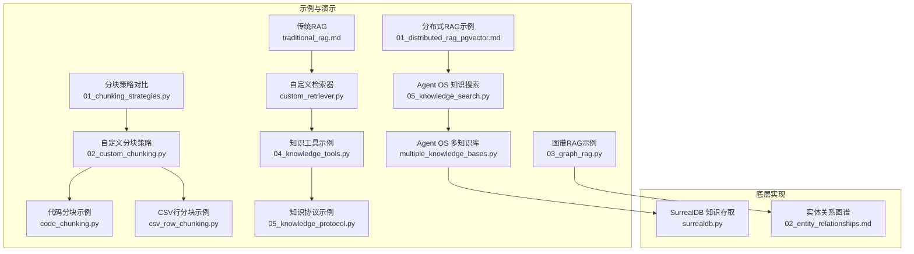

**图表来源**
- [traditional_rag.md](file://cookbook/02_agents/07_knowledge/traditional_rag.md)
- [custom_retriever.py](file://cookbook/02_agents/07_knowledge/custom_retriever.py)
- [01_chunking_strategies.py](file://cookbook/07_knowledge/02_building_blocks/01_chunking_strategies.py)
- [02_custom_chunking.py](file://cookbook/07_knowledge/04_advanced/02_custom_chunking.py)
- [code_chunking.py](file://cookbook/07_knowledge/09_archive/chunking/code_chunking.py)
- [csv_row_chunking.py](file://cookbook/07_knowledge/09_archive/chunking/csv_row_chunking.py)
- [03_graph_rag.py](file://cookbook/07_knowledge/04_advanced/03_graph_rag.py)
- [04_knowledge_tools.py](file://cookbook/07_knowledge/04_advanced/04_knowledge_tools.py)
- [05_knowledge_protocol.py](file://cookbook/07_knowledge/04_advanced/05_knowledge_protocol.py)
- [01_distributed_rag_pgvector.md](file://cookbook/03_teams/15_distributed_rag/01_distributed_rag_pgvector.md)
- [05_knowledge_search.py](file://cookbook/05_agent_os/client/05_knowledge_search.py)
- [multiple_knowledge_bases.py](file://cookbook/05_agent_os/advanced_demo/multiple_knowledge_bases.py)
- [surrealdb.py](file://libs/agno/agno/db/surrealdb/surrealdb.py)
- [02_entity_relationships.md](file://cookbook/08_learning/04_entity_memory/02_entity_relationships.md)

**章节来源**
- [01_chunking_strategies.py](file://cookbook/07_knowledge/02_building_blocks/01_chunking_strategies.py)
- [02_custom_chunking.py](file://cookbook/07_knowledge/04_advanced/02_custom_chunking.py)
- [code_chunking.py](file://cookbook/07_knowledge/09_archive/chunking/code_chunking.py)
- [csv_row_chunking.py](file://cookbook/07_knowledge/09_archive/chunking/csv_row_chunking.py)
- [03_graph_rag.py](file://cookbook/07_knowledge/04_advanced/03_graph_rag.py)
- [04_knowledge_tools.py](file://cookbook/07_knowledge/04_advanced/04_knowledge_tools.py)
- [05_knowledge_protocol.py](file://cookbook/07_knowledge/04_advanced/05_knowledge_protocol.py)
- [custom_retriever.py](file://cookbook/02_agents/07_knowledge/custom_retriever.py)
- [01_distributed_rag_pgvector.md](file://cookbook/03_teams/15_distributed_rag/01_distributed_rag_pgvector.md)
- [05_knowledge_search.py](file://cookbook/05_agent_os/client/05_knowledge_search.py)
- [multiple_knowledge_bases.py](file://cookbook/05_agent_os/advanced_demo/multiple_knowledge_bases.py)
- [surrealdb.py](file://libs/agno/agno/db/surrealdb/surrealdb.py)
- [02_entity_relationships.md](file://cookbook/08_learning/04_entity_memory/02_entity_relationships.md)

## 核心组件
- 自定义检索器：通过传入可调用对象替代默认知识库检索，实现对任意数据源的检索集成。
- 分块策略：内置多种分块策略（固定大小、递归、语义、文档、Markdown、代码、智能体驱动），并支持自定义策略以适配特殊内容。
- 图谱RAG：基于LightRAG的托管知识后端，自动抽取实体与关系，构建知识图谱，支持多跳推理与图遍历查询。
- 知识工具：封装“思考-检索-分析”三段式工具集，将复杂检索与分析流程以工具形式暴露给智能体。
- 知识协议：统一接口抽象，允许将非标准知识源（文件系统、API、数据库）无缝接入系统。
- 分布式RAG团队：通过多个专门成员分别负责向量检索、混合检索、数据验证与响应组合，实现高精度的多阶段检索。

**章节来源**
- [custom_retriever.py](file://cookbook/02_agents/07_knowledge/custom_retriever.py)
- [01_chunking_strategies.py](file://cookbook/07_knowledge/02_building_blocks/01_chunking_strategies.py)
- [02_custom_chunking.py](file://cookbook/07_knowledge/04_advanced/02_custom_chunking.py)
- [03_graph_rag.py](file://cookbook/07_knowledge/04_advanced/03_graph_rag.py)
- [04_knowledge_tools.py](file://cookbook/07_knowledge/04_advanced/04_knowledge_tools.py)
- [05_knowledge_protocol.py](file://cookbook/07_knowledge/04_advanced/05_knowledge_protocol.py)
- [01_distributed_rag_pgvector.md](file://cookbook/03_teams/15_distributed_rag/01_distributed_rag_pgvector.md)

## 架构总览
下图展示了从“查询输入”到“检索与推理输出”的整体流程，包含传统RAG与图谱RAG两条主线，并覆盖自定义检索器、分块策略与知识协议的集成点。

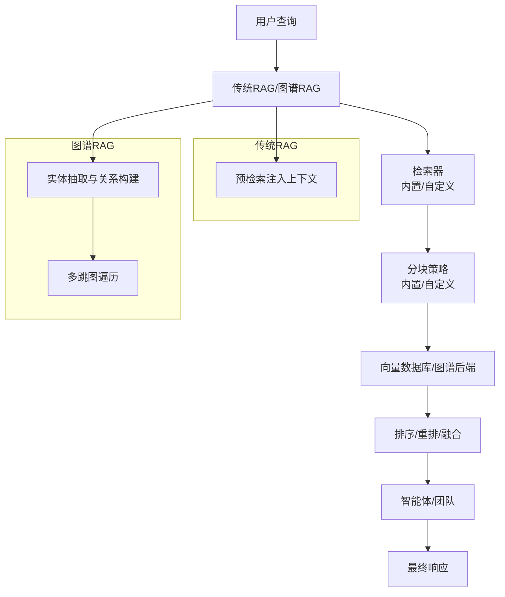

**图表来源**
- [traditional_rag.md](file://cookbook/02_agents/07_knowledge/traditional_rag.md)
- [03_graph_rag.py](file://cookbook/07_knowledge/04_advanced/03_graph_rag.py)
- [custom_retriever.py](file://cookbook/02_agents/07_knowledge/custom_retriever.py)
- [01_chunking_strategies.py](file://cookbook/07_knowledge/02_building_blocks/01_chunking_strategies.py)
- [02_custom_chunking.py](file://cookbook/07_knowledge/04_advanced/02_custom_chunking.py)

## 详细组件分析

### 自定义检索器：开发与集成
- 设计目标：允许将任意数据源（内存列表、外部API、数据库）作为检索器直接注入到智能体中，无需依赖标准知识库。
- 关键点：
  - 通过传入可调用对象替代默认知识库，实现“按需检索”。
  - 支持同步/异步检索接口，便于与现有系统对接。
  - 可结合知识过滤器实现动态筛选。
- 典型用法：
  - 内存检索器：基于关键字匹配返回文档集合。
  - 外部API检索器：在生产环境中调用REST API或数据库查询。
- 适用场景：
  - 快速原型验证、内部私有数据源、第三方服务集成。

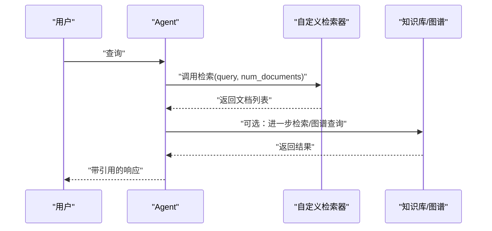

**图表来源**
- [custom_retriever.py](file://cookbook/02_agents/07_knowledge/custom_retriever.py)

**章节来源**
- [custom_retriever.py](file://cookbook/02_agents/07_knowledge/custom_retriever.py)

### 自定义分块策略：实现原理与应用
- 设计目标：针对不同内容类型（代码、表格、Markdown、PDF等）定制切分逻辑，提升嵌入质量与检索精度。
- 内置策略概览：
  - 固定大小、递归分割、语义分组、文档结构、Markdown标题、代码节点、智能体驱动。
- 自定义策略实现要点：
  - 实现分块策略接口，接收文档并返回分块后的文档列表。
  - 保留元数据（如分块索引、策略标识），便于溯源与优化。
- 应用场景：
  - 代码分块：按函数/类边界切分，保持语义完整性。
  - CSV行分块：逐行切分，适合结构化查询。
  - 自定义策略：法律条款、医疗记录等专业领域。

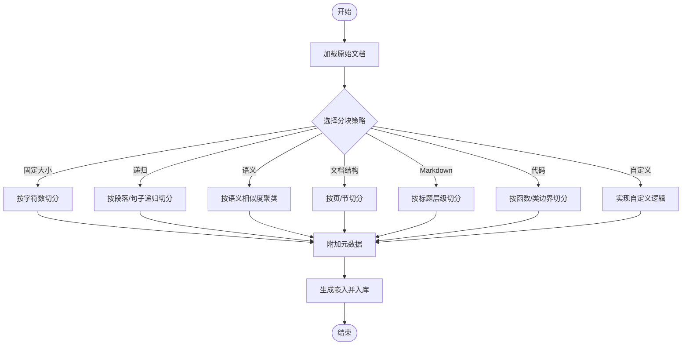

**图表来源**
- [01_chunking_strategies.py](file://cookbook/07_knowledge/02_building_blocks/01_chunking_strategies.py)
- [02_custom_chunking.py](file://cookbook/07_knowledge/04_advanced/02_custom_chunking.py)
- [code_chunking.py](file://cookbook/07_knowledge/09_archive/chunking/code_chunking.py)
- [csv_row_chunking.py](file://cookbook/07_knowledge/09_archive/chunking/csv_row_chunking.py)

**章节来源**
- [01_chunking_strategies.py](file://cookbook/07_knowledge/02_building_blocks/01_chunking_strategies.py)
- [02_custom_chunking.py](file://cookbook/07_knowledge/04_advanced/02_custom_chunking.py)
- [code_chunking.py](file://cookbook/07_knowledge/09_archive/chunking/code_chunking.py)
- [csv_row_chunking.py](file://cookbook/07_knowledge/09_archive/chunking/csv_row_chunking.py)

### 图谱RAG（Graph RAG）：概念与实现
- 概念说明：
  - 与传统向量RAG不同，图谱RAG从文档中抽取实体与关系，构建知识图谱，支持多跳推理与图遍历查询。
  - 适用于需要跨实体关联、因果关系、依赖关系等复杂推理的场景。
- 实现方式：
  - 使用LightRAG托管后端，自动完成实体抽取、关系提取与图构建。
  - 将文档写入图谱后端，查询时可执行图遍历与多跳检索。
- 适用场景：
  - 法律案例检索、供应链风险分析、产品依赖关系梳理。

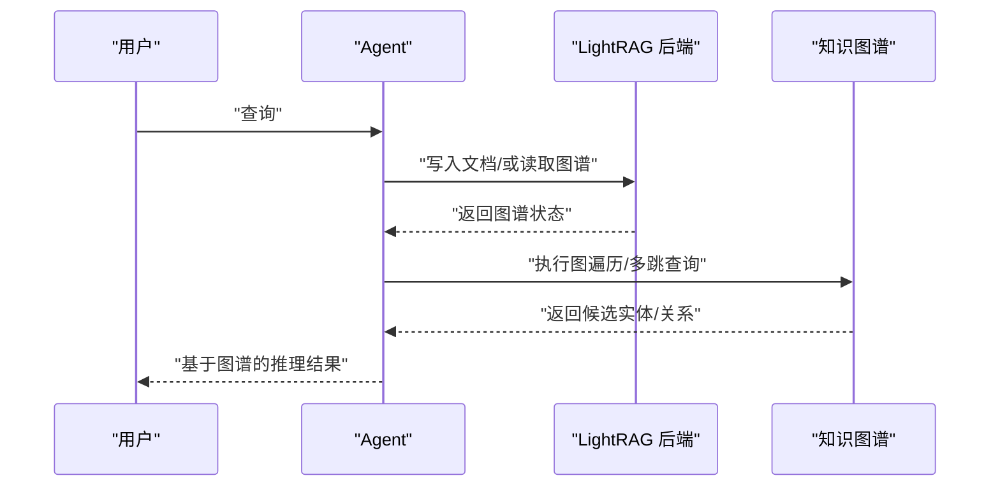

**图表来源**
- [03_graph_rag.py](file://cookbook/07_knowledge/04_advanced/03_graph_rag.py)

**章节来源**
- [03_graph_rag.py](file://cookbook/07_knowledge/04_advanced/03_graph_rag.py)
- [02_entity_relationships.md](file://cookbook/08_learning/04_entity_memory/02_entity_relationships.md)

### 知识工具：将外部API与业务逻辑集成
- 能力概述：
  - 提供“思考-检索-分析”三段式工具集，使智能体具备更丰富的知识交互能力。
  - 可启用思考模式、搜索模式与分析模式，支持few-shot提示增强。
- 集成要点：
  - 将知识工具注册为智能体工具，使其在对话中按需调用。
  - 结合知识过滤器与检索器，实现更精准的检索与引用。
- 适用场景：
  - 需要智能体在回答前进行推理与分析的复杂问答。

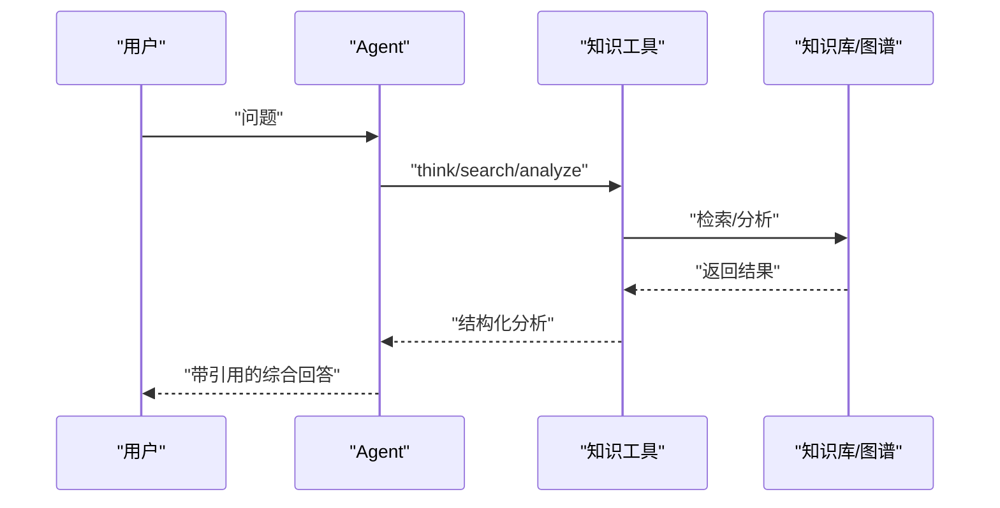

**图表来源**
- [04_knowledge_tools.py](file://cookbook/07_knowledge/04_advanced/04_knowledge_tools.py)

**章节来源**
- [04_knowledge_tools.py](file://cookbook/07_knowledge/04_advanced/04_knowledge_tools.py)

### 知识协议：标准化实现与互操作性
- 接口目标：
  - 定义统一的知识源接口，支持非标准来源（文件系统、API、数据库）的接入。
  - 规范上下文构建、工具获取与检索能力，确保与智能体生态兼容。
- 关键方法：
  - 构建上下文：用于指导智能体如何使用知识源。
  - 获取工具：返回可用工具列表（同步/异步）。
  - 检索能力：可选实现同步/异步检索，支持search_knowledge特性。
- 适用场景：
  - 企业内部历史系统、遗留数据库、私有API网关等。

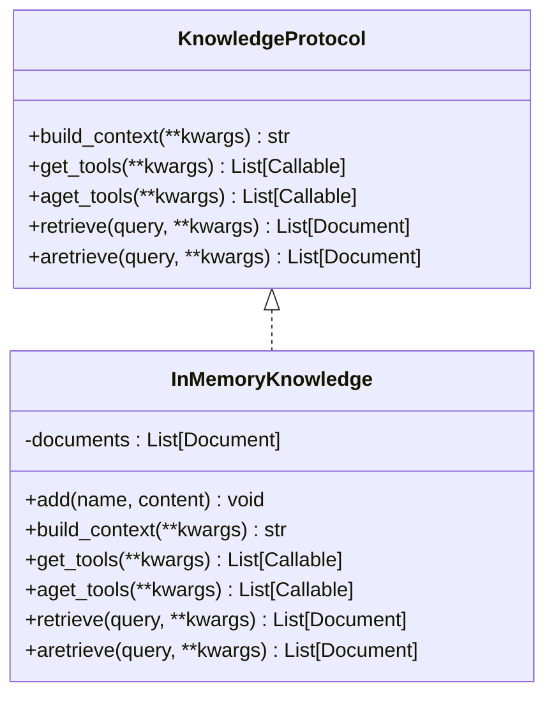

**图表来源**
- [05_knowledge_protocol.py](file://cookbook/07_knowledge/04_advanced/05_knowledge_protocol.py)

**章节来源**
- [05_knowledge_protocol.py](file://cookbook/07_knowledge/04_advanced/05_knowledge_protocol.py)

### 分布式RAG团队：多阶段检索与协作
- 设计思想：
  - 将RAG流程拆分为多个专门成员：向量检索、混合检索、数据验证、响应组合。
  - 不同成员挂载不同知识库实例，通过团队协调器串联，实现高精度与高鲁棒性的检索。
- 关键配置：
  - 向量检索：仅向量相似度。
  - 混合检索：向量+BM25文本联合检索。
  - 数据验证与响应组合：对检索结果进行质量评估与最终整合。
- 适用场景：
  - 企业级知识库、多源异构数据融合、高精度问答系统。

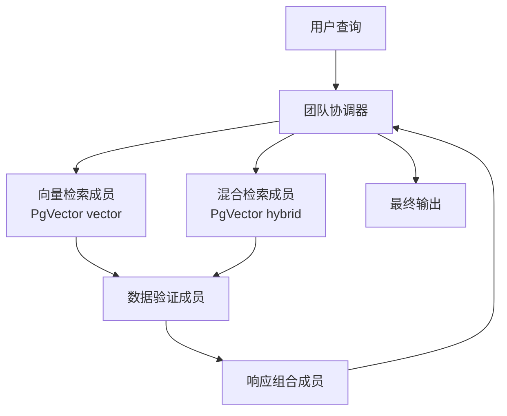

**图表来源**
- [01_distributed_rag_pgvector.md](file://cookbook/03_teams/15_distributed_rag/01_distributed_rag_pgvector.md)

**章节来源**
- [01_distributed_rag_pgvector.md](file://cookbook/03_teams/15_distributed_rag/01_distributed_rag_pgvector.md)

### 传统RAG与Agentic RAG：检索时机差异
- 传统RAG（Traditional RAG）：
  - 在构建用户消息时自动检索并将结果以引用注入上下文，不注册为工具。
  - 优点：简单直接，适合静态上下文注入。
- Agentic RAG（Agentic RAG）：
  - 在模型推理过程中按需检索，可注册为工具由模型自主决定是否调用。
  - 优点：灵活性强，适合复杂推理与动态检索。

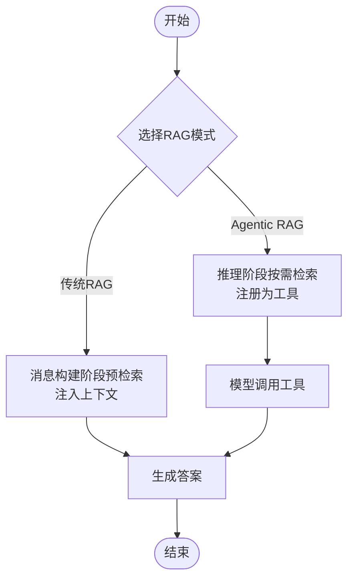

**图表来源**
- [traditional_rag.md](file://cookbook/02_agents/07_knowledge/traditional_rag.md)

**章节来源**
- [traditional_rag.md](file://cookbook/02_agents/07_knowledge/traditional_rag.md)

### Agent OS中的知识搜索与多知识库
- 知识搜索客户端：演示如何在Agent OS中发起知识搜索请求，支持流式输出与Markdown格式。
- 多知识库场景：在同一团队或工作流中挂载多个知识库实例，实现跨库检索与融合。
- SurrealDB知识存取：提供知识内容的增删改查与分页查询能力，支撑知识管理的持久化与检索。

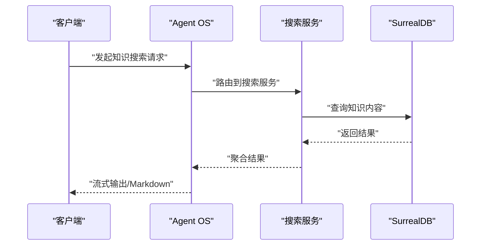

**图表来源**
- [05_knowledge_search.py](file://cookbook/05_agent_os/client/05_knowledge_search.py)
- [multiple_knowledge_bases.py](file://cookbook/05_agent_os/advanced_demo/multiple_knowledge_bases.py)
- [surrealdb.py](file://libs/agno/agno/db/surrealdb/surrealdb.py)

**章节来源**
- [05_knowledge_search.py](file://cookbook/05_agent_os/client/05_knowledge_search.py)
- [multiple_knowledge_bases.py](file://cookbook/05_agent_os/advanced_demo/multiple_knowledge_bases.py)
- [surrealdb.py](file://libs/agno/agno/db/surrealdb/surrealdb.py)

## 依赖分析
- 组件耦合关系：
  - 智能体与检索器解耦：通过可调用对象或协议接口实现灵活替换。
  - 分块策略与向量数据库解耦：策略仅负责切分，入库与检索由数据库层负责。
  - 图谱RAG与传统RAG解耦：二者可并存，依据场景选择合适方案。
- 外部依赖与集成点：
  - 向量数据库：Qdrant、PgVector、LanceDB等。
  - 图谱后端：LightRAG托管服务。
  - 存储后端：SurrealDB、PostgreSQL等。
- 循环依赖与风险控制：
  - 通过接口抽象避免循环依赖；检索器与策略均通过接口约束，降低耦合。

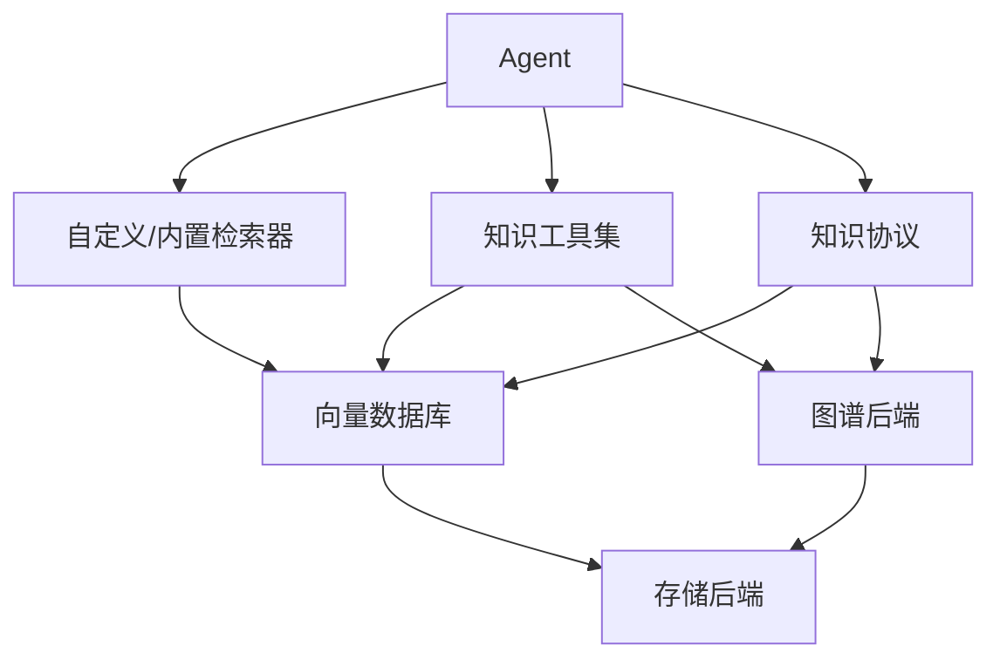

**图表来源**
- [custom_retriever.py](file://cookbook/02_agents/07_knowledge/custom_retriever.py)
- [04_knowledge_tools.py](file://cookbook/07_knowledge/04_advanced/04_knowledge_tools.py)
- [05_knowledge_protocol.py](file://cookbook/07_knowledge/04_advanced/05_knowledge_protocol.py)
- [03_graph_rag.py](file://cookbook/07_knowledge/04_advanced/03_graph_rag.py)

**章节来源**
- [custom_retriever.py](file://cookbook/02_agents/07_knowledge/custom_retriever.py)
- [04_knowledge_tools.py](file://cookbook/07_knowledge/04_advanced/04_knowledge_tools.py)
- [05_knowledge_protocol.py](file://cookbook/07_knowledge/04_advanced/05_knowledge_protocol.py)
- [03_graph_rag.py](file://cookbook/07_knowledge/04_advanced/03_graph_rag.py)

## 性能考虑
- 检索性能：
  - 向量检索适合大规模语义相似度匹配；混合检索兼顾关键词与语义，但开销更高。
  - 图谱RAG在多跳查询时计算复杂度上升，建议限制跳数与候选规模。
- 分块策略：
  - 固定大小与递归策略开销较低；语义与智能体驱动策略准确率更高但成本更高。
  - 针对代码与表格等特殊格式采用专用分块策略，可显著提升检索命中率。
- 并发与流式：
  - 使用异步插入与检索提升吞吐；流式输出改善用户体验。
- 存储与索引：
  - 选择合适的向量数据库与索引参数；合理设置分页与排序策略。

## 故障排查指南
- LightRAG未安装：
  - 现象：导入失败并提示安装依赖。
  - 处理：安装指定依赖包后重试。
- 知识协议未实现必要方法：
  - 现象：工具注册或检索功能异常。
  - 处理：确保实现上下文构建、工具获取与检索接口。
- 自定义检索器返回空结果：
  - 现象：检索器返回None或空列表。
  - 处理：检查查询关键字匹配逻辑与返回格式，确保与智能体期望一致。
- 分块策略导致检索质量下降：
  - 现象：检索命中率低或上下文不完整。
  - 处理：调整分块大小、边界规则或切换到更合适的策略。
- 分布式RAG团队协调器超时：
  - 现象：成员间通信延迟或结果聚合耗时过长。
  - 处理：优化成员职责划分、增加缓存与并发控制。

**章节来源**
- [03_graph_rag.py](file://cookbook/07_knowledge/04_advanced/03_graph_rag.py)
- [05_knowledge_protocol.py](file://cookbook/07_knowledge/04_advanced/05_knowledge_protocol.py)
- [custom_retriever.py](file://cookbook/02_agents/07_knowledge/custom_retriever.py)
- [01_chunking_strategies.py](file://cookbook/07_knowledge/02_building_blocks/01_chunking_strategies.py)
- [01_distributed_rag_pgvector.md](file://cookbook/03_teams/15_distributed_rag/01_distributed_rag_pgvector.md)

## 结论
本章节系统梳理了知识管理系统的高级功能与定制化能力，包括：
- 通过自定义检索器与知识协议实现任意数据源的无缝接入；
- 通过分块策略适配代码、表格等特殊格式，提升检索质量；
- 通过图谱RAG增强多跳推理与关系查询能力；
- 通过知识工具将外部API与业务逻辑融入智能体；
- 通过标准化知识协议与分布式RAG团队提升系统的可扩展性与互操作性。

这些能力共同构成了面向企业级应用的高阶知识管理基础设施，既满足快速迭代的敏捷需求，又兼顾长期演进的稳定性与可维护性。

## 附录
- 相关示例文件清单（按主题分类）
  - 自定义检索器与知识协议：[custom_retriever.py](file://cookbook/02_agents/07_knowledge/custom_retriever.py)、[05_knowledge_protocol.py](file://cookbook/07_knowledge/04_advanced/05_knowledge_protocol.py)
  - 分块策略：[01_chunking_strategies.py](file://cookbook/07_knowledge/02_building_blocks/01_chunking_strategies.py)、[02_custom_chunking.py](file://cookbook/07_knowledge/04_advanced/02_custom_chunking.py)、[code_chunking.py](file://cookbook/07_knowledge/09_archive/chunking/code_chunking.py)、[csv_row_chunking.py](file://cookbook/07_knowledge/09_archive/chunking/csv_row_chunking.py)
  - 图谱RAG：[03_graph_rag.py](file://cookbook/07_knowledge/04_advanced/03_graph_rag.py)、[02_entity_relationships.md](file://cookbook/08_learning/04_entity_memory/02_entity_relationships.md)
  - 知识工具：[04_knowledge_tools.py](file://cookbook/07_knowledge/04_advanced/04_knowledge_tools.py)
  - 分布式RAG团队：[01_distributed_rag_pgvector.md](file://cookbook/03_teams/15_distributed_rag/01_distributed_rag_pgvector.md)
  - Agent OS知识搜索与多知识库：[05_knowledge_search.py](file://cookbook/05_agent_os/client/05_knowledge_search.py)、[multiple_knowledge_bases.py](file://cookbook/05_agent_os/advanced_demo/multiple_knowledge_bases.py)
  - 存储与知识存取：[surrealdb.py](file://libs/agno/agno/db/surrealdb/surrealdb.py)