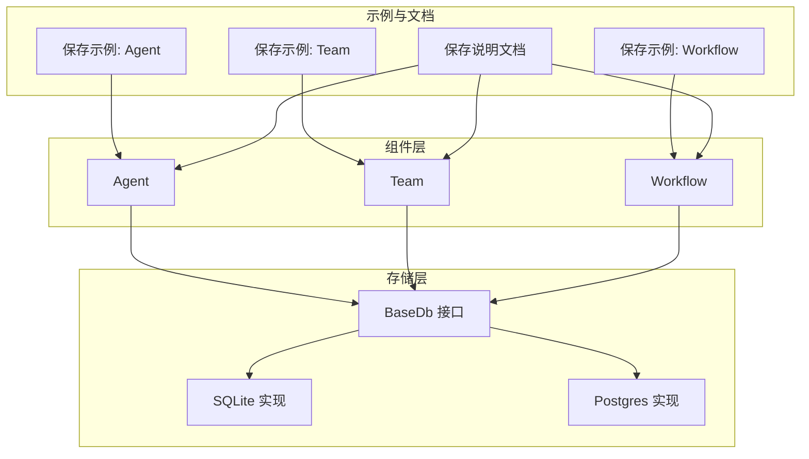
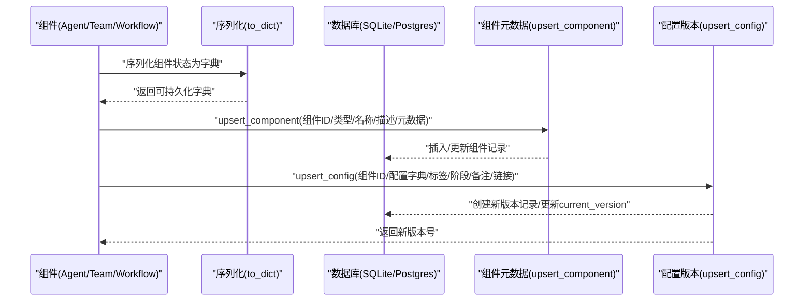
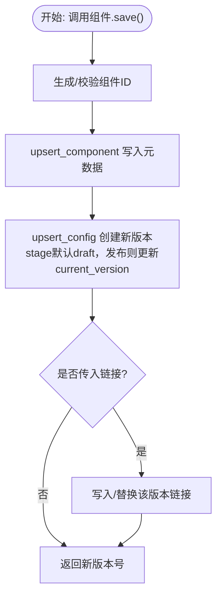
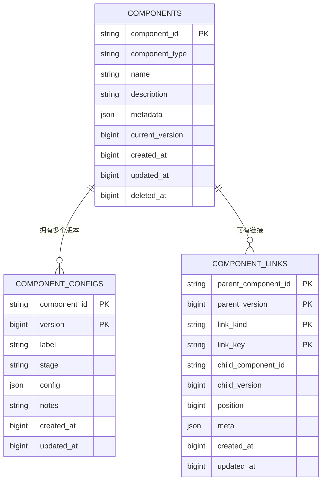
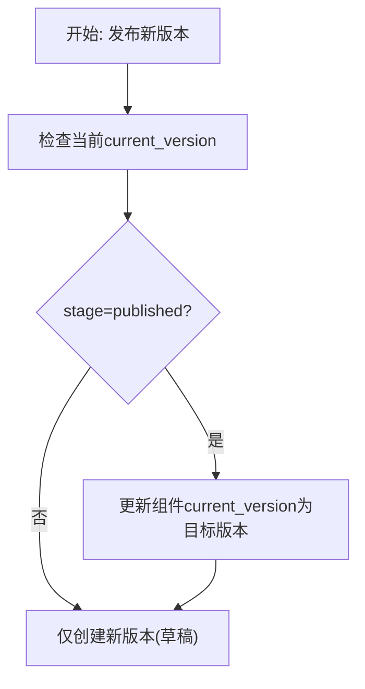
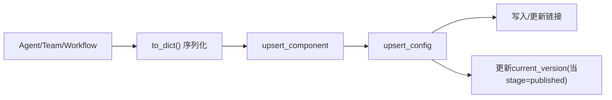

# 组件保存

<cite>
**本文档引用的文件**
- [libs/agno/agno/db/sqlite/sqlite.py](file://libs/agno/agno/db/sqlite/sqlite.py)
- [libs/agno/agno/db/postgres/postgres.py](file://libs/agno/agno/db/postgres/postgres.py)
- [libs/agno/agno/db/sqlite/schemas.py](file://libs/agno/agno/db/sqlite/schemas.py)
- [cookbook/93_components/save_agent.py](file://cookbook/93_components/save_agent.py)
- [cookbook/93_components/save_team.py](file://cookbook/93_components/save_team.py)
- [cookbook/93_components/save_workflow.py](file://cookbook/93_components/save_workflow.py)
- [cookbook/93_components/save_agent.md](file://cookbook/93_components/save_agent.md)
- [libs/agno/agno/agent/agent.py](file://libs/agno/agno/agent/agent.py)
- [libs/agno/agno/team/team.py](file://libs/agno/agno/team/team.py)
- [libs/agno/agno/workflow/workflow.py](file://libs/agno/agno/workflow/workflow.py)
</cite>

## 目录
1. [简介](#简介)
2. [项目结构](#项目结构)
3. [核心组件](#核心组件)
4. [架构总览](#架构总览)
5. [详细组件分析](#详细组件分析)
6. [依赖关系分析](#依赖关系分析)
7. [性能考虑](#性能考虑)
8. [故障排查指南](#故障排查指南)
9. [结论](#结论)
10. [附录](#附录)

## 简介
本章节概述组件保存功能的目标与范围：对 Agent、Team、Workflow 等“组件”进行持久化，包括组件元数据、配置版本、依赖链接、软/硬删除与版本回滚等能力。文档将从实现机制、触发时机、版本管理、共享与权限、性能优化、配置选项与自定义方法等方面系统阐述，并提供可操作的使用指南与最佳实践。

## 项目结构
组件保存涉及以下关键层次：
- 组件层：Agent、Team、Workflow 提供 save/load 接口与内部序列化能力
- 数据库层：SQLite/Postgres 实现组件表、配置表、链接表的 upsert、查询、版本管理
- 示例与文档：cookbook 中的保存示例与说明文档

**图表来源**
- [libs/agno/agno/agent/agent.py](file://libs/agno/agno/agent/agent.py)
- [libs/agno/agno/team/team.py](file://libs/agno/agno/team/team.py)
- [libs/agno/agno/workflow/workflow.py](file://libs/agno/agno/workflow/workflow.py)
- [libs/agno/agno/db/sqlite/sqlite.py](file://libs/agno/agno/db/sqlite/sqlite.py)
- [libs/agno/agno/db/postgres/postgres.py](file://libs/agno/agno/db/postgres/postgres.py)
- [cookbook/93_components/save_agent.py](file://cookbook/93_components/save_agent.py)
- [cookbook/93_components/save_team.py](file://cookbook/93_components/save_team.py)
- [cookbook/93_components/save_workflow.py](file://cookbook/93_components/save_workflow.py)
- [cookbook/93_components/save_agent.md](file://cookbook/93_components/save_agent.md)

**章节来源**
- [libs/agno/agno/agent/agent.py](file://libs/agno/agno/agent/agent.py)
- [libs/agno/agno/team/team.py](file://libs/agno/agno/team/team.py)
- [libs/agno/agno/workflow/workflow.py](file://libs/agno/agno/workflow/workflow.py)
- [libs/agno/agno/db/sqlite/sqlite.py](file://libs/agno/agno/db/sqlite/sqlite.py)
- [libs/agno/agno/db/postgres/postgres.py](file://libs/agno/agno/db/postgres/postgres.py)
- [cookbook/93_components/save_agent.py](file://cookbook/93_components/save_agent.py)
- [cookbook/93_components/save_team.py](file://cookbook/93_components/save_team.py)
- [cookbook/93_components/save_workflow.py](file://cookbook/93_components/save_workflow.py)
- [cookbook/93_components/save_agent.md](file://cookbook/93_components/save_agent.md)

## 核心组件
- 组件接口与序列化
  - Agent/Team/Workflow 提供 save()/load() 与内部序列化 to_dict()/from_dict()，用于将组件状态转换为可持久化结构
- 数据库存储
  - SQLite/Postgres 实现 upsert_component/upsert_config/get_config/delete_component 等方法，支撑组件元数据、配置版本、链接与软删除
- 版本管理
  - 每次保存创建新版本；current_version 指向已发布版本；支持标签 label、阶段 stage（draft/published）、备注 notes
- 依赖与链接
  - 支持在保存时写入组件间的链接（父子版本、链接类型、位置、元信息），用于构建组件图谱

**章节来源**
- [libs/agno/agno/agent/agent.py](file://libs/agno/agno/agent/agent.py)
- [libs/agno/agno/team/team.py](file://libs/agno/agno/team/team.py)
- [libs/agno/agno/workflow/workflow.py](file://libs/agno/agno/workflow/workflow.py)
- [libs/agno/agno/db/sqlite/sqlite.py](file://libs/agno/agno/db/sqlite/sqlite.py)
- [libs/agno/agno/db/postgres/postgres.py](file://libs/agno/agno/db/postgres/postgres.py)
- [libs/agno/agno/db/sqlite/schemas.py](file://libs/agno/agno/db/sqlite/schemas.py)

## 架构总览
组件保存的整体流程如下：
- 组件调用 save()，内部序列化为字典
- upsert_component 写入/更新组件元数据（名称、描述、元数据、当前版本指针）
- upsert_config 创建新版本配置（阶段默认 draft，发布后设为 published 并更新 current_version）
- 可选：写入链接（父组件、父版本、子组件、子版本、链接键、位置、元信息）

**图表来源**
- [libs/agno/agno/db/sqlite/sqlite.py](file://libs/agno/agno/db/sqlite/sqlite.py)
- [libs/agno/agno/db/postgres/postgres.py](file://libs/agno/agno/db/postgres/postgres.py)
- [cookbook/93_components/save_agent.md](file://cookbook/93_components/save_agent.md)

## 详细组件分析

### 组件保存触发与执行流程
- 触发时机
  - 手动保存：组件实例调用 save()，返回新版本号
  - 自动保存：当前实现以手动为主；如需自动保存，可通过业务层在关键变更点显式调用
- 执行步骤
  - 生成/校验组件 ID
  - upsert_component 写入元数据
  - upsert_config 创建新版本，若 stage=published 则更新组件 current_version
  - 可选写入链接，覆盖该版本的链接集

**图表来源**
- [cookbook/93_components/save_agent.md](file://cookbook/93_components/save_agent.md)
- [libs/agno/agno/db/sqlite/sqlite.py](file://libs/agno/agno/db/sqlite/sqlite.py)
- [libs/agno/agno/db/postgres/postgres.py](file://libs/agno/agno/db/postgres/postgres.py)

**章节来源**
- [cookbook/93_components/save_agent.py](file://cookbook/93_components/save_agent.py)
- [cookbook/93_components/save_team.py](file://cookbook/93_components/save_team.py)
- [cookbook/93_components/save_workflow.py](file://cookbook/93_components/save_workflow.py)
- [cookbook/93_components/save_agent.md](file://cookbook/93_components/save_agent.md)

### 组件状态序列化与元数据存储
- 序列化
  - 组件内部通过 to_dict() 将可序列化字段转为字典，存储到配置表 config 字段
  - 不可序列化的对象（如工具的 Python 函数引用）需通过注册表在加载时还原
- 元数据存储
  - 组件表存储组件 ID、类型、名称、描述、元数据、current_version、软删除标记等
  - 配置表存储版本号、标签、阶段、配置字典、备注、时间戳等

**图表来源**
- [libs/agno/agno/db/sqlite/schemas.py](file://libs/agno/agno/db/sqlite/schemas.py)
- [libs/agno/agno/db/sqlite/sqlite.py](file://libs/agno/agno/db/sqlite/sqlite.py)
- [libs/agno/agno/db/postgres/postgres.py](file://libs/agno/agno/db/postgres/postgres.py)

**章节来源**
- [cookbook/93_components/save_agent.md](file://cookbook/93_components/save_agent.md)
- [libs/agno/agno/db/sqlite/schemas.py](file://libs/agno/agno/db/sqlite/schemas.py)

### 组件版本管理
- 版本号生成
  - 新版本号为现有最大版本 + 1；首次创建为版本 1
- 历史记录维护
  - 每个版本独立存储，支持按版本/标签查询；未发布版本可编辑，已发布版本不可修改
- 回滚机制
  - 通过设置组件 current_version 指向目标版本实现回滚；当前实现由 upsert_config 在发布时自动更新 current_version

**图表来源**
- [libs/agno/agno/db/sqlite/sqlite.py](file://libs/agno/agno/db/sqlite/sqlite.py)
- [libs/agno/agno/db/postgres/postgres.py](file://libs/agno/agno/db/postgres/postgres.py)

**章节来源**
- [libs/agno/agno/db/sqlite/sqlite.py](file://libs/agno/agno/db/sqlite/sqlite.py)
- [libs/agno/agno/db/postgres/postgres.py](file://libs/agno/agno/db/postgres/postgres.py)

### 组件共享机制设计
- 权限控制与访问限制
  - 当前实现未内置细粒度权限模型；建议结合外部 RBAC/ACL 在应用层控制组件可见性与操作权限
- 数据隔离
  - 通过组件 ID 与版本号实现天然隔离；不同用户/租户应使用独立数据库或命名空间
- 链接与依赖
  - 通过链接表记录父子组件关系与版本约束，避免跨用户误引用

**章节来源**
- [libs/agno/agno/db/sqlite/sqlite.py](file://libs/agno/agno/db/sqlite/sqlite.py)
- [libs/agno/agno/db/postgres/postgres.py](file://libs/agno/agno/db/postgres/postgres.py)

### 组件保存的性能优化策略
- 批量保存
  - 可在应用层聚合多次保存请求，减少数据库往返；当前数据库层未提供专用批量接口
- 增量更新
  - 仅在配置发生实质性变化时触发保存；利用标签 label 与阶段 stage 控制发布节奏
- 缓存机制
  - 组件/配置结果可按组件 ID+版本缓存于内存，降低重复查询成本
- 异步支持
  - 异步数据库适配器暂不支持组件方法；可在异步场景下采用队列/后台任务异步落库

**章节来源**
- [libs/agno/agno/db/sqlite/async_sqlite.py](file://libs/agno/agno/db/sqlite/async_sqlite.py)
- [libs/agno/agno/db/postgres/async_postgres.py](file://libs/agno/agno/db/postgres/async_postgres.py)

### 配置选项与自定义方法
- 保存策略
  - stage: "draft" 或 "published"；默认草稿，发布后成为 current_version
  - label: 人类可读标签，需在同一组件内唯一
  - notes: 备注信息，便于审计与回溯
- 压缩与加密
  - 配置字典为 JSON 存储；可在入库前进行压缩/加密，出库时解压/解密
- 自定义序列化
  - 对不可序列化字段，通过注册表在加载时还原；确保保存前后一致性

**章节来源**
- [libs/agno/agno/db/sqlite/sqlite.py](file://libs/agno/agno/db/sqlite/sqlite.py)
- [libs/agno/agno/db/postgres/postgres.py](file://libs/agno/agno/db/postgres/postgres.py)
- [cookbook/93_components/save_agent.md](file://cookbook/93_components/save_agent.md)

## 依赖关系分析
组件保存涉及的依赖链路如下：
- 组件 → 序列化 → upsert_component → upsert_config → 链接写入
- 数据库层提供事务保证与约束校验（组件存在性、标签唯一性、链接完整性）

**图表来源**
- [libs/agno/agno/db/sqlite/sqlite.py](file://libs/agno/agno/db/sqlite/sqlite.py)
- [libs/agno/agno/db/postgres/postgres.py](file://libs/agno/agno/db/postgres/postgres.py)

**章节来源**
- [libs/agno/agno/db/sqlite/sqlite.py](file://libs/agno/agno/db/sqlite/sqlite.py)
- [libs/agno/agno/db/postgres/postgres.py](file://libs/agno/agno/db/postgres/postgres.py)

## 性能考虑
- 单次保存开销
  - 包含一次 upsert_component 与一次 upsert_config；链接写入为可选
- 并发与锁
  - 数据库层使用事务包裹，避免并发冲突；建议在应用层做去重与合并
- 索引与查询
  - 配置表按 component_id+version 主键存储；按标签查询需额外索引
- 异步与队列
  - 异步数据库适配器暂不支持组件方法；可采用消息队列异步落库

[本节为通用指导，无需具体文件分析]

## 故障排查指南
- 常见错误
  - 组件不存在或已被软删除：检查组件是否存在且 deleted_at 为空
  - 标签冲突：同一组件内标签需唯一
  - 已发布配置不可更新：需创建新版本
  - 链接缺失子版本：链接必须包含 child_version
- 定位方法
  - 查看数据库组件表与配置表记录
  - 使用 get_config/get_component 精确定位问题版本
- 处理建议
  - 软删除：先恢复再更新；硬删除：谨慎操作，必要时重建组件

**章节来源**
- [libs/agno/agno/db/sqlite/sqlite.py](file://libs/agno/agno/db/sqlite/sqlite.py)
- [libs/agno/agno/db/postgres/postgres.py](file://libs/agno/agno/db/postgres/postgres.py)

## 结论
组件保存功能以“组件元数据 + 配置版本 + 链接”为核心，提供幂等 upsert、版本递增、阶段控制与软删除能力。通过示例与文档，用户可快速上手保存 Agent/Team/Workflow，并基于标签、阶段与链接构建组件图谱。未来可在异步适配、批量接口与权限模型方面进一步增强。

[本节为总结性内容，无需具体文件分析]

## 附录
- 快速开始
  - 保存 Agent/Team/Workflow 至数据库，参考示例脚本与说明文档
- 最佳实践
  - 仅在必要时发布版本；使用标签标注重要里程碑；定期清理草稿版本
- 进一步阅读
  - 数据库层实现细节与表结构定义

**章节来源**
- [cookbook/93_components/save_agent.py](file://cookbook/93_components/save_agent.py)
- [cookbook/93_components/save_team.py](file://cookbook/93_components/save_team.py)
- [cookbook/93_components/save_workflow.py](file://cookbook/93_components/save_workflow.py)
- [cookbook/93_components/save_agent.md](file://cookbook/93_components/save_agent.md)