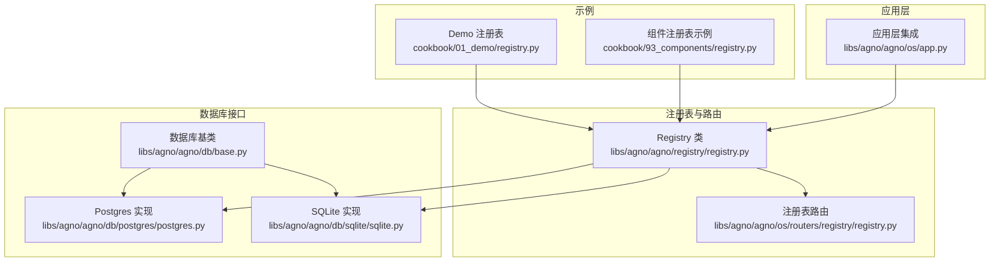
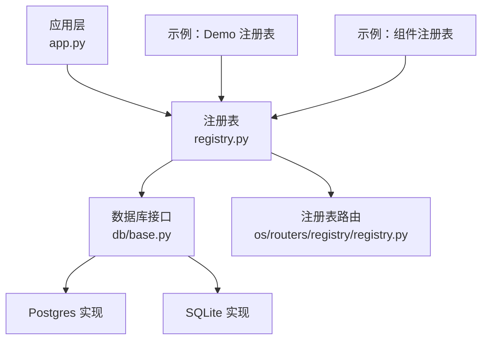
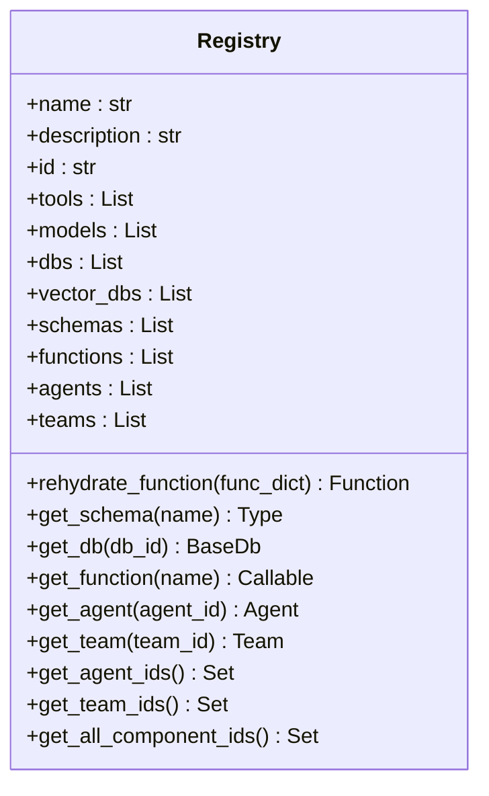
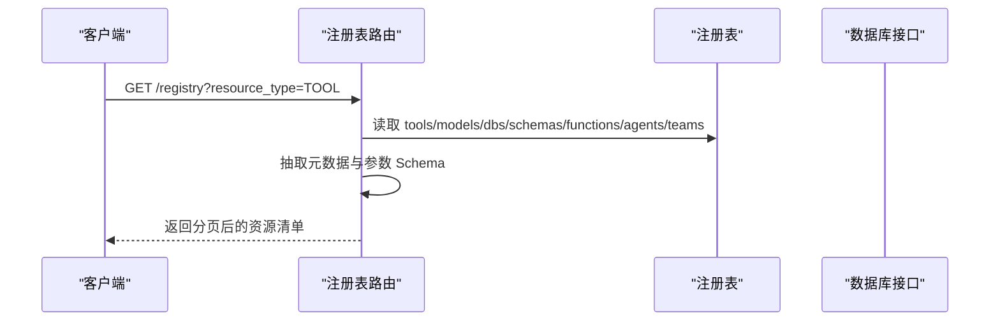
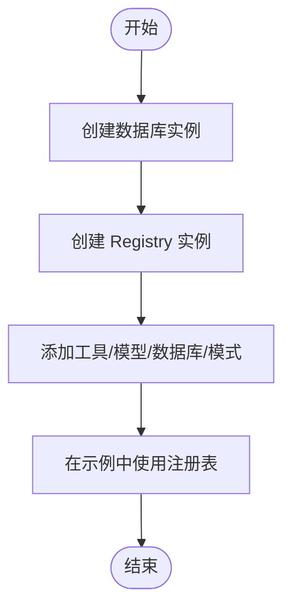
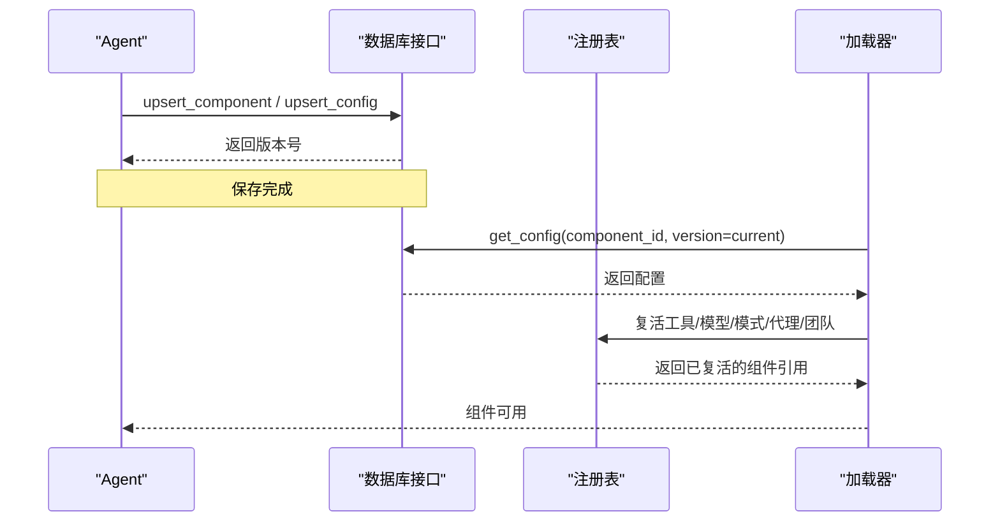
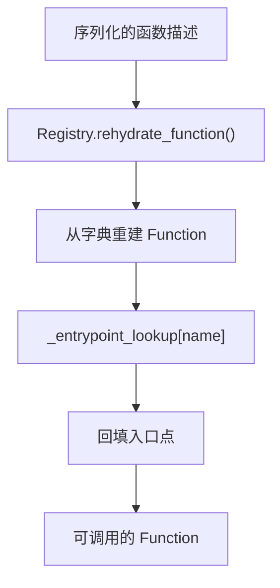
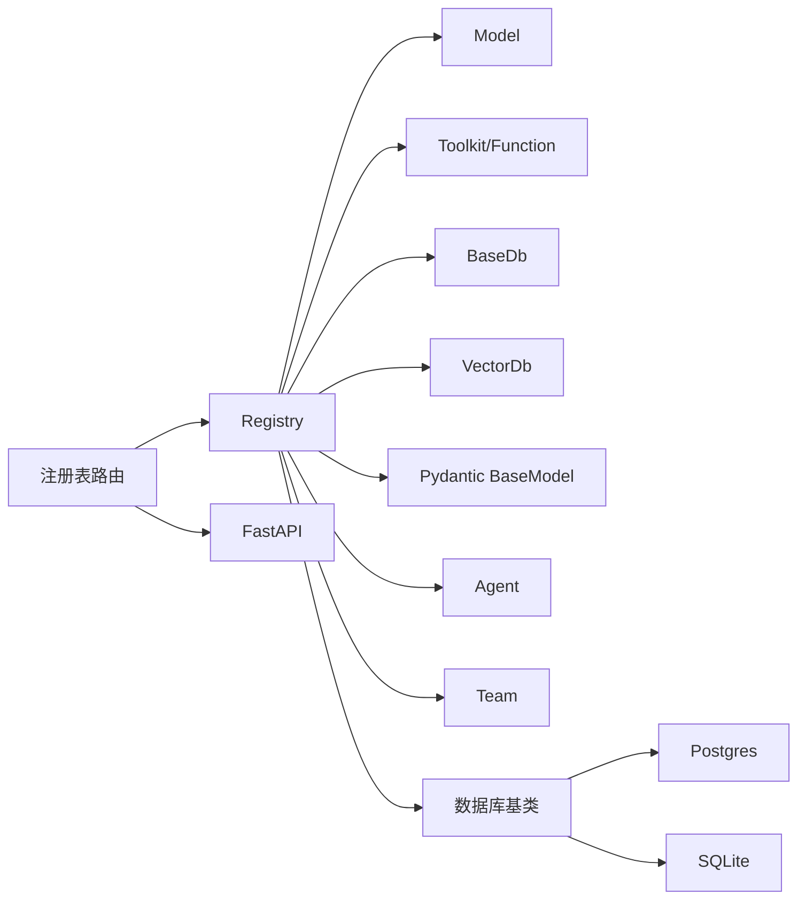

# 组件注册

<cite>
**本文引用的文件**
- [libs/agno/agno/registry/registry.py](file://libs/agno/agno/registry/registry.py)
- [libs/agno/agno/os/routers/registry/registry.py](file://libs/agno/agno/os/routers/registry/registry.py)
- [cookbook/01_demo/registry.py](file://cookbook/01_demo/registry.py)
- [cookbook/93_components/registry.py](file://cookbook/93_components/registry.py)
- [cookbook/93_components/save_agent.py](file://cookbook/93_components/save_agent.py)
- [cookbook/93_components/get_agent.py](file://cookbook/93_components/get_agent.py)
- [cookbook/93_components/save_team.py](file://cookbook/93_components/save_team.py)
- [cookbook/93_components/get_team.py](file://cookbook/93_components/get_team.py)
- [libs/agno/agno/db/postgres/postgres.py](file://libs/agno/agno/db/postgres/postgres.py)
- [libs/agno/agno/db/sqlite/sqlite.py](file://libs/agno/agno/db/sqlite/sqlite.py)
- [libs/agno/agno/db/base.py](file://libs/agno/agno/db/base.py)
- [libs/agno/agno/os/app.py](file://libs/agno/agno/os/app.py)
</cite>

## 目录
1. [简介](#简介)
2. [项目结构](#项目结构)
3. [核心组件](#核心组件)
4. [架构总览](#架构总览)
5. [详细组件分析](#详细组件分析)
6. [依赖关系分析](#依赖关系分析)
7. [性能考量](#性能考量)
8. [故障排查指南](#故障排查指南)
9. [结论](#结论)
10. [附录](#附录)

## 简介
本文件系统性阐述组件注册功能的设计原理与实现机制，重点覆盖以下方面：
- 注册表如何管理非可序列化组件（工具、模型、数据库连接、向量库、模式、函数、代码定义的代理与团队）。
- 注册表的初始化流程：名称、描述与组件列表的配置方式。
- 组件加载时的“复活”（rehydrate）机制：如何恢复工具、模型与模式的引用。
- 使用场景：数据库持久化后的组件恢复、跨进程组件共享。
- 实战示例：如何创建与配置注册表，以及在组件保存与加载过程中正确使用注册表。
- 最佳实践与常见问题的解决方案。

## 项目结构
围绕组件注册与使用的相关模块分布如下：
- 注册表核心类：位于通用注册模块中，负责集中管理各类组件实例。
- 注册表 API 路由：提供对外暴露的资源清单能力，便于运行时发现与调试。
- 示例与用法：演示如何在 Demo 与组件示例中创建与使用注册表。
- 数据库存储：通过数据库接口实现组件与配置的持久化与版本化管理。
- 应用层集成：应用启动时将代码定义的代理/团队注入注册表，确保从数据库加载的工作流能正确复活其步骤。

**图表来源**
- [libs/agno/agno/registry/registry.py:1-111](file://libs/agno/agno/registry/registry.py#L1-L111)
- [libs/agno/agno/os/routers/registry/registry.py:1-522](file://libs/agno/agno/os/routers/registry/registry.py#L1-L522)
- [cookbook/01_demo/registry.py:1-22](file://cookbook/01_demo/registry.py#L1-L22)
- [cookbook/93_components/registry.py:1-70](file://cookbook/93_components/registry.py#L1-L70)
- [libs/agno/agno/db/base.py:697-731](file://libs/agno/agno/db/base.py#L697-L731)
- [libs/agno/agno/db/postgres/postgres.py:3777-3992](file://libs/agno/agno/db/postgres/postgres.py#L3777-L3992)
- [libs/agno/agno/db/sqlite/sqlite.py:3310-3856](file://libs/agno/agno/db/sqlite/sqlite.py#L3310-L3856)
- [libs/agno/agno/os/app.py:591-606](file://libs/agno/agno/os/app.py#L591-L606)

**章节来源**
- [libs/agno/agno/registry/registry.py:1-111](file://libs/agno/agno/registry/registry.py#L1-L111)
- [libs/agno/agno/os/routers/registry/registry.py:1-522](file://libs/agno/agno/os/routers/registry/registry.py#L1-L522)
- [cookbook/01_demo/registry.py:1-22](file://cookbook/01_demo/registry.py#L1-L22)
- [cookbook/93_components/registry.py:1-70](file://cookbook/93_components/registry.py#L1-L70)
- [libs/agno/agno/db/base.py:697-731](file://libs/agno/agno/db/base.py#L697-L731)
- [libs/agno/agno/db/postgres/postgres.py:3777-3992](file://libs/agno/agno/db/postgres/postgres.py#L3777-L3992)
- [libs/agno/agno/db/sqlite/sqlite.py:3310-3856](file://libs/agno/agno/db/sqlite/sqlite.py#L3310-L3856)
- [libs/agno/agno/os/app.py:591-606](file://libs/agno/agno/os/app.py#L591-L606)

## 核心组件
- 注册表 Registry：集中管理工具、模型、数据库、向量库、模式、函数、代码定义的代理与团队；提供按名称或 ID 的检索方法，并维护入口点查找表以支持复活函数。
- 注册表 API 路由：将注册表内的资源导出为可被外部消费的元数据，支持分页、过滤与类型筛选。
- 数据库存储：提供组件与配置的 upsert、查询与删除能力，支持草稿/发布阶段与链接建立，用于工作流与步骤的版本化管理。
- 应用层集成：在应用启动时将代码定义的代理/团队注入注册表，确保从数据库加载的工作流能正确复活其步骤。

**章节来源**
- [libs/agno/agno/registry/registry.py:21-111](file://libs/agno/agno/registry/registry.py#L21-L111)
- [libs/agno/agno/os/routers/registry/registry.py:33-522](file://libs/agno/agno/os/routers/registry/registry.py#L33-L522)
- [libs/agno/agno/db/base.py:697-731](file://libs/agno/agno/db/base.py#L697-L731)
- [libs/agno/agno/os/app.py:591-606](file://libs/agno/agno/os/app.py#L591-L606)

## 架构总览
下图展示了注册表在系统中的角色与交互路径：应用层创建注册表并注入代码定义的代理/团队；注册表作为组件的“索引中心”，在组件保存时被数据库层引用，在组件加载时用于复活引用。

**图表来源**
- [libs/agno/agno/os/app.py:591-606](file://libs/agno/agno/os/app.py#L591-L606)
- [libs/agno/agno/registry/registry.py:21-111](file://libs/agno/agno/registry/registry.py#L21-L111)
- [libs/agno/agno/db/base.py:697-731](file://libs/agno/agno/db/base.py#L697-L731)
- [libs/agno/agno/os/routers/registry/registry.py:33-522](file://libs/agno/agno/os/routers/registry/registry.py#L33-L522)
- [cookbook/01_demo/registry.py:14-22](file://cookbook/01_demo/registry.py#L14-L22)
- [cookbook/93_components/registry.py:46-53](file://cookbook/93_components/registry.py#L46-L53)

## 详细组件分析

### 注册表类（Registry）
- 设计目标：集中管理非可序列化组件，提供按名称/ID 检索与复活能力。
- 关键字段：名称、描述、唯一标识、工具列表、模型列表、数据库列表、向量库列表、模式列表、函数列表、代码定义的代理与团队列表。
- 复活机制：
  - 维护入口点查找表，基于工具/函数的名称映射到实际入口点。
  - 提供函数复活方法：从字典重建函数对象并回填入口点。
- 查询能力：
  - 获取模式、数据库、函数、代理、团队等资源，支持集合去重与 ID 列表生成。

**图表来源**
- [libs/agno/agno/registry/registry.py:21-111](file://libs/agno/agno/registry/registry.py#L21-L111)

**章节来源**
- [libs/agno/agno/registry/registry.py:21-111](file://libs/agno/agno/registry/registry.py#L21-L111)

### 注册表 API 路由
- 功能：将注册表内的资源导出为统一的元数据结构，支持按类型过滤、名称匹配、分页与排序。
- 资源类型：工具（含 Toolkit 与 Function）、模型、数据库、向量库、模式、函数、代理、团队。
- 元数据提取：对函数签名、返回注解、参数 JSON Schema、确认/外部执行标记进行抽取与安全序列化。
- 性能：对非 JSON 可序列化值进行降级处理，避免序列化错误。

**图表来源**
- [libs/agno/agno/os/routers/registry/registry.py:33-522](file://libs/agno/agno/os/routers/registry/registry.py#L33-L522)

**章节来源**
- [libs/agno/agno/os/routers/registry/registry.py:33-522](file://libs/agno/agno/os/routers/registry/registry.py#L33-L522)

### 初始化与配置
- Demo 注册表：在示例中直接创建注册表，注入工具、模型与数据库实例，便于演示共享与复用。
- 组件注册表：在示例中创建注册表，包含工具、模型、数据库与模式，演示如何在首次运行时保存组件到数据库。

**图表来源**
- [cookbook/01_demo/registry.py:14-22](file://cookbook/01_demo/registry.py#L14-L22)
- [cookbook/93_components/registry.py:46-53](file://cookbook/93_components/registry.py#L46-L53)

**章节来源**
- [cookbook/01_demo/registry.py:14-22](file://cookbook/01_demo/registry.py#L14-L22)
- [cookbook/93_components/registry.py:46-53](file://cookbook/93_components/registry.py#L46-L53)

### 组件保存与加载流程
- 保存流程：组件（如 Agent/Team/Workflow）调用数据库接口的 upsert 方法，写入组件信息与配置版本，必要时建立父子版本链接。
- 加载流程：从数据库读取当前版本配置，结合注册表复活工具、模型、模式与代码定义的代理/团队。

**图表来源**
- [libs/agno/agno/db/postgres/postgres.py:3784-3992](file://libs/agno/agno/db/postgres/postgres.py#L3784-L3992)
- [libs/agno/agno/db/sqlite/sqlite.py:3652-3856](file://libs/agno/agno/db/sqlite/sqlite.py#L3652-L3856)
- [libs/agno/agno/registry/registry.py:56-111](file://libs/agno/agno/registry/registry.py#L56-L111)

**章节来源**
- [libs/agno/agno/db/postgres/postgres.py:3784-3992](file://libs/agno/agno/db/postgres/postgres.py#L3784-L3992)
- [libs/agno/agno/db/sqlite/sqlite.py:3652-3856](file://libs/agno/agno/db/sqlite/sqlite.py#L3652-L3856)
- [libs/agno/agno/registry/registry.py:56-111](file://libs/agno/agno/registry/registry.py#L56-L111)

### 复活机制详解
- 函数复活：从字典重建 Function 对象，并通过注册表的入口点查找表回填入口点，确保调用链完整。
- 模式复活：通过注册表提供的模式查找方法，按名称定位 Pydantic 模型类型。
- 数据库复活：通过注册表提供的数据库查找方法，按 ID 定位数据库实例。
- 代理/团队复活：在应用层启动时将代码定义的代理/团队注入注册表，加载时通过 ID 从注册表获取。

**图表来源**
- [libs/agno/agno/registry/registry.py:56-60](file://libs/agno/agno/registry/registry.py#L56-L60)

**章节来源**
- [libs/agno/agno/registry/registry.py:41-60](file://libs/agno/agno/registry/registry.py#L41-L60)
- [libs/agno/agno/registry/registry.py:62-94](file://libs/agno/agno/registry/registry.py#L62-L94)

### 使用场景
- 数据库中的组件恢复：Agent/Team/Workflow 保存后，加载时通过注册表复活工具、模型与模式，确保运行时行为一致。
- 跨进程组件共享：注册表作为进程内共享的组件索引，不同进程可通过同一注册表实例共享工具、模型与数据库连接。
- 工作流复活：应用层启动时将代码定义的代理/团队注入注册表，确保从数据库加载的工作流能正确复活其步骤。

**章节来源**
- [libs/agno/agno/os/app.py:591-606](file://libs/agno/agno/os/app.py#L591-L606)
- [libs/agno/agno/os/routers/registry/registry.py:439-477](file://libs/agno/agno/os/routers/registry/registry.py#L439-L477)

## 依赖关系分析
- 组件耦合：
  - Registry 依赖工具、模型、数据库、向量库、模式、函数、代理与团队等类型。
  - 注册表路由依赖 Registry 并对其资源进行元数据抽取。
  - 数据库接口为组件持久化提供统一抽象，Postgres 与 SQLite 为具体实现。
- 外部依赖：
  - FastAPI 路由框架用于注册表 API。
  - Pydantic 模型用于模式定义与 JSON Schema 生成。
  - Python 内省工具用于函数签名与注解提取。

**图表来源**
- [libs/agno/agno/registry/registry.py:10-19](file://libs/agno/agno/registry/registry.py#L10-L19)
- [libs/agno/agno/os/routers/registry/registry.py:26-31](file://libs/agno/agno/os/routers/registry/registry.py#L26-L31)
- [libs/agno/agno/db/base.py:697-731](file://libs/agno/agno/db/base.py#L697-L731)

**章节来源**
- [libs/agno/agno/registry/registry.py:10-19](file://libs/agno/agno/registry/registry.py#L10-L19)
- [libs/agno/agno/os/routers/registry/registry.py:26-31](file://libs/agno/agno/os/routers/registry/registry.py#L26-L31)
- [libs/agno/agno/db/base.py:697-731](file://libs/agno/agno/db/base.py#L697-L731)

## 性能考量
- 注册表查询：按名称/ID 的查找为线性扫描，建议在注册表中控制组件数量或引入更高效的索引策略。
- 元数据导出：对函数签名与参数进行内省可能带来开销，建议缓存或延迟计算。
- 序列化降级：对非 JSON 可序列化值进行字符串降级，避免异常但可能影响可观测性，建议记录日志以便诊断。
- 数据库写入：批量保存时尽量合并事务，减少往返次数。

## 故障排查指南
- 注册表未注入代码定义的代理/团队导致复活失败：
  - 在应用启动时调用注册表注入逻辑，确保 ID 唯一且不重复。
  - 参考应用层集成逻辑。
- 函数复活失败：
  - 确保注册表中存在同名入口点；检查工具/函数的名称与入口点是否正确设置。
- 模式/数据库/函数查找失败：
  - 确认注册表中已添加对应组件；检查名称或 ID 是否匹配。
- 数据库保存失败：
  - 检查组件 ID、类型、名称与描述是否满足约束；确认数据库表存在且权限正确。
- API 路由返回空或异常：
  - 检查资源类型过滤与名称匹配条件；查看日志中的错误详情。

**章节来源**
- [libs/agno/agno/os/app.py:591-606](file://libs/agno/agno/os/app.py#L591-L606)
- [libs/agno/agno/registry/registry.py:56-111](file://libs/agno/agno/registry/registry.py#L56-L111)
- [libs/agno/agno/os/routers/registry/registry.py:488-521](file://libs/agno/agno/os/routers/registry/registry.py#L488-L521)
- [libs/agno/agno/db/postgres/postgres.py:3784-3992](file://libs/agno/agno/db/postgres/postgres.py#L3784-L3992)
- [libs/agno/agno/db/sqlite/sqlite.py:3652-3856](file://libs/agno/agno/db/sqlite/sqlite.py#L3652-L3856)

## 结论
组件注册表通过集中管理非可序列化组件，为 Agent/Team/Workflow 等复杂组件提供了强大的复活与共享能力。配合数据库的版本化存储与 API 路由的资源导出，实现了从保存到加载的完整闭环。在实践中应重视注册表的初始化与注入、复活机制的正确性与性能优化，并遵循最佳实践以降低故障风险。

## 附录

### 示例：创建与配置注册表
- Demo 注册表：在示例中创建注册表并注入工具、模型与数据库实例。
- 组件注册表：在示例中创建注册表并包含工具、模型、数据库与模式，演示首次保存组件到数据库。

**章节来源**
- [cookbook/01_demo/registry.py:14-22](file://cookbook/01_demo/registry.py#L14-L22)
- [cookbook/93_components/registry.py:46-53](file://cookbook/93_components/registry.py#L46-L53)

### 示例：保存与加载组件
- 保存 Agent/Team：通过数据库接口 upsert 组件与配置版本。
- 加载 Agent/Team：通过 ID 从数据库读取配置并结合注册表复活组件。

**章节来源**
- [cookbook/93_components/save_agent.py:30-35](file://cookbook/93_components/save_agent.py#L30-L35)
- [cookbook/93_components/get_agent.py:20-25](file://cookbook/93_components/get_agent.py#L20-L25)
- [cookbook/93_components/save_team.py:52-55](file://cookbook/93_components/save_team.py#L52-L55)
- [cookbook/93_components/get_team.py:20-25](file://cookbook/93_components/get_team.py#L20-L25)