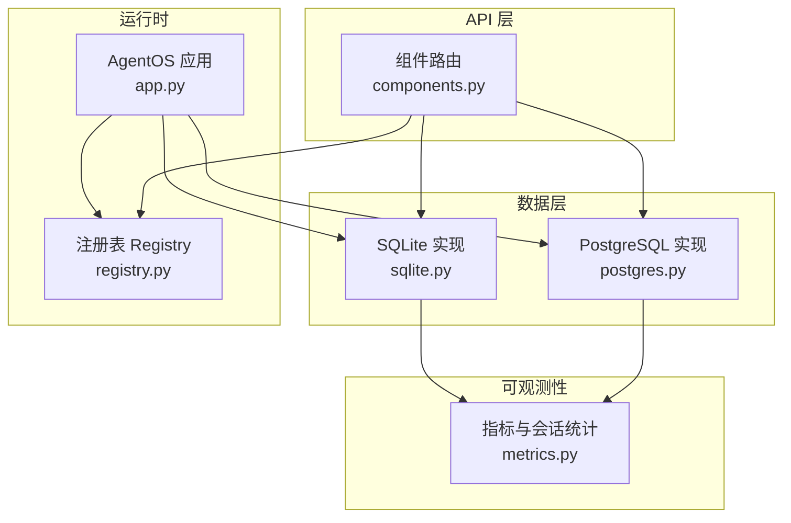
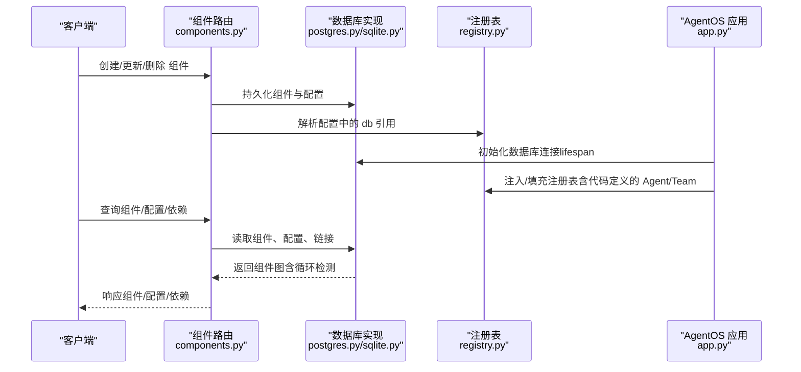
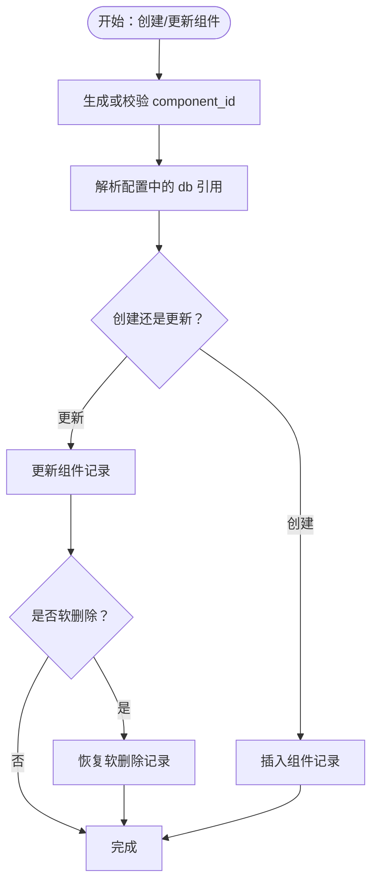
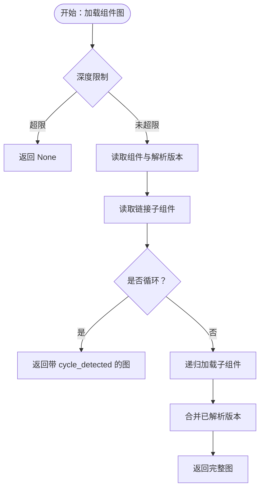
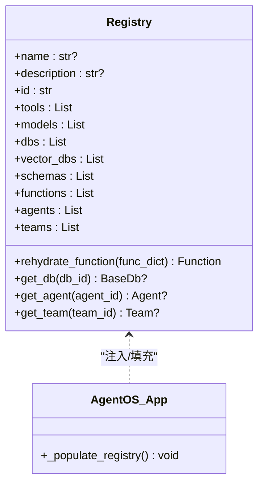
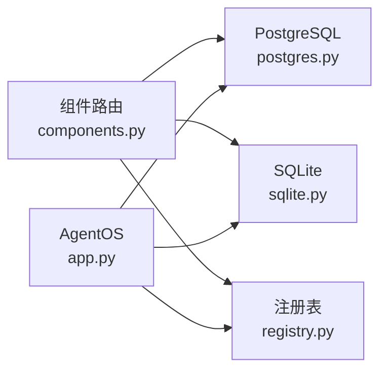

# 组件生命周期

<cite>
**本文引用的文件**
- [components.py](file://libs/agno/agno/os/routers/components/components.py)
- [registry.py](file://libs/agno/agno/registry/registry.py)
- [postgres.py](file://libs/agno/agno/db/postgres/postgres.py)
- [sqlite.py](file://libs/agno/agno/db/sqlite/sqlite.py)
- [app.py](file://libs/agno/agno/os/app.py)
- [metrics.py](file://libs/agno/agno/db/surrealdb/metrics.py)
- [test_components_router.py](file://libs/agno/tests/unit/os/routers/test_components_router.py)
- [custom_lifespan.md](file://cookbook/05_agent_os/customize/custom_lifespan.md)
- [registry.md](file://cookbook/93_components/registry.md)
- [agent_os_registry.md](file://cookbook/93_components/agent_os_registry.md)
</cite>

## 目录
1. [简介](#简介)
2. [项目结构](#项目结构)
3. [核心组件](#核心组件)
4. [架构总览](#架构总览)
5. [详细组件分析](#详细组件分析)
6. [依赖分析](#依赖分析)
7. [性能考虑](#性能考虑)
8. [故障排查指南](#故障排查指南)
9. [结论](#结论)
10. [附录](#附录)

## 简介
本文件系统化阐述 Agno 中“组件生命周期”的设计与实现，覆盖从组件创建、版本化配置管理、依赖关系解析、软删除与恢复、到运行期状态与事件的全链路机制。重点包括：
- 组件的创建、更新、删除与软删除恢复
- 组件版本与配置的版本化管理与回滚
- 组件依赖关系的发现与循环检测
- 组件注册表（Registry）对非可序列化对象的还原能力
- AgentOS 生命周期与资源初始化/释放的组合策略
- 运行期状态与事件、以及可观测性指标的采集与查询

## 项目结构
围绕组件生命周期的关键模块与文件如下：
- 组件 API 路由层：提供组件的增删改查、配置版本管理、当前配置切换等接口
- 数据库层：统一抽象组件与配置的持久化，支持 PostgreSQL、SQLite 等
- 注册表（Registry）：用于还原不可序列化对象（工具、模型、数据库、向量库、Schema、Agent、Team）
- AgentOS 应用：提供生命周期钩子（lifespan）以串联数据库、HTTP 客户端等资源的初始化与释放
- 测试与示例：验证组件路由行为、Registry 集成与 AgentOS 生命周期

图表来源
- [components.py:100-482](file://libs/agno/agno/os/routers/components/components.py#L100-L482)
- [postgres.py:3385-3442](file://libs/agno/agno/db/postgres/postgres.py#L3385-L3442)
- [sqlite.py:3272-3308](file://libs/agno/agno/db/sqlite/sqlite.py#L3272-L3308)
- [registry.py:21-110](file://libs/agno/agno/registry/registry.py#L21-L110)
- [app.py:591-614](file://libs/agno/agno/os/app.py#L591-L614)
- [metrics.py:83-118](file://libs/agno/agno/db/surrealdb/metrics.py#L83-L118)

章节来源
- [components.py:100-482](file://libs/agno/agno/os/routers/components/components.py#L100-L482)
- [postgres.py:3385-3442](file://libs/agno/agno/db/postgres/postgres.py#L3385-L3442)
- [sqlite.py:3272-3308](file://libs/agno/agno/db/sqlite/sqlite.py#L3272-L3308)
- [registry.py:21-110](file://libs/agno/agno/registry/registry.py#L21-L110)
- [app.py:591-614](file://libs/agno/agno/os/app.py#L591-L614)
- [metrics.py:83-118](file://libs/agno/agno/db/surrealdb/metrics.py#L83-L118)

## 核心组件
- 组件路由（Components Router）
  - 提供组件的分页查询、创建、获取、更新、删除、配置版本管理、当前配置切换等接口
  - 支持在创建/更新配置时解析数据库引用（db id -> 注册表或 OS db）
- 组件数据库实现（PostgreSQL/SQLite）
  - 统一的组件与配置 CRUD、版本解析、依赖查询、软删除与恢复、图加载（含循环检测）
- 注册表（Registry）
  - 管理不可序列化对象（工具、模型、数据库、向量库、Schema、Agent、Team），提供还原与查找能力
- AgentOS 应用（App）
  - 通过 lifespan 合并用户自定义与内部资源的初始化/释放，确保组件运行期资源一致可用
- 指标与会话统计（Metrics）
  - 提供基于会话与追踪的指标计算与日期归一化逻辑，辅助健康检查与故障定位

章节来源
- [components.py:100-482](file://libs/agno/agno/os/routers/components/components.py#L100-L482)
- [postgres.py:4209-4366](file://libs/agno/agno/db/postgres/postgres.py#L4209-L4366)
- [sqlite.py:4070-4195](file://libs/agno/agno/db/sqlite/sqlite.py#L4070-L4195)
- [registry.py:21-110](file://libs/agno/agno/registry/registry.py#L21-L110)
- [app.py:591-614](file://libs/agno/agno/os/app.py#L591-L614)
- [metrics.py:83-118](file://libs/agno/agno/db/surrealdb/metrics.py#L83-L118)

## 架构总览
组件生命周期贯穿“API -> 数据库 -> 注册表 -> 运行时”的路径，并通过 AgentOS 的 lifespan 管理资源的初始化与释放。

图表来源
- [components.py:100-482](file://libs/agno/agno/os/routers/components/components.py#L100-L482)
- [postgres.py:4209-4366](file://libs/agno/agno/db/postgres/postgres.py#L4209-L4366)
- [sqlite.py:4070-4195](file://libs/agno/agno/db/sqlite/sqlite.py#L4070-L4195)
- [registry.py:21-110](file://libs/agno/agno/registry/registry.py#L21-L110)
- [app.py:591-614](file://libs/agno/agno/os/app.py#L591-L614)

## 详细组件分析

### 组件创建与更新（含软删除恢复）
- 创建组件
  - 自动生成 component_id（若未提供）
  - 解析配置中的 db 引用（优先匹配 OS db，再匹配注册表）
  - 创建组件与初始配置版本
- 更新组件
  - 支持部分更新（name/description/metadata/current_version/component_type）
  - 更新现有记录或软删除后恢复
- 软删除与恢复
  - 删除时支持软删除（保留记录并标记 deleted_at）
  - 通过 _resolve_version 与 get_dependents 等方法保障版本一致性与依赖查询

图表来源
- [components.py:160-200](file://libs/agno/agno/os/routers/components/components.py#L160-L200)
- [components.py:234-263](file://libs/agno/agno/os/routers/components/components.py#L234-L263)
- [postgres.py:3385-3442](file://libs/agno/agno/db/postgres/postgres.py#L3385-L3442)
- [sqlite.py:3272-3308](file://libs/agno/agno/db/sqlite/sqlite.py#L3272-L3308)

章节来源
- [components.py:160-200](file://libs/agno/agno/os/routers/components/components.py#L160-L200)
- [components.py:234-263](file://libs/agno/agno/os/routers/components/components.py#L234-L263)
- [postgres.py:3385-3442](file://libs/agno/agno/db/postgres/postgres.py#L3385-L3442)
- [sqlite.py:3272-3308](file://libs/agno/agno/db/sqlite/sqlite.py#L3272-L3308)

### 组件版本与配置管理
- 版本解析
  - 当 version 为 None 时，解析 current_version；否则直接使用指定版本
- 图加载与循环检测
  - 递归加载组件图，记录已访问节点，检测循环依赖并返回带 cycle_detected 的图
- 依赖查询
  - 通过 get_dependents 查找引用某组件的所有子组件，支持指定版本

图表来源
- [postgres.py:4278-4366](file://libs/agno/agno/db/postgres/postgres.py#L4278-L4366)
- [sqlite.py:4157-4195](file://libs/agno/agno/db/sqlite/sqlite.py#L4157-L4195)

章节来源
- [postgres.py:4244-4366](file://libs/agno/agno/db/postgres/postgres.py#L4244-L4366)
- [sqlite.py:4074-4195](file://libs/agno/agno/db/sqlite/sqlite.py#L4074-L4195)

### 组件依赖关系管理
- 依赖声明与查询
  - 通过 component_links 表维护父子关系，支持按 child_component_id 查询所有依赖者
- 启动/停止顺序控制
  - 通过 get_dependents 与 load_component_graph 的拓扑遍历，可推导出依赖顺序
  - 循环检测避免死锁与无限递归
- 软删除影响
  - 软删除组件仍计入依赖关系，但被标记 deleted_at；恢复后重新纳入依赖链

章节来源
- [postgres.py:4213-4253](file://libs/agno/agno/db/postgres/postgres.py#L4213-L4253)
- [sqlite.py:4074-4114](file://libs/agno/agno/db/sqlite/sqlite.py#L4074-L4114)

### 组件注册表与动态还原
- 注册表职责
  - 管理不可序列化对象（工具、模型、数据库、向量库、Schema、Agent、Team）
  - 提供 get_db、get_agent、get_team 等查找方法
  - rehydrate_function 通过入口函数映射重建 Function
- 与 AgentOS 集成
  - AgentOS 在启动时将代码定义的 Agent/Team 注入注册表，确保工作流从数据库加载时可还原步骤
- 与组件路由集成
  - 创建/更新配置时，_resolve_db_in_config 将 db id 解析为可序列化的字典，便于跨进程/持久化

图表来源
- [registry.py:21-110](file://libs/agno/agno/registry/registry.py#L21-L110)
- [app.py:591-614](file://libs/agno/agno/os/app.py#L591-L614)

章节来源
- [registry.py:21-110](file://libs/agno/agno/registry/registry.py#L21-L110)
- [app.py:591-614](file://libs/agno/agno/os/app.py#L591-L614)
- [components.py:34-76](file://libs/agno/agno/os/routers/components/components.py#L34-L76)

### AgentOS 生命周期与资源管理
- 自定义 lifespan
  - 使用 asynccontextmanager 定义启动/关闭逻辑
  - AgentOS 通过 _compose_lifespan 将用户自定义与内部资源（数据库、HTTP 客户端等）生命周期组合
- 与组件的关系
  - AgentOS 启动时初始化数据库连接，确保组件路由与注册表可用
  - 关闭时统一释放资源，避免泄漏

章节来源
- [custom_lifespan.md:42-102](file://cookbook/05_agent_os/customize/custom_lifespan.md#L42-L102)
- [app.py:591-614](file://libs/agno/agno/os/app.py#L591-L614)

### 健康检查与故障恢复
- 指标与会话统计
  - 基于会话与追踪的指标计算，提供日期归一化逻辑，便于跨数据库类型进行时间维度聚合
- 故障恢复建议
  - 使用软删除与恢复机制快速回退
  - 通过 get_dependents 与 load_component_graph 检查依赖与循环，避免错误传播
  - 在 AgentOS lifespan 中集中管理资源，确保优雅关闭

章节来源
- [metrics.py:83-118](file://libs/agno/agno/db/surrealdb/metrics.py#L83-L118)
- [postgres.py:4213-4253](file://libs/agno/agno/db/postgres/postgres.py#L4213-L4253)
- [sqlite.py:4074-4114](file://libs/agno/agno/db/sqlite/sqlite.py#L4074-L4114)

### 监控与调试
- 组件路由测试
  - 验证分页、错误处理、ID 生成等行为，确保组件生命周期接口稳定
- 日志与错误处理
  - 路由层统一捕获异常并返回标准化错误响应
- 性能指标
  - 指标模块提供会话与追踪级别的统计，辅助定位性能瓶颈

章节来源
- [test_components_router.py:116-155](file://libs/agno/tests/unit/os/routers/test_components_router.py#L116-L155)
- [components.py:120-149](file://libs/agno/agno/os/routers/components/components.py#L120-L149)

## 依赖分析
- 组件路由依赖数据库实现（PostgreSQL/SQLite）与注册表
- 注册表与 AgentOS 应用相互协作：AgentOS 注入/填充注册表，注册表支撑组件还原
- 数据库实现提供统一的组件与配置持久化能力，支持版本解析与依赖查询

图表来源
- [components.py:100-482](file://libs/agno/agno/os/routers/components/components.py#L100-L482)
- [postgres.py:3385-3442](file://libs/agno/agno/db/postgres/postgres.py#L3385-L3442)
- [sqlite.py:3272-3308](file://libs/agno/agno/db/sqlite/sqlite.py#L3272-L3308)
- [registry.py:21-110](file://libs/agno/agno/registry/registry.py#L21-L110)
- [app.py:591-614](file://libs/agno/agno/os/app.py#L591-L614)

章节来源
- [components.py:100-482](file://libs/agno/agno/os/routers/components/components.py#L100-L482)
- [postgres.py:3385-3442](file://libs/agno/agno/db/postgres/postgres.py#L3385-L3442)
- [sqlite.py:3272-3308](file://libs/agno/agno/db/sqlite/sqlite.py#L3272-L3308)
- [registry.py:21-110](file://libs/agno/agno/registry/registry.py#L21-L110)
- [app.py:591-614](file://libs/agno/agno/os/app.py#L591-L614)

## 性能考虑
- 分页查询与搜索耗时统计
  - 组件列表接口支持分页与搜索耗时统计，便于评估数据库负载
- 版本解析与图加载
  - 版本解析与图加载具备最大深度限制与循环检测，避免栈溢出与死循环
- 资源初始化与释放
  - AgentOS lifespan 合并多段生命周期，减少重复初始化成本

章节来源
- [components.py:116-146](file://libs/agno/agno/os/routers/components/components.py#L116-L146)
- [postgres.py:4278-4366](file://libs/agno/agno/db/postgres/postgres.py#L4278-L4366)
- [sqlite.py:4157-4195](file://libs/agno/agno/db/sqlite/sqlite.py#L4157-L4195)
- [app.py:591-614](file://libs/agno/agno/os/app.py#L591-L614)

## 故障排查指南
- 常见问题
  - 组件不存在：404 错误，检查 component_id 或是否被软删除
  - 配置更新失败：确认 current_version 与目标版本一致，避免并发覆盖
  - 依赖循环：启用循环检测，定位循环链路并调整依赖关系
  - 资源未释放：检查 AgentOS lifespan 是否正确合并，避免资源泄漏
- 建议排查步骤
  - 使用 get_dependents 与 load_component_graph 检查依赖与循环
  - 通过 set_current_config 回滚到上一个稳定版本
  - 查看路由层日志与错误响应，定位具体异常

章节来源
- [components.py:202-283](file://libs/agno/agno/os/routers/components/components.py#L202-L283)
- [postgres.py:4213-4253](file://libs/agno/agno/db/postgres/postgres.py#L4213-L4253)
- [sqlite.py:4074-4114](file://libs/agno/agno/db/sqlite/sqlite.py#L4074-L4114)

## 结论
本文件系统化梳理了 Agno 组件生命周期的实现要点：通过组件路由与数据库实现提供完整的 CRUD 与版本化能力，借助注册表实现不可序列化对象的动态还原，配合 AgentOS 的 lifespan 管理资源的初始化与释放，并通过指标与依赖查询实现可观测性与故障恢复。上述机制共同构成了可扩展、可观测、可回滚的组件生命周期管理体系。

## 附录
- 示例参考
  - 组件注册表示例：[registry.md:1-70](file://cookbook/93_components/registry.md#L1-L70)
  - AgentOS + Registry 集成示例：[agent_os_registry.md:1-64](file://cookbook/93_components/agent_os_registry.md#L1-L64)