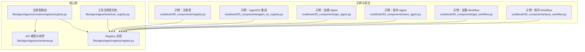
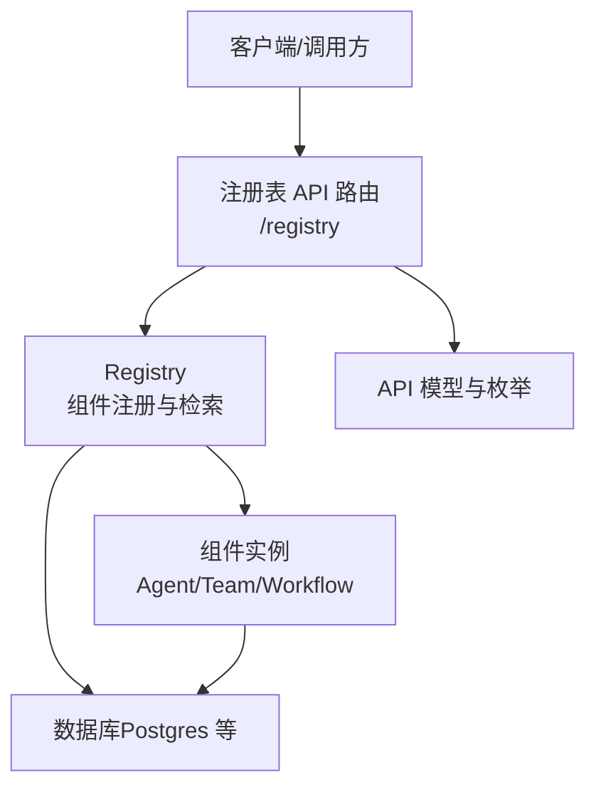
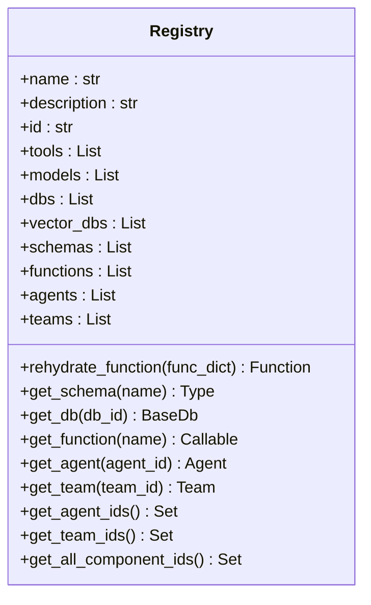
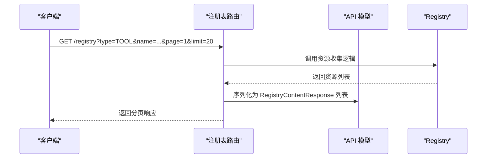
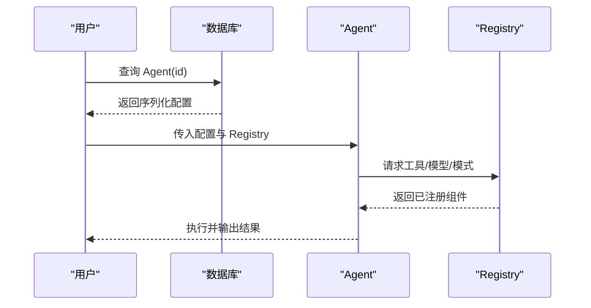
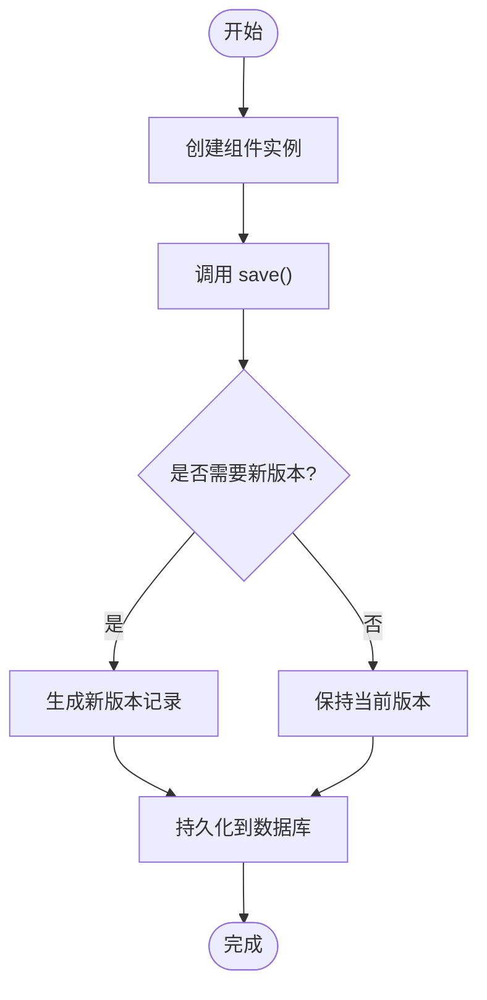
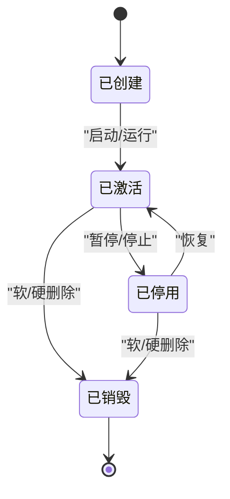
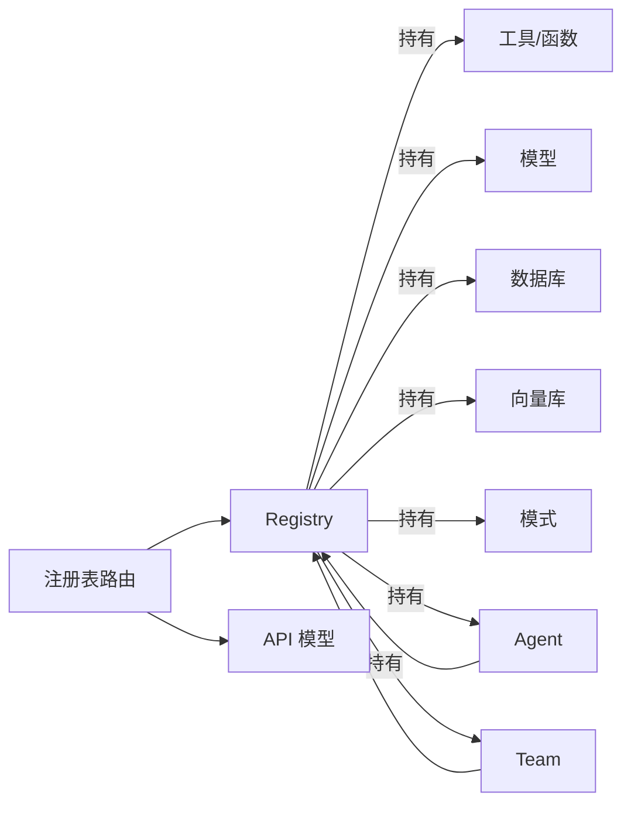

# 组件管理

<cite>
**本文引用的文件**
- [libs/agno/agno/registry/registry.py](file://libs/agno/agno/registry/registry.py)
- [libs/agno/agno/os/routers/registry/registry.py](file://libs/agno/agno/os/routers/registry/registry.py)
- [libs/agno/agno/os/schema.py](file://libs/agno/agno/os/schema.py)
- [cookbook/93_components/registry.py](file://cookbook/93_components/registry.py)
- [cookbook/93_components/agent_os_registry.py](file://cookbook/93_components/agent_os_registry.py)
- [cookbook/93_components/get_agent.py](file://cookbook/93_components/get_agent.py)
- [cookbook/93_components/save_agent.py](file://cookbook/93_components/save_agent.py)
- [cookbook/93_components/get_workflow.py](file://cookbook/93_components/get_workflow.py)
- [cookbook/93_components/save_workflow.py](file://cookbook/93_components/save_workflow.py)
- [libs/agno/agno/tools/tool_registry.py](file://libs/agno/agno/tools/tool_registry.py)
</cite>

## 目录
1. [简介](#简介)
2. [项目结构](#项目结构)
3. [核心组件](#核心组件)
4. [架构总览](#架构总览)
5. [详细组件分析](#详细组件分析)
6. [依赖分析](#依赖分析)
7. [性能考虑](#性能考虑)
8. [故障排查指南](#故障排查指南)
9. [结论](#结论)
10. [附录](#附录)

## 简介
本文件系统性阐述 Agno Learn 的组件管理系统，围绕组件注册、发现与检索、生命周期管理（创建/激活/停用/销毁）、版本控制与持久化、以及组件间依赖关系与共享机制展开。文档以代码级实现为依据，结合可视化图示与最佳实践，帮助开发者在复杂组件生态中高效构建、维护与扩展。

## 项目结构
与组件管理直接相关的核心位置如下：
- 注册表实现：libs/agno/agno/registry/registry.py
- 注册表 API 路由：libs/agno/agno/os/routers/registry/registry.py
- API 响应与枚举定义：libs/agno/agno/os/schema.py
- 使用示例（注册表、Agent/Workflow 的保存与加载）：
  - cookbook/93_components/registry.py
  - cookbook/93_components/agent_os_registry.py
  - cookbook/93_components/get_agent.py
  - cookbook/93_components/save_agent.py
  - cookbook/93_components/get_workflow.py
  - cookbook/93_components/save_workflow.py
- 工具注册表别名：libs/agno/agno/tools/tool_registry.py

**图表来源**
- [libs/agno/agno/registry/registry.py:1-111](file://libs/agno/agno/registry/registry.py#L1-L111)
- [libs/agno/agno/os/routers/registry/registry.py:1-522](file://libs/agno/agno/os/routers/registry/registry.py#L1-L522)
- [libs/agno/agno/os/schema.py:1-732](file://libs/agno/agno/os/schema.py#L1-L732)
- [libs/agno/agno/tools/tool_registry.py:1-2](file://libs/agno/agno/tools/tool_registry.py#L1-L2)
- [cookbook/93_components/registry.py:1-70](file://cookbook/93_components/registry.py#L1-L70)
- [cookbook/93_components/agent_os_registry.py:1-64](file://cookbook/93_components/agent_os_registry.py#L1-L64)
- [cookbook/93_components/get_agent.py:1-31](file://cookbook/93_components/get_agent.py#L1-L31)
- [cookbook/93_components/save_agent.py:1-44](file://cookbook/93_components/save_agent.py#L1-L44)
- [cookbook/93_components/get_workflow.py:1-31](file://cookbook/93_components/get_workflow.py#L1-L31)
- [cookbook/93_components/save_workflow.py:1-78](file://cookbook/93_components/save_workflow.py#L1-L78)

**章节来源**
- [libs/agno/agno/registry/registry.py:1-111](file://libs/agno/agno/registry/registry.py#L1-L111)
- [libs/agno/agno/os/routers/registry/registry.py:1-522](file://libs/agno/agno/os/routers/registry/registry.py#L1-L522)
- [libs/agno/agno/os/schema.py:1-732](file://libs/agno/agno/os/schema.py#L1-L732)
- [libs/agno/agno/tools/tool_registry.py:1-2](file://libs/agno/agno/tools/tool_registry.py#L1-L2)
- [cookbook/93_components/registry.py:1-70](file://cookbook/93_components/registry.py#L1-L70)
- [cookbook/93_components/agent_os_registry.py:1-64](file://cookbook/93_components/agent_os_registry.py#L1-L64)
- [cookbook/93_components/get_agent.py:1-31](file://cookbook/93_components/get_agent.py#L1-L31)
- [cookbook/93_components/save_agent.py:1-44](file://cookbook/93_components/save_agent.py#L1-L44)
- [cookbook/93_components/get_workflow.py:1-31](file://cookbook/93_components/get_workflow.py#L1-L31)
- [cookbook/93_components/save_workflow.py:1-78](file://cookbook/93_components/save_workflow.py#L1-L78)

## 核心组件
- 注册表 Registry：集中管理非可序列化组件（工具、模型、数据库、向量库、模式、函数、代码定义的 Agent/Team），并提供检索与反水合能力。
- 注册表 API 路由：暴露统一的资源清单接口，支持按类型过滤、分页、名称搜索，并输出标准化元数据。
- API 模型与枚举：定义注册表资源类型、元数据结构、分页响应等，确保前后端一致的数据契约。
- 示例与集成：通过示例展示如何创建注册表、注入组件、保存/加载 Agent/Workflow，并与 AgentOS 集成。

**章节来源**
- [libs/agno/agno/registry/registry.py:21-111](file://libs/agno/agno/registry/registry.py#L21-L111)
- [libs/agno/agno/os/routers/registry/registry.py:33-522](file://libs/agno/agno/os/routers/registry/registry.py#L33-L522)
- [libs/agno/agno/os/schema.py:628-732](file://libs/agno/agno/os/schema.py#L628-L732)
- [cookbook/93_components/registry.py:46-70](file://cookbook/93_components/registry.py#L46-L70)
- [cookbook/93_components/agent_os_registry.py:30-64](file://cookbook/93_components/agent_os_registry.py#L30-L64)

## 架构总览
组件管理的总体架构由“注册表”“API 路由层”“持久化层（数据库）”“组件实例（Agent/Team/Workflow）”构成。注册表负责组件的注册与检索；API 路由层提供资源清单与元数据；持久化层负责组件的版本化存储与加载；组件实例通过注册表进行反水合与运行。

**图表来源**
- [libs/agno/agno/os/routers/registry/registry.py:33-522](file://libs/agno/agno/os/routers/registry/registry.py#L33-L522)
- [libs/agno/agno/registry/registry.py:21-111](file://libs/agno/agno/registry/registry.py#L21-L111)
- [libs/agno/agno/os/schema.py:628-732](file://libs/agno/agno/os/schema.py#L628-L732)

## 详细组件分析

### 注册表 Registry 设计与实现
- 职责边界：集中管理非可序列化对象（工具、模型、数据库、向量库、模式、函数、代码定义的 Agent/Team），并提供基于名称或 ID 的检索方法。
- 关键能力：
  - 入口点查找：对 Toolkit/Function/可调用对象建立入口点映射，用于后续反水合。
  - 反水合函数：从字典重建 Function 并回填其入口点。
  - 资源检索：按名称/ID 获取模式、数据库、函数、Agent、Team。
  - ID 收集：汇总所有 Agent/Team 的 ID，便于索引与共享。
- 数据结构与复杂度：
  - 字典查找：入口点映射为哈希表，平均 O(1) 查找。
  - 线性扫描：按属性匹配（如 id/name）为 O(n)，n 为对应集合大小。
- 错误处理：未命中返回 None，避免异常传播。

**图表来源**
- [libs/agno/agno/registry/registry.py:21-111](file://libs/agno/agno/registry/registry.py#L21-L111)

**章节来源**
- [libs/agno/agno/registry/registry.py:21-111](file://libs/agno/agno/registry/registry.py#L21-L111)

### 注册表 API 路由与资源清单
- 路由职责：提供 /registry 接口，支持按资源类型过滤、名称模糊匹配、分页；输出标准化元数据（工具、模型、数据库、向量库、模式、函数、Agent、Team）。
- 元数据提取：
  - 工具：Toolkit/Function/可调用对象，提取参数 JSON Schema、签名、返回注解、确认/外部执行标记等。
  - 模型：提供类路径、提供商、模型 ID。
  - 数据库/向量库：提供类路径、标识符、集合/表名等。
  - 模式：生成 JSON Schema 或错误信息。
  - 函数：提取签名与参数。
  - Agent/Team：输出 ID 与类路径。
- 分页与排序：稳定排序后分页，返回分页元信息。
- 安全与鉴权：依赖认证中间件。

**图表来源**
- [libs/agno/agno/os/routers/registry/registry.py:33-522](file://libs/agno/agno/os/routers/registry/registry.py#L33-L522)
- [libs/agno/agno/os/schema.py:628-732](file://libs/agno/agno/os/schema.py#L628-L732)
- [libs/agno/agno/registry/registry.py:21-111](file://libs/agno/agno/registry/registry.py#L21-L111)

**章节来源**
- [libs/agno/agno/os/routers/registry/registry.py:33-522](file://libs/agno/agno/os/routers/registry/registry.py#L33-L522)
- [libs/agno/agno/os/schema.py:628-732](file://libs/agno/agno/os/schema.py#L628-L732)

### 组件获取与实例化流程
- Agent 获取与运行：
  - 通过数据库 ID 加载 Agent，随后执行推理或打印响应。
- Workflow 获取与运行：
  - 通过数据库 ID 加载 Workflow，随后执行并输出结果。
- 注册表参与：
  - 在示例中，Agent/Workflow 的保存与加载均依赖数据库；注册表用于在运行时恢复工具、模型、模式等非序列化依赖。

**图表来源**
- [cookbook/93_components/get_agent.py:19-31](file://cookbook/93_components/get_agent.py#L19-L31)
- [cookbook/93_components/get_workflow.py:19-31](file://cookbook/93_components/get_workflow.py#L19-L31)
- [libs/agno/agno/registry/registry.py:21-111](file://libs/agno/agno/registry/registry.py#L21-L111)

**章节来源**
- [cookbook/93_components/get_agent.py:19-31](file://cookbook/93_components/get_agent.py#L19-L31)
- [cookbook/93_components/get_workflow.py:19-31](file://cookbook/93_components/get_workflow.py#L19-L31)
- [libs/agno/agno/registry/registry.py:21-111](file://libs/agno/agno/registry/registry.py#L21-L111)

### 组件保存与版本管理
- Agent 保存：
  - 创建 Agent 并调用 save()，默认生成新版本；支持软删除与硬删除。
- Workflow 保存：
  - 创建 Workflow 并调用 save(db)，默认生成新版本；支持软删除与硬删除。
- 版本控制要点：
  - 保存即版本化，加载时可通过 ID 与版本号定位具体快照。
  - 删除策略：软删除（保留历史）与硬删除（彻底移除）可选。

**图表来源**
- [cookbook/93_components/save_agent.py:20-44](file://cookbook/93_components/save_agent.py#L20-L44)
- [cookbook/93_components/save_workflow.py:55-78](file://cookbook/93_components/save_workflow.py#L55-L78)

**章节来源**
- [cookbook/93_components/save_agent.py:20-44](file://cookbook/93_components/save_agent.py#L20-L44)
- [cookbook/93_components/save_workflow.py:55-78](file://cookbook/93_components/save_workflow.py#L55-L78)

### 组件生命周期管理
- 创建：在内存中构造组件实例（Agent/Team/Workflow），注入注册表与数据库。
- 激活：通过 API 路由或运行时调用触发组件执行；注册表负责恢复非序列化依赖。
- 停用：通过业务逻辑停止组件运行（例如暂停调度、关闭会话）。
- 销毁：释放资源与内存；支持软/硬删除，保留或移除历史版本。

[此图为概念性状态流转示意，不直接映射具体源码文件]

### 组件间依赖关系管理
- 依赖声明：在组件（Agent/Workflow）中显式声明使用的工具、模型、数据库、模式等。
- 依赖解析：运行前由注册表根据名称/ID 解析并注入相应组件。
- 版本兼容：通过版本化保存与加载，确保不同版本的组件组合可被重现。
- 更新策略：建议采用向后兼容的模式；当需要破坏性变更时，创建新版本并逐步迁移。

[本节为通用设计原则说明，不直接分析具体文件]

## 依赖分析
- 组件耦合：
  - Registry 与各组件类型（工具、模型、数据库、向量库、模式、函数、Agent/Team）松耦合，通过统一容器持有。
  - API 路由依赖 Registry 与 API 模型，负责对外暴露资源清单。
- 外部依赖：
  - 数据库（示例使用 Postgres）用于持久化组件与版本。
  - 认证中间件用于保护注册表 API。
- 循环依赖：
  - 代码层面未见循环导入；API 路由仅依赖 Registry 与模型，不反向依赖组件。

**图表来源**
- [libs/agno/agno/registry/registry.py:21-111](file://libs/agno/agno/registry/registry.py#L21-L111)
- [libs/agno/agno/os/routers/registry/registry.py:33-522](file://libs/agno/agno/os/routers/registry/registry.py#L33-L522)
- [libs/agno/agno/os/schema.py:628-732](file://libs/agno/agno/os/schema.py#L628-L732)

**章节来源**
- [libs/agno/agno/registry/registry.py:21-111](file://libs/agno/agno/registry/registry.py#L21-L111)
- [libs/agno/agno/os/routers/registry/registry.py:33-522](file://libs/agno/agno/os/routers/registry/registry.py#L33-L522)
- [libs/agno/agno/os/schema.py:628-732](file://libs/agno/agno/os/schema.py#L628-L732)

## 性能考虑
- 资源检索：
  - Registry 的线性扫描适合小规模组件集合；若组件数量增长，建议引入索引字段或缓存策略。
- API 分页：
  - 路由层已实现分页与排序，建议前端按需请求，避免一次性拉取过多资源。
- 元数据生成：
  - 对于复杂工具/函数，参数 JSON Schema 的生成可能涉及反射开销；可在首次访问时缓存结果。
- 数据库 IO：
  - 保存/加载涉及序列化与写盘，建议批量操作与异步化，减少阻塞。

[本节提供通用优化建议，不直接分析具体文件]

## 故障排查指南
- 注册表 API 返回 500：
  - 路由层捕获异常并记录日志，检查后端错误日志定位问题。
- 资源未找到：
  - 确认资源类型过滤、名称匹配条件与分页参数；核对注册表中是否已正确注册目标组件。
- 组件加载失败：
  - 检查数据库连接与权限；确认组件保存时的版本号与加载时的版本选择一致。
- 工具/函数参数缺失：
  - 若工具未提供参数 Schema，路由层会尝试从入口点反射生成；若失败，需手动补充参数定义或禁用自动处理。

**章节来源**
- [libs/agno/agno/os/routers/registry/registry.py:517-520](file://libs/agno/agno/os/routers/registry/registry.py#L517-L520)

## 结论
Agno Learn 的组件管理系统以 Registry 为核心，结合 API 路由与数据库持久化，实现了组件的注册、发现、检索、版本化与共享。通过清晰的元数据模型与稳定的 API 接口，开发者可以高效地在复杂组件生态中进行构建与演进。建议在生产环境中配合缓存、分页与异步化策略，持续优化性能与可靠性。

## 附录

### 最佳实践与使用指南
- 组件注册：
  - 将工具、模型、数据库、向量库、模式、函数、Agent/Team 统一注册到 Registry，便于集中管理与检索。
- 版本控制：
  - 保存即版本化，建议为关键组件设置标签（如 stable）并制定升级策略。
- 共享机制：
  - 通过注册表共享组件，避免重复实例化；利用 ID 索引快速定位。
- 运行时恢复：
  - 在加载组件时传入同一注册表实例，确保非序列化依赖被正确恢复。
- 安全与可观测性：
  - 为注册表 API 启用认证与审计；对关键操作记录日志以便追踪。

[本节为通用指导，不直接分析具体文件]