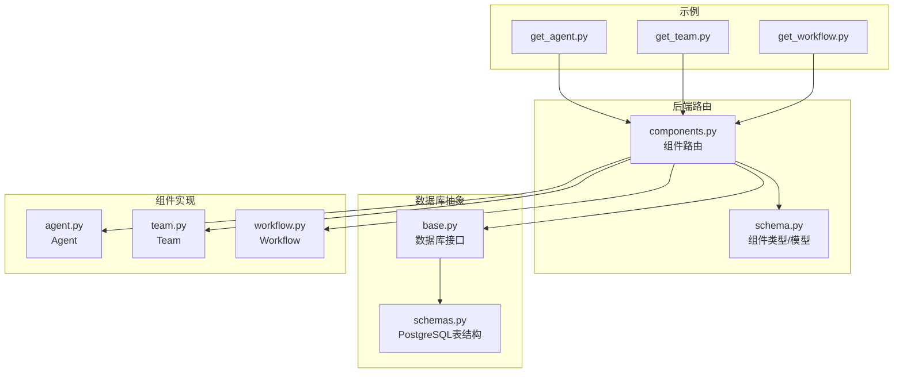
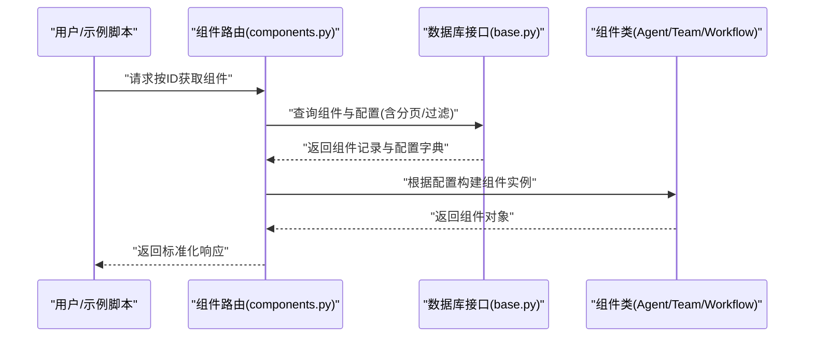
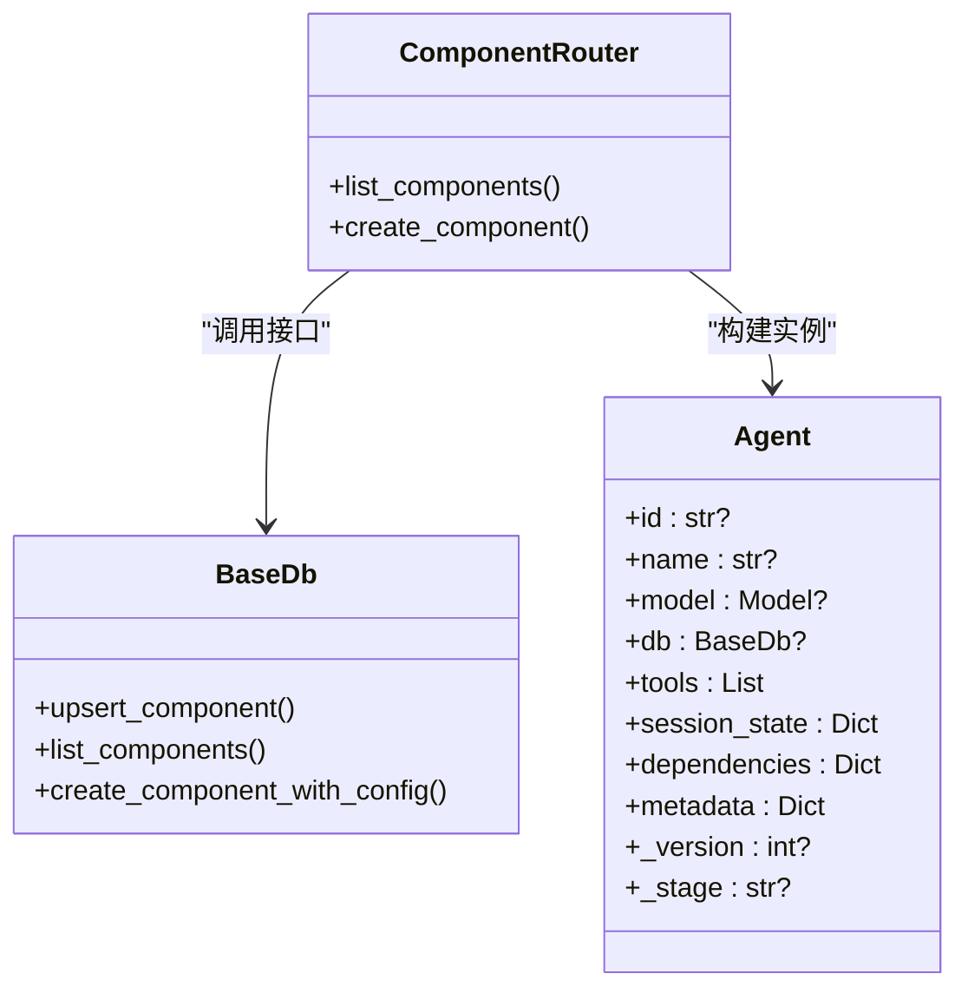
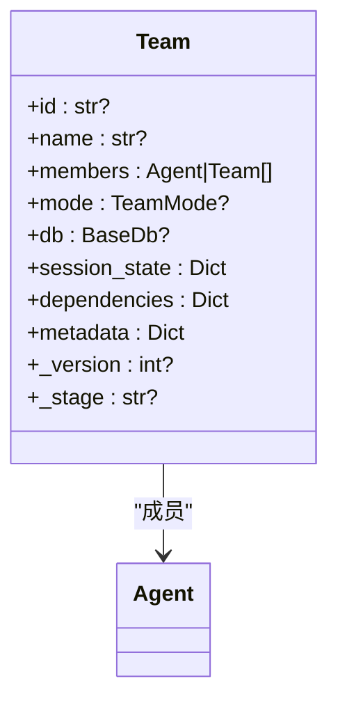
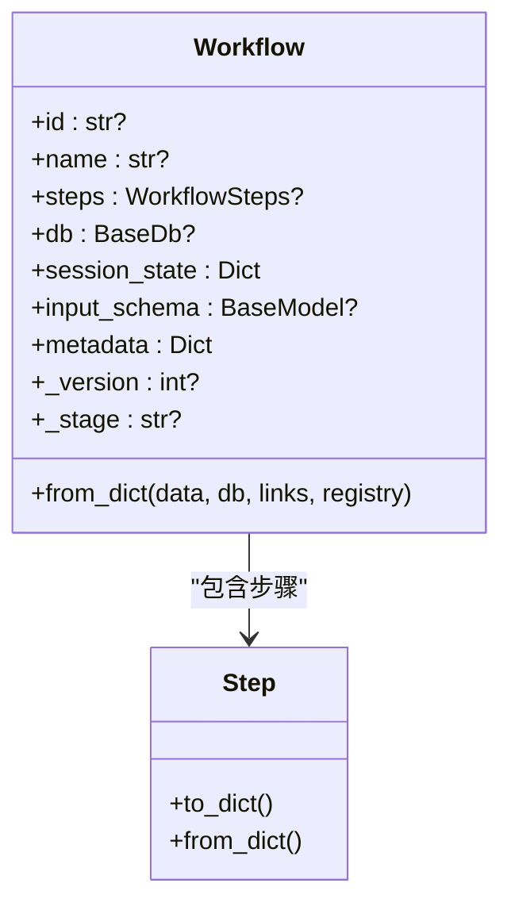
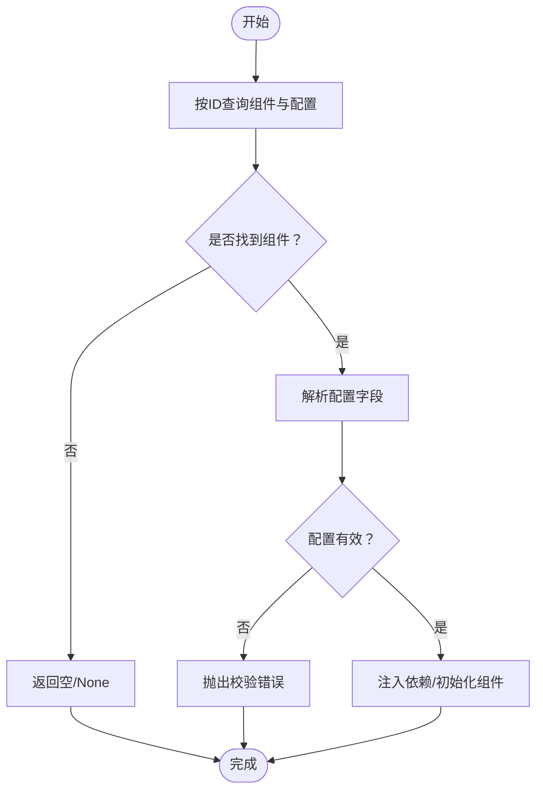
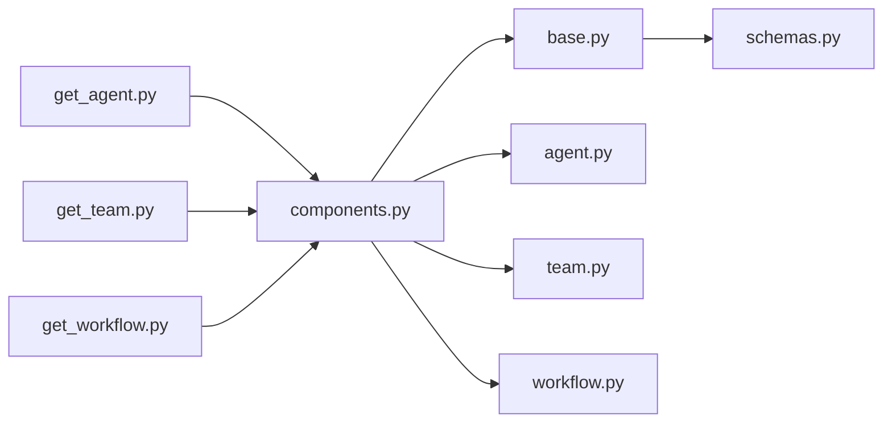

# 组件获取

<cite>
**本文引用的文件**
- [get_agent.py](file://cookbook/93_components/get_agent.py)
- [get_team.py](file://cookbook/93_components/get_team.py)
- [get_workflow.py](file://cookbook/93_components/get_workflow.py)
- [components.py](file://libs/agno/agno/os/routers/components/components.py)
- [base.py](file://libs/agno/agno/db/base.py)
- [schema.py](file://libs/agno/agno/os/schema.py)
- [schemas.py](file://libs/agno/agno/db/postgres/schemas.py)
- [agent.py](file://libs/agno/agno/agent/agent.py)
- [team.py](file://libs/agno/agno/team/team.py)
- [workflow.py](file://libs/agno/agno/workflow/workflow.py)
- [test_per_request_isolation.py](file://libs/agno/tests/unit/os/test_per_request_isolation.py)
</cite>

## 目录
1. [简介](#简介)
2. [项目结构](#项目结构)
3. [核心组件](#核心组件)
4. [架构总览](#架构总览)
5. [详细组件分析](#详细组件分析)
6. [依赖分析](#依赖分析)
7. [性能考虑](#性能考虑)
8. [故障排查指南](#故障排查指南)
9. [结论](#结论)
10. [附录](#附录)

## 简介
本章节系统性阐述“组件获取”能力：如何通过组件ID或标识符从持久化存储中检索并重建组件（代理、团队、工作流），以及在此过程中涉及的配置加载、参数解析、默认值与校验、依赖注入与实例化流程。文档同时覆盖不同组件类型的差异化处理逻辑、错误处理策略与最佳实践，并提供可直接参考的代码路径。

## 项目结构
围绕组件获取的关键位置如下：
- 示例入口：cookbook/93_components 下的 get_agent.py、get_team.py、get_workflow.py 展示了从数据库按ID加载组件的基本用法。
- 后端路由与组件模型：libs/agno/agno/os/routers/components/components.py 提供组件列表与创建接口；os/schema.py 定义组件类型与响应模型；db/base.py 抽象数据库接口；db/postgres/schemas.py 描述PostgreSQL表结构。
- 组件类与实例化：agent/agent.py、team/team.py、workflow/workflow.py 中定义了组件类及其初始化、序列化/反序列化、运行时会话管理等。

图表来源
- [get_agent.py:1-31](file://cookbook/93_components/get_agent.py#L1-L31)
- [get_team.py:1-31](file://cookbook/93_components/get_team.py#L1-L31)
- [get_workflow.py:1-31](file://cookbook/93_components/get_workflow.py#L1-L31)
- [components.py:107-172](file://libs/agno/agno/os/routers/components/components.py#L107-L172)
- [schema.py:558-588](file://libs/agno/agno/os/schema.py#L558-L588)
- [base.py:588-695](file://libs/agno/agno/db/base.py#L588-L695)
- [schemas.py:166-188](file://libs/agno/agno/db/postgres/schemas.py#L166-L188)
- [agent.py:67-800](file://libs/agno/agno/agent/agent.py#L67-L800)
- [team.py:70-800](file://libs/agno/agno/team/team.py#L70-L800)
- [workflow.py:207-800](file://libs/agno/agno/workflow/workflow.py#L207-L800)

章节来源
- [get_agent.py:1-31](file://cookbook/93_components/get_agent.py#L1-L31)
- [get_team.py:1-31](file://cookbook/93_components/get_team.py#L1-L31)
- [get_workflow.py:1-31](file://cookbook/93_components/get_workflow.py#L1-L31)
- [components.py:107-172](file://libs/agno/agno/os/routers/components/components.py#L107-L172)
- [schema.py:558-588](file://libs/agno/agno/os/schema.py#L558-L588)
- [base.py:588-695](file://libs/agno/agno/db/base.py#L588-L695)
- [schemas.py:166-188](file://libs/agno/agno/db/postgres/schemas.py#L166-L188)
- [agent.py:67-800](file://libs/agno/agno/agent/agent.py#L67-L800)
- [team.py:70-800](file://libs/agno/agno/team/team.py#L70-L800)
- [workflow.py:207-800](file://libs/agno/agno/workflow/workflow.py#L207-L800)

## 核心组件
- 组件类型与模型
  - 组件类型枚举：agent、team、workflow。
  - 响应模型包含组件ID、类型、名称、描述、当前版本、元数据、时间戳等。
- 数据库接口
  - upsert_component、delete_component、list_components、create_component_with_config 等抽象方法，支持组件的增删改查与分页。
  - PostgreSQL 表结构定义：components 与 component_configs 两张表，分别存储组件元信息与配置版本。
- 组件类
  - Agent、Team、Workflow 分别承载各自的配置字段、运行时会话、工具、钩子、学习机、文化知识压缩等能力，并在加载时设置版本与阶段等元数据。

章节来源
- [schema.py:558-588](file://libs/agno/agno/os/schema.py#L558-L588)
- [base.py:588-695](file://libs/agno/agno/db/base.py#L588-L695)
- [schemas.py:166-188](file://libs/agno/agno/db/postgres/schemas.py#L166-L188)
- [agent.py:67-800](file://libs/agno/agno/agent/agent.py#L67-L800)
- [team.py:70-800](file://libs/agno/agno/team/team.py#L70-L800)
- [workflow.py:207-800](file://libs/agno/agno/workflow/workflow.py#L207-L800)

## 架构总览
组件获取的整体流程由“示例脚本 → 路由层 → 数据库接口 → 组件类实例化/重建”构成。示例脚本通过 get_agent_by_id、get_team_by_id、get_workflow_by_id 从数据库加载组件；路由层负责参数解析、分页、排除注册表内组件ID、调用数据库接口并返回标准化响应；数据库层提供统一的组件读写能力；组件类负责将配置还原为可执行对象。

图表来源
- [components.py:107-172](file://libs/agno/agno/os/routers/components/components.py#L107-L172)
- [base.py:588-695](file://libs/agno/agno/db/base.py#L588-L695)
- [agent.py:67-800](file://libs/agno/agno/agent/agent.py#L67-L800)
- [team.py:70-800](file://libs/agno/agno/team/team.py#L70-L800)
- [workflow.py:207-800](file://libs/agno/agno/workflow/workflow.py#L207-L800)

## 详细组件分析

### 代理组件获取
- 获取入口
  - 示例脚本通过 get_agent_by_id 从数据库按ID加载代理。
- 实例化流程
  - 路由层调用数据库接口获取组件与配置，随后根据配置字典构建 Agent 实例；Agent 在初始化时设置版本与阶段等元数据。
- 配置加载与参数解析
  - 配置字典包含模型、工具、钩子、记忆、会话、知识、技能、推理、流式输出等字段；Agent 初始化时对字段进行赋值与默认值处理。
- 依赖注入
  - Agent 支持数据库、内存管理器、文化管理器、压缩管理器、学习机等依赖注入；这些依赖在加载配置时被解析并注入到组件实例。

图表来源
- [agent.py:67-800](file://libs/agno/agno/agent/agent.py#L67-L800)
- [components.py:107-172](file://libs/agno/agno/os/routers/components/components.py#L107-L172)
- [base.py:588-695](file://libs/agno/agno/db/base.py#L588-L695)

章节来源
- [get_agent.py:1-31](file://cookbook/93_components/get_agent.py#L1-L31)
- [agent.py:67-800](file://libs/agno/agno/agent/agent.py#L67-L800)
- [components.py:107-172](file://libs/agno/agno/os/routers/components/components.py#L107-L172)
- [base.py:588-695](file://libs/agno/agno/db/base.py#L588-L695)

### 团队组件获取
- 获取入口
  - 示例脚本通过 get_team_by_id 从数据库按ID加载团队。
- 实例化流程
  - 路由层调用数据库接口获取组件与配置，随后根据配置字典构建 Team 实例；Team 在初始化时设置版本与阶段等元数据。
- 配置加载与参数解析
  - 配置字典包含成员（Agent/Team）、模式、工具、钩子、历史、知识、会话、学习机、压缩等字段；Team 初始化时对字段进行赋值与默认值处理。
- 依赖注入
  - Team 支持数据库、内存管理器、会话摘要管理器、学习机、压缩管理器等依赖注入；成员初始化时也会继承调试级别与钩子设置。

图表来源
- [team.py:70-800](file://libs/agno/agno/team/team.py#L70-L800)
- [agent.py:67-800](file://libs/agno/agno/agent/agent.py#L67-L800)

章节来源
- [get_team.py:1-31](file://cookbook/93_components/get_team.py#L1-L31)
- [team.py:70-800](file://libs/agno/agno/team/team.py#L70-L800)
- [agent.py:67-800](file://libs/agno/agno/agent/agent.py#L67-L800)
- [components.py:107-172](file://libs/agno/agno/os/routers/components/components.py#L107-L172)
- [base.py:588-695](file://libs/agno/agno/db/base.py#L588-L695)

### 工作流组件获取
- 获取入口
  - 示例脚本通过 get_workflow_by_id 从数据库按ID加载工作流。
- 实例化流程
  - 路由层调用数据库接口获取组件与配置，随后根据配置字典构建 Workflow 实例；Workflow 在初始化时设置版本与阶段等元数据。
- 配置加载与参数解析
  - 配置字典包含步骤（Step/Steps/Loop/Parallel/Condition/Router）、输入模式、会话、流式输出、事件存储等字段；Workflow 提供 from_dict 将字典还原为可执行的工作流。
- 依赖注入
  - Workflow 支持数据库、会话、Websocket处理器、输入Schema等依赖注入；步骤内部可进一步加载代理/团队等执行器。

图表来源
- [workflow.py:207-800](file://libs/agno/agno/workflow/workflow.py#L207-L800)
- [team.py:70-800](file://libs/agno/agno/team/team.py#L70-L800)
- [agent.py:67-800](file://libs/agno/agno/agent/agent.py#L67-L800)

章节来源
- [get_workflow.py:1-31](file://cookbook/93_components/get_workflow.py#L1-L31)
- [workflow.py:207-800](file://libs/agno/agno/workflow/workflow.py#L207-L800)
- [components.py:107-172](file://libs/agno/agno/os/routers/components/components.py#L107-L172)
- [base.py:588-695](file://libs/agno/agno/db/base.py#L588-L695)

### 不同组件类型的获取差异
- 代理：侧重模型、工具、钩子、记忆、会话、知识、技能、推理、流式输出等字段的加载与注入。
- 团队：在代理基础上增加成员管理、团队模式、成员交互共享、团队历史等字段。
- 工作流：以步骤为核心，支持 Step、Steps、Loop、Parallel、Condition、Router 等多种步骤类型，通过 from_dict 进行动态重建。

章节来源
- [agent.py:67-800](file://libs/agno/agno/agent/agent.py#L67-L800)
- [team.py:70-800](file://libs/agno/agno/team/team.py#L70-L800)
- [workflow.py:207-800](file://libs/agno/agno/workflow/workflow.py#L207-L800)

### 组件配置加载过程
- 参数解析
  - 路由层接收组件类型、分页参数，调用数据库接口获取组件与配置。
- 默认值设置
  - 组件类在初始化时对字段进行默认值处理（如历史消息数量、工具限制、流式输出开关等）。
- 验证机制
  - 输入Schema用于校验输入；组件类内部对字段进行类型与范围检查；测试用例验证未知ID返回None等行为。

章节来源
- [components.py:107-172](file://libs/agno/agno/os/routers/components/components.py#L107-L172)
- [schema.py:558-588](file://libs/agno/agno/os/schema.py#L558-L588)
- [agent.py:67-800](file://libs/agno/agno/agent/agent.py#L67-L800)
- [team.py:70-800](file://libs/agno/agno/team/team.py#L70-L800)
- [workflow.py:207-800](file://libs/agno/agno/workflow/workflow.py#L207-L800)
- [test_per_request_isolation.py:153-189](file://libs/agno/tests/unit/os/test_per_request_isolation.py#L153-L189)

### 错误处理策略
- 组件不存在
  - 测试用例验证当ID不存在时返回None；路由层捕获异常并返回500。
- 版本不兼容
  - 组件类在加载时设置版本与阶段元数据，若配置版本不匹配，应在上层逻辑中进行校验与降级处理。
- 依赖缺失
  - 数据库、模型、工具、知识、会话等依赖缺失时，组件初始化阶段会抛出异常或警告；建议在路由层捕获并返回友好错误。

图表来源
- [components.py:107-172](file://libs/agno/agno/os/routers/components/components.py#L107-L172)
- [base.py:588-695](file://libs/agno/agno/db/base.py#L588-L695)
- [test_per_request_isolation.py:153-189](file://libs/agno/tests/unit/os/test_per_request_isolation.py#L153-L189)

章节来源
- [components.py:107-172](file://libs/agno/agno/os/routers/components/components.py#L107-L172)
- [base.py:588-695](file://libs/agno/agno/db/base.py#L588-L695)
- [test_per_request_isolation.py:153-189](file://libs/agno/tests/unit/os/test_per_request_isolation.py#L153-L189)

## 依赖分析
- 组件路由依赖数据库接口，数据库接口依赖PostgreSQL表结构定义。
- 组件类依赖数据库、模型、工具、钩子、记忆、会话、知识、学习机、文化、压缩等模块。
- 示例脚本依赖组件路由提供的工厂函数（get_agent_by_id、get_team_by_id、get_workflow_by_id）。

图表来源
- [get_agent.py:1-31](file://cookbook/93_components/get_agent.py#L1-L31)
- [get_team.py:1-31](file://cookbook/93_components/get_team.py#L1-L31)
- [get_workflow.py:1-31](file://cookbook/93_components/get_workflow.py#L1-L31)
- [components.py:107-172](file://libs/agno/agno/os/routers/components/components.py#L107-L172)
- [base.py:588-695](file://libs/agno/agno/db/base.py#L588-L695)
- [schemas.py:166-188](file://libs/agno/agno/db/postgres/schemas.py#L166-L188)
- [agent.py:67-800](file://libs/agno/agno/agent/agent.py#L67-L800)
- [team.py:70-800](file://libs/agno/agno/team/team.py#L70-L800)
- [workflow.py:207-800](file://libs/agno/agno/workflow/workflow.py#L207-L800)

章节来源
- [get_agent.py:1-31](file://cookbook/93_components/get_agent.py#L1-L31)
- [get_team.py:1-31](file://cookbook/93_components/get_team.py#L1-L31)
- [get_workflow.py:1-31](file://cookbook/93_components/get_workflow.py#L1-L31)
- [components.py:107-172](file://libs/agno/agno/os/routers/components/components.py#L107-L172)
- [base.py:588-695](file://libs/agno/agno/db/base.py#L588-L695)
- [schemas.py:166-188](file://libs/agno/agno/db/postgres/schemas.py#L166-L188)
- [agent.py:67-800](file://libs/agno/agno/agent/agent.py#L67-L800)
- [team.py:70-800](file://libs/agno/agno/team/team.py#L70-L800)
- [workflow.py:207-800](file://libs/agno/agno/workflow/workflow.py#L207-L800)

## 性能考虑
- 分页与过滤：路由层支持按类型分页查询，避免一次性加载过多组件。
- 缓存与会话：组件类支持会话缓存与可选的背景线程池，减少重复初始化开销。
- 存储增长：代理可选择存储完整历史以降低重建成本，但会导致存储呈二次增长；需结合业务权衡。

## 故障排查指南
- 组件不存在
  - 检查ID是否正确；确认数据库中是否存在该组件；查看路由层异常日志。
- 未知ID返回None
  - 单元测试验证了未知ID返回None的行为，确保上层逻辑正确处理None情况。
- 数据库连接问题
  - 确认数据库URL与凭据；检查PostgreSQL表结构是否一致；验证组件与配置表的数据完整性。

章节来源
- [test_per_request_isolation.py:153-189](file://libs/agno/tests/unit/os/test_per_request_isolation.py#L153-L189)
- [components.py:107-172](file://libs/agno/agno/os/routers/components/components.py#L107-L172)
- [schemas.py:166-188](file://libs/agno/agno/db/postgres/schemas.py#L166-L188)

## 结论
组件获取通过“示例脚本 → 路由层 → 数据库接口 → 组件类”的链路实现，具备完善的配置加载、参数解析、默认值与校验、依赖注入与实例化能力。针对代理、团队、工作流三类组件，路由层提供统一的查询与创建接口，组件类负责将配置还原为可执行对象。建议在生产环境中结合分页、缓存与严格的输入校验，确保性能与稳定性。

## 附录
- 最佳实践
  - 使用分页与类型过滤减少查询压力。
  - 在路由层捕获并记录异常，返回结构化错误信息。
  - 对输入Schema进行严格校验，避免无效配置进入组件初始化。
  - 合理设置组件缓存与会话缓存，平衡性能与资源占用。
  - 对于工作流，优先使用 from_dict 动态重建步骤，确保步骤类型一致性。