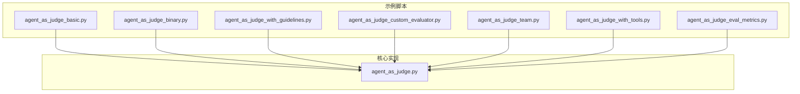
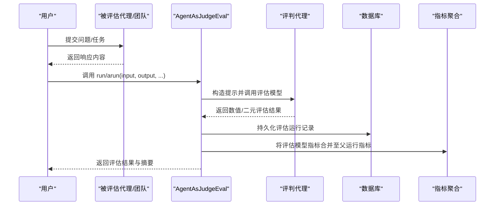
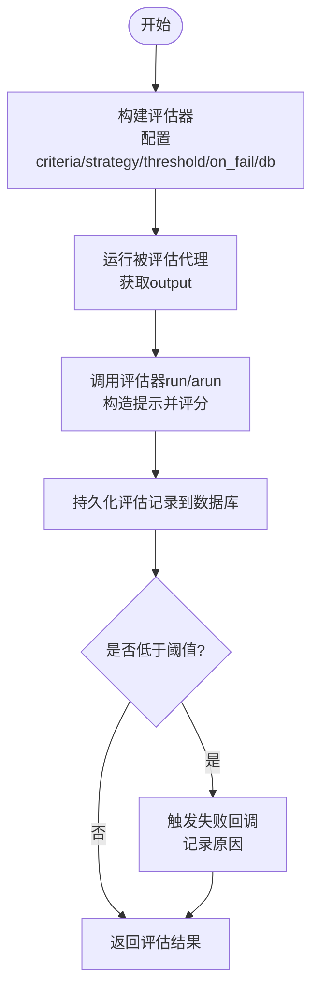
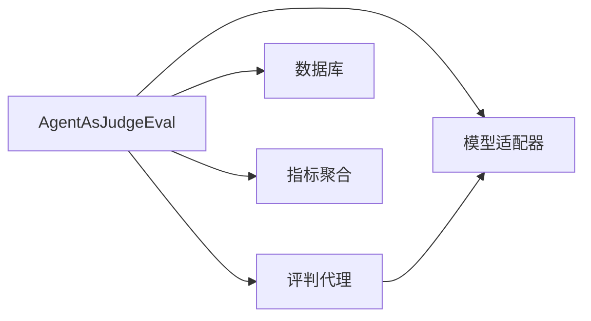

# 代理作为评判者

<cite>
**本文引用的文件**
- [agent_as_judge_basic.py](file://cookbook/09_evals/agent_as_judge/agent_as_judge_basic.py)
- [agent_as_judge_binary.py](file://cookbook/09_evals/agent_as_judge/agent_as_judge_binary.py)
- [agent_as_judge_with_guidelines.py](file://cookbook/09_evals/agent_as_judge/agent_as_judge_with_guidelines.py)
- [agent_as_judge_custom_evaluator.py](file://cookbook/09_evals/agent_as_judge/agent_as_judge_custom_evaluator.py)
- [agent_as_judge_team.py](file://cookbook/09_evals/agent_as_judge/agent_as_judge_team.py)
- [agent_as_judge_with_tools.py](file://cookbook/09_evals/agent_as_judge/agent_as_judge_with_tools.py)
- [agent_as_judge_eval_metrics.py](file://cookbook/09_evals/agent_as_judge/agent_as_judge_eval_metrics.py)
- [evaluator_agent.py](file://cookbook/09_evals/accuracy/evaluator_agent.py)
- [agent_as_judge.py](file://libs/agno/agno/eval/agent_as_judge.py)
</cite>

## 目录
1. [简介](#简介)
2. [项目结构](#项目结构)
3. [核心组件](#核心组件)
4. [架构总览](#架构总览)
5. [详细组件分析](#详细组件分析)
6. [依赖关系分析](#依赖关系分析)
7. [性能考量](#性能考量)
8. [故障排查指南](#故障排查指南)
9. [结论](#结论)
10. [附录](#附录)

## 简介
本文件围绕“代理作为评判者”主题，系统性梳理代理自动评估体系的设计理念与实现原理。内容涵盖：
- 判决代理的架构设计：以统一的评估器接口为核心，支持同步/异步、数值/二元评分策略、附加指导原则、自定义评判代理以及团队输出评估。
- 评估标准制定与自动化流程：通过标准化的输入输出与评分策略，结合数据库持久化与指标聚合，形成可复用的评估流水线。
- 基础评判代理实现：评估逻辑、评分算法（数值/二元）、结果处理与失败回调。
- 团队评判代理应用场景：多代理协作评估、团队决策评估、复杂任务评估。
- 带指导原则的评判方法：评估准则制定、指导原则应用、评估一致性保障。
- 自定义评估器开发：评估器接口设计、评估逻辑实现与结果处理。
- 实践与最佳实践：评估效率优化、结果准确性保证、评估流程自动化。

## 项目结构
本专题涉及的代码主要分布在以下位置：
- 示例与使用：cookbook/09_evals/agent_as_judge 下的多个示例脚本，覆盖基础、二元、指导原则、自定义评估器、团队、工具使用、后置钩子与指标统计等场景。
- 核心实现：libs/agno/agno/eval/agent_as_judge.py，包含 AgentAsJudgeEval 的核心逻辑与数据模型。

**图表来源**
- [agent_as_judge_basic.py:1-106](file://cookbook/09_evals/agent_as_judge/agent_as_judge_basic.py#L1-L106)
- [agent_as_judge_binary.py:1-48](file://cookbook/09_evals/agent_as_judge/agent_as_judge_binary.py#L1-L48)
- [agent_as_judge_with_guidelines.py:1-65](file://cookbook/09_evals/agent_as_judge/agent_as_judge_with_guidelines.py#L1-L65)
- [agent_as_judge_custom_evaluator.py:1-52](file://cookbook/09_evals/agent_as_judge/agent_as_judge_custom_evaluator.py#L1-L52)
- [agent_as_judge_team.py:1-73](file://cookbook/09_evals/agent_as_judge/agent_as_judge_team.py#L1-L73)
- [agent_as_judge_with_tools.py:1-46](file://cookbook/09_evals/agent_as_judge/agent_as_judge_with_tools.py#L1-L46)
- [agent_as_judge_eval_metrics.py:1-63](file://cookbook/09_evals/agent_as_judge/agent_as_judge_eval_metrics.py#L1-L63)
- [agent_as_judge.py:292-384](file://libs/agno/agno/eval/agent_as_judge.py#L292-L384)

**章节来源**
- [agent_as_judge_basic.py:1-106](file://cookbook/09_evals/agent_as_judge/agent_as_judge_basic.py#L1-L106)
- [agent_as_judge.py:292-384](file://libs/agno/agno/eval/agent_as_judge.py#L292-L384)

## 核心组件
- 评估器接口与运行时
  - AgentAsJudgeEval：统一的评估器入口，支持同步/异步 run/arun，接收 input、output、criteria、scoring_strategy、threshold、additional_guidelines、evaluator_agent、db 等参数。
  - 评估结果类型：NumericJudgeResponse/BinaryJudgeResponse，分别对应数值评分与二元判定；最终汇总为 AgentAsJudgeEvaluation，包含 score、reason、passed 等字段。
- 数据存储与指标
  - 支持多种数据库后端（如 Postgres、SQLite），评估运行记录会持久化到数据库，便于审计与回溯。
  - 指标聚合：当评估器作为后置钩子使用时，评估模型的 token 使用情况会被累加到原始代理运行指标中，便于统一成本与性能分析。
- 评估策略
  - 数值评分：返回 0~10 分或指定范围的分数，按阈值判定通过/不通过。
  - 二元评分：直接返回通过/不通过，适合快速过滤与门禁式质量控制。
  - 指导原则：允许在评估时注入额外规则，提升评估一致性与可解释性。
  - 自定义评估器：允许传入独立的评估代理，用于更严格或特定领域的评判。

**章节来源**
- [agent_as_judge.py:292-384](file://libs/agno/agno/eval/agent_as_judge.py#L292-L384)
- [agent_as_judge_eval_metrics.py:1-63](file://cookbook/09_evals/agent_as_judge/agent_as_judge_eval_metrics.py#L1-L63)

## 架构总览
下图展示了从“被评估对象”到“评判代理”的整体调用链路与数据流：

**图表来源**
- [agent_as_judge_basic.py:88-106](file://cookbook/09_evals/agent_as_judge/agent_as_judge_basic.py#L88-L106)
- [agent_as_judge.py:292-384](file://libs/agno/agno/eval/agent_as_judge.py#L292-L384)
- [agent_as_judge_eval_metrics.py:36-63](file://cookbook/09_evals/agent_as_judge/agent_as_judge_eval_metrics.py#L36-L63)

## 详细组件分析

### 基础评判代理（数值评分）
- 设计要点
  - 同步/异步两种运行模式，分别对应 run 与 arun。
  - 数值评分策略配合阈值进行通过判定；失败回调可用于触发重试或告警。
  - 数据库持久化确保评估历史可追溯。
- 关键流程
  - 构建评估器实例，设置 criteria、scoring_strategy、threshold、on_fail 等。
  - 执行被评估代理生成 output，调用评估器 run/arun 完成评分与持久化。
- 最佳实践
  - 明确评分维度与阈值，避免过严或过松导致误判。
  - 在失败回调中记录原因与上下文，便于后续优化。

**图表来源**
- [agent_as_judge_basic.py:17-42](file://cookbook/09_evals/agent_as_judge/agent_as_judge_basic.py#L17-L42)
- [agent_as_judge_basic.py:88-106](file://cookbook/09_evals/agent_as_judge/agent_as_judge_basic.py#L88-L106)
- [agent_as_judge.py:292-384](file://libs/agno/agno/eval/agent_as_judge.py#L292-L384)

**章节来源**
- [agent_as_judge_basic.py:1-106](file://cookbook/09_evals/agent_as_judge/agent_as_judge_basic.py#L1-L106)

### 二元评判代理（通过/不通过）
- 设计要点
  - 适用于门禁式质量控制，快速过滤低质量输出。
  - 无需阈值，直接根据 passed 字段判定。
- 应用建议
  - 与失败回调结合，对不通过的输出执行降级策略或重试。

**章节来源**
- [agent_as_judge_binary.py:1-48](file://cookbook/09_evals/agent_as_judge/agent_as_judge_binary.py#L1-L48)

### 带指导原则的评判方法
- 设计要点
  - 通过 additional_guidelines 注入领域规则，增强评估一致性。
  - 适用于产品规范、技术准确性等需要强约束的场景。
- 实施建议
  - 指导原则应具体、可验证，避免模糊表述。
  - 与数值评分结合，既保证通过率也提升可解释性。

**章节来源**
- [agent_as_judge_with_guidelines.py:1-65](file://cookbook/09_evals/agent_as_judge/agent_as_judge_with_guidelines.py#L1-L65)

### 自定义评估器的开发
- 设计要点
  - 通过 evaluator_agent 参数注入独立的评估代理，实现更严格或特定领域的评判。
  - 可结合更强的指令与描述，使评估风格更符合业务需求。
- 实施建议
  - 评估代理与被评估代理解耦，便于独立迭代与测试。
  - 对评估结果进行归因与可视化，辅助持续改进。

**章节来源**
- [agent_as_judge_custom_evaluator.py:1-52](file://cookbook/09_evals/agent_as_judge/agent_as_judge_custom_evaluator.py#L1-L52)

### 团队评判代理（多代理协作评估）
- 设计要点
  - 针对团队输出进行统一质量评估，支持多成员协作后的综合判断。
  - 适用于研究-写作、规划-执行等多阶段任务。
- 实施建议
  - 在团队指令中明确分工与产出要求，减少歧义。
  - 评估 criteria 应覆盖“完整性、连贯性、准确性”等维度。

**章节来源**
- [agent_as_judge_team.py:1-73](file://cookbook/09_evals/agent_as_judge/agent_as_judge_team.py#L1-L73)

### 工具使用场景下的评判
- 设计要点
  - 针对使用工具生成的输出进行质量评估，强调过程可解释性与最终答案正确性。
  - 适用于计算器、检索、推理等工具链场景。
- 实施建议
  - criteria 中明确要求展示中间步骤与最终答案，避免“黑盒”输出。
  - 结合阈值与失败回调，确保关键任务的可靠性。

**章节来源**
- [agent_as_judge_with_tools.py:1-46](file://cookbook/09_evals/agent_as_judge/agent_as_judge_with_tools.py#L1-L46)

### 评估指标与后置钩子集成
- 设计要点
  - 将评估器作为后置钩子使用时，评估模型的 token 使用会被累加到原始运行指标中，便于统一成本与性能分析。
  - 通过 run_output.metrics.details 区分“agent_model”与“eval_model”，实现精细化度量。
- 实施建议
  - 在生产环境中开启后置钩子评估，确保质量与成本双监控。
  - 对评估指标进行定期审计，识别异常波动。

**章节来源**
- [agent_as_judge_eval_metrics.py:1-63](file://cookbook/09_evals/agent_as_judge/agent_as_judge_eval_metrics.py#L1-L63)

### 与准确率评估的对比（参考）
- 设计要点
  - 准确率评估通常面向“给定期望答案”的比较，而“代理作为评判者”更偏向“通用质量判别”。
  - 可引入自定义评估代理与指导原则，提升判别能力与一致性。
- 实施建议
  - 在复杂任务中，先用“代理作为评判者”做门禁式筛选，再用准确率评估做精细校验。

**章节来源**
- [evaluator_agent.py:1-41](file://cookbook/09_evals/accuracy/evaluator_agent.py#L1-L41)

## 依赖关系分析
- 组件耦合
  - AgentAsJudgeEval 依赖于评估代理（默认内置或自定义）、模型、数据库与指标聚合模块。
  - 评估结果与数据库持久化解耦，便于替换存储后端。
- 外部依赖
  - OpenAI 模型适配器、PostgreSQL/SQLite 数据库驱动、指标聚合工具。
- 潜在风险
  - 评估模型的 token 成本与延迟可能影响整体性能，需通过阈值与缓存策略控制。
  - 指导原则与评估标准需定期评审，避免过时导致误判。

**图表来源**
- [agent_as_judge.py:292-384](file://libs/agno/agno/eval/agent_as_judge.py#L292-L384)

**章节来源**
- [agent_as_judge.py:292-384](file://libs/agno/agno/eval/agent_as_judge.py#L292-L384)

## 性能考量
- 评估效率优化
  - 使用异步评估（arun）与批量评估（示例中提供批处理脚本）降低等待时间。
  - 缓存常用提示与评估模板，减少重复计算。
- 结果准确性保证
  - 引入指导原则与自定义评估代理，提升判别一致性。
  - 对评估结果进行抽样复核与 A/B 对比，持续优化 criteria 与阈值。
- 评估流程自动化
  - 将评估器作为后置钩子集成到代理运行流程，实现端到端自动化。
  - 通过数据库记录与指标聚合，建立评估闭环与可观测性。

[本节为通用建议，无需特定文件来源]

## 故障排查指南
- 常见问题
  - 评估结果类型不匹配：确保评估代理返回数值或二元响应，否则抛出错误。
  - 低于阈值：检查 criteria 是否过于严格，或是否需要调整阈值与指导原则。
  - 指标未聚合：确认评估器是否作为后置钩子使用，且运行指标存在。
- 排查步骤
  - 查看评估记录与最新运行 ID，定位失败样本。
  - 检查评估代理的指令与输出模式，确保与预期一致。
  - 对比不同评估策略（数值 vs 二元）与阈值，找到平衡点。

**章节来源**
- [agent_as_judge.py:292-384](file://libs/agno/agno/eval/agent_as_judge.py#L292-L384)

## 结论
“代理作为评判者”提供了统一、可扩展、可自动化的评估框架。通过数值/二元评分策略、指导原则、自定义评估代理与团队协作评估，能够覆盖从单体代理到复杂任务的多样化场景。结合数据库持久化与指标聚合，可实现质量与成本的双重治理，支撑生产级的自动化评估流水线。

[本节为总结，无需特定文件来源]

## 附录
- 快速上手清单
  - 选择评分策略（数值/二元）与阈值。
  - 明确评估标准与指导原则。
  - 选择或构建评估代理，必要时启用后置钩子。
  - 连接数据库并观察评估记录与指标。
- 参考示例路径
  - 基础数值评估：[agent_as_judge_basic.py:1-106](file://cookbook/09_evals/agent_as_judge/agent_as_judge_basic.py#L1-L106)
  - 二元评估：[agent_as_judge_binary.py:1-48](file://cookbook/09_evals/agent_as_judge/agent_as_judge_binary.py#L1-L48)
  - 指导原则：[agent_as_judge_with_guidelines.py:1-65](file://cookbook/09_evals/agent_as_judge/agent_as_judge_with_guidelines.py#L1-L65)
  - 自定义评估器：[agent_as_judge_custom_evaluator.py:1-52](file://cookbook/09_evals/agent_as_judge/agent_as_judge_custom_evaluator.py#L1-L52)
  - 团队评估：[agent_as_judge_team.py:1-73](file://cookbook/09_evals/agent_as_judge/agent_as_judge_team.py#L1-L73)
  - 工具使用评估：[agent_as_judge_with_tools.py:1-46](file://cookbook/09_evals/agent_as_judge/agent_as_judge_with_tools.py#L1-L46)
  - 指标与后置钩子：[agent_as_judge_eval_metrics.py:1-63](file://cookbook/09_evals/agent_as_judge/agent_as_judge_eval_metrics.py#L1-L63)

[本节为补充材料，无需特定文件来源]