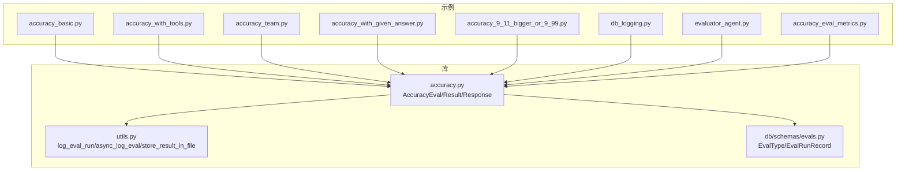
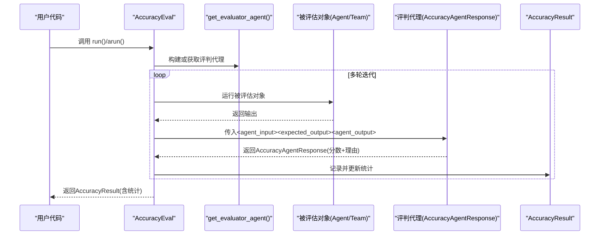
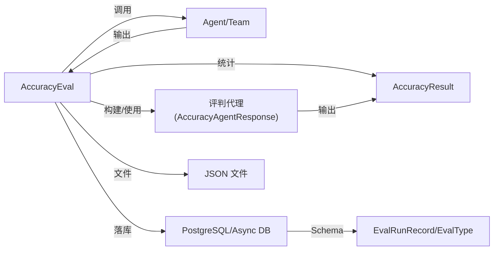

# 准确性评估

<cite>
**本文引用的文件**
- [libs/agno/agno/eval/accuracy.py](file://libs/agno/agno/eval/accuracy.py)
- [libs/agno/agno/eval/utils.py](file://libs/agno/agno/eval/utils.py)
- [libs/agno/agno/db/schemas/evals.py](file://libs/agno/agno/db/schemas/evals.py)
- [cookbook/09_evals/accuracy/README.md](file://cookbook/09_evals/accuracy/README.md)
- [cookbook/09_evals/accuracy/accuracy_basic.py](file://cookbook/09_evals/accuracy/accuracy_basic.py)
- [cookbook/09_evals/accuracy/accuracy_with_tools.py](file://cookbook/09_evals/accuracy/accuracy_with_tools.py)
- [cookbook/09_evals/accuracy/accuracy_team.py](file://cookbook/09_evals/accuracy/accuracy_team.py)
- [cookbook/09_evals/accuracy/accuracy_with_given_answer.py](file://cookbook/09_evals/accuracy/accuracy_with_given_answer.py)
- [cookbook/09_evals/accuracy/accuracy_9_11_bigger_or_9_99.py](file://cookbook/09_evals/accuracy/accuracy_9_11_bigger_or_9_99.py)
- [cookbook/09_evals/accuracy/db_logging.py](file://cookbook/09_evals/accuracy/db_logging.py)
- [cookbook/09_evals/accuracy/evaluator_agent.py](file://cookbook/09_evals/accuracy/evaluator_agent.py)
- [cookbook/09_evals/accuracy/accuracy_eval_metrics.py](file://cookbook/09_evals/accuracy/accuracy_eval_metrics.py)
</cite>

## 目录
1. [简介](#简介)
2. [项目结构](#项目结构)
3. [核心组件](#核心组件)
4. [架构总览](#架构总览)
5. [详细组件分析](#详细组件分析)
6. [依赖关系分析](#依赖关系分析)
7. [性能考量](#性能考量)
8. [故障排查指南](#故障排查指南)
9. [结论](#结论)
10. [附录](#附录)

## 简介
本文件系统化梳理“准确性评估”模块的设计与实现，覆盖以下主题：
- 评估目标与核心概念：以“期望输出”为基准，对比“被评估对象输出”，通过结构化评分与理由输出，形成可复现、可观测、可统计的评估闭环。
- 评估类型与场景：基础准确性测试、工具使用准确性测试、团队协作准确性测试；支持同步/异步执行、自定义评判模型、数据库持久化、指标聚合等。
- 评估指标与统计：平均分、均值、最小/最大分、标准差等；并提供评分细则与应用场景建议。
- 数据准备与处理：测试用例设计、答案验证、结果比较与报告输出。
- 评估代理构建与配置：评判逻辑设计、评分标准制定、输出格式约束、评测指标合并到主会话。
- 结果分析与报告：统计汇总、趋势分析与改进建议。

## 项目结构
准确性评估位于示例与库两处：
- 示例（cookbook/09_evals/accuracy/）：提供多种典型用法与集成方式，便于快速上手与对照参考。
- 库（libs/agno/agno/eval/accuracy.py）：封装了评估核心逻辑、评判代理构建、统计结果与数据库/文件落盘能力。

图表来源
- [cookbook/09_evals/accuracy/README.md:1-15](file://cookbook/09_evals/accuracy/README.md#L1-L15)
- [libs/agno/agno/eval/accuracy.py:142-180](file://libs/agno/agno/eval/accuracy.py#L142-L180)
- [libs/agno/agno/eval/utils.py:16-121](file://libs/agno/agno/eval/utils.py#L16-L121)
- [libs/agno/agno/db/schemas/evals.py:7-35](file://libs/agno/agno/db/schemas/evals.py#L7-L35)

章节来源
- [cookbook/09_evals/accuracy/README.md:1-15](file://cookbook/09_evals/accuracy/README.md#L1-L15)
- [libs/agno/agno/eval/accuracy.py:142-180](file://libs/agno/agno/eval/accuracy.py#L142-L180)

## 核心组件
- AccuracyEval：评估接口，负责驱动一次或多轮评估，串联“被评估对象运行 + 评判代理评分 + 统计汇总 + 可选落库/文件输出”。
- AccuracyResult：承载每轮评估结果与统计信息（平均分、均值、最小/最大分、标准差）。
- AccuracyEvaluation：单轮评估记录，包含输入、输出、期望输出、得分与理由。
- AccuracyAgentResponse：评判代理的结构化输出，强制返回1-10分与理由文本。
- 评判代理构建：get_evaluator_agent() 动态创建具备结构化输出能力的Agent，作为“专家判官”。

章节来源
- [libs/agno/agno/eval/accuracy.py:24-115](file://libs/agno/agno/eval/accuracy.py#L24-L115)
- [libs/agno/agno/eval/accuracy.py:142-180](file://libs/agno/agno/eval/accuracy.py#L142-L180)

## 架构总览
评估流程分为“同步/异步两条主线”，共享同一评判代理与统计逻辑。

图表来源
- [libs/agno/agno/eval/accuracy.py:343-491](file://libs/agno/agno/eval/accuracy.py#L343-L491)
- [libs/agno/agno/eval/accuracy.py:493-634](file://libs/agno/agno/eval/accuracy.py#L493-L634)

## 详细组件分析

### 1) 基础准确性测试（单代理）
- 场景要点：给定输入与期望输出，评估单个Agent的输出质量；支持同步与异步两种执行路径。
- 关键点：
  - 输入/期望输出可为字符串或可调用对象（返回字符串）。
  - 评判代理默认使用结构化输出，确保稳定评分。
  - 支持打印明细与摘要、保存文件、写入数据库、发送遥测。
- 示例参考：
  - [accuracy_basic.py:1-58](file://cookbook/09_evals/accuracy/accuracy_basic.py#L1-L58)

章节来源
- [cookbook/09_evals/accuracy/accuracy_basic.py:1-58](file://cookbook/09_evals/accuracy/accuracy_basic.py#L1-L58)
- [libs/agno/agno/eval/accuracy.py:343-491](file://libs/agno/agno/eval/accuracy.py#L343-L491)

### 2) 工具使用准确性测试（工具调用）
- 场景要点：被评估Agent需要借助工具完成任务，评估其工具选择与输出准确性。
- 关键点：
  - 被评估对象可配置工具集；评判代理关注最终输出与期望输出的一致性。
  - 示例强调“逐步推理”与“最终答案”的一致性。
- 示例参考：
  - [accuracy_with_tools.py:1-35](file://cookbook/09_evals/accuracy/accuracy_with_tools.py#L1-L35)

章节来源
- [cookbook/09_evals/accuracy/accuracy_with_tools.py:1-35](file://cookbook/09_evals/accuracy/accuracy_with_tools.py#L1-L35)
- [libs/agno/agno/eval/accuracy.py:343-491](file://libs/agno/agno/eval/accuracy.py#L343-L491)

### 3) 团队协作准确性测试（多代理路由）
- 场景要点：评估团队的语言路由能力，确保按语言正确路由至对应成员或给出兜底提示。
- 关键点：
  - 团队成员角色明确（如仅英语/仅西班牙语），路由规则清晰。
  - 期望输出体现路由策略与兜底逻辑。
- 示例参考：
  - [accuracy_team.py:1-64](file://cookbook/09_evals/accuracy/accuracy_team.py#L1-L64)

章节来源
- [cookbook/09_evals/accuracy/accuracy_team.py:1-64](file://cookbook/09_evals/accuracy/accuracy_team.py#L1-L64)
- [libs/agno/agno/eval/accuracy.py:343-491](file://libs/agno/agno/eval/accuracy.py#L343-L491)

### 4) 给定答案的准确性测试（无需运行被评估对象）
- 场景要点：直接对给定的答案字符串进行评分，适用于离线分析或批量打点。
- 关键点：
  - 使用 run_with_output() 避免再次运行被评估对象，直接进入评判流程。
- 示例参考：
  - [accuracy_with_given_answer.py:1-33](file://cookbook/09_evals/accuracy/accuracy_with_given_answer.py#L1-L33)

章节来源
- [cookbook/09_evals/accuracy/accuracy_with_given_answer.py:1-33](file://cookbook/09_evals/accuracy/accuracy_with_given_answer.py#L1-L33)
- [libs/agno/agno/eval/accuracy.py:636-757](file://libs/agno/agno/eval/accuracy.py#L636-L757)

### 5) 数值比较准确性测试（带附加指导）
- 场景要点：数值大小比较任务，要求使用工具完成计算，并允许输出包含额外上下文。
- 关键点：
  - 通过 additional_guidelines 提供评分侧重点（例如允许附加信息）。
- 示例参考：
  - [accuracy_9_11_bigger_or_9_99.py:1-37](file://cookbook/09_evals/accuracy/accuracy_9_11_bigger_or_9_99.py#L1-L37)

章节来源
- [cookbook/09_evals/accuracy/accuracy_9_11_bigger_or_9_99.py:1-37](file://cookbook/09_evals/accuracy/accuracy_9_11_bigger_or_9_99.py#L1-L37)
- [libs/agno/agno/eval/accuracy.py:188-255](file://libs/agno/agno/eval/accuracy.py#L188-L255)

### 6) 数据库日志与文件落盘
- 数据库落库：支持将评估输入、结果与元信息写入数据库表，便于后续查询与分析。
- 文件落盘：将结果序列化为JSON文件，便于归档与二次处理。
- 示例参考：
  - [db_logging.py:1-45](file://cookbook/09_evals/accuracy/db_logging.py#L1-L45)
  - [libs/agno/agno/eval/utils.py:16-121](file://libs/agno/agno/eval/utils.py#L16-L121)
  - [libs/agno/agno/db/schemas/evals.py:7-35](file://libs/agno/agno/db/schemas/evals.py#L7-L35)

章节来源
- [cookbook/09_evals/accuracy/db_logging.py:1-45](file://cookbook/09_evals/accuracy/db_logging.py#L1-L45)
- [libs/agno/agno/eval/utils.py:16-121](file://libs/agno/agno/eval/utils.py#L16-L121)
- [libs/agno/agno/db/schemas/evals.py:7-35](file://libs/agno/agno/db/schemas/evals.py#L7-L35)

### 7) 自定义评判代理
- 场景要点：使用自定义Agent作为评判者，可指定更强的模型与特定输出模式。
- 关键点：
  - 通过 evaluator_agent 参数注入自定义评判Agent，保持与默认一致的输出Schema。
- 示例参考：
  - [evaluator_agent.py:1-41](file://cookbook/09_evals/accuracy/evaluator_agent.py#L1-L41)

章节来源
- [cookbook/09_evals/accuracy/evaluator_agent.py:1-41](file://cookbook/09_evals/accuracy/evaluator_agent.py#L1-L41)
- [libs/agno/agno/eval/accuracy.py:188-255](file://libs/agno/agno/eval/accuracy.py#L188-L255)

### 8) 评测指标合并到主会话
- 场景要点：将评判模型的Token用量等指标合并到被评估对象的会话指标中，统一观测成本。
- 关键点：
  - evaluate_answer()/aevaluate_answer() 支持传入 run_metrics，内部调用指标合并函数。
- 示例参考：
  - [accuracy_eval_metrics.py:1-87](file://cookbook/09_evals/accuracy/accuracy_eval_metrics.py#L1-L87)

章节来源
- [cookbook/09_evals/accuracy/accuracy_eval_metrics.py:1-87](file://cookbook/09_evals/accuracy/accuracy_eval_metrics.py#L1-L87)
- [libs/agno/agno/eval/accuracy.py:277-341](file://libs/agno/agno/eval/accuracy.py#L277-L341)

## 依赖关系分析
- 低耦合：AccuracyEval 与被评估对象（Agent/Team）解耦，通过统一的 run/arun 接口交互。
- 评判代理：默认由 get_evaluator_agent() 构建，也可外部注入；统一使用 AccuracyAgentResponse 输出。
- 数据落库：通过 utils.log_eval_run/async_log_eval 写入数据库；schema 定义于 evals.py。
- 文件落盘：通过 utils.store_result_in_file 将结果序列化为JSON。

图表来源
- [libs/agno/agno/eval/accuracy.py:188-255](file://libs/agno/agno/eval/accuracy.py#L188-L255)
- [libs/agno/agno/eval/utils.py:16-121](file://libs/agno/agno/eval/utils.py#L16-L121)
- [libs/agno/agno/db/schemas/evals.py:7-35](file://libs/agno/agno/db/schemas/evals.py#L7-L35)

章节来源
- [libs/agno/agno/eval/accuracy.py:188-255](file://libs/agno/agno/eval/accuracy.py#L188-L255)
- [libs/agno/agno/eval/utils.py:16-121](file://libs/agno/agno/eval/utils.py#L16-L121)
- [libs/agno/agno/db/schemas/evals.py:7-35](file://libs/agno/agno/db/schemas/evals.py#L7-L35)

## 性能考量
- 评测成本控制：通过将评判模型指标合并到主会话指标，统一观测与优化成本。
- 并发与异步：支持异步运行（arun），适合高并发评测场景。
- 统计开销：AccuracyResult 的统计在每次迭代后即时更新，避免重复计算。
- I/O 优化：数据库与文件落盘采用异步/同步双通道，按需启用。

## 故障排查指南
- 常见错误与定位
  - 缺少被评估对象：同时提供 agent 和 team 或二者皆无，将触发错误日志。
  - 评测代理返回非法响应：若评判代理未按结构化输出，将抛出异常并记录日志。
  - 数据库写入失败：捕获异常并记录调试信息，不影响主流程。
- 建议排查步骤
  - 检查输入/期望输出是否为字符串或可返回字符串的可调用对象。
  - 确认评判代理的输出Schema与预期一致。
  - 开启 debug 模式观察日志细节。
  - 若使用数据库，请确认连接参数与表结构。

章节来源
- [libs/agno/agno/eval/accuracy.py:352-358](file://libs/agno/agno/eval/accuracy.py#L352-L358)
- [libs/agno/agno/eval/accuracy.py:297-298](file://libs/agno/agno/eval/accuracy.py#L297-L298)
- [libs/agno/agno/eval/utils.py:48-49](file://libs/agno/agno/eval/utils.py#L48-L49)

## 结论
准确性评估模块以“结构化评分 + 统计汇总 + 可观测性”为核心，覆盖单代理、工具调用、团队协作等多种场景。通过可插拔的评判代理、灵活的输入/期望输出设计、以及数据库/文件落盘能力，能够支撑从开发验证到生产观测的全链路需求。建议在实际落地时结合业务场景细化评分细则与附加指导，持续追踪统计指标并沉淀最佳实践。

## 附录

### A. 评估指标与应用场景
- 准确率（Accuracy）：在二分类或多分类中，正确预测的样本数占总样本数的比例。适用于“是/否”或“类别匹配”的场景。
- 精确率（Precision）：预测为正例中真正为正例的比例。适用于“漏报代价高”的场景（如安全检测）。
- 召回率（Recall）：真实为正例中被正确预测的比例。适用于“误报代价高”的场景（如疾病筛查）。
- F1 分数：精确率与召回率的调和平均，平衡两者。适用于正负样本不平衡的分类问题。
- 在本模块中，评判代理直接输出1-10分与理由，便于后续按业务规则映射为上述指标或用于趋势分析。

### B. 评估数据准备与处理流程
- 测试用例设计：明确输入、期望输出与附加指导；必要时提供可调用对象以动态生成期望输出。
- 答案验证：通过评判代理的结构化输出进行一致性判定；支持在主会话指标中合并评测成本。
- 结果比较：基于 AccuracyResult 的统计字段进行横向对比与趋势分析。

### C. 评估代理构建与配置
- 默认评判代理：自动构建，具备结构化输出与评分细则。
- 自定义评判代理：可注入更强模型与特定输出Schema，满足复杂场景。
- 评分标准：通过 additional_guidelines/ additional_context 精细化评分侧重点。

### D. 具体代码示例路径
- 单代理测试：[accuracy_basic.py:1-58](file://cookbook/09_evals/accuracy/accuracy_basic.py#L1-L58)
- 工具调用测试：[accuracy_with_tools.py:1-35](file://cookbook/09_evals/accuracy/accuracy_with_tools.py#L1-L35)
- 多代理协作测试：[accuracy_team.py:1-64](file://cookbook/09_evals/accuracy/accuracy_team.py#L1-L64)
- 给定答案测试：[accuracy_with_given_answer.py:1-33](file://cookbook/09_evals/accuracy/accuracy_with_given_answer.py#L1-L33)
- 数值比较测试：[accuracy_9_11_bigger_or_9_99.py:1-37](file://cookbook/09_evals/accuracy/accuracy_9_11_bigger_or_9_99.py#L1-L37)
- 数据库落库：[db_logging.py:1-45](file://cookbook/09_evals/accuracy/db_logging.py#L1-L45)
- 自定义评判代理：[evaluator_agent.py:1-41](file://cookbook/09_evals/accuracy/evaluator_agent.py#L1-L41)
- 指标合并到主会话：[accuracy_eval_metrics.py:1-87](file://cookbook/09_evals/accuracy/accuracy_eval_metrics.py#L1-L87)