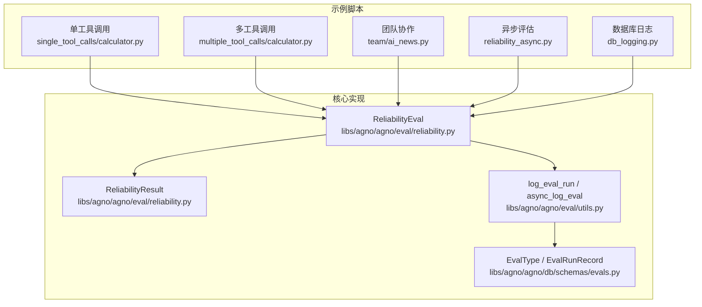
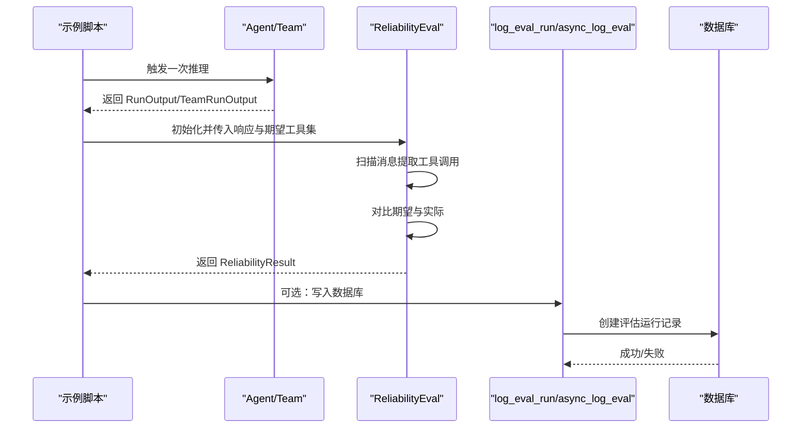
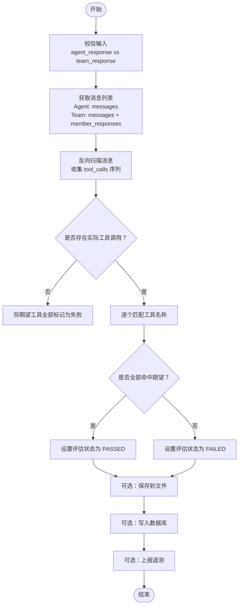
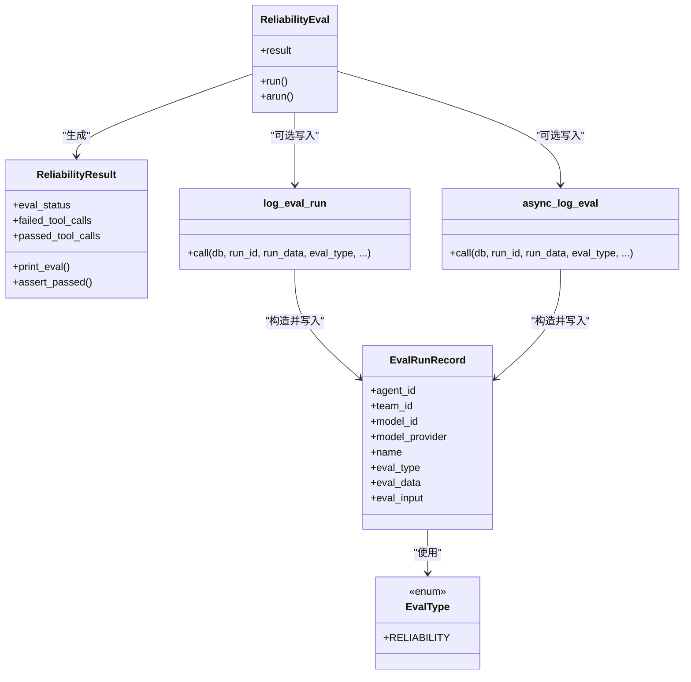
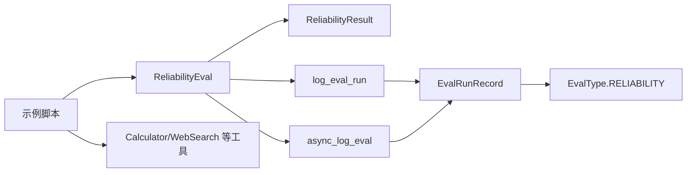

# 可靠性评估

<cite>
**本文引用的文件**
- [libs/agno/agno/eval/reliability.py](file://libs/agno/agno/eval/reliability.py)
- [libs/agno/agno/eval/utils.py](file://libs/agno/agno/eval/utils.py)
- [libs/agno/agno/db/schemas/evals.py](file://libs/agno/agno/db/schemas/evals.py)
- [cookbook/09_evals/reliability/README.md](file://cookbook/09_evals/reliability/README.md)
- [cookbook/09_evals/reliability/db_logging.py](file://cookbook/09_evals/reliability/db_logging.py)
- [cookbook/09_evals/reliability/reliability_async.py](file://cookbook/09_evals/reliability/reliability_async.py)
- [cookbook/09_evals/reliability/single_tool_calls/calculator.py](file://cookbook/09_evals/reliability/single_tool_calls/calculator.py)
- [cookbook/09_evals/reliability/multiple_tool_calls/calculator.py](file://cookbook/09_evals/reliability/multiple_tool_calls/calculator.py)
- [cookbook/09_evals/reliability/team/ai_news.py](file://cookbook/09_evals/reliability/team/ai_news.py)
</cite>

## 目录
1. [简介](#简介)
2. [项目结构](#项目结构)
3. [核心组件](#核心组件)
4. [架构总览](#架构总览)
5. [详细组件分析](#详细组件分析)
6. [依赖分析](#依赖分析)
7. [性能考量](#性能考量)
8. [故障排查指南](#故障排查指南)
9. [结论](#结论)
10. [附录](#附录)

## 简介
本文件围绕“可靠性评估”模块进行系统化说明，目标是帮助读者理解并应用该模块对以下方面进行可靠性评估与改进：
- 系统稳定性：通过工具调用的可重复性与一致性判断系统在不同输入下的稳定表现。
- 错误处理能力：在工具调用缺失或异常时，如何识别失败并输出可诊断信息。
- 容错机制：在部分工具调用失败时，如何定位问题范围并给出修复建议。
- 单工具调用可靠性测试：验证单一工具调用是否符合预期。
- 多工具调用可靠性测试：验证工具链完整性与顺序正确性。
- 团队协作可靠性评估：验证多代理任务委托与协作的稳定性。
- 异步操作可靠性测试：验证异步评估流程的正确性与可观测性。
- 数据库日志记录可靠性：验证评估结果持久化、事务一致性与故障恢复能力。

## 项目结构
可靠性评估模块由“核心评估器 + 示例脚本 + 数据库日志工具”三部分组成：
- 核心评估器：位于 libs/agno/agno/eval/reliability.py，包含可靠性评估主流程与结果封装。
- 示例脚本：位于 cookbook/09_evals/reliability/ 下，覆盖单工具、多工具、团队协作、异步与数据库日志等场景。
- 数据库日志工具：位于 libs/agno/agno/eval/utils.py 与 libs/agno/agno/db/schemas/evals.py，负责将评估结果写入数据库并定义评估记录模型。

图表来源
- [libs/agno/agno/eval/reliability.py:41-316](file://libs/agno/agno/eval/reliability.py#L41-L316)
- [libs/agno/agno/eval/utils.py:16-121](file://libs/agno/agno/eval/utils.py#L16-L121)
- [libs/agno/agno/db/schemas/evals.py:7-35](file://libs/agno/agno/db/schemas/evals.py#L7-L35)
- [cookbook/09_evals/reliability/single_tool_calls/calculator.py:1-41](file://cookbook/09_evals/reliability/single_tool_calls/calculator.py#L1-L41)
- [cookbook/09_evals/reliability/multiple_tool_calls/calculator.py:1-43](file://cookbook/09_evals/reliability/multiple_tool_calls/calculator.py#L1-L43)
- [cookbook/09_evals/reliability/team/ai_news.py:1-59](file://cookbook/09_evals/reliability/team/ai_news.py#L1-L59)
- [cookbook/09_evals/reliability/reliability_async.py:1-45](file://cookbook/09_evals/reliability/reliability_async.py#L1-L45)
- [cookbook/09_evals/reliability/db_logging.py:1-49](file://cookbook/09_evals/reliability/db_logging.py#L1-L49)

章节来源
- [cookbook/09_evals/reliability/README.md:1-12](file://cookbook/09_evals/reliability/README.md#L1-L12)

## 核心组件
- ReliabilityEval：可靠性评估主类，负责扫描消息中的工具调用、对比期望工具集合并生成评估结果；支持同步与异步两种执行方式。
- ReliabilityResult：评估结果数据类，包含评估状态、通过与失败的工具调用列表，并提供打印与断言接口。
- 评估日志工具：log_eval_run（同步）与 async_log_eval（异步），用于将评估结果写入数据库；EvalType.RELIABILITY 与 EvalRunRecord 定义了评估类型与记录结构。
- 示例脚本：演示单工具、多工具、团队协作、异步与数据库日志等典型场景。

章节来源
- [libs/agno/agno/eval/reliability.py:18-316](file://libs/agno/agno/eval/reliability.py#L18-L316)
- [libs/agno/agno/eval/utils.py:16-121](file://libs/agno/agno/eval/utils.py#L16-L121)
- [libs/agno/agno/db/schemas/evals.py:7-35](file://libs/agno/agno/db/schemas/evals.py#L7-L35)

## 架构总览
可靠性评估的整体流程如下：
- 输入：Agent 或 Team 的运行输出（包含消息历史）。
- 扫描：从消息末尾向前扫描，提取工具调用序列。
- 对比：将实际工具调用与期望集合对比，得到通过/失败集合。
- 输出：生成 ReliabilityResult，并可选地打印、保存到文件、写入数据库、上报遥测。

图表来源
- [libs/agno/agno/eval/reliability.py:73-190](file://libs/agno/agno/eval/reliability.py#L73-L190)
- [libs/agno/agno/eval/reliability.py:192-306](file://libs/agno/agno/eval/reliability.py#L192-L306)
- [libs/agno/agno/eval/utils.py:16-102](file://libs/agno/agno/eval/utils.py#L16-L102)

## 详细组件分析

### 组件一：ReliabilityEval 类与评估流程
- 职责：接收 Agent/Team 的运行输出，扫描工具调用，对比期望集合，生成结果并可选持久化与遥测。
- 关键点：
  - 同步/异步双入口：run() 与 arun()，二者流程一致但异步版本支持异步数据库写入。
  - 消息扫描：从消息列表末尾向前遍历，聚合工具调用序列。
  - 结果判定：若存在未在期望集合中的工具调用则失败，否则通过。
  - 可观测性：支持 Rich 进度提示、结果打印、文件保存、数据库写入、遥测上报。

图表来源
- [libs/agno/agno/eval/reliability.py:73-190](file://libs/agno/agno/eval/reliability.py#L73-L190)
- [libs/agno/agno/eval/reliability.py:192-306](file://libs/agno/agno/eval/reliability.py#L192-L306)

章节来源
- [libs/agno/agno/eval/reliability.py:41-316](file://libs/agno/agno/eval/reliability.py#L41-L316)

### 组件二：ReliabilityResult 结果模型
- 字段：评估状态、失败工具调用列表、通过工具调用列表。
- 行为：支持打印表格化摘要与断言通过。

章节来源
- [libs/agno/agno/eval/reliability.py:18-39](file://libs/agno/agno/eval/reliability.py#L18-L39)

### 组件三：数据库日志与遥测
- 同步日志：log_eval_run 将评估运行记录写入数据库。
- 异步日志：async_log_eval 支持同步/异步数据库实例，统一写入接口。
- 记录模型：EvalRunRecord 包含评估类型、运行数据、输入、关联组件标识等字段；EvalType.RELIABILITY 标识可靠性评估类型。

图表来源
- [libs/agno/agno/eval/reliability.py:41-316](file://libs/agno/agno/eval/reliability.py#L41-L316)
- [libs/agno/agno/eval/utils.py:16-121](file://libs/agno/agno/eval/utils.py#L16-L121)
- [libs/agno/agno/db/schemas/evals.py:7-35](file://libs/agno/agno/db/schemas/evals.py#L7-L35)

章节来源
- [libs/agno/agno/eval/utils.py:16-121](file://libs/agno/agno/eval/utils.py#L16-L121)
- [libs/agno/agno/db/schemas/evals.py:7-35](file://libs/agno/agno/db/schemas/evals.py#L7-L35)

### 场景一：单工具调用可靠性测试
- 目标：验证单一工具调用是否符合预期。
- 方法：示例脚本中初始化 Agent 与工具，触发推理后使用 ReliabilityEval 对比期望工具集。
- 关注点：工具名称匹配、消息扫描准确性、结果断言。

章节来源
- [cookbook/09_evals/reliability/single_tool_calls/calculator.py:1-41](file://cookbook/09_evals/reliability/single_tool_calls/calculator.py#L1-L41)

### 场景二：多工具调用可靠性测试
- 目标：验证工具链完整性与顺序正确性。
- 方法：示例脚本中通过逐步推理触发多个工具调用，ReliabilityEval 会按消息顺序收集工具调用并逐一比对。
- 关注点：工具调用顺序、重复调用处理、未命中工具的失败归因。

章节来源
- [cookbook/09_evals/reliability/multiple_tool_calls/calculator.py:1-43](file://cookbook/09_evals/reliability/multiple_tool_calls/calculator.py#L1-L43)

### 场景三：团队协作可靠性评估
- 目标：验证多代理任务委托与协作的稳定性。
- 方法：示例脚本中构建 Team 并配置成员工具，ReliabilityEval 会聚合主响应与成员响应的消息，统一扫描工具调用。
- 关注点：成员响应合并、任务委托工具调用识别、Markdown 呈现与成员响应展示。

章节来源
- [cookbook/09_evals/reliability/team/ai_news.py:1-59](file://cookbook/09_evals/reliability/team/ai_news.py#L1-L59)

### 场景四：异步操作可靠性测试
- 目标：验证异步评估流程的正确性与可观测性。
- 方法：示例脚本中使用 asyncio.run 调用 ReliabilityEval.arun，其余流程与同步一致。
- 关注点：异步数据库写入、异步遥测上报、并发安全性。

章节来源
- [cookbook/09_evals/reliability/reliability_async.py:1-45](file://cookbook/09_evals/reliability/reliability_async.py#L1-L45)

### 场景五：数据库日志记录可靠性
- 目标：验证评估结果持久化、事务一致性与故障恢复能力。
- 方法：示例脚本中初始化 PostgresDb，ReliabilityEval 在完成评估后调用 log_eval_run 写入数据库。
- 关注点：连接可用性、异常捕获与降级、记录完整性。

章节来源
- [cookbook/09_evals/reliability/db_logging.py:1-49](file://cookbook/09_evals/reliability/db_logging.py#L1-L49)
- [libs/agno/agno/eval/utils.py:16-50](file://libs/agno/agno/eval/utils.py#L16-L50)

## 依赖分析
- ReliabilityEval 依赖：
  - 运行输出类型：RunOutput（Agent）、TeamRunOutput（Team）。
  - 结果封装：ReliabilityResult。
  - 日志工具：log_eval_run（同步）与 async_log_eval（异步）。
  - 数据库模式：EvalType.RELIABILITY、EvalRunRecord。
- 示例脚本依赖：
  - Agent/Team：示例脚本中直接创建并运行。
  - 工具：CalculatorTools、WebSearchTools 等。

图表来源
- [libs/agno/agno/eval/reliability.py:41-316](file://libs/agno/agno/eval/reliability.py#L41-L316)
- [libs/agno/agno/eval/utils.py:16-121](file://libs/agno/agno/eval/utils.py#L16-L121)
- [libs/agno/agno/db/schemas/evals.py:7-35](file://libs/agno/agno/db/schemas/evals.py#L7-L35)
- [cookbook/09_evals/reliability/single_tool_calls/calculator.py:1-41](file://cookbook/09_evals/reliability/single_tool_calls/calculator.py#L1-L41)
- [cookbook/09_evals/reliability/multiple_tool_calls/calculator.py:1-43](file://cookbook/09_evals/reliability/multiple_tool_calls/calculator.py#L1-L43)
- [cookbook/09_evals/reliability/team/ai_news.py:1-59](file://cookbook/09_evals/reliability/team/ai_news.py#L1-L59)
- [cookbook/09_evals/reliability/reliability_async.py:1-45](file://cookbook/09_evals/reliability/reliability_async.py#L1-L45)
- [cookbook/09_evals/reliability/db_logging.py:1-49](file://cookbook/09_evals/reliability/db_logging.py#L1-L49)

## 性能考量
- 评估扫描为纯消息遍历，时间复杂度近似 O(M)，M 为消息数量；空间复杂度近似 O(T)，T 为工具调用数量。
- 异步评估在 I/O 密集场景（如数据库写入）下可提升吞吐，CPU 密集场景收益有限。
- 结果打印与文件保存属于轻量 I/O 操作，通常不影响整体性能。
- 建议：
  - 在高并发场景优先使用异步 arun。
  - 控制期望工具集规模，避免过长的工具链导致扫描成本上升。
  - 将数据库写入与文件保存作为可选步骤，在性能敏感场景关闭。

## 故障排查指南
- 常见错误与处理：
  - 输入参数冲突：同时提供 agent_response 与 team_response 或均为空，将抛出明确错误提示。请确保仅提供一个响应对象。
  - 同步 DB 使用异步评估：run() 不支持异步数据库，请改用 arun()。
  - 工具调用缺失：当消息中未检测到工具调用时，失败工具集将包含全部期望工具，便于快速定位。
  - 数据库写入失败：日志工具已捕获异常并记录调试信息，不影响评估主流程。
- 排查步骤：
  - 开启调试模式以查看详细日志。
  - 使用 print_results 打印评估摘要，确认通过/失败工具列表。
  - 使用 file_path_to_save_results 将结果保存到文件，便于离线分析。
  - 检查数据库连接与表结构，确保评估记录可被成功写入。

章节来源
- [libs/agno/agno/eval/reliability.py:73-83](file://libs/agno/agno/eval/reliability.py#L73-L83)
- [libs/agno/agno/eval/reliability.py:74-75](file://libs/agno/agno/eval/reliability.py#L74-L75)
- [libs/agno/agno/eval/reliability.py:116-118](file://libs/agno/agno/eval/reliability.py#L116-L118)
- [libs/agno/agno/eval/utils.py:48-50](file://libs/agno/agno/eval/utils.py#L48-L50)

## 结论
可靠性评估模块通过“消息扫描 + 工具调用对比”的方式，提供了对 Agent/Team 行为的可重复性与一致性验证。其设计具备良好的扩展性与可观测性，既可用于单工具、多工具与团队协作场景，也可通过异步与数据库日志满足高并发与持久化需求。结合本文提供的最佳实践与故障排查建议，可在实际工程中稳定落地并持续改进系统可靠性。

## 附录
- 最佳实践清单
  - 明确期望工具集：确保期望工具名称与实际工具名称严格一致。
  - 分层验证：先进行单工具验证，再扩展到多工具与团队协作。
  - 异步优先：在需要高吞吐的场景使用 arun 与异步数据库。
  - 可观测性：开启调试日志、打印结果与文件保存，必要时启用数据库日志与遥测。
  - 容错设计：对数据库写入失败进行降级处理，保证评估主流程不受影响。
- 参考路径
  - 单工具调用示例：[single_tool_calls/calculator.py:1-41](file://cookbook/09_evals/reliability/single_tool_calls/calculator.py#L1-L41)
  - 多工具调用示例：[multiple_tool_calls/calculator.py:1-43](file://cookbook/09_evals/reliability/multiple_tool_calls/calculator.py#L1-L43)
  - 团队协作示例：[team/ai_news.py:1-59](file://cookbook/09_evals/reliability/team/ai_news.py#L1-L59)
  - 异步评估示例：[reliability_async.py:1-45](file://cookbook/09_evals/reliability/reliability_async.py#L1-L45)
  - 数据库日志示例：[db_logging.py:1-49](file://cookbook/09_evals/reliability/db_logging.py#L1-L49)
  - 核心实现：[reliability.py:1-316](file://libs/agno/agno/eval/reliability.py#L1-L316)
  - 日志工具：[eval/utils.py:1-121](file://libs/agno/agno/eval/utils.py#L1-L121)
  - 数据库模式：[db/schemas/evals.py:1-35](file://libs/agno/agno/db/schemas/evals.py#L1-L35)